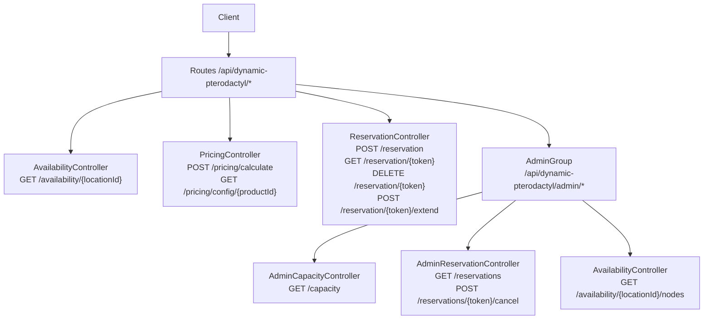
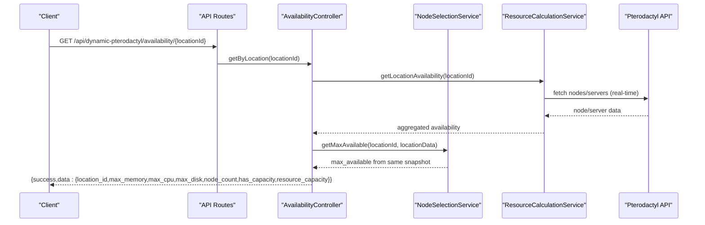
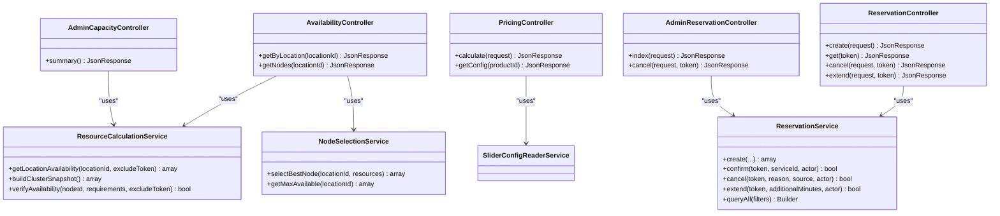

# API Reference

> **Preserved Qoder snapshot.** This deep-dive page is retained so the earlier Wiki work and its source trail are not lost. For the reconciled implementation, [[Architecture Overview|Architecture-Overview]] is canonical; references below to retired controllers, listeners, services, or API shapes are historical.

## Current API Contract

The reconciled extension exposes two quote endpoints and four admin endpoints.
Product quotes are guest-safe web requests protected by CSRF and the configured
quote limiter. Upgrade quotes require the authenticated service owner. Admin
routes require an authenticated Paymenter panel user and the extension's admin
middleware.

| Method and path | Access |
|---|---|
| `POST /api/dynamic-pterodactyl/products/{product}/resource-quote` | Guest-safe web session, throttled |
| `POST /api/dynamic-pterodactyl/services/{service}/upgrade-quote` | Authenticated owner, throttled |
| `GET /api/dynamic-pterodactyl/admin/reservations` | Admin |
| `POST /api/dynamic-pterodactyl/admin/reservations/{token}/cancel` | Admin |
| `GET /api/dynamic-pterodactyl/admin/capacity` | Admin |
| `GET /api/dynamic-pterodactyl/admin/availability/{locationId}/nodes` | Admin |

There are no standalone customer availability, pricing, reservation-create,
reservation-confirm, or reservation-extend endpoints. Customer quote failures
are generic; upstream bodies and internal exception messages are never returned.

[Current routes](https://github.com/ObsidianNetwork/dynamic-pterodactyl/blob/0d0b6169aaef5f44f311f82bae05bbf4060e63c3/routes/api.php)

<cite>
**Referenced Files in This Document**
- [routes/api.php](https://github.com/ObsidianNetwork/dynamic-pterodactyl/blob/0d0b6169aaef5f44f311f82bae05bbf4060e63c3/routes/api.php)
- [AvailabilityController.php](https://github.com/ObsidianNetwork/dynamic-pterodactyl/blob/6b7f83bda6f7c3fe014d52428b31af1638daa6cc/Http/Controllers/Api/AvailabilityController.php)
- [PricingController.php](https://github.com/ObsidianNetwork/dynamic-pterodactyl/blob/6b7f83bda6f7c3fe014d52428b31af1638daa6cc/Http/Controllers/Api/PricingController.php)
- [ReservationController.php](https://github.com/ObsidianNetwork/dynamic-pterodactyl/blob/6b7f83bda6f7c3fe014d52428b31af1638daa6cc/Http/Controllers/Api/ReservationController.php)
- [AdminCapacityController.php](https://github.com/ObsidianNetwork/dynamic-pterodactyl/blob/6b7f83bda6f7c3fe014d52428b31af1638daa6cc/Http/Controllers/Api/Admin/AdminCapacityController.php)
- [AdminReservationController.php](https://github.com/ObsidianNetwork/dynamic-pterodactyl/blob/6b7f83bda6f7c3fe014d52428b31af1638daa6cc/Http/Controllers/Api/Admin/AdminReservationController.php)
- [StoreReservationRequest.php](https://github.com/ObsidianNetwork/dynamic-pterodactyl/blob/6b7f83bda6f7c3fe014d52428b31af1638daa6cc/Http/Requests/StoreReservationRequest.php)
- [EnsureUserIsAdmin.php](https://github.com/ObsidianNetwork/dynamic-pterodactyl/blob/6b7f83bda6f7c3fe014d52428b31af1638daa6cc/Http/Middleware/EnsureUserIsAdmin.php)
- [ResourceReservationPolicy.php](https://github.com/ObsidianNetwork/dynamic-pterodactyl/blob/6b7f83bda6f7c3fe014d52428b31af1638daa6cc/Policies/ResourceReservationPolicy.php)
- [ReservationService.php](https://github.com/ObsidianNetwork/dynamic-pterodactyl/blob/6b7f83bda6f7c3fe014d52428b31af1638daa6cc/Services/ReservationService.php)
- [ResourceCalculationService.php](https://github.com/ObsidianNetwork/dynamic-pterodactyl/blob/6b7f83bda6f7c3fe014d52428b31af1638daa6cc/Services/ResourceCalculationService.php)
- [ResourceReservation.php](https://github.com/ObsidianNetwork/dynamic-pterodactyl/blob/6b7f83bda6f7c3fe014d52428b31af1638daa6cc/Models/ResourceReservation.php)
</cite>

## Table of Contents
1. [Introduction](#introduction)
2. [Project Structure](#project-structure)
3. [Core Components](#core-components)
4. [Architecture Overview](#architecture-overview)
5. [Detailed Component Analysis](#detailed-component-analysis)
6. [Dependency Analysis](#dependency-analysis)
7. [Performance Considerations](#performance-considerations)
8. [Troubleshooting Guide](#troubleshooting-guide)
9. [Conclusion](#conclusion)
10. [Appendices](#appendices)

## Introduction
This document specifies the RESTful API surface exposed by the Dynamic Pterodactyl extension for both customer-facing and administrative operations. It covers availability checking, pricing calculation, reservation management, and admin capacity monitoring. For each endpoint, it provides HTTP methods, URL patterns, authentication requirements, request/response schemas, error codes, rate limits, and implementation guidance.

Key design principles:
- Customer-facing endpoints expose only aggregate availability per location; node-level details are admin-only.
- Pricing is delegated to Paymenter core’s dynamic slider logic; this extension reads configuration and returns pricing deltas and totals.
- Reservations use a strict lifecycle (pending → confirmed | expired | cancelled) with pessimistic locking and idempotency support.
- All external calls to Pterodactyl are real-time and uncached.

## Project Structure
The API routes are defined centrally and grouped by purpose and access control:
- Public availability and pricing under a shared auth/throttle group.
- Reservation endpoints under checkout middleware with stricter throttling.
- Admin endpoints behind an admin-only middleware and throttle.

**Diagram sources**
- [routes/api.php:17-40](https://github.com/ObsidianNetwork/dynamic-pterodactyl/blob/0d0b6169aaef5f44f311f82bae05bbf4060e63c3/routes/api.php#L17-L40)

**Section sources**
- [routes/api.php:1-40](https://github.com/ObsidianNetwork/dynamic-pterodactyl/blob/0d0b6169aaef5f44f311f82bae05bbf4060e63c3/routes/api.php#L1-L40)

## Core Components
- AvailabilityController: Returns per-location availability aggregates and, when authenticated as admin, detailed node information.
- PricingController: Reads configured dynamic sliders for a product and computes price breakdowns using Paymenter core.
- ReservationController: Creates, retrieves, cancels, and extends reservations with authorization checks and idempotency.
- AdminCapacityController: Builds a cluster snapshot including per-node capacity and utilization for admin dashboards.
- AdminReservationController: Lists and cancels reservations with filtering and pagination.

**Section sources**
- [AvailabilityController.php:9-70](https://github.com/ObsidianNetwork/dynamic-pterodactyl/blob/6b7f83bda6f7c3fe014d52428b31af1638daa6cc/Http/Controllers/Api/AvailabilityController.php#L9-L70)
- [PricingController.php:12-157](https://github.com/ObsidianNetwork/dynamic-pterodactyl/blob/6b7f83bda6f7c3fe014d52428b31af1638daa6cc/Http/Controllers/Api/PricingController.php#L12-L157)
- [ReservationController.php:13-137](https://github.com/ObsidianNetwork/dynamic-pterodactyl/blob/6b7f83bda6f7c3fe014d52428b31af1638daa6cc/Http/Controllers/Api/ReservationController.php#L13-L137)
- [AdminCapacityController.php:8-62](https://github.com/ObsidianNetwork/dynamic-pterodactyl/blob/6b7f83bda6f7c3fe014d52428b31af1638daa6cc/Http/Controllers/Api/Admin/AdminCapacityController.php#L8-L62)
- [AdminReservationController.php:9-75](https://github.com/ObsidianNetwork/dynamic-pterodactyl/blob/6b7f83bda6f7c3fe014d52428b31af1638daa6cc/Http/Controllers/Api/Admin/AdminReservationController.php#L9-L75)

## Architecture Overview
The API integrates with Paymenter core models and services and with the Pterodactyl panel via HTTP. Services encapsulate business logic and data aggregation.

**Diagram sources**
- [routes/api.php:17-22](https://github.com/ObsidianNetwork/dynamic-pterodactyl/blob/0d0b6169aaef5f44f311f82bae05bbf4060e63c3/routes/api.php#L17-L22)
- [AvailabilityController.php:22-52](https://github.com/ObsidianNetwork/dynamic-pterodactyl/blob/6b7f83bda6f7c3fe014d52428b31af1638daa6cc/Http/Controllers/Api/AvailabilityController.php#L22-L52)
- [ResourceCalculationService.php:26-67](https://github.com/ObsidianNetwork/dynamic-pterodactyl/blob/6b7f83bda6f7c3fe014d52428b31af1638daa6cc/Services/ResourceCalculationService.php#L26-L67)

**Section sources**
- [AvailabilityController.php:22-52](https://github.com/ObsidianNetwork/dynamic-pterodactyl/blob/6b7f83bda6f7c3fe014d52428b31af1638daa6cc/Http/Controllers/Api/AvailabilityController.php#L22-L52)
- [ResourceCalculationService.php:26-67](https://github.com/ObsidianNetwork/dynamic-pterodactyl/blob/6b7f83bda6f7c3fe014d52428b31af1638daa6cc/Services/ResourceCalculationService.php#L26-L67)

## Detailed Component Analysis

### Authentication and Authorization
- Public endpoints require web session authentication and apply rate limiting.
- Reservation endpoints additionally require checkout context and stricter throttling.
- Admin endpoints require an authenticated user with a non-null role and pass through EnsureUserIsAdmin middleware.
- Resource-level authorization uses ResourceReservationPolicy to enforce ownership for view/cancel/extend actions.

**Section sources**
- [routes/api.php:17-40](https://github.com/ObsidianNetwork/dynamic-pterodactyl/blob/0d0b6169aaef5f44f311f82bae05bbf4060e63c3/routes/api.php#L17-L40)
- [EnsureUserIsAdmin.php:9-22](https://github.com/ObsidianNetwork/dynamic-pterodactyl/blob/6b7f83bda6f7c3fe014d52428b31af1638daa6cc/Http/Middleware/EnsureUserIsAdmin.php#L9-L22)
- [ResourceReservationPolicy.php:9-69](https://github.com/ObsidianNetwork/dynamic-pterodactyl/blob/6b7f83bda6f7c3fe014d52428b31af1638daa6cc/Policies/ResourceReservationPolicy.php#L9-L69)

### Rate Limiting
- Availability and pricing: 30 requests per minute per client.
- Reservations: 10 requests per minute per client.
- Admin endpoints: 30 requests per minute per client.

**Section sources**
- [routes/api.php:17-40](https://github.com/ObsidianNetwork/dynamic-pterodactyl/blob/0d0b6169aaef5f44f311f82bae05bbf4060e63c3/routes/api.php#L17-L40)

### Endpoints

#### Availability
- GET /api/dynamic-pterodactyl/availability/{locationId}
  - Auth: web + auth
  - Throttle: 30/min
  - Path params:
    - locationId: integer
  - Response schema:
    - success: boolean
    - data:
      - location_id: integer
      - max_memory: integer
      - max_cpu: integer
      - max_disk: integer
      - node_count: integer
      - has_capacity: boolean
      - resource_capacity: object with memory/cpu/disk booleans
  - Errors:
    - 500: failure to fetch availability (returns only the generic message; exception details are reported server-side)

- GET /api/dynamic-pterodactyl/admin/availability/{locationId}/nodes
  - Auth: web + auth + admin
  - Throttle: 30/min
  - Path params:
    - locationId: integer
  - Response schema:
    - success: boolean
    - data: location availability payload including nodes array and aggregates
  - Errors:
    - 500: failure to fetch node details

Notes:
- Customer-facing availability returns only aggregate metrics per location.
- Node-level detail (including names and per-node capacity) is restricted to admin.

**Section sources**
- [routes/api.php:17-40](https://github.com/ObsidianNetwork/dynamic-pterodactyl/blob/0d0b6169aaef5f44f311f82bae05bbf4060e63c3/routes/api.php#L17-L40)
- [AvailabilityController.php:22-69](https://github.com/ObsidianNetwork/dynamic-pterodactyl/blob/6b7f83bda6f7c3fe014d52428b31af1638daa6cc/Http/Controllers/Api/AvailabilityController.php#L22-L69)

#### Pricing
- POST /api/dynamic-pterodactyl/pricing/calculate
  - Auth: web + auth
  - Throttle: 30/min
  - Request body:
    - product_id: integer, required, must exist
    - plan_id: integer, optional, must belong to product or default to first plan
    - resource fields: one or more of memory, cpu, disk; required if configured for the product; values must be integers within configured min/max/step
  - Response schema:
    - success: boolean
    - data:
      - total: number (rounded to 2 decimals)
      - breakdown: array of objects with resource_type, label, value, display_value, price, pricing_model
      - model: string (e.g., linear)
  - Errors:
    - 404: product not configured for dynamic pricing
    - 422: invalid plan or missing/invalid slider fields
    - 500: calculation failed (error field present only in debug mode)

- GET /api/dynamic-pterodactyl/pricing/config/{productId}
  - Auth: web + auth
  - Throttle: 30/min
  - Path params:
    - productId: integer
  - Response schema:
    - success: boolean
    - data:
      - product_id: integer
      - sliders: array describing configured dynamic sliders
  - Errors:
    - 404: no dynamic slider config options found for this product

Important:
- This extension does not compute prices itself; it delegates to Paymenter core’s dynamic slider pricing.

**Section sources**
- [routes/api.php:17-22](https://github.com/ObsidianNetwork/dynamic-pterodactyl/blob/0d0b6169aaef5f44f311f82bae05bbf4060e63c3/routes/api.php#L17-L22)
- [PricingController.php:24-157](https://github.com/ObsidianNetwork/dynamic-pterodactyl/blob/6b7f83bda6f7c3fe014d52428b31af1638daa6cc/Http/Controllers/Api/PricingController.php#L24-L157)
- [StoreReservationRequest.php:38-112](https://github.com/ObsidianNetwork/dynamic-pterodactyl/blob/6b7f83bda6f7c3fe014d52428b31af1638daa6cc/Http/Requests/StoreReservationRequest.php#L38-L112)

#### Reservations
- POST /api/dynamic-pterodactyl/reservation
  - Auth: web + checkout
  - Throttle: 10/min
  - Request body:
    - product_id: integer, required, must exist
    - location_id: integer, required
    - memory: integer, optional, min 0
    - cpu: integer, optional, min 0
    - disk: integer, optional, min 0
    - cart_item_id: integer, optional, must exist
    - idempotency_key: string, optional, regex pattern enforced
  - Behavior:
    - Validates that the product supports dynamic reservations and that all configured resource sliders are provided with valid ranges/steps.
    - Selects best node based on resources and location.
    - Creates a pending reservation with a token and TTL.
    - Supports idempotent creation via idempotency_key; duplicate keys return existing active reservation.
  - Response schema:
    - success: boolean
    - data:
      - id: integer
      - token: string
      - node_id: integer
      - node_name: string|null
      - expires_at: ISO-8601 datetime
      - ttl_minutes: integer (remaining TTL while pending)
      - pricing:
        - total: number
        - breakdown: array
        - model: string ("stored")
      - status: "pending"
  - Errors:
    - 422: validation failures or runtime issues during creation
    - 500: unexpected server error

- GET /api/dynamic-pterodactyl/reservation/{token}
  - Auth: web + checkout
  - Throttle: 10/min
  - Path params:
    - token: string
  - Authorization: owner-only via policy
  - Response schema:
    - success: boolean
    - data: reservation object (same shape as create response)
  - Errors:
    - 404: reservation not found

- DELETE /api/dynamic-pterodactyl/reservation/{token}
  - Auth: web + checkout
  - Throttle: 10/min
  - Path params:
    - token: string
  - Authorization: owner-only via policy
  - Response schema:
    - success: boolean
    - message: string
  - Errors:
    - 404: reservation not found

- POST /api/dynamic-pterodactyl/reservation/{token}/extend
  - Auth: web + checkout
  - Throttle: 10/min
  - Path params:
    - token: string
  - Request body:
    - minutes: integer, min 1, max 60
  - Authorization: owner-only via policy
  - Response schema:
    - success: boolean
    - data:
      - expires_at: ISO-8601 datetime
  - Errors:
    - 404: reservation not found
    - 500: extend failed

Notes:
- Guest users can create reservations before login; user_id may be null until later association.
- Reservation lifecycle is strictly pending → confirmed | expired | cancelled.

**Section sources**
- [routes/api.php:24-30](https://github.com/ObsidianNetwork/dynamic-pterodactyl/blob/0d0b6169aaef5f44f311f82bae05bbf4060e63c3/routes/api.php#L24-L30)
- [ReservationController.php:24-137](https://github.com/ObsidianNetwork/dynamic-pterodactyl/blob/6b7f83bda6f7c3fe014d52428b31af1638daa6cc/Http/Controllers/Api/ReservationController.php#L24-L137)
- [StoreReservationRequest.php:10-162](https://github.com/ObsidianNetwork/dynamic-pterodactyl/blob/6b7f83bda6f7c3fe014d52428b31af1638daa6cc/Http/Requests/StoreReservationRequest.php#L10-L162)
- [ReservationService.php:43-141](https://github.com/ObsidianNetwork/dynamic-pterodactyl/blob/6b7f83bda6f7c3fe014d52428b31af1638daa6cc/Services/ReservationService.php#L43-L141)
- [ResourceReservationPolicy.php:25-58](https://github.com/ObsidianNetwork/dynamic-pterodactyl/blob/6b7f83bda6f7c3fe014d52428b31af1638daa6cc/Policies/ResourceReservationPolicy.php#L25-L58)

#### Admin Capacity
- GET /api/dynamic-pterodactyl/admin/capacity
  - Auth: web + auth + admin
  - Throttle: 30/min
  - Response schema:
    - success: boolean
    - data:
      - locations: array of location summaries including:
        - id: integer
        - name: string
        - short: string
        - nodes: array of node_availability objects
        - totals:
          - capacity: object with memory/cpu/disk
          - allocated: object with memory/cpu/disk
      - generated_at: ISO-8601 datetime
      - error: string|null (present when degraded)
  - Errors:
    - 503: failed to fetch capacity

Notes:
- Aggregates include per-node availability derived from Pterodactyl servers and pending reservations.

**Section sources**
- [routes/api.php:32-40](https://github.com/ObsidianNetwork/dynamic-pterodactyl/blob/0d0b6169aaef5f44f311f82bae05bbf4060e63c3/routes/api.php#L32-L40)
- [AdminCapacityController.php:17-62](https://github.com/ObsidianNetwork/dynamic-pterodactyl/blob/6b7f83bda6f7c3fe014d52428b31af1638daa6cc/Http/Controllers/Api/Admin/AdminCapacityController.php#L17-L62)
- [ResourceCalculationService.php:69-141](https://github.com/ObsidianNetwork/dynamic-pterodactyl/blob/6b7f83bda6f7c3fe014d52428b31af1638daa6cc/Services/ResourceCalculationService.php#L69-L141)

#### Admin Reservations
- GET /api/dynamic-pterodactyl/admin/reservations
  - Auth: web + auth + admin
  - Throttle: 30/min
  - Query parameters:
    - status: enum ["pending","confirmed","cancelled","expired"], optional
    - location_id: integer, optional
    - node_id: integer, optional
    - user_id: integer, optional
    - per_page: integer, min 1, max 100, default 25
  - Response schema:
    - success: boolean
    - data: paginated list of reservations
  - Errors:
    - Validation errors for invalid filters

- POST /api/dynamic-pterodactyl/admin/reservations/{token}/cancel
  - Auth: web + auth + admin
  - Throttle: 30/min
  - Path params:
    - token: string
  - Request body:
    - reason: string, required, max 500
  - Response schema:
    - success: boolean
    - message: string
  - Errors:
    - 404: reservation not found
    - 409: reservation not in pending state or status changed concurrently

**Section sources**
- [routes/api.php:32-40](https://github.com/ObsidianNetwork/dynamic-pterodactyl/blob/0d0b6169aaef5f44f311f82bae05bbf4060e63c3/routes/api.php#L32-L40)
- [AdminReservationController.php:18-75](https://github.com/ObsidianNetwork/dynamic-pterodactyl/blob/6b7f83bda6f7c3fe014d52428b31af1638daa6cc/Http/Controllers/Api/Admin/AdminReservationController.php#L18-L75)
- [ReservationService.php:208-241](https://github.com/ObsidianNetwork/dynamic-pterodactyl/blob/6b7f83bda6f7c3fe014d52428b31af1638daa6cc/Services/ReservationService.php#L208-L241)

## Dependency Analysis
The controllers depend on services for business logic and data aggregation. The following diagram shows key dependencies between controllers and services.

**Diagram sources**
- [AvailabilityController.php:9-20](https://github.com/ObsidianNetwork/dynamic-pterodactyl/blob/6b7f83bda6f7c3fe014d52428b31af1638daa6cc/Http/Controllers/Api/AvailabilityController.php#L9-L20)
- [PricingController.php:12-19](https://github.com/ObsidianNetwork/dynamic-pterodactyl/blob/6b7f83bda6f7c3fe014d52428b31af1638daa6cc/Http/Controllers/Api/PricingController.php#L12-L19)
- [ReservationController.php:13-22](https://github.com/ObsidianNetwork/dynamic-pterodactyl/blob/6b7f83bda6f7c3fe014d52428b31af1638daa6cc/Http/Controllers/Api/ReservationController.php#L13-L22)
- [AdminCapacityController.php:8-15](https://github.com/ObsidianNetwork/dynamic-pterodactyl/blob/6b7f83bda6f7c3fe014d52428b31af1638daa6cc/Http/Controllers/Api/Admin/AdminCapacityController.php#L8-L15)
- [AdminReservationController.php:9-16](https://github.com/ObsidianNetwork/dynamic-pterodactyl/blob/6b7f83bda6f7c3fe014d52428b31af1638daa6cc/Http/Controllers/Api/Admin/AdminReservationController.php#L9-L16)
- [ResourceCalculationService.php:10-21](https://github.com/ObsidianNetwork/dynamic-pterodactyl/blob/6b7f83bda6f7c3fe014d52428b31af1638daa6cc/Services/ResourceCalculationService.php#L10-L21)
- [ReservationService.php:16-35](https://github.com/ObsidianNetwork/dynamic-pterodactyl/blob/6b7f83bda6f7c3fe014d52428b31af1638daa6cc/Services/ReservationService.php#L16-L35)

**Section sources**
- [AvailabilityController.php:9-20](https://github.com/ObsidianNetwork/dynamic-pterodactyl/blob/6b7f83bda6f7c3fe014d52428b31af1638daa6cc/Http/Controllers/Api/AvailabilityController.php#L9-L20)
- [PricingController.php:12-19](https://github.com/ObsidianNetwork/dynamic-pterodactyl/blob/6b7f83bda6f7c3fe014d52428b31af1638daa6cc/Http/Controllers/Api/PricingController.php#L12-L19)
- [ReservationController.php:13-22](https://github.com/ObsidianNetwork/dynamic-pterodactyl/blob/6b7f83bda6f7c3fe014d52428b31af1638daa6cc/Http/Controllers/Api/ReservationController.php#L13-L22)
- [AdminCapacityController.php:8-15](https://github.com/ObsidianNetwork/dynamic-pterodactyl/blob/6b7f83bda6f7c3fe014d52428b31af1638daa6cc/Http/Controllers/Api/Admin/AdminCapacityController.php#L8-L15)
- [AdminReservationController.php:9-16](https://github.com/ObsidianNetwork/dynamic-pterodactyl/blob/6b7f83bda6f7c3fe014d52428b31af1638daa6cc/Http/Controllers/Api/Admin/AdminReservationController.php#L9-L16)
- [ResourceCalculationService.php:10-21](https://github.com/ObsidianNetwork/dynamic-pterodactyl/blob/6b7f83bda6f7c3fe014d52428b31af1638daa6cc/Services/ResourceCalculationService.php#L10-L21)
- [ReservationService.php:16-35](https://github.com/ObsidianNetwork/dynamic-pterodactyl/blob/6b7f83bda6f7c3fe014d52428b31af1638daa6cc/Services/ReservationService.php#L16-L35)

## Performance Considerations
- Real-time Pterodactyl API calls are made without caching to ensure accurate availability.
- ResourceCalculationService batches API calls where possible (e.g., fetching nodes with included servers).
- Rate limiting protects against excessive calls to Pterodactyl and reduces risk of rate-limiting by upstream services.
- Reservation creation uses pessimistic DB locks with retry on deadlocks to maintain consistency under concurrency.

[No sources needed since this section provides general guidance]

## Troubleshooting Guide
Common errors and their meanings:
- 404 Not Found: Product not configured for dynamic pricing; reservation not found; no dynamic slider config.
- 422 Unprocessable Entity: Invalid input, missing required slider fields, invalid plan, or runtime validation failure during reservation creation.
- 409 Conflict: Attempted cancellation of a reservation not in pending state or concurrent status change.
- 429 Too Many Requests: Exceeded rate limit for the endpoint group.
- 500 Internal Server Error: Unexpected failure in pricing calculation or reservation creation; error details may be omitted in production unless debug is enabled.
- 503 Service Unavailable: Failed to fetch capacity summary due to upstream errors.

Operational notes:
- Admin capacity endpoint may return a degraded snapshot with an error field when Pterodactyl is unavailable.
- Reservation creation supports idempotency via Idempotency-Key header or request body field; duplicates return the existing active reservation.

**Section sources**
- [PricingController.php:104-121](https://github.com/ObsidianNetwork/dynamic-pterodactyl/blob/6b7f83bda6f7c3fe014d52428b31af1638daa6cc/Http/Controllers/Api/PricingController.php#L104-L121)
- [ReservationController.php:49-59](https://github.com/ObsidianNetwork/dynamic-pterodactyl/blob/6b7f83bda6f7c3fe014d52428b31af1638daa6cc/Http/Controllers/Api/ReservationController.php#L49-L59)
- [AdminReservationController.php:51-73](https://github.com/ObsidianNetwork/dynamic-pterodactyl/blob/6b7f83bda6f7c3fe014d52428b31af1638daa6cc/Http/Controllers/Api/Admin/AdminReservationController.php#L51-L73)
- [AdminCapacityController.php:53-60](https://github.com/ObsidianNetwork/dynamic-pterodactyl/blob/6b7f83bda6f7c3fe014d52428b31af1638daa6cc/Http/Controllers/Api/Admin/AdminCapacityController.php#L53-L60)
- [ResourceCalculationService.php:403-417](https://github.com/ObsidianNetwork/dynamic-pterodactyl/blob/6b7f83bda6f7c3fe014d52428b31af1638daa6cc/Services/ResourceCalculationService.php#L403-L417)

## Conclusion
The Dynamic Pterodactyl extension exposes a focused set of APIs for availability, pricing, and reservation management with clear separation between customer-facing and admin-only capabilities. Customer endpoints provide safe, aggregate data while protecting sensitive node-level details. Admin endpoints enable operational visibility and control over capacity and reservations. Robust rate limiting, authorization, and idempotency mechanisms help ensure reliability and security.

[No sources needed since this section summarizes without analyzing specific files]

## Appendices

### Request/Response Examples

- Get availability for a location
  - Method: GET
  - URL: /api/dynamic-pterodactyl/availability/1
  - Auth: web + auth
  - Success response example:
    - { "success": true, "data": { "location_id": 1, "max_memory": 16384, "max_cpu": 400, "max_disk": 512000, "node_count": 3, "has_capacity": true, "resource_capacity": { "memory": true, "cpu": true, "disk": true } } }

- Calculate pricing for a product with sliders
  - Method: POST
  - URL: /api/dynamic-pterodactyl/pricing/calculate
  - Auth: web + auth
  - Body example:
    - { "product_id": 10, "plan_id": 2, "memory": 8192, "cpu": 200, "disk": 102400 }
  - Success response example:
    - { "success": true, "data": { "total": 12.34, "breakdown": [{ "resource_type": "memory", "label": "Memory", "value": 8192, "display_value": "8 GB", "price": 8.00, "pricing_model": "linear" }, { "resource_type": "cpu", "label": "CPU", "value": 200, "display_value": "2 vCPU", "price": 4.34, "pricing_model": "linear" }], "model": "linear" } }

- Create a reservation
  - Method: POST
  - URL: /api/dynamic-pterodactyl/reservation
  - Auth: web + checkout
  - Body example:
    - { "product_id": 10, "location_id": 1, "memory": 8192, "cpu": 200, "disk": 102400, "idempotency_key": "abc-123-def" }
  - Success response example:
    - { "success": true, "data": { "id": 123, "token": "aBcDeFgHiJkLmNoPqRsTuVwXyZ...", "node_id": 5, "node_name": "node-alpha", "expires_at": "2026-01-01T12:15:00Z", "ttl_minutes": 15, "pricing": { "total": 0, "breakdown": [], "model": "stored" }, "status": "pending" } }

- Extend a reservation
  - Method: POST
  - URL: /api/dynamic-pterodactyl/reservation/{token}/extend
  - Auth: web + checkout
  - Body example:
    - { "minutes": 15 }
  - Success response example:
    - { "success": true, "data": { "expires_at": "2026-01-01T12:30:00Z" } }

- Admin capacity summary
  - Method: GET
  - URL: /api/dynamic-pterodactyl/admin/capacity
  - Auth: web + auth + admin
  - Success response example:
    - { "success": true, "data": { "locations": [{ "id": 1, "name": "US East", "short": "USE", "nodes": [...], "totals": { "capacity": { "memory": 65536, "cpu": 1200, "disk": 1536000 }, "allocated": { "memory": 32768, "cpu": 600, "disk": 768000 } } }], "generated_at": "2026-01-01T12:00:00Z", "error": null } }

- Admin cancel reservation
  - Method: POST
  - URL: /api/dynamic-pterodactyl/admin/reservations/{token}/cancel
  - Auth: web + auth + admin
  - Body example:
    - { "reason": "Insufficient funds" }
  - Success response example:
    - { "success": true, "message": "Reservation cancelled" }

[No sources needed since this section provides conceptual examples]

### Security Considerations
- Enforce HTTPS for all API calls.
- Use strong secrets for any tokens stored or transmitted.
- Respect rate limits to avoid being blocked by upstream services.
- Validate inputs on the client side but rely on server-side validation and authorization.
- Do not expose node-level details to customers; use admin endpoints for internal tools only.

[No sources needed since this section provides general guidance]
