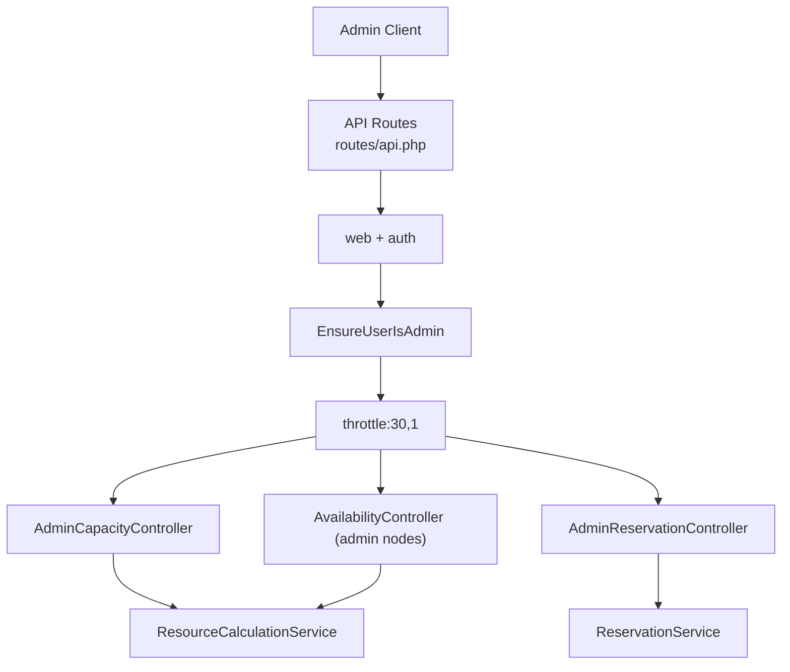
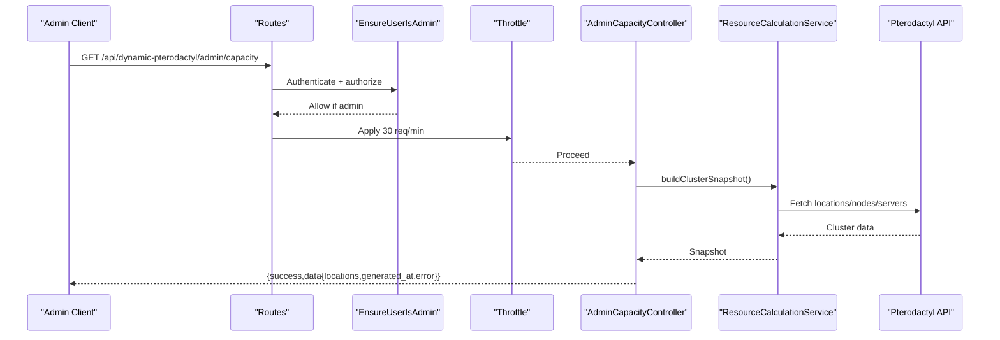
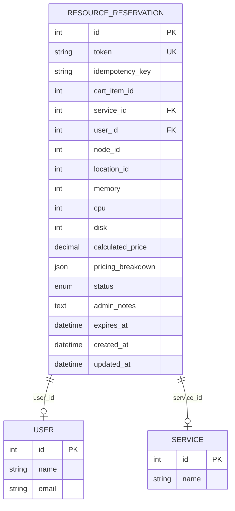
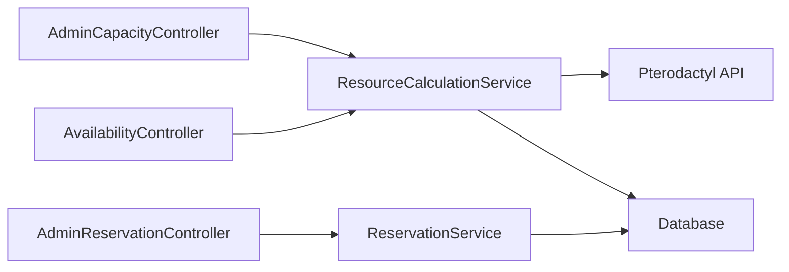

# Admin API Endpoints

<cite>
**Referenced Files in This Document**
- [api.php](file://routes/api.php)
- [EnsureUserIsAdmin.php](file://Http/Middleware/EnsureUserIsAdmin.php)
- [AdminCapacityController.php](file://Http/Controllers/Api/Admin/AdminCapacityController.php)
- [AdminReservationController.php](file://Http/Controllers/Api/Admin/AdminReservationController.php)
- [AvailabilityController.php](file://Http/Controllers/Api/AvailabilityController.php)
- [ResourceCalculationService.php](file://Services/ResourceCalculationService.php)
- [ReservationService.php](file://Services/ReservationService.php)
- [ResourceReservation.php](file://Models/ResourceReservation.php)
- [ResourceReservationPolicy.php](file://Policies/ResourceReservationPolicy.php)
- [AdminApiTest.php](file://tests/Feature/AdminApiTest.php)
</cite>

## Table of Contents
1. Introduction
2. Project Structure
3. Core Components
4. Architecture Overview
5. Detailed Component Analysis
6. Dependency Analysis
7. Performance Considerations
8. Troubleshooting Guide
9. Conclusion

## Introduction
This document specifies the administrative API endpoints for system monitoring and management within the DynamicPterodactyl extension. It covers:
- Capacity monitoring endpoints that expose node-level utilization metrics
- Reservation management endpoints for administrative intervention
- Availability inspection endpoints for troubleshooting

All admin endpoints are session-authenticated, require an admin role via EnsureUserIsAdmin middleware, and are rate-limited to 30 requests per minute. Customer-facing endpoints return only aggregate data; node-level details are restricted to administrators.

## Project Structure
The admin API is defined under a single routes file and grouped with authentication, admin authorization, and throttling middleware. Controllers delegate to services that call Pterodactyl’s API and read reservation state from the database.

**Diagram sources**
- [api.php:32-40](file://routes/api.php#L32-L40)
- [EnsureUserIsAdmin.php:11-21](file://Http/Middleware/EnsureUserIsAdmin.php#L11-L21)
- [AdminCapacityController.php:17-61](file://Http/Controllers/Api/Admin/AdminCapacityController.php#L17-L61)
- [AdminReservationController.php:18-74](file://Http/Controllers/Api/Admin/AdminReservationController.php#L18-L74)
- [AvailabilityController.php:54-69](file://Http/Controllers/Api/AvailabilityController.php#L54-L69)
- [ResourceCalculationService.php:69-141](file://Services/ResourceCalculationService.php#L69-L141)
- [ReservationService.php:312-330](file://Services/ReservationService.php#L312-L330)

**Section sources**
- [api.php:17-40](file://routes/api.php#L17-L40)

## Core Components
- Admin capacity endpoint returns a cluster snapshot including per-location summaries and per-node availability derived from Pterodactyl and pending reservations.
- Admin reservation endpoints list and cancel reservations with validation and status checks.
- Admin availability endpoint exposes per-node details for troubleshooting.

Security and access control:
- All admin routes use web + auth + EnsureUserIsAdmin + throttle:30,1.
- Non-admin users receive a 403 response with a consistent JSON error shape.
- Policies enforce user ownership for non-admin operations on reservations; admin panel users bypass these policies.

Rate limiting:
- Admin endpoints: 30 requests per minute.
- Customer-facing endpoints: separate lower limits where applicable.

**Section sources**
- [api.php:32-40](file://routes/api.php#L32-L40)
- [EnsureUserIsAdmin.php:11-21](file://Http/Middleware/EnsureUserIsAdmin.php#L11-L21)
- [ResourceReservationPolicy.php:14-23](file://Policies/ResourceReservationPolicy.php#L14-L23)
- [AdminApiTest.php:52-66](file://tests/Feature/AdminApiTest.php#L52-L66)

## Architecture Overview
The admin API follows a layered design:
- Routes group endpoints with shared middleware for authentication, authorization, and throttling.
- Controllers validate inputs and delegate to services.
- Services coordinate external calls to Pterodactyl and internal DB queries to compute availability and manage reservations.
- Responses follow a consistent envelope with success/data or success/message/error fields.

**Diagram sources**
- [api.php:32-40](file://routes/api.php#L32-L40)
- [EnsureUserIsAdmin.php:11-21](file://Http/Middleware/EnsureUserIsAdmin.php#L11-L21)
- [AdminCapacityController.php:17-61](file://Http/Controllers/Api/Admin/AdminCapacityController.php#L17-L61)
- [ResourceCalculationService.php:69-141](file://Services/ResourceCalculationService.php#L69-L141)

## Detailed Component Analysis

### Capacity Monitoring: GET /api/dynamic-pterodactyl/admin/capacity
- Purpose: Return a real-time cluster snapshot including per-location summaries and per-node availability.
- Authentication: Session-based auth + EnsureUserIsAdmin.
- Rate limit: 30 req/min.
- Request: None.
- Response schema:
  - success: boolean
  - data:
    - locations: array of location summaries
      - id: integer
      - name: string (long name)
      - short: string (short code)
      - nodes: array of node_availability objects per node in the location
        - node_id: integer
        - name: string
        - fqdn: string
        - maintenance_mode: boolean
        - total: { memory: int, cpu: int, disk: int }
        - allocated: { memory: int, cpu: int, disk: int }
        - reserved: { memory: int, cpu: int, disk: int }
        - available: { memory: int, cpu: int, disk: int }
        - server_count: integer
        - utilization: { memory: float, disk: float }
      - totals: { capacity: { memory, cpu, disk }, allocated: { memory, cpu, disk } }
    - generated_at: ISO-8601 timestamp
    - error: string|null (present when degraded)
- Error handling: On failure, returns success:false with message and HTTP 503.

Example request:
- Method: GET
- URL: /api/dynamic-pterodactyl/admin/capacity
- Headers: Cookie (session), Authorization not required (session-based)

Example response (success):
- {
    "success": true,
    "data": {
      "locations": [ ... ],
      "generated_at": "2025-01-01T00:00:00Z",
      "error": null
    }
  }

Example response (degraded):
- {
    "success": false,
    "message": "Failed to fetch capacity"
  }

Notes:
- Node-level details (including fqdn) are admin-only.
- The snapshot aggregates pending reservations into per-node reserved resources.

**Section sources**
- [api.php:32-40](file://routes/api.php#L32-L40)
- [AdminCapacityController.php:17-61](file://Http/Controllers/Api/Admin/AdminCapacityController.php#L17-L61)
- [ResourceCalculationService.php:69-141](file://Services/ResourceCalculationService.php#L69-L141)
- [ResourceCalculationService.php:227-257](file://Services/ResourceCalculationService.php#L227-L257)
- [ResourceCalculationService.php:426-450](file://Services/ResourceCalculationService.php#L426-L450)

### Reservation Management: GET /api/dynamic-pterodactyl/admin/reservations
- Purpose: List reservations with optional filters and pagination.
- Authentication: Session-based auth + EnsureUserIsAdmin.
- Rate limit: 30 req/min.
- Query parameters:
  - status: enum[pending, confirmed, cancelled, expired]
  - location_id: integer
  - node_id: integer
  - user_id: integer
  - per_page: integer[1..100], default 25
- Response schema:
  - success: boolean
  - data: Laravel paginator object containing:
    - data: array of reservation records
    - per_page: integer
    - other paginator metadata (links, current_page, last_page, etc.)
- Each reservation record includes:
  - id: integer
  - token: string
  - node_id: integer
  - node_name: string|null
  - expires_at: ISO-8601|null
  - ttl_minutes: integer (only meaningful while pending)
  - pricing: { total: float, breakdown: array, model: "stored" }
  - status: enum[pending, confirmed, cancelled, expired]

Example request:
- Method: GET
- URL: /api/dynamic-pterodactyl/admin/reservations?status=pending&per_page=50

Example response (success):
- {
    "success": true,
    "data": {
      "data": [ ... ],
      "per_page": 50,
      "current_page": 1,
      "last_page": 1,
      "links": { ... }
    }
  }

**Section sources**
- [api.php:32-40](file://routes/api.php#L32-L40)
- [AdminReservationController.php:18-34](file://Http/Controllers/Api/Admin/AdminReservationController.php#L18-L34)
- [ReservationService.php:312-330](file://Services/ReservationService.php#L312-L330)
- [ReservationService.php:407-429](file://Services/ReservationService.php#L407-L429)

### Reservation Management: POST /api/dynamic-pterodactyl/admin/reservations/{token}/cancel
- Purpose: Cancel a pending reservation with an audit reason.
- Authentication: Session-based auth + EnsureUserIsAdmin.
- Rate limit: 30 req/min.
- Path parameter:
  - token: string
- Request body:
  - reason: string, max 500
- Response:
  - Success: { success: true, message: "Reservation cancelled" }
  - Not found: { success: false, message: "Reservation not found" } (404)
  - Conflict: { success: false, message: "Only pending reservations can be cancelled..." } (409)
  - Conflict: { success: false, message: "Reservation could not be cancelled because its status changed" } (409)
  - Validation error: 422

Example request:
- Method: POST
- URL: /api/dynamic-pterodactyl/admin/reservations/{token}/cancel
- Body: { "reason": "Stuck reservation during maintenance" }

Example responses:
- Success: { "success": true, "message": "Reservation cancelled" }
- Conflict: { "success": false, "message": "Only pending reservations can be cancelled (current status: confirmed)" }

**Section sources**
- [api.php:32-40](file://routes/api.php#L32-L40)
- [AdminReservationController.php:36-74](file://Http/Controllers/Api/Admin/AdminReservationController.php#L36-L74)
- [ReservationService.php:208-241](file://Services/ReservationService.php#L208-L241)

### Availability Inspection: GET /api/dynamic-pterodactyl/admin/availability/{locationId}/nodes
- Purpose: Retrieve per-node availability details for a location to troubleshoot capacity issues.
- Authentication: Session-based auth + EnsureUserIsAdmin.
- Rate limit: 30 req/min.
- Path parameter:
  - locationId: integer
- Response schema:
  - success: boolean
  - data:
    - location_id: integer
    - nodes: array of node detail objects (same structure as capacity endpoint node_availability)
    - total_capacity: { memory, cpu, disk }
    - total_allocated: { memory, cpu, disk }
    - max_available: { memory, cpu, disk }
- Errors: Returns success:false with message on failure (500).

Example request:
- Method: GET
- URL: /api/dynamic-pterodactyl/admin/availability/1/nodes

Example response (success):
- {
    "success": true,
    "data": {
      "location_id": 1,
      "nodes": [ ... ],
      "total_capacity": { "memory": 65536, "cpu": 800, "disk": 512000 },
      "total_allocated": { "memory": 32768, "cpu": 400, "disk": 256000 },
      "max_available": { "memory": 32768, "cpu": 400, "disk": 256000 }
    }
  }

**Section sources**
- [api.php:32-40](file://routes/api.php#L32-L40)
- [AvailabilityController.php:54-69](file://Http/Controllers/Api/AvailabilityController.php#L54-L69)
- [ResourceCalculationService.php:26-67](file://Services/ResourceCalculationService.php#L26-L67)

### Security and Access Control
- Middleware:
  - EnsureUserIsAdmin enforces that the authenticated user has a non-null role; otherwise returns 403 with { success:false, message:"Admin access required" }.
- Policies:
  - ResourceReservationPolicy grants admin panel users full access before evaluating ownership rules.
- Rate limiting:
  - Admin routes are limited to 30 requests per minute.

Example unauthorized behavior:
- Unauthenticated request redirects to login (302).
- Authenticated non-admin receives 403 with JSON error.

**Section sources**
- [EnsureUserIsAdmin.php:11-21](file://Http/Middleware/EnsureUserIsAdmin.php#L11-L21)
- [ResourceReservationPolicy.php:14-23](file://Policies/ResourceReservationPolicy.php#L14-L23)
- [AdminApiTest.php:52-66](file://tests/Feature/AdminApiTest.php#L52-L66)

### Data Models and Relationships
- ResourceReservation model defines table, fillable fields, casts, and scopes for pending/expired reservations.
- Relationships include belongsTo User and Service.

**Diagram sources**
- [ResourceReservation.php:10-66](file://Models/ResourceReservation.php#L10-L66)

**Section sources**
- [ResourceReservation.php:10-66](file://Models/ResourceReservation.php#L10-L66)

## Dependency Analysis
- Admin controllers depend on services:
  - AdminCapacityController -> ResourceCalculationService
  - AdminReservationController -> ReservationService
  - AvailabilityController (admin nodes) -> ResourceCalculationService
- ResourceCalculationService depends on Pterodactyl API and DB for pending reservations.
- ReservationService uses DB transactions with pessimistic locking and supports idempotent creation.

**Diagram sources**
- [AdminCapacityController.php:17-61](file://Http/Controllers/Api/Admin/AdminCapacityController.php#L17-L61)
- [AdminReservationController.php:18-74](file://Http/Controllers/Api/Admin/AdminReservationController.php#L18-L74)
- [AvailabilityController.php:22-69](file://Http/Controllers/Api/AvailabilityController.php#L22-L69)
- [ResourceCalculationService.php:69-141](file://Services/ResourceCalculationService.php#L69-L141)
- [ReservationService.php:43-141](file://Services/ReservationService.php#L43-L141)

**Section sources**
- [api.php:32-40](file://routes/api.php#L32-L40)
- [ResourceCalculationService.php:452-498](file://Services/ResourceCalculationService.php#L452-L498)
- [ReservationService.php:43-141](file://Services/ReservationService.php#L43-L141)

## Performance Considerations
- Real-time data: Availability and capacity endpoints call Pterodactyl API without caching to ensure accuracy.
- Batching: ResourceCalculationService batches API calls when building cluster snapshots.
- Degraded mode: If Pterodactyl is unavailable, capacity returns a degraded snapshot with an error field rather than failing entirely.
- Rate limiting: Protects against excessive calls to Pterodactyl and application resources.
- Database locking: Reservation creation uses lockForUpdate with retries to handle deadlocks safely.

[No sources needed since this section provides general guidance]

## Troubleshooting Guide
Common issues and diagnostics:
- 403 Admin access required: Ensure the user is authenticated and has a non-null role.
- 404 Reservation not found: Verify the token exists.
- 409 Status conflict: Only pending reservations can be cancelled; check current status.
- 500/503 failures: Check Pterodactyl connectivity and rate limits; capacity may return degraded snapshots.

Useful endpoints for investigation:
- Capacity summary to see overall cluster health and per-node utilization.
- Per-node availability to inspect fqdn, maintenance mode, and resource breakdowns.
- Reservation listing filtered by status, location, node, or user to find stuck or expired reservations.

Validation and errors:
- EnsureUserIsAdmin returns a consistent JSON error for unauthorized access.
- Controllers wrap exceptions and return structured error responses.

**Section sources**
- [EnsureUserIsAdmin.php:11-21](file://Http/Middleware/EnsureUserIsAdmin.php#L11-L21)
- [AdminCapacityController.php:53-61](file://Http/Controllers/Api/Admin/AdminCapacityController.php#L53-L61)
- [AdminReservationController.php:36-74](file://Http/Controllers/Api/Admin/AdminReservationController.php#L36-L74)
- [AvailabilityController.php:54-69](file://Http/Controllers/Api/AvailabilityController.php#L54-L69)

## Conclusion
The admin API provides secure, rate-limited access to critical system monitoring and management capabilities:
- Capacity monitoring exposes node-level utilization for deep insights.
- Reservation management allows administrative intervention to cancel stuck or expired reservations.
- Availability inspection helps diagnose capacity constraints at the node level.

Security is enforced through session authentication, admin role checks, and policy-based authorization. Customer-facing endpoints remain aggregate-only, preserving privacy and reducing exposure of infrastructure details.

[No sources needed since this section summarizes without analyzing specific files]