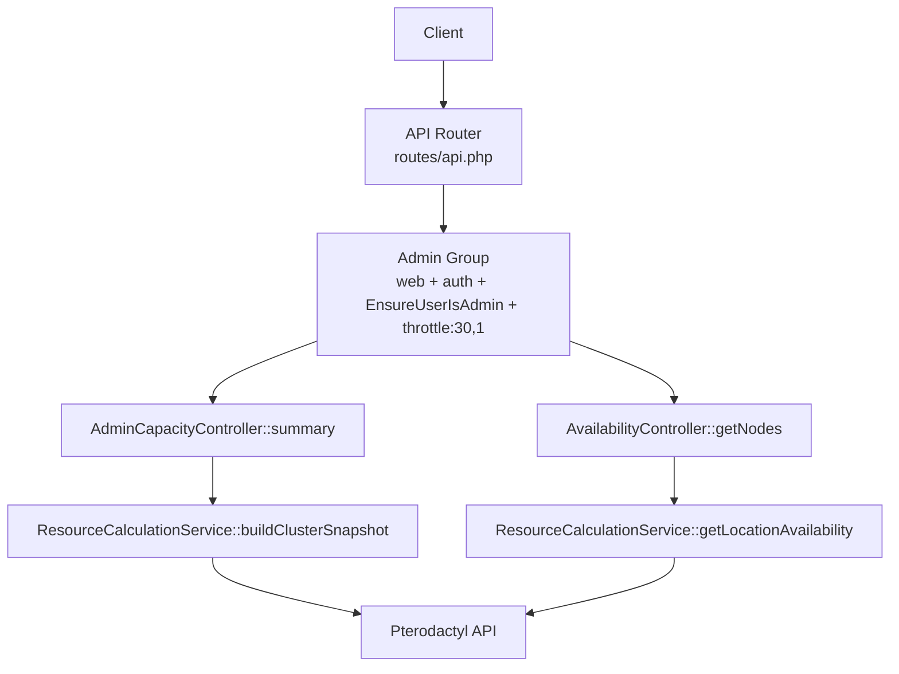
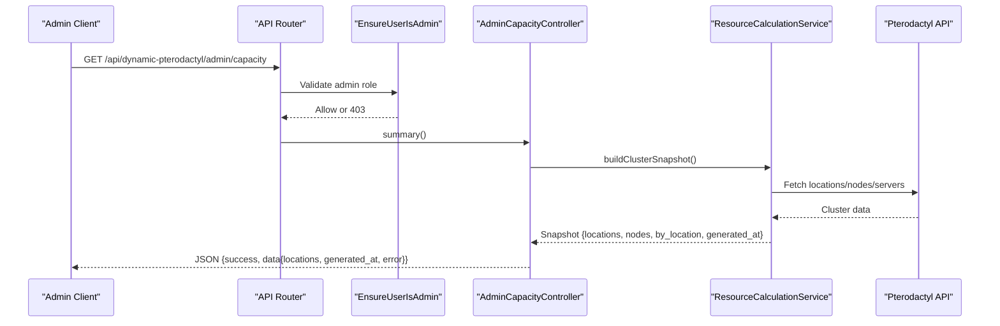
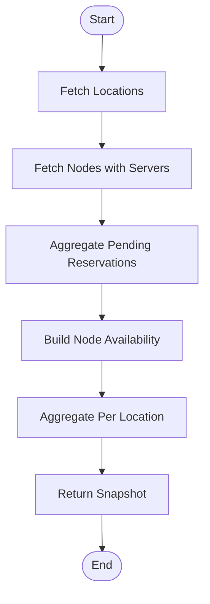
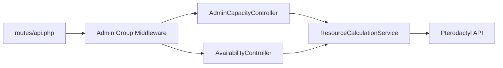

# Capacity Monitoring Endpoints

<cite>
**Referenced Files in This Document**
- [routes/api.php](file://routes/api.php)
- [Http/Middleware/EnsureUserIsAdmin.php](file://Http/Middleware/EnsureUserIsAdmin.php)
- [Http/Controllers/Api/Admin/AdminCapacityController.php](file://Http/Controllers/Api/Admin/AdminCapacityController.php)
- [Http/Controllers/Api/AvailabilityController.php](file://Http/Controllers/Api/AvailabilityController.php)
- [Services/ResourceCalculationService.php](file://Services/ResourceCalculationService.php)
- [tests/Feature/AdminApiTest.php](file://tests/Feature/AdminApiTest.php)
</cite>

## Table of Contents
1. [Introduction](#introduction)
2. [Project Structure](#project-structure)
3. [Core Components](#core-components)
4. [Architecture Overview](#architecture-overview)
5. [Detailed Component Analysis](#detailed-component-analysis)
6. [Dependency Analysis](#dependency-analysis)
7. [Performance Considerations](#performance-considerations)
8. [Troubleshooting Guide](#troubleshooting-guide)
9. [Conclusion](#conclusion)

## Introduction
This document provides detailed API documentation for capacity monitoring endpoints that enable administrators to monitor real-time system health and resource utilization across Pterodactyl nodes. It covers:
- GET /api/dynamic-pterodactyl/admin/capacity: aggregate capacity metrics across all locations, including total available resources, utilization percentages, and error signals when upstream services are unavailable.
- GET /api/dynamic-pterodactyl/admin/availability/{locationId}/nodes: node-level details (RAM, CPU, disk utilization, FQDNs, server counts) restricted to administrators.

It also documents authentication requirements using EnsureUserIsAdmin middleware, rate limiting at 30 requests per minute on admin routes, and security considerations distinguishing customer-facing aggregate data from admin-only node-level details.

## Project Structure
The capacity monitoring functionality is implemented as follows:
- Routes define the admin group with authentication and throttling.
- AdminCapacityController exposes the aggregate capacity endpoint.
- AvailabilityController exposes the node-level availability endpoint under the admin group.
- ResourceCalculationService performs real-time queries against the Pterodactyl API and aggregates cluster state.
- EnsureUserIsAdmin enforces admin-only access for protected routes.



**Diagram sources**
- [routes/api.php:32-40](file://routes/api.php#L32-L40)
- [Http/Controllers/Api/Admin/AdminCapacityController.php:17-61](file://Http/Controllers/Api/Admin/AdminCapacityController.php#L17-L61)
- [Http/Controllers/Api/AvailabilityController.php:54-69](file://Http/Controllers/Api/AvailabilityController.php#L54-L69)
- [Services/ResourceCalculationService.php:69-141](file://Services/ResourceCalculationService.php#L69-L141)

**Section sources**
- [routes/api.php:17-40](file://routes/api.php#L17-L40)

## Core Components
- AdminCapacityController::summary: Returns a structured snapshot of capacity across all locations, mapping internal snapshots to location summaries and exposing generated_at timestamps and optional error fields.
- AvailabilityController::getNodes: Returns per-node availability for a given location, including totals, allocated, reserved, available, utilization percentages, and server_count.
- ResourceCalculationService: Real-time aggregation service that fetches locations, nodes, and servers from Pterodactyl, computes effective capacities considering overallocation, subtracts allocated and pending reservations, and builds both cluster-wide and per-location summaries.
- EnsureUserIsAdmin: Middleware that returns 403 if the authenticated user lacks an admin role.

Key responsibilities:
- Authentication and authorization enforcement via middleware.
- Rate limiting via route-level throttle configuration.
- Real-time data retrieval without caching to ensure accuracy.
- Aggregation of node-level metrics into location-level summaries for admin consumption.

**Section sources**
- [Http/Controllers/Api/Admin/AdminCapacityController.php:17-61](file://Http/Controllers/Api/Admin/AdminCapacityController.php#L17-L61)
- [Http/Controllers/Api/AvailabilityController.php:54-69](file://Http/Controllers/Api/AvailabilityController.php#L54-L69)
- [Services/ResourceCalculationService.php:69-141](file://Services/ResourceCalculationService.php#L69-L141)
- [Http/Middleware/EnsureUserIsAdmin.php:11-21](file://Http/Middleware/EnsureUserIsAdmin.php#L11-L21)

## Architecture Overview
The capacity monitoring flow involves authenticated admin requests routed through middleware, invoking controllers that delegate to ResourceCalculationService for live data aggregation from Pterodactyl. Responses include success flags, data payloads, and error indicators where applicable.



**Diagram sources**
- [routes/api.php:32-40](file://routes/api.php#L32-L40)
- [Http/Middleware/EnsureUserIsAdmin.php:11-21](file://Http/Middleware/EnsureUserIsAdmin.php#L11-L21)
- [Http/Controllers/Api/Admin/AdminCapacityController.php:17-61](file://Http/Controllers/Api/Admin/AdminCapacityController.php#L17-L61)
- [Services/ResourceCalculationService.php:69-141](file://Services/ResourceCalculationService.php#L69-L141)

## Detailed Component Analysis

### Endpoint: GET /api/dynamic-pterodactyl/admin/capacity
Purpose:
- Provide administrators with aggregate capacity metrics across all locations.
- Include total available resources, utilization percentages, and capacity warnings via error fields when upstream services are degraded.

Authentication and Security:
- Requires session-based authentication and admin role enforced by EnsureUserIsAdmin middleware.
- Rate limited to 30 requests per minute.

Request:
- Method: GET
- Path: /api/dynamic-pterodactyl/admin/capacity
- Headers: Standard session/auth headers; no body required.

Response:
- Success payload includes:
  - success: boolean
  - data: object containing:
    - locations: array of location summaries with id, name, short, nodes (per-node availability), totals (capacity and allocated).
    - generated_at: ISO timestamp indicating when the snapshot was computed.
    - error: optional string present when upstream services are unavailable.
- Error responses:
  - 403: Admin access required (EnsureUserIsAdmin).
  - 503: Failed to fetch capacity (controller catches exceptions and reports).

Example Response:
```json
{
  "success": true,
  "data": {
    "locations": [
      {
        "id": 1,
        "name": "Data Center 1",
        "short": "dc1",
        "nodes": [
          {
            "node_id": 1,
            "name": "Node-US-01",
            "fqdn": "node-us-01.example.com",
            "total": {"memory": 65536, "cpu": 1600, "disk": 512000},
            "allocated": {"memory": 32768, "cpu": 800, "disk": 256000},
            "reserved": {"memory": 4096, "cpu": 200, "disk": 20480},
            "available": {"memory": 28672, "cpu": 600, "disk": 235520},
            "utilization": {"memory": 56.2, "disk": 54.0},
            "server_count": 12
          }
        ],
        "totals": {
          "capacity": {"memory": 65536, "cpu": 1600, "disk": 512000},
          "allocated": {"memory": 32768, "cpu": 800, "disk": 256000}
        }
      }
    ],
    "generated_at": "2025-01-01T12:00:00Z",
    "error": null
  }
}
```

Usage Notes:
- Use this endpoint to identify capacity bottlenecks by examining per-location totals and per-node utilization.
- Monitor generated_at to assess freshness of data.
- If error is present, investigate upstream Pterodactyl connectivity or rate limits.

**Section sources**
- [routes/api.php:32-40](file://routes/api.php#L32-L40)
- [Http/Controllers/Api/Admin/AdminCapacityController.php:17-61](file://Http/Controllers/Api/Admin/AdminCapacityController.php#L17-L61)
- [Services/ResourceCalculationService.php:69-141](file://Services/ResourceCalculationService.php#L69-L141)
- [tests/Feature/AdminApiTest.php:132-166](file://tests/Feature/AdminApiTest.php#L132-L166)

### Endpoint: GET /api/dynamic-pterodactyl/admin/availability/{locationId}/nodes
Purpose:
- Expose node-level details for a specific location, including RAM, CPU, and disk utilization, FQDNs, and server counts.
- Restricted to administrators only.

Authentication and Security:
- Requires session-based authentication and admin role enforced by EnsureUserIsAdmin middleware.
- Rate limited to 30 requests per minute.

Request:
- Method: GET
- Path: /api/dynamic-pterodactyl/admin/availability/{locationId}/nodes
- Path Parameter:
  - locationId: integer identifying the target location.

Response:
- Success payload includes:
  - success: boolean
  - data: object containing:
    - location_id: integer
    - nodes: array of node objects with node_id, name, fqdn, maintenance_mode, total, allocated, reserved, available, utilization, server_count.
    - total_capacity: aggregated totals across nodes.
    - total_allocated: aggregated allocated across nodes.
    - max_available: maximum available resources across nodes.
- Error responses:
  - 403: Admin access required (EnsureUserIsAdmin).
  - 500: Failed to fetch node details (controller catches exceptions).

Example Response:
```json
{
  "success": true,
  "data": {
    "location_id": 1,
    "nodes": [
      {
        "node_id": 1,
        "name": "Node-US-01",
        "fqdn": "node-us-01.example.com",
        "maintenance_mode": false,
        "total": {"memory": 65536, "cpu": 1600, "disk": 512000},
        "allocated": {"memory": 32768, "cpu": 800, "disk": 256000},
        "reserved": {"memory": 4096, "cpu": 200, "disk": 20480},
        "available": {"memory": 28672, "cpu": 600, "disk": 235520},
        "utilization": {"memory": 56.2, "disk": 54.0},
        "server_count": 12
      }
    ],
    "total_capacity": {"memory": 65536, "cpu": 1600, "disk": 512000},
    "total_allocated": {"memory": 32768, "cpu": 800, "disk": 256000},
    "max_available": {"memory": 28672, "cpu": 600, "disk": 235520}
  }
}
```

Usage Notes:
- Use this endpoint to investigate resource exhaustion issues per node.
- Check utilization percentages to identify hotspots.
- Review server_count to understand workload distribution.

**Section sources**
- [routes/api.php:32-40](file://routes/api.php#L32-L40)
- [Http/Controllers/Api/AvailabilityController.php:54-69](file://Http/Controllers/Api/AvailabilityController.php#L54-L69)
- [Services/ResourceCalculationService.php:24-67](file://Services/ResourceCalculationService.php#L24-L67)
- [tests/Feature/AdminApiTest.php:177-200](file://tests/Feature/AdminApiTest.php#L177-L200)

### Data Model and Aggregation Logic
ResourceCalculationService constructs cluster snapshots and per-location availability by:
- Fetching locations and nodes from Pterodactyl API.
- Calculating effective capacities based on node attributes and overallocation settings.
- Summing allocated resources from servers on each node.
- Subtracting pending reservations to compute available resources.
- Aggregating totals and available resources per location.



**Diagram sources**
- [Services/ResourceCalculationService.php:69-141](file://Services/ResourceCalculationService.php#L69-L141)
- [Services/ResourceCalculationService.php:246-289](file://Services/ResourceCalculationService.php#L246-L289)
- [Services/ResourceCalculationService.php:426-450](file://Services/ResourceCalculationService.php#L426-L450)

**Section sources**
- [Services/ResourceCalculationService.php:24-67](file://Services/ResourceCalculationService.php#L24-L67)
- [Services/ResourceCalculationService.php:69-141](file://Services/ResourceCalculationService.php#L69-L141)
- [Services/ResourceCalculationService.php:246-289](file://Services/ResourceCalculationService.php#L246-L289)
- [Services/ResourceCalculationService.php:426-450](file://Services/ResourceCalculationService.php#L426-L450)

## Dependency Analysis
The capacity monitoring endpoints depend on:
- Route definitions for grouping and middleware application.
- Controllers for request handling and response formatting.
- Service layer for real-time data aggregation and calculations.
- Middleware for admin enforcement.
- External Pterodactyl API for live resource data.



**Diagram sources**
- [routes/api.php:32-40](file://routes/api.php#L32-L40)
- [Http/Controllers/Api/Admin/AdminCapacityController.php:17-61](file://Http/Controllers/Api/Admin/AdminCapacityController.php#L17-L61)
- [Http/Controllers/Api/AvailabilityController.php:54-69](file://Http/Controllers/Api/AvailabilityController.php#L54-L69)
- [Services/ResourceCalculationService.php:69-141](file://Services/ResourceCalculationService.php#L69-L141)

**Section sources**
- [routes/api.php:32-40](file://routes/api.php#L32-L40)

## Performance Considerations
- Real-time API approach: No caching of Pterodactyl responses ensures accurate availability but may increase latency under load.
- Throttling: Admin routes are rate-limited to 30 requests per minute to protect upstream API budget and prevent abuse.
- Batching: ResourceCalculationService batches API calls where possible (e.g., fetching nodes with included servers) to reduce round trips.
- Degraded snapshots: When upstream errors occur, degraded snapshots may be returned with error fields to maintain responsiveness.

Recommendations:
- Monitor throttle usage and adjust limits if necessary.
- Implement client-side caching for non-critical dashboards to reduce load.
- Investigate upstream Pterodactyl performance if frequent timeouts or rate limits occur.

[No sources needed since this section provides general guidance]

## Troubleshooting Guide
Common issues and resolutions:
- 403 Forbidden: Ensure the user has an admin role; check EnsureUserIsAdmin middleware behavior.
- 503 Service Unavailable: Controller caught an exception while fetching capacity; inspect logs for upstream errors.
- 500 Internal Server Error: Node details fetch failed; verify locationId and upstream availability.
- Upstream Errors: ResourceCalculationService handles connection failures and rate limits; check error fields in responses and logs.

Diagnostic steps:
- Verify admin authentication and role assignment.
- Check throttle status and request frequency.
- Inspect ResourceCalculationService logs for Pterodactyl API errors.
- Validate locationId and node existence in Pterodactyl.

**Section sources**
- [Http/Middleware/EnsureUserIsAdmin.php:11-21](file://Http/Middleware/EnsureUserIsAdmin.php#L11-L21)
- [Http/Controllers/Api/Admin/AdminCapacityController.php:53-61](file://Http/Controllers/Api/Admin/AdminCapacityController.php#L53-L61)
- [Http/Controllers/Api/AvailabilityController.php:54-69](file://Http/Controllers/Api/AvailabilityController.php#L54-L69)
- [Services/ResourceCalculationService.php:410-424](file://Services/ResourceCalculationService.php#L410-L424)

## Conclusion
The capacity monitoring endpoints provide administrators with essential insights into system health and resource utilization across Pterodactyl clusters. The aggregate capacity endpoint offers high-level metrics for quick assessments, while the node-level availability endpoint enables deep dives into specific locations. Both endpoints enforce strict authentication and rate limiting to ensure secure and sustainable operation. By leveraging these APIs, administrators can proactively identify bottlenecks, manage capacity planning, and respond to resource exhaustion issues effectively.

[No sources needed since this section summarizes without analyzing specific files]