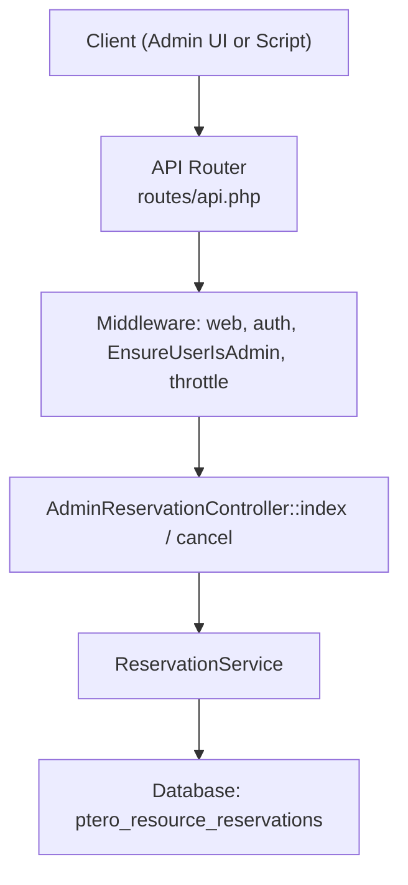
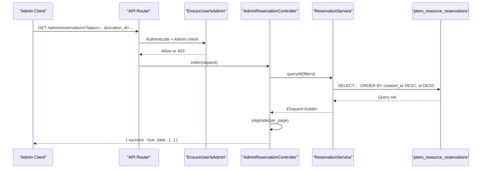
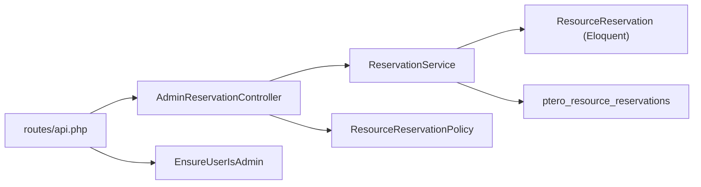

# Reservation Management Endpoints

<cite>
**Referenced Files in This Document**
- [api.php](file://routes/api.php)
- [AdminReservationController.php](file://Http/Controllers/Api/Admin/AdminReservationController.php)
- [EnsureUserIsAdmin.php](file://Http/Middleware/EnsureUserIsAdmin.php)
- [ResourceReservationPolicy.php](file://Policies/ResourceReservationPolicy.php)
- [ReservationService.php](file://Services/ReservationService.php)
- [ResourceReservation.php](file://Models/ResourceReservation.php)
- [2025_01_01_000001_create_ptero_resource_reservations_table.php](file://database/migrations/2025_01_01_000001_create_ptero_resource_reservations_table.php)
- [2026_04_22_000001_drop_released_from_reservation_status.php](file://database/migrations/2026_04_22_000001_drop_released_from_reservation_status.php)
- [AdminApiTest.php](file://tests/Feature/AdminApiTest.php)
- [ReservationApiTest.php](file://tests/Feature/ReservationApiTest.php)
</cite>

## Table of Contents
1. [Introduction](#introduction)
2. [Project Structure](#project-structure)
3. [Core Components](#core-components)
4. [Architecture Overview](#architecture-overview)
5. [Detailed Component Analysis](#detailed-component-analysis)
6. [Dependency Analysis](#dependency-analysis)
7. [Performance Considerations](#performance-considerations)
8. [Troubleshooting Guide](#troubleshooting-guide)
9. [Conclusion](#conclusion)
10. [Appendices](#appendices)

## Introduction
This document provides comprehensive API documentation for administrative reservation management endpoints that allow administrators to monitor and intervene in the reservation lifecycle. It focuses on:
- GET /api/dynamic-pterodactyl/admin/reservations: list and filter reservations by status, location, node, user, with pagination.
- POST /api/dynamic-pterodactyl/admin/reservations/{token}/cancel: cancel a pending reservation with an admin reason.

It also clarifies authentication requirements, error handling patterns, and the distinction between customer-facing operations and administrative intervention capabilities.

## Project Structure
The administrative reservation endpoints are defined under the admin route group and implemented via a dedicated controller backed by a service layer. Middleware enforces session-based authentication and admin role checks. Policies provide authorization boundaries for reservation actions.

**Diagram sources**
- [api.php:32-40](file://routes/api.php#L32-L40)
- [AdminReservationController.php:18-74](file://Http/Controllers/Api/Admin/AdminReservationController.php#L18-L74)
- [ReservationService.php:312-330](file://Services/ReservationService.php#L312-L330)

**Section sources**
- [api.php:32-40](file://routes/api.php#L32-L40)
- [AdminReservationController.php:18-74](file://Http/Controllers/Api/Admin/AdminReservationController.php#L18-L74)
- [EnsureUserIsAdmin.php:11-20](file://Http/Middleware/EnsureUserIsAdmin.php#L11-L20)

## Core Components
- AdminReservationController: Validates requests, applies filters, paginates results, and cancels reservations.
- ReservationService: Provides queryAll() for filtering, cancel(), getByToken(), and other lifecycle methods.
- ResourceReservation model: Defines table mapping, casts, and scopes for pending/expired queries.
- EnsureUserIsAdmin middleware: Enforces admin access; returns 403 JSON when not authorized.
- ResourceReservationPolicy: Allows admin bypass for panel users; otherwise restricts actions to owners.

Key responsibilities:
- Filtering: status, location_id, node_id, user_id.
- Pagination: per_page parameter defaults to 25, max 100.
- Cancellation: requires reason string; only pending reservations can be cancelled.

**Section sources**
- [AdminReservationController.php:18-74](file://Http/Controllers/Api/Admin/AdminReservationController.php#L18-L74)
- [ReservationService.php:312-330](file://Services/ReservationService.php#L312-L330)
- [ResourceReservation.php:10-65](file://Models/ResourceReservation.php#L10-L65)
- [EnsureUserIsAdmin.php:11-20](file://Http/Middleware/EnsureUserIsAdmin.php#L11-L20)
- [ResourceReservationPolicy.php:14-23](file://Policies/ResourceReservationPolicy.php#L14-L23)

## Architecture Overview
Administrative endpoints are protected by session-based authentication and an admin role check. Requests flow through middleware before reaching the controller, which delegates to the service layer for data access and business logic. The service uses Eloquent builders for filtering and pagination.

**Diagram sources**
- [api.php:32-40](file://routes/api.php#L32-L40)
- [AdminReservationController.php:18-33](file://Http/Controllers/Api/Admin/AdminReservationController.php#L18-L33)
- [ReservationService.php:312-330](file://Services/ReservationService.php#L312-L330)

## Detailed Component Analysis

### Endpoint: GET /api/dynamic-pterodactyl/admin/reservations
Purpose:
- List all reservations with optional filters and pagination.

Authentication and Authorization:
- Requires authenticated session and admin role via EnsureUserIsAdmin middleware.
- Non-admin users receive 403 JSON response.

Request:
- Method: GET
- Path: /api/dynamic-pterodactyl/admin/reservations
- Query parameters:
  - status: enum[pending, confirmed, cancelled, expired]
  - location_id: integer
  - node_id: integer
  - user_id: integer
  - per_page: integer[1..100], default 25

Response:
- Success (200):
  - success: boolean
  - data: Laravel paginator object containing:
    - data: array of reservation records
    - per_page: number
    - total, current_page, last_page, etc.

Reservation record fields:
- id: integer
- token: string
- node_id: integer
- node_name: string|null
- expires_at: ISO-8601 datetime|null
- ttl_minutes: integer (remaining minutes while pending)
- pricing:
  - total: float
  - breakdown: array
  - model: string
- status: enum[pending, confirmed, cancelled, expired]

Notes:
- Filters are applied server-side via ReservationService::queryAll().
- Time range filtering is not supported by this endpoint; use external tools or combine with other endpoints if needed.

Error responses:
- 403: Admin access required (EnsureUserIsAdmin).
- 422: Validation errors for invalid query parameters.

Example usage:
- List pending reservations in a specific location:
  - GET /api/dynamic-pterodactyl/admin/reservations?status=pending&location_id=1
- Paginate with custom page size:
  - GET /api/dynamic-pterodactyl/admin/reservations?per_page=50

**Section sources**
- [api.php:32-40](file://routes/api.php#L32-L40)
- [AdminReservationController.php:18-33](file://Http/Controllers/Api/Admin/AdminReservationController.php#L18-L33)
- [ReservationService.php:312-330](file://Services/ReservationService.php#L312-L330)
- [EnsureUserIsAdmin.php:11-20](file://Http/Middleware/EnsureUserIsAdmin.php#L11-L20)
- [ReservationApiTest.php:290-317](file://tests/Feature/ReservationApiTest.php#L290-L317)
- [AdminApiTest.php:68-99](file://tests/Feature/AdminApiTest.php#L68-L99)

### Endpoint: POST /api/dynamic-pterodactyl/admin/reservations/{token}/cancel
Purpose:
- Cancel a pending reservation with an admin-provided reason.

Authentication and Authorization:
- Requires authenticated session and admin role via EnsureUserIsAdmin middleware.

Request:
- Method: POST
- Path: /api/dynamic-pterodactyl/admin/reservations/{token}/cancel
- Body:
  - reason: string, required, max length 500

Response:
- Success (200):
  - success: boolean
  - message: "Reservation cancelled"
- Not Found (404):
  - success: boolean
  - message: "Reservation not found"
- Conflict (409):
  - success: boolean
  - message: "Only pending reservations can be cancelled (current status: <status>)"
  - Or: "Reservation could not be cancelled because its status changed"
- Validation Error (422):
  - Missing or invalid reason field

Behavior:
- Only reservations with status pending can be cancelled.
- Reason is stored in admin_notes.
- Audit log entry is created for cancellation.

Edge cases:
- If the reservation has already transitioned out of pending (e.g., confirmed or expired), cancellation fails with 409.
- Race conditions where status changes between validation and update result in 409.

**Section sources**
- [api.php:32-40](file://routes/api.php#L32-L40)
- [AdminReservationController.php:36-74](file://Http/Controllers/Api/Admin/AdminReservationController.php#L36-L74)
- [ReservationService.php:208-241](file://Services/ReservationService.php#L208-L241)
- [AdminApiTest.php:101-130](file://tests/Feature/AdminApiTest.php#L101-L130)

### Data Model: ptero_resource_reservations
Fields relevant to reservations:
- id: primary key
- token: unique identifier for tracking
- cart_item_id: nullable link to cart item
- service_id: nullable after provisioning
- user_id: owner of the reservation
- node_id: assigned node
- location_id: location context
- memory: MB
- cpu: percentage (100 = 1 core)
- disk: MB
- calculated_price: decimal(10,2)
- pricing_breakdown: JSON
- status: enum[pending, confirmed, expired, cancelled]
- admin_notes: text
- expires_at: timestamp
- timestamps: created_at, updated_at

Indexes:
- Optimized for node+status+expires_at, cleanup by status+expires_at, location+status, user+status, and created_at.

Status transitions:
- pending → confirmed | expired | cancelled
- released was removed; any existing released rows migrated to cancelled.

**Section sources**
- [2025_01_01_000001_create_ptero_resource_reservations_table.php:11-61](file://database/migrations/2025_01_01_000001_create_ptero_resource_reservations_table.php#L11-L61)
- [2026_04_22_000001_drop_released_from_reservation_status.php:8-18](file://database/migrations/2026_04_22_000001_drop_released_from_reservation_status.php#L8-L18)
- [ResourceReservation.php:10-65](file://Models/ResourceReservation.php#L10-L65)

### Authentication and Authorization
- Session-based authentication is enforced by the web and auth middleware.
- EnsureUserIsAdmin middleware checks that the user has a non-null role; otherwise returns 403 JSON.
- Policies allow admins (panel users) to bypass ownership checks; otherwise, actions are restricted to the reservation owner.

Practical implications:
- Customer-facing endpoints do not require admin privileges and enforce ownership policies.
- Administrative endpoints require explicit admin role and are intended for operational interventions.

**Section sources**
- [EnsureUserIsAdmin.php:11-20](file://Http/Middleware/EnsureUserIsAdmin.php#L11-L20)
- [ResourceReservationPolicy.php:14-23](file://Policies/ResourceReservationPolicy.php#L14-L23)
- [AdminApiTest.php:52-66](file://tests/Feature/AdminApiTest.php#L52-L66)

### Error Handling Patterns
Common HTTP status codes:
- 200: Successful operation
- 401: Unauthenticated (handled by framework auth)
- 403: Forbidden (admin access required)
- 404: Reservation not found
- 409: Conflict (reservation not in pending state or race condition)
- 422: Validation error (missing or invalid fields)
- 429: Rate limit exceeded (throttling applies to admin routes)

Error payloads:
- Consistent structure with success flag and message for admin endpoints.

**Section sources**
- [AdminReservationController.php:36-74](file://Http/Controllers/Api/Admin/AdminReservationController.php#L36-L74)
- [EnsureUserIsAdmin.php:11-20](file://Http/Middleware/EnsureUserIsAdmin.php#L11-L20)
- [api.php:32-40](file://routes/api.php#L32-L40)

## Dependency Analysis
Administrative endpoints depend on:
- Route definitions in api.php
- AdminReservationController for request handling
- ReservationService for querying and mutating reservations
- Database schema for persistence
- Middleware for security and throttling
- Policies for authorization

**Diagram sources**
- [api.php:32-40](file://routes/api.php#L32-L40)
- [AdminReservationController.php:18-74](file://Http/Controllers/Api/Admin/AdminReservationController.php#L18-L74)
- [ReservationService.php:312-330](file://Services/ReservationService.php#L312-L330)
- [ResourceReservation.php:10-65](file://Models/ResourceReservation.php#L10-L65)
- [EnsureUserIsAdmin.php:11-20](file://Http/Middleware/EnsureUserIsAdmin.php#L11-L20)
- [ResourceReservationPolicy.php:14-23](file://Policies/ResourceReservationPolicy.php#L14-L23)

**Section sources**
- [api.php:32-40](file://routes/api.php#L32-L40)
- [AdminReservationController.php:18-74](file://Http/Controllers/Api/Admin/AdminReservationController.php#L18-L74)
- [ReservationService.php:312-330](file://Services/ReservationService.php#L312-L330)

## Performance Considerations
- Throttling: Admin routes are rate-limited at 30 requests per minute to protect backend resources.
- Pagination: Default per_page is 25; increase up to 100 for large datasets.
- Indexes: Queries leverage indexes on status, expires_at, location_id, node_id, user_id, and created_at for efficient filtering and ordering.
- Avoid broad scans: Always apply filters (status, location_id, node_id, user_id) to reduce result sets.

[No sources needed since this section provides general guidance]

## Troubleshooting Guide
Common issues and resolutions:
- 403 Forbidden:
  - Cause: User lacks admin role or is unauthenticated.
  - Resolution: Ensure session is active and user has a panel role.
- 404 Not Found:
  - Cause: Token does not exist.
  - Resolution: Verify token from listing or logs; ensure correct path.
- 409 Conflict:
  - Cause: Reservation is not in pending state or status changed during request.
  - Resolution: Re-list reservations to confirm current status; retry if appropriate.
- 422 Validation Error:
  - Cause: Missing or invalid reason field.
  - Resolution: Provide a valid reason string within length limits.
- 429 Too Many Requests:
  - Cause: Exceeded throttle limit.
  - Resolution: Back off and retry; consider batching requests.

Operational tips:
- Use the list endpoint to investigate failed checkouts by filtering status=pending and location_id.
- For orphaned reservations, filter by expired or cancelled statuses and review admin_notes for context.
- During maintenance windows, extend TTLs via customer-facing extend endpoint if applicable; administrative cancellation is reserved for problematic cases.

**Section sources**
- [AdminReservationController.php:36-74](file://Http/Controllers/Api/Admin/AdminReservationController.php#L36-L74)
- [AdminApiTest.php:52-66](file://tests/Feature/AdminApiTest.php#L52-L66)
- [ReservationService.php:208-241](file://Services/ReservationService.php#L208-L241)

## Conclusion
The administrative reservation management endpoints provide robust tools for monitoring and intervening in the reservation lifecycle. They enforce strict authentication and authorization, support flexible filtering and pagination, and implement clear error handling patterns. Administrators can efficiently investigate issues, clean up problematic reservations, and maintain system stability during edge cases and maintenance.

[No sources needed since this section summarizes without analyzing specific files]

## Appendices

### Request/Response Schema Summary

GET /api/dynamic-pterodactyl/admin/reservations
- Query parameters:
  - status: enum[pending, confirmed, cancelled, expired]
  - location_id: integer
  - node_id: integer
  - user_id: integer
  - per_page: integer[1..100], default 25
- Response (200):
  - success: boolean
  - data: paginator object with:
    - data: array of reservation objects
    - per_page: number
    - total, current_page, last_page, etc.

POST /api/dynamic-pterodactyl/admin/reservations/{token}/cancel
- Path parameter:
  - token: string (required)
- Body:
  - reason: string, required, max length 500
- Responses:
  - 200: { success: true, message: "Reservation cancelled" }
  - 404: { success: false, message: "Reservation not found" }
  - 409: { success: false, message: "Only pending reservations can be cancelled (current status: <status>)" or "Reservation could not be cancelled because its status changed" }
  - 422: Validation errors

**Section sources**
- [AdminReservationController.php:18-74](file://Http/Controllers/Api/Admin/AdminReservationController.php#L18-L74)
- [ReservationService.php:312-330](file://Services/ReservationService.php#L312-L330)

### Common Administrative Workflows

Investigating failed checkouts:
- List pending reservations filtered by location_id to identify stuck items.
- Review expires_at and ttl_minutes to determine urgency.
- If necessary, cancel with a descriptive reason to free resources.

Cleaning up orphaned reservations:
- Filter by status=expired or status=cancelled to find stale entries.
- Inspect admin_notes for context and decide whether to archive or remove.

Handling edge cases during system maintenance:
- Temporarily extend TTLs via customer-facing extend endpoint if appropriate.
- Use administrative cancellation for problematic reservations that cannot proceed due to maintenance constraints.

**Section sources**
- [AdminReservationController.php:18-74](file://Http/Controllers/Api/Admin/AdminReservationController.php#L18-L74)
- [ReservationService.php:208-241](file://Services/ReservationService.php#L208-L241)
- [ReservationApiTest.php:290-317](file://tests/Feature/ReservationApiTest.php#L290-L317)

### Distinction Between Customer-Facing and Administrative Operations

Customer-facing operations:
- Create, get, cancel, extend reservations via non-admin routes.
- Enforce ownership policies; users can only act on their own reservations.
- Do not expose raw node-level details; aggregate per-location maxima only.

Administrative operations:
- List and cancel reservations across all users.
- Require admin role; bypass ownership checks via policy.
- Intended for operational interventions and troubleshooting.

**Section sources**
- [api.php:17-40](file://routes/api.php#L17-L40)
- [ResourceReservationPolicy.php:14-23](file://Policies/ResourceReservationPolicy.php#L14-L23)
- [AdminApiTest.php:168-200](file://tests/Feature/AdminApiTest.php#L168-L200)