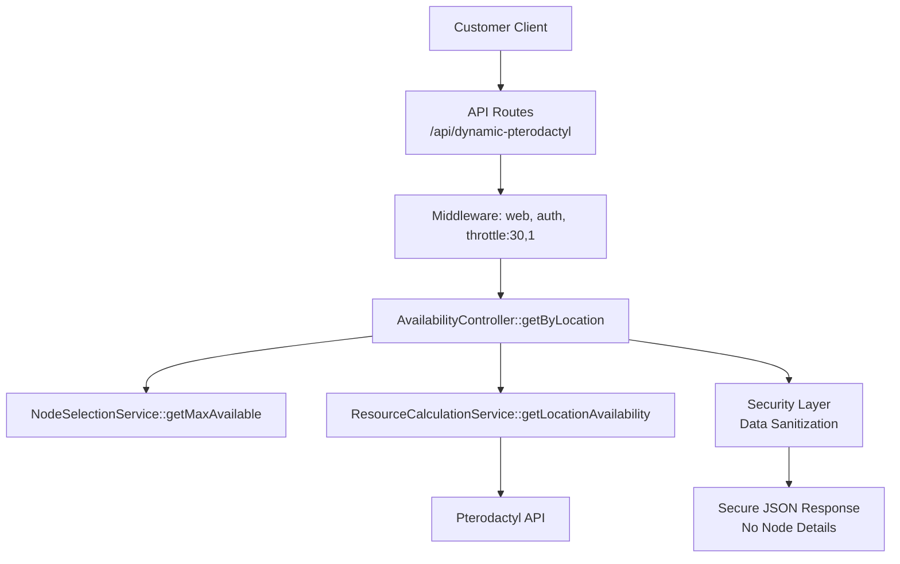
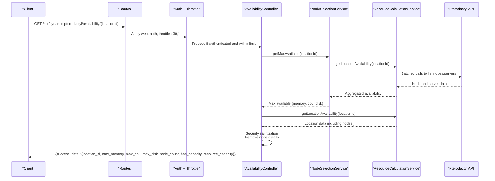
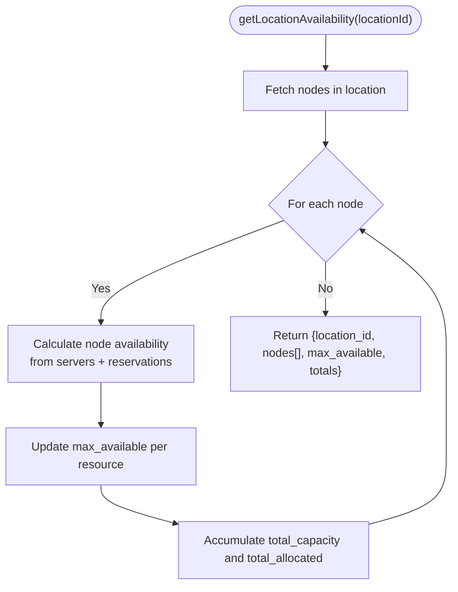
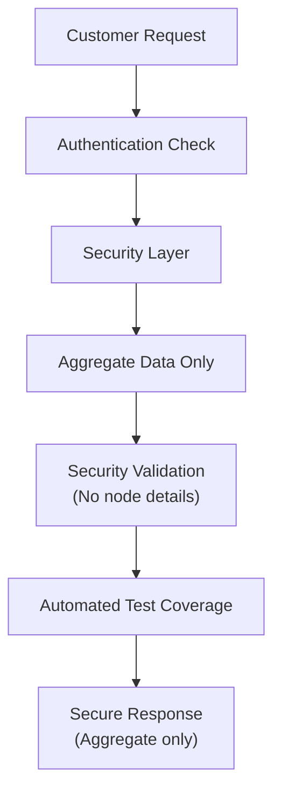
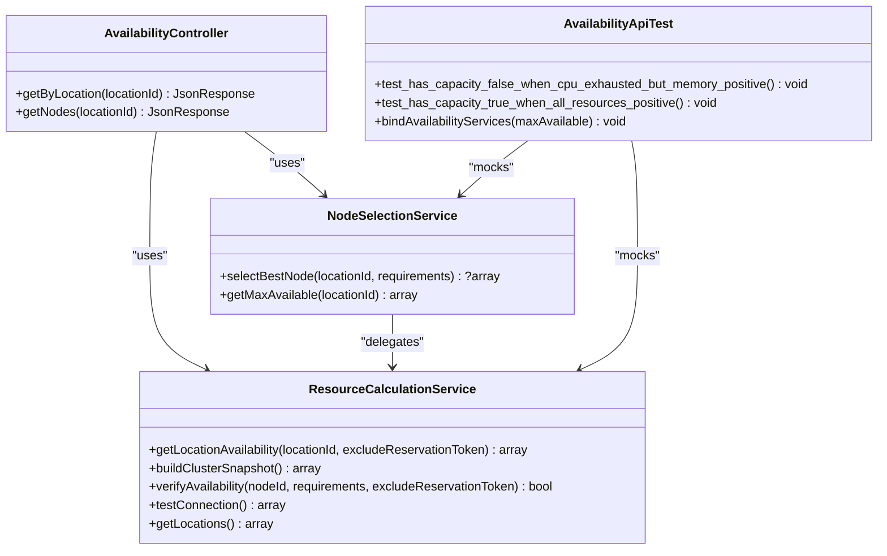

# Availability Endpoints

<cite>
**Referenced Files in This Document**
- [routes/api.php](file://routes/api.php)
- [AvailabilityController.php](file://Http/Controllers/Api/AvailabilityController.php)
- [NodeSelectionService.php](file://Services/NodeSelectionService.php)
- [ResourceCalculationService.php](file://Services/ResourceCalculationService.php)
- [EnsureUserIsAdmin.php](file://Http/Middleware/EnsureUserIsAdmin.php)
- [AvailabilityApiTest.php](file://tests/Feature/AvailabilityApiTest.php)
- [DECISIONS.md](file://DECISIONS.md)
</cite>

## Update Summary
**Changes Made**
- Enhanced security section with new test assertions for preventing node-level data exposure
- Updated endpoint specification to emphasize security boundaries
- Added comprehensive security testing coverage details
- Strengthened error handling documentation with security considerations

## Table of Contents
1. [Introduction](#introduction)
2. [Project Structure](#project-structure)
3. [Core Components](#core-components)
4. [Architecture Overview](#architecture-overview)
5. [Detailed Component Analysis](#detailed-component-analysis)
6. [Security and Data Exposure Prevention](#security-and-data-exposure-prevention)
7. [Dependency Analysis](#dependency-analysis)
8. [Performance Considerations](#performance-considerations)
9. [Troubleshooting Guide](#troubleshooting-guide)
10. [Conclusion](#conclusion)

## Introduction
This document specifies the customer-facing availability endpoint that returns aggregate, location-based capacity data for Pterodactyl nodes. It covers authentication, rate limiting, request/response schemas, error handling, performance characteristics, and comprehensive security measures designed to prevent node-level data exposure to customers. The endpoint is designed to answer "what can I get at this location right now?" without exposing node-level internals to customers.

## Project Structure
The availability feature spans routes, a controller, and services that call the Pterodactyl API in real time. Customer endpoints are grouped under a single route prefix with shared middleware for session-based authentication and throttling. Security measures ensure that only aggregate data is returned to customers while detailed node information remains admin-only.

**Diagram sources**
- [routes/api.php:17-22](file://routes/api.php#L17-L22)
- [AvailabilityController.php:22-52](file://Http/Controllers/Api/AvailabilityController.php#L22-L52)
- [NodeSelectionService.php:78-86](file://Services/NodeSelectionService.php#L78-L86)
- [ResourceCalculationService.php:23-67](file://Services/ResourceCalculationService.php#L23-L67)

**Section sources**
- [routes/api.php:17-22](file://routes/api.php#L17-L22)

## Core Components
- Route group: Defines the public availability endpoint and applies session-based authentication and rate limiting.
- Controller: Orchestrates aggregation and returns a simplified response to customers with built-in security sanitization.
- Services:
  - NodeSelectionService: Computes maximum allocatable resources across a location.
  - ResourceCalculationService: Fetches live node/server data from Pterodactyl and aggregates totals and per-node details (used internally and by admin).

Key responsibilities:
- Enforce authentication via web session and auth middleware.
- Throttle requests to protect downstream Pterodactyl API budget.
- Aggregate per-location maxima for memory, CPU, and disk.
- Provide a boolean flag indicating whether all three resources have positive availability.
- **Enhanced**: Ensure no node-level data leaks to customer responses through comprehensive testing and validation.

**Section sources**
- [routes/api.php:17-22](file://routes/api.php#L17-L22)
- [AvailabilityController.php:22-52](file://Http/Controllers/Api/AvailabilityController.php#L22-L52)
- [NodeSelectionService.php:78-86](file://Services/NodeSelectionService.php#L78-L86)
- [ResourceCalculationService.php:23-67](file://Services/ResourceCalculationService.php#L23-L67)

## Architecture Overview
The GET /api/dynamic-pterodactyl/availability/{locationId} flow:
1. Request enters the route group with web + auth + throttle middleware.
2. AvailabilityController::getByLocation resolves max available resources via NodeSelectionService.
3. It also fetches location availability via ResourceCalculationService to compute node_count and resource_capacity booleans.
4. A compact JSON response is returned with only aggregate fields; no node identifiers or internal details are exposed.
5. **Enhanced**: Comprehensive test coverage ensures security boundaries are maintained.

**Diagram sources**
- [routes/api.php:17-22](file://routes/api.php#L17-L22)
- [AvailabilityController.php:22-52](file://Http/Controllers/Api/AvailabilityController.php#L22-L52)
- [NodeSelectionService.php:78-86](file://Services/NodeSelectionService.php#L78-L86)
- [ResourceCalculationService.php:23-67](file://Services/ResourceCalculationService.php#L23-L67)

## Detailed Component Analysis

### Endpoint Specification: GET /api/dynamic-pterodactyl/availability/{locationId}
- Path parameter:
  - locationId: integer. Identifies the target Pterodactyl location.
- Authentication:
  - Requires an active web session and authenticated user via the web and auth middleware applied to the route group.
- Rate limiting:
  - 30 requests per minute per client identity enforced by the throttle middleware on the route group.
- Success response schema:
  - success: boolean
  - data: object
    - location_id: integer
    - max_memory: integer (maximum allocatable memory across nodes in the location)
    - max_cpu: integer (maximum allocatable CPU threads across nodes in the location)
    - max_disk: integer (maximum allocatable disk MB across nodes in the location)
    - node_count: integer (number of nodes in the location)
    - has_capacity: boolean (true only when memory, cpu, and disk are all > 0)
    - resource_capacity: object
      - memory: boolean (true if max_memory > 0)
      - cpu: boolean (true if max_cpu > 0)
      - disk: boolean (true if max_disk > 0)
- Error responses:
  - On exceptions during processing, returns success: false with message and error fields, HTTP 500.

Request examples
- Basic request:
  - GET /api/dynamic-pterodactyl/availability/1
  - Headers: Cookie (session), Authorization not required (uses session)
- Example success response:
  - {
      "success": true,
      "data": {
        "location_id": 1,
        "max_memory": 16384,
        "max_cpu": 400,
        "max_disk": 102400,
        "node_count": 3,
        "has_capacity": true,
        "resource_capacity": {
          "memory": true,
          "cpu": true,
          "disk": true
        }
      }
    }
- Example partial capacity response:
  - {
      "success": true,
      "data": {
        "location_id": 1,
        "max_memory": 16384,
        "max_cpu": 0,
        "max_disk": 102400,
        "node_count": 3,
        "has_capacity": false,
        "resource_capacity": {
          "memory": true,
          "cpu": false,
          "disk": true
        }
      }
    }

Error handling
- Invalid or missing locationId:
  - If the location does not exist or cannot be resolved, upstream errors propagate through services and are caught by the controller, returning success: false with a generic message and error details.
- Pterodactyl API failures:
  - Network timeouts, connection errors, or non-2xx responses result in exceptions thrown by the service layer and surfaced as success: false with a descriptive message.
- Rate limiting exceeded:
  - Requests beyond 30 per minute receive a standard throttle response from the framework's throttle middleware.

Why node-level details are not exposed
- Customer-facing endpoints intentionally return only aggregate per-location maxima and counts. Node names, FQDNs, maintenance flags, and per-node capacities are reserved for admin-only access. This reduces information leakage and keeps the customer experience focused on "can I buy here?" rather than infrastructure specifics.
- **Enhanced Security**: Comprehensive test coverage ensures that node-level data never leaks to customer responses through automated assertions.

**Section sources**
- [routes/api.php:17-22](file://routes/api.php#L17-L22)
- [AvailabilityController.php:22-52](file://Http/Controllers/Api/AvailabilityController.php#L22-L52)
- [DECISIONS.md:237-239](file://DECISIONS.md#L237-L239)

### Service Layer: Aggregation and Real-Time Data
- NodeSelectionService::getMaxAvailable
  - Delegates to ResourceCalculationService to obtain location availability and extracts the maximum allocatable values across nodes.
- ResourceCalculationService::getLocationAvailability
  - Fetches nodes in the specified location and their servers from Pterodactyl.
  - Computes effective capacity per node using overallocation settings and subtracts allocated and pending reservations.
  - Tracks max_available (per-resource maximum across nodes) and total_capacity/total_allocated aggregates.
  - Returns both per-node details (for internal/admin use) and aggregated metrics.

**Diagram sources**
- [ResourceCalculationService.php:23-67](file://Services/ResourceCalculationService.php#L23-67)
- [ResourceCalculationService.php:247-289](file://Services/ResourceCalculationService.php#L247-L289)

**Section sources**
- [NodeSelectionService.php:78-86](file://Services/NodeSelectionService.php#L78-L86)
- [ResourceCalculationService.php:23-67](file://Services/ResourceCalculationService.php#L23-L67)
- [ResourceCalculationService.php:247-289](file://Services/ResourceCalculationService.php#L247-L289)

### Middleware and Security
- Web session and authentication:
  - The route group applies web and auth middleware, ensuring the caller has an active session and is authenticated.
- Admin-only node detail endpoint:
  - The /availability/{locationId}/nodes endpoint is protected by additional admin middleware and is not part of the customer surface.
- Throttling:
  - Availability endpoints are limited to 30 requests per minute to protect the Pterodactyl API budget.

**Section sources**
- [routes/api.php:17-22](file://routes/api.php#L17-L22)
- [routes/api.php:32-40](file://routes/api.php#L32-L40)
- [EnsureUserIsAdmin.php:9-21](file://Http/Middleware/EnsureUserIsAdmin.php#L9-L21)

## Security and Data Exposure Prevention

### Enhanced Security Measures
The system implements comprehensive security measures to prevent node-level data exposure in customer responses:

#### Test Coverage for Security Boundaries
- **Automated Assertions**: Tests explicitly verify that the 'nodes' key is never present in customer-facing availability responses
- **Security Validation**: Both positive and negative capacity scenarios include assertions to ensure data isolation
- **Mock Testing**: Service mocks simulate realistic scenarios while maintaining security boundaries

#### Security Implementation Details
- **Response Sanitization**: Customer endpoints return only aggregate data (max_memory, max_cpu, max_disk, node_count)
- **Admin Isolation**: Detailed node information is exclusively available through admin-only endpoints with proper authorization
- **Data Minimization**: Even when internal services process node-level data, it is never exposed to customer responses

#### Security Testing Examples
The test suite includes comprehensive security validation:
- Verifies absence of 'nodes' key in customer responses
- Tests both capacity-available and capacity-exhausted scenarios
- Ensures consistent security behavior across different resource states

**Diagram sources**
- [AvailabilityApiTest.php:48-49](file://tests/Feature/AvailabilityApiTest.php#L48-L49)
- [AvailabilityApiTest.php:77-78](file://tests/Feature/AvailabilityApiTest.php#L77-L78)

**Section sources**
- [AvailabilityApiTest.php:48-49](file://tests/Feature/AvailabilityApiTest.php#L48-L49)
- [AvailabilityApiTest.php:77-78](file://tests/Feature/AvailabilityApiTest.php#L77-L78)
- [DECISIONS.md:237-239](file://DECISIONS.md#L237-L239)

## Dependency Analysis

**Diagram sources**
- [AvailabilityController.php:9-20](file://Http/Controllers/Api/AvailabilityController.php#L9-L20)
- [NodeSelectionService.php:5-12](file://Services/NodeSelectionService.php#L5-L12)
- [ResourceCalculationService.php:10-21](file://Services/ResourceCalculationService.php#L10-L21)
- [AvailabilityApiTest.php:12-100](file://tests/Feature/AvailabilityApiTest.php#L12-L100)

**Section sources**
- [AvailabilityController.php:9-20](file://Http/Controllers/Api/AvailabilityController.php#L9-L20)
- [NodeSelectionService.php:5-12](file://Services/NodeSelectionService.php#L5-L12)
- [ResourceCalculationService.php:10-21](file://Services/ResourceCalculationService.php#L10-L21)
- [AvailabilityApiTest.php:12-100](file://tests/Feature/AvailabilityApiTest.php#L12-L100)

## Performance Considerations
- Real-time data fetching:
  - Availability is computed by calling the Pterodactyl API on each request. There is no caching of availability results to avoid staleness and overselling risks.
- Batched API calls:
  - The service batches node and server queries where possible and paginates large result sets to minimize round-trips while still reflecting current state.
- Timeouts and retries:
  - Per-attempt timeouts and connect timeouts are set for Pterodactyl API calls. Connection errors trigger retries; non-retryable errors are reported and surfaced as exceptions.
- Throttling:
  - 30 req/min protects against excessive load on the Pterodactyl API and mitigates abuse.
- Database reads:
  - Pending reservations are summed per node to adjust available capacity accurately at query time.
- **Enhanced**: Security validation adds minimal overhead through automated testing but ensures long-term security posture without runtime performance impact.

## Troubleshooting Guide
Common issues and how they manifest:
- Authentication failure:
  - Missing or invalid session will be rejected by the auth middleware before reaching the controller.
- Rate limiting:
  - Exceeding 30 requests per minute triggers a throttle response; reduce polling frequency or implement backoff.
- Invalid location:
  - If the locationId does not resolve to any nodes, the service may return empty aggregates; the controller wraps errors into a consistent failure response.
- Pterodactyl API errors:
  - Network timeouts, connection failures, or non-2xx responses cause exceptions in the service layer; these are caught and returned as success: false with a message and error details.
- Unexpected payload:
  - Malformed or non-JSON responses from Pterodactyl are treated as errors and logged for diagnostics.
- **Enhanced**: Security validation failures:
  - If tests detect node-level data exposure, investigate the response structure and ensure proper sanitization in the controller layer.

Verification tips
- Confirm you are authenticated via a valid session cookie.
- Ensure your client respects the throttle limits and implements exponential backoff.
- Validate that the locationId exists in your Pterodactyl instance.
- **Enhanced**: Run security tests to verify no node-level data exposure in responses.

**Section sources**
- [AvailabilityController.php:45-51](file://Http/Controllers/Api/AvailabilityController.php#L45-L51)
- [ResourceCalculationService.php:452-498](file://Services/ResourceCalculationService.php#L452-L498)
- [AvailabilityApiTest.php:48-49](file://tests/Feature/AvailabilityApiTest.php#L48-L49)
- [AvailabilityApiTest.php:77-78](file://tests/Feature/AvailabilityApiTest.php#L77-L78)

## Conclusion
The GET /api/dynamic-pterodactyl/availability/{locationId} endpoint provides a secure, rate-limited, and real-time view of aggregate capacity for a given location. It exposes only what customers need to make purchasing decisions—maximum allocatable memory, CPU, and disk, along with a simple capacity indicator—while keeping node-level internals private.

**Enhanced Security**: The system now includes comprehensive automated testing to ensure that node-level data never leaks to customer responses. These security measures provide confidence that the data boundary between customer and admin interfaces remains intact, protecting sensitive infrastructure information while delivering accurate capacity information to customers.

Errors are handled consistently, performance is optimized through batched API calls and careful timeout/retry policies, and security is enforced through both architectural design and comprehensive test coverage.
