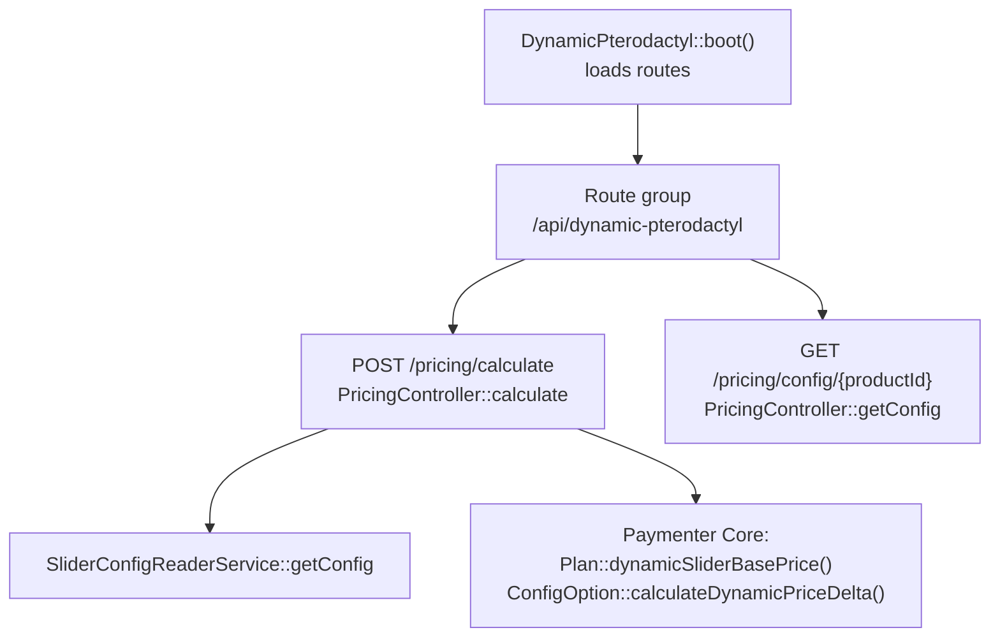
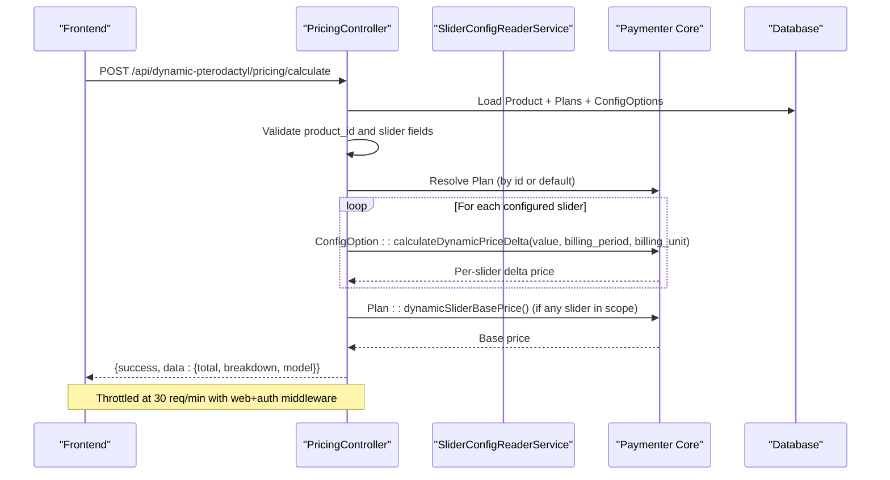
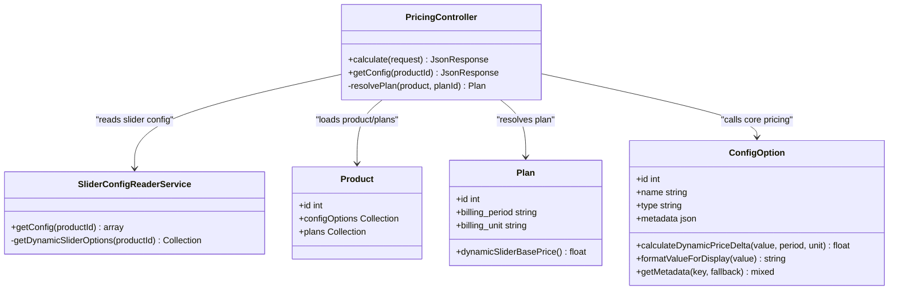

# Pricing Endpoints

> **Preserved Qoder snapshot.** This deep-dive page is retained so the earlier Wiki work and its source trail are not lost. For the reconciled implementation, [[Architecture Overview|Architecture-Overview]] is canonical; references below to retired controllers, listeners, services, or API shapes are historical.

<cite>
**Referenced Files in This Document**
- [PricingController.php](https://github.com/ObsidianNetwork/dynamic-pterodactyl/blob/6b7f83bda6f7c3fe014d52428b31af1638daa6cc/Http/Controllers/Api/PricingController.php)
- [api.php](https://github.com/ObsidianNetwork/dynamic-pterodactyl/blob/6b7f83bda6f7c3fe014d52428b31af1638daa6cc/routes/api.php)
- [SliderConfigReaderService.php](https://github.com/ObsidianNetwork/dynamic-pterodactyl/blob/6b7f83bda6f7c3fe014d52428b31af1638daa6cc/Services/SliderConfigReaderService.php)
- [DynamicPterodactyl.php](https://github.com/ObsidianNetwork/dynamic-pterodactyl/blob/6b7f83bda6f7c3fe014d52428b31af1638daa6cc/DynamicPterodactyl.php)
- [07-PRICING-MODELS.md](https://github.com/ObsidianNetwork/dynamic-pterodactyl/blob/6b7f83bda6f7c3fe014d52428b31af1638daa6cc/07-PRICING-MODELS.md)
- [02-SERVICES.md](https://github.com/ObsidianNetwork/dynamic-pterodactyl/blob/6b7f83bda6f7c3fe014d52428b31af1638daa6cc/02-SERVICES.md)
- [EnsureUserIsAdmin.php](https://github.com/ObsidianNetwork/dynamic-pterodactyl/blob/6b7f83bda6f7c3fe014d52428b31af1638daa6cc/Http/Middleware/EnsureUserIsAdmin.php)
</cite>

## Table of Contents
1. [Introduction](#introduction)
2. [Project Structure](#project-structure)
3. [Core Components](#core-components)
4. [Architecture Overview](#architecture-overview)
5. [Detailed Component Analysis](#detailed-component-analysis)
6. [Dependency Analysis](#dependency-analysis)
7. [Performance Considerations](#performance-considerations)
8. [Troubleshooting Guide](#troubleshooting-guide)
9. [Conclusion](#conclusion)

## Introduction
This document specifies the pricing calculation endpoints exposed by the Dynamic Pterodactyl extension for Paymenter. It covers:
- POST /api/dynamic-pterodactyl/pricing/calculate — calculate a price preview based on slider selections and plan context.
- GET /api/dynamic-pterodactyl/pricing/config/{productId} — retrieve slider configuration metadata for a product.

Important architectural note: this extension never calculates prices directly. It reads slider configuration metadata and delegates actual price computation to Paymenter core via Plan::dynamicSliderBasePrice() and ConfigOption::calculateDynamicPriceDelta(). The extension’s role is to orchestrate requests, validate inputs, and return structured responses that the frontend can use during checkout.

## Project Structure
The pricing endpoints are registered under a common prefix with shared middleware for session-based authentication and rate limiting. Routes are loaded from the extension boot process.

**Diagram sources**
- [DynamicPterodactyl.php:96-101](https://github.com/ObsidianNetwork/dynamic-pterodactyl/blob/6b7f83bda6f7c3fe014d52428b31af1638daa6cc/DynamicPterodactyl.php#L96-L101)
- [api.php:17-22](https://github.com/ObsidianNetwork/dynamic-pterodactyl/blob/6b7f83bda6f7c3fe014d52428b31af1638daa6cc/routes/api.php#L17-L22)
- [PricingController.php:24-145](https://github.com/ObsidianNetwork/dynamic-pterodactyl/blob/6b7f83bda6f7c3fe014d52428b31af1638daa6cc/Http/Controllers/Api/PricingController.php#L24-L145)
- [SliderConfigReaderService.php:14-53](https://github.com/ObsidianNetwork/dynamic-pterodactyl/blob/6b7f83bda6f7c3fe014d52428b31af1638daa6cc/Services/SliderConfigReaderService.php#L14-L53)

**Section sources**
- [DynamicPterodactyl.php:96-101](https://github.com/ObsidianNetwork/dynamic-pterodactyl/blob/6b7f83bda6f7c3fe014d52428b31af1638daa6cc/DynamicPterodactyl.php#L96-L101)
- [api.php:17-22](https://github.com/ObsidianNetwork/dynamic-pterodactyl/blob/6b7f83bda6f7c3fe014d52428b31af1638daa6cc/routes/api.php#L17-L22)

## Core Components
- PricingController: Validates input, resolves plan, computes per-slider deltas via core methods, aggregates totals, and returns breakdowns.
- SliderConfigReaderService: Reads dynamic_slider ConfigOption metadata and returns a normalized slider configuration payload for the frontend.
- Route registration and middleware: Enforces web session auth and throttling (30 req/min) for pricing endpoints.

Key responsibilities:
- Input validation for product_id and slider values derived from configured options.
- Delegation of pricing math to Paymenter core; no custom pricing logic here.
- Consistent JSON response envelope with success/data or success/message/error fields.

**Section sources**
- [PricingController.php:24-145](https://github.com/ObsidianNetwork/dynamic-pterodactyl/blob/6b7f83bda6f7c3fe014d52428b31af1638daa6cc/Http/Controllers/Api/PricingController.php#L24-L145)
- [SliderConfigReaderService.php:14-53](https://github.com/ObsidianNetwork/dynamic-pterodactyl/blob/6b7f83bda6f7c3fe014d52428b31af1638daa6cc/Services/SliderConfigReaderService.php#L14-L53)
- [api.php:17-22](https://github.com/ObsidianNetwork/dynamic-pterodactyl/blob/6b7f83bda6f7c3fe014d52428b31af1638daa6cc/routes/api.php#L17-L22)

## Architecture Overview
The pricing flow is designed around delegation to Paymenter core. The controller validates and orchestrates, while core models perform the actual calculations.

**Diagram sources**
- [PricingController.php:24-122](https://github.com/ObsidianNetwork/dynamic-pterodactyl/blob/6b7f83bda6f7c3fe014d52428b31af1638daa6cc/Http/Controllers/Api/PricingController.php#L24-L122)
- [api.php:17-22](https://github.com/ObsidianNetwork/dynamic-pterodactyl/blob/6b7f83bda6f7c3fe014d52428b31af1638daa6cc/routes/api.php#L17-L22)

## Detailed Component Analysis

### Endpoint: POST /api/dynamic-pterodactyl/pricing/calculate
Purpose:
- Calculate a price preview based on selected slider values and an optional plan.

Authentication and rate limiting:
- Requires a web session with authenticated user (middleware: web, auth).
- Rate limited to 30 requests per minute per client.

Request body schema:
- product_id: integer, required. Must exist in products table.
- plan_id: integer, optional. If provided, must belong to the specified product. If omitted, the first plan by sort order is used.
- Slider fields: one field per configured dynamic_slider option. Field name equals the slider’s resource_type metadata if present; otherwise it falls back to the lowercase of the slider’s name. Each value must be an integer greater than zero when included.

Validation rules applied:
- product_id: required, integer, exists:products,id.
- plan_id: nullable, integer, exists:plans,id.
- For each configured slider: resource_type field required, integer, min:1.

Response schema:
- success: boolean.
- data: object (present when success is true):
  - total: number, rounded to two decimals.
  - breakdown: array of objects, one per slider with value > 0:
    - resource_type: string.
    - label: string (slider name).
    - value: number (raw numeric value).
    - display_value: string (formatted for UI).
    - price: number (rounded to two decimals).
    - pricing_model: string (from slider metadata, default linear).
  - model: string (pricing model used, default linear).
- message: string (present when success is false).

Behavior notes:
- If the product has no dynamic_slider options, returns 404 with a descriptive message.
- If the selected plan does not belong to the product, returns 422 with an error message.
- If no plans exist for the product, returns 422 with an error message.
- On unexpected errors, returns 500 with success=false and message. In debug mode, includes error details.

Concrete request/response examples:
- Example request:
  - Method: POST
  - Path: /api/dynamic-pterodactyl/pricing/calculate
  - Headers: Cookie (session), Authorization (if applicable)
  - Body:
    - product_id: 1
    - plan_id: 2
    - memory: 8192
    - cpu: 200
    - disk: 51200
- Example success response:
  - {
      "success": true,
      "data": {
        "total": 12.34,
        "breakdown": [
          {"resource_type":"memory","label":"Memory","value":8192,"display_value":"8 GB","price":4.00,"pricing_model":"linear"},
          {"resource_type":"cpu","label":"CPU","value":200,"display_value":"2 cores","price":4.00,"pricing_model":"linear"},
          {"resource_type":"disk","label":"Disk","value":51200,"display_value":"50 GB","price":4.34,"pricing_model":"linear"}
        ],
        "model": "linear"
      }
    }
- Example 404 response (no sliders configured):
  - {
      "success": false,
      "message": "This product is not configured for dynamic pricing"
    }
- Example 422 response (invalid plan):
  - {
      "success": false,
      "message": "Selected plan does not belong to this product"
    }

Frontend integration during checkout:
- Step 1: Call GET /api/dynamic-pterodactyl/pricing/config/{productId} to discover available sliders and their ranges, units, and defaults.
- Step 2: As users adjust sliders, call POST /api/dynamic-pterodactyl/pricing/calculate with current values to get live price previews.
- Step 3: Present total and per-slider breakdown to the user before proceeding to reservation creation.

**Section sources**
- [PricingController.php:24-122](https://github.com/ObsidianNetwork/dynamic-pterodactyl/blob/6b7f83bda6f7c3fe014d52428b31af1638daa6cc/Http/Controllers/Api/PricingController.php#L24-L122)
- [api.php:17-22](https://github.com/ObsidianNetwork/dynamic-pterodactyl/blob/6b7f83bda6f7c3fe014d52428b31af1638daa6cc/routes/api.php#L17-L22)

### Endpoint: GET /api/dynamic-pterodactyl/pricing/config/{productId}
Purpose:
- Retrieve slider configuration metadata for a product so the frontend can render sliders and enforce constraints.

Authentication and rate limiting:
- Requires a web session with authenticated user (middleware: web, auth).
- Rate limited to 30 requests per minute per client.

Path parameter:
- productId: integer.

Response schema:
- success: boolean.
- data: object (present when success is true):
  - product_id: integer.
  - sliders: object keyed by resource_type, each containing:
    - config_option_id: integer.
    - name: string.
    - min: integer.
    - max: integer.
    - step: integer.
    - default: integer.
    - unit: string.
    - display_unit: string.
    - display_divisor: integer.
    - pricing: object with model and related fields (e.g., rate_per_unit, tiers, included_units, overage_rate).
- message: string (present when success is false).

Behavior notes:
- If no dynamic_slider options are found for the product, returns 404 with a descriptive message.

Concrete example:
- Request:
  - Method: GET
  - Path: /api/dynamic-pterodactyl/pricing/config/1
- Success response:
  - {
      "success": true,
      "data": {
        "product_id": 1,
        "sliders": {
          "memory": {
            "config_option_id": 10,
            "name": "Memory",
            "min": 1024,
            "max": 65536,
            "step": 1024,
            "default": 4096,
            "unit": "MB",
            "display_unit": "GB",
            "display_divisor": 1024,
            "pricing": {"model":"linear","rate_per_unit":0.0005}
          },
          "cpu": {
            "config_option_id": 11,
            "name": "CPU",
            "min": 100,
            "max": 800,
            "step": 100,
            "default": 200,
            "unit": "%",
            "display_unit": "cores",
            "display_divisor": 100,
            "pricing": {"model":"linear","rate_per_unit":0.02}
          }
        }
      }
    }
- Not found response:
  - {
      "success": false,
      "message": "No dynamic slider config options found for this product"
    }

**Section sources**
- [PricingController.php:127-145](https://github.com/ObsidianNetwork/dynamic-pterodactyl/blob/6b7f83bda6f7c3fe014d52428b31af1638daa6cc/Http/Controllers/Api/PricingController.php#L127-L145)
- [SliderConfigReaderService.php:14-53](https://github.com/ObsidianNetwork/dynamic-pterodactyl/blob/6b7f83bda6f7c3fe014d52428b31af1638daa6cc/Services/SliderConfigReaderService.php#L14-L53)
- [api.php:17-22](https://github.com/ObsidianNetwork/dynamic-pterodactyl/blob/6b7f83bda6f7c3fe014d52428b31af1638daa6cc/routes/api.php#L17-L22)

### Pricing Ownership and Delegation
This extension NEVER calculates prices directly. It:
- Reads slider configuration metadata from ConfigOption records.
- Delegates per-slider marginal pricing to Paymenter core via ConfigOption::calculateDynamicPriceDelta().
- Adds the shared base charge via Plan::dynamicSliderBasePrice() when at least one slider contributes to the total.

This design ensures parity with checkout and renewal flows and centralizes pricing authority in Paymenter core.

**Section sources**
- [07-PRICING-MODELS.md:19-27](https://github.com/ObsidianNetwork/dynamic-pterodactyl/blob/6b7f83bda6f7c3fe014d52428b31af1638daa6cc/07-PRICING-MODELS.md#L19-L27)
- [02-SERVICES.md:386-391](https://github.com/ObsidianNetwork/dynamic-pterodactyl/blob/6b7f83bda6f7c3fe014d52428b31af1638daa6cc/02-SERVICES.md#L386-L391)
- [PricingController.php:69-94](https://github.com/ObsidianNetwork/dynamic-pterodactyl/blob/6b7f83bda6f7c3fe014d52428b31af1638daa6cc/Http/Controllers/Api/PricingController.php#L69-L94)

## Dependency Analysis
The pricing endpoints depend on:
- Product and Plan models for context and billing parameters.
- ConfigOption models for slider metadata and per-slider pricing deltas.
- SliderConfigReaderService for reading slider configurations.
- Paymenter core methods for actual pricing math.

**Diagram sources**
- [PricingController.php:12-157](https://github.com/ObsidianNetwork/dynamic-pterodactyl/blob/6b7f83bda6f7c3fe014d52428b31af1638daa6cc/Http/Controllers/Api/PricingController.php#L12-L157)
- [SliderConfigReaderService.php:7-66](https://github.com/ObsidianNetwork/dynamic-pterodactyl/blob/6b7f83bda6f7c3fe014d52428b31af1638daa6cc/Services/SliderConfigReaderService.php#L7-L66)

**Section sources**
- [PricingController.php:12-157](https://github.com/ObsidianNetwork/dynamic-pterodactyl/blob/6b7f83bda6f7c3fe014d52428b31af1638daa6cc/Http/Controllers/Api/PricingController.php#L12-L157)
- [SliderConfigReaderService.php:7-66](https://github.com/ObsidianNetwork/dynamic-pterodactyl/blob/6b7f83bda6f7c3fe014d52428b31af1638daa6cc/Services/SliderConfigReaderService.php#L7-L66)

## Performance Considerations
- Rate limiting: Both pricing endpoints are throttled to 30 requests per minute per client to protect downstream resources.
- Database queries: The controller loads product with eager-loaded configOptions and plans to minimize N+1 queries.
- No caching of Pterodactyl availability: Availability checks are real-time; pricing itself relies on in-memory core calculations after loading necessary entities.
- Avoid unnecessary slider calls: Frontend should only send slider values greater than zero; zero or missing values are skipped in the controller.

[No sources needed since this section provides general guidance]

## Troubleshooting Guide
Common issues and how they surface:

- Invalid or missing product_id:
  - Validation fails early; HTTP 422 with standard validation messages.
- No dynamic_slider options for product:
  - Returns 404 with message indicating the product is not configured for dynamic pricing.
- Selected plan does not belong to product:
  - Returns 422 with a clear error message.
- No plans found for product:
  - Returns 422 with a clear error message.
- Pricing engine failure:
  - Returns 500 with success=false and message. In debug mode, includes error details. Errors are also logged server-side with context including product_id.

Operational tips:
- Verify slider configuration exists for the product before calling calculate.
- Ensure plan_id belongs to the product if provided; otherwise omit it to auto-select the default plan.
- Check throttle limits if you see 429 responses during high-frequency testing.

**Section sources**
- [PricingController.php:27-63](https://github.com/ObsidianNetwork/dynamic-pterodactyl/blob/6b7f83bda6f7c3fe014d52428b31af1638daa6cc/Http/Controllers/Api/PricingController.php#L27-L63)
- [PricingController.php:104-121](https://github.com/ObsidianNetwork/dynamic-pterodactyl/blob/6b7f83bda6f7c3fe014d52428b31af1638daa6cc/Http/Controllers/Api/PricingController.php#L104-L121)
- [api.php:17-22](https://github.com/ObsidianNetwork/dynamic-pterodactyl/blob/6b7f83bda6f7c3fe014d52428b31af1638daa6cc/routes/api.php#L17-L22)

## Conclusion
The Dynamic Pterodactyl extension exposes two focused pricing endpoints that delegate all pricing math to Paymenter core. They provide:
- A robust price preview endpoint that validates inputs, resolves plans, and returns detailed breakdowns.
- A configuration endpoint that supplies slider metadata for frontend rendering and validation.

By adhering to session-based authentication and rate limiting, and by delegating pricing to core, these endpoints ensure consistency with checkout and renewal flows while keeping the extension thin and maintainable.

[No sources needed since this section summarizes without analyzing specific files]