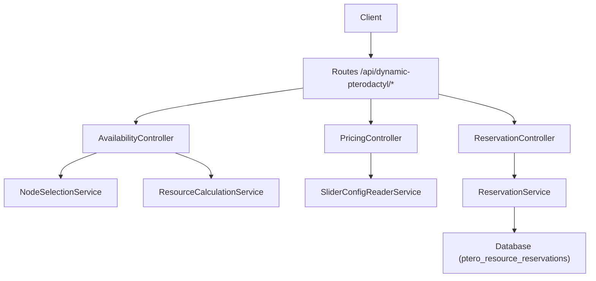
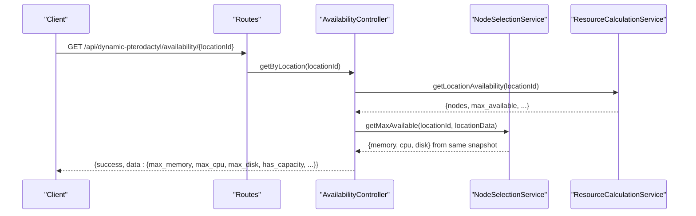
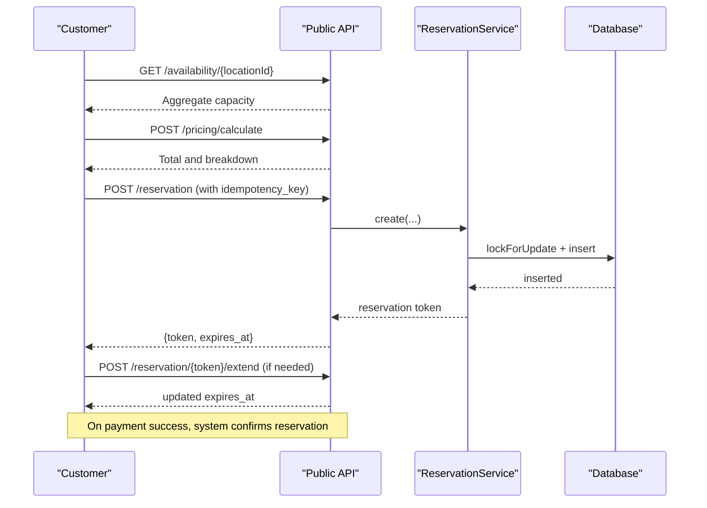
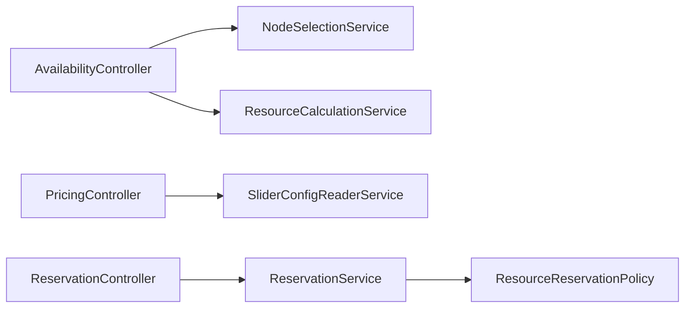

# Public API Endpoints

<cite>
**Referenced Files in This Document**
- [routes/api.php](file://routes/api.php)
- [DynamicPterodactyl.php](file://DynamicPterodactyl.php)
- [Http/Controllers/Api/AvailabilityController.php](file://Http/Controllers/Api/AvailabilityController.php)
- [Http/Controllers/Api/PricingController.php](file://Http/Controllers/Api/PricingController.php)
- [Http/Controllers/Api/ReservationController.php](file://Http/Controllers/Api/ReservationController.php)
- [Http/Requests/StoreReservationRequest.php](file://Http/Requests/StoreReservationRequest.php)
- [Services/ReservationService.php](file://Services/ReservationService.php)
- [Models/ResourceReservation.php](file://Models/ResourceReservation.php)
- [Policies/ResourceReservationPolicy.php](file://Policies/ResourceReservationPolicy.php)
- [tests/Feature/AvailabilityApiTest.php](file://tests/Feature/AvailabilityApiTest.php)
- [tests/Feature/ReservationApiTest.php](file://tests/Feature/ReservationApiTest.php)
- [tests/Feature/PricingPreviewParityTest.php](file://tests/Feature/PricingPreviewParityTest.php)
</cite>

## Table of Contents
1. [Introduction](#introduction)
2. [Project Structure](#project-structure)
3. [Core Components](#core-components)
4. [Architecture Overview](#architecture-overview)
5. [Detailed Component Analysis](#detailed-component-analysis)
6. [Dependency Analysis](#dependency-analysis)
7. [Performance Considerations](#performance-considerations)
8. [Troubleshooting Guide](#troubleshooting-guide)
9. [Conclusion](#conclusion)

## Introduction
This document specifies the public API endpoints exposed by the Dynamic Pterodactyl extension for customers and checkout flows. It covers:
- Availability checking that returns aggregate, location-based capacity (no node-level details).
- Pricing calculation that delegates to Paymenter core pricing logic via slider configuration.
- Reservation management for temporary resource holds during checkout.

Authentication is session-based using the web stack with auth middleware. Rate limiting is enforced per group:
- 30 requests per minute for availability and pricing endpoints.
- 10 requests per minute for reservation endpoints.

Security note: Customer-facing endpoints never expose raw node-level data (names, FQDNs, per-node capacity). Only aggregate per-location maxima are returned. Node-level detail is reserved for admin-only routes.

## Project Structure
The extension registers its routes at boot time and groups them under a single base path. Middleware enforces authentication and rate limits. Controllers implement the business logic for each endpoint group.

**Diagram sources**
- [routes/api.php:17-40](file://routes/api.php#L17-L40)
- [Http/Controllers/Api/AvailabilityController.php:9-20](file://Http/Controllers/Api/AvailabilityController.php#L9-L20)
- [Http/Controllers/Api/PricingController.php:12-19](file://Http/Controllers/Api/PricingController.php#L12-L19)
- [Http/Controllers/Api/ReservationController.php:13-22](file://Http/Controllers/Api/ReservationController.php#L13-L22)
- [Services/ReservationService.php:16-35](file://Services/ReservationService.php#L16-L35)

**Section sources**
- [DynamicPterodactyl.php:96-127](file://DynamicPterodactyl.php#L96-L127)
- [routes/api.php:17-40](file://routes/api.php#L17-L40)

## Core Components
- AvailabilityController: Returns aggregate per-location capacity and whether all resources have capacity.
- PricingController: Reads slider configuration and computes dynamic price deltas via Paymenter core; returns total and breakdown.
- ReservationController: Creates, retrieves, cancels, and extends reservations with authorization checks and idempotency support.
- StoreReservationRequest: Validates inputs, enforces product slider configuration, allowed locations, and value ranges/steps.
- ReservationService: Implements reservation lifecycle with pessimistic locking, idempotency, TTL, and audit logging.
- ResourceReservation model and policy: Define storage schema and authorization rules for viewing/canceling/extending.

**Section sources**
- [Http/Controllers/Api/AvailabilityController.php:22-52](file://Http/Controllers/Api/AvailabilityController.php#L22-L52)
- [Http/Controllers/Api/PricingController.php:24-122](file://Http/Controllers/Api/PricingController.php#L24-L122)
- [Http/Controllers/Api/ReservationController.php:24-136](file://Http/Controllers/Api/ReservationController.php#L24-L136)
- [Http/Requests/StoreReservationRequest.php:38-113](file://Http/Requests/StoreReservationRequest.php#L38-L113)
- [Services/ReservationService.php:43-141](file://Services/ReservationService.php#L43-L141)
- [Models/ResourceReservation.php:10-66](file://Models/ResourceReservation.php#L10-L66)
- [Policies/ResourceReservationPolicy.php:9-69](file://Policies/ResourceReservationPolicy.php#L9-L69)

## Architecture Overview
The API is split into three protected groups:
- Availability and pricing: authenticated, throttled at 30/min.
- Reservations: authenticated via checkout flow, throttled at 10/min.
- Admin: session-authenticated, admin-only, throttled at 30/min.

**Diagram sources**
- [routes/api.php:17-22](file://routes/api.php#L17-L22)
- [Http/Controllers/Api/AvailabilityController.php:22-52](file://Http/Controllers/Api/AvailabilityController.php#L22-L52)

**Section sources**
- [routes/api.php:17-40](file://routes/api.php#L17-L40)

## Detailed Component Analysis

### Availability API
- Base path: /api/dynamic-pterodactyl
- Authentication: web + auth
- Rate limit: 30 req/min

Endpoints:
- GET /api/dynamic-pterodactyl/availability/{locationId}
  - Purpose: Return aggregate capacity for a location.
  - Response fields: success, data.location_id, data.max_memory, data.max_cpu, data.max_disk, data.node_count, data.has_capacity, data.resource_capacity.memory/cpu/disk booleans.
  - Notes: Always returns aggregated per-location maxima; no node-level details.

Example request:
- Method: GET
- URL: /api/dynamic-pterodactyl/availability/1
- Headers: Cookie (session), Authorization not required (uses session)
- Success response example:
  - { "success": true, "data": { "location_id": 1, "max_memory": 1000, "max_cpu": 100, "max_disk": 1000, "node_count": 3, "has_capacity": true, "resource_capacity": { "memory": true, "cpu": true, "disk": true } } }
- Error response example:
  - { "success": false, "message": "Failed to fetch availability" }

Implementation notes:
- Uses NodeSelectionService to compute maximum available resources per location.
- Uses ResourceCalculationService to count nodes and build availability snapshot.
- Errors return 500 with a generic message plus error only when applicable.

**Section sources**
- [routes/api.php:17-22](file://routes/api.php#L17-L22)
- [Http/Controllers/Api/AvailabilityController.php:22-52](file://Http/Controllers/Api/AvailabilityController.php#L22-L52)
- [tests/Feature/AvailabilityApiTest.php:23-73](file://tests/Feature/AvailabilityApiTest.php#L23-L73)

### Pricing API
- Base path: /api/dynamic-pterodactyl
- Authentication: web + auth
- Rate limit: 30 req/min

Endpoints:
- POST /api/dynamic-pterodactyl/pricing/calculate
  - Purpose: Calculate dynamic pricing for a product’s sliders and plan.
  - Request body:
    - product_id: integer, required, must exist
    - plan_id: integer, optional, must belong to product
    - For each configured slider on the product: resource_type field (e.g., memory, cpu, disk) integer, required, min 1
  - Response fields: success, data.total, data.breakdown[], data.model
  - Behavior: Delegates to Paymenter core ConfigOption::calculateDynamicPriceDelta() and Plan::dynamicSliderBasePrice(). Never calculates prices itself.

Example request:
- Method: POST
- URL: /api/dynamic-pterodactyl/pricing/calculate
- Body:
  - { "product_id": 1, "plan_id": 10, "memory": 4096, "cpu": 200, "disk": 20480 }
- Success response example:
  - { "success": true, "data": { "total": 25.50, "breakdown": [ { "resource_type": "memory", "label": "Memory", "value": 4096, "display_value": "4 GB", "price": 12.00, "pricing_model": "linear" }, { "resource_type": "cpu", "label": "CPU", "value": 200, "display_value": "2 cores", "price": 10.00, "pricing_model": "linear" }, { "resource_type": "disk", "label": "Disk", "value": 20480, "display_value": "20 GB", "price": 3.50, "pricing_model": "linear" } ], "model": "linear" } }
- Not configured product response:
  - { "success": false, "message": "This product is not configured for dynamic pricing" }
- Invalid plan or other validation errors:
  - { "success": false, "message": "<validation or resolution error>" }

- GET /api/dynamic-pterodactyl/pricing/config/{productId}
  - Purpose: Read slider configuration for a product from native config options.
  - Response fields: success, data.product_id, data.sliders[]
  - If no config found:
    - { "success": false, "message": "No dynamic slider config options found for this product" }

Notes:
- The controller validates product existence and dynamically builds required fields based on configured sliders.
- Errors are logged; detailed error messages are included only when debug is enabled.

**Section sources**
- [routes/api.php:17-22](file://routes/api.php#L17-L22)
- [Http/Controllers/Api/PricingController.php:24-145](file://Http/Controllers/Api/PricingController.php#L24-L145)
- [tests/Feature/PricingPreviewParityTest.php:25-79](file://tests/Feature/PricingPreviewParityTest.php#L25-L79)
- [tests/Feature/PricingPreviewParityTest.php:110-152](file://tests/Feature/PricingPreviewParityTest.php#L110-L152)

### Reservation API
- Base path: /api/dynamic-pterodactyl
- Authentication: web + checkout (checkout flow context)
- Rate limit: 10 req/min

Endpoints:
- POST /api/dynamic-pterodactyl/reservation
  - Purpose: Create a temporary reservation for resources in a location.
  - Request body:
    - product_id: integer, required, must exist
    - location_id: integer, required
    - memory, cpu, disk: integers, optional but validated against product slider configuration; if present, must be within configured min/max and step
    - cart_item_id: integer, optional; if provided, ownership is enforced
    - idempotency_key: string, optional; must match regex pattern; used to deduplicate concurrent retries
  - Response fields: success, data.{id, token, node_id, node_name, expires_at, ttl_minutes, pricing.{total, breakdown, model}, status}
  - Behavior:
    - Selects best node for requested resources in the location.
    - Creates pending reservation with TTL (configurable).
    - Supports idempotent creation via idempotency_key.
    - Enforces product slider configuration and allowed locations.

Example request:
- Method: POST
- URL: /api/dynamic-pterodactyl/reservation
- Body:
  - { "product_id": 1, "location_id": 1, "memory": 4096, "cpu": 200, "disk": 20480, "cart_item_id": 123, "idempotency_key": "idem-12345" }
- Success response example:
  - { "success": true, "data": { "id": 1, "token": "abc...xyz", "node_id": 1, "node_name": "Node 1", "expires_at": "2025-01-01T12:15:00Z", "ttl_minutes": 15, "pricing": { "total": 0, "breakdown": [], "model": "stored" }, "status": "pending" } }
- Validation errors:
  - 422 with field-specific messages (e.g., memory out of range, missing required slider fields).
- No capacity:
  - 422 with message indicating no suitable node.

- GET /api/dynamic-pterodactyl/reservation/{token}
  - Purpose: Retrieve reservation details by token.
  - Authorization: Owner or admin can view; others forbidden.
  - Response: success, data.{reservation object}

- DELETE /api/dynamic-pterodactyl/reservation/{token}
  - Purpose: Cancel a pending reservation.
  - Authorization: Owner or admin can cancel; others forbidden.
  - Response: success boolean and message.

- POST /api/dynamic-pterodactyl/reservation/{token}/extend
  - Purpose: Extend a pending reservation’s TTL by minutes (1–60).
  - Authorization: Owner or admin can extend; others forbidden.
  - Response: success, data.expires_at

Authorization and security:
- Policies enforce that users can only act on their own reservations unless they are admins.
- Guest users can create reservations without being logged in; subsequent actions require appropriate ownership/admin rights.

Idempotency:
- When idempotency_key is provided, duplicate requests return the existing active reservation rather than creating a new one.
- Stale idempotency keys tied to expired reservations are cleaned up before reuse.

TTL and lifecycle:
- Reservations start as pending with a configurable TTL (default 15 minutes).
- A scheduled job marks expired pending reservations as expired.
- After successful payment, reservations are confirmed and linked to a service.

**Section sources**
- [routes/api.php:24-30](file://routes/api.php#L24-L30)
- [Http/Controllers/Api/ReservationController.php:24-136](file://Http/Controllers/Api/ReservationController.php#L24-L136)
- [Http/Requests/StoreReservationRequest.php:38-113](file://Http/Requests/StoreReservationRequest.php#L38-L113)
- [Services/ReservationService.php:43-141](file://Services/ReservationService.php#L43-L141)
- [Services/ReservationService.php:166-281](file://Services/ReservationService.php#L166-L281)
- [Services/ReservationService.php:387-405](file://Services/ReservationService.php#L387-L405)
- [Policies/ResourceReservationPolicy.php:28-69](file://Policies/ResourceReservationPolicy.php#L28-L69)
- [tests/Feature/ReservationApiTest.php:37-112](file://tests/Feature/ReservationApiTest.php#L37-L112)
- [tests/Feature/ReservationApiTest.php:179-247](file://tests/Feature/ReservationApiTest.php#L179-L247)
- [tests/Feature/ReservationApiTest.php:289-362](file://tests/Feature/ReservationApiTest.php#L289-L362)
- [tests/Feature/ReservationApiTest.php:375-400](file://tests/Feature/ReservationApiTest.php#L375-L400)

### Checkout Flow Integration Example
Typical customer journey:
1. Check availability for a location to ensure resources are offered.
2. Calculate pricing for chosen resource values.
3. Create a reservation to hold resources while completing checkout.
4. Optionally extend the reservation if checkout takes longer.
5. On successful payment, confirm the reservation (handled by system events).
6. If checkout fails or user abandons, cancel the reservation.

**Diagram sources**
- [routes/api.php:17-30](file://routes/api.php#L17-L30)
- [Services/ReservationService.php:43-141](file://Services/ReservationService.php#L43-L141)

## Dependency Analysis
- Availability depends on NodeSelectionService and ResourceCalculationService to compute aggregates and node counts.
- Pricing depends on SliderConfigReaderService and Paymenter core models (Product, Plan, ConfigOption) to read configuration and calculate deltas.
- Reservations depend on ReservationService for persistence, locking, idempotency, and TTL management; policies enforce authorization.

**Diagram sources**
- [Http/Controllers/Api/AvailabilityController.php:9-20](file://Http/Controllers/Api/AvailabilityController.php#L9-L20)
- [Http/Controllers/Api/PricingController.php:12-19](file://Http/Controllers/Api/PricingController.php#L12-L19)
- [Http/Controllers/Api/ReservationController.php:13-22](file://Http/Controllers/Api/ReservationController.php#L13-L22)
- [Policies/ResourceReservationPolicy.php:9-23](file://Policies/ResourceReservationPolicy.php#L9-L23)

**Section sources**
- [Http/Controllers/Api/AvailabilityController.php:9-20](file://Http/Controllers/Api/AvailabilityController.php#L9-L20)
- [Http/Controllers/Api/PricingController.php:12-19](file://Http/Controllers/Api/PricingController.php#L12-L19)
- [Http/Controllers/Api/ReservationController.php:13-22](file://Http/Controllers/Api/ReservationController.php#L13-L22)
- [Policies/ResourceReservationPolicy.php:9-23](file://Policies/ResourceReservationPolicy.php#L9-L23)

## Performance Considerations
- Real-time availability: Pterodactyl API responses are not cached; availability is always fresh. Batching occurs internally to minimize calls.
- Rate limiting: Protects external API budget and prevents abuse. Use client-side caching where appropriate for UI responsiveness.
- Database locking: Reservation creation uses pessimistic locking with deadlock retry to maintain consistency under concurrency.
- Idempotency: Prevents duplicate reservations on network retries; reduces load and ensures stable state.

[No sources needed since this section provides general guidance]

## Troubleshooting Guide
Common issues and resolutions:
- 422 validation errors on reservation creation:
  - Ensure product_id exists and is configured with dynamic sliders.
  - Provide required slider fields matching the product’s configuration.
  - Respect min/max/step constraints.
- 429 rate limit exceeded:
  - Throttle your client; wait for the window to reset.
- 404 not found on pricing config:
  - Product may not have dynamic slider configuration attached.
- Reservation not found:
  - Token may be invalid or expired; check expiration and status.
- Forbidden on reservation operations:
  - You do not own the reservation and are not an admin.

Error response patterns:
- Availability failures: 500 with a generic message only; exception details are reported server-side.
- Pricing failures: 500 with generic message; detailed error only when debug is enabled.
- Reservation failures: 422 for validation/runtime errors; 404 for not found; 403 for unauthorized.

**Section sources**
- [Http/Controllers/Api/AvailabilityController.php:45-52](file://Http/Controllers/Api/AvailabilityController.php#L45-L52)
- [Http/Controllers/Api/PricingController.php:104-121](file://Http/Controllers/Api/PricingController.php#L104-L121)
- [Http/Controllers/Api/ReservationController.php:62-136](file://Http/Controllers/Api/ReservationController.php#L62-L136)
- [Http/Requests/StoreReservationRequest.php:38-113](file://Http/Requests/StoreReservationRequest.php#L38-L113)
- [tests/Feature/ReservationApiTest.php:114-177](file://tests/Feature/ReservationApiTest.php#L114-L177)

## Conclusion
The Dynamic Pterodactyl public API provides secure, rate-limited endpoints for checking availability, calculating dynamic pricing, and managing short-lived resource reservations during checkout. It exposes only aggregate capacity to customers, preserving node-level details for administrative use. The design emphasizes idempotency, real-time accuracy, and robust authorization to ensure safe and reliable integration with the checkout flow.

[No sources needed since this section summarizes without analyzing specific files]
