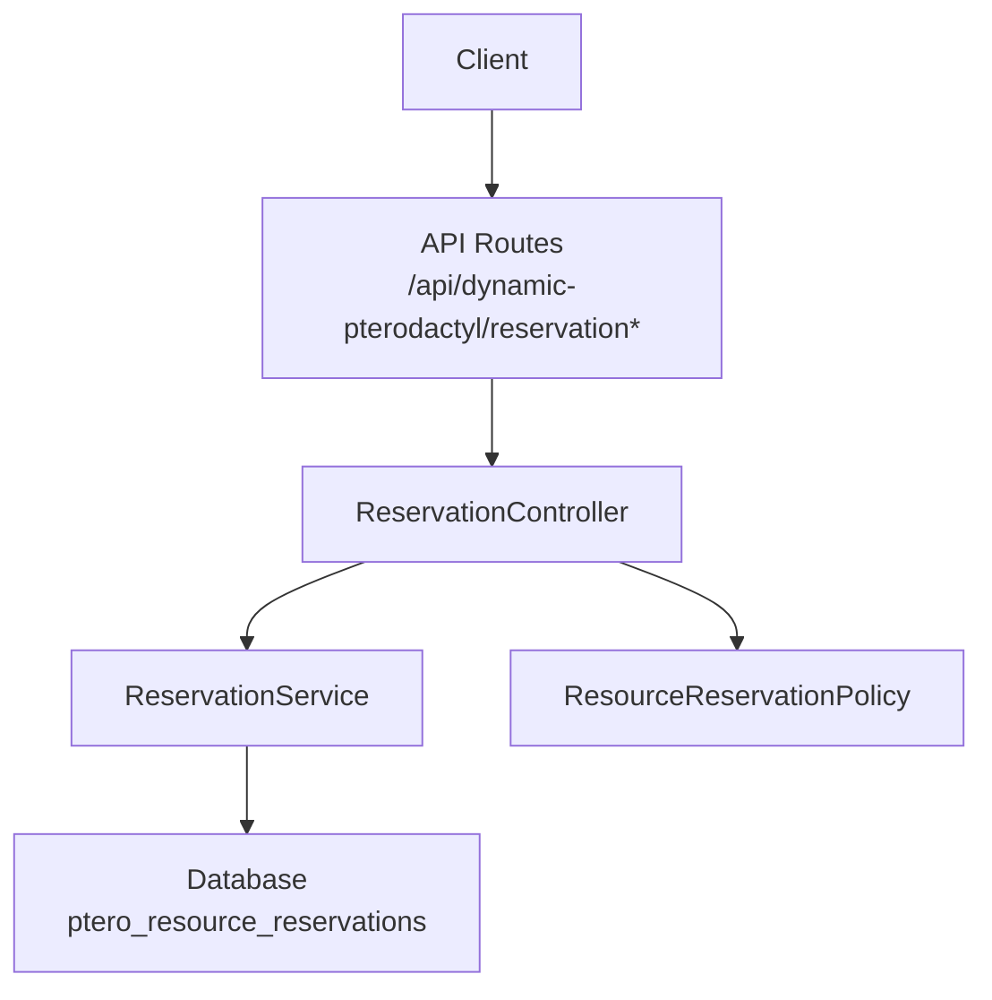
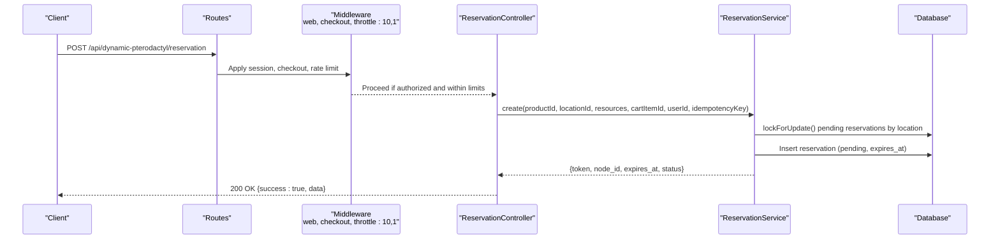
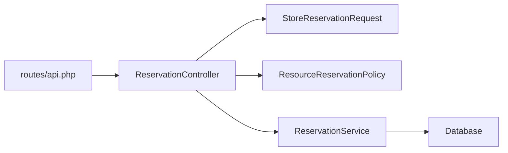

# Reservation Endpoints

<cite>
**Referenced Files in This Document**
- [routes/api.php](file://routes/api.php)
- [ReservationController.php](file://Http/Controllers/Api/ReservationController.php)
- [StoreReservationRequest.php](file://Http/Requests/StoreReservationRequest.php)
- [ResourceReservation.php](file://Models/ResourceReservation.php)
- [ReservationService.php](file://Services/ReservationService.php)
- [ResourceReservationPolicy.php](file://Policies/ResourceReservationPolicy.php)
- [2025_01_01_000001_create_ptero_resource_reservations_table.php](file://database/migrations/2025_01_01_000001_create_ptero_resource_reservations_table.php)
- [2026_04_22_000001_drop_released_from_reservation_status.php](file://database/migrations/2026_04_22_000001_drop_released_from_reservation_status.php)
- [2026_04_23_000001_add_idempotency_key_to_ptero_resource_reservations.php](file://database/migrations/2026_04_23_000001_add_idempotency_key_to_ptero_resource_reservations.php)
- [ReservationApiTest.php](file://tests/Feature/ReservationApiTest.php)
</cite>

## Table of Contents
1. [Introduction](#introduction)
2. [Project Structure](#project-structure)
3. [Core Components](#core-components)
4. [Architecture Overview](#architecture-overview)
5. [Detailed Component Analysis](#detailed-component-analysis)
6. [Dependency Analysis](#dependency-analysis)
7. [Performance Considerations](#performance-considerations)
8. [Troubleshooting Guide](#troubleshooting-guide)
9. [Conclusion](#conclusion)

## Introduction
This document provides detailed API documentation for the reservation management endpoints that implement the checkout reservation lifecycle. It covers:
- Creating a reservation
- Checking reservation status
- Cancelling a reservation
- Extending a reservation TTL

It also documents authentication, authorization, rate limiting, request/response schemas, error handling, security considerations (token-based access control and idempotency), and the strict reservation state machine.

## Project Structure
The reservation endpoints are registered under a single route group with shared middleware for web session, checkout gating, and rate limiting. The controller delegates business logic to a service layer, which enforces locking, idempotency, and state transitions.

**Diagram sources**
- [routes/api.php:24-30](file://routes/api.php#L24-L30)
- [ReservationController.php:13-137](file://Http/Controllers/Api/ReservationController.php#L13-L137)
- [ReservationService.php:43-453](file://Services/ReservationService.php#L43-L453)
- [ResourceReservationPolicy.php:9-69](file://Policies/ResourceReservationPolicy.php#L9-L69)

**Section sources**
- [routes/api.php:24-30](file://routes/api.php#L24-L30)

## Core Components
- Routes: Define four reservation endpoints under a throttled, session-gated group.
- Controller: Validates input, authorizes actions, and returns JSON responses.
- Request validation: Enforces product configuration, resource sliders, location constraints, and idempotency key format.
- Service: Implements create/cancel/extend/get by token with pessimistic locking, idempotency, audit logging, and cleanup.
- Model: Defines fillable fields, casts, and scopes for pending/expired reservations.
- Policy: Enforces ownership-based authorization with admin bypass.

Key responsibilities:
- Authentication: Web session required; checkout middleware gates these routes.
- Authorization: Ownership checks via policy; admins can act on any reservation.
- Rate limiting: 10 requests per minute per client for reservation endpoints.
- Idempotency: Optional idempotency key prevents duplicate reservations.

**Section sources**
- [routes/api.php:24-30](file://routes/api.php#L24-L30)
- [ReservationController.php:24-136](file://Http/Controllers/Api/ReservationController.php#L24-L136)
- [StoreReservationRequest.php:31-113](file://Http/Requests/StoreReservationRequest.php#L31-L113)
- [ReservationService.php:43-453](file://Services/ReservationService.php#L43-L453)
- [ResourceReservation.php:10-65](file://Models/ResourceReservation.php#L10-L65)
- [ResourceReservationPolicy.php:9-69](file://Policies/ResourceReservationPolicy.php#L9-L69)

## Architecture Overview
The reservation flow uses database transactions with pessimistic locking to avoid race conditions when selecting nodes and creating reservations. Idempotency is enforced through a unique constraint on active idempotency keys per user. Status transitions are strictly controlled by the service layer.

**Diagram sources**
- [routes/api.php:24-30](file://routes/api.php#L24-L30)
- [ReservationController.php:24-60](file://Http/Controllers/Api/ReservationController.php#L24-L60)
- [ReservationService.php:43-141](file://Services/ReservationService.php#L43-L141)

**Section sources**
- [ReservationService.php:43-141](file://Services/ReservationService.php#L43-L141)

## Detailed Component Analysis

### Endpoint: Create Reservation
- Method: POST
- Path: /api/dynamic-pterodactyl/reservation
- Authentication: Web session required; checkout middleware applied at route group level.
- Rate Limiting: 10 requests per minute.
- Request body:
  - product_id: integer, required, must exist
  - location_id: integer, required
  - memory: integer, optional but required if configured for the product
  - cpu: integer, optional but required if configured for the product
  - disk: integer, optional but required if configured for the product
  - cart_item_id: integer, optional
  - idempotency_key: string, optional, must match regex pattern
  - Idempotency-Key header: supported as alternative to body field
- Response:
  - success: boolean
  - data: object containing reservation details including token, node_id, node_name (may be null), expires_at (ISO 8601), ttl_minutes (remaining minutes while pending), pricing.total, pricing.breakdown, pricing.model, status
- Errors:
  - 422 Validation errors for invalid inputs or unconfigured products
  - 429 Rate limited
  - 500 Internal server error on unexpected failures

Behavior highlights:
- Guest users can create reservations without being logged in; user_id may be null.
- If an idempotency_key is provided and an active reservation exists for that key, the existing reservation is returned instead of creating a new one.
- Node selection is performed; if no suitable node is available, a runtime error is raised.

Example lifecycle step:
- Client sends POST with product_id, location_id, and resource sliders; receives token and expires_at.

**Section sources**
- [routes/api.php:24-30](file://routes/api.php#L24-L30)
- [ReservationController.php:24-60](file://Http/Controllers/Api/ReservationController.php#L24-L60)
- [StoreReservationRequest.php:31-113](file://Http/Requests/StoreReservationRequest.php#L31-L113)
- [ReservationService.php:43-141](file://Services/ReservationService.php#L43-L141)
- [ReservationApiTest.php:37-78](file://tests/Feature/ReservationApiTest.php#L37-L78)

### Endpoint: Get Reservation Status
- Method: GET
- Path: /api/dynamic-pterodactyl/reservation/{token}
- Authentication: Web session required; checkout middleware applied at route group level.
- Authorization: Owner-only unless admin; policy enforces user_id match or admin bypass.
- Response:
  - success: boolean
  - data: reservation object with same shape as create response
- Errors:
  - 404 Reservation not found
  - 403 Forbidden if not owner/admin

Behavior highlights:
- Token acts as access identifier; only owners or admins can view.
- Returns current status and expiration time.

Example lifecycle step:
- Client polls GET with token to check status before proceeding to payment confirmation.

**Section sources**
- [routes/api.php:24-30](file://routes/api.php#L24-L30)
- [ReservationController.php:62-79](file://Http/Controllers/Api/ReservationController.php#L62-L79)
- [ResourceReservationPolicy.php:28-31](file://Policies/ResourceReservationPolicy.php#L28-L31)
- [ReservationApiTest.php:290-300](file://tests/Feature/ReservationApiTest.php#L290-L300)

### Endpoint: Cancel Reservation
- Method: DELETE
- Path: /api/dynamic-pterodactyl/reservation/{token}
- Authentication: Web session required; checkout middleware applied at route group level.
- Authorization: Owner-only unless admin; policy enforces user_id match or admin bypass.
- Response:
  - success: boolean
  - message: human-readable result
- Errors:
  - 404 Reservation not found
  - 403 Forbidden if not owner/admin

Behavior highlights:
- Only pending reservations can be cancelled.
- Admins can cancel other users’ reservations.

Example lifecycle step:
- Client cancels if user abandons checkout or explicitly opts out.

**Section sources**
- [routes/api.php:24-30](file://routes/api.php#L24-L30)
- [ReservationController.php:81-100](file://Http/Controllers/Api/ReservationController.php#L81-L100)
- [ReservationService.php:208-241](file://Services/ReservationService.php#L208-L241)
- [ResourceReservationPolicy.php:37-40](file://Policies/ResourceReservationPolicy.php#L37-L40)
- [ReservationApiTest.php:302-317](file://tests/Feature/ReservationApiTest.php#L302-L317)

### Endpoint: Extend Reservation TTL
- Method: POST
- Path: /api/dynamic-pterodactyl/reservation/{token}/extend
- Authentication: Web session required; checkout middleware applied at route group level.
- Authorization: Owner-only unless admin; policy enforces user_id match or admin bypass.
- Request body:
  - minutes: integer, optional, default behavior applies if omitted; validated range 1–60
- Response:
  - success: boolean
  - data.expires_at: updated expiration time (ISO 8601)
- Errors:
  - 404 Reservation not found
  - 403 Forbidden if not owner/admin
  - 500 Internal server error on unexpected failures

Behavior highlights:
- Only pending reservations can be extended.
- Extends expires_at by the specified minutes.

Example lifecycle step:
- Client extends TTL during checkout delays to keep the reservation alive.

**Section sources**
- [routes/api.php:24-30](file://routes/api.php#L24-L30)
- [ReservationController.php:102-136](file://Http/Controllers/Api/ReservationController.php#L102-L136)
- [ReservationService.php:250-281](file://Services/ReservationService.php#L250-L281)
- [ResourceReservationPolicy.php:45-48](file://Policies/ResourceReservationPolicy.php#L45-L48)
- [ReservationApiTest.php:319-329](file://tests/Feature/ReservationApiTest.php#L319-L329)

### Request and Response Schemas

Create reservation request schema:
- product_id: integer, required
- location_id: integer, required
- memory: integer, optional; required if configured for the product
- cpu: integer, optional; required if configured for the product
- disk: integer, optional; required if configured for the product
- cart_item_id: integer, optional
- idempotency_key: string, optional; must match allowed character set and length
- Idempotency-Key: header, optional; accepted as alternative to body field

Get reservation response schema:
- success: boolean
- data:
  - id: integer
  - token: string
  - node_id: integer
  - node_name: string|null
  - expires_at: string (ISO 8601)
  - ttl_minutes: integer (remaining minutes while pending)
  - pricing:
    - total: number
    - breakdown: array
    - model: string
  - status: string ("pending", "confirmed", "expired", "cancelled")

Cancel and extend responses:
- success: boolean
- message: string (cancel)
- data.expires_at: string (extend)

Validation rules:
- Product must be configured for dynamic reservations; otherwise validation fails.
- Location must be allowed for the product.
- Resource values must be within configured min/max and step increments.
- Idempotency key must match the allowed pattern.

**Section sources**
- [StoreReservationRequest.php:31-113](file://Http/Requests/StoreReservationRequest.php#L31-L113)
- [ReservationService.php:407-429](file://Services/ReservationService.php#L407-L429)
- [ReservationApiTest.php:114-177](file://tests/Feature/ReservationApiTest.php#L114-L177)

### Authentication and Authorization
- Middleware:
  - web: Requires a valid session.
  - checkout: Applied to reservation routes to gate access to checkout-related operations.
  - throttle:10,1: Limits to 10 requests per minute per client.
- Authorization:
  - Policy checks ownership based on user_id; admins can bypass.
  - Admin bypass implemented via panel role check.

Security considerations:
- Token-based access control: Clients use the reservation token to query or modify their own reservations; policy ensures only owners or admins can act.
- Session-based auth: All endpoints require a web session; guests can create reservations but subsequent actions still require session context.

**Section sources**
- [routes/api.php:24-30](file://routes/api.php#L24-L30)
- [ResourceReservationPolicy.php:9-69](file://Policies/ResourceReservationPolicy.php#L9-L69)
- [ReservationApiTest.php:290-362](file://tests/Feature/ReservationApiTest.php#L290-L362)

### Rate Limiting
- Reservation endpoints are throttled to 10 requests per minute.
- Tests verify both guest IP-based throttling and authenticated user throttling.

Operational guidance:
- Implement retry with exponential backoff on 429 responses.
- Avoid rapid polling; batch status checks where possible.

**Section sources**
- [routes/api.php:24-30](file://routes/api.php#L24-L30)
- [ReservationApiTest.php:249-271](file://tests/Feature/ReservationApiTest.php#L249-L271)
- [ReservationApiTest.php:375-400](file://tests/Feature/ReservationApiTest.php#L375-L400)

### Idempotency Support
- Optional idempotency_key parameter or Idempotency-Key header.
- Active idempotency uniqueness enforced per user_id for pending/confirmed states.
- Duplicate attempts return the existing reservation rather than creating a new one.
- Stale expired reservations tied to an idempotency key are cleaned up before reuse.

Implementation notes:
- Unique constraint on user_id and active_idempotency_key prevents duplicates.
- Database-level duplicate detection handled via exception inspection and fallback lookup.

**Section sources**
- [StoreReservationRequest.php:31-36](file://Http/Requests/StoreReservationRequest.php#L31-L36)
- [ReservationService.php:60-73](file://Services/ReservationService.php#L60-L73)
- [ReservationService.php:143-157](file://Services/ReservationService.php#L143-L157)
- [ReservationService.php:431-452](file://Services/ReservationService.php#L431-L452)
- [2026_04_23_000001_add_idempotency_key_to_ptero_resource_reservations.php:9-20](file://database/migrations/2026_04_23_000001_add_idempotency_key_to_ptero_resource_reservations.php#L9-L20)
- [ReservationApiTest.php:37-78](file://tests/Feature/ReservationApiTest.php#L37-L78)

### State Machine
Strict lifecycle:
- pending → confirmed | expired | cancelled
- The 'released' state was removed intentionally; migration updates existing records and alters the enum.

Transitions:
- Confirm: Updates status to confirmed and attaches service_id.
- Cancel: Updates status to cancelled and stores reason in admin_notes.
- Expire: Background cleanup marks pending past TTL as expired.

Why 'released' was removed:
- Simplifies lifecycle and avoids ambiguity around post-cancellation resource release semantics.
- Ensures clear end states for operational visibility and reporting.

**Section sources**
- [ReservationService.php:166-199](file://Services/ReservationService.php#L166-L199)
- [ReservationService.php:208-241](file://Services/ReservationService.php#L208-L241)
- [ReservationService.php:387-405](file://Services/ReservationService.php#L387-L405)
- [2026_04_22_000001_drop_released_from_reservation_status.php:8-18](file://database/migrations/2026_04_22_000001_drop_released_from_reservation_status.php#L8-L18)

### Complete Lifecycle Examples

End-to-end creation and confirmation:
- Step 1: POST /api/dynamic-pterodactyl/reservation with product_id, location_id, and resource sliders. Receive token and expires_at.
- Step 2: Optionally poll GET /api/dynamic-pterodactyl/reservation/{token} to check status.
- Step 3: If needed, POST /api/dynamic-pterodactyl/reservation/{token}/extend with minutes to prolong TTL.
- Step 4: After successful payment, system confirms reservation internally (service method), transitioning status to confirmed.

Cancellation path:
- Step 1: POST to create reservation.
- Step 2: User decides to cancel; DELETE /api/dynamic-pterodactyl/reservation/{token}.
- Result: Status becomes cancelled; resources are not held beyond this point.

Error scenarios:
- Expired reservation: GET returns current status; confirm/cancel/extend will fail if not pending and not expired.
- Database locking conflicts: Service retries up to five times on deadlock; clients should handle transient errors and retry.
- Pterodactyl API failures: Node selection failure raises a runtime error; controller returns 422 with message.

**Section sources**
- [ReservationController.php:24-136](file://Http/Controllers/Api/ReservationController.php#L24-L136)
- [ReservationService.php:43-141](file://Services/ReservationService.php#L43-L141)
- [ReservationService.php:166-281](file://Services/ReservationService.php#L166-L281)
- [ReservationService.php:387-405](file://Services/ReservationService.php#L387-L405)

## Dependency Analysis
The reservation subsystem depends on:
- Route group middleware for session, checkout gating, and rate limiting.
- Controller for request validation and response formatting.
- Service for transactional operations, locking, idempotency, and state transitions.
- Policy for authorization enforcement.
- Database schema for persistence and indexes.

**Diagram sources**
- [routes/api.php:24-30](file://routes/api.php#L24-L30)
- [ReservationController.php:13-137](file://Http/Controllers/Api/ReservationController.php#L13-L137)
- [StoreReservationRequest.php:10-162](file://Http/Requests/StoreReservationRequest.php#L10-L162)
- [ResourceReservationPolicy.php:9-69](file://Policies/ResourceReservationPolicy.php#L9-L69)
- [ReservationService.php:16-453](file://Services/ReservationService.php#L16-L453)

**Section sources**
- [routes/api.php:24-30](file://routes/api.php#L24-L30)
- [ReservationController.php:13-137](file://Http/Controllers/Api/ReservationController.php#L13-L137)
- [ReservationService.php:16-453](file://Services/ReservationService.php#L16-L453)

## Performance Considerations
- Pessimistic locking: Uses lockForUpdate to prevent concurrent modifications during node selection and reservation creation.
- Deadlock retries: Service retries up to five times on database deadlocks to improve resilience.
- Real-time availability: No caching of Pterodactyl API responses; batching used where applicable to reduce calls.
- Indexes: Schema includes indexes for efficient queries on node/status/expires_at, cleanup, location/status, and user/status.

Recommendations:
- Batch status checks to minimize API load.
- Use idempotency keys to avoid duplicate work on retries.
- Monitor database locks and adjust timeouts if necessary.

**Section sources**
- [ReservationService.php:43-141](file://Services/ReservationService.php#L43-L141)
- [2025_01_01_000001_create_ptero_resource_reservations_table.php:55-61](file://database/migrations/2025_01_01_000001_create_ptero_resource_reservations_table.php#L55-L61)

## Troubleshooting Guide
Common issues and resolutions:
- 422 Validation errors:
  - Ensure product_id is configured for dynamic reservations.
  - Verify location_id is allowed for the product.
  - Check resource slider ranges and steps.
  - Validate idempotency_key format.
- 404 Not Found:
  - Token does not exist or has been deleted.
- 403 Forbidden:
  - Attempting to access another user’s reservation without admin privileges.
- 429 Too Many Requests:
  - Exceeded rate limit; wait and retry with backoff.
- Database locking conflicts:
  - Service retries automatically; if persistent, investigate contention on location-scoped pending reservations.
- Pterodactyl API failures:
  - Node selection fails; ensure sufficient capacity in the requested location.

Operational tips:
- Log token prefixes for traceability.
- Use admin endpoints to inspect reservations and capacity.
- Monitor scheduled cleanup jobs that mark expired reservations.

**Section sources**
- [ReservationController.php:24-136](file://Http/Controllers/Api/ReservationController.php#L24-L136)
- [ReservationService.php:125-141](file://Services/ReservationService.php#L125-L141)
- [ReservationService.php:387-405](file://Services/ReservationService.php#L387-L405)
- [ReservationApiTest.php:114-177](file://tests/Feature/ReservationApiTest.php#L114-L177)
- [ReservationApiTest.php:249-271](file://tests/Feature/ReservationApiTest.php#L249-L271)

## Conclusion
The reservation endpoints provide a secure, rate-limited, and idempotent mechanism to manage the checkout lifecycle. They enforce strict state transitions, robust authorization, and resilient database operations. Clients should rely on tokens for access control, use idempotency keys for safe retries, and respect rate limits. The removal of the 'released' state simplifies the lifecycle and improves clarity for operational workflows.