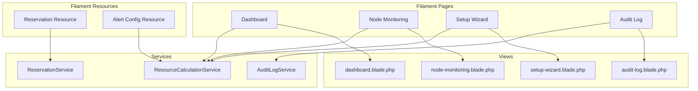
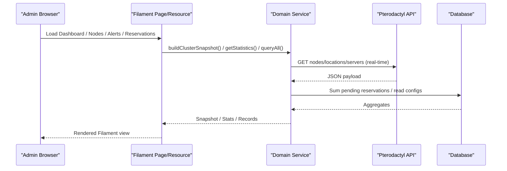
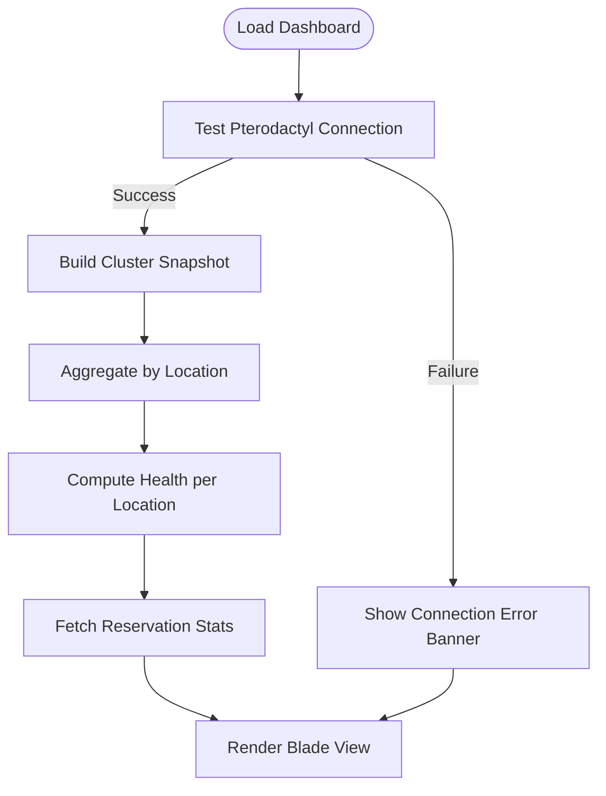
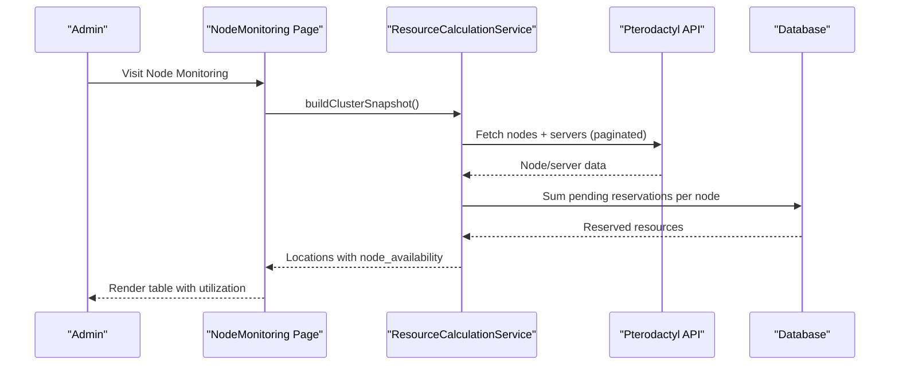
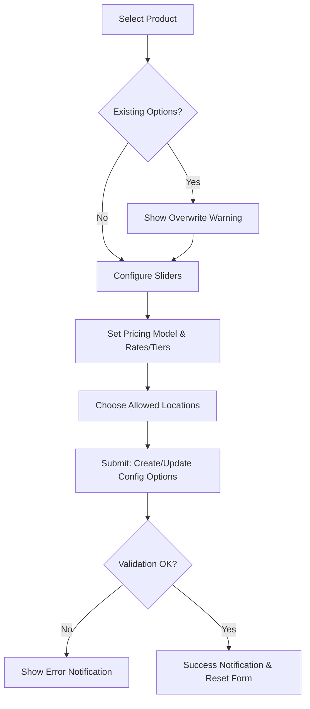
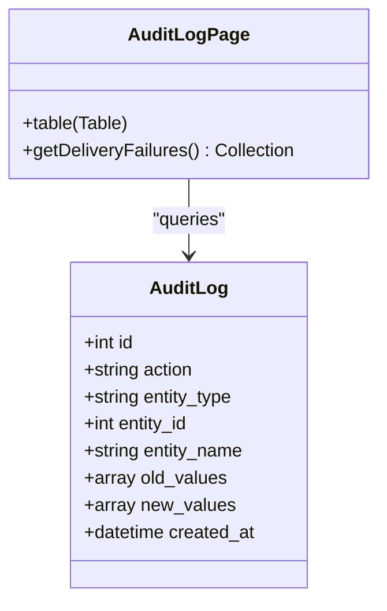
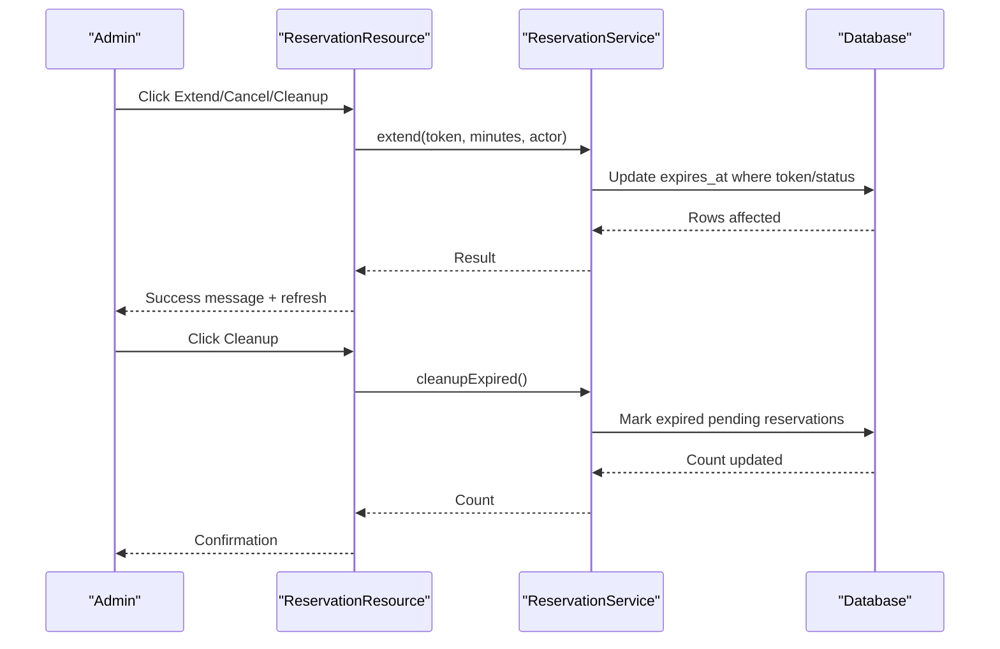
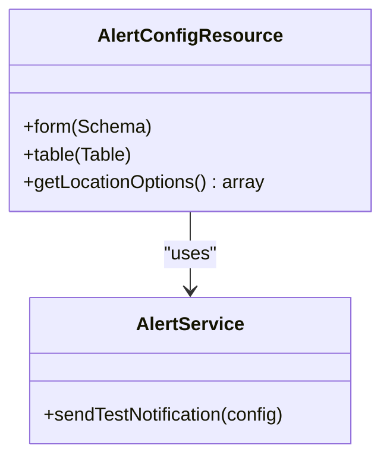
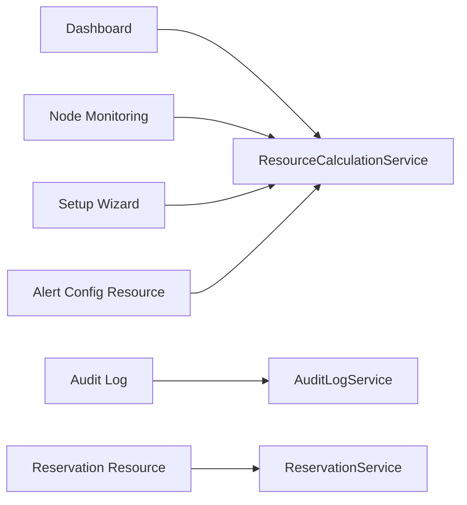

# Admin Interface

<cite>
**Referenced Files in This Document**
- [Dashboard.php](file://Admin/Pages/Dashboard.php)
- [NodeMonitoring.php](file://Admin/Pages/NodeMonitoring.php)
- [SetupWizard.php](file://Admin/Pages/SetupWizard.php)
- [AuditLogPage.php](file://Admin/Pages/AuditLogPage.php)
- [ReservationResource.php](file://Admin/Resources/ReservationResource.php)
- [AlertConfigResource.php](file://Admin/Resources/AlertConfigResource.php)
- [dashboard.blade.php](file://resources/views/admin/dashboard.blade.php)
- [node-monitoring.blade.php](file://resources/views/admin/node-monitoring.blade.php)
- [setup-wizard.blade.php](file://resources/views/admin/setup-wizard.blade.php)
- [audit-log.blade.php](file://resources/views/admin/audit-log.blade.php)
- [ResourceCalculationService.php](file://Services/ResourceCalculationService.php)
- [ReservationService.php](file://Services/ReservationService.php)
- [AuditLogService.php](file://Services/AuditLogService.php)
- [ResourceReservation.php](file://Models/ResourceReservation.php)
- [AuditLog.php](file://Models/AuditLog.php)
- [ResourceReservationPolicy.php](file://Policies/ResourceReservationPolicy.php)
- [EnsureUserIsAdmin.php](file://Http/Middleware/EnsureUserIsAdmin.php)
</cite>

## Table of Contents
1. Introduction
2. Project Structure
3. Core Components
4. Architecture Overview
5. Detailed Component Analysis
6. Dependency Analysis
7. Performance Considerations
8. Troubleshooting Guide
9. Conclusion
10. Appendices

## Introduction
This document describes the Filament 4-based administrative interface for the Dynamic Pterodactyl extension. It covers:
- Dashboard with system health overview and capacity metrics
- Node monitoring for real-time utilization tracking
- Setup wizard for initial configuration of dynamic slider options
- Audit log viewer for administrative action tracking
- Reservation management resource for manual intervention
- Alert configuration CRUD operations

It also provides user workflows, permission requirements, customization guidance, styling approaches, and integration points with underlying services.

## Project Structure
The admin interface is composed of Filament pages and resources backed by Blade views and services that integrate with Pterodactyl and internal domain logic.

**Diagram sources**
- [Dashboard.php:11-25](file://Admin/Pages/Dashboard.php#L11-L25)
- [NodeMonitoring.php:8-20](file://Admin/Pages/NodeMonitoring.php#L8-L20)
- [SetupWizard.php:26-42](file://Admin/Pages/SetupWizard.php#L26-L42)
- [AuditLogPage.php:15-29](file://Admin/Pages/AuditLogPage.php#L15-L29)
- [ReservationResource.php:15-27](file://Admin/Resources/ReservationResource.php#L15-L27)
- [AlertConfigResource.php:27-39](file://Admin/Resources/AlertConfigResource.php#L27-L39)
- [dashboard.blade.php:1-104](file://resources/views/admin/dashboard.blade.php#L1-L104)
- [node-monitoring.blade.php:1-110](file://resources/views/admin/node-monitoring.blade.php#L1-L110)
- [setup-wizard.blade.php:1-6](file://resources/views/admin/setup-wizard.blade.php#L1-L6)
- [audit-log.blade.php:1-48](file://resources/views/admin/audit-log.blade.php#L1-L48)
- [ResourceCalculationService.php:10-22](file://Services/ResourceCalculationService.php#L10-L22)
- [ReservationService.php:16-35](file://Services/ReservationService.php#L16-L35)
- [AuditLogService.php:10-41](file://Services/AuditLogService.php#L10-L41)

**Section sources**
- [Dashboard.php:11-25](file://Admin/Pages/Dashboard.php#L11-L25)
- [NodeMonitoring.php:8-20](file://Admin/Pages/NodeMonitoring.php#L8-L20)
- [SetupWizard.php:26-42](file://Admin/Pages/SetupWizard.php#L26-L42)
- [AuditLogPage.php:15-29](file://Admin/Pages/AuditLogPage.php#L15-L29)
- [ReservationResource.php:15-27](file://Admin/Resources/ReservationResource.php#L15-L27)
- [AlertConfigResource.php:27-39](file://Admin/Resources/AlertConfigResource.php#L27-L39)

## Core Components
- Dashboard page: Displays connection status, key stats (products with sliders, pending reservations, revenue, conversion), and per-location capacity with health indicators.
- Node monitoring page: Shows node-level utilization (memory/disk), server counts, maintenance state, and reserved capacity.
- Setup wizard: Multi-tab form to configure dynamic slider options per product (pricing model, slider ranges, rates/tiers, included resources, overage rates, allowed locations).
- Audit log page: Lists audit entries with filters and shows recent alert delivery failures.
- Reservation resource: Read-only list of reservations with actions to extend or cancel pending ones; includes cleanup tool.
- Alert config resource: Create/edit/delete alert configurations with thresholds, notification channels, cooldowns, and test send.

**Section sources**
- [Dashboard.php:27-73](file://Admin/Pages/Dashboard.php#L27-L73)
- [dashboard.blade.php:1-104](file://resources/views/admin/dashboard.blade.php#L1-L104)
- [NodeMonitoring.php:22-61](file://Admin/Pages/NodeMonitoring.php#L22-L61)
- [node-monitoring.blade.php:1-110](file://resources/views/admin/node-monitoring.blade.php#L1-L110)
- [SetupWizard.php:50-427](file://Admin/Pages/SetupWizard.php#L50-L427)
- [setup-wizard.blade.php:1-6](file://resources/views/admin/setup-wizard.blade.php#L1-L6)
- [AuditLogPage.php:31-103](file://Admin/Pages/AuditLogPage.php#L31-L103)
- [audit-log.blade.php:1-48](file://resources/views/admin/audit-log.blade.php#L1-L48)
- [ReservationResource.php:34-127](file://Admin/Resources/ReservationResource.php#L34-L127)
- [AlertConfigResource.php:41-176](file://Admin/Resources/AlertConfigResource.php#L41-L176)

## Architecture Overview
The admin UI renders data via Filament pages/resources which call services. Services interact with Pterodactyl API and internal databases. Policies enforce permissions on sensitive actions.

**Diagram sources**
- [Dashboard.php:27-73](file://Admin/Pages/Dashboard.php#L27-L73)
- [NodeMonitoring.php:22-61](file://Admin/Pages/NodeMonitoring.php#L22-L61)
- [ResourceCalculationService.php:69-141](file://Services/ResourceCalculationService.php#L69-L141)
- [ReservationService.php:335-382](file://Services/ReservationService.php#L335-L382)

## Detailed Component Analysis

### Dashboard
- Purpose: Provide a high-level health and capacity overview across locations.
- Data sources:
  - Connection status via service method that tests Pterodactyl connectivity.
  - Location capacity derived from cluster snapshot aggregated per location.
  - Business stats via reservation statistics.
- Health calculation: Based on memory utilization thresholds (warning at 80%, critical at 95%).
- View rendering: Uses Blade sections and progress bars to visualize memory and disk usage per location.

**Diagram sources**
- [Dashboard.php:27-73](file://Admin/Pages/Dashboard.php#L27-L73)
- [dashboard.blade.php:1-104](file://resources/views/admin/dashboard.blade.php#L1-L104)
- [ResourceCalculationService.php:158-195](file://Services/ResourceCalculationService.php#L158-L195)

**Section sources**
- [Dashboard.php:27-115](file://Admin/Pages/Dashboard.php#L27-L115)
- [dashboard.blade.php:1-104](file://resources/views/admin/dashboard.blade.php#L1-L104)

### Node Monitoring
- Purpose: Real-time view of node utilization and availability per location.
- Data flow: Fetches cluster snapshot and maps node availability details including utilization percentages and reserved capacity.
- View features: Tables with status badges, progress bars for memory/disk, and server counts.

**Diagram sources**
- [NodeMonitoring.php:22-61](file://Admin/Pages/NodeMonitoring.php#L22-L61)
- [ResourceCalculationService.php:69-141](file://Services/ResourceCalculationService.php#L69-L141)
- [node-monitoring.blade.php:1-110](file://resources/views/admin/node-monitoring.blade.php#L1-L110)

**Section sources**
- [NodeMonitoring.php:22-61](file://Admin/Pages/NodeMonitoring.php#L22-L61)
- [node-monitoring.blade.php:1-110](file://resources/views/admin/node-monitoring.blade.php#L1-L110)

### Setup Wizard
- Purpose: Configure dynamic slider options for a selected product, including pricing models and allowed locations.
- Tabs:
  - Product selection with existing option detection and overwrite warning.
  - Sliders: Enable/disable and configure min/max/step/default for memory, CPU, disk.
  - Pricing: Linear rates, tiered tiers, or base+addon with included resources and overage rates.
  - Locations: Select allowed Pterodactyl locations.
- Actions: Creates or updates config options via service; validates and surfaces errors as notifications.

**Diagram sources**
- [SetupWizard.php:50-427](file://Admin/Pages/SetupWizard.php#L50-L427)
- [setup-wizard.blade.php:1-6](file://resources/views/admin/setup-wizard.blade.php#L1-L6)

**Section sources**
- [SetupWizard.php:50-509](file://Admin/Pages/SetupWizard.php#L50-L509)
- [setup-wizard.blade.php:1-6](file://resources/views/admin/setup-wizard.blade.php#L1-L6)

### Audit Log Viewer
- Purpose: Track administrative actions and display recent alert delivery failures.
- Features: Filterable table by action and entity type; section showing last 50 failed alert deliveries with trigger types and error messages.

**Diagram sources**
- [AuditLogPage.php:31-103](file://Admin/Pages/AuditLogPage.php#L31-L103)
- [AuditLog.php:7-37](file://Models/AuditLog.php#L7-L37)

**Section sources**
- [AuditLogPage.php:31-103](file://Admin/Pages/AuditLogPage.php#L31-L103)
- [audit-log.blade.php:1-48](file://resources/views/admin/audit-log.blade.php#L1-L48)

### Reservation Management Resource
- Purpose: Manual intervention for pending reservations (extend TTL, cancel) and bulk cleanup of expired ones.
- Behavior:
  - List view with status badges, resource summary, price, expiry warnings.
  - Extend action adds minutes to pending reservations.
  - Cancel action marks pending reservations as cancelled with reason.
  - Cleanup action marks all expired pending reservations as expired.
- Permissions: Enforced via policy when actor is provided; admin panel access bypasses restrictions.

**Diagram sources**
- [ReservationResource.php:87-127](file://Admin/Resources/ReservationResource.php#L87-L127)
- [ReservationService.php:250-281](file://Services/ReservationService.php#L250-L281)
- [ReservationService.php:387-405](file://Services/ReservationService.php#L387-L405)

**Section sources**
- [ReservationResource.php:34-127](file://Admin/Resources/ReservationResource.php#L34-L127)
- [ReservationService.php:250-405](file://Services/ReservationService.php#L250-L405)
- [ResourceReservationPolicy.php:14-68](file://Policies/ResourceReservationPolicy.php#L14-L68)

### Alert Configuration CRUD
- Purpose: Define alert rules per location or globally, set thresholds, choose notification channels, and test alerts.
- Capabilities:
  - Create/Edit forms with toggles and inputs for thresholds, emails, webhooks, cooldown.
  - Table listing active status, thresholds, last notification time.
  - Test action sends a trial notification using configured channels.

**Diagram sources**
- [AlertConfigResource.php:41-176](file://Admin/Resources/AlertConfigResource.php#L41-L176)

**Section sources**
- [AlertConfigResource.php:41-176](file://Admin/Resources/AlertConfigResource.php#L41-L176)

## Dependency Analysis
Key dependencies between admin components and services:

**Diagram sources**
- [Dashboard.php:27-73](file://Admin/Pages/Dashboard.php#L27-L73)
- [NodeMonitoring.php:22-61](file://Admin/Pages/NodeMonitoring.php#L22-L61)
- [SetupWizard.php:442-457](file://Admin/Pages/SetupWizard.php#L442-L457)
- [AuditLogPage.php:83-103](file://Admin/Pages/AuditLogPage.php#L83-L103)
- [ReservationResource.php:99-123](file://Admin/Resources/ReservationResource.php#L99-L123)
- [AlertConfigResource.php:158-163](file://Admin/Resources/AlertConfigResource.php#L158-L163)

**Section sources**
- [Dashboard.php:27-73](file://Admin/Pages/Dashboard.php#L27-L73)
- [NodeMonitoring.php:22-61](file://Admin/Pages/NodeMonitoring.php#L22-L61)
- [SetupWizard.php:442-457](file://Admin/Pages/SetupWizard.php#L442-L457)
- [AuditLogPage.php:83-103](file://Admin/Pages/AuditLogPage.php#L83-L103)
- [ReservationResource.php:99-123](file://Admin/Resources/ReservationResource.php#L99-L123)
- [AlertConfigResource.php:158-163](file://Admin/Resources/AlertConfigResource.php#L158-L163)

## Performance Considerations
- Real-time data: The dashboard and node monitoring fetch live data from Pterodactyl; avoid excessive polling. Use Filament’s poll feature judiciously (e.g., reservations list polls every 30 seconds).
- Batched API calls: Cluster snapshot batches node and server queries; large clusters may incur multiple paginated requests.
- Database locks: Reservation creation uses pessimistic locking with retries to handle deadlocks safely.
- Degraded snapshots: When Pterodactyl is unavailable, degraded snapshots are returned to keep UI responsive.

[No sources needed since this section provides general guidance]

## Troubleshooting Guide
- Pterodactyl connection issues:
  - Check connection status banner on the dashboard; if failed, verify API URL and key settings.
  - Review error messages surfaced by the connection test method.
- No locations or nodes:
  - Ensure Pterodactyl credentials are correct and accessible.
  - Verify that locations exist and are reachable.
- Alert delivery failures:
  - Inspect the “Recent Alert Delivery Failures” section in the audit log page for failed channels and last error messages.
- Reservation actions blocked:
  - Confirm you have admin panel access; policies allow admin bypass.
  - For non-admin actors, ensure ownership checks pass.

**Section sources**
- [Dashboard.php:27-73](file://Admin/Pages/Dashboard.php#L27-L73)
- [ResourceCalculationService.php:158-195](file://Services/ResourceCalculationService.php#L158-L195)
- [AuditLogPage.php:83-103](file://Admin/Pages/AuditLogPage.php#L83-L103)
- [ResourceReservationPolicy.php:14-68](file://Policies/ResourceReservationPolicy.php#L14-L68)

## Conclusion
The Filament 4 admin interface provides a comprehensive operational view of system health, node utilization, and business metrics. Administrators can configure dynamic pricing through the setup wizard, manage reservations manually, and monitor alert delivery effectiveness. Integration with Pterodactyl is real-time and resilient, while policies and middleware enforce secure access.

[No sources needed since this section summarizes without analyzing specific files]

## Appendices

### User Workflows
- Monitor system health:
  - Open Dashboard to see connection status, location health, and key metrics.
  - Navigate to Node Monitoring for detailed per-node utilization.
- Manage reservations:
  - In Reservations, filter by status, extend pending reservations, or cancel them.
  - Use Cleanup Expired to mark overdue pending reservations as expired.
- Configure alerts:
  - Create or edit alert configs with thresholds and channels; use Test to validate.
  - Review recent delivery failures in the Audit Log page.

[No sources needed since this section doesn't analyze specific files]

### Permission Requirements
- Admin panel access: Required for most admin pages and resources; enforced via policy before hooks and middleware for API endpoints.
- Reservation actions:
  - Admins can perform any action.
  - Non-admin users must own the reservation to cancel or extend.

**Section sources**
- [ResourceReservationPolicy.php:14-68](file://Policies/ResourceReservationPolicy.php#L14-L68)
- [EnsureUserIsAdmin.php:11-20](file://Http/Middleware/EnsureUserIsAdmin.php#L11-L20)

### Customization and Styling
- Views: Blade templates under resources/views/admin/ use Filament panel components and Tailwind utility classes for consistent styling.
- Filament 4 APIs: Pages and resources leverage Filament 4 schema and table builders for forms and listings.
- Extensibility: Add custom columns, filters, or actions in resources; customize views with standard Blade patterns.

**Section sources**
- [dashboard.blade.php:1-104](file://resources/views/admin/dashboard.blade.php#L1-L104)
- [node-monitoring.blade.php:1-110](file://resources/views/admin/node-monitoring.blade.php#L1-L110)
- [setup-wizard.blade.php:1-6](file://resources/views/admin/setup-wizard.blade.php#L1-L6)
- [audit-log.blade.php:1-48](file://resources/views/admin/audit-log.blade.php#L1-L48)

### Integration Points
- Pterodactyl API:
  - Real-time fetching of locations, nodes, and servers; pagination handled internally.
  - Connection testing and degraded fallback behavior.
- Internal services:
  - ReservationService manages lifecycle and statistics.
  - AuditLogService records administrative actions.
- Models:
  - ResourceReservation and AuditLog define storage structures and relationships.

**Section sources**
- [ResourceCalculationService.php:69-141](file://Services/ResourceCalculationService.php#L69-L141)
- [ResourceCalculationService.php:158-195](file://Services/ResourceCalculationService.php#L158-L195)
- [ReservationService.php:335-405](file://Services/ReservationService.php#L335-L405)
- [AuditLogService.php:15-41](file://Services/AuditLogService.php#L15-L41)
- [ResourceReservation.php:10-65](file://Models/ResourceReservation.php#L10-L65)
- [AuditLog.php:7-37](file://Models/AuditLog.php#L7-L37)