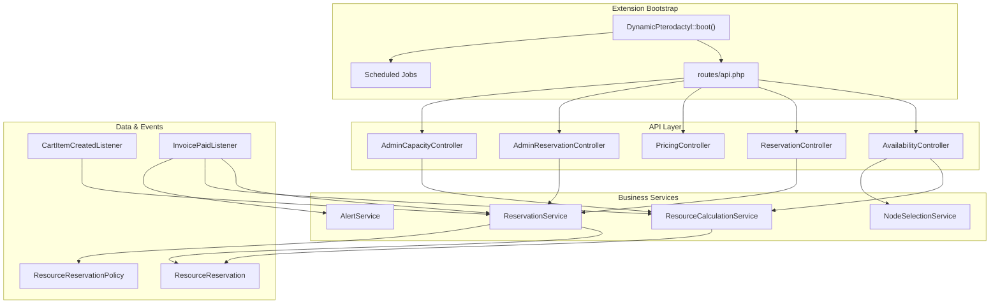
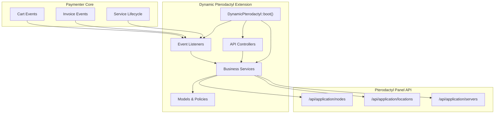
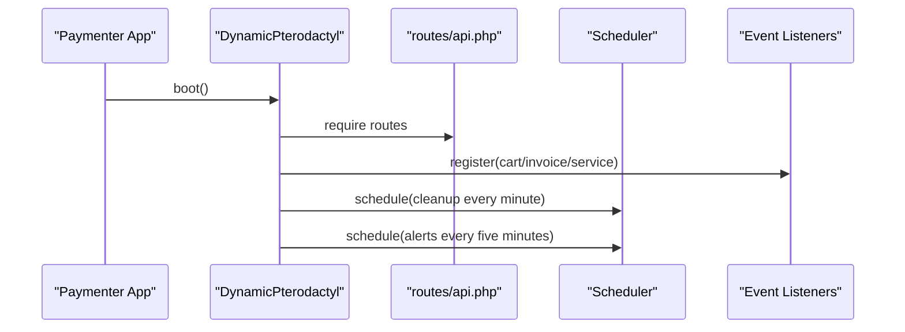
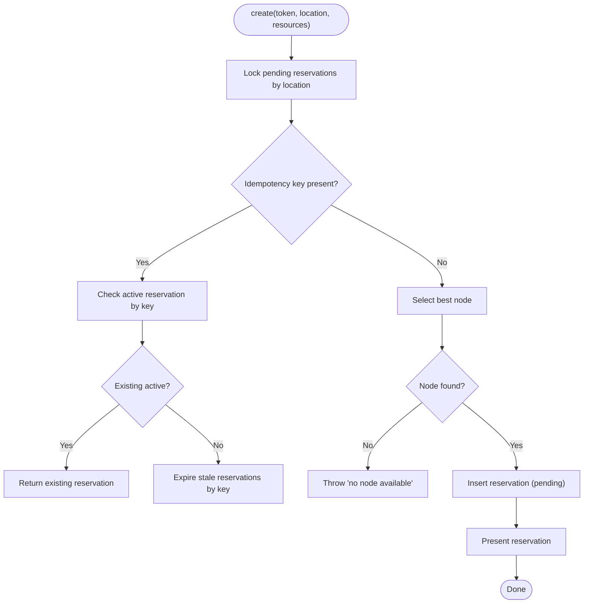
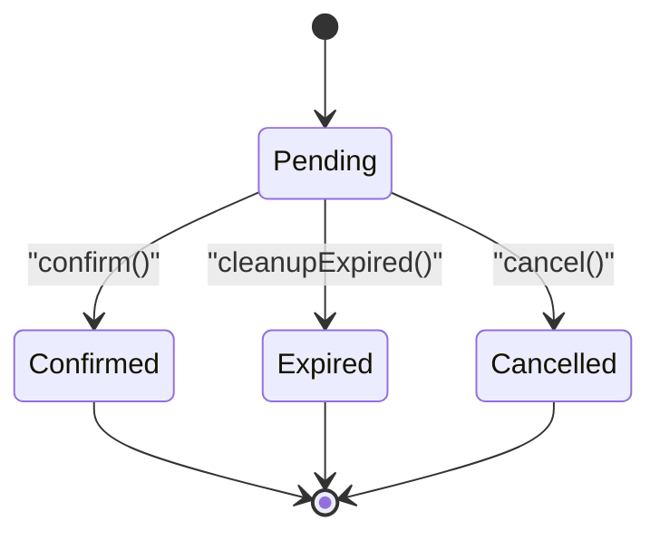
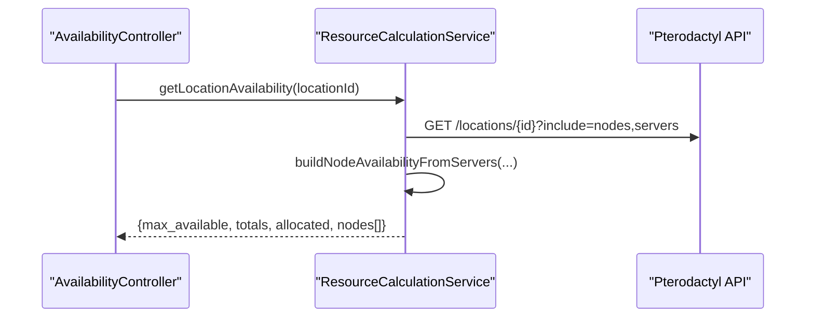
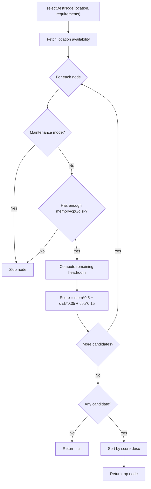
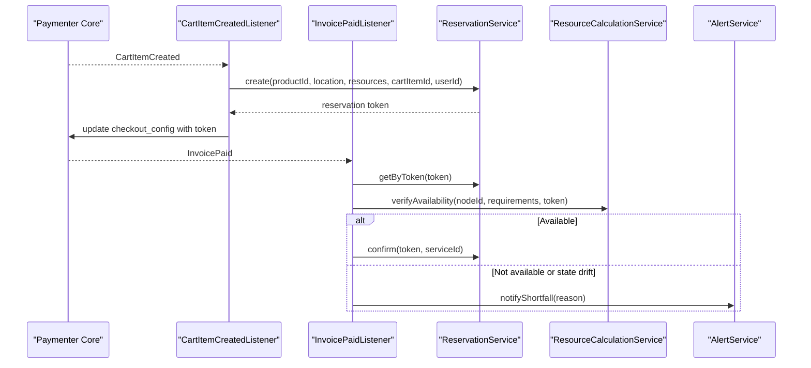
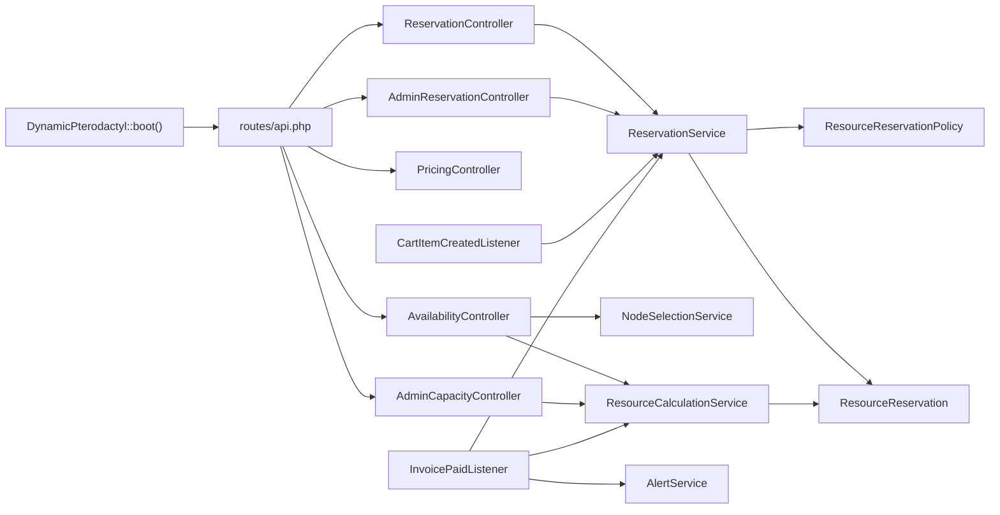

# Architecture Overview

<cite>
**Referenced Files in This Document**
- [DynamicPterodactyl.php](file://DynamicPterodactyl.php)
- [DECISIONS.md](file://DECISIONS.md)
- [AGENTS.md](file://AGENTS.md)
- [routes/api.php](file://routes/api.php)
- [Services/ReservationService.php](file://Services/ReservationService.php)
- [Services/ResourceCalculationService.php](file://Services/ResourceCalculationService.php)
- [Services/NodeSelectionService.php](file://Services/NodeSelectionService.php)
- [Listeners/CartItemCreatedListener.php](file://Listeners/CartItemCreatedListener.php)
- [Listeners/InvoicePaidListener.php](file://Listeners/InvoicePaidListener.php)
- [Http/Controllers/Api/AvailabilityController.php](file://Http/Controllers/Api/AvailabilityController.php)
- [Models/ResourceReservation.php](file://Models/ResourceReservation.php)
- [Policies/ResourceReservationPolicy.php](file://Policies/ResourceReservationPolicy.php)
</cite>

## Table of Contents
1. [Introduction](#introduction)
2. [Project Structure](#project-structure)
3. [Core Components](#core-components)
4. [Architecture Overview](#architecture-overview)
5. [Detailed Component Analysis](#detailed-component-analysis)
6. [Dependency Analysis](#dependency-analysis)
7. [Performance Considerations](#performance-considerations)
8. [Troubleshooting Guide](#troubleshooting-guide)
9. [Conclusion](#conclusion)

## Introduction
This document describes the architecture of the Dynamic Pterodactyl extension as a companion to Paymenter’s built-in Pterodactyl integration. It explains how the extension hooks into Paymenter’s cart, invoice, and service lifecycle events to manage short-lived resource reservations, real-time availability checks against the Pterodactyl panel API, and Filament-based administration. The design emphasizes:
- Companion extension pattern (enhances, does not replace, the built-in Pterodactyl extension)
- Event-driven integration with Paymenter core
- Service-oriented separation between API controllers, business services, and data models
- Real-time API calls without caching
- Pessimistic database locking for reservation safety
- Strict reservation lifecycle states

**Section sources**
- [DynamicPterodactyl.php:25-40](file://DynamicPterodactyl.php#L25-L40)
- [DECISIONS.md:9-24](file://DECISIONS.md#L9-L24)
- [DECISIONS.md:28-44](file://DECISIONS.md#L28-L44)
- [DECISIONS.md:48-63](file://DECISIONS.md#L48-L63)

## Project Structure
The extension is organized by responsibility:
- Extension bootstrap and lifecycle: registers routes, policies, observers, event listeners, and scheduled jobs
- HTTP API layer: thin controllers that validate, authorize, and delegate to services
- Services: business logic for reservations, capacity calculations, node selection, alerts, and setup
- Models: Eloquent models for reservations and alert configuration
- Listeners: adapters from Paymenter core events to extension services
- Policies: authorization rules for reservations
- Admin UI: Filament resources and standalone Blade views
- Database migrations: schema for reservations, audit logs, alerts, and related tables

**Diagram sources**
- [DynamicPterodactyl.php:96-127](file://DynamicPterodactyl.php#L96-L127)
- [routes/api.php:17-40](file://routes/api.php#L17-L40)
- [Http/Controllers/Api/AvailabilityController.php:22-69](file://Http/Controllers/Api/AvailabilityController.php#L22-L69)
- [Services/ReservationService.php:43-141](file://Services/ReservationService.php#L43-L141)
- [Services/ResourceCalculationService.php:26-67](file://Services/ResourceCalculationService.php#L26-L67)
- [Services/NodeSelectionService.php:22-86](file://Services/NodeSelectionService.php#L22-L86)
- [Listeners/CartItemCreatedListener.php:13-87](file://Listeners/CartItemCreatedListener.php#L13-L87)
- [Listeners/InvoicePaidListener.php:14-133](file://Listeners/InvoicePaidListener.php#L14-L133)
- [Models/ResourceReservation.php:10-65](file://Models/ResourceReservation.php#L10-L65)
- [Policies/ResourceReservationPolicy.php:14-68](file://Policies/ResourceReservationPolicy.php#L14-L68)

**Section sources**
- [DynamicPterodactyl.php:96-127](file://DynamicPterodactyl.php#L96-L127)
- [routes/api.php:17-40](file://routes/api.php#L17-L40)
- [AGENTS.md:11-25](file://AGENTS.md#L11-L25)

## Core Components
- Extension bootstrap: loads routes, policy, observers, event listeners, and schedules
- Reservation service: creates, confirms, cancels, extends, and cleans up reservations with pessimistic locking and idempotency
- Resource calculation service: reads live Pterodactyl panel data to compute per-node and per-location availability; builds cluster snapshots
- Node selection service: selects best-fit nodes using weighted headroom scoring
- Listeners: bridge Paymenter core events to extension services
- Policies: enforce ownership and admin access on reservations
- Models: define reservation entity and scopes

Key responsibilities are isolated so each component has a single reason to change:
- Controllers handle HTTP concerns only
- Services encapsulate domain logic
- Models represent persistence and simple queries
- Listeners adapt external events to internal actions

**Section sources**
- [DynamicPterodactyl.php:96-145](file://DynamicPterodactyl.php#L96-L145)
- [Services/ReservationService.php:43-141](file://Services/ReservationService.php#L43-L141)
- [Services/ResourceCalculationService.php:26-67](file://Services/ResourceCalculationService.php#L26-L67)
- [Services/NodeSelectionService.php:22-86](file://Services/NodeSelectionService.php#L22-L86)
- [Listeners/CartItemCreatedListener.php:13-87](file://Listeners/CartItemCreatedListener.php#L13-L87)
- [Listeners/InvoicePaidListener.php:14-133](file://Listeners/InvoicePaidListener.php#L14-L133)
- [Models/ResourceReservation.php:10-65](file://Models/ResourceReservation.php#L10-L65)
- [Policies/ResourceReservationPolicy.php:14-68](file://Policies/ResourceReservationPolicy.php#L14-L68)

## Architecture Overview
The extension follows an event-driven, service-oriented architecture layered over Paymenter core and the Pterodactyl panel API.

System context diagram showing interactions between Paymenter core, Pterodactyl panel API, and extension components:

**Diagram sources**
- [DynamicPterodactyl.php:96-145](file://DynamicPterodactyl.php#L96-L145)
- [routes/api.php:17-40](file://routes/api.php#L17-L40)
- [Services/ResourceCalculationService.php:226-384](file://Services/ResourceCalculationService.php#L226-L384)
- [Listeners/CartItemCreatedListener.php:13-87](file://Listeners/CartItemCreatedListener.php#L13-L87)
- [Listeners/InvoicePaidListener.php:14-133](file://Listeners/InvoicePaidListener.php#L14-L133)

### Key Architectural Decisions
- Companion extension pattern: enhances the built-in Pterodactyl extension rather than replacing it, avoiding duplication of server provisioning logic and enabling graceful degradation if this extension fails.
- Real-time API calls: no caching of Pterodactyl responses to avoid staleness and overselling; batched API calls within a snapshot but never persisted cache.
- Database-backed reservations with pessimistic locking: prevents race conditions during checkout; includes deadlock retry and idempotency support.
- Strict reservation lifecycle: pending → confirmed | expired | cancelled; the released state was removed to simplify semantics and reduce ambiguity.
- Customer-facing endpoints expose aggregate capacity only; raw node-level data is admin-only.

**Section sources**
- [DECISIONS.md:9-24](file://DECISIONS.md#L9-L24)
- [DECISIONS.md:28-44](file://DECISIONS.md#L28-L44)
- [DECISIONS.md:48-63](file://DECISIONS.md#L48-L63)
- [DECISIONS.md:233-239](file://DECISIONS.md#L233-L239)

## Detailed Component Analysis

### Extension Bootstrap and Event Wiring
The extension boot method:
- Registers the reservation policy
- Loads API routes
- Adds view namespace
- Registers event listeners for cart creation/deletion, invoice payment, and service creation
- Observes alert configuration changes
- Schedules cleanup of expired reservations and capacity alert checks

**Diagram sources**
- [DynamicPterodactyl.php:96-127](file://DynamicPterodactyl.php#L96-L127)
- [DynamicPterodactyl.php:132-145](file://DynamicPterodactyl.php#L132-L145)

**Section sources**
- [DynamicPterodactyl.php:96-145](file://DynamicPterodactyl.php#L96-L145)

### Reservation Service: State Machine and Locking
Responsibilities:
- Create reservations with pessimistic DB locks and idempotency keys
- Confirm reservations after successful payment with final availability verification
- Cancel or extend reservations with authorization checks
- Clean up expired reservations via scheduled job
- Audit key transitions

**Diagram sources**
- [Services/ReservationService.php:43-141](file://Services/ReservationService.php#L43-L141)

**Diagram sources**
- [Services/ReservationService.php:166-199](file://Services/ReservationService.php#L166-L199)
- [Services/ReservationService.php:208-241](file://Services/ReservationService.php#L208-L241)
- [Services/ReservationService.php:387-405](file://Services/ReservationService.php#L387-L405)
- [DECISIONS.md:233-235](file://DECISIONS.md#L233-L235)

**Section sources**
- [Services/ReservationService.php:43-141](file://Services/ReservationService.php#L43-L141)
- [Services/ReservationService.php:166-241](file://Services/ReservationService.php#L166-L241)
- [Services/ReservationService.php:387-405](file://Services/ReservationService.php#L387-L405)
- [DECISIONS.md:48-63](file://DECISIONS.md#L48-L63)
- [DECISIONS.md:233-235](file://DECISIONS.md#L233-L235)

### Resource Calculation Service: Real-Time Availability
Responsibilities:
- Fetch locations, nodes, and servers from Pterodactyl panel API
- Compute per-node and per-location availability including allocated and reserved resources
- Build cluster snapshots for admin dashboards
- Verify availability at payment time to prevent drift

**Diagram sources**
- [Http/Controllers/Api/AvailabilityController.php:22-52](file://Http/Controllers/Api/AvailabilityController.php#L22-L52)
- [Services/ResourceCalculationService.php:26-67](file://Services/ResourceCalculationService.php#L26-L67)
- [Services/ResourceCalculationService.php:226-289](file://Services/ResourceCalculationService.php#L226-L289)

**Section sources**
- [Services/ResourceCalculationService.php:26-67](file://Services/ResourceCalculationService.php#L26-L67)
- [Services/ResourceCalculationService.php:226-384](file://Services/ResourceCalculationService.php#L226-L384)
- [Services/ResourceCalculationService.php:452-498](file://Services/ResourceCalculationService.php#L452-L498)

### Node Selection Service: Best-Fit Scoring
Responsibilities:
- Filter candidates by requirements and maintenance mode
- Score nodes by remaining headroom with weights: memory 50%, disk 35%, CPU 15%
- Return the highest-scoring node or null if none fit

**Diagram sources**
- [Services/NodeSelectionService.php:22-86](file://Services/NodeSelectionService.php#L22-L86)

**Section sources**
- [Services/NodeSelectionService.php:22-86](file://Services/NodeSelectionService.php#L22-L86)

### Event-Driven Checkout Flow
The extension integrates with Paymenter core through events:
- Cart item created: create a reservation and store token in checkout config
- Invoice paid: verify availability again, then confirm reservation; notify on shortfall or state drift
- Service created: log linkage for tracking

**Diagram sources**
- [Listeners/CartItemCreatedListener.php:13-87](file://Listeners/CartItemCreatedListener.php#L13-L87)
- [Listeners/InvoicePaidListener.php:14-133](file://Listeners/InvoicePaidListener.php#L14-L133)
- [Services/ReservationService.php:166-199](file://Services/ReservationService.php#L166-L199)
- [Services/ResourceCalculationService.php:200-214](file://Services/ResourceCalculationService.php#L200-L214)

**Section sources**
- [Listeners/CartItemCreatedListener.php:13-87](file://Listeners/CartItemCreatedListener.php#L13-L87)
- [Listeners/InvoicePaidListener.php:14-133](file://Listeners/InvoicePaidListener.php#L14-L133)

### API Layer and Authorization
- Customer endpoints: availability and pricing, throttled to protect Pterodactyl API budget; return aggregate capacity only
- Reservation endpoints: create/get/cancel/extend, throttled for checkout burst tolerance
- Admin endpoints: reservations list, cancel, capacity summary, node details; gated by admin middleware and policy

Authorization:
- Policies allow admin bypass and enforce user ownership for customer actions
- Controllers rely on policies when passing actor context

**Section sources**
- [routes/api.php:17-40](file://routes/api.php#L17-L40)
- [Http/Controllers/Api/AvailabilityController.php:22-69](file://Http/Controllers/Api/AvailabilityController.php#L22-L69)
- [Policies/ResourceReservationPolicy.php:14-68](file://Policies/ResourceReservationPolicy.php#L14-L68)

### Data Models and Persistence
- ResourceReservation model defines fillable fields, casts, relationships, and scopes for pending/expired
- Migrations create reservation, audit, alert, and related tables
- Policies bind to the model for authorization

**Section sources**
- [Models/ResourceReservation.php:10-65](file://Models/ResourceReservation.php#L10-L65)

## Dependency Analysis
The extension exhibits clear separation of concerns:
- Controllers depend on services
- Services depend on models and external APIs
- Listeners depend on services
- Bootstrap wires routes, policies, listeners, and schedules

**Diagram sources**
- [DynamicPterodactyl.php:96-145](file://DynamicPterodactyl.php#L96-L145)
- [routes/api.php:17-40](file://routes/api.php#L17-L40)
- [Http/Controllers/Api/AvailabilityController.php:22-69](file://Http/Controllers/Api/AvailabilityController.php#L22-L69)
- [Services/ReservationService.php:43-141](file://Services/ReservationService.php#L43-L141)
- [Services/ResourceCalculationService.php:26-67](file://Services/ResourceCalculationService.php#L26-L67)
- [Listeners/CartItemCreatedListener.php:13-87](file://Listeners/CartItemCreatedListener.php#L13-L87)
- [Listeners/InvoicePaidListener.php:14-133](file://Listeners/InvoicePaidListener.php#L14-L133)
- [Models/ResourceReservation.php:10-65](file://Models/ResourceReservation.php#L10-L65)
- [Policies/ResourceReservationPolicy.php:14-68](file://Policies/ResourceReservationPolicy.php#L14-L68)

**Section sources**
- [DynamicPterodactyl.php:96-145](file://DynamicPterodactyl.php#L96-L145)
- [routes/api.php:17-40](file://routes/api.php#L17-L40)

## Performance Considerations
- Real-time API calls: avoids cache staleness and overselling; uses connection timeouts and retries for resilience
- Batched API calls: cluster snapshot fetches locations and nodes efficiently while still being uncached
- Throttling: customer endpoints limited to 30 req/min; reservation endpoints to 10 req/min to protect Pterodactyl API budget
- Pessimistic locking: ensures correctness under concurrency; includes deadlock retry to improve throughput
- Scheduled jobs: run with overlap protection to avoid duplicate work

[No sources needed since this section provides general guidance]

## Troubleshooting Guide
Common issues and where to look:
- Reservation conflicts or deadlocks: check ReservationService transaction retries and idempotency handling
- Availability failures: inspect ResourceCalculationService API error surfaces and degraded snapshot behavior
- Shortfall notifications: review InvoicePaidListener shortfall path and AlertService delivery
- Admin visibility: ensure policies allow admin bypass and routes are correctly gated

**Section sources**
- [Services/ReservationService.php:43-141](file://Services/ReservationService.php#L43-L141)
- [Services/ResourceCalculationService.php:410-498](file://Services/ResourceCalculationService.php#L410-L498)
- [Listeners/InvoicePaidListener.php:58-133](file://Listeners/InvoicePaidListener.php#L58-L133)
- [Policies/ResourceReservationPolicy.php:14-68](file://Policies/ResourceReservationPolicy.php#L14-L68)

## Conclusion
The Dynamic Pterodactyl extension integrates seamlessly with Paymenter’s built-in Pterodactyl integration through a companion extension pattern. Its event-driven architecture hooks into cart and invoice lifecycles to manage short-lived reservations backed by pessimistic database locking. The service-oriented design cleanly separates API concerns, business logic, and data models, while real-time API calls guarantee accurate availability. Strict reservation lifecycle states and admin-only exposure of node-level data further strengthen reliability and security.

[No sources needed since this section summarizes without analyzing specific files]
