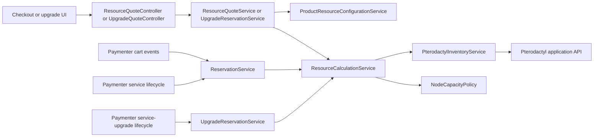

# Architecture Overview

<cite>
**Referenced Files in This Document**
- [DynamicPterodactyl.php](https://github.com/ObsidianNetwork/dynamic-pterodactyl/blob/21901de86765a0c6df71435a9f0123f961aa9f2d/DynamicPterodactyl.php)
- [routes/api.php](https://github.com/ObsidianNetwork/dynamic-pterodactyl/blob/21901de86765a0c6df71435a9f0123f961aa9f2d/routes/api.php)
- [Services/PterodactylInventoryService.php](https://github.com/ObsidianNetwork/dynamic-pterodactyl/blob/21901de86765a0c6df71435a9f0123f961aa9f2d/Services/PterodactylInventoryService.php)
- [Services/ResourceCalculationService.php](https://github.com/ObsidianNetwork/dynamic-pterodactyl/blob/21901de86765a0c6df71435a9f0123f961aa9f2d/Services/ResourceCalculationService.php)
- [Services/ResourceQuoteService.php](https://github.com/ObsidianNetwork/dynamic-pterodactyl/blob/21901de86765a0c6df71435a9f0123f961aa9f2d/Services/ResourceQuoteService.php)
- [Services/ReservationService.php](https://github.com/ObsidianNetwork/dynamic-pterodactyl/blob/21901de86765a0c6df71435a9f0123f961aa9f2d/Services/ReservationService.php)
- [Services/UpgradeReservationService.php](https://github.com/ObsidianNetwork/dynamic-pterodactyl/blob/21901de86765a0c6df71435a9f0123f961aa9f2d/Services/UpgradeReservationService.php)
- [Services/WebhookEndpointPolicy.php](https://github.com/ObsidianNetwork/dynamic-pterodactyl/blob/21901de86765a0c6df71435a9f0123f961aa9f2d/Services/WebhookEndpointPolicy.php)
- [Models/NodeCapacityPolicy.php](https://github.com/ObsidianNetwork/dynamic-pterodactyl/blob/21901de86765a0c6df71435a9f0123f961aa9f2d/Models/NodeCapacityPolicy.php)
- [Listeners/CartItemCreatedListener.php](https://github.com/ObsidianNetwork/dynamic-pterodactyl/blob/21901de86765a0c6df71435a9f0123f961aa9f2d/Listeners/CartItemCreatedListener.php)
- [Listeners/CartItemDeletedListener.php](https://github.com/ObsidianNetwork/dynamic-pterodactyl/blob/21901de86765a0c6df71435a9f0123f961aa9f2d/Listeners/CartItemDeletedListener.php)
</cite>

## Reconciled Architecture

This page is the canonical architecture guide for the branch that combines the
live `ResourceCalculationService` work with the Paymenter 1.5.7 reservation,
upgrade, and lifecycle remediation. The remaining Qoder pages are preserved so
their useful operational and historical detail is not lost. When an older page
mentions a retired controller, listener, or API shape, this page and the current
source take precedence.

The source links on this canonical page pin the latest code-bearing predecessor.
The metadata-only Qoder/Wiki publication commit is intentionally not
self-pinned because its Git object ID does not exist until after its content
has been committed.

DynamicPterodactyl remains a companion to Paymenter's built-in Pterodactyl
extension. Paymenter owns products, invoices, services, and provisioning. This
extension adds live resource quotes, short-lived capacity commitments, node and
allocation selection, upgrade commitments, alerting, and operator tooling.

## Runtime Boundaries

The extension has four important boundaries:

1. **Inventory boundary.** `PterodactylInventoryService` is the only component
   that speaks the panel's application API. It reads every page, rejects missing
   or inconsistent pagination, rejects duplicate resources, validates response
   types, and sanitizes customer-visible failures.
2. **Capacity boundary.** `ResourceCalculationService` combines live node,
   server, and allocation inventory with local reservations. CPU capacity comes
   from the locally administered `NodeCapacityPolicy`; stock Pterodactyl does
   not expose a `cpu_threads` node field.
3. **Commitment boundary.** `ReservationService` and
   `UpgradeReservationService` use database locks, immutable snapshots,
   idempotency, leases, and explicit state transitions. A quote never reserves
   capacity by itself.
4. **Provisioning boundary.** Paid commitment and provisioning transitions are
   owned by Paymenter's service and service-upgrade lifecycle. The reconciled
   design does not use an extension `InvoicePaidListener` or
   `ServiceCreatedListener`.

## Live Inventory Contract

The application API key needs read access to locations, nodes, servers, and
allocations. Inventory reads use the stock Pterodactyl 1.12.3+ shapes:

- paginated `GET /api/application/locations`;
- paginated `GET /api/application/nodes?include=allocations`;
- paginated `GET /api/application/servers?include=allocations`;
- `GET /api/application/nodes/{id}/allocations` when a node-level allocation
  refresh is required.

Every paginated snapshot must keep the same total, page size, and last page for
its entire read. Required relationships and integral resource fields fail
closed. A partial or malformed upstream response is never interpreted as zero
usage or spare capacity.

## Quote and Reservation Flow

The customer-facing product endpoint accepts the full RAM, CPU, disk, and
allocation vector. `ProductResourceConfigurationService` resolves native
Paymenter config options; `ResourceQuoteService` then asks
`ResourceCalculationService` for a complete live bound and returns only
customer-safe aggregate data.

Adding or updating a cart item invokes `CartItemCreatedListener`, which delegates
to `ReservationService::reserveForCartItem()`. Paymenter's surrounding database
transaction rolls back the cart mutation if capacity cannot be committed.
Deleting an item invokes `CartItemDeletedListener` and cancels its pending
commitment. Paid service and upgrade flows revalidate their signed snapshot
against current inventory before provisioning may continue.

## HTTP Surface

The reconciled API is intentionally small:

| Method and path | Access | Purpose |
|---|---|---|
| `POST /api/dynamic-pterodactyl/products/{product}/resource-quote` | Guest-safe web session, throttled | Full-vector product quote without infrastructure identity |
| `POST /api/dynamic-pterodactyl/services/{service}/upgrade-quote` | Authenticated owner, throttled | Quote an existing-service upgrade |
| `GET /api/dynamic-pterodactyl/admin/reservations` | Admin | Inspect commitments |
| `POST /api/dynamic-pterodactyl/admin/reservations/{token}/cancel` | Admin | Cancel a commitment |
| `GET /api/dynamic-pterodactyl/admin/capacity` | Admin | Aggregate capacity snapshot |
| `GET /api/dynamic-pterodactyl/admin/availability/{locationId}/nodes` | Admin | Node-level diagnostic inventory |

There are no standalone public availability, pricing, create-reservation,
confirm-reservation, or extend-reservation endpoints. Pricing authority remains
in Paymenter core.

## Operational Safety

- The Pterodactyl application key is stored encrypted after the companion
  Paymenter migration and is sent only in the `Authorization` header.
- Dynamic stock requires administrator-confirmed exclusive provisioning control
  for every eligible node. Out-of-band creates, moves, resizes, or allocation
  assignment can invalidate reservations.
- Scheduler heartbeats, bounded scans, failure records, and operator alerts make
  cleanup and reconciliation failures visible.
- Customer responses never expose upstream bodies, API keys, node identities,
  or internal exception details.
- Alert webhooks must use public HTTPS endpoints. Delivery revalidates every
  resolved address, rejects non-public or mixed DNS answers, disables redirects
  and proxies, and pins the connection to a validated address.
- The test harness accepts only an explicitly named test database or the private
  `:temporary:` named-memory SQLite claim; production or shared databases are
  rejected before Paymenter boots.

## Source Guides

For implementation-level detail, use these versioned repository guides:

- [02-SERVICES.md](https://github.com/ObsidianNetwork/dynamic-pterodactyl/blob/21901de86765a0c6df71435a9f0123f961aa9f2d/02-SERVICES.md)
- [03-API.md](https://github.com/ObsidianNetwork/dynamic-pterodactyl/blob/21901de86765a0c6df71435a9f0123f961aa9f2d/03-API.md)
- [04-EVENTS.md](https://github.com/ObsidianNetwork/dynamic-pterodactyl/blob/21901de86765a0c6df71435a9f0123f961aa9f2d/04-EVENTS.md)
- [09-IMPLEMENTATION.md](https://github.com/ObsidianNetwork/dynamic-pterodactyl/blob/21901de86765a0c6df71435a9f0123f961aa9f2d/09-IMPLEMENTATION.md)
- [DECISIONS.md](https://github.com/ObsidianNetwork/dynamic-pterodactyl/blob/21901de86765a0c6df71435a9f0123f961aa9f2d/DECISIONS.md)
- [PROGRESS.md](https://github.com/ObsidianNetwork/dynamic-pterodactyl/blob/21901de86765a0c6df71435a9f0123f961aa9f2d/PROGRESS.md)
