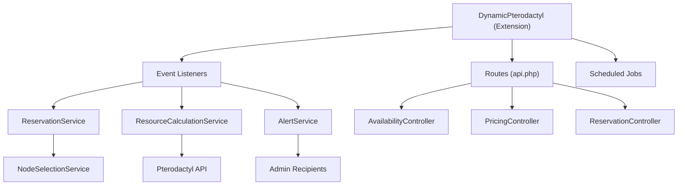
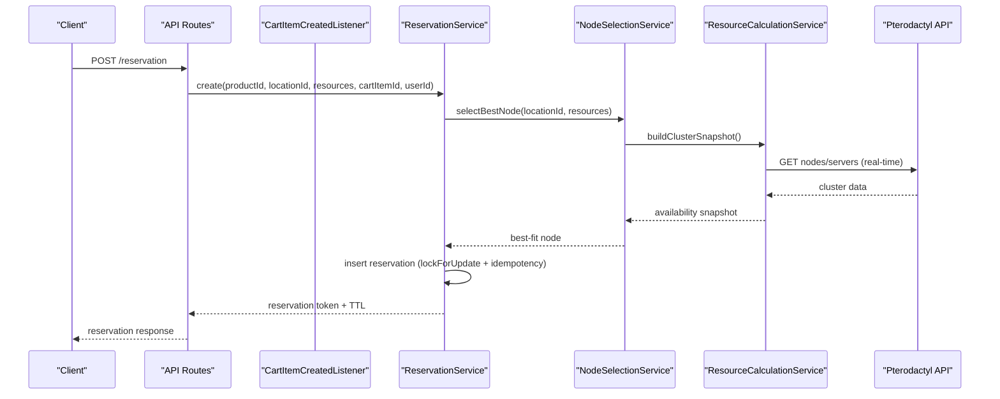
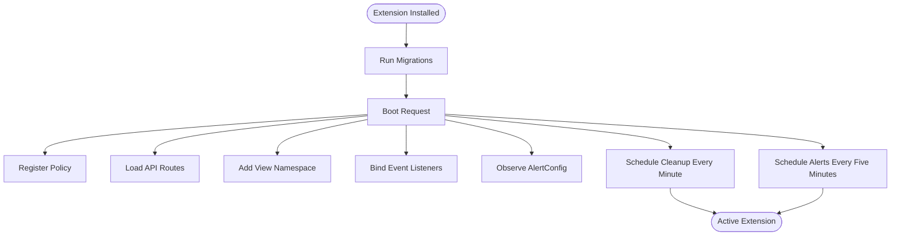
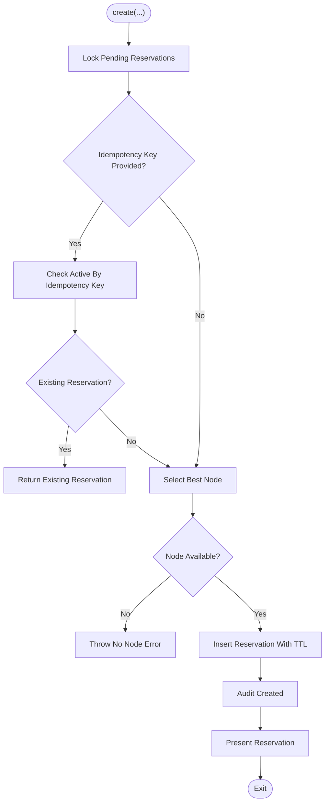
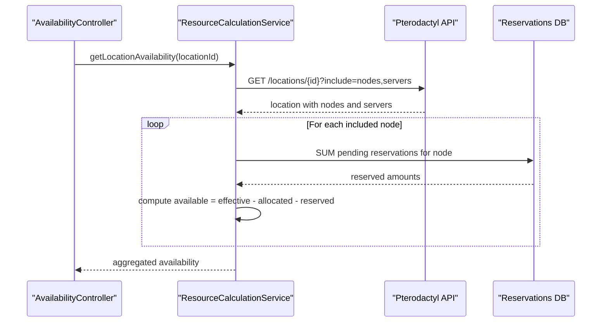
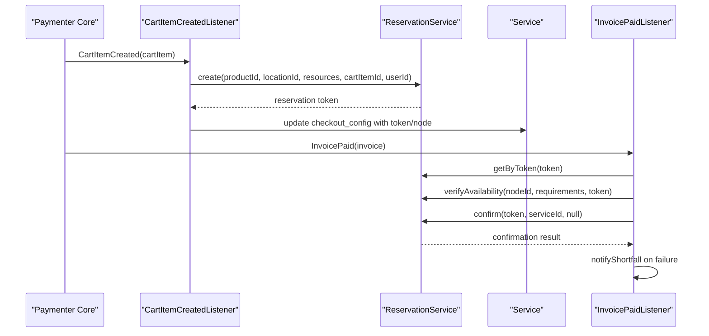
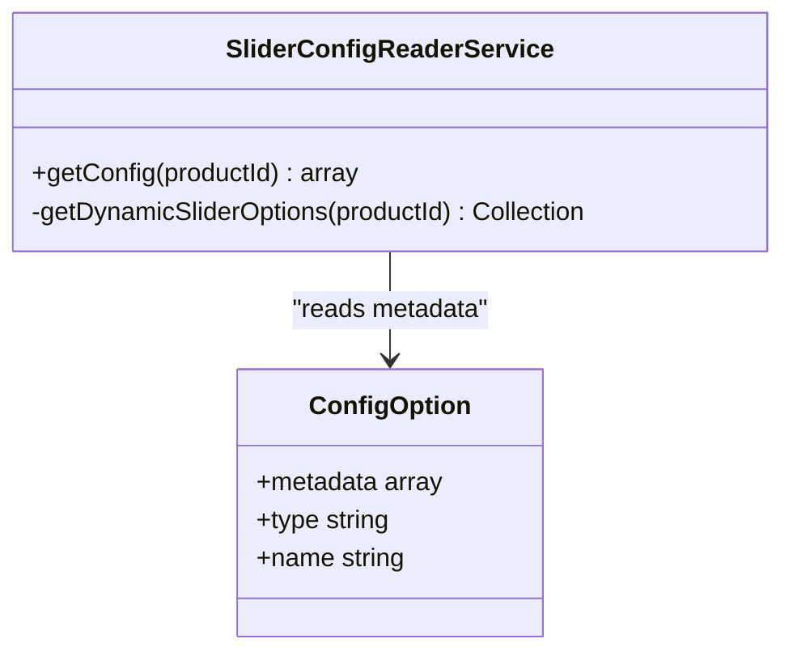
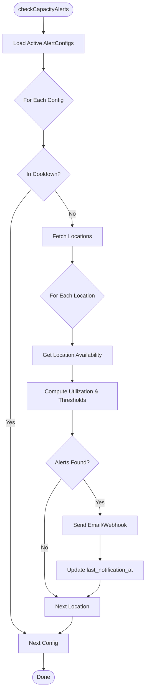
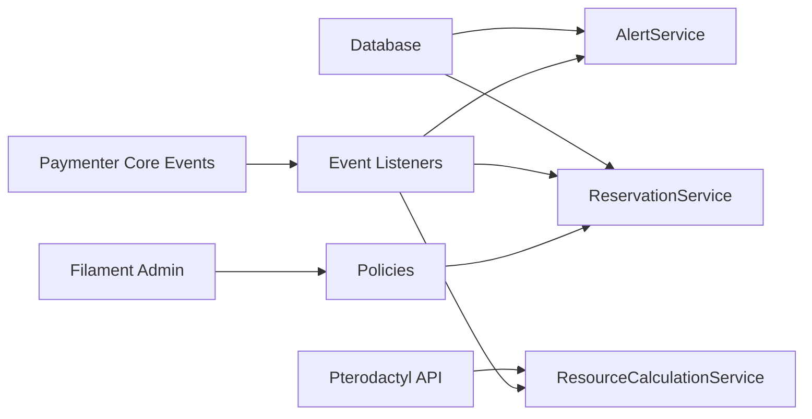

# Companion Extension Pattern

> **Preserved Qoder snapshot.** This deep-dive page is retained so the earlier Wiki work and its source trail are not lost. For the reconciled implementation, [[Architecture Overview|Architecture-Overview]] is canonical; references below to retired controllers, listeners, services, or API shapes are historical.

<cite>
**Referenced Files in This Document**
- [DynamicPterodactyl.php](https://github.com/ObsidianNetwork/dynamic-pterodactyl/blob/6b7f83bda6f7c3fe014d52428b31af1638daa6cc/DynamicPterodactyl.php)
- [routes/api.php](https://github.com/ObsidianNetwork/dynamic-pterodactyl/blob/6b7f83bda6f7c3fe014d52428b31af1638daa6cc/routes/api.php)
- [Listeners/CartItemCreatedListener.php](https://github.com/ObsidianNetwork/dynamic-pterodactyl/blob/6b7f83bda6f7c3fe014d52428b31af1638daa6cc/Listeners/CartItemCreatedListener.php)
- [Listeners/InvoicePaidListener.php](https://github.com/ObsidianNetwork/dynamic-pterodactyl/blob/6b7f83bda6f7c3fe014d52428b31af1638daa6cc/Listeners/InvoicePaidListener.php)
- [Services/ReservationService.php](https://github.com/ObsidianNetwork/dynamic-pterodactyl/blob/6b7f83bda6f7c3fe014d52428b31af1638daa6cc/Services/ReservationService.php)
- [Services/ResourceCalculationService.php](https://github.com/ObsidianNetwork/dynamic-pterodactyl/blob/6b7f83bda6f7c3fe014d52428b31af1638daa6cc/Services/ResourceCalculationService.php)
- [Services/AlertService.php](https://github.com/ObsidianNetwork/dynamic-pterodactyl/blob/6b7f83bda6f7c3fe014d52428b31af1638daa6cc/Services/AlertService.php)
- [Services/SliderConfigReaderService.php](https://github.com/ObsidianNetwork/dynamic-pterodactyl/blob/6b7f83bda6f7c3fe014d52428b31af1638daa6cc/Services/SliderConfigReaderService.php)
- [Models/ResourceReservation.php](https://github.com/ObsidianNetwork/dynamic-pterodactyl/blob/6b7f83bda6f7c3fe014d52428b31af1638daa6cc/Models/ResourceReservation.php)
- [AGENTS.md](https://github.com/ObsidianNetwork/dynamic-pterodactyl/blob/6b7f83bda6f7c3fe014d52428b31af1638daa6cc/AGENTS.md)
- [DECISIONS.md](https://github.com/ObsidianNetwork/dynamic-pterodactyl/blob/6b7f83bda6f7c3fe014d52428b31af1638daa6cc/DECISIONS.md)
</cite>

## Table of Contents
1. [Introduction](#introduction)
2. [Project Structure](#project-structure)
3. [Core Components](#core-components)
4. [Architecture Overview](#architecture-overview)
5. [Detailed Component Analysis](#detailed-component-analysis)
6. [Dependency Analysis](#dependency-analysis)
7. [Performance Considerations](#performance-considerations)
8. [Troubleshooting Guide](#troubleshooting-guide)
9. [Conclusion](#conclusion)

## Introduction
This document explains the companion extension pattern used by Dynamic Pterodactyl within Paymenter. The extension enhances the built-in Pterodactyl server extension rather than replacing it. It owns dynamic resource sliders metadata, real-time availability reads from the Pterodactyl API, short-lived reservations during checkout, and administrative alerts. Pricing remains owned by Paymenter’s native dynamic slider system; this extension never calculates prices but reads slider configuration metadata and manages reservations and availability.

The extension integrates through Paymenter’s Extension base class, registers routes and event listeners at boot, manages its own database migrations on install/uninstall, and coexists with core pricing and service management without interfering with provisioning logic.

**Section sources**
- [DynamicPterodactyl.php:25-41](https://github.com/ObsidianNetwork/dynamic-pterodactyl/blob/6b7f83bda6f7c3fe014d52428b31af1638daa6cc/DynamicPterodactyl.php#L25-L41)
- [DECISIONS.md:9-25](https://github.com/ObsidianNetwork/dynamic-pterodactyl/blob/6b7f83bda6f7c3fe014d52428b31af1638daa6cc/DECISIONS.md#L9-L25)
- [AGENTS.md:7-10](https://github.com/ObsidianNetwork/dynamic-pterodactyl/blob/6b7f83bda6f7c3fe014d52428b31af1638daa6cc/AGENTS.md#L7-L10)

## Project Structure
At a high level, the extension is organized into:
- Extension lifecycle and registration: DynamicPterodactyl.php
- HTTP API surface: routes/api.php and controllers under Http/Controllers/Api
- Event listeners bridging Paymenter’s cart/invoice/service lifecycle to reservation operations
- Services for reservations, capacity calculations, alerts, and slider config reading
- Models for reservations and alerting entities
- Database migrations for extension-owned tables
- Admin pages and views for Filament 4 administration

**Diagram sources**
- [DynamicPterodactyl.php:96-127](https://github.com/ObsidianNetwork/dynamic-pterodactyl/blob/6b7f83bda6f7c3fe014d52428b31af1638daa6cc/DynamicPterodactyl.php#L96-L127)
- [routes/api.php:17-40](https://github.com/ObsidianNetwork/dynamic-pterodactyl/blob/6b7f83bda6f7c3fe014d52428b31af1638daa6cc/routes/api.php#L17-L40)
- [Services/ReservationService.php:16-35](https://github.com/ObsidianNetwork/dynamic-pterodactyl/blob/6b7f83bda6f7c3fe014d52428b31af1638daa6cc/Services/ReservationService.php#L16-L35)
- [Services/ResourceCalculationService.php:10-21](https://github.com/ObsidianNetwork/dynamic-pterodactyl/blob/6b7f83bda6f7c3fe014d52428b31af1638daa6cc/Services/ResourceCalculationService.php#L10-L21)
- [Services/AlertService.php:19-28](https://github.com/ObsidianNetwork/dynamic-pterodactyl/blob/6b7f83bda6f7c3fe014d52428b31af1638daa6cc/Services/AlertService.php#L19-L28)

**Section sources**
- [DynamicPterodactyl.php:96-127](https://github.com/ObsidianNetwork/dynamic-pterodactyl/blob/6b7f83bda6f7c3fe014d52428b31af1638daa6cc/DynamicPterodactyl.php#L96-L127)
- [routes/api.php:17-40](https://github.com/ObsidianNetwork/dynamic-pterodactyl/blob/6b7f83bda6f7c3fe014d52428b31af1638daa6cc/routes/api.php#L17-L40)
- [AGENTS.md:11-26](https://github.com/ObsidianNetwork/dynamic-pterodactyl/blob/6b7f83bda6f7c3fe014d52428b31af1638daa6cc/AGENTS.md#L11-L26)

## Core Components
- Extension bootstrap: installs migrations, registers policies, loads routes, adds view namespace, binds event listeners, and schedules cleanup/alert checks.
- ReservationService: creates, confirms, cancels, extends, queries, and cleans up resource reservations with pessimistic locking and idempotency support.
- ResourceCalculationService: fetches live node and server data from Pterodactyl, computes per-node and per-location availability, and verifies availability at payment time.
- AlertService: scans capacity thresholds, sends email/webhook notifications, logs delivery outcomes, and notifies admins on reservation shortfalls or state drift.
- SliderConfigReaderService: reads native dynamic_slider ConfigOption metadata for frontend consumption without owning pricing math.
- Event listeners: CartItemCreatedListener creates reservations when items are added; InvoicePaidListener performs final verification and confirmation; others handle deletion and service creation tracking.

**Section sources**
- [DynamicPterodactyl.php:48-127](https://github.com/ObsidianNetwork/dynamic-pterodactyl/blob/6b7f83bda6f7c3fe014d52428b31af1638daa6cc/DynamicPterodactyl.php#L48-L127)
- [Services/ReservationService.php:16-453](https://github.com/ObsidianNetwork/dynamic-pterodactyl/blob/6b7f83bda6f7c3fe014d52428b31af1638daa6cc/Services/ReservationService.php#L16-L453)
- [Services/ResourceCalculationService.php:10-545](https://github.com/ObsidianNetwork/dynamic-pterodactyl/blob/6b7f83bda6f7c3fe014d52428b31af1638daa6cc/Services/ResourceCalculationService.php#L10-L545)
- [Services/AlertService.php:19-392](https://github.com/ObsidianNetwork/dynamic-pterodactyl/blob/6b7f83bda6f7c3fe014d52428b31af1638daa6cc/Services/AlertService.php#L19-L392)
- [Services/SliderConfigReaderService.php:7-68](https://github.com/ObsidianNetwork/dynamic-pterodactyl/blob/6b7f83bda6f7c3fe014d52428b31af1638daa6cc/Services/SliderConfigReaderService.php#L7-L68)
- [Listeners/CartItemCreatedListener.php:11-173](https://github.com/ObsidianNetwork/dynamic-pterodactyl/blob/6b7f83bda6f7c3fe014d52428b31af1638daa6cc/Listeners/CartItemCreatedListener.php#L11-L173)
- [Listeners/InvoicePaidListener.php:12-135](https://github.com/ObsidianNetwork/dynamic-pterodactyl/blob/6b7f83bda6f7c3fe014d52428b31af1638daa6cc/Listeners/InvoicePaidListener.php#L12-L135)

## Architecture Overview
The extension follows a companion pattern:
- It does not replace Paymenter’s built-in Pterodactyl server extension; instead, it augments it with dynamic sliders metadata, availability, and reservations.
- Pricing logic remains in Paymenter core via Plan and ConfigOption methods; this extension only reads slider metadata and delegates pricing to core.
- Real-time availability is enforced by calling the Pterodactyl API directly without caching, ensuring accurate limits during checkout.
- Reservations use database-level pessimistic locking and idempotency keys to prevent overselling and duplicate operations.
- Administrative alerts monitor capacity thresholds and notify administrators via configured channels.

**Diagram sources**
- [routes/api.php:24-30](https://github.com/ObsidianNetwork/dynamic-pterodactyl/blob/6b7f83bda6f7c3fe014d52428b31af1638daa6cc/routes/api.php#L24-L30)
- [Services/ReservationService.php:43-141](https://github.com/ObsidianNetwork/dynamic-pterodactyl/blob/6b7f83bda6f7c3fe014d52428b31af1638daa6cc/Services/ReservationService.php#L43-L141)
- [Services/ResourceCalculationService.php:69-141](https://github.com/ObsidianNetwork/dynamic-pterodactyl/blob/6b7f83bda6f7c3fe014d52428b31af1638daa6cc/Services/ResourceCalculationService.php#L69-L141)

**Section sources**
- [DECISIONS.md:9-25](https://github.com/ObsidianNetwork/dynamic-pterodactyl/blob/6b7f83bda6f7c3fe014d52428b31af1638daa6cc/DECISIONS.md#L9-L25)
- [DECISIONS.md:28-45](https://github.com/ObsidianNetwork/dynamic-pterodactyl/blob/6b7f83bda6f7c3fe014d52428b31af1638daa6cc/DECISIONS.md#L28-L45)
- [DECISIONS.md:48-63](https://github.com/ObsidianNetwork/dynamic-pterodactyl/blob/6b7f83bda6f7c3fe014d52428b31af1638daa6cc/DECISIONS.md#L48-L63)

## Detailed Component Analysis

### Extension Lifecycle: Installation, Boot, Configuration
- Installation runs migrations for extension-owned tables. Uninstallation rolls them back.
- Boot registers a policy for ResourceReservation, loads API routes, adds a view namespace, binds event listeners, observes AlertConfig, and schedules cleanup and alert checks.
- Configuration exposes panel URL, API key, and reservation TTL settings.

**Diagram sources**
- [DynamicPterodactyl.php:77-127](https://github.com/ObsidianNetwork/dynamic-pterodactyl/blob/6b7f83bda6f7c3fe014d52428b31af1638daa6cc/DynamicPterodactyl.php#L77-L127)

**Section sources**
- [DynamicPterodactyl.php:48-127](https://github.com/ObsidianNetwork/dynamic-pterodactyl/blob/6b7f83bda6f7c3fe014d52428b31af1638daa6cc/DynamicPterodactyl.php#L48-L127)

### Reservation Service: State Machine and Concurrency
- Create: uses transaction with lockForUpdate on pending reservations for the target location, supports idempotency keys, selects best node, inserts reservation with TTL, and audits creation.
- Confirm: authorizes actor if provided, updates status to confirmed with service linkage, and audits confirmation.
- Cancel: authorizes actor if provided, updates status to cancelled with optional reason, and audits cancellation.
- Extend: authorizes actor if provided, extends TTL, and audits extension.
- Cleanup: marks expired pending reservations and audits batch expiration.

**Diagram sources**
- [Services/ReservationService.php:43-141](https://github.com/ObsidianNetwork/dynamic-pterodactyl/blob/6b7f83bda6f7c3fe014d52428b31af1638daa6cc/Services/ReservationService.php#L43-L141)

**Section sources**
- [Services/ReservationService.php:43-405](https://github.com/ObsidianNetwork/dynamic-pterodactyl/blob/6b7f83bda6f7c3fe014d52428b31af1638daa6cc/Services/ReservationService.php#L43-L405)

### Availability and Capacity: Real-Time Reads and Aggregation
- Location availability fetches nodes in a location, calculates per-node availability including allocated servers and pending reservations, aggregates max available and totals.
- Cluster snapshot builds a comprehensive view across all locations and nodes, incorporating pending reservations and utilization metrics.
- Verification re-checks availability at payment time using current node data and excludes the current reservation token to avoid self-interference.

**Diagram sources**
- [Services/ResourceCalculationService.php:26-67](https://github.com/ObsidianNetwork/dynamic-pterodactyl/blob/6b7f83bda6f7c3fe014d52428b31af1638daa6cc/Services/ResourceCalculationService.php#L26-L67)
- [Services/ResourceCalculationService.php:227-257](https://github.com/ObsidianNetwork/dynamic-pterodactyl/blob/6b7f83bda6f7c3fe014d52428b31af1638daa6cc/Services/ResourceCalculationService.php#L227-L257)
- [Services/ResourceCalculationService.php:426-450](https://github.com/ObsidianNetwork/dynamic-pterodactyl/blob/6b7f83bda6f7c3fe014d52428b31af1638daa6cc/Services/ResourceCalculationService.php#L426-L450)

**Section sources**
- [Services/ResourceCalculationService.php:26-141](https://github.com/ObsidianNetwork/dynamic-pterodactyl/blob/6b7f83bda6f7c3fe014d52428b31af1638daa6cc/Services/ResourceCalculationService.php#L26-L141)
- [Services/ResourceCalculationService.php:197-214](https://github.com/ObsidianNetwork/dynamic-pterodactyl/blob/6b7f83bda6f7c3fe014d52428b31af1638daa6cc/Services/ResourceCalculationService.php#L197-L214)

### Event Integration: Checkout Flow and Reconciliation
- CartItemCreatedListener detects products with dynamic_slider options, extracts resource values and location, and creates a reservation storing token and selected node in checkout_config.
- InvoicePaidListener retrieves the reservation token from service properties, verifies availability one last time, confirms the reservation, and notifies admins on shortfall or state drift.

**Diagram sources**
- [Listeners/CartItemCreatedListener.php:13-87](https://github.com/ObsidianNetwork/dynamic-pterodactyl/blob/6b7f83bda6f7c3fe014d52428b31af1638daa6cc/Listeners/CartItemCreatedListener.php#L13-L87)
- [Listeners/InvoicePaidListener.php:14-135](https://github.com/ObsidianNetwork/dynamic-pterodactyl/blob/6b7f83bda6f7c3fe014d52428b31af1638daa6cc/Listeners/InvoicePaidListener.php#L14-L135)

**Section sources**
- [Listeners/CartItemCreatedListener.php:13-173](https://github.com/ObsidianNetwork/dynamic-pterodactyl/blob/6b7f83bda6f7c3fe014d52428b31af1638daa6cc/Listeners/CartItemCreatedListener.php#L13-L173)
- [Listeners/InvoicePaidListener.php:14-135](https://github.com/ObsidianNetwork/dynamic-pterodactyl/blob/6b7f83bda6f7c3fe014d52428b31af1638daa6cc/Listeners/InvoicePaidListener.php#L14-L135)

### Pricing Coexistence: Native Slider Metadata Only
- SliderConfigReaderService reads dynamic_slider ConfigOption metadata (min, max, step, default, unit, display_unit, display_divisor, pricing model/rates) for frontend consumption.
- Pricing calculation remains in Paymenter core; this extension calls core methods directly where needed and never stores pricing models in extension tables.

**Diagram sources**
- [Services/SliderConfigReaderService.php:7-68](https://github.com/ObsidianNetwork/dynamic-pterodactyl/blob/6b7f83bda6f7c3fe014d52428b31af1638daa6cc/Services/SliderConfigReaderService.php#L7-L68)

**Section sources**
- [Services/SliderConfigReaderService.php:14-53](https://github.com/ObsidianNetwork/dynamic-pterodactyl/blob/6b7f83bda6f7c3fe014d52428b31af1638daa6cc/Services/SliderConfigReaderService.php#L14-L53)
- [DECISIONS.md:67-84](https://github.com/ObsidianNetwork/dynamic-pterodactyl/blob/6b7f83bda6f7c3fe014d52428b31af1638daa6cc/DECISIONS.md#L67-L84)

### Admin Alerts and Observability
- AlertService scans active alert configurations, computes utilization percentages, triggers warnings/criticals based on thresholds, and delivers notifications via email and webhook.
- Delivery outcomes are logged; failures emit events and warnings. Shortfall notifications inform admins when availability changes between verification and confirmation.

**Diagram sources**
- [Services/AlertService.php:33-75](https://github.com/ObsidianNetwork/dynamic-pterodactyl/blob/6b7f83bda6f7c3fe014d52428b31af1638daa6cc/Services/AlertService.php#L33-L75)
- [Services/AlertService.php:77-126](https://github.com/ObsidianNetwork/dynamic-pterodactyl/blob/6b7f83bda6f7c3fe014d52428b31af1638daa6cc/Services/AlertService.php#L77-L126)
- [Services/AlertService.php:128-248](https://github.com/ObsidianNetwork/dynamic-pterodactyl/blob/6b7f83bda6f7c3fe014d52428b31af1638daa6cc/Services/AlertService.php#L128-L248)

**Section sources**
- [Services/AlertService.php:33-248](https://github.com/ObsidianNetwork/dynamic-pterodactyl/blob/6b7f83bda6f7c3fe014d52428b31af1638daa6cc/Services/AlertService.php#L33-L248)

## Dependency Analysis
The extension depends on:
- Paymenter core events for cart, invoice, and service lifecycle
- Pterodactyl API for real-time node/server data
- Database for reservations, audit logs, alert configs, and delivery logs
- Filament 4 for admin UI components and standalone pages

**Diagram sources**
- [DynamicPterodactyl.php:96-127](https://github.com/ObsidianNetwork/dynamic-pterodactyl/blob/6b7f83bda6f7c3fe014d52428b31af1638daa6cc/DynamicPterodactyl.php#L96-L127)
- [Services/ReservationService.php:16-35](https://github.com/ObsidianNetwork/dynamic-pterodactyl/blob/6b7f83bda6f7c3fe014d52428b31af1638daa6cc/Services/ReservationService.php#L16-L35)
- [Services/ResourceCalculationService.php:10-21](https://github.com/ObsidianNetwork/dynamic-pterodactyl/blob/6b7f83bda6f7c3fe014d52428b31af1638daa6cc/Services/ResourceCalculationService.php#L10-L21)
- [Services/AlertService.php:19-28](https://github.com/ObsidianNetwork/dynamic-pterodactyl/blob/6b7f83bda6f7c3fe014d52428b31af1638daa6cc/Services/AlertService.php#L19-L28)

**Section sources**
- [AGENTS.md:43-58](https://github.com/ObsidianNetwork/dynamic-pterodactyl/blob/6b7f83bda6f7c3fe014d52428b31af1638daa6cc/AGENTS.md#L43-L58)
- [DECISIONS.md:28-45](https://github.com/ObsidianNetwork/dynamic-pterodactyl/blob/6b7f83bda6f7c3fe014d52428b31af1638daa6cc/DECISIONS.md#L28-L45)

## Performance Considerations
- Real-time API calls are intentional to avoid staleness and overselling; rate limits and timeouts are handled with retries and degraded snapshots when necessary.
- Reservation writes use pessimistic locking and transaction retries to mitigate deadlocks.
- Customer-facing endpoints expose aggregate capacity only; node-level details are admin-only to reduce exposure and improve performance.
- Schedules run frequently but with lightweight operations: cleanup every minute, alerts every five minutes.

[No sources needed since this section provides general guidance]

## Troubleshooting Guide
Common issues and diagnostics:
- Missing reservation token after payment: check InvoicePaidListener flow and ensure service properties contain _reservation_token.
- Availability verification fails at payment time: inspect ResourceCalculationService::verifyAvailability and Pterodactyl API responses; review logs for connection errors or rate limiting.
- Reservation conflicts or duplicates: verify idempotency_key usage and unique constraint handling in ReservationService::create.
- Alert delivery failures: check AlertService sendNotifications and delivery logs; ensure email/webhook channels are configured and recipients exist.

**Section sources**
- [Listeners/InvoicePaidListener.php:58-135](https://github.com/ObsidianNetwork/dynamic-pterodactyl/blob/6b7f83bda6f7c3fe014d52428b31af1638daa6cc/Listeners/InvoicePaidListener.php#L58-L135)
- [Services/ResourceCalculationService.php:452-498](https://github.com/ObsidianNetwork/dynamic-pterodactyl/blob/6b7f83bda6f7c3fe014d52428b31af1638daa6cc/Services/ResourceCalculationService.php#L452-L498)
- [Services/ReservationService.php:125-141](https://github.com/ObsidianNetwork/dynamic-pterodactyl/blob/6b7f83bda6f7c3fe014d52428b31af1638daa6cc/Services/ReservationService.php#L125-L141)
- [Services/AlertService.php:128-248](https://github.com/ObsidianNetwork/dynamic-pterodactyl/blob/6b7f83bda6f7c3fe014d52428b31af1638daa6cc/Services/AlertService.php#L128-L248)

## Conclusion
Dynamic Pterodactyl implements a robust companion extension pattern that enhances Paymenter’s built-in Pterodactyl integration without replacing core functionality. It maintains separation of concerns by delegating pricing to core while owning reservations, availability, and alerts. The extension lifecycle is cleanly managed through installation, boot, and scheduled tasks, and it integrates deeply with Paymenter’s event system to ensure reliable checkout flows. Real-time API access, pessimistic locking, and thorough auditing provide correctness and observability, while admin tools and Filament 4 interfaces offer operational control.

[No sources needed since this section summarizes without analyzing specific files]
