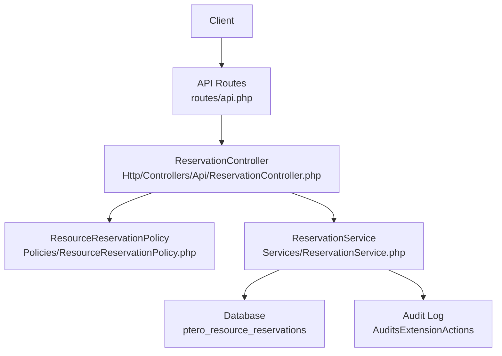
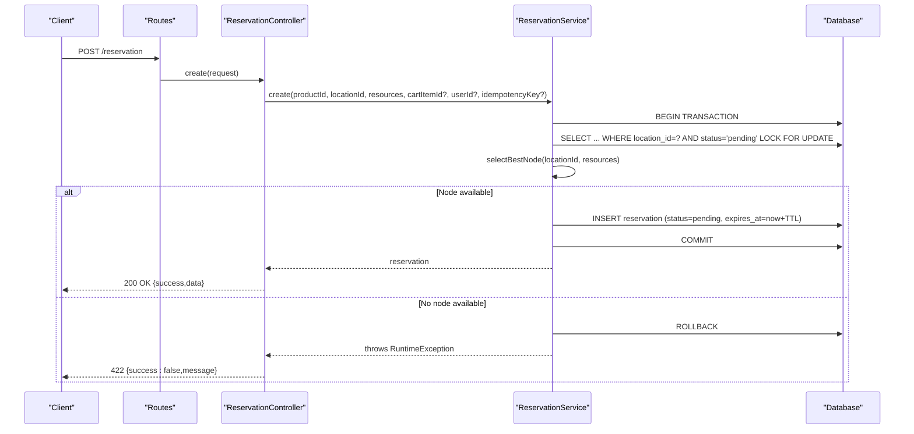
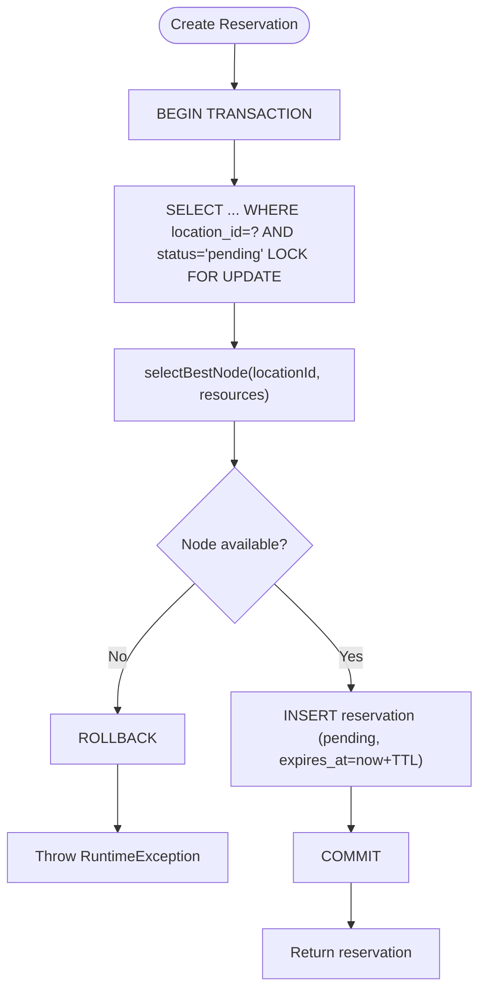
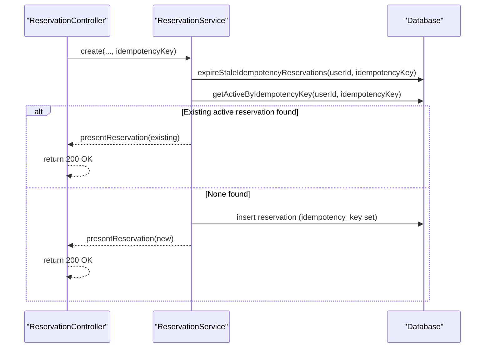
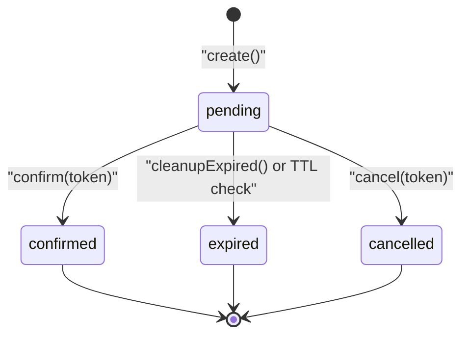
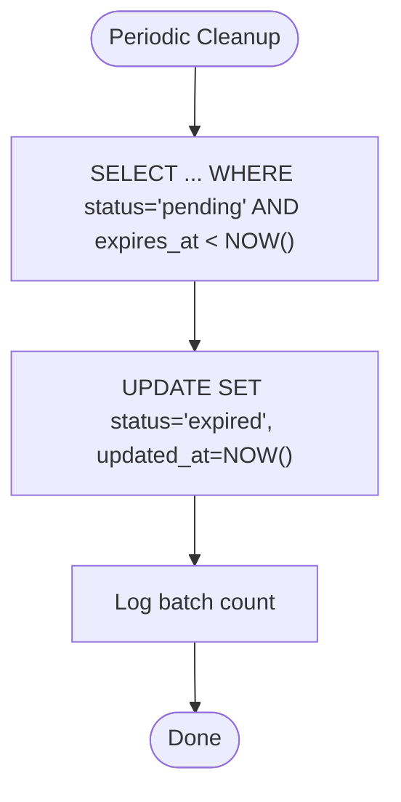
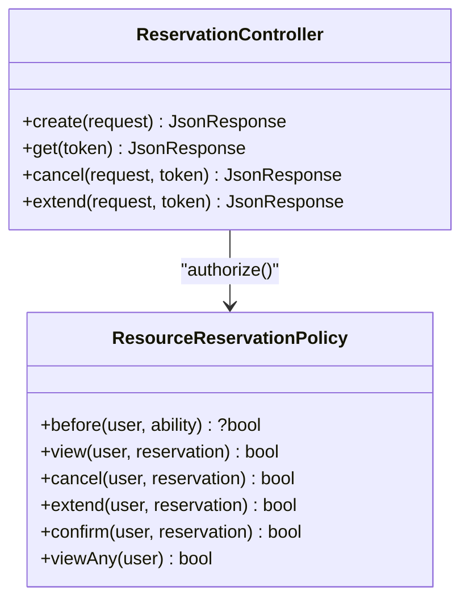
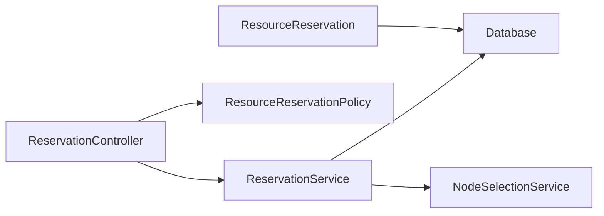

# Data Consistency Model

> **Preserved Qoder snapshot.** This deep-dive page is retained so the earlier Wiki work and its source trail are not lost. For the reconciled implementation, [[Architecture Overview|Architecture-Overview]] is canonical; references below to retired controllers, listeners, services, or API shapes are historical.

<cite>
**Referenced Files in This Document**
- [ReservationService.php](https://github.com/ObsidianNetwork/dynamic-pterodactyl/blob/6b7f83bda6f7c3fe014d52428b31af1638daa6cc/Services/ReservationService.php)
- [ResourceReservation.php](https://github.com/ObsidianNetwork/dynamic-pterodactyl/blob/6b7f83bda6f7c3fe014d52428b31af1638daa6cc/Models/ResourceReservation.php)
- [2025_01_01_000001_create_ptero_resource_reservations_table.php](https://github.com/ObsidianNetwork/dynamic-pterodactyl/blob/6b7f83bda6f7c3fe014d52428b31af1638daa6cc/database/migrations/2025_01_01_000001_create_ptero_resource_reservations_table.php)
- [2026_04_22_000001_drop_released_from_reservation_status.php](https://github.com/ObsidianNetwork/dynamic-pterodactyl/blob/6b7f83bda6f7c3fe014d52428b31af1638daa6cc/database/migrations/2026_04_22_000001_drop_released_from_reservation_status.php)
- [ReservationController.php](https://github.com/ObsidianNetwork/dynamic-pterodactyl/blob/6b7f83bda6f7c3fe014d52428b31af1638daa6cc/Http/Controllers/Api/ReservationController.php)
- [api.php](https://github.com/ObsidianNetwork/dynamic-pterodactyl/blob/6b7f83bda6f7c3fe014d52428b31af1638daa6cc/routes/api.php)
- [ResourceReservationPolicy.php](https://github.com/ObsidianNetwork/dynamic-pterodactyl/blob/6b7f83bda6f7c3fe014d52428b31af1638daa6cc/Policies/ResourceReservationPolicy.php)
- [ReservationApiTest.php](https://github.com/ObsidianNetwork/dynamic-pterodactyl/blob/6b7f83bda6f7c3fe014d52428b31af1638daa6cc/tests/Feature/ReservationApiTest.php)
- [ReservationServiceTest.php](https://github.com/ObsidianNetwork/dynamic-pterodactyl/blob/6b7f83bda6f7c3fe014d52428b31af1638daa6cc/tests/Unit/ReservationServiceTest.php)
- [DECISIONS.md](https://github.com/ObsidianNetwork/dynamic-pterodactyl/blob/6b7f83bda6f7c3fe014d52428b31af1638daa6cc/DECISIONS.md)
</cite>

## Table of Contents
1. [Introduction](#introduction)
2. [Project Structure](#project-structure)
3. [Core Components](#core-components)
4. [Architecture Overview](#architecture-overview)
5. [Detailed Component Analysis](#detailed-component-analysis)
6. [Dependency Analysis](#dependency-analysis)
7. [Performance Considerations](#performance-considerations)
8. [Troubleshooting Guide](#troubleshooting-guide)
9. [Conclusion](#conclusion)

## Introduction
This document explains the data consistency model used to ensure accurate resource allocation during concurrent reservation attempts. It covers:
- Pessimistic database locking with `lockForUpdate()` and deadlock retry
- The strict reservation lifecycle states and why the 'released' state was removed
- 15-minute TTL-based reservations and automatic cleanup
- Transaction boundaries, rollback scenarios, and recovery procedures
- Distributed locking considerations and handling of database connectivity issues

The design prioritizes correctness under concurrency while keeping checkout latency acceptable and providing clear observability via audit logs.

## Project Structure
The reservation system spans controllers, services, models, migrations, policies, and tests. The key entry points for customer-facing operations are API routes that delegate to a controller, which calls into the service layer where all consistency-critical logic lives.

**Diagram sources**
- [api.php:17-40](https://github.com/ObsidianNetwork/dynamic-pterodactyl/blob/6b7f83bda6f7c3fe014d52428b31af1638daa6cc/routes/api.php#L17-L40)
- [ReservationController.php:24-136](https://github.com/ObsidianNetwork/dynamic-pterodactyl/blob/6b7f83bda6f7c3fe014d52428b31af1638daa6cc/Http/Controllers/Api/ReservationController.php#L24-L136)
- [ReservationService.php:43-141](https://github.com/ObsidianNetwork/dynamic-pterodactyl/blob/6b7f83bda6f7c3fe014d52428b31af1638daa6cc/Services/ReservationService.php#L43-L141)
- [ResourceReservationPolicy.php:14-68](https://github.com/ObsidianNetwork/dynamic-pterodactyl/blob/6b7f83bda6f7c3fe014d52428b31af1638daa6cc/Policies/ResourceReservationPolicy.php#L14-L68)

**Section sources**
- [api.php:17-40](https://github.com/ObsidianNetwork/dynamic-pterodactyl/blob/6b7f83bda6f7c3fe014d52428b31af1638daa6cc/routes/api.php#L17-L40)
- [ReservationController.php:24-136](https://github.com/ObsidianNetwork/dynamic-pterodactyl/blob/6b7f83bda6f7c3fe014d52428b31af1638daa6cc/Http/Controllers/Api/ReservationController.php#L24-L136)

## Core Components
- ReservationService: Implements pessimistic locking, idempotency, TTL management, confirm/cancel/extend, and cleanup.
- ResourceReservation (Eloquent model): Defines table mapping, casts, and scopes for pending/expired queries.
- Migrations: Define schema including status enum and indexes; one migration removes 'released'.
- Policies: Enforce ownership and admin bypass for authorization on reservation actions.
- Tests: Validate idempotency, TTL behavior, authorization, and cleanup.

Key responsibilities:
- Prevent overselling through exclusive locks within transactions
- Ensure idempotent creation via idempotency keys
- Provide a strict lifecycle: pending → confirmed | expired | cancelled
- Expose admin and user endpoints with proper authorization
- Clean up expired reservations automatically

**Section sources**
- [ReservationService.php:43-141](https://github.com/ObsidianNetwork/dynamic-pterodactyl/blob/6b7f83bda6f7c3fe014d52428b31af1638daa6cc/Services/ReservationService.php#L43-L141)
- [ResourceReservation.php:10-65](https://github.com/ObsidianNetwork/dynamic-pterodactyl/blob/6b7f83bda6f7c3fe014d52428b31af1638daa6cc/Models/ResourceReservation.php#L10-L65)
- [2025_01_01_000001_create_ptero_resource_reservations_table.php:11-78](https://github.com/ObsidianNetwork/dynamic-pterodactyl/blob/6b7f83bda6f7c3fe014d52428b31af1638daa6cc/database/migrations/2025_01_01_000001_create_ptero_resource_reservations_table.php#L11-L78)
- [2026_04_22_000001_drop_released_from_reservation_status.php:8-25](https://github.com/ObsidianNetwork/dynamic-pterodactyl/blob/6b7f83bda6f7c3fe014d52428b31af1638daa6cc/database/migrations/2026_04_22_000001_drop_released_from_reservation_status.php#L8-L25)
- [ResourceReservationPolicy.php:14-68](https://github.com/ObsidianNetwork/dynamic-pterodactyl/blob/6b7f83bda6f7c3fe014d52428b31af1638daa6cc/Policies/ResourceReservationPolicy.php#L14-L68)

## Architecture Overview
The reservation flow uses a transactional boundary around lock acquisition, node selection, and reservation insertion. Confirm, cancel, and extend operate as atomic updates guarded by state checks. A scheduled cleanup marks pending reservations past their TTL as expired.

**Diagram sources**
- [ReservationController.php:24-60](https://github.com/ObsidianNetwork/dynamic-pterodactyl/blob/6b7f83bda6f7c3fe014d52428b31af1638daa6cc/Http/Controllers/Api/ReservationController.php#L24-L60)
- [ReservationService.php:43-141](https://github.com/ObsidianNetwork/dynamic-pterodactyl/blob/6b7f83bda6f7c3fe014d52428b31af1638daa6cc/Services/ReservationService.php#L43-L141)

**Section sources**
- [ReservationController.php:24-60](https://github.com/ObsidianNetwork/dynamic-pterodactyl/blob/6b7f83bda6f7c3fe014d52428b31af1638daa6cc/Http/Controllers/Api/ReservationController.php#L24-L60)
- [ReservationService.php:43-141](https://github.com/ObsidianNetwork/dynamic-pterodactyl/blob/6b7f83bda6f7c3fe014d52428b31af1638daa6cc/Services/ReservationService.php#L43-L141)

## Detailed Component Analysis

### Pessimistic Locking and Deadlock Retry
- Creation wraps all critical steps in a single database transaction.
- Before selecting a node, it acquires an exclusive lock on all pending reservations for the target location using `lockForUpdate()`. This ensures no other transaction can read or modify those rows until the current transaction commits or rolls back.
- After node selection, a new reservation row is inserted with status 'pending' and an expiration time set to now + TTL minutes.
- The transaction is retried up to 5 times on deadlock to handle rare contention scenarios.

**Diagram sources**
- [ReservationService.php:43-141](https://github.com/ObsidianNetwork/dynamic-pterodactyl/blob/6b7f83bda6f7c3fe014d52428b31af1638daa6cc/Services/ReservationService.php#L43-L141)

**Section sources**
- [ReservationService.php:43-141](https://github.com/ObsidianNetwork/dynamic-pterodactyl/blob/6b7f83bda6f7c3fe014d52428b31af1638daa6cc/Services/ReservationService.php#L43-L141)

### Idempotent Creation and Duplicate Handling
- If an idempotency key is provided, stale pending reservations tied to that key are expired before checking for an existing active reservation.
- An existing active reservation (confirmed or pending not yet expired) is returned instead of creating a duplicate.
- On insert race conditions that violate uniqueness constraints, the service detects duplicates and returns the existing reservation rather than failing.

**Diagram sources**
- [ReservationService.php:60-73](https://github.com/ObsidianNetwork/dynamic-pterodactyl/blob/6b7f83bda6f7c3fe014d52428b31af1638daa6cc/Services/ReservationService.php#L60-L73)
- [ReservationService.php:143-157](https://github.com/ObsidianNetwork/dynamic-pterodactyl/blob/6b7f83bda6f7c3fe014d52428b31af1638daa6cc/Services/ReservationService.php#L143-L157)
- [ReservationService.php:431-442](https://github.com/ObsidianNetwork/dynamic-pterodactyl/blob/6b7f83bda6f7c3fe014d52428b31af1638daa6cc/Services/ReservationService.php#L431-L442)
- [ReservationService.php:444-452](https://github.com/ObsidianNetwork/dynamic-pterodactyl/blob/6b7f83bda6f7c3fe014d52428b31af1638daa6cc/Services/ReservationService.php#L444-L452)

**Section sources**
- [ReservationService.php:60-73](https://github.com/ObsidianNetwork/dynamic-pterodactyl/blob/6b7f83bda6f7c3fe014d52428b31af1638daa6cc/Services/ReservationService.php#L60-L73)
- [ReservationService.php:143-157](https://github.com/ObsidianNetwork/dynamic-pterodactyl/blob/6b7f83bda6f7c3fe014d52428b31af1638daa6cc/Services/ReservationService.php#L143-L157)
- [ReservationService.php:431-442](https://github.com/ObsidianNetwork/dynamic-pterodactyl/blob/6b7f83bda6f7c3fe014d52428b31af1638daa6cc/Services/ReservationService.php#L431-L442)
- [ReservationService.php:444-452](https://github.com/ObsidianNetwork/dynamic-pterodactyl/blob/6b7f83bda6f7c3fe014d52428b31af1638daa6cc/Services/ReservationService.php#L444-L452)

### Strict Reservation Lifecycle States
- The lifecycle is strictly: pending → confirmed | expired | cancelled.
- The 'released' state was removed because no service method ever set it; the observable lifecycle should remain concrete and meaningful. Future failure states should be explicit (e.g., provision_failed), not vague releases.

**Diagram sources**
- [ReservationService.php:166-199](https://github.com/ObsidianNetwork/dynamic-pterodactyl/blob/6b7f83bda6f7c3fe014d52428b31af1638daa6cc/Services/ReservationService.php#L166-L199)
- [ReservationService.php:208-241](https://github.com/ObsidianNetwork/dynamic-pterodactyl/blob/6b7f83bda6f7c3fe014d52428b31af1638daa6cc/Services/ReservationService.php#L208-L241)
- [ReservationService.php:387-405](https://github.com/ObsidianNetwork/dynamic-pterodactyl/blob/6b7f83bda6f7c3fe014d52428b31af1638daa6cc/Services/ReservationService.php#L387-L405)
- [2026_04_22_000001_drop_released_from_reservation_status.php:8-25](https://github.com/ObsidianNetwork/dynamic-pterodactyl/blob/6b7f83bda6f7c3fe014d52428b31af1638daa6cc/database/migrations/2026_04_22_000001_drop_released_from_reservation_status.php#L8-L25)
- [DECISIONS.md:233-235](https://github.com/ObsidianNetwork/dynamic-pterodactyl/blob/6b7f83bda6f7c3fe014d52428b31af1638daa6cc/DECISIONS.md#L233-L235)

**Section sources**
- [ReservationService.php:166-199](https://github.com/ObsidianNetwork/dynamic-pterodactyl/blob/6b7f83bda6f7c3fe014d52428b31af1638daa6cc/Services/ReservationService.php#L166-L199)
- [ReservationService.php:208-241](https://github.com/ObsidianNetwork/dynamic-pterodactyl/blob/6b7f83bda6f7c3fe014d52428b31af1638daa6cc/Services/ReservationService.php#L208-L241)
- [ReservationService.php:387-405](https://github.com/ObsidianNetwork/dynamic-pterodactyl/blob/6b7f83bda6f7c3fe014d52428b31af1638daa6cc/Services/ReservationService.php#L387-L405)
- [2026_04_22_000001_drop_released_from_reservation_status.php:8-25](https://github.com/ObsidianNetwork/dynamic-pterodactyl/blob/6b7f83bda6f7c3fe014d52428b31af1638daa6cc/database/migrations/2026_04_22_000001_drop_released_from_reservation_status.php#L8-L25)
- [DECISIONS.md:233-235](https://github.com/ObsidianNetwork/dynamic-pterodactyl/blob/6b7f83bda6f7c3fe014d52428b31af1638daa6cc/DECISIONS.md#L233-L235)

### TTL-Based Reservations and Automatic Cleanup
- Each reservation has an `expires_at` timestamp set to now + TTL minutes (default 15).
- Customers may extend the TTL for pending reservations via an endpoint.
- A cleanup process runs periodically to mark pending reservations whose `expires_at` is in the past as 'expired', releasing capacity logically.

**Diagram sources**
- [ReservationService.php:387-405](https://github.com/ObsidianNetwork/dynamic-pterodactyl/blob/6b7f83bda6f7c3fe014d52428b31af1638daa6cc/Services/ReservationService.php#L387-L405)

**Section sources**
- [ReservationService.php:387-405](https://github.com/ObsidianNetwork/dynamic-pterodactyl/blob/6b7f83bda6f7c3fe014d52428b31af1638daa6cc/Services/ReservationService.php#L387-L405)
- [ReservationService.php:250-281](https://github.com/ObsidianNetwork/dynamic-pterodactyl/blob/6b7f83bda6f7c3fe014d52428b31af1638daa6cc/Services/ReservationService.php#L250-L281)

### Transaction Boundaries and Rollback Scenarios
- Create: Entire operation (lock, node selection, insert) is inside a transaction with retries. Any exception causes rollback.
- Confirm: Updates status from pending to confirmed only if the reservation exists, is pending, and not expired.
- Cancel: Updates status from pending to cancelled only if the reservation exists and is pending.
- Extend: Extends the TTL for pending reservations only.

Rollbacks occur when:
- Node selection fails (no capacity)
- Database errors occur during insert/update
- Authorization fails (policy denies action)

Recovery:
- Deadlocks are retried automatically up to 5 times.
- Duplicate idempotency inserts are detected and resolved by returning the existing reservation.
- Audit failures do not break core operations; they are logged safely.

**Section sources**
- [ReservationService.php:43-141](https://github.com/ObsidianNetwork/dynamic-pterodactyl/blob/6b7f83bda6f7c3fe014d52428b31af1638daa6cc/Services/ReservationService.php#L43-L141)
- [ReservationService.php:166-199](https://github.com/ObsidianNetwork/dynamic-pterodactyl/blob/6b7f83bda6f7c3fe014d52428b31af1638daa6cc/Services/ReservationService.php#L166-L199)
- [ReservationService.php:208-241](https://github.com/ObsidianNetwork/dynamic-pterodactyl/blob/6b7f83bda6f7c3fe014d52428b31af1638daa6cc/Services/ReservationService.php#L208-L241)
- [ReservationService.php:250-281](https://github.com/ObsidianNetwork/dynamic-pterodactyl/blob/6b7f83bda6f7c3fe014d52428b31af1638daa6cc/Services/ReservationService.php#L250-L281)

### Authorization and Ownership Enforcement
- Policies enforce that users can only view, cancel, or extend their own reservations.
- Admins can bypass per-user checks via panel access.
- Controllers authorize actions before calling service methods.

**Diagram sources**
- [ResourceReservationPolicy.php:14-68](https://github.com/ObsidianNetwork/dynamic-pterodactyl/blob/6b7f83bda6f7c3fe014d52428b31af1638daa6cc/Policies/ResourceReservationPolicy.php#L14-L68)
- [ReservationController.php:62-136](https://github.com/ObsidianNetwork/dynamic-pterodactyl/blob/6b7f83bda6f7c3fe014d52428b31af1638daa6cc/Http/Controllers/Api/ReservationController.php#L62-L136)

**Section sources**
- [ResourceReservationPolicy.php:14-68](https://github.com/ObsidianNetwork/dynamic-pterodactyl/blob/6b7f83bda6f7c3fe014d52428b31af1638daa6cc/Policies/ResourceReservationPolicy.php#L14-L68)
- [ReservationController.php:62-136](https://github.com/ObsidianNetwork/dynamic-pterodactyl/blob/6b7f83bda6f7c3fe014d52428b31af1638daa6cc/Http/Controllers/Api/ReservationController.php#L62-L136)

### API Endpoints and Throttling
- Customer endpoints: create, get, cancel, extend under a throttle of 10 requests per minute to tolerate checkout retries without enabling abuse.
- Admin endpoints: list reservations, cancel reservations, capacity summary, and node availability under separate middleware and throttling.

**Section sources**
- [api.php:17-40](https://github.com/ObsidianNetwork/dynamic-pterodactyl/blob/6b7f83bda6f7c3fe014d52428b31af1638daa6cc/routes/api.php#L17-L40)

### Data Model and Indexes
- The reservations table includes fields for token, idempotency key, links to cart/service/user, node/location, reserved resources, pricing snapshot, status, notes, and timestamps.
- Indexes optimize queries for cleanup, location-based locking, and filtering by status and time.

**Section sources**
- [2025_01_01_000001_create_ptero_resource_reservations_table.php:11-78](https://github.com/ObsidianNetwork/dynamic-pterodactyl/blob/6b7f83bda6f7c3fe014d52428b31af1638daa6cc/database/migrations/2025_01_01_000001_create_ptero_resource_reservations_table.php#L11-L78)

## Dependency Analysis
- Controllers depend on services for business logic and on policies for authorization.
- Services depend on database transactions and external node selection.
- Models provide Eloquent relationships and query scopes.
- Tests validate behavior across idempotency, TTL, authorization, and cleanup.

**Diagram sources**
- [ReservationController.php:24-136](https://github.com/ObsidianNetwork/dynamic-pterodactyl/blob/6b7f83bda6f7c3fe014d52428b31af1638daa6cc/Http/Controllers/Api/ReservationController.php#L24-L136)
- [ReservationService.php:43-141](https://github.com/ObsidianNetwork/dynamic-pterodactyl/blob/6b7f83bda6f7c3fe014d52428b31af1638daa6cc/Services/ReservationService.php#L43-L141)
- [ResourceReservation.php:10-65](https://github.com/ObsidianNetwork/dynamic-pterodactyl/blob/6b7f83bda6f7c3fe014d52428b31af1638daa6cc/Models/ResourceReservation.php#L10-L65)

**Section sources**
- [ReservationController.php:24-136](https://github.com/ObsidianNetwork/dynamic-pterodactyl/blob/6b7f83bda6f7c3fe014d52428b31af1638daa6cc/Http/Controllers/Api/ReservationController.php#L24-L136)
- [ReservationService.php:43-141](https://github.com/ObsidianNetwork/dynamic-pterodactyl/blob/6b7f83bda6f7c3fe014d52428b31af1638daa6cc/Services/ReservationService.php#L43-L141)
- [ResourceReservation.php:10-65](https://github.com/ObsidianNetwork/dynamic-pterodactyl/blob/6b7f83bda6f7c3fe014d52428b31af1638daa6cc/Models/ResourceReservation.php#L10-L65)

## Performance Considerations
- Exclusive locks prevent overselling but serialize concurrent reservation attempts per location. This is necessary for correctness.
- Transaction retries mitigate transient deadlocks; excessive retries indicate high contention and may require tuning or scaling.
- TTL is short (15 minutes) to avoid long-lived holds; cleanup runs frequently to release capacity promptly.
- Node selection batches API calls but does not cache results; this keeps availability real-time at the cost of latency.

[No sources needed since this section provides general guidance]

## Troubleshooting Guide
Common issues and remedies:
- Deadlocks during create: The service retries up to 5 times. If persistent, reduce concurrency or review indexing and lock scope.
- Duplicate idempotency key conflicts: The service detects duplicates and returns the existing reservation; verify client idempotency headers.
- Expired reservations not cleaned: Ensure cleanup runs regularly; verify scheduler configuration and logs for batch counts.
- Authorization failures: Check policy rules and actor context; admins bypass per-user checks.

Operational checks:
- Inspect audit logs for reservation_confirmed, reservation_cancelled, and reservations_expired_batch entries.
- Monitor throttle responses (429) on reservation endpoints to detect burst patterns.

**Section sources**
- [ReservationService.php:43-141](https://github.com/ObsidianNetwork/dynamic-pterodactyl/blob/6b7f83bda6f7c3fe014d52428b31af1638daa6cc/Services/ReservationService.php#L43-L141)
- [ReservationService.php:387-405](https://github.com/ObsidianNetwork/dynamic-pterodactyl/blob/6b7f83bda6f7c3fe014d52428b31af1638daa6cc/Services/ReservationService.php#L387-L405)
- [ReservationApiTest.php:37-78](https://github.com/ObsidianNetwork/dynamic-pterodactyl/blob/6b7f83bda6f7c3fe014d52428b31af1638daa6cc/tests/Feature/ReservationApiTest.php#L37-L78)
- [ReservationServiceTest.php:259-285](https://github.com/ObsidianNetwork/dynamic-pterodactyl/blob/6b7f83bda6f7c3fe014d52428b31af1638daa6cc/tests/Unit/ReservationServiceTest.php#L259-L285)

## Conclusion
The reservation system enforces data consistency through pessimistic locking, strict lifecycle transitions, and robust idempotency. The removal of the 'released' state clarifies the observable lifecycle to pending → confirmed | expired | cancelled. TTL-based reservations with automatic cleanup ensure resources are not held indefinitely. Transactions and retries protect against deadlocks and transient failures, while policies and audits maintain security and observability. This design balances correctness, performance, and operational clarity for accurate resource allocation under concurrent load.

[No sources needed since this section summarizes without analyzing specific files]