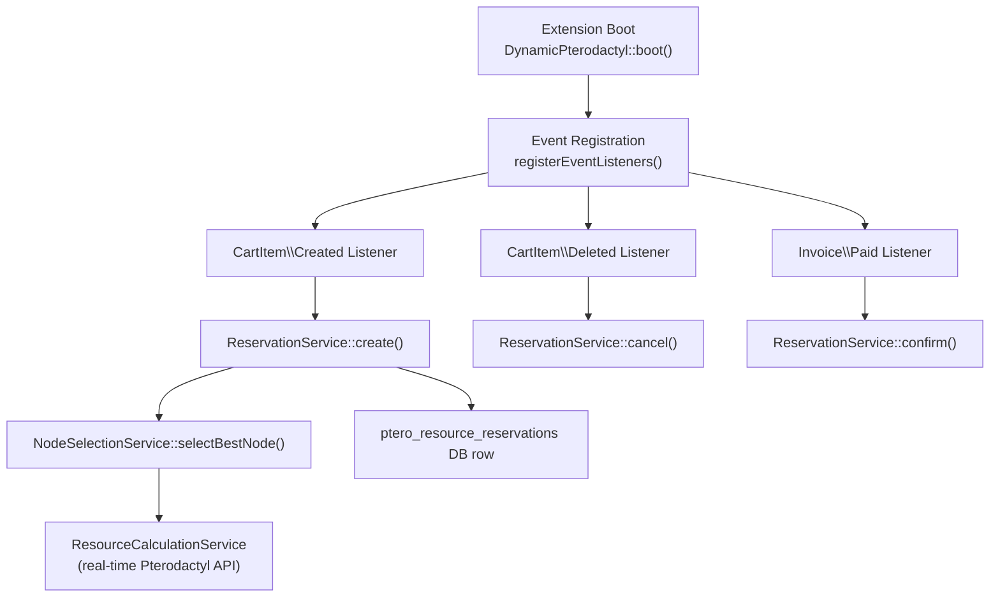
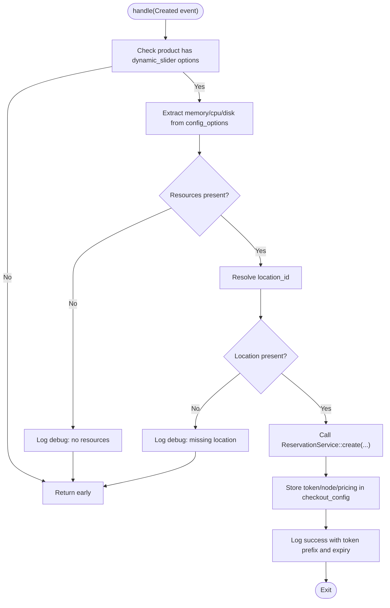
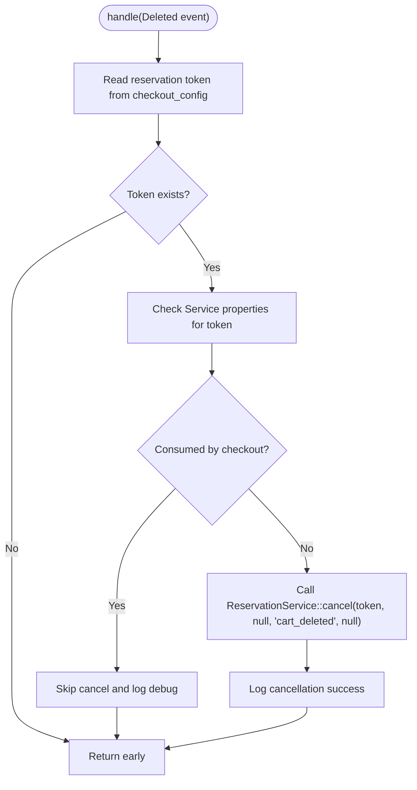
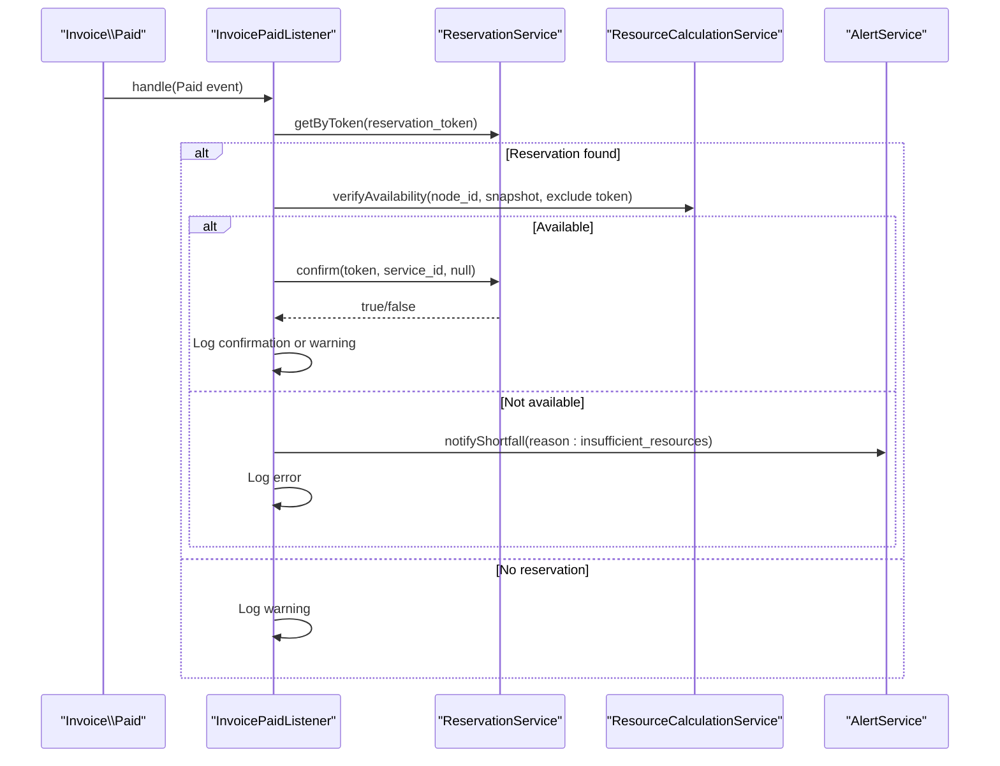
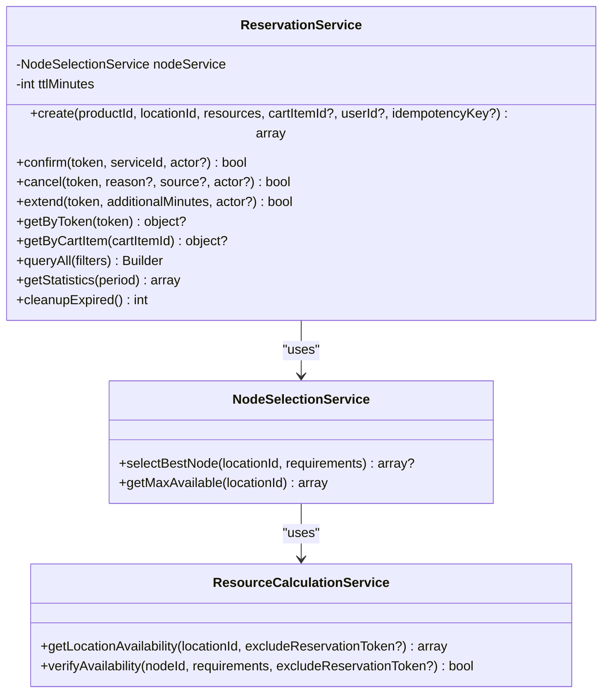
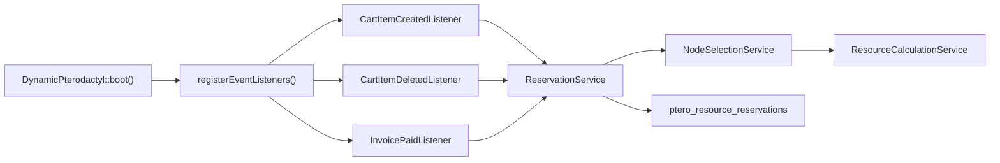

# Cart Events and Listeners

> **Preserved Qoder snapshot.** This deep-dive page is retained so the earlier Wiki work and its source trail are not lost. For the reconciled implementation, [[Architecture Overview|Architecture-Overview]] is canonical; references below to retired controllers, listeners, services, or API shapes are historical.


<cite>
**Referenced Files in This Document**
- [DynamicPterodactyl.php](https://github.com/ObsidianNetwork/dynamic-pterodactyl/blob/6b7f83bda6f7c3fe014d52428b31af1638daa6cc/DynamicPterodactyl.php)
- [CartItemCreatedListener.php](https://github.com/ObsidianNetwork/dynamic-pterodactyl/blob/6b7f83bda6f7c3fe014d52428b31af1638daa6cc/Listeners/CartItemCreatedListener.php)
- [CartItemDeletedListener.php](https://github.com/ObsidianNetwork/dynamic-pterodactyl/blob/6b7f83bda6f7c3fe014d52428b31af1638daa6cc/Listeners/CartItemDeletedListener.php)
- [InvoicePaidListener.php](https://github.com/ObsidianNetwork/dynamic-pterodactyl/blob/6b7f83bda6f7c3fe014d52428b31af1638daa6cc/Listeners/InvoicePaidListener.php)
- [ReservationService.php](https://github.com/ObsidianNetwork/dynamic-pterodactyl/blob/6b7f83bda6f7c3fe014d52428b31af1638daa6cc/Services/ReservationService.php)
- [NodeSelectionService.php](https://github.com/ObsidianNetwork/dynamic-pterodactyl/blob/6b7f83bda6f7c3fe014d52428b31af1638daa6cc/Services/NodeSelectionService.php)
- [ResourceCalculationService.php](https://github.com/ObsidianNetwork/dynamic-pterodactyl/blob/6b7f83bda6f7c3fe014d52428b31af1638daa6cc/Services/ResourceCalculationService.php)
- [ResourceReservation.php](https://github.com/ObsidianNetwork/dynamic-pterodactyl/blob/6b7f83bda6f7c3fe014d52428b31af1638daa6cc/Models/ResourceReservation.php)
- [2025_01_01_000001_create_ptero_resource_reservations_table.php](https://github.com/ObsidianNetwork/dynamic-pterodactyl/blob/6b7f83bda6f7c3fe014d52428b31af1638daa6cc/database/migrations/2025_01_01_000001_create_ptero_resource_reservations_table.php)
- [2026_04_23_000001_add_idempotency_key_to_ptero_resource_reservations.php](https://github.com/ObsidianNetwork/dynamic-pterodactyl/blob/6b7f83bda6f7c3fe014d52428b31af1638daa6cc/database/migrations/2026_04_23_000001_add_idempotency_key_to_ptero_resource_reservations.php)
</cite>

## Table of Contents
1. [Introduction](#introduction)
2. [Project Structure](#project-structure)
3. [Core Components](#core-components)
4. [Architecture Overview](#architecture-overview)
5. [Detailed Component Analysis](#detailed-component-analysis)
6. [Dependency Analysis](#dependency-analysis)
7. [Performance Considerations](#performance-considerations)
8. [Troubleshooting Guide](#troubleshooting-guide)
9. [Conclusion](#conclusion)

## Introduction
This document explains how the Dynamic Pterodactyl extension handles cart-related events to reserve compute resources during checkout. When a cart item with dynamic slider options is added, a resource reservation is created with a configurable time-to-live (TTL), defaulting to 15 minutes. The system selects an appropriate node using real-time availability data from Pterodactyl and persists a pending reservation that locks capacity until payment or expiration. If the cart item is removed before checkout completes, any pending reservation is cancelled. Payment confirmation transitions the reservation to confirmed, while expired reservations are cleaned up by a scheduled job.

The implementation uses database transactions with pessimistic locking to prevent race conditions and overselling, idempotency support for duplicate create attempts, and robust error handling so that failures do not block the customer’s purchase flow.

## Project Structure
Cart event handling spans listeners, services, models, migrations, and the extension boot process:

- Event registration occurs in the extension boot method.
- Listeners react to cart lifecycle events and orchestrate reservation creation or cancellation.
- Services encapsulate reservation logic, node selection, and availability verification.
- A model represents reservations with scopes for pending and expired states.
- Migrations define the reservation table schema and indexes.



**Diagram sources**
- [DynamicPterodactyl.php:96-145](https://github.com/ObsidianNetwork/dynamic-pterodactyl/blob/6b7f83bda6f7c3fe014d52428b31af1638daa6cc/DynamicPterodactyl.php#L96-L145)
- [CartItemCreatedListener.php:13-87](https://github.com/ObsidianNetwork/dynamic-pterodactyl/blob/6b7f83bda6f7c3fe014d52428b31af1638daa6cc/Listeners/CartItemCreatedListener.php#L13-L87)
- [CartItemDeletedListener.php:12-57](https://github.com/ObsidianNetwork/dynamic-pterodactyl/blob/6b7f83bda6f7c3fe014d52428b31af1638daa6cc/Listeners/CartItemDeletedListener.php#L12-L57)
- [InvoicePaidListener.php:14-134](https://github.com/ObsidianNetwork/dynamic-pterodactyl/blob/6b7f83bda6f7c3fe014d52428b31af1638daa6cc/Listeners/InvoicePaidListener.php#L14-L134)
- [ReservationService.php:43-141](https://github.com/ObsidianNetwork/dynamic-pterodactyl/blob/6b7f83bda6f7c3fe014d52428b31af1638daa6cc/Services/ReservationService.php#L43-L141)
- [NodeSelectionService.php:22-76](https://github.com/ObsidianNetwork/dynamic-pterodactyl/blob/6b7f83bda6f7c3fe014d52428b31af1638daa6cc/Services/NodeSelectionService.php#L22-L76)
- [ResourceCalculationService.php:26-67](https://github.com/ObsidianNetwork/dynamic-pterodactyl/blob/6b7f83bda6f7c3fe014d52428b31af1638daa6cc/Services/ResourceCalculationService.php#L26-L67)

**Section sources**
- [DynamicPterodactyl.php:96-145](https://github.com/ObsidianNetwork/dynamic-pterodactyl/blob/6b7f83bda6f7c3fe014d52428b31af1638daa6cc/DynamicPterodactyl.php#L96-L145)

## Core Components
- CartItemCreatedListener: Detects dynamic slider products, extracts resource requirements and location, creates a reservation via ReservationService, and stores the reservation token and selected node in the cart item’s checkout configuration.
- CartItemDeletedListener: Cancels pending reservations when cart items are removed, with special handling to avoid cancelling reservations already consumed by checkout.
- InvoicePaidListener: Confirms reservations after payment, verifies final availability, and triggers alerts on shortfall or state drift.
- ReservationService: Implements create, confirm, cancel, extend, cleanup, and statistics; uses pessimistic locking, transaction retries, and idempotency keys.
- NodeSelectionService: Selects the best node based on weighted headroom scoring across memory, disk, and CPU.
- ResourceCalculationService: Provides real-time availability from Pterodactyl, including aggregated per-location metrics and per-node calculations.
- ResourceReservation model: Defines fillable fields, casts, and scopes for pending/expired reservations.

**Section sources**
- [CartItemCreatedListener.php:13-87](https://github.com/ObsidianNetwork/dynamic-pterodactyl/blob/6b7f83bda6f7c3fe014d52428b31af1638daa6cc/Listeners/CartItemCreatedListener.php#L13-L87)
- [CartItemDeletedListener.php:12-57](https://github.com/ObsidianNetwork/dynamic-pterodactyl/blob/6b7f83bda6f7c3fe014d52428b31af1638daa6cc/Listeners/CartItemDeletedListener.php#L12-L57)
- [InvoicePaidListener.php:14-134](https://github.com/ObsidianNetwork/dynamic-pterodactyl/blob/6b7f83bda6f7c3fe014d52428b31af1638daa6cc/Listeners/InvoicePaidListener.php#L14-L134)
- [ReservationService.php:43-141](https://github.com/ObsidianNetwork/dynamic-pterodactyl/blob/6b7f83bda6f7c3fe014d52428b31af1638daa6cc/Services/ReservationService.php#L43-L141)
- [NodeSelectionService.php:22-76](https://github.com/ObsidianNetwork/dynamic-pterodactyl/blob/6b7f83bda6f7c3fe014d52428b31af1638daa6cc/Services/NodeSelectionService.php#L22-L76)
- [ResourceCalculationService.php:26-67](https://github.com/ObsidianNetwork/dynamic-pterodactyl/blob/6b7f83bda6f7c3fe014d52428b31af1638daa6cc/Services/ResourceCalculationService.php#L26-L67)
- [ResourceReservation.php:10-65](https://github.com/ObsidianNetwork/dynamic-pterodactyl/blob/6b7f83bda6f7c3fe014d52428b31af1638daa6cc/Models/ResourceReservation.php#L10-L65)

## Architecture Overview
The cart event flow ensures resources are reserved for a limited window during checkout:

1. CartItem\Created fires when a user adds a product with dynamic sliders to the cart.
2. The listener checks if the product has dynamic_slider config options and extracts required resources and location.
3. ReservationService::create runs inside a database transaction with pessimistic locking to lock pending reservations for the target location.
4. NodeSelectionService::selectBestNode queries real-time availability via ResourceCalculationService and picks the best-fit node.
5. A pending reservation is inserted with a TTL-based expires_at timestamp (default 15 minutes).
6. The reservation token and selected node are stored in the cart item’s checkout_config for later use.
7. On CartItem\Deleted, any pending reservation is cancelled unless the item was already consumed by checkout.
8. On Invoice\Paid, the reservation is verified and confirmed; otherwise, alerts are triggered.
9. A scheduled job periodically marks expired pending reservations as expired.

```mermaid
sequenceDiagram
participant User as "User"
participant Cart as "Paymenter Cart"
participant CreatedEvt as "CartItem\\Created"
participant CreatedLsn as "CartItemCreatedListener"
participant ResSvc as "ReservationService"
participant NodeSel as "NodeSelectionService"
participant ResCalc as "ResourceCalculationService"
participant DB as "Database"
User->>Cart : Add product with dynamic sliders
Cart-->>CreatedEvt : Fire event
CreatedEvt->>CreatedLsn : handle(event)
CreatedLsn->>ResSvc : create(productId, locationId, resources, cartItemId, userId)
ResSvc->>DB : BEGIN TRANSACTION + lockForUpdate(pending reservations by location)
ResSvc->>NodeSel : selectBestNode(locationId, resources)
NodeSel->>ResCalc : getLocationAvailability(locationId)
ResCalc-->>NodeSel : nodes with available memory/cpu/disk
NodeSel-->>ResSvc : best node
ResSvc->>DB : INSERT ptero_resource_reservations (pending, expires_at = now + TTL)
ResSvc-->>CreatedLsn : {token, node_id, pricing}
CreatedLsn->>Cart : Update checkout_config with token and node
Note over ResSvc,DB : Transaction commits; lock released
```

**Diagram sources**
- [DynamicPterodactyl.php:134-138](https://github.com/ObsidianNetwork/dynamic-pterodactyl/blob/6b7f83bda6f7c3fe014d52428b31af1638daa6cc/DynamicPterodactyl.php#L134-L138)
- [CartItemCreatedListener.php:13-87](https://github.com/ObsidianNetwork/dynamic-pterodactyl/blob/6b7f83bda6f7c3fe014d52428b31af1638daa6cc/Listeners/CartItemCreatedListener.php#L13-L87)
- [ReservationService.php:43-141](https://github.com/ObsidianNetwork/dynamic-pterodactyl/blob/6b7f83bda6f7c3fe014d52428b31af1638daa6cc/Services/ReservationService.php#L43-L141)
- [NodeSelectionService.php:22-76](https://github.com/ObsidianNetwork/dynamic-pterodactyl/blob/6b7f83bda6f7c3fe014d52428b31af1638daa6cc/Services/NodeSelectionService.php#L22-L76)
- [ResourceCalculationService.php:26-67](https://github.com/ObsidianNetwork/dynamic-pterodactyl/blob/6b7f83bda6f7c3fe014d52428b31af1638daa6cc/Services/ResourceCalculationService.php#L26-L67)

## Detailed Component Analysis

### CartItemCreatedListener
Responsibilities:
- Determine whether the cart item belongs to a product with dynamic_slider options.
- Extract resource values (memory, cpu, disk) from native config_options metadata.
- Resolve location ID from checkout_config or config_options.
- Create a reservation via ReservationService and persist token/node/pricing into checkout_config.
- Fail gracefully without blocking cart operations.

Key behaviors:
- Early return if no dynamic_slider options are present.
- Early return if required resources or location are missing.
- Stores reservation token and selected node in checkout_config for downstream steps.
- Logs errors but does not throw exceptions to keep checkout flowing.



**Diagram sources**
- [CartItemCreatedListener.php:13-87](https://github.com/ObsidianNetwork/dynamic-pterodactyl/blob/6b7f83bda6f7c3fe014d52428b31af1638daa6cc/Listeners/CartItemCreatedListener.php#L13-L87)

**Section sources**
- [CartItemCreatedListener.php:13-87](https://github.com/ObsidianNetwork/dynamic-pterodactyl/blob/6b7f83bda6f7c3fe014d52428b31af1638daa6cc/Listeners/CartItemCreatedListener.php#L13-L87)

### CartItemDeletedListener
Responsibilities:
- Cancel pending reservations when a cart item is removed.
- Avoid cancelling reservations already transferred to a service during checkout.

Race condition prevention:
- Checks Service properties for the reservation token before cancelling.
- If found, logs debug and skips cancellation because checkout may be in progress.

Cancellation behavior:
- Calls ReservationService::cancel with reason 'cart_deleted' and null actor for system context.
- Logs success or error appropriately.



**Diagram sources**
- [CartItemDeletedListener.php:12-57](https://github.com/ObsidianNetwork/dynamic-pterodactyl/blob/6b7f83bda6f7c3fe014d52428b31af1638daa6cc/Listeners/CartItemDeletedListener.php#L12-L57)

**Section sources**
- [CartItemDeletedListener.php:12-57](https://github.com/ObsidianNetwork/dynamic-pterodactyl/blob/6b7f83bda6f7c3fe014d52428b31af1638daa6cc/Listeners/CartItemDeletedListener.php#L12-L57)

### InvoicePaidListener
Responsibilities:
- Confirm reservations tied to paid invoices.
- Verify final availability at payment time.
- Trigger alerts on shortfall or state drift.

Flow highlights:
- Retrieves reservation token from service properties.
- Verifies availability excluding the current reservation token.
- Confirms reservation only if still pending and within TTL.
- Logs warnings and sends alerts when resources are unavailable or state drift occurs.



**Diagram sources**
- [InvoicePaidListener.php:14-134](https://github.com/ObsidianNetwork/dynamic-pterodactyl/blob/6b7f83bda6f7c3fe014d52428b31af1638daa6cc/Listeners/InvoicePaidListener.php#L14-L134)

**Section sources**
- [InvoicePaidListener.php:14-134](https://github.com/ObsidianNetwork/dynamic-pterodactyl/blob/6b7f83bda6f7c3fe014d52428b31af1638daa6cc/Listeners/InvoicePaidListener.php#L14-L134)

### ReservationService
Core responsibilities:
- Create reservations with pessimistic locking and transaction retry.
- Confirm, cancel, and extend reservations safely.
- Provide statistics and cleanup for expired reservations.
- Support idempotent create requests via idempotency keys.

Concurrency control:
- Uses lockForUpdate on pending reservations by location within a transaction.
- Retries up to 5 times on deadlock via Laravel’s transaction retry mechanism.
- Handles duplicate idempotency key conflicts by returning existing active reservations.

TTL management:
- Default TTL is 15 minutes, configurable via extension settings.
- Expires_at is set at creation; cleanup job marks expired rows as expired.



**Diagram sources**
- [ReservationService.php:16-141](https://github.com/ObsidianNetwork/dynamic-pterodactyl/blob/6b7f83bda6f7c3fe014d52428b31af1638daa6cc/Services/ReservationService.php#L16-L141)
- [NodeSelectionService.php:5-76](https://github.com/ObsidianNetwork/dynamic-pterodactyl/blob/6b7f83bda6f7c3fe014d52428b31af1638daa6cc/Services/NodeSelectionService.php#L5-L76)
- [ResourceCalculationService.php:26-67](https://github.com/ObsidianNetwork/dynamic-pterodactyl/blob/6b7f83bda6f7c3fe014d52428b31af1638daa6cc/Services/ResourceCalculationService.php#L26-L67)

**Section sources**
- [ReservationService.php:43-141](https://github.com/ObsidianNetwork/dynamic-pterodactyl/blob/6b7f83bda6f7c3fe014d52428b31af1638daa6cc/Services/ReservationService.php#L43-L141)
- [ReservationService.php:166-241](https://github.com/ObsidianNetwork/dynamic-pterodactyl/blob/6b7f83bda6f7c3fe014d52428b31af1638daa6cc/Services/ReservationService.php#L166-L241)
- [ReservationService.php:387-405](https://github.com/ObsidianNetwork/dynamic-pterodactyl/blob/6b7f83bda6f7c3fe014d52428b31af1638daa6cc/Services/ReservationService.php#L387-L405)

### NodeSelectionService
Algorithm:
- Best-fit with headroom weighting: memory 50%, disk 35%, CPU 15%.
- Skips nodes in maintenance mode.
- Filters candidates by available memory, CPU, and disk against requirements.
- Scores remaining headroom proportionally to total capacity and sorts descending.

Output:
- Returns the best node or null if none qualify.

**Section sources**
- [NodeSelectionService.php:22-76](https://github.com/ObsidianNetwork/dynamic-pterodactyl/blob/6b7f83bda6f7c3fe014d52428b31af1638daa6cc/Services/NodeSelectionService.php#L22-L76)

### ResourceCalculationService
Capabilities:
- Real-time availability from Pterodactyl API (no caching).
- Aggregates per-location totals and maximum available resources.
- Calculates per-node availability considering allocated servers and pending reservations.
- Supports verification of availability for a specific node, excluding a given reservation token.

API integration:
- Paginates through locations and nodes/servers.
- Includes retry and timeout handling for connection issues.
- Produces degraded snapshots when API is unavailable.

**Section sources**
- [ResourceCalculationService.php:26-67](https://github.com/ObsidianNetwork/dynamic-pterodactyl/blob/6b7f83bda6f7c3fe014d52428b31af1638daa6cc/Services/ResourceCalculationService.php#L26-L67)
- [ResourceCalculationService.php:198-214](https://github.com/ObsidianNetwork/dynamic-pterodactyl/blob/6b7f83bda6f7c3fe014d52428b31af1638daa6cc/Services/ResourceCalculationService.php#L198-L214)
- [ResourceCalculationService.php:227-257](https://github.com/ObsidianNetwork/dynamic-pterodactyl/blob/6b7f83bda6f7c3fe014d52428b31af1638daa6cc/Services/ResourceCalculationService.php#L227-L257)
- [ResourceCalculationService.php:452-498](https://github.com/ObsidianNetwork/dynamic-pterodactyl/blob/6b7f83bda6f7c3fe014d52428b31af1638daa6cc/Services/ResourceCalculationService.php#L452-L498)

### Data Model and Schema
- ResourceReservation model defines fillable fields, casts, and relationships to User and Service.
- Scopes provide convenient queries for pending and expired reservations.
- Migration defines the reservation table with unique token, foreign keys, indexes, and status enum.
- Idempotency migration adds idempotency_key and active_idempotency_key with unique constraint to prevent duplicate active reservations.

**Section sources**
- [ResourceReservation.php:10-65](https://github.com/ObsidianNetwork/dynamic-pterodactyl/blob/6b7f83bda6f7c3fe014d52428b31af1638daa6cc/Models/ResourceReservation.php#L10-L65)
- [2025_01_01_000001_create_ptero_resource_reservations_table.php:11-78](https://github.com/ObsidianNetwork/dynamic-pterodactyl/blob/6b7f83bda6f7c3fe014d52428b31af1638daa6cc/database/migrations/2025_01_01_000001_create_ptero_resource_reservations_table.php#L11-L78)
- [2026_04_23_000001_add_idempotency_key_to_ptero_resource_reservations.php:11-20](https://github.com/ObsidianNetwork/dynamic-pterodactyl/blob/6b7f83bda6f7c3fe014d52428b31af1638daa6cc/database/migrations/2026_04_23_000001_add_idempotency_key_to_ptero_resource_reservations.php#L11-L20)

## Dependency Analysis
The cart event handling depends on several components:

- Event registration binds Paymenter core events to extension listeners.
- Listeners depend on services for business logic and persistence.
- Services depend on each other: ReservationService uses NodeSelectionService, which uses ResourceCalculationService.
- Database interactions rely on migrations and indexes for performance and consistency.
- Scheduled jobs interact with ReservationService to clean up expired reservations.



**Diagram sources**
- [DynamicPterodactyl.php:96-145](https://github.com/ObsidianNetwork/dynamic-pterodactyl/blob/6b7f83bda6f7c3fe014d52428b31af1638daa6cc/DynamicPterodactyl.php#L96-L145)
- [CartItemCreatedListener.php:13-87](https://github.com/ObsidianNetwork/dynamic-pterodactyl/blob/6b7f83bda6f7c3fe014d52428b31af1638daa6cc/Listeners/CartItemCreatedListener.php#L13-L87)
- [CartItemDeletedListener.php:12-57](https://github.com/ObsidianNetwork/dynamic-pterodactyl/blob/6b7f83bda6f7c3fe014d52428b31af1638daa6cc/Listeners/CartItemDeletedListener.php#L12-L57)
- [InvoicePaidListener.php:14-134](https://github.com/ObsidianNetwork/dynamic-pterodactyl/blob/6b7f83bda6f7c3fe014d52428b31af1638daa6cc/Listeners/InvoicePaidListener.php#L14-L134)
- [ReservationService.php:43-141](https://github.com/ObsidianNetwork/dynamic-pterodactyl/blob/6b7f83bda6f7c3fe014d52428b31af1638daa6cc/Services/ReservationService.php#L43-L141)
- [NodeSelectionService.php:22-76](https://github.com/ObsidianNetwork/dynamic-pterodactyl/blob/6b7f83bda6f7c3fe014d52428b31af1638daa6cc/Services/NodeSelectionService.php#L22-L76)
- [ResourceCalculationService.php:26-67](https://github.com/ObsidianNetwork/dynamic-pterodactyl/blob/6b7f83bda6f7c3fe014d52428b31af1638daa6cc/Services/ResourceCalculationService.php#L26-L67)

**Section sources**
- [DynamicPterodactyl.php:96-145](https://github.com/ObsidianNetwork/dynamic-pterodactyl/blob/6b7f83bda6f7c3fe014d52428b31af1638daa6cc/DynamicPterodactyl.php#L96-L145)

## Performance Considerations
- Real-time API calls: Availability checks call Pterodactyl API directly; this avoids stale cache but introduces latency. Batch fetching and pagination mitigate overhead.
- Lock contention: Pessimistic locking prevents overselling but can cause waits under high concurrency. Transaction retries reduce failure rates.
- Indexes: Reservation table includes indexes for node/status/expires_at, cleanup, location/status, and user/status to optimize queries.
- TTL duration: Default 15-minute TTL balances holding capacity during checkout with timely release of unused resources.

[No sources needed since this section provides general guidance]

## Troubleshooting Guide
Common issues and strategies:

- Missing dynamic_slider options:
  - Symptom: No reservation created.
  - Action: Verify product has dynamic_slider config options and metadata identifies resource types.

- Missing location:
  - Symptom: Reservation not created.
  - Action: Ensure location is provided in checkout_config or config_options.

- No available nodes:
  - Symptom: Reservation creation fails due to insufficient resources.
  - Action: Check Pterodactyl availability and node capacity; consider adjusting requirements or enabling more nodes.

- Race conditions and deadlocks:
  - Symptom: Intermittent failures during concurrent reservations.
  - Action: Rely on transaction retries; monitor logs for deadlock messages; ensure proper indexing.

- Checkout path interference:
  - Symptom: Deletion does not cancel reservation.
  - Action: Check Service properties for reservation token; deletion intentionally skips cancellation if checkout is in progress.

- State drift at payment:
  - Symptom: Confirmation fails due to changed reservation status.
  - Action: Review logs for state drift; alerts may be triggered; re-check availability and consider manual intervention.

**Section sources**
- [CartItemCreatedListener.php:13-87](https://github.com/ObsidianNetwork/dynamic-pterodactyl/blob/6b7f83bda6f7c3fe014d52428b31af1638daa6cc/Listeners/CartItemCreatedListener.php#L13-L87)
- [CartItemDeletedListener.php:12-57](https://github.com/ObsidianNetwork/dynamic-pterodactyl/blob/6b7f83bda6f7c3fe014d52428b31af1638daa6cc/Listeners/CartItemDeletedListener.php#L12-L57)
- [InvoicePaidListener.php:14-134](https://github.com/ObsidianNetwork/dynamic-pterodactyl/blob/6b7f83bda6f7c3fe014d52428b31af1638daa6cc/Listeners/InvoicePaidListener.php#L14-L134)
- [ReservationService.php:43-141](https://github.com/ObsidianNetwork/dynamic-pterodactyl/blob/6b7f83bda6f7c3fe014d52428b31af1638daa6cc/Services/ReservationService.php#L43-L141)

## Conclusion
The Dynamic Pterodactyl extension implements a robust cart event-driven reservation system that secures compute resources during checkout with a 15-minute TTL. It combines real-time availability checks, best-fit node selection, pessimistic locking, and idempotency to maintain data consistency and prevent overselling. Graceful degradation ensures the customer experience remains uninterrupted even when external systems fail. Scheduled cleanup keeps the system accurate by transitioning expired reservations. Together, these mechanisms provide reliable resource allocation aligned with payment flows.

[No sources needed since this section summarizes without analyzing specific files]