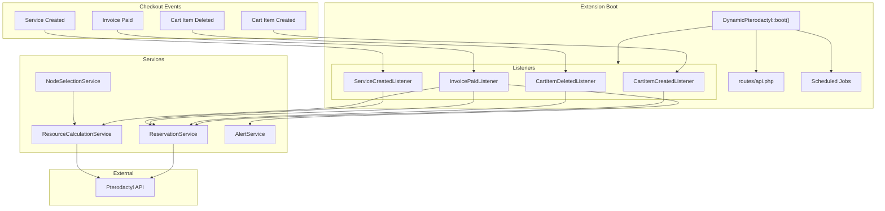
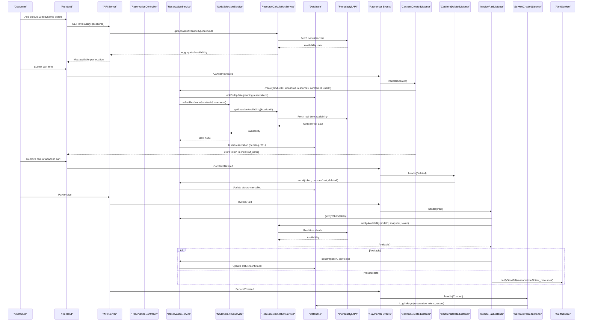
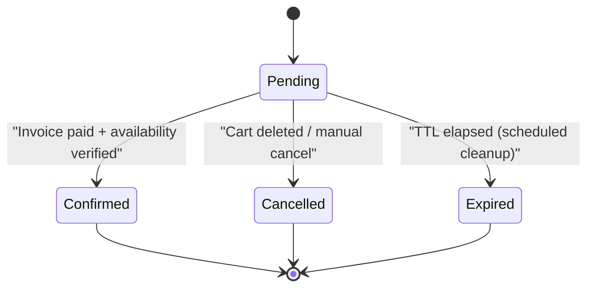
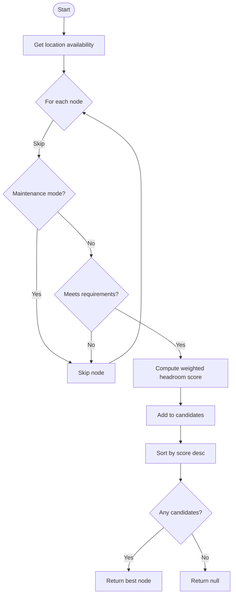
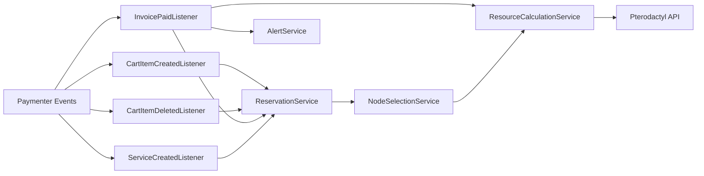

# Complete Checkout Flow Integration

> **Preserved Qoder snapshot.** This deep-dive page is retained so the earlier Wiki work and its source trail are not lost. For the reconciled implementation, [[Architecture Overview|Architecture-Overview]] is canonical; references below to retired controllers, listeners, services, or API shapes are historical.

<cite>
**Referenced Files in This Document**
- [DynamicPterodactyl.php](https://github.com/ObsidianNetwork/dynamic-pterodactyl/blob/6b7f83bda6f7c3fe014d52428b31af1638daa6cc/DynamicPterodactyl.php)
- [CartItemCreatedListener.php](https://github.com/ObsidianNetwork/dynamic-pterodactyl/blob/6b7f83bda6f7c3fe014d52428b31af1638daa6cc/Listeners/CartItemCreatedListener.php)
- [CartItemDeletedListener.php](https://github.com/ObsidianNetwork/dynamic-pterodactyl/blob/6b7f83bda6f7c3fe014d52428b31af1638daa6cc/Listeners/CartItemDeletedListener.php)
- [InvoicePaidListener.php](https://github.com/ObsidianNetwork/dynamic-pterodactyl/blob/6b7f83bda6f7c3fe014d52428b31af1638daa6cc/Listeners/InvoicePaidListener.php)
- [ServiceCreatedListener.php](https://github.com/ObsidianNetwork/dynamic-pterodactyl/blob/6b7f83bda6f7c3fe014d52428b31af1638daa6cc/Listeners/ServiceCreatedListener.php)
- [ReservationService.php](https://github.com/ObsidianNetwork/dynamic-pterodactyl/blob/6b7f83bda6f7c3fe014d52428b31af1638daa6cc/Services/ReservationService.php)
- [ResourceCalculationService.php](https://github.com/ObsidianNetwork/dynamic-pterodactyl/blob/6b7f83bda6f7c3fe014d52428b31af1638daa6cc/Services/ResourceCalculationService.php)
- [NodeSelectionService.php](https://github.com/ObsidianNetwork/dynamic-pterodactyl/blob/6b7f83bda6f7c3fe014d52428b31af1638daa6cc/Services/NodeSelectionService.php)
- [AlertService.php](https://github.com/ObsidianNetwork/dynamic-pterodactyl/blob/6b7f83bda6f7c3fe014d52428b31af1638daa6cc/Services/AlertService.php)
- [AlertDeliveryFailed.php](https://github.com/ObsidianNetwork/dynamic-pterodactyl/blob/6b7f83bda6f7c3fe014d52428b31af1638daa6cc/Events/AlertDeliveryFailed.php)
- [ResourceReservation.php](https://github.com/ObsidianNetwork/dynamic-pterodactyl/blob/6b7f83bda6f7c3fe014d52428b31af1638daa6cc/Models/ResourceReservation.php)
- [api.php](https://github.com/ObsidianNetwork/dynamic-pterodactyl/blob/6b7f83bda6f7c3fe014d52428b31af1638daa6cc/routes/api.php)
- [ReservationController.php](https://github.com/ObsidianNetwork/dynamic-pterodactyl/blob/6b7f83bda6f7c3fe014d52428b31af1638daa6cc/Http/Controllers/Api/ReservationController.php)
- [AvailabilityController.php](https://github.com/ObsidianNetwork/dynamic-pterodactyl/blob/6b7f83bda6f7c3fe014d52428b31af1638daa6cc/Http/Controllers/Api/AvailabilityController.php)
</cite>

## Table of Contents
1. [Introduction](#introduction)
2. [Project Structure](#project-structure)
3. [Core Components](#core-components)
4. [Architecture Overview](#architecture-overview)
5. [Detailed Component Analysis](#detailed-component-analysis)
6. [Dependency Analysis](#dependency-analysis)
7. [Performance Considerations](#performance-considerations)
8. [Troubleshooting Guide](#troubleshooting-guide)
9. [Conclusion](#conclusion)

## Introduction
This document explains the end-to-end checkout flow for Pterodactyl products powered by an event-driven architecture. It covers how a customer journey from adding items to cart through payment and service provisioning is orchestrated using events, listeners, services, and scheduled jobs. It also documents edge cases such as cart abandonment, payment failures, and service provisioning errors, along with troubleshooting techniques for debugging event-driven workflows.

The extension integrates with Paymenter core events:
- Cart item created → create resource reservation
- Cart item deleted → cancel reservation (unless already consumed by checkout)
- Invoice paid → confirm reservation after final availability verification
- Service created → log linkage for tracking

Reservations are time-bounded and use pessimistic database locking with deadlock retries. Real-time availability is fetched from the Pterodactyl API without caching.

## Project Structure
At a high level, the extension registers routes, observers, and event listeners during boot. The checkout flow spans controllers, listeners, services, models, and scheduled tasks.

**Diagram sources**
- [DynamicPterodactyl.php:96-127](https://github.com/ObsidianNetwork/dynamic-pterodactyl/blob/6b7f83bda6f7c3fe014d52428b31af1638daa6cc/DynamicPterodactyl.php#L96-L127)
- [api.php:17-40](https://github.com/ObsidianNetwork/dynamic-pterodactyl/blob/6b7f83bda6f7c3fe014d52428b31af1638daa6cc/routes/api.php#L17-L40)
- [CartItemCreatedListener.php:13-87](https://github.com/ObsidianNetwork/dynamic-pterodactyl/blob/6b7f83bda6f7c3fe014d52428b31af1638daa6cc/Listeners/CartItemCreatedListener.php#L13-L87)
- [CartItemDeletedListener.php:12-57](https://github.com/ObsidianNetwork/dynamic-pterodactyl/blob/6b7f83bda6f7c3fe014d52428b31af1638daa6cc/Listeners/CartItemDeletedListener.php#L12-L57)
- [InvoicePaidListener.php:14-133](https://github.com/ObsidianNetwork/dynamic-pterodactyl/blob/6b7f83bda6f7c3fe014d52428b31af1638daa6cc/Listeners/InvoicePaidListener.php#L14-L133)
- [ServiceCreatedListener.php:10-31](https://github.com/ObsidianNetwork/dynamic-pterodactyl/blob/6b7f83bda6f7c3fe014d52428b31af1638daa6cc/Listeners/ServiceCreatedListener.php#L10-L31)
- [ReservationService.php:43-141](https://github.com/ObsidianNetwork/dynamic-pterodactyl/blob/6b7f83bda6f7c3fe014d52428b31af1638daa6cc/Services/ReservationService.php#L43-L141)
- [ResourceCalculationService.php:200-214](https://github.com/ObsidianNetwork/dynamic-pterodactyl/blob/6b7f83bda6f7c3fe014d52428b31af1638daa6cc/Services/ResourceCalculationService.php#L200-L214)
- [NodeSelectionService.php:22-76](https://github.com/ObsidianNetwork/dynamic-pterodactyl/blob/6b7f83bda6f7c3fe014d52428b31af1638daa6cc/Services/NodeSelectionService.php#L22-L76)
- [AlertService.php:328-361](https://github.com/ObsidianNetwork/dynamic-pterodactyl/blob/6b7f83bda6f7c3fe014d52428b31af1638daa6cc/Services/AlertService.php#L328-L361)

**Section sources**
- [DynamicPterodactyl.php:96-127](https://github.com/ObsidianNetwork/dynamic-pterodactyl/blob/6b7f83bda6f7c3fe014d52428b31af1638daa6cc/DynamicPterodactyl.php#L96-L127)
- [api.php:17-40](https://github.com/ObsidianNetwork/dynamic-pterodactyl/blob/6b7f83bda6f7c3fe014d52428b31af1638daa6cc/routes/api.php#L17-L40)

## Core Components
- Event registration and scheduling: Extension boot wires up event listeners and schedules cleanup and alert checks.
- Listeners: React to Paymenter core events to manage reservations and notifications.
- Services:
  - ReservationService: Create, confirm, cancel, extend, and clean up reservations; idempotency and pessimistic locking.
  - ResourceCalculationService: Real-time availability queries against Pterodactyl API; verify availability at payment time.
  - NodeSelectionService: Best-fit node selection algorithm based on weighted headroom.
  - AlertService: Capacity alerts and shortfall notifications to admins via email/webhook.
- Models: ResourceReservation entity representing pending/confirmed/expired/cancelled states.
- Controllers and routes: Expose availability, pricing, and reservation management endpoints.

**Section sources**
- [DynamicPterodactyl.php:106-145](https://github.com/ObsidianNetwork/dynamic-pterodactyl/blob/6b7f83bda6f7c3fe014d52428b31af1638daa6cc/DynamicPterodactyl.php#L106-L145)
- [ReservationService.php:43-141](https://github.com/ObsidianNetwork/dynamic-pterodactyl/blob/6b7f83bda6f7c3fe014d52428b31af1638daa6cc/Services/ReservationService.php#L43-L141)
- [ResourceCalculationService.php:200-214](https://github.com/ObsidianNetwork/dynamic-pterodactyl/blob/6b7f83bda6f7c3fe014d52428b31af1638daa6cc/Services/ResourceCalculationService.php#L200-L214)
- [NodeSelectionService.php:22-76](https://github.com/ObsidianNetwork/dynamic-pterodactyl/blob/6b7f83bda6f7c3fe014d52428b31af1638daa6cc/Services/NodeSelectionService.php#L22-L76)
- [AlertService.php:328-361](https://github.com/ObsidianNetwork/dynamic-pterodactyl/blob/6b7f83bda6f7c3fe014d52428b31af1638daa6cc/Services/AlertService.php#L328-L361)
- [ResourceReservation.php:10-65](https://github.com/ObsidianNetwork/dynamic-pterodactyl/blob/6b7f83bda6f7c3fe014d52428b31af1638daa6cc/Models/ResourceReservation.php#L10-L65)
- [api.php:17-40](https://github.com/ObsidianNetwork/dynamic-pterodactyl/blob/6b7f83bda6f7c3fe014d52428b31af1638daa6cc/routes/api.php#L17-L40)

## Architecture Overview
The checkout flow is event-driven and stateful:

**Diagram sources**
- [AvailabilityController.php:22-51](https://github.com/ObsidianNetwork/dynamic-pterodactyl/blob/6b7f83bda6f7c3fe014d52428b31af1638daa6cc/Http/Controllers/Api/AvailabilityController.php#L22-L51)
- [ResourceCalculationService.php:26-67](https://github.com/ObsidianNetwork/dynamic-pterodactyl/blob/6b7f83bda6f7c3fe014d52428b31af1638daa6cc/Services/ResourceCalculationService.php#L26-L67)
- [NodeSelectionService.php:22-76](https://github.com/ObsidianNetwork/dynamic-pterodactyl/blob/6b7f83bda6f7c3fe014d52428b31af1638daa6cc/Services/NodeSelectionService.php#L22-L76)
- [CartItemCreatedListener.php:13-87](https://github.com/ObsidianNetwork/dynamic-pterodactyl/blob/6b7f83bda6f7c3fe014d52428b31af1638daa6cc/Listeners/CartItemCreatedListener.php#L13-L87)
- [ReservationService.php:43-141](https://github.com/ObsidianNetwork/dynamic-pterodactyl/blob/6b7f83bda6f7c3fe014d52428b31af1638daa6cc/Services/ReservationService.php#L43-L141)
- [CartItemDeletedListener.php:12-57](https://github.com/ObsidianNetwork/dynamic-pterodactyl/blob/6b7f83bda6f7c3fe014d52428b31af1638daa6cc/Listeners/CartItemDeletedListener.php#L12-L57)
- [InvoicePaidListener.php:14-133](https://github.com/ObsidianNetwork/dynamic-pterodactyl/blob/6b7f83bda6f7c3fe014d52428b31af1638daa6cc/Listeners/InvoicePaidListener.php#L14-L133)
- [ServiceCreatedListener.php:10-31](https://github.com/ObsidianNetwork/dynamic-pterodactyl/blob/6b7f83bda6f7c3fe014d52428b31af1638daa6cc/Listeners/ServiceCreatedListener.php#L10-L31)
- [AlertService.php:328-361](https://github.com/ObsidianNetwork/dynamic-pterodactyl/blob/6b7f83bda6f7c3fe014d52428b31af1638daa6cc/Services/AlertService.php#L328-L361)

## Detailed Component Analysis

### Event Registration and Scheduling
- The extension boots and registers:
  - Event listeners for cart and checkout lifecycle
  - Admin policy binding
  - Route loading
  - Scheduled jobs for expired reservation cleanup and capacity alert checks

Key responsibilities:
- Ensure listeners are bound to Paymenter core events
- Run periodic maintenance to keep reservation state accurate
- Provide admin-only endpoints gated by middleware

**Section sources**
- [DynamicPterodactyl.php:96-127](https://github.com/ObsidianNetwork/dynamic-pterodactyl/blob/6b7f83bda6f7c3fe014d52428b31af1638daa6cc/DynamicPterodactyl.php#L96-L127)
- [DynamicPterodactyl.php:132-145](https://github.com/ObsidianNetwork/dynamic-pterodactyl/blob/6b7f83bda6f7c3fe014d52428b31af1638daa6cc/DynamicPterodactyl.php#L132-L145)
- [api.php:17-40](https://github.com/ObsidianNetwork/dynamic-pterodactyl/blob/6b7f83bda6f7c3fe014d52428b31af1638daa6cc/routes/api.php#L17-L40)

### Cart Item Created → Reservation Creation
Trigger: Paymenter emits CartItem\Created when a user adds a product with dynamic_slider options.

Flow:
- Listener checks if the product has dynamic_slider config options
- Extracts resource values (memory/cpu/disk) and location
- Calls ReservationService::create within a transaction with pessimistic locking
- Selects best node using NodeSelectionService and ResourceCalculationService
- Persists reservation with TTL and stores token in cart item’s checkout_config
- Logs success or error without blocking cart operations

Edge cases:
- Missing dynamic_slider options or missing location → no reservation created
- No suitable node → exception logged; user can still proceed without guaranteed resources

**Section sources**
- [CartItemCreatedListener.php:13-87](https://github.com/ObsidianNetwork/dynamic-pterodactyl/blob/6b7f83bda6f7c3fe014d52428b31af1638daa6cc/Listeners/CartItemCreatedListener.php#L13-L87)
- [ReservationService.php:43-141](https://github.com/ObsidianNetwork/dynamic-pterodactyl/blob/6b7f83bda6f7c3fe014d52428b31af1638daa6cc/Services/ReservationService.php#L43-L141)
- [NodeSelectionService.php:22-76](https://github.com/ObsidianNetwork/dynamic-pterodactyl/blob/6b7f83bda6f7c3fe014d52428b31af1638daa6cc/Services/NodeSelectionService.php#L22-L76)

### Cart Item Deleted → Reservation Cancellation
Trigger: Paymenter emits CartItem\Deleted when a cart item is removed.

Flow:
- Listener retrieves reservation token from cart item’s checkout_config
- Skips cancellation if the item was already consumed by checkout (service exists with same token)
- Otherwise cancels reservation with reason 'cart_deleted'

Edge cases:
- If service already references the token, cancellation is skipped to avoid race conditions with payment confirmation

**Section sources**
- [CartItemDeletedListener.php:12-57](https://github.com/ObsidianNetwork/dynamic-pterodactyl/blob/6b7f83bda6f7c3fe014d52428b31af1638daa6cc/Listeners/CartItemDeletedListener.php#L12-L57)

### Invoice Paid → Final Verification and Confirmation
Trigger: Paymenter emits Invoice\Paid after successful payment.

Flow:
- Listener finds associated service and reservation token
- Retrieves reservation and builds a snapshot of requested resources
- Performs final availability verification against Pterodactyl API
- If available, confirms reservation (status becomes confirmed)
- If not available or state drift occurs, triggers shortfall notification to admins

Edge cases:
- Reservation not found → warning logged and processing continues
- Availability check fails → shortfall alert sent
- Confirm returns false due to state drift → shortfall alert with drift reason

**Section sources**
- [InvoicePaidListener.php:14-133](https://github.com/ObsidianNetwork/dynamic-pterodactyl/blob/6b7f83bda6f7c3fe014d52428b31af1638daa6cc/Listeners/InvoicePaidListener.php#L14-L133)
- [ResourceCalculationService.php:200-214](https://github.com/ObsidianNetwork/dynamic-pterodactyl/blob/6b7f83bda6f7c3fe014d52428b31af1638daa6cc/Services/ResourceCalculationService.php#L200-L214)
- [AlertService.php:328-361](https://github.com/ObsidianNetwork/dynamic-pterodactyl/blob/6b7f83bda6f7c3fe014d52428b31af1638daa6cc/Services/AlertService.php#L328-L361)

### Service Created → Tracking
Trigger: Paymenter emits Service\Created after service provisioning begins.

Flow:
- Listener logs presence of reservation token for traceability
- Confirms that reservation should already be confirmed by InvoicePaidListener

Purpose:
- Audit trail and correlation between services and reservations

**Section sources**
- [ServiceCreatedListener.php:10-31](https://github.com/ObsidianNetwork/dynamic-pterodactyl/blob/6b7f83bda6f7c3fe014d52428b31af1638daa6cc/Listeners/ServiceCreatedListener.php#L10-L31)

### Reservation Lifecycle and State Transitions
States:
- pending → confirmed (on successful payment and verification)
- pending → cancelled (on cart deletion or explicit cancel)
- pending → expired (by scheduled cleanup when TTL elapses)

Concurrency and safety:
- Pessimistic locking on pending reservations during creation
- Deadlock retry up to 5 times
- Idempotency key support to prevent duplicate reservations under concurrent requests

**Diagram sources**
- [ReservationService.php:166-199](https://github.com/ObsidianNetwork/dynamic-pterodactyl/blob/6b7f83bda6f7c3fe014d52428b31af1638daa6cc/Services/ReservationService.php#L166-L199)
- [ReservationService.php:208-241](https://github.com/ObsidianNetwork/dynamic-pterodactyl/blob/6b7f83bda6f7c3fe014d52428b31af1638daa6cc/Services/ReservationService.php#L208-L241)
- [ReservationService.php:387-405](https://github.com/ObsidianNetwork/dynamic-pterodactyl/blob/6b7f83bda6f7c3fe014d52428b31af1638daa6cc/Services/ReservationService.php#L387-L405)
- [ResourceReservation.php:51-64](https://github.com/ObsidianNetwork/dynamic-pterodactyl/blob/6b7f83bda6f7c3fe014d52428b31af1638daa6cc/Models/ResourceReservation.php#L51-L64)

**Section sources**
- [ReservationService.php:43-141](https://github.com/ObsidianNetwork/dynamic-pterodactyl/blob/6b7f83bda6f7c3fe014d52428b31af1638daa6cc/Services/ReservationService.php#L43-L141)
- [ReservationService.php:166-199](https://github.com/ObsidianNetwork/dynamic-pterodactyl/blob/6b7f83bda6f7c3fe014d52428b31af1638daa6cc/Services/ReservationService.php#L166-L199)
- [ReservationService.php:208-241](https://github.com/ObsidianNetwork/dynamic-pterodactyl/blob/6b7f83bda6f7c3fe014d52428b31af1638daa6cc/Services/ReservationService.php#L208-L241)
- [ReservationService.php:387-405](https://github.com/ObsidianNetwork/dynamic-pterodactyl/blob/6b7f83bda6f7c3fe014d52428b31af1638daa6cc/Services/ReservationService.php#L387-L405)
- [ResourceReservation.php:51-64](https://github.com/ObsidianNetwork/dynamic-pterodactyl/blob/6b7f83bda6f7c3fe014d52428b31af1638daa6cc/Models/ResourceReservation.php#L51-L64)

### Node Selection Algorithm
Algorithm:
- Best-fit with weighted headroom scoring
- Weights: memory 50%, disk 35%, CPU 15%
- Skips nodes in maintenance mode
- Returns null if no candidate meets requirements

**Diagram sources**
- [NodeSelectionService.php:22-76](https://github.com/ObsidianNetwork/dynamic-pterodactyl/blob/6b7f83bda6f7c3fe014d52428b31af1638daa6cc/Services/NodeSelectionService.php#L22-L76)

**Section sources**
- [NodeSelectionService.php:22-76](https://github.com/ObsidianNetwork/dynamic-pterodactyl/blob/6b7f83bda6f7c3fe014d52428b31af1638daa6cc/Services/NodeSelectionService.php#L22-L76)

### Availability and Pricing APIs
Endpoints:
- GET /api/dynamic-pterodactyl/availability/{locationId}: aggregated max available per location
- POST /api/dynamic-pterodactyl/pricing/calculate: calculate pricing configuration
- GET /api/dynamic-pterodactyl/pricing/config/{productId}: retrieve pricing config metadata
- Reservation CRUD: create, get, cancel, extend (checkout-scoped throttle)
- Admin endpoints: reservations listing, cancel, capacity summary, node details

Throttling:
- Availability/pricing: 30 req/min
- Reservations: 10 req/min to tolerate checkout retries without abuse

Security:
- Admin routes require authentication and admin role middleware

**Section sources**
- [api.php:17-40](https://github.com/ObsidianNetwork/dynamic-pterodactyl/blob/6b7f83bda6f7c3fe014d52428b31af1638daa6cc/routes/api.php#L17-L40)
- [AvailabilityController.php:22-71](https://github.com/ObsidianNetwork/dynamic-pterodactyl/blob/6b7f83bda6f7c3fe014d52428b31af1638daa6cc/Http/Controllers/Api/AvailabilityController.php#L22-L71)
- [ReservationController.php:24-136](https://github.com/ObsidianNetwork/dynamic-pterodactyl/blob/6b7f83bda6f7c3fe014d52428b31af1638daa6cc/Http/Controllers/Api/ReservationController.php#L24-L136)

## Dependency Analysis
The checkout flow depends on several internal and external components:

Coupling and cohesion:
- Listeners are cohesive around specific lifecycle events and delegate business logic to services
- Services encapsulate domain logic (reservations, availability, alerts) and are loosely coupled via interfaces
- External dependency on Pterodactyl API is centralized in ResourceCalculationService

Potential circular dependencies:
- None observed; dependencies are directional from listeners to services to external API

**Diagram sources**
- [DynamicPterodactyl.php:132-145](https://github.com/ObsidianNetwork/dynamic-pterodactyl/blob/6b7f83bda6f7c3fe014d52428b31af1638daa6cc/DynamicPterodactyl.php#L132-L145)
- [CartItemCreatedListener.php:13-87](https://github.com/ObsidianNetwork/dynamic-pterodactyl/blob/6b7f83bda6f7c3fe014d52428b31af1638daa6cc/Listeners/CartItemCreatedListener.php#L13-L87)
- [CartItemDeletedListener.php:12-57](https://github.com/ObsidianNetwork/dynamic-pterodactyl/blob/6b7f83bda6f7c3fe014d52428b31af1638daa6cc/Listeners/CartItemDeletedListener.php#L12-L57)
- [InvoicePaidListener.php:14-133](https://github.com/ObsidianNetwork/dynamic-pterodactyl/blob/6b7f83bda6f7c3fe014d52428b31af1638daa6cc/Listeners/InvoicePaidListener.php#L14-L133)
- [ServiceCreatedListener.php:10-31](https://github.com/ObsidianNetwork/dynamic-pterodactyl/blob/6b7f83bda6f7c3fe014d52428b31af1638daa6cc/Listeners/ServiceCreatedListener.php#L10-L31)
- [ReservationService.php:43-141](https://github.com/ObsidianNetwork/dynamic-pterodactyl/blob/6b7f83bda6f7c3fe014d52428b31af1638daa6cc/Services/ReservationService.php#L43-L141)
- [ResourceCalculationService.php:200-214](https://github.com/ObsidianNetwork/dynamic-pterodactyl/blob/6b7f83bda6f7c3fe014d52428b31af1638daa6cc/Services/ResourceCalculationService.php#L200-L214)
- [NodeSelectionService.php:22-76](https://github.com/ObsidianNetwork/dynamic-pterodactyl/blob/6b7f83bda6f7c3fe014d52428b31af1638daa6cc/Services/NodeSelectionService.php#L22-L76)
- [AlertService.php:328-361](https://github.com/ObsidianNetwork/dynamic-pterodactyl/blob/6b7f83bda6f7c3fe014d52428b31af1638daa6cc/Services/AlertService.php#L328-L361)

**Section sources**
- [DynamicPterodactyl.php:132-145](https://github.com/ObsidianNetwork/dynamic-pterodactyl/blob/6b7f83bda6f7c3fe014d52428b31af1638daa6cc/DynamicPterodactyl.php#L132-L145)
- [ReservationService.php:43-141](https://github.com/ObsidianNetwork/dynamic-pterodactyl/blob/6b7f83bda6f7c3fe014d52428b31af1638daa6cc/Services/ReservationService.php#L43-L141)
- [ResourceCalculationService.php:200-214](https://github.com/ObsidianNetwork/dynamic-pterodactyl/blob/6b7f83bda6f7c3fe014d52428b31af1638daa6cc/Services/ResourceCalculationService.php#L200-L214)
- [NodeSelectionService.php:22-76](https://github.com/ObsidianNetwork/dynamic-pterodactyl/blob/6b7f83bda6f7c3fe014d52428b31af1638daa6cc/Services/NodeSelectionService.php#L22-L76)
- [AlertService.php:328-361](https://github.com/ObsidianNetwork/dynamic-pterodactyl/blob/6b7f83bda6f7c3fe014d52428b31af1638daa6cc/Services/AlertService.php#L328-L361)

## Performance Considerations
- Real-time availability: Always fetches from Pterodactyl API; no caching ensures accuracy but increases latency and API usage
- Batching: buildClusterSnapshot batches API calls where possible
- Throttling: API endpoints are throttled to protect Pterodactyl budget
- Concurrency: Pessimistic locking with deadlock retries reduces contention risks during reservation creation
- Scheduling: Periodic cleanup prevents stale pending reservations from skewing dashboards and guarantees TTL enforcement

[No sources needed since this section provides general guidance]

## Troubleshooting Guide

Common issues and diagnostics:

- Cart item added but no reservation created
  - Check if product has dynamic_slider config options
  - Verify location extraction from checkout_config or config_options
  - Inspect logs for missing resources or location
  - Validate that node selection found a suitable node

- Reservation not confirmed after payment
  - Review final availability verification step
  - Check for insufficient resources or state drift
  - Look for shortfall notifications sent to admins
  - Confirm reservation TTL has not expired before confirmation

- Cart deletion did not cancel reservation
  - Ensure service does not already reference the reservation token
  - Verify listener executed and called cancel with correct token
  - Check logs for race condition handling

- Alerts not delivered
  - Check admin recipients configuration
  - Inspect webhook delivery logs and errors
  - Use AlertDeliveryFailed event to track failed deliveries

Debugging techniques:
- Enable detailed logging around event listeners and service methods
- Monitor scheduled job runs for expired reservation cleanup
- Use admin endpoints to inspect reservations and capacity
- Validate Pterodactyl API connectivity and rate limits

**Section sources**
- [CartItemCreatedListener.php:13-87](https://github.com/ObsidianNetwork/dynamic-pterodactyl/blob/6b7f83bda6f7c3fe014d52428b31af1638daa6cc/Listeners/CartItemCreatedListener.php#L13-L87)
- [CartItemDeletedListener.php:12-57](https://github.com/ObsidianNetwork/dynamic-pterodactyl/blob/6b7f83bda6f7c3fe014d52428b31af1638daa6cc/Listeners/CartItemDeletedListener.php#L12-L57)
- [InvoicePaidListener.php:14-133](https://github.com/ObsidianNetwork/dynamic-pterodactyl/blob/6b7f83bda6f7c3fe014d52428b31af1638daa6cc/Listeners/InvoicePaidListener.php#L14-L133)
- [AlertService.php:128-248](https://github.com/ObsidianNetwork/dynamic-pterodactyl/blob/6b7f83bda6f7c3fe014d52428b31af1638daa6cc/Services/AlertService.php#L128-L248)
- [AlertDeliveryFailed.php:9-16](https://github.com/ObsidianNetwork/dynamic-pterodactyl/blob/6b7f83bda6f7c3fe014d52428b31af1638daa6cc/Events/AlertDeliveryFailed.php#L9-L16)
- [ReservationService.php:387-405](https://github.com/ObsidianNetwork/dynamic-pterodactyl/blob/6b7f83bda6f7c3fe014d52428b31af1638daa6cc/Services/ReservationService.php#L387-L405)

## Conclusion
The checkout flow integrates tightly with Paymenter core events to provide dynamic resource reservations and real-time availability checks. The event-driven design ensures clear separation of concerns, robust concurrency handling, and comprehensive observability through logging and alerts. Edge cases like cart abandonment, payment failures, and provisioning errors are handled gracefully with fallbacks and notifications. Scheduled maintenance keeps the system consistent and reliable over time.