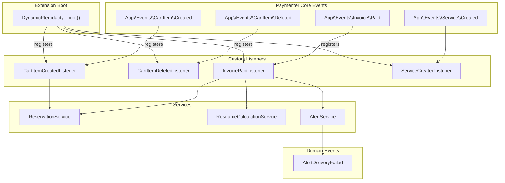
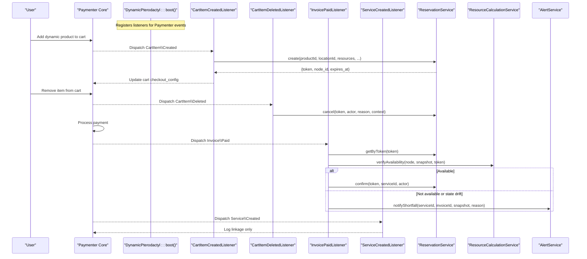
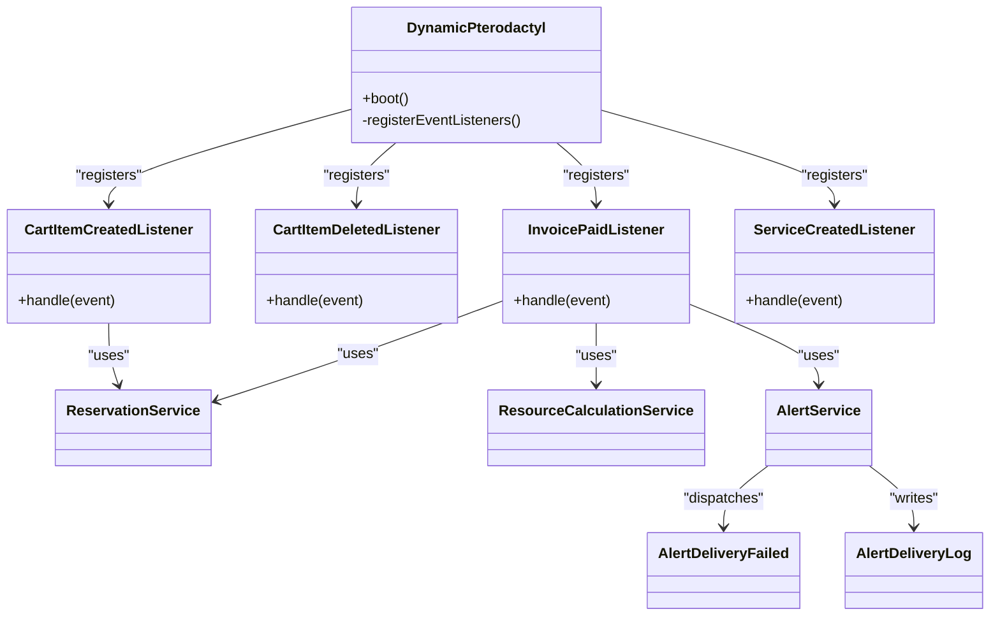

# Event Registration and Configuration

<cite>
**Referenced Files in This Document**
- [DynamicPterodactyl.php](file://DynamicPterodactyl.php)
- [CartItemCreatedListener.php](file://Listeners/CartItemCreatedListener.php)
- [CartItemDeletedListener.php](file://Listeners/CartItemDeletedListener.php)
- [InvoicePaidListener.php](file://Listeners/InvoicePaidListener.php)
- [ServiceCreatedListener.php](file://Listeners/ServiceCreatedListener.php)
- [AlertDeliveryFailed.php](file://Events/AlertDeliveryFailed.php)
- [AlertService.php](file://Services/AlertService.php)
- [AlertDeliveryLog.php](file://Models/AlertDeliveryLog.php)
- [CartItemDeletedListenerTest.php](file://tests/Unit/CartItemDeletedListenerTest.php)
- [InvoicePaidListenerTest.php](file://tests/Unit/InvoicePaidListenerTest.php)
</cite>

## Table of Contents
1. [Introduction](#introduction)
2. [Project Structure](#project-structure)
3. [Core Components](#core-components)
4. [Architecture Overview](#architecture-overview)
5. [Detailed Component Analysis](#detailed-component-analysis)
6. [Dependency Analysis](#dependency-analysis)
7. [Performance Considerations](#performance-considerations)
8. [Troubleshooting Guide](#troubleshooting-guide)
9. [Conclusion](#conclusion)
10. [Appendices](#appendices)

## Introduction
This document explains how the Dynamic Pterodactyl extension registers and configures events within a Paymenter installation. It focuses on:
- How the extension’s boot process uses Laravel’s Event facade to map Paymenter core events to custom listeners
- How the extension integrates with Paymenter’s event system without conflicts
- The custom event pattern used for alert delivery failures
- Best practices for building event-driven extensions that extend existing functionality safely

The extension is an “Other” extension inside Paymenter, meaning it relies on Paymenter’s autoloading and event lifecycle. It does not own pricing logic; it participates in the checkout flow by creating, canceling, and confirming resource reservations through events.

## Project Structure
Event-related code is organized into:
- Extension entry point where listeners are registered during boot
- Listeners that react to Paymenter core events
- A custom domain event for alert delivery failures
- Services that dispatch domain events and orchestrate side effects
- Models backing audit and delivery logs

**Diagram sources**
- [DynamicPterodactyl.php:96-145](file://DynamicPterodactyl.php#L96-L145)
- [CartItemCreatedListener.php:13-87](file://Listeners/CartItemCreatedListener.php#L13-L87)
- [CartItemDeletedListener.php:12-57](file://Listeners/CartItemDeletedListener.php#L12-L57)
- [InvoicePaidListener.php:14-133](file://Listeners/InvoicePaidListener.php#L14-L133)
- [ServiceCreatedListener.php:10-31](file://Listeners/ServiceCreatedListener.php#L10-L31)
- [AlertService.php:128-247](file://Services/AlertService.php#L128-L247)
- [AlertDeliveryFailed.php:9-15](file://Events/AlertDeliveryFailed.php#L9-L15)

**Section sources**
- [DynamicPterodactyl.php:96-145](file://DynamicPterodactyl.php#L96-L145)

## Core Components
- Event registration occurs in the extension’s boot method via Laravel’s Event facade. Four Paymenter core events are mapped to dedicated listeners:
  - Cart item created → create reservation
  - Cart item deleted → cancel reservation (with safeguards)
  - Invoice paid → verify availability and confirm reservation
  - Service created → log linkage for tracking
- Custom domain event AlertDeliveryFailed is dispatched when alert notifications fail to deliver across configured channels.

Key responsibilities:
- Listeners isolate business logic from event plumbing
- Services encapsulate complex operations like reservation management, resource verification, and alert delivery
- Domain events decouple failure reporting from primary flows

**Section sources**
- [DynamicPterodactyl.php:96-145](file://DynamicPterodactyl.php#L96-L145)
- [AlertDeliveryFailed.php:9-15](file://Events/AlertDeliveryFailed.php#L9-L15)
- [AlertService.php:128-247](file://Services/AlertService.php#L128-L247)

## Architecture Overview
The extension integrates with Paymenter’s event system by registering listeners during boot. Each listener handles one stage of the checkout lifecycle and coordinates with services to perform side effects such as reserving resources or sending alerts.

**Diagram sources**
- [DynamicPterodactyl.php:96-145](file://DynamicPterodactyl.php#L96-L145)
- [CartItemCreatedListener.php:13-87](file://Listeners/CartItemCreatedListener.php#L13-L87)
- [CartItemDeletedListener.php:12-57](file://Listeners/CartItemDeletedListener.php#L12-L57)
- [InvoicePaidListener.php:14-133](file://Listeners/InvoicePaidListener.php#L14-L133)
- [ServiceCreatedListener.php:10-31](file://Listeners/ServiceCreatedListener.php#L10-L31)

## Detailed Component Analysis

### Event Registration in boot()
- The extension registers four listeners using Laravel’s Event facade:
  - Maps Paymenter’s CartItem\Created to CartItemCreatedListener
  - Maps Paymenter’s CartItem\Deleted to CartItemDeletedListener
  - Maps Paymenter’s Invoice\Paid to InvoicePaidListener
  - Maps Paymenter’s Service\Created to ServiceCreatedListener
- Registration happens once per request after gates, routes, and views are set up.
- Scheduled tasks for cleanup and capacity checks are also defined here.

Best practices demonstrated:
- Centralized registration keeps event wiring explicit and testable
- Listener classes keep handlers focused and reusable
- Exceptions in listeners are caught and logged so they do not block core flows

**Section sources**
- [DynamicPterodactyl.php:96-145](file://DynamicPterodactyl.php#L96-L145)

### CartItemCreatedListener
Responsibilities:
- Detects if the cart item belongs to a product with dynamic slider options
- Extracts memory, CPU, and disk values from native config options
- Resolves the selected location ID from checkout configuration or fallback fields
- Creates a reservation and stores tokens and calculated price back into the cart item’s checkout configuration
- Logs errors without blocking the cart operation

Error handling:
- Gracefully continues even if reservation creation fails, ensuring checkout can proceed without guaranteed resources

**Section sources**
- [CartItemCreatedListener.php:13-87](file://Listeners/CartItemCreatedListener.php#L13-L87)
- [CartItemCreatedListener.php:93-172](file://Listeners/CartItemCreatedListener.php#L93-L172)

### CartItemDeletedListener
Responsibilities:
- Cancels a reservation when a cart item is removed
- Avoids race conditions during checkout by checking whether the reservation token has already been copied into the resulting service properties
- Logs debug info when skipping cancellation due to checkout consumption
- Catches and logs exceptions without rethrowing

Race condition safeguard:
- If a service exists with the same reservation token, the deletion is treated as part of a successful checkout and cancellation is skipped

**Section sources**
- [CartItemDeletedListener.php:12-57](file://Listeners/CartItemDeletedListener.php#L12-L57)
- [CartItemDeletedListenerTest.php:33-68](file://tests/Unit/CartItemDeletedListenerTest.php#L33-L68)
- [CartItemDeletedListenerTest.php:70-95](file://tests/Unit/CartItemDeletedListenerTest.php#L70-L95)
- [CartItemDeletedListenerTest.php:97-125](file://tests/Unit/CartItemDeletedListenerTest.php#L97-L125)

### InvoicePaidListener
Responsibilities:
- Retrieves the reservation associated with the paid invoice item
- Performs final availability verification before confirmation
- Confirms the reservation if available
- Triggers shortfall notifications when resources are unavailable or when state drift prevents confirmation
- Logs warnings and errors for observability

Critical checks:
- Final availability verification ensures that concurrent changes do not lead to overbooking
- State drift detection triggers alerts when the reservation cannot be confirmed due to status changes between checks

**Section sources**
- [InvoicePaidListener.php:14-133](file://Listeners/InvoicePaidListener.php#L14-L133)
- [InvoicePaidListenerTest.php:25-61](file://tests/Unit/InvoicePaidListenerTest.php#L25-L61)
- [InvoicePaidListenerTest.php:63-102](file://tests/Unit/InvoicePaidListenerTest.php#L63-L102)

### ServiceCreatedListener
Responsibilities:
- Logs linkage between service creation and reservation tokens for tracking purposes
- Does not alter reservation state; confirmation is handled by the invoice paid flow

**Section sources**
- [ServiceCreatedListener.php:10-31](file://Listeners/ServiceCreatedListener.php#L10-L31)

### Custom Event: AlertDeliveryFailed
Purpose:
- Represents a domain-level failure when alert notifications could not be delivered through any configured channel
- Carries a delivery log instance (either persisted or transient) to provide context to subscribers

Usage:
- Dispatched by AlertService when all attempted notification channels fail
- Enables external systems or additional listeners to react to delivery failures (e.g., retry queues, escalation)

Design notes:
- Uses Laravel’s Dispatchable and SerializesModels traits for standard event behavior
- Accepts a readonly AlertDeliveryLog to preserve immutability of the payload

**Section sources**
- [AlertDeliveryFailed.php:9-15](file://Events/AlertDeliveryFailed.php#L9-L15)
- [AlertService.php:218-236](file://Services/AlertService.php#L218-L236)

### AlertService Integration
Responsibilities:
- Periodically checks capacity thresholds and sends notifications via email and webhooks
- Records delivery attempts and outcomes in a delivery log model
- Dispatches AlertDeliveryFailed when no channel succeeds
- Provides a method to notify admins about reservation shortfalls or state drift

Failure handling:
- Attempts multiple channels and records which succeeded or failed
- Falls back to logging and auditing when database writes fail
- Reports throwables through the application exception handler when available

**Section sources**
- [AlertService.php:33-75](file://Services/AlertService.php#L33-L75)
- [AlertService.php:128-247](file://Services/AlertService.php#L128-L247)
- [AlertService.php:250-299](file://Services/AlertService.php#L250-L299)
- [AlertService.php:328-361](file://Services/AlertService.php#L328-L361)
- [AlertDeliveryLog.php:8-33](file://Models/AlertDeliveryLog.php#L8-L33)

## Dependency Analysis
The extension depends on Paymenter core events and provides listeners that coordinate with internal services. Dependencies are intentionally loose:
- Listeners depend on services via dependency injection or app resolution
- Services encapsulate cross-cutting concerns (resource calculation, alert delivery)
- Domain events decouple failure reporting from primary flows

**Diagram sources**
- [DynamicPterodactyl.php:96-145](file://DynamicPterodactyl.php#L96-L145)
- [CartItemCreatedListener.php:13-87](file://Listeners/CartItemCreatedListener.php#L13-L87)
- [CartItemDeletedListener.php:12-57](file://Listeners/CartItemDeletedListener.php#L12-L57)
- [InvoicePaidListener.php:14-133](file://Listeners/InvoicePaidListener.php#L14-L133)
- [ServiceCreatedListener.php:10-31](file://Listeners/ServiceCreatedListener.php#L10-L31)
- [AlertService.php:128-247](file://Services/AlertService.php#L128-L247)
- [AlertDeliveryLog.php:8-33](file://Models/AlertDeliveryLog.php#L8-L33)

**Section sources**
- [DynamicPterodactyl.php:96-145](file://DynamicPterodactyl.php#L96-L145)
- [AlertService.php:128-247](file://Services/AlertService.php#L128-L247)

## Performance Considerations
- Event listeners avoid blocking core flows by catching exceptions and logging errors instead of failing loudly
- Availability verification is performed at payment time to minimize risk while keeping real-time checks accurate
- Alerts use cooldowns and batched checks to reduce unnecessary notifications
- Delivery logs are written defensively; failures to persist are logged but do not break alerting

[No sources needed since this section provides general guidance]

## Troubleshooting Guide
Common issues and signals:
- No reservation created on cart add:
  - Check if the product has dynamic slider options and a valid location selection
  - Review logs for missing resources or location extraction failures
- Reservation not canceled on cart delete:
  - If a service exists with the same reservation token, cancellation is intentionally skipped to avoid racing with checkout confirmation
- Payment confirms but resources unavailable:
  - Inspect logs for availability verification failures and shortfall notifications
  - Verify that scheduled cleanup runs to transition expired reservations
- Alert delivery failures:
  - Review delivery logs for channels tried, success, and failure details
  - Use the admin audit page to inspect recent delivery failures

Operational tips:
- Ensure scheduled tasks run for cleanup and capacity checks
- Validate admin recipients and webhook endpoints for alert channels
- Monitor logs for error entries related to reservation processing and alert delivery

**Section sources**
- [CartItemDeletedListener.php:24-40](file://Listeners/CartItemDeletedListener.php#L24-L40)
- [InvoicePaidListener.php:58-90](file://Listeners/InvoicePaidListener.php#L58-L90)
- [InvoicePaidListener.php:103-125](file://Listeners/InvoicePaidListener.php#L103-L125)
- [AlertService.php:218-247](file://Services/AlertService.php#L218-L247)

## Conclusion
The Dynamic Pterodactyl extension integrates cleanly with Paymenter’s event system by registering focused listeners during boot. It extends existing functionality without conflicts by:
- Reacting to well-defined core events
- Encapsulating side effects in services
- Using a custom domain event to report alert delivery failures
- Implementing robust error handling and observability

This design supports scalable, maintainable event-driven architecture for extensions that need to participate in Paymenter’s checkout and operational workflows.

[No sources needed since this section summarizes without analyzing specific files]

## Appendices

### Event-to-Listener Mapping Reference
- Paymenter CartItem\Created → CartItemCreatedListener
- Paymenter CartItem\Deleted → CartItemDeletedListener
- Paymenter Invoice\Paid → InvoicePaidListener
- Paymenter Service\Created → ServiceCreatedListener
- Custom AlertDeliveryFailed → dispatched by AlertService on delivery failure

**Section sources**
- [DynamicPterodactyl.php:134-145](file://DynamicPterodactyl.php#L134-L145)
- [AlertService.php:218-236](file://Services/AlertService.php#L218-L236)

### Best Practices for Event-Driven Extensions
- Register listeners centrally in boot to keep wiring explicit
- Keep listeners thin; delegate complex logic to services
- Handle exceptions defensively to avoid breaking core flows
- Use domain events to decouple failure reporting from primary operations
- Record delivery and operational outcomes in structured logs or models
- Test critical paths with unit tests that assert service interactions and logging

[No sources needed since this section provides general guidance]