# Event-Driven Architecture

> **Preserved Qoder snapshot.** This deep-dive page is retained so the earlier Wiki work and its source trail are not lost. For the reconciled implementation, [[Architecture Overview|Architecture-Overview]] is canonical; references below to retired controllers, listeners, services, or API shapes are historical.

<cite>
**Referenced Files in This Document**
- [DynamicPterodactyl.php](https://github.com/ObsidianNetwork/dynamic-pterodactyl/blob/6b7f83bda6f7c3fe014d52428b31af1638daa6cc/DynamicPterodactyl.php)
- [CartItemCreatedListener.php](https://github.com/ObsidianNetwork/dynamic-pterodactyl/blob/6b7f83bda6f7c3fe014d52428b31af1638daa6cc/Listeners/CartItemCreatedListener.php)
- [CartItemDeletedListener.php](https://github.com/ObsidianNetwork/dynamic-pterodactyl/blob/6b7f83bda6f7c3fe014d52428b31af1638daa6cc/Listeners/CartItemDeletedListener.php)
- [InvoicePaidListener.php](https://github.com/ObsidianNetwork/dynamic-pterodactyl/blob/6b7f83bda6f7c3fe014d52428b31af1638daa6cc/Listeners/InvoicePaidListener.php)
- [ServiceCreatedListener.php](https://github.com/ObsidianNetwork/dynamic-pterodactyl/blob/6b7f83bda6f7c3fe014d52428b31af1638daa6cc/Listeners/ServiceCreatedListener.php)
- [ReservationService.php](https://github.com/ObsidianNetwork/dynamic-pterodactyl/blob/6b7f83bda6f7c3fe014d52428b31af1638daa6cc/Services/ReservationService.php)
- [ResourceCalculationService.php](https://github.com/ObsidianNetwork/dynamic-pterodactyl/blob/6b7f83bda6f7c3fe014d52428b31af1638daa6cc/Services/ResourceCalculationService.php)
- [AuditLogService.php](https://github.com/ObsidianNetwork/dynamic-pterodactyl/blob/6b7f83bda6f7c3fe014d52428b31af1638daa6cc/Services/AuditLogService.php)
- [ResourceReservation.php](https://github.com/ObsidianNetwork/dynamic-pterodactyl/blob/6b7f83bda6f7c3fe014d52428b31af1638daa6cc/Models/ResourceReservation.php)
- [2025_01_01_000001_create_ptero_resource_reservations_table.php](https://github.com/ObsidianNetwork/dynamic-pterodactyl/blob/6b7f83bda6f7c3fe014d52428b31af1638daa6cc/database/migrations/2025_01_01_000001_create_ptero_resource_reservations_table.php)
- [2025_01_01_000003_create_ptero_audit_logs_table.php](https://github.com/ObsidianNetwork/dynamic-pterodactyl/blob/6b7f83bda6f7c3fe014d52428b31af1638daa6cc/database/migrations/2025_01_01_000003_create_ptero_audit_logs_table.php)
</cite>

## Table of Contents
1. [Introduction](#introduction)
2. [Project Structure](#project-structure)
3. [Core Components](#core-components)
4. [Architecture Overview](#architecture-overview)
5. [Detailed Component Analysis](#detailed-component-analysis)
6. [Dependency Analysis](#dependency-analysis)
7. [Performance Considerations](#performance-considerations)
8. [Troubleshooting Guide](#troubleshooting-guide)
9. [Conclusion](#conclusion)

## Introduction
This document explains the event-driven architecture that powers the checkout flow integration for resource reservations. The extension listens to Paymenter core events and coordinates reservation lifecycle management across cart operations, payment confirmation, and service provisioning. It ensures resources are reserved during checkout, confirmed after payment, and audited throughout the process while maintaining consistency with real-time availability from Pterodactyl.

## Project Structure
The extension registers listeners during boot and wires them to Paymenter core events. Listeners delegate business logic to services, which interact with the database and external APIs as needed.

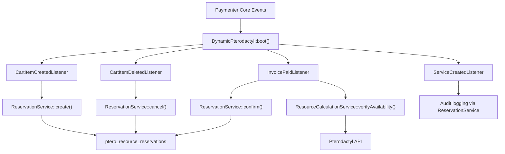

**Diagram sources**
- [DynamicPterodactyl.php:96-145](https://github.com/ObsidianNetwork/dynamic-pterodactyl/blob/6b7f83bda6f7c3fe014d52428b31af1638daa6cc/DynamicPterodactyl.php#L96-L145)
- [CartItemCreatedListener.php:13-87](https://github.com/ObsidianNetwork/dynamic-pterodactyl/blob/6b7f83bda6f7c3fe014d52428b31af1638daa6cc/Listeners/CartItemCreatedListener.php#L13-L87)
- [CartItemDeletedListener.php:12-57](https://github.com/ObsidianNetwork/dynamic-pterodactyl/blob/6b7f83bda6f7c3fe014d52428b31af1638daa6cc/Listeners/CartItemDeletedListener.php#L12-L57)
- [InvoicePaidListener.php:14-133](https://github.com/ObsidianNetwork/dynamic-pterodactyl/blob/6b7f83bda6f7c3fe014d52428b31af1638daa6cc/Listeners/InvoicePaidListener.php#L14-L133)
- [ServiceCreatedListener.php:10-31](https://github.com/ObsidianNetwork/dynamic-pterodactyl/blob/6b7f83bda6f7c3fe014d52428b31af1638daa6cc/Listeners/ServiceCreatedListener.php#L10-L31)
- [ReservationService.php:43-141](https://github.com/ObsidianNetwork/dynamic-pterodactyl/blob/6b7f83bda6f7c3fe014d52428b31af1638daa6cc/Services/ReservationService.php#L43-L141)
- [ResourceCalculationService.php:198-214](https://github.com/ObsidianNetwork/dynamic-pterodactyl/blob/6b7f83bda6f7c3fe014d52428b31af1638daa6cc/Services/ResourceCalculationService.php#L198-L214)

**Section sources**
- [DynamicPterodactyl.php:96-145](https://github.com/ObsidianNetwork/dynamic-pterodactyl/blob/6b7f83bda6f7c3fe014d52428b31af1638daa6cc/DynamicPterodactyl.php#L96-L145)

## Core Components
- Event registration: The extension boots and registers listeners for CartItemCreated, CartItemDeleted, InvoicePaid, and ServiceCreated.
- Listeners: Each listener handles a specific phase of the checkout flow and delegates to services.
- Services:
  - ReservationService manages reservation creation, confirmation, cancellation, TTL cleanup, and idempotency.
  - ResourceCalculationService performs real-time availability checks against Pterodactyl.
  - AuditLogService records actions for audit trails.
- Data model: ResourceReservation stores reservation state, resources, pricing snapshot, and relationships to cart items and services.

Key responsibilities:
- CartItemCreatedListener: Create a pending reservation when a product with dynamic sliders is added to the cart.
- CartItemDeletedListener: Cancel the reservation if the cart item is removed before checkout completes.
- InvoicePaidListener: Confirm the reservation after payment, re-verifying availability and handling shortfalls or state drift.
- ServiceCreatedListener: Log linkage between service and reservation for audit purposes.

**Section sources**
- [DynamicPterodactyl.php:106-145](https://github.com/ObsidianNetwork/dynamic-pterodactyl/blob/6b7f83bda6f7c3fe014d52428b31af1638daa6cc/DynamicPterodactyl.php#L106-L145)
- [CartItemCreatedListener.php:13-87](https://github.com/ObsidianNetwork/dynamic-pterodactyl/blob/6b7f83bda6f7c3fe014d52428b31af1638daa6cc/Listeners/CartItemCreatedListener.php#L13-L87)
- [CartItemDeletedListener.php:12-57](https://github.com/ObsidianNetwork/dynamic-pterodactyl/blob/6b7f83bda6f7c3fe014d52428b31af1638daa6cc/Listeners/CartItemDeletedListener.php#L12-L57)
- [InvoicePaidListener.php:14-133](https://github.com/ObsidianNetwork/dynamic-pterodactyl/blob/6b7f83bda6f7c3fe014d52428b31af1638daa6cc/Listeners/InvoicePaidListener.php#L14-L133)
- [ServiceCreatedListener.php:10-31](https://github.com/ObsidianNetwork/dynamic-pterodactyl/blob/6b7f83bda6f7c3fe014d52428b31af1638daa6cc/Listeners/ServiceCreatedListener.php#L10-L31)
- [ReservationService.php:43-141](https://github.com/ObsidianNetwork/dynamic-pterodactyl/blob/6b7f83bda6f7c3fe014d52428b31af1638daa6cc/Services/ReservationService.php#L43-L141)
- [ResourceCalculationService.php:198-214](https://github.com/ObsidianNetwork/dynamic-pterodactyl/blob/6b7f83bda6f7c3fe014d52428b31af1638daa6cc/Services/ResourceCalculationService.php#L198-L214)
- [ResourceReservation.php:10-65](https://github.com/ObsidianNetwork/dynamic-pterodactyl/blob/6b7f83bda6f7c3fe014d52428b31af1638daa6cc/Models/ResourceReservation.php#L10-L65)

## Architecture Overview
The checkout flow is event-driven and asynchronous at the boundaries (events fire around core actions). The extension ensures consistency by:
- Reserving resources immediately on cart addition.
- Re-verifying availability at payment time before confirming.
- Auditing all critical transitions.
- Using pessimistic locking and retries to avoid race conditions.
- Expiring reservations after a configurable TTL.

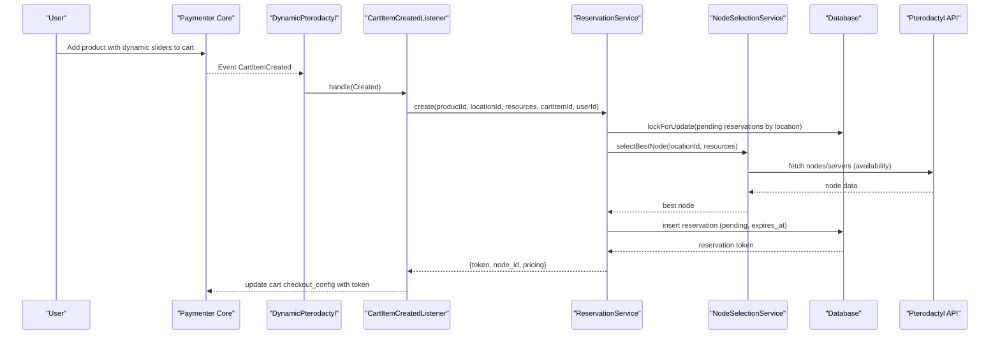

**Diagram sources**
- [DynamicPterodactyl.php:132-145](https://github.com/ObsidianNetwork/dynamic-pterodactyl/blob/6b7f83bda6f7c3fe014d52428b31af1638daa6cc/DynamicPterodactyl.php#L132-L145)
- [CartItemCreatedListener.php:13-87](https://github.com/ObsidianNetwork/dynamic-pterodactyl/blob/6b7f83bda6f7c3fe014d52428b31af1638daa6cc/Listeners/CartItemCreatedListener.php#L13-L87)
- [ReservationService.php:43-141](https://github.com/ObsidianNetwork/dynamic-pterodactyl/blob/6b7f83bda6f7c3fe014d52428b31af1638daa6cc/Services/ReservationService.php#L43-L141)

## Detailed Component Analysis

### Event Registration and Boot
The extension’s boot method registers gates, routes, views, and event listeners. It also schedules periodic tasks for expired reservation cleanup and capacity alerts.

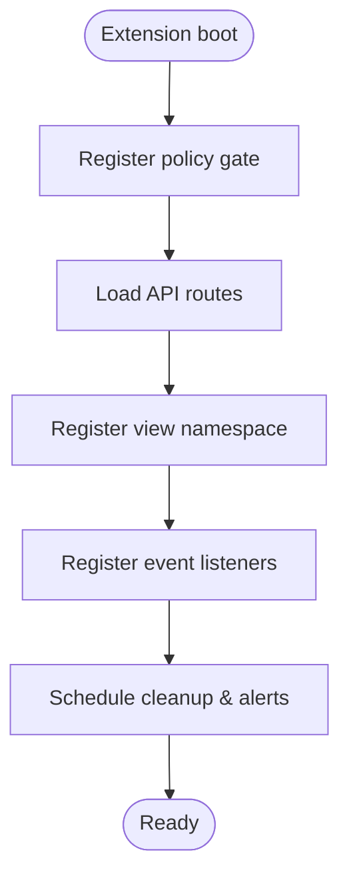

**Diagram sources**
- [DynamicPterodactyl.php:96-127](https://github.com/ObsidianNetwork/dynamic-pterodactyl/blob/6b7f83bda6f7c3fe014d52428b31af1638daa6cc/DynamicPterodactyl.php#L96-L127)

**Section sources**
- [DynamicPterodactyl.php:96-127](https://github.com/ObsidianNetwork/dynamic-pterodactyl/blob/6b7f83bda6f7c3fe014d52428b31af1638daa6cc/DynamicPterodactyl.php#L96-L127)

### CartItemCreatedListener: Reservation Creation
Responsibilities:
- Detects products with dynamic slider options.
- Extracts resource values (memory, CPU, disk) and location.
- Creates a pending reservation with a unique token and TTL.
- Stores the reservation token and selected node in the cart’s checkout configuration.

Error handling:
- Logs errors without blocking cart operations; user can still proceed without guaranteed resources.

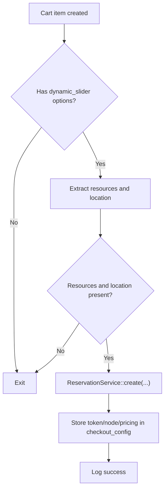

**Diagram sources**
- [CartItemCreatedListener.php:13-87](https://github.com/ObsidianNetwork/dynamic-pterodactyl/blob/6b7f83bda6f7c3fe014d52428b31af1638daa6cc/Listeners/CartItemCreatedListener.php#L13-L87)

**Section sources**
- [CartItemCreatedListener.php:13-87](https://github.com/ObsidianNetwork/dynamic-pterodactyl/blob/6b7f83bda6f7c3fe014d52428b31af1638daa6cc/Listeners/CartItemCreatedListener.php#L13-L87)

### CartItemDeletedListener: Reservation Cancellation
Responsibilities:
- Cancels the reservation associated with the deleted cart item.
- Avoids cancelling if the cart item was already consumed by checkout (service exists with the same token), preventing race conditions with InvoicePaidListener.

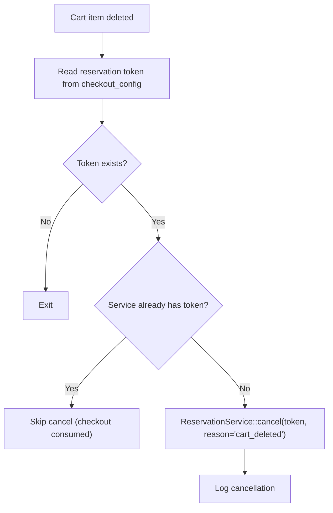

**Diagram sources**
- [CartItemDeletedListener.php:12-57](https://github.com/ObsidianNetwork/dynamic-pterodactyl/blob/6b7f83bda6f7c3fe014d52428b31af1638daa6cc/Listeners/CartItemDeletedListener.php#L12-L57)

**Section sources**
- [CartItemDeletedListener.php:12-57](https://github.com/ObsidianNetwork/dynamic-pterodactyl/blob/6b7f83bda6f7c3fe014d52428b31af1638daa6cc/Listeners/CartItemDeletedListener.php#L12-L57)

### InvoicePaidListener: Reservation Confirmation and Availability Verification
Responsibilities:
- Iterates invoice items referencing services.
- Retrieves the reservation token from service properties.
- Re-verifies availability using ResourceCalculationService to ensure resources are still available.
- Confirms the reservation if available; otherwise triggers shortfall notifications.
- Handles state drift where the reservation may have been cancelled/expired between verification and confirmation.

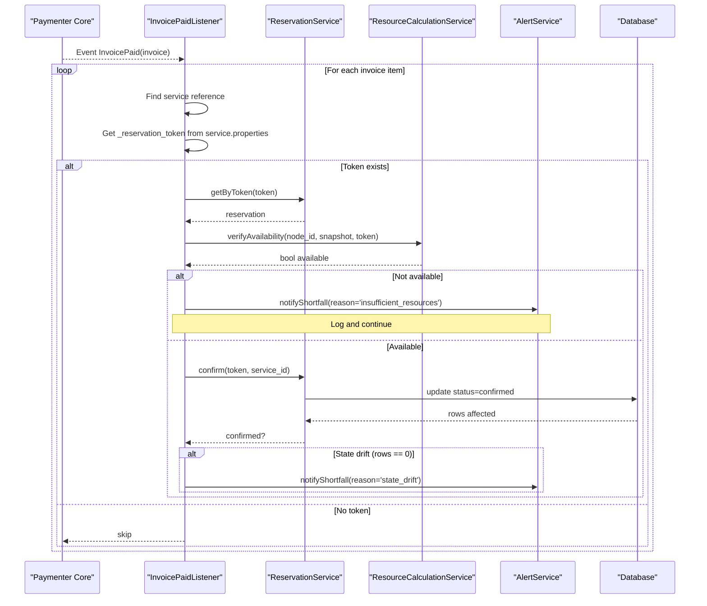

**Diagram sources**
- [InvoicePaidListener.php:14-133](https://github.com/ObsidianNetwork/dynamic-pterodactyl/blob/6b7f83bda6f7c3fe014d52428b31af1638daa6cc/Listeners/InvoicePaidListener.php#L14-L133)
- [ResourceCalculationService.php:198-214](https://github.com/ObsidianNetwork/dynamic-pterodactyl/blob/6b7f83bda6f7c3fe014d52428b31af1638daa6cc/Services/ResourceCalculationService.php#L198-L214)
- [ReservationService.php:166-199](https://github.com/ObsidianNetwork/dynamic-pterodactyl/blob/6b7f83bda6f7c3fe014d52428b31af1638daa6cc/Services/ReservationService.php#L166-L199)

**Section sources**
- [InvoicePaidListener.php:14-133](https://github.com/ObsidianNetwork/dynamic-pterodactyl/blob/6b7f83bda6f7c3fe014d52428b31af1638daa6cc/Listeners/InvoicePaidListener.php#L14-L133)

### ServiceCreatedListener: Audit Trail Entry
Responsibilities:
- Reads the reservation token from the newly created service’s properties.
- Logs linkage for tracking and auditing.

Note: The actual reservation confirmation occurs earlier in InvoicePaidListener; this listener focuses on audit/logging.

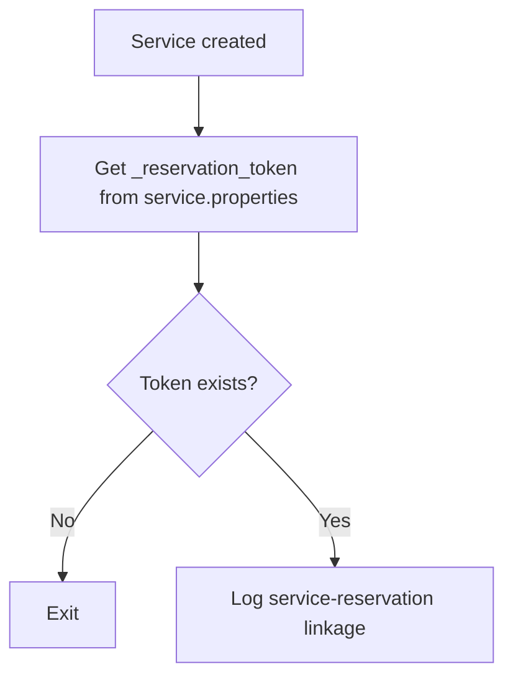

**Diagram sources**
- [ServiceCreatedListener.php:10-31](https://github.com/ObsidianNetwork/dynamic-pterodactyl/blob/6b7f83bda6f7c3fe014d52428b31af1638daa6cc/Listeners/ServiceCreatedListener.php#L10-L31)

**Section sources**
- [ServiceCreatedListener.php:10-31](https://github.com/ObsidianNetwork/dynamic-pterodactyl/blob/6b7f83bda6f7c3fe014d52428b31af1638daa6cc/Listeners/ServiceCreatedListener.php#L10-L31)

### ReservationService: Concurrency, Idempotency, and Lifecycle
Key behaviors:
- create(): Uses a transaction with pessimistic locking on pending reservations per location to prevent double reservations. Supports idempotency keys to deduplicate concurrent requests. Selects the best node via NodeSelectionService and inserts a pending reservation with TTL.
- confirm(): Updates status to confirmed only if still pending and not expired; logs audit entry.
- cancel(): Marks pending reservations as cancelled with reason and source context.
- extend(): Extends TTL for pending reservations.
- cleanupExpired(): Scheduled job marks overdue pending reservations as expired.

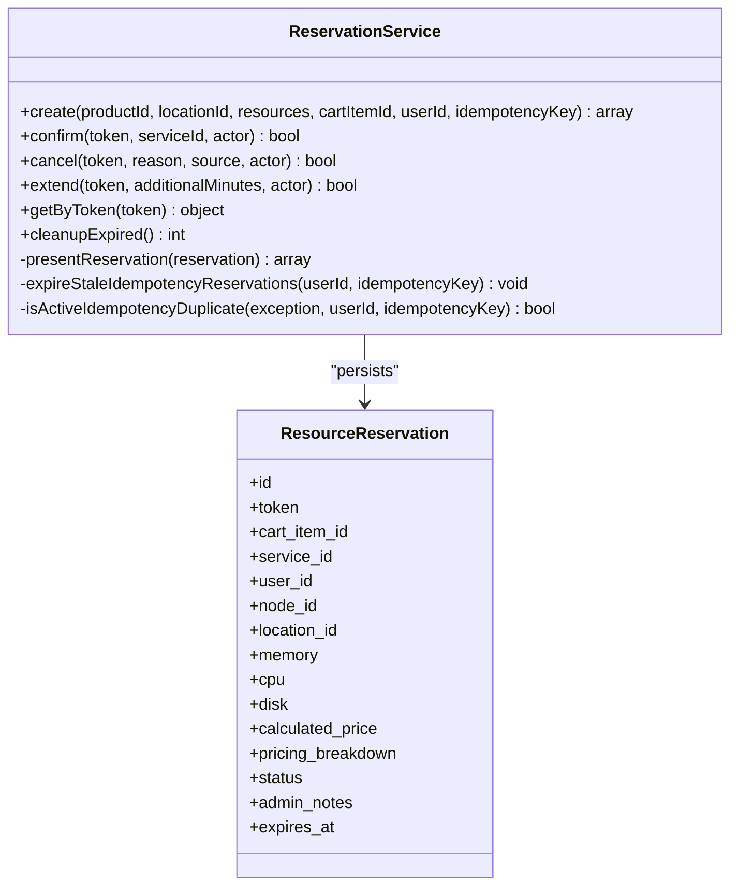

**Diagram sources**
- [ReservationService.php:43-141](https://github.com/ObsidianNetwork/dynamic-pterodactyl/blob/6b7f83bda6f7c3fe014d52428b31af1638daa6cc/Services/ReservationService.php#L43-L141)
- [ReservationService.php:166-199](https://github.com/ObsidianNetwork/dynamic-pterodactyl/blob/6b7f83bda6f7c3fe014d52428b31af1638daa6cc/Services/ReservationService.php#L166-L199)
- [ReservationService.php:208-241](https://github.com/ObsidianNetwork/dynamic-pterodactyl/blob/6b7f83bda6f7c3fe014d52428b31af1638daa6cc/Services/ReservationService.php#L208-L241)
- [ReservationService.php:250-281](https://github.com/ObsidianNetwork/dynamic-pterodactyl/blob/6b7f83bda6f7c3fe014d52428b31af1638daa6cc/Services/ReservationService.php#L250-L281)
- [ReservationService.php:387-405](https://github.com/ObsidianNetwork/dynamic-pterodactyl/blob/6b7f83bda6f7c3fe014d52428b31af1638daa6cc/Services/ReservationService.php#L387-L405)
- [ResourceReservation.php:10-65](https://github.com/ObsidianNetwork/dynamic-pterodactyl/blob/6b7f83bda6f7c3fe014d52428b31af1638daa6cc/Models/ResourceReservation.php#L10-L65)

**Section sources**
- [ReservationService.php:43-141](https://github.com/ObsidianNetwork/dynamic-pterodactyl/blob/6b7f83bda6f7c3fe014d52428b31af1638daa6cc/Services/ReservationService.php#L43-L141)
- [ReservationService.php:166-199](https://github.com/ObsidianNetwork/dynamic-pterodactyl/blob/6b7f83bda6f7c3fe014d52428b31af1638daa6cc/Services/ReservationService.php#L166-L199)
- [ReservationService.php:208-241](https://github.com/ObsidianNetwork/dynamic-pterodactyl/blob/6b7f83bda6f7c3fe014d52428b31af1638daa6cc/Services/ReservationService.php#L208-L241)
- [ReservationService.php:250-281](https://github.com/ObsidianNetwork/dynamic-pterodactyl/blob/6b7f83bda6f7c3fe014d52428b31af1638daa6cc/Services/ReservationService.php#L250-L281)
- [ReservationService.php:387-405](https://github.com/ObsidianNetwork/dynamic-pterodactyl/blob/6b7f83bda6f7c3fe014d52428b31af1638daa6cc/Services/ReservationService.php#L387-L405)
- [ResourceReservation.php:10-65](https://github.com/ObsidianNetwork/dynamic-pterodactyl/blob/6b7f83bda6f7c3fe014d52428b31af1638daa6cc/Models/ResourceReservation.php#L10-L65)

### ResourceCalculationService: Real-Time Availability
Responsibilities:
- Provides real-time availability by querying Pterodactyl API for nodes and servers.
- Aggregates allocated resources and subtracts pending reservations to compute available capacity.
- Verifies availability at payment time to ensure resources remain free before confirming.

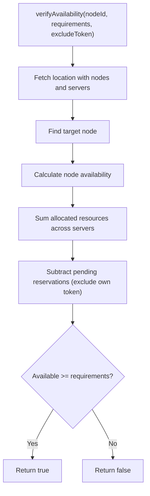

**Diagram sources**
- [ResourceCalculationService.php:198-214](https://github.com/ObsidianNetwork/dynamic-pterodactyl/blob/6b7f83bda6f7c3fe014d52428b31af1638daa6cc/Services/ResourceCalculationService.php#L198-L214)
- [ResourceCalculationService.php:227-257](https://github.com/ObsidianNetwork/dynamic-pterodactyl/blob/6b7f83bda6f7c3fe014d52428b31af1638daa6cc/Services/ResourceCalculationService.php#L227-L257)
- [ResourceCalculationService.php:500-522](https://github.com/ObsidianNetwork/dynamic-pterodactyl/blob/6b7f83bda6f7c3fe014d52428b31af1638daa6cc/Services/ResourceCalculationService.php#L500-L522)

**Section sources**
- [ResourceCalculationService.php:198-214](https://github.com/ObsidianNetwork/dynamic-pterodactyl/blob/6b7f83bda6f7c3fe014d52428b31af1638daa6cc/Services/ResourceCalculationService.php#L198-L214)
- [ResourceCalculationService.php:227-257](https://github.com/ObsidianNetwork/dynamic-pterodactyl/blob/6b7f83bda6f7c3fe014d52428b31af1638daa6cc/Services/ResourceCalculationService.php#L227-L257)
- [ResourceCalculationService.php:500-522](https://github.com/ObsidianNetwork/dynamic-pterodactyl/blob/6b7f83bda6f7c3fe014d52428b31af1638daa6cc/Services/ResourceCalculationService.php#L500-L522)

### Audit Logging
All critical reservation actions are audited via ReservationService’s safeAudit helper, which uses AuditLogService to persist changes with user context and request metadata.

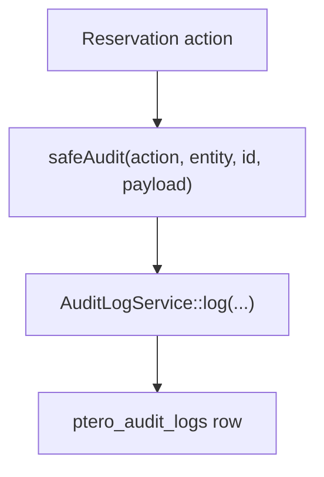

**Diagram sources**
- [ReservationService.php:102-113](https://github.com/ObsidianNetwork/dynamic-pterodactyl/blob/6b7f83bda6f7c3fe014d52428b31af1638daa6cc/Services/ReservationService.php#L102-L113)
- [ReservationService.php:191-196](https://github.com/ObsidianNetwork/dynamic-pterodactyl/blob/6b7f83bda6f7c3fe014d52428b31af1638daa6cc/Services/ReservationService.php#L191-L196)
- [ReservationService.php:233-238](https://github.com/ObsidianNetwork/dynamic-pterodactyl/blob/6b7f83bda6f7c3fe014d52428b31af1638daa6cc/Services/ReservationService.php#L233-L238)
- [ReservationService.php:272-278](https://github.com/ObsidianNetwork/dynamic-pterodactyl/blob/6b7f83bda6f7c3fe014d52428b31af1638daa6cc/Services/ReservationService.php#L272-L278)
- [ReservationService.php:397-402](https://github.com/ObsidianNetwork/dynamic-pterodactyl/blob/6b7f83bda6f7c3fe014d52428b31af1638daa6cc/Services/ReservationService.php#L397-L402)
- [AuditLogService.php:15-41](https://github.com/ObsidianNetwork/dynamic-pterodactyl/blob/6b7f83bda6f7c3fe014d52428b31af1638daa6cc/Services/AuditLogService.php#L15-L41)

**Section sources**
- [AuditLogService.php:15-41](https://github.com/ObsidianNetwork/dynamic-pterodactyl/blob/6b7f83bda6f7c3fe014d52428b31af1638daa6cc/Services/AuditLogService.php#L15-L41)

## Dependency Analysis
The extension depends on Paymenter core events and services, and integrates with Pterodactyl for real-time availability.

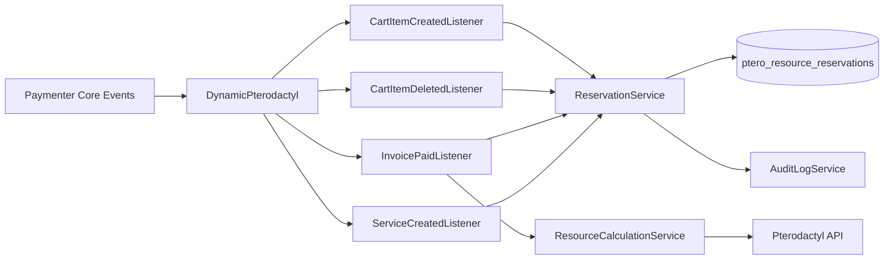

**Diagram sources**
- [DynamicPterodactyl.php:132-145](https://github.com/ObsidianNetwork/dynamic-pterodactyl/blob/6b7f83bda6f7c3fe014d52428b31af1638daa6cc/DynamicPterodactyl.php#L132-L145)
- [ReservationService.php:43-141](https://github.com/ObsidianNetwork/dynamic-pterodactyl/blob/6b7f83bda6f7c3fe014d52428b31af1638daa6cc/Services/ReservationService.php#L43-L141)
- [ResourceCalculationService.php:198-214](https://github.com/ObsidianNetwork/dynamic-pterodactyl/blob/6b7f83bda6f7c3fe014d52428b31af1638daa6cc/Services/ResourceCalculationService.php#L198-L214)

**Section sources**
- [DynamicPterodactyl.php:132-145](https://github.com/ObsidianNetwork/dynamic-pterodactyl/blob/6b7f83bda6f7c3fe014d52428b31af1638daa6cc/DynamicPterodactyl.php#L132-L145)

## Performance Considerations
- Pessimistic locking: Reservation creation locks pending reservations per location to prevent races.
- Retry on deadlock: Transactions retry up to five times to handle transient deadlocks.
- Real-time availability: ResourceCalculationService queries Pterodactyl directly; no caching to ensure accuracy.
- Batched API calls: buildClusterSnapshot batches node and server queries to reduce overhead.
- Scheduled cleanup: Expired reservations are marked every minute to keep dashboards accurate and preserve TTL guarantees.

[No sources needed since this section provides general guidance]

## Troubleshooting Guide
Common issues and diagnostics:
- Missing dynamic slider options: If a product lacks dynamic_slider config options, no reservation is created. Check product configuration.
- Missing location: Ensure location is provided via checkout_config or config_options; otherwise reservation creation is skipped.
- No node available: Node selection fails if no node meets resource requirements; review capacity and allocation.
- Resources unavailable at payment: Availability verification fails; check for other pending reservations or capacity changes. Shortfall notifications are triggered.
- State drift: Reservation cannot be confirmed because it was cancelled or expired between verification and confirmation; investigate timing and TTL settings.
- API connectivity: Pterodactyl API failures return degraded snapshots or exceptions; verify credentials and network connectivity.

Operational checks:
- Verify scheduled jobs are running for cleanup and capacity alerts.
- Review audit logs for reservation lifecycle events.
- Inspect reservation statuses and expiration timestamps.

**Section sources**
- [CartItemCreatedListener.php:13-87](https://github.com/ObsidianNetwork/dynamic-pterodactyl/blob/6b7f83bda6f7c3fe014d52428b31af1638daa6cc/Listeners/CartItemCreatedListener.php#L13-L87)
- [InvoicePaidListener.php:14-133](https://github.com/ObsidianNetwork/dynamic-pterodactyl/blob/6b7f83bda6f7c3fe014d52428b31af1638daa6cc/Listeners/InvoicePaidListener.php#L14-L133)
- [ReservationService.php:387-405](https://github.com/ObsidianNetwork/dynamic-pterodactyl/blob/6b7f83bda6f7c3fe014d52428b31af1638daa6cc/Services/ReservationService.php#L387-L405)
- [ResourceCalculationService.php:158-195](https://github.com/ObsidianNetwork/dynamic-pterodactyl/blob/6b7f83bda6f7c3fe014d52428b31af1638daa6cc/Services/ResourceCalculationService.php#L158-L195)

## Conclusion
The extension implements a robust, event-driven checkout flow that reserves resources during cart operations, confirms them upon payment with real-time availability checks, and maintains comprehensive audit trails. Concurrency is handled through pessimistic locking and retries, while scheduled tasks ensure data consistency. This design balances reliability, performance, and observability across the payment and provisioning workflow.

[No sources needed since this section summarizes without analyzing specific files]
