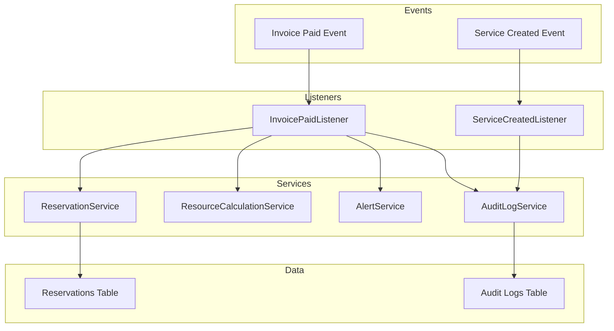
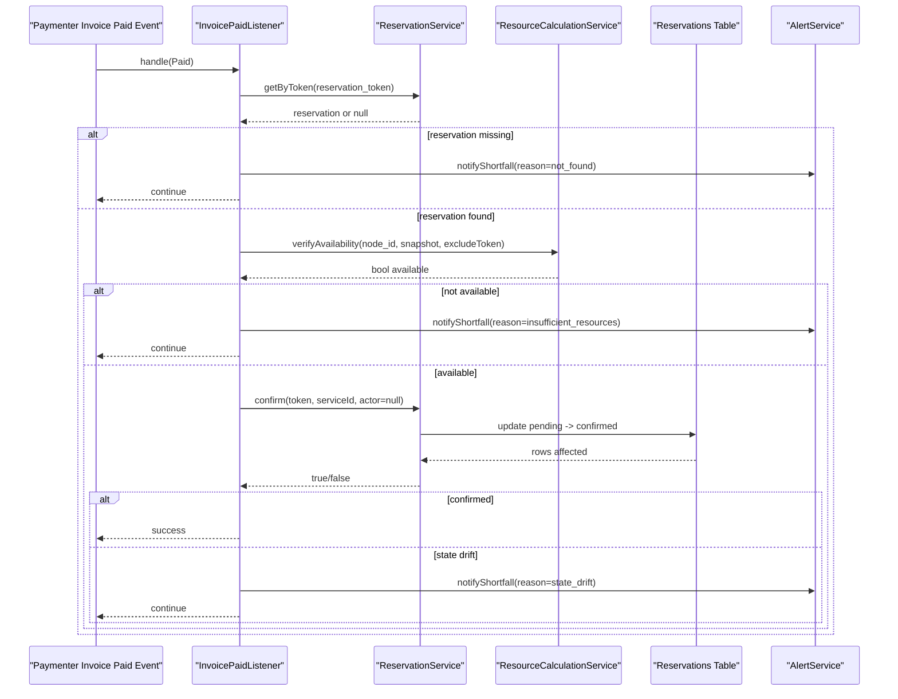
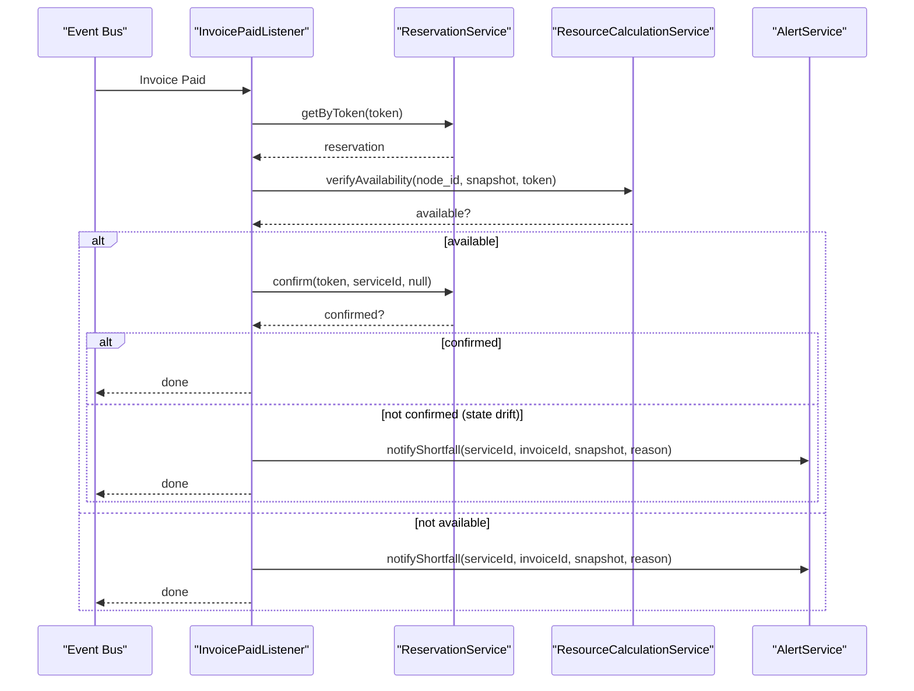
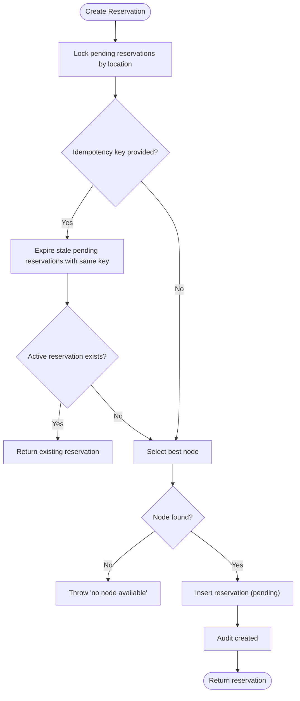
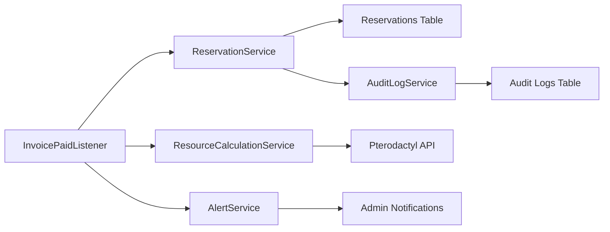

# Payment and Service Events

> **Preserved Qoder snapshot.** This deep-dive page is retained so the earlier Wiki work and its source trail are not lost. For the reconciled implementation, [[Architecture Overview|Architecture-Overview]] is canonical; references below to retired controllers, listeners, services, or API shapes are historical.

<cite>
**Referenced Files in This Document**
- [InvoicePaidListener.php](https://github.com/ObsidianNetwork/dynamic-pterodactyl/blob/6b7f83bda6f7c3fe014d52428b31af1638daa6cc/Listeners/InvoicePaidListener.php)
- [ServiceCreatedListener.php](https://github.com/ObsidianNetwork/dynamic-pterodactyl/blob/6b7f83bda6f7c3fe014d52428b31af1638daa6cc/Listeners/ServiceCreatedListener.php)
- [ReservationService.php](https://github.com/ObsidianNetwork/dynamic-pterodactyl/blob/6b7f83bda6f7c3fe014d52428b31af1638daa6cc/Services/ReservationService.php)
- [ResourceCalculationService.php](https://github.com/ObsidianNetwork/dynamic-pterodactyl/blob/6b7f83bda6f7c3fe014d52428b31af1638daa6cc/Services/ResourceCalculationService.php)
- [AlertService.php](https://github.com/ObsidianNetwork/dynamic-pterodactyl/blob/6b7f83bda6f7c3fe014d52428b31af1638daa6cc/Services/AlertService.php)
- [AuditLogService.php](https://github.com/ObsidianNetwork/dynamic-pterodactyl/blob/6b7f83bda6f7c3fe014d52428b31af1638daa6cc/Services/AuditLogService.php)
- [AuditsExtensionActions.php](https://github.com/ObsidianNetwork/dynamic-pterodactyl/blob/6b7f83bda6f7c3fe014d52428b31af1638daa6cc/Services/Concerns/AuditsExtensionActions.php)
- [ResourceReservation.php](https://github.com/ObsidianNetwork/dynamic-pterodactyl/blob/6b7f83bda6f7c3fe014d52428b31af1638daa6cc/Models/ResourceReservation.php)
- [AuditLog.php](https://github.com/ObsidianNetwork/dynamic-pterodactyl/blob/6b7f83bda6f7c3fe014d52428b31af1638daa6cc/Models/AuditLog.php)
- [ReservationController.php](https://github.com/ObsidianNetwork/dynamic-pterodactyl/blob/6b7f83bda6f7c3fe014d52428b31af1638daa6cc/Http/Controllers/Api/ReservationController.php)
- [2025_01_01_000001_create_ptero_resource_reservations_table.php](https://github.com/ObsidianNetwork/dynamic-pterodactyl/blob/6b7f83bda6f7c3fe014d52428b31af1638daa6cc/database/migrations/2025_01_01_000001_create_ptero_resource_reservations_table.php)
- [2026_04_23_000001_add_idempotency_key_to_ptero_resource_reservations.php](https://github.com/ObsidianNetwork/dynamic-pterodactyl/blob/6b7f83bda6f7c3fe014d52428b31af1638daa6cc/database/migrations/2026_04_23_000001_add_idempotency_key_to_ptero_resource_reservations.php)
- [2025_01_01_000003_create_ptero_audit_logs_table.php](https://github.com/ObsidianNetwork/dynamic-pterodactyl/blob/6b7f83bda6f7c3fe014d52428b31af1638daa6cc/database/migrations/2025_01_01_000003_create_ptero_audit_logs_table.php)
</cite>

## Table of Contents
1. [Introduction](#introduction)
2. [Project Structure](#project-structure)
3. [Core Components](#core-components)
4. [Architecture Overview](#architecture-overview)
5. [Detailed Component Analysis](#detailed-component-analysis)
6. [Dependency Analysis](#dependency-analysis)
7. [Performance Considerations](#performance-considerations)
8. [Troubleshooting Guide](#troubleshooting-guide)
9. [Conclusion](#conclusion)

## Introduction
This document explains how payment and service lifecycle events are handled to reserve, confirm, and provision resources for Pterodactyl services. It focuses on:
- How InvoicePaid events confirm resource reservations by performing a final real-time availability check and transitioning pending reservations to confirmed.
- How ServiceCreated events create audit trail entries linking reservations to provisioned services.
- The confirmation process, including capacity verification, state transitions, and failure handling with alerts.
- Idempotency and retry mechanisms that protect against duplicate or retried operations during reservation creation and confirmation.

The system enforces a strict reservation lifecycle: pending → confirmed | expired | cancelled. Reservations use pessimistic database locking with deadlock retries, and all external availability checks call the Pterodactyl API in real time without caching.

## Project Structure
At a high level, event listeners react to domain events, delegate to services for business logic, and persist state changes through models and migrations. Audit logging is used throughout to record important actions.

**Diagram sources**
- [InvoicePaidListener.php:14-133](https://github.com/ObsidianNetwork/dynamic-pterodactyl/blob/6b7f83bda6f7c3fe014d52428b31af1638daa6cc/Listeners/InvoicePaidListener.php#L14-L133)
- [ServiceCreatedListener.php:10-31](https://github.com/ObsidianNetwork/dynamic-pterodactyl/blob/6b7f83bda6f7c3fe014d52428b31af1638daa6cc/Listeners/ServiceCreatedListener.php#L10-L31)
- [ReservationService.php:43-199](https://github.com/ObsidianNetwork/dynamic-pterodactyl/blob/6b7f83bda6f7c3fe014d52428b31af1638daa6cc/Services/ReservationService.php#L43-L199)
- [ResourceCalculationService.php:200-214](https://github.com/ObsidianNetwork/dynamic-pterodactyl/blob/6b7f83bda6f7c3fe014d52428b31af1638daa6cc/Services/ResourceCalculationService.php#L200-L214)
- [AlertService.php:328-361](https://github.com/ObsidianNetwork/dynamic-pterodactyl/blob/6b7f83bda6f7c3fe014d52428b31af1638daa6cc/Services/AlertService.php#L328-L361)
- [AuditLogService.php:15-41](https://github.com/ObsidianNetwork/dynamic-pterodactyl/blob/6b7f83bda6f7c3fe014d52428b31af1638daa6cc/Services/AuditLogService.php#L15-L41)

**Section sources**
- [InvoicePaidListener.php:14-133](https://github.com/ObsidianNetwork/dynamic-pterodactyl/blob/6b7f83bda6f7c3fe014d52428b31af1638daa6cc/Listeners/InvoicePaidListener.php#L14-L133)
- [ServiceCreatedListener.php:10-31](https://github.com/ObsidianNetwork/dynamic-pterodactyl/blob/6b7f83bda6f7c3fe014d52428b31af1638daa6cc/Listeners/ServiceCreatedListener.php#L10-L31)
- [ReservationService.php:43-199](https://github.com/ObsidianNetwork/dynamic-pterodactyl/blob/6b7f83bda6f7c3fe014d52428b31af1638daa6cc/Services/ReservationService.php#L43-L199)
- [ResourceCalculationService.php:200-214](https://github.com/ObsidianNetwork/dynamic-pterodactyl/blob/6b7f83bda6f7c3fe014d52428b31af1638daa6cc/Services/ResourceCalculationService.php#L200-L214)
- [AlertService.php:328-361](https://github.com/ObsidianNetwork/dynamic-pterodactyl/blob/6b7f83bda6f7c3fe014d52428b31af1638daa6cc/Services/AlertService.php#L328-L361)
- [AuditLogService.php:15-41](https://github.com/ObsidianNetwork/dynamic-pterodactyl/blob/6b7f83bda6f7c3fe014d52428b31af1638daa6cc/Services/AuditLogService.php#L15-L41)

## Core Components
- InvoicePaidListener: Orchestrates post-payment confirmation by retrieving the reservation token from the paid service, verifying current availability, confirming the reservation, and alerting on failures.
- ReservationService: Provides idempotent reservation creation with pessimistic locking and deadlock retries, plus confirm/cancel/extend operations and cleanup of expired reservations.
- ResourceCalculationService: Performs real-time availability checks against the Pterodactyl API, accounting for allocated servers and pending reservations.
- AlertService: Notifies administrators when capacity is insufficient or when state drift prevents confirmation after payment.
- AuditLogService and AuditsExtensionActions: Record auditable actions across the system with safe error handling so audit failures do not break core flows.
- Models and Migrations: Define the reservation entity, its lifecycle states, indexes, and idempotency constraints; define the audit log schema.

Key responsibilities:
- Confirm only pending, non-expired reservations.
- Re-check availability immediately before confirmation to avoid race conditions.
- Log and alert on any failure path (missing reservation, insufficient resources, state drift).
- Ensure idempotent reservation creation via unique active idempotency keys.

**Section sources**
- [InvoicePaidListener.php:14-133](https://github.com/ObsidianNetwork/dynamic-pterodactyl/blob/6b7f83bda6f7c3fe014d52428b31af1638daa6cc/Listeners/InvoicePaidListener.php#L14-L133)
- [ReservationService.php:43-199](https://github.com/ObsidianNetwork/dynamic-pterodactyl/blob/6b7f83bda6f7c3fe014d52428b31af1638daa6cc/Services/ReservationService.php#L43-L199)
- [ResourceCalculationService.php:200-214](https://github.com/ObsidianNetwork/dynamic-pterodactyl/blob/6b7f83bda6f7c3fe014d52428b31af1638daa6cc/Services/ResourceCalculationService.php#L200-L214)
- [AlertService.php:328-361](https://github.com/ObsidianNetwork/dynamic-pterodactyl/blob/6b7f83bda6f7c3fe014d52428b31af1638daa6cc/Services/AlertService.php#L328-L361)
- [AuditLogService.php:15-41](https://github.com/ObsidianNetwork/dynamic-pterodactyl/blob/6b7f83bda6f7c3fe014d52428b31af1638daa6cc/Services/AuditLogService.php#L15-L41)
- [AuditsExtensionActions.php:10-32](https://github.com/ObsidianNetwork/dynamic-pterodactyl/blob/6b7f83bda6f7c3fe014d52428b31af1638daa6cc/Services/Concerns/AuditsExtensionActions.php#L10-L32)
- [ResourceReservation.php:10-65](https://github.com/ObsidianNetwork/dynamic-pterodactyl/blob/6b7f83bda6f7c3fe014d52428b31af1638daa6cc/Models/ResourceReservation.php#L10-L65)
- [2025_01_01_000001_create_ptero_resource_reservations_table.php:11-78](https://github.com/ObsidianNetwork/dynamic-pterodactyl/blob/6b7f83bda6f7c3fe014d52428b31af1638daa6cc/database/migrations/2025_01_01_000001_create_ptero_resource_reservations_table.php#L11-L78)
- [2026_04_23_000001_add_idempotency_key_to_ptero_resource_reservations.php:9-20](https://github.com/ObsidianNetwork/dynamic-pterodactyl/blob/6b7f83bda6f7c3fe014d52428b31af1638daa6cc/database/migrations/2026_04_23_000001_add_idempotency_key_to_ptero_resource_reservations.php#L9-L20)
- [2025_01_01_000003_create_ptero_audit_logs_table.php:11-47](https://github.com/ObsidianNetwork/dynamic-pterodactyl/blob/6b7f83bda6f7c3fe014d52428b31af1638daa6cc/database/migrations/2025_01_01_000003_create_ptero_audit_logs_table.php#L11-L47)

## Architecture Overview
The payment-to-provisioning workflow uses event-driven processing with strong consistency guarantees at critical points.

**Diagram sources**
- [InvoicePaidListener.php:14-133](https://github.com/ObsidianNetwork/dynamic-pterodactyl/blob/6b7f83bda6f7c3fe014d52428b31af1638daa6cc/Listeners/InvoicePaidListener.php#L14-L133)
- [ReservationService.php:166-199](https://github.com/ObsidianNetwork/dynamic-pterodactyl/blob/6b7f83bda6f7c3fe014d52428b31af1638daa6cc/Services/ReservationService.php#L166-L199)
- [ResourceCalculationService.php:200-214](https://github.com/ObsidianNetwork/dynamic-pterodactyl/blob/6b7f83bda6f7c3fe014d52428b31af1638daa6cc/Services/ResourceCalculationService.php#L200-L214)
- [AlertService.php:328-361](https://github.com/ObsidianNetwork/dynamic-pterodactyl/blob/6b7f83bda6f7c3fe014d52428b31af1638daa6cc/Services/AlertService.php#L328-L361)

## Detailed Component Analysis

### InvoicePaidListener: Final Availability Check and Confirmation
Responsibilities:
- Extract the reservation token from the paid service’s properties.
- Retrieve the reservation and build a resource snapshot.
- Perform a final availability verification using the node and requirements.
- Confirm the reservation if available; otherwise, alert administrators.
- Handle state drift where the reservation is no longer pending between checks.

Key behaviors:
- If the reservation is missing, logs a warning and continues.
- If resources are unavailable, logs an error and sends a shortfall notification.
- On successful confirmation, logs success.
- On confirmation failure due to state drift, logs a warning and sends a shortfall notification with the current status.

Failure handling:
- All exceptions are caught and logged to ensure invoice processing continues even if one item fails.

**Section sources**
- [InvoicePaidListener.php:14-133](https://github.com/ObsidianNetwork/dynamic-pterodactyl/blob/6b7f83bda6f7c3fe014d52428b31af1638daa6cc/Listeners/InvoicePaidListener.php#L14-L133)

#### Sequence: Payment Confirmation Flow

**Diagram sources**
- [InvoicePaidListener.php:14-133](https://github.com/ObsidianNetwork/dynamic-pterodactyl/blob/6b7f83bda6f7c3fe014d52428b31af1638daa6cc/Listeners/InvoicePaidListener.php#L14-L133)
- [ReservationService.php:166-199](https://github.com/ObsidianNetwork/dynamic-pterodactyl/blob/6b7f83bda6f7c3fe014d52428b31af1638daa6cc/Services/ReservationService.php#L166-L199)
- [ResourceCalculationService.php:200-214](https://github.com/ObsidianNetwork/dynamic-pterodactyl/blob/6b7f83bda6f7c3fe014d52428b31af1638daa6cc/Services/ResourceCalculationService.php#L200-L214)
- [AlertService.php:328-361](https://github.com/ObsidianNetwork/dynamic-pterodactyl/blob/6b7f83bda6f7c3fe014d52428b31af1638daa6cc/Services/AlertService.php#L328-L361)

### ReservationService: Idempotent Creation and State Transitions
Responsibilities:
- Create reservations with pessimistic locking and deadlock retries.
- Enforce idempotency via unique active idempotency keys per user context.
- Confirm, cancel, extend, and clean up expired reservations.
- Persist audit events for key actions.

Idempotency details:
- Before creating, stale pending reservations with the same idempotency key are expired.
- If an existing active reservation exists (pending non-expired or confirmed), it is returned instead of creating a duplicate.
- Database-level unique constraint on active idempotency keys protects against race conditions.
- Duplicate key exceptions are detected and resolved by returning the existing reservation.

State transitions:
- confirm updates pending, non-expired reservations to confirmed and records an audit entry.
- cancel updates pending reservations to cancelled and records an audit entry.
- extend updates TTL for pending reservations and records an audit entry.
- cleanupExpired marks overdue pending reservations as expired and records a batch audit entry.

Complexity considerations:
- create() uses a transaction with lockForUpdate on pending reservations within the target location to prevent concurrent allocations.
- Deadlock scenarios are retried up to five times.

**Section sources**
- [ReservationService.php:43-199](https://github.com/ObsidianNetwork/dynamic-pterodactyl/blob/6b7f83bda6f7c3fe014d52428b31af1638daa6cc/Services/ReservationService.php#L43-L199)
- [ReservationService.php:208-281](https://github.com/ObsidianNetwork/dynamic-pterodactyl/blob/6b7f83bda6f7c3fe014d52428b31af1638daa6cc/Services/ReservationService.php#L208-L281)
- [ReservationService.php:387-405](https://github.com/ObsidianNetwork/dynamic-pterodactyl/blob/6b7f83bda6f7c3fe014d52428b31af1638daa6cc/Services/ReservationService.php#L387-L405)
- [ReservationService.php:431-452](https://github.com/ObsidianNetwork/dynamic-pterodactyl/blob/6b7f83bda6f7c3fe014d52428b31af1638daa6cc/Services/ReservationService.php#L431-L452)
- [2026_04_23_000001_add_idempotency_key_to_ptero_resource_reservations.php:9-20](https://github.com/ObsidianNetwork/dynamic-pterodactyl/blob/6b7f83bda6f7c3fe014d52428b31af1638daa6cc/database/migrations/2026_04_23_000001_add_idempotency_key_to_ptero_resource_reservations.php#L9-L20)

#### Flowchart: Reservation Creation with Idempotency

**Diagram sources**
- [ReservationService.php:43-141](https://github.com/ObsidianNetwork/dynamic-pterodactyl/blob/6b7f83bda6f7c3fe014d52428b31af1638daa6cc/Services/ReservationService.php#L43-L141)
- [ReservationService.php:431-452](https://github.com/ObsidianNetwork/dynamic-pterodactyl/blob/6b7f83bda6f7c3fe014d52428b31af1638daa6cc/Services/ReservationService.php#L431-L452)

### ResourceCalculationService: Real-Time Capacity Verification
Responsibilities:
- Provide real-time availability for locations and nodes by querying the Pterodactyl API.
- Aggregate server allocations and subtract pending reservations to compute available resources.
- Support verification for a specific node and requirements set.

Verification behavior:
- verifyAvailability fetches the node’s location, computes node availability including pending reservations, and compares against required memory, CPU, and disk.
- Pending reservations are excluded from availability calculations when checking the same token to avoid self-blocking.

API interaction:
- Uses HTTP client with short timeouts and retries only on connection errors.
- Returns degraded snapshots when the API is unavailable for cluster-wide queries, but availability checks remain strict.

**Section sources**
- [ResourceCalculationService.php:200-214](https://github.com/ObsidianNetwork/dynamic-pterodactyl/blob/6b7f83bda6f7c3fe014d52428b31af1638daa6cc/Services/ResourceCalculationService.php#L200-L214)
- [ResourceCalculationService.php:227-257](https://github.com/ObsidianNetwork/dynamic-pterodactyl/blob/6b7f83bda6f7c3fe014d52428b31af1638daa6cc/Services/ResourceCalculationService.php#L227-L257)
- [ResourceCalculationService.php:452-498](https://github.com/ObsidianNetwork/dynamic-pterodactyl/blob/6b7f83bda6f7c3fe014d52428b31af1638daa6cc/Services/ResourceCalculationService.php#L452-L498)

### AlertService: Shortfall Notifications
Responsibilities:
- Notify administrators when a paid invoice cannot be fulfilled due to insufficient resources or state drift.
- Send notifications via configured channels and log delivery outcomes.

Notification flow:
- Collect admin recipients.
- For each recipient, send a reservation shortfall notification with service, invoice, snapshot, and reason.
- Catch and log delivery failures without aborting the caller.

**Section sources**
- [AlertService.php:328-361](https://github.com/ObsidianNetwork/dynamic-pterodactyl/blob/6b7f83bda6f7c3fe014d52428b31af1638daa6cc/Services/AlertService.php#L328-L361)

### ServiceCreatedListener: Audit Trail Linking
Responsibilities:
- When a service is created, read the associated reservation token from service properties.
- Log service creation with reservation linkage for tracking purposes.

Note:
- The actual confirmation should already have occurred via InvoicePaidListener; this listener primarily supports observability and audit trails.

**Section sources**
- [ServiceCreatedListener.php:10-31](https://github.com/ObsidianNetwork/dynamic-pterodactyl/blob/6b7f83bda6f7c3fe014d52428b31af1638daa6cc/Listeners/ServiceCreatedListener.php#L10-L31)

### Audit Logging: Persistent Action History
Responsibilities:
- Record actions such as reservation creation, confirmation, cancellation, extension, and batch expiration.
- Capture user context, request metadata, and change details.

Safety:
- Auditing is wrapped in a try-catch to ensure audit failures do not disrupt core flows.
- Failures are logged and reported safely.

**Section sources**
- [AuditLogService.php:15-41](https://github.com/ObsidianNetwork/dynamic-pterodactyl/blob/6b7f83bda6f7c3fe014d52428b31af1638daa6cc/Services/AuditLogService.php#L15-L41)
- [AuditsExtensionActions.php:10-32](https://github.com/ObsidianNetwork/dynamic-pterodactyl/blob/6b7f83bda6f7c3fe014d52428b31af1638daa6cc/Services/Concerns/AuditsExtensionActions.php#L10-L32)
- [2025_01_01_000003_create_ptero_audit_logs_table.php:11-47](https://github.com/ObsidianNetwork/dynamic-pterodactyl/blob/6b7f83bda6f7c3fe014d52428b31af1638daa6cc/database/migrations/2025_01_01_000003_create_ptero_audit_logs_table.php#L11-L47)

### Data Model and Lifecycle
Reservations track:
- Token, idempotency key, user, node, location, resource amounts, pricing snapshot, status, notes, and expiry.
- Status values include pending, confirmed, expired, cancelled, and released (though released was removed from runtime usage).

Indexes support efficient queries for cleanup, location-based locking, and filtering.

**Section sources**
- [ResourceReservation.php:10-65](https://github.com/ObsidianNetwork/dynamic-pterodactyl/blob/6b7f83bda6f7c3fe014d52428b31af1638daa6cc/Models/ResourceReservation.php#L10-L65)
- [2025_01_01_000001_create_ptero_resource_reservations_table.php:11-78](https://github.com/ObsidianNetwork/dynamic-pterodactyl/blob/6b7f83bda6f7c3fe014d52428b31af1638daa6cc/database/migrations/2025_01_01_000001_create_ptero_resource_reservations_table.php#L11-L78)

## Dependency Analysis
The following diagram shows how components depend on each other during payment confirmation and provisioning.

**Diagram sources**
- [InvoicePaidListener.php:14-133](https://github.com/ObsidianNetwork/dynamic-pterodactyl/blob/6b7f83bda6f7c3fe014d52428b31af1638daa6cc/Listeners/InvoicePaidListener.php#L14-L133)
- [ReservationService.php:43-199](https://github.com/ObsidianNetwork/dynamic-pterodactyl/blob/6b7f83bda6f7c3fe014d52428b31af1638daa6cc/Services/ReservationService.php#L43-L199)
- [ResourceCalculationService.php:200-214](https://github.com/ObsidianNetwork/dynamic-pterodactyl/blob/6b7f83bda6f7c3fe014d52428b31af1638daa6cc/Services/ResourceCalculationService.php#L200-L214)
- [AlertService.php:328-361](https://github.com/ObsidianNetwork/dynamic-pterodactyl/blob/6b7f83bda6f7c3fe014d52428b31af1638daa6cc/Services/AlertService.php#L328-L361)
- [AuditLogService.php:15-41](https://github.com/ObsidianNetwork/dynamic-pterodactyl/blob/6b7f83bda6f7c3fe014d52428b31af1638daa6cc/Services/AuditLogService.php#L15-L41)

Coupling and cohesion:
- Listeners are thin orchestration layers delegating to focused services.
- Services encapsulate domain logic and external integrations.
- Data access is centralized in services with model classes providing structure.

Potential circular dependencies:
- None observed; dependencies are unidirectional from listeners to services to data/API.

External integration points:
- Pterodactyl API for real-time availability.
- Notification channels for alerts.

Interface contracts:
- verifyAvailability returns a boolean based on current node capacity.
- confirm returns a boolean indicating whether a pending reservation was successfully transitioned.

**Section sources**
- [InvoicePaidListener.php:14-133](https://github.com/ObsidianNetwork/dynamic-pterodactyl/blob/6b7f83bda6f7c3fe014d52428b31af1638daa6cc/Listeners/InvoicePaidListener.php#L14-L133)
- [ReservationService.php:43-199](https://github.com/ObsidianNetwork/dynamic-pterodactyl/blob/6b7f83bda6f7c3fe014d52428b31af1638daa6cc/Services/ReservationService.php#L43-L199)
- [ResourceCalculationService.php:200-214](https://github.com/ObsidianNetwork/dynamic-pterodactyl/blob/6b7f83bda6f7c3fe014d52428b31af1638daa6cc/Services/ResourceCalculationService.php#L200-L214)
- [AlertService.php:328-361](https://github.com/ObsidianNetwork/dynamic-pterodactyl/blob/6b7f83bda6f7c3fe014d52428b31af1638daa6cc/Services/AlertService.php#L328-L361)

## Performance Considerations
- Real-time availability checks: Every confirmation calls the Pterodactyl API to ensure accurate capacity. This avoids stale cache issues but introduces latency.
- Pessimistic locking: Reservation creation locks pending rows by location to prevent race conditions. Deadlocks are retried up to five times.
- Batch aggregation: Cluster snapshots aggregate node and location metrics efficiently, but availability verification remains targeted to the relevant node.
- Short timeouts and retries: API calls use short timeouts and retry only on transient connection errors to minimize blocking.

Recommendations:
- Monitor API response times and error rates during peak checkout periods.
- Tune reservation TTL to balance customer experience and resource holding costs.
- Use admin dashboards to review audit logs and alert delivery outcomes.

[No sources needed since this section provides general guidance]

## Troubleshooting Guide
Common issues and their indicators:
- Missing reservation after payment:
  - Symptom: Warning log indicating reservation not found for paid invoice.
  - Likely causes: Reservation expired or never created; incorrect token stored in service properties.
  - Actions: Verify service properties contain a valid reservation token; check reservation cleanup schedule.

- Insufficient resources at payment time:
  - Symptom: Error log indicating resources no longer available; shortfall notification sent.
  - Likely causes: Another allocation consumed capacity between reservation and payment; node maintenance or configuration changes.
  - Actions: Review alert notifications; consider increasing capacity or adjusting reservation TTL.

- State drift preventing confirmation:
  - Symptom: Warning log indicating reservation could not be confirmed; shortfall notification with reason including current status.
  - Likely causes: Reservation expired or was cancelled between availability check and confirmation.
  - Actions: Investigate timing; ensure customers complete payment within TTL; monitor cleanup jobs.

- Audit write failures:
  - Symptom: Warning about extension audit write failed.
  - Impact: Non-fatal; core flows continue.
  - Actions: Check database connectivity and permissions for audit logs table.

- Idempotency conflicts:
  - Symptom: Duplicate entry exception during reservation creation.
  - Resolution: System detects duplicates and returns the existing reservation; verify idempotency key usage in client requests.

Operational checks:
- Validate Pterodactyl API connectivity and credentials.
- Confirm alert recipients are configured for shortfall notifications.
- Review scheduled cleanup to ensure expired reservations are marked correctly.

**Section sources**
- [InvoicePaidListener.php:43-133](https://github.com/ObsidianNetwork/dynamic-pterodactyl/blob/6b7f83bda6f7c3fe014d52428b31af1638daa6cc/Listeners/InvoicePaidListener.php#L43-L133)
- [AlertService.php:328-361](https://github.com/ObsidianNetwork/dynamic-pterodactyl/blob/6b7f83bda6f7c3fe014d52428b31af1638daa6cc/Services/AlertService.php#L328-L361)
- [ReservationService.php:125-141](https://github.com/ObsidianNetwork/dynamic-pterodactyl/blob/6b7f83bda6f7c3fe014d52428b31af1638daa6cc/Services/ReservationService.php#L125-L141)
- [ReservationService.php:431-452](https://github.com/ObsidianNetwork/dynamic-pterodactyl/blob/6b7f83bda6f7c3fe014d52428b31af1638daa6cc/Services/ReservationService.php#L431-L452)
- [AuditsExtensionActions.php:10-32](https://github.com/ObsidianNetwork/dynamic-pterodactyl/blob/6b7f83bda6f7c3fe014d52428b31af1638daa6cc/Services/Concerns/AuditsExtensionActions.php#L10-L32)

## Conclusion
The payment and service event handling system ensures reliable reservation confirmation through real-time capacity verification, robust state transitions, and comprehensive auditing. Idempotency and retry mechanisms protect against duplicate operations and transient failures. Alerts provide visibility into capacity shortfalls and state drift, enabling timely operational intervention. The design emphasizes correctness and resilience while maintaining clear separation of concerns between event listeners, services, and data persistence.

[No sources needed since this section summarizes without analyzing specific files]