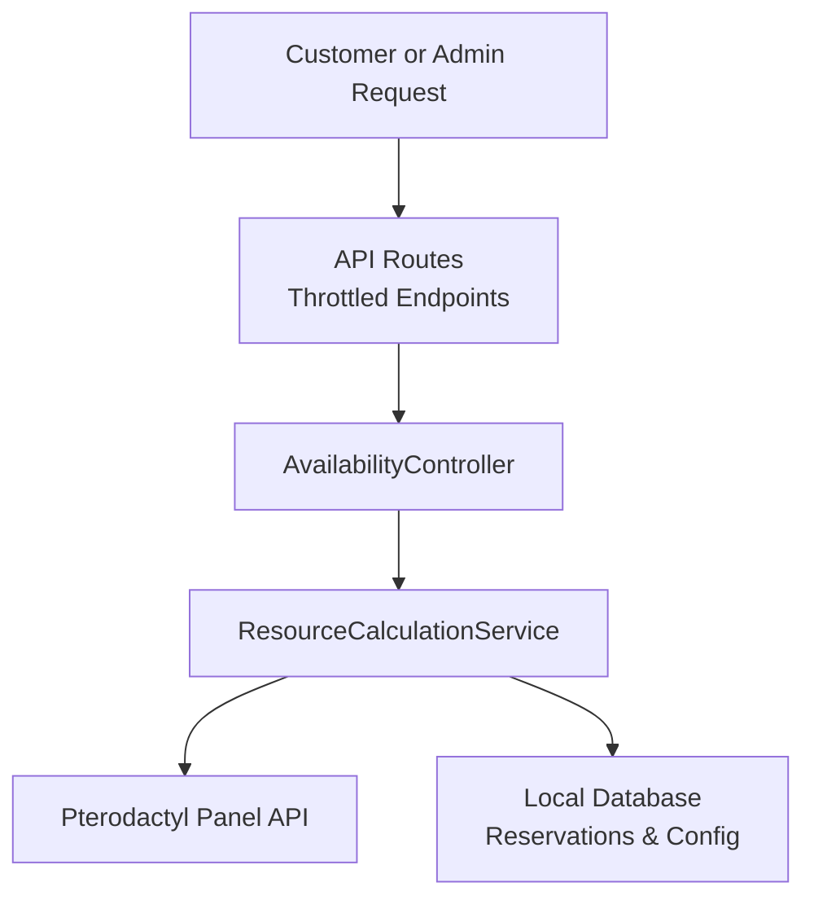
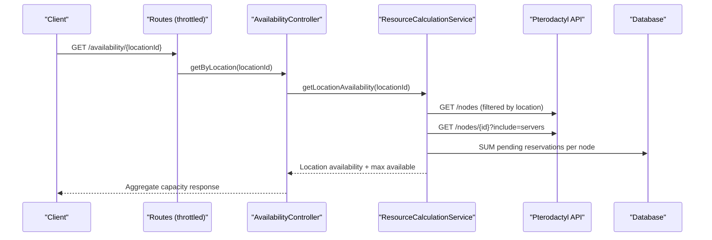
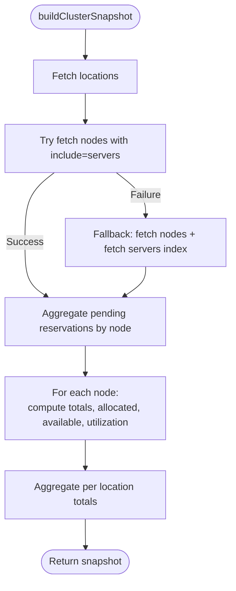
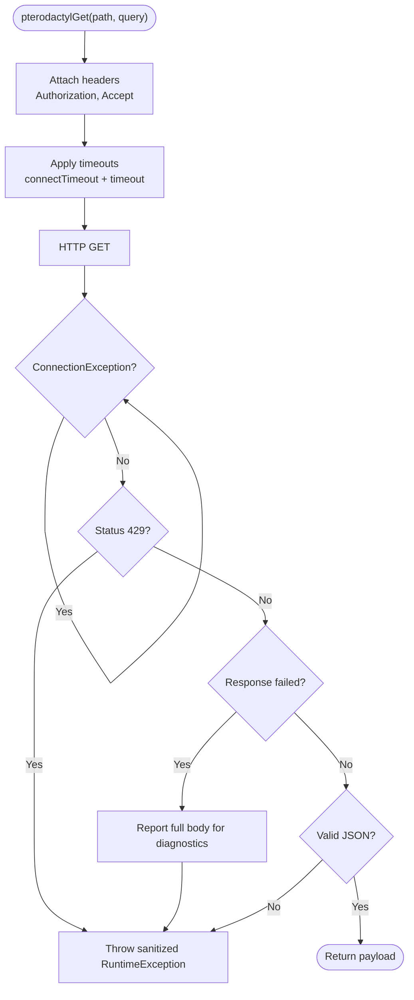
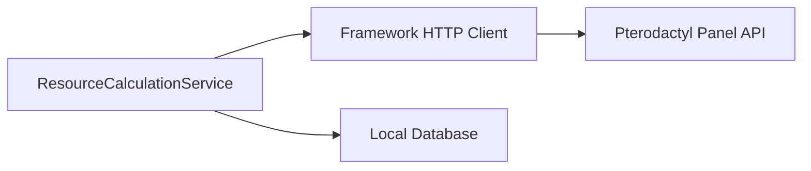

# Real-Time Integration Strategy

<cite>
**Referenced Files in This Document**
- [ResourceCalculationService.php](file://Services/ResourceCalculationService.php)
- [AvailabilityController.php](file://Http/Controllers/Api/AvailabilityController.php)
- [api.php](file://routes/api.php)
- [DynamicPterodactyl.php](file://DynamicPterodactyl.php)
- [ResourceCalculationServiceTest.php](file://tests/Unit/ResourceCalculationServiceTest.php)
- [08-ALGORITHMS.md](file://08-ALGORITHMS.md)
- [03-API.md](file://03-API.md)
</cite>

## Table of Contents
1. [Introduction](#introduction)
2. [Project Structure](#project-structure)
3. [Core Components](#core-components)
4. [Architecture Overview](#architecture-overview)
5. [Detailed Component Analysis](#detailed-component-analysis)
6. [Dependency Analysis](#dependency-analysis)
7. [Performance Considerations](#performance-considerations)
8. [Troubleshooting Guide](#troubleshooting-guide)
9. [Conclusion](#conclusion)

## Introduction
This document explains the real-time integration strategy with the Pterodactyl panel API used by this extension. The core architectural decision is to never cache Pterodactyl API responses and always fetch current utilization data directly. This avoids stale availability, eliminates cache invalidation complexity, and prevents overselling during checkout.

The service layer batches API calls efficiently while preserving accuracy, and error handling covers timeouts, authentication failures, rate limiting, malformed responses, and degraded cluster snapshots when the upstream panel is unavailable.

## Project Structure
The real-time integration spans a small set of focused components:
- Service layer for real-time resource calculation and batching
- API controllers that expose availability and admin-only node details
- Route registration and throttling to protect the Pterodactyl API budget
- Extension boot process wiring routes, views, listeners, and scheduled tasks

**Diagram sources**
- [api.php:17-25](file://routes/api.php#L17-L25)
- [AvailabilityController.php:22-51](file://Http/Controllers/Api/AvailabilityController.php#L22-L51)
- [ResourceCalculationService.php:26-67](file://Services/ResourceCalculationService.php#L26-L67)

**Section sources**
- [api.php:17-25](file://routes/api.php#L17-L25)
- [DynamicPterodactyl.php:96-127](file://DynamicPterodactyl.php#L96-L127)

## Core Components
- ResourceCalculationService: Centralizes all Pterodactyl API interactions, builds per-location and per-node availability, and constructs a full cluster snapshot without caching. It also implements robust HTTP retry, timeout, and error handling.
- AvailabilityController: Exposes customer-facing availability endpoints that return aggregate location capacity only; node-level detail is reserved for admin flows.
- Routes: Throttle availability and pricing endpoints to protect the Pterodactyl API budget and reduce load spikes.
- Extension Boot: Registers routes, views, event listeners, and scheduled cleanup/alerts.

Key responsibilities:
- Always read live state from Pterodactyl
- Batch reads to minimize API calls
- Preserve accuracy by including pending reservations
- Fail fast on authentication and rate-limit errors
- Return degraded snapshots when the panel is down

**Section sources**
- [ResourceCalculationService.php:10-21](file://Services/ResourceCalculationService.php#L10-L21)
- [ResourceCalculationService.php:26-67](file://Services/ResourceCalculationService.php#L26-L67)
- [ResourceCalculationService.php:69-141](file://Services/ResourceCalculationService.php#L69-L141)
- [AvailabilityController.php:22-51](file://Http/Controllers/Api/AvailabilityController.php#L22-L51)
- [api.php:17-25](file://routes/api.php#L17-L25)

## Architecture Overview
The system uses a real-time, non-cached approach to ensure accurate availability at every step of the customer journey.

**Diagram sources**
- [api.php:17-25](file://routes/api.php#L17-L25)
- [AvailabilityController.php:22-51](file://Http/Controllers/Api/AvailabilityController.php#L22-L51)
- [ResourceCalculationService.php:26-67](file://Services/ResourceCalculationService.php#L26-L67)
- [ResourceCalculationService.php:226-245](file://Services/ResourceCalculationService.php#L226-L245)
- [ResourceCalculationService.php:426-450](file://Services/ResourceCalculationService.php#L426-L450)

## Detailed Component Analysis

### Real-Time API Strategy and No-Caching Policy
- All availability queries go directly to Pterodactyl. There is no local cache of nodes, servers, or utilization.
- This design avoids stale data risks and simplifies correctness guarantees around reservation lifecycles.
- Customer-facing endpoints return only aggregated per-location maxima; node-level detail is admin-only.

**Section sources**
- [08-ALGORITHMS.md:357-367](file://08-ALGORITHMS.md#L357-L367)
- [AvailabilityController.php:22-51](file://Http/Controllers/Api/AvailabilityController.php#L22-L51)

### Batching in buildClusterSnapshot()
buildClusterSnapshot() minimizes API calls while maintaining accuracy:
- Fetches locations once
- Attempts to fetch nodes with included servers in one paginated call
- Falls back to a two-call strategy (nodes list plus servers index) if needed
- Aggregates pending reservations across all nodes in a single grouped query
- Computes totals, allocated, available, and utilization per node and per location

**Diagram sources**
- [ResourceCalculationService.php:69-141](file://Services/ResourceCalculationService.php#L69-L141)
- [ResourceCalculationService.php:302-357](file://Services/ResourceCalculationService.php#L302-L357)
- [ResourceCalculationService.php:426-450](file://Services/ResourceCalculationService.php#L426-L450)

**Section sources**
- [ResourceCalculationService.php:69-141](file://Services/ResourceCalculationService.php#L69-L141)
- [ResourceCalculationService.php:302-357](file://Services/ResourceCalculationService.php#L302-L357)
- [ResourceCalculationService.php:426-450](file://Services/ResourceCalculationService.php#L426-L450)

### HTTP Client, Timeouts, Retries, and Error Handling
All outbound requests go through a centralized helper that:
- Attaches Authorization and Accept headers
- Applies per-attempt timeout and connect timeout
- Retries only on transient connection exceptions
- Treats 429 as a hard failure (rate limit exceeded)
- Reports detailed upstream errors internally but throws sanitized messages outward
- Validates JSON payloads and rejects malformed responses

**Diagram sources**
- [ResourceCalculationService.php:452-498](file://Services/ResourceCalculationService.php#L452-L498)

Error scenarios covered:
- Authentication failures: handled by Pterodactyl returning client errors; these are reported and thrown as runtime exceptions with sanitized messages
- Timeouts and connection errors: retried up to configured attempts; after retries, a sanitized exception is thrown
- Rate limiting: explicit 429 handling throws a clear message instructing retry later
- Malformed JSON: validated and rejected with a descriptive exception
- Degraded snapshot: when the panel returns server errors, buildClusterSnapshot returns an empty snapshot marked as unavailable instead of crashing the caller

**Section sources**
- [ResourceCalculationService.php:452-498](file://Services/ResourceCalculationService.php#L452-L498)
- [ResourceCalculationService.php:410-424](file://Services/ResourceCalculationService.php#L410-L424)
- [ResourceCalculationService.php:69-82](file://Services/ResourceCalculationService.php#L69-L82)
- [ResourceCalculationServiceTest.php:53-84](file://tests/Unit/ResourceCalculationServiceTest.php#L53-L84)
- [ResourceCalculationServiceTest.php:86-123](file://tests/Unit/ResourceCalculationServiceTest.php#L86-L123)
- [ResourceCalculationServiceTest.php:125-139](file://tests/Unit/ResourceCalculationServiceTest.php#L125-L139)

### Connection Pooling and Request Batching
- Connection pooling: Uses the framework’s HTTP client, which reuses connections by default. This reduces TCP handshake overhead for repeated calls within a request lifecycle.
- Request batching:
  - Paginates large lists (locations, nodes) to avoid oversized responses
  - Prefers fetching nodes with included servers to reduce round trips
  - Falls back to a two-call strategy if includes are not supported or fail
  - Aggregates pending reservations in a single database query per snapshot

These choices keep the number of API calls constant regardless of cluster size, as verified by tests asserting bounded call counts even with many nodes.

**Section sources**
- [ResourceCalculationService.php:291-384](file://Services/ResourceCalculationService.php#L291-L384)
- [ResourceCalculationService.php:302-357](file://Services/ResourceCalculationService.php#L302-L357)
- [ResourceCalculationServiceTest.php:195-221](file://tests/Unit/ResourceCalculationServiceTest.php#L195-L221)
- [ResourceCalculationServiceTest.php:307-332](file://tests/Unit/ResourceCalculationServiceTest.php#L307-L332)

### Monitoring and Logging
- Internal diagnostics: Full upstream error bodies are reported for observability without leaking sensitive details to callers
- Admin connectivity checks: A dedicated diagnostic endpoint uses a longer timeout and different error surface to validate configuration and reachability
- Scheduled tasks: Cleanup of expired reservations and capacity alerts run on schedules defined in the extension boot process
- Throttling: Public endpoints are rate-limited to protect both the application and the Pterodactyl API budget

Operational recommendations:
- Track success/failure rates of Pterodactyl calls via your application logging pipeline
- Monitor average and p95/p99 latency of availability endpoints
- Alert on repeated 429 or 5xx responses from Pterodactyl
- Correlate dashboard health banners with connection test results

**Section sources**
- [ResourceCalculationService.php:452-498](file://Services/ResourceCalculationService.php#L452-L498)
- [ResourceCalculationService.php:158-195](file://Services/ResourceCalculationService.php#L158-L195)
- [api.php:17-25](file://routes/api.php#L17-L25)
- [DynamicPterodactyl.php:116-127](file://DynamicPterodactyl.php#L116-L127)

## Dependency Analysis
The real-time integration depends on:
- Framework HTTP client for outbound requests
- Local database for pending reservations and configuration
- Pterodactyl Panel API for authoritative node and server state

**Diagram sources**
- [ResourceCalculationService.php:452-498](file://Services/ResourceCalculationService.php#L452-L498)
- [ResourceCalculationService.php:426-450](file://Services/ResourceCalculationService.php#L426-L450)

**Section sources**
- [ResourceCalculationService.php:452-498](file://Services/ResourceCalculationService.php#L452-L498)
- [ResourceCalculationService.php:426-450](file://Services/ResourceCalculationService.php#L426-L450)

## Performance Considerations
- Timeouts: Per-attempt timeouts and connect timeouts prevent long hangs; retries are limited to transient connection issues
- Retries: Only connection exceptions trigger retries; HTTP errors like 429 and 5xx do not retry to avoid amplifying upstream load
- Pagination: Large datasets are fetched page-by-page to control memory and network usage
- Batching: Prefer includes where possible; fall back to minimal calls when necessary
- Throttling: Public endpoints are throttled to respect Pterodactyl API limits
- Degraded mode: When the panel is down, snapshot methods return a safe, empty structure so UIs remain responsive

[No sources needed since this section provides general guidance]

## Troubleshooting Guide
Common issues and how they are handled:
- Authentication failures: Upstream client errors are reported and surfaced as sanitized exceptions; verify API key and permissions
- Timeouts: Connection exceptions are retried; if exhausted, a clear error is thrown; check network paths and DNS
- Rate limiting: 429 responses throw a specific error; implement client-side backoff and reduce request frequency
- Malformed responses: Invalid JSON triggers a validation error; inspect upstream panel health
- Panel downtime: buildClusterSnapshot returns a degraded snapshot indicating unavailability; UI can show a warning banner

Verification steps:
- Use the connection test method to validate URL and API key with a longer timeout
- Check logs for reported upstream errors and status codes
- Confirm throttling settings align with Pterodactyl API limits

**Section sources**
- [ResourceCalculationService.php:158-195](file://Services/ResourceCalculationService.php#L158-L195)
- [ResourceCalculationService.php:452-498](file://Services/ResourceCalculationService.php#L452-L498)
- [03-API.md:677-721](file://03-API.md#L677-L721)

## Conclusion
This extension integrates with Pterodactyl using a strict real-time strategy: no caching, direct API reads, and careful batching to balance accuracy and performance. Robust error handling ensures graceful degradation when the panel is unavailable, while throttling and timeouts protect both systems under load. Operational monitoring and logging provide visibility into API health and performance, enabling proactive management of capacity and reliability.