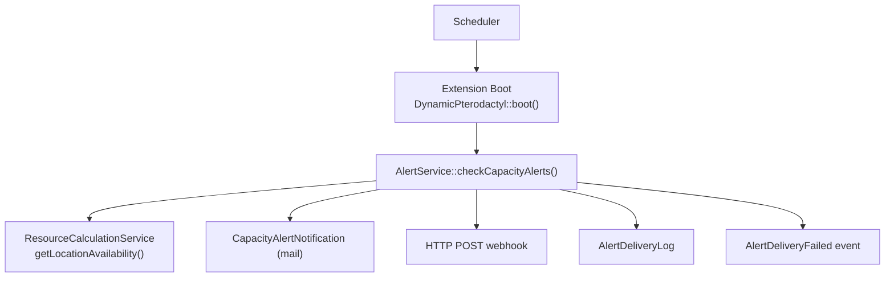
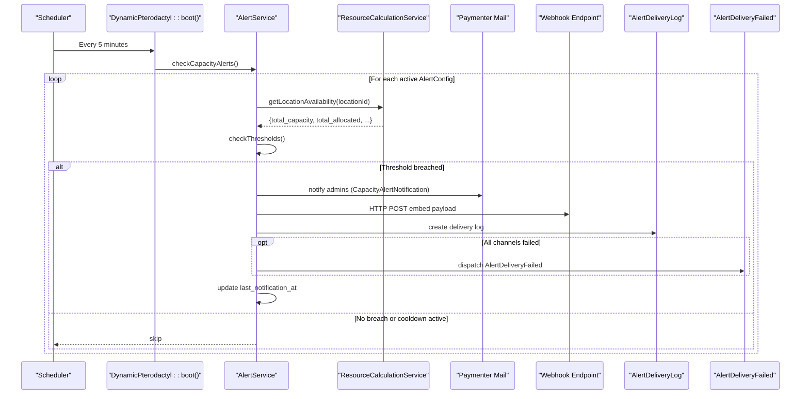
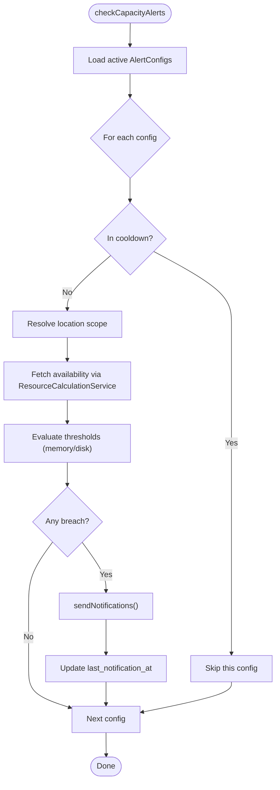
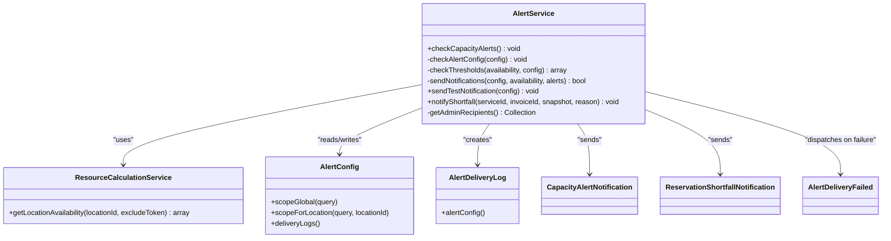
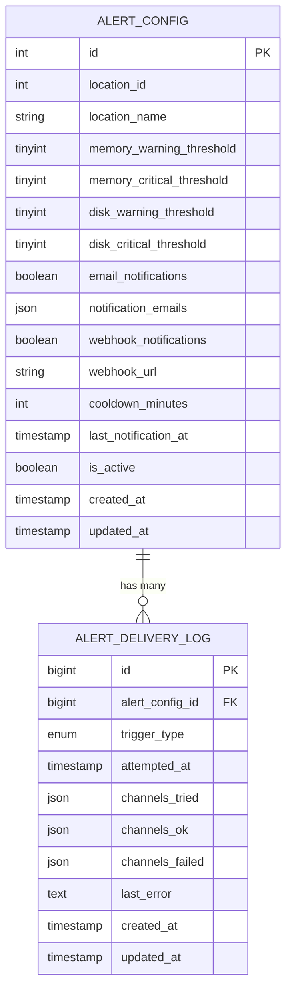

# Alert Service

<cite>
**Referenced Files in This Document**
- [AlertService.php](file://Services/AlertService.php)
- [AlertConfig.php](file://Models/AlertConfig.php)
- [AlertDeliveryLog.php](file://Models/AlertDeliveryLog.php)
- [CapacityAlertNotification.php](file://Notifications/CapacityAlertNotification.php)
- [ReservationShortfallNotification.php](file://Notifications/ReservationShortfallNotification.php)
- [AlertDeliveryFailed.php](file://Events/AlertDeliveryFailed.php)
- [DynamicPterodactyl.php](file://DynamicPterodactyl.php)
- [ResourceCalculationService.php](file://Services/ResourceCalculationService.php)
- [2025_01_01_000004_create_ptero_alert_configs_table.php](file://database/migrations/2025_01_01_000004_create_ptero_alert_configs_table.php)
- [2026_04_26_000001_create_ptero_alert_delivery_log_table.php](file://database/migrations/2026_04_26_000001_create_ptero_alert_delivery_log_table.php)
- [AlertConfigObserver.php](file://Models/Observers/AlertConfigObserver.php)
- [AlertConfigResource.php](file://Admin/Resources/AlertConfigResource.php)
- [AlertScheduleTest.php](file://tests/Feature/AlertScheduleTest.php)
</cite>

## Table of Contents
1. [Introduction](#introduction)
2. [Project Structure](#project-structure)
3. [Core Components](#core-components)
4. [Architecture Overview](#architecture-overview)
5. [Detailed Component Analysis](#detailed-component-analysis)
6. [Dependency Analysis](#dependency-analysis)
7. [Performance Considerations](#performance-considerations)
8. [Troubleshooting Guide](#troubleshooting-guide)
9. [Conclusion](#conclusion)
10. [Appendices](#appendices)

## Introduction
The Alert Service monitors system capacity across locations and nodes, compares utilization against configurable thresholds, and dispatches notifications via email and webhooks when limits are breached. It enforces cooldowns to prevent alert storms, tracks delivery outcomes in a dedicated log, and integrates with Paymenter’s notification infrastructure through its mail channel. Alerts are triggered by a scheduled job that runs every five minutes and is protected from overlapping executions.

## Project Structure
The alerting subsystem spans services, models, notifications, events, migrations, admin resources, and the extension boot process:
- Scheduling and orchestration live in the extension boot method.
- Threshold evaluation and delivery logic reside in the Alert Service.
- Configuration and auditability are modeled by AlertConfig and its observer.
- Delivery tracking uses AlertDeliveryLog.
- Notifications are implemented as Paymenter-compatible mail notifications.
- Admin UI exposes configuration management and a test action.

**Diagram sources**
- [DynamicPterodactyl.php:96-127](file://DynamicPterodactyl.php#L96-L127)
- [AlertService.php:33-75](file://Services/AlertService.php#L33-L75)
- [ResourceCalculationService.php:26-67](file://Services/ResourceCalculationService.php#L26-L67)
- [CapacityAlertNotification.php:19-47](file://Notifications/CapacityAlertNotification.php#L19-L47)
- [AlertDeliveryLog.php:8-33](file://Models/AlertDeliveryLog.php#L8-L33)
- [AlertDeliveryFailed.php:9-16](file://Events/AlertDeliveryFailed.php#L9-L16)

**Section sources**
- [DynamicPterodactyl.php:96-127](file://DynamicPterodactyl.php#L96-L127)
- [AlertScheduleTest.php:23-33](file://tests/Feature/AlertScheduleTest.php#L23-L33)

## Core Components
- AlertService: Orchestrates threshold checks, cooldown enforcement, notification delivery, logging, auditing, and failure events.
- AlertConfig: Defines per-location or global alert rules, thresholds, channels, cooldown, and activation state.
- AlertDeliveryLog: Records each attempt with channels tried/succeeded/failed and last error.
- CapacityAlertNotification: Formats and sends email alerts to admins using Paymenter’s mail channel.
- ReservationShortfallNotification: Notifies admins about reservation shortfalls after payment.
- ResourceCalculationService: Provides real-time location availability used for threshold evaluation.
- AlertConfigObserver: Audits changes to alert configurations while redacting sensitive webhook URLs.
- Admin AlertConfigResource: Filament resource exposing CRUD and a “Test” action to send a sample alert.

**Section sources**
- [AlertService.php:19-393](file://Services/AlertService.php#L19-L393)
- [AlertConfig.php:8-56](file://Models/AlertConfig.php#L8-L56)
- [AlertDeliveryLog.php:8-33](file://Models/AlertDeliveryLog.php#L8-L33)
- [CapacityAlertNotification.php:10-47](file://Notifications/CapacityAlertNotification.php#L10-L47)
- [ReservationShortfallNotification.php:10-40](file://Notifications/ReservationShortfallNotification.php#L10-L40)
- [ResourceCalculationService.php:26-67](file://Services/ResourceCalculationService.php#L26-L67)
- [AlertConfigObserver.php:8-69](file://Models/Observers/AlertConfigObserver.php#L8-L69)
- [AlertConfigResource.php:150-197](file://Admin/Resources/AlertConfigResource.php#L150-L197)

## Architecture Overview
The service is invoked by a scheduled task registered during extension boot. For each active alert configuration, it determines the scope (global or specific location), fetches current availability from Pterodactyl via ResourceCalculationService, evaluates memory and disk utilization against configured warning/critical thresholds, and dispatches notifications if any thresholds are breached. Cooldown prevents repeated alerts within a configured window. Delivery attempts are recorded, and failures emit an event for downstream handling.

**Diagram sources**
- [DynamicPterodactyl.php:118-126](file://DynamicPterodactyl.php#L118-L126)
- [AlertService.php:33-75](file://Services/AlertService.php#L33-L75)
- [AlertService.php:77-126](file://Services/AlertService.php#L77-L126)
- [AlertService.php:128-248](file://Services/AlertService.php#L128-L248)
- [ResourceCalculationService.php:26-67](file://Services/ResourceCalculationService.php#L26-L67)
- [CapacityAlertNotification.php:19-47](file://Notifications/CapacityAlertNotification.php#L19-L47)
- [AlertDeliveryLog.php:8-33](file://Models/AlertDeliveryLog.php#L8-L33)
- [AlertDeliveryFailed.php:9-16](file://Events/AlertDeliveryFailed.php#L9-L16)

## Detailed Component Analysis

### AlertService
Responsibilities:
- Enumerate active alert configurations and evaluate them per location.
- Enforce cooldown based on last_notification_at and cooldown_minutes.
- Compute utilization percentages for memory and disk and compare against warning/critical thresholds.
- Deliver notifications via email (through Paymenter mail) and optional webhooks.
- Persist delivery logs and emit failure events when all channels fail.
- Update last_notification_at only when at least one channel succeeds.
- Provide test notification and shortfall notification helpers.

Key behaviors:
- Location scoping: If a config targets a specific location, only that location is checked; otherwise, all locations are iterated.
- Threshold logic: Critical takes precedence over warning per resource type.
- Email fan-out: Notifies all admin users (non-null role_id).
- Webhook format: Discord-compatible embed with color-coded severity.
- Logging: Channels tried, succeeded, failed, and last error are persisted.
- Audit: Successful sends are audited with severity and breached resources.

**Diagram sources**
- [AlertService.php:33-75](file://Services/AlertService.php#L33-L75)
- [AlertService.php:77-126](file://Services/AlertService.php#L77-L126)
- [AlertService.php:128-248](file://Services/AlertService.php#L128-L248)

**Section sources**
- [AlertService.php:33-75](file://Services/AlertService.php#L33-L75)
- [AlertService.php:77-126](file://Services/AlertService.php#L77-L126)
- [AlertService.php:128-248](file://Services/AlertService.php#L128-L248)
- [AlertService.php:304-323](file://Services/AlertService.php#L304-L323)
- [AlertService.php:328-369](file://Services/AlertService.php#L328-L369)

### AlertConfig Model and Migration
- Stores thresholds for memory and disk (warning and critical), notification toggles, recipients, webhook URL, cooldown, activation status, and last notification timestamp.
- Provides scopes for global and per-location queries.
- Has a one-to-many relationship with delivery logs.

Migration highlights:
- Columns for thresholds, notification settings, cooldown, timestamps, and indexes for efficient querying.

**Section sources**
- [AlertConfig.php:8-56](file://Models/AlertConfig.php#L8-L56)
- [2025_01_01_000004_create_ptero_alert_configs_table.php:9-42](file://database/migrations/2025_01_01_000004_create_ptero_alert_configs_table.php#L9-L42)

### AlertDeliveryLog Model and Migration
- Persists each delivery attempt with trigger type, attempted time, channels tried/succeeded/failed, and last error.
- Foreign key to AlertConfig with cascade delete.

Migration highlights:
- Enum for trigger types including capacity_breach and check_failure.
- JSON columns for channel arrays.

**Section sources**
- [AlertDeliveryLog.php:8-33](file://Models/AlertDeliveryLog.php#L8-L33)
- [2026_04_26_000001_create_ptero_alert_delivery_log_table.php:9-24](file://database/migrations/2026_04_26_000001_create_ptero_alert_delivery_log_table.php#L9-L24)

### Notifications
- CapacityAlertNotification: Sends mail to admins with subject, greeting, lines describing each breach, and a link to edit the alert config. Severity derived from breaches.
- ReservationShortfallNotification: Queued mail notifying admins about post-payment reservation shortfalls, including service/invoice IDs, reason, and snapshot details.

**Section sources**
- [CapacityAlertNotification.php:10-47](file://Notifications/CapacityAlertNotification.php#L10-L47)
- [ReservationShortfallNotification.php:10-40](file://Notifications/ReservationShortfallNotification.php#L10-L40)

### Integration Points
- Scheduling: The extension registers a five-minute schedule to run AlertService::checkCapacityAlerts(), without overlapping.
- Admin UI: Filament resource lists configs, shows last notification time, and provides a “Test” action invoking AlertService::sendTestNotification().
- Observers: AlertConfigObserver audits creation/update/deletion of alert configs and redacts webhook URLs in audit entries.

**Section sources**
- [DynamicPterodactyl.php:118-126](file://DynamicPterodactyl.php#L118-L126)
- [AlertConfigResource.php:150-197](file://Admin/Resources/AlertConfigResource.php#L150-L197)
- [AlertConfigObserver.php:12-69](file://Models/Observers/AlertConfigObserver.php#L12-L69)

## Dependency Analysis
AlertService depends on:
- ResourceCalculationService for real-time availability data.
- Paymenter’s notification system via User::notify() and CapacityAlertNotification.
- HTTP client for webhook delivery.
- Database for reading alert configs and writing delivery logs.
- Events for signaling delivery failures.

**Diagram sources**
- [AlertService.php:19-393](file://Services/AlertService.php#L19-L393)
- [ResourceCalculationService.php:26-67](file://Services/ResourceCalculationService.php#L26-L67)
- [AlertConfig.php:8-56](file://Models/AlertConfig.php#L8-L56)
- [AlertDeliveryLog.php:8-33](file://Models/AlertDeliveryLog.php#L8-L33)
- [CapacityAlertNotification.php:10-47](file://Notifications/CapacityAlertNotification.php#L10-L47)
- [ReservationShortfallNotification.php:10-40](file://Notifications/ReservationShortfallNotification.php#L10-L40)
- [AlertDeliveryFailed.php:9-16](file://Events/AlertDeliveryFailed.php#L9-L16)

**Section sources**
- [AlertService.php:19-393](file://Services/AlertService.php#L19-L393)
- [ResourceCalculationService.php:26-67](file://Services/ResourceCalculationService.php#L26-L67)

## Performance Considerations
- Real-time availability: Availability is fetched directly from Pterodactyl API per check; avoid adding caching unless explicitly required.
- Batched API calls: ResourceCalculationService batches node and server queries to minimize external calls.
- Non-overlapping schedule: The scheduler ensures only one instance of the alert check runs at a time.
- Cooldown: Configurable cooldown_minutes reduces redundant notifications under sustained high utilization.
- Delivery resilience: Webhook requests use a timeout and throw on failure; email errors are logged and reported.

[No sources needed since this section provides general guidance]

## Troubleshooting Guide
Common issues and resolutions:
- No admin recipients: Emails will not be sent if no admin users exist. Ensure at least one user has a non-null role_id. Logs will record a warning context.
- Webhook failures: Check network connectivity, endpoint availability, and payload compatibility. Errors include host and message in logs.
- Delivery log write failures: If the delivery log cannot be written, a warning is logged; consider database permissions and table integrity.
- Cooldown too long: Increase frequency or reduce cooldown_minutes if you need faster re-notification.
- Misconfigured thresholds: Adjust warning/critical thresholds per resource to match operational baselines. Use the “Test” action in the admin resource to validate configuration.

Operational checks:
- Verify schedule registration and expression via tests or console inspection.
- Inspect AlertDeliveryLog entries for channels_failed and last_error to pinpoint failures.
- Review audit logs for capacity_alert_sent actions to confirm successful deliveries.

**Section sources**
- [AlertService.php:143-179](file://Services/AlertService.php#L143-L179)
- [AlertService.php:182-216](file://Services/AlertService.php#L182-L216)
- [AlertService.php:250-276](file://Services/AlertService.php#L250-L276)
- [AlertConfigResource.php:150-164](file://Admin/Resources/AlertConfigResource.php#L150-L164)
- [AlertScheduleTest.php:23-33](file://tests/Feature/AlertScheduleTest.php#L23-L33)

## Conclusion
The Alert Service provides robust, configurable capacity monitoring with clear separation between evaluation and delivery. It integrates seamlessly with Paymenter’s notification stack, persists delivery history, and supports both proactive scheduling and reactive shortfall notifications. Properly tuned thresholds and cooldowns ensure timely, actionable alerts without overwhelming stakeholders.

[No sources needed since this section summarizes without analyzing specific files]

## Appendices

### Alert Configuration Scenarios
- Global memory warning: Set memory_warning_threshold to a value like 80% with no location_id to monitor all locations.
- Per-location critical disk: Configure disk_critical_threshold for a specific location_id to escalate severe disk usage.
- Dual-channel delivery: Enable both email and webhook to ensure redundancy; verify webhook URL correctness.
- Short cooldown for volatile environments: Reduce cooldown_minutes to receive more frequent updates during rapid load changes.

[No sources needed since this section provides general guidance]

### Threshold Tuning Recommendations
- Start with warning at 80% and critical at 95% for both memory and disk; adjust based on observed baselines and SLAs.
- Use per-location overrides where capacity characteristics differ significantly.
- Validate with the admin “Test” action and review delivery logs to ensure expected behavior.

[No sources needed since this section provides general guidance]

### Data Models Reference

**Diagram sources**
- [2025_01_01_000004_create_ptero_alert_configs_table.php:9-42](file://database/migrations/2025_01_01_000004_create_ptero_alert_configs_table.php#L9-L42)
- [2026_04_26_000001_create_ptero_alert_delivery_log_table.php:9-24](file://database/migrations/2026_04_26_000001_create_ptero_alert_delivery_log_table.php#L9-L24)