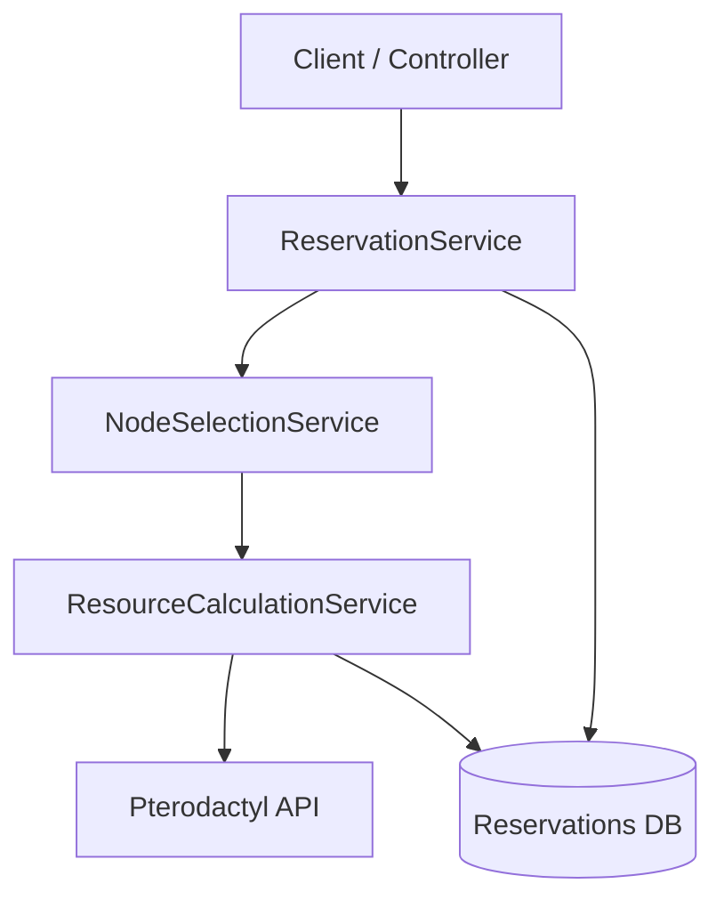
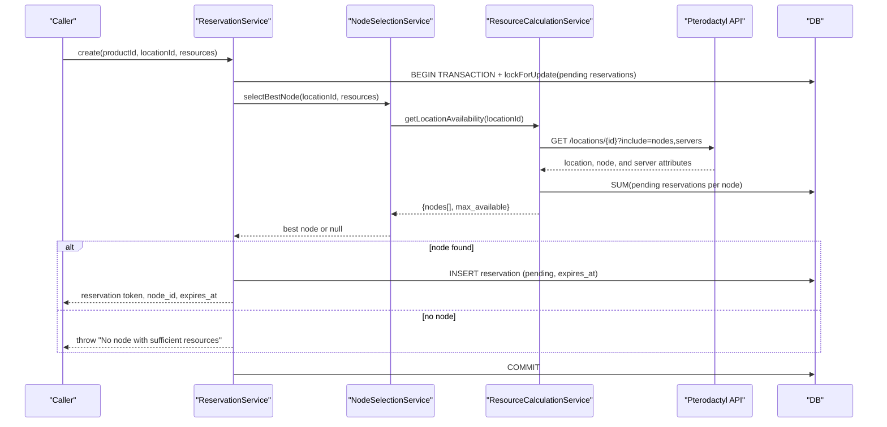
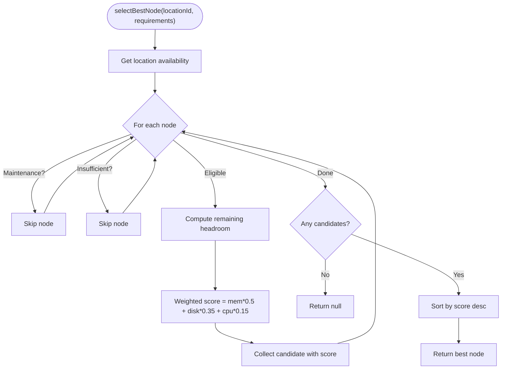
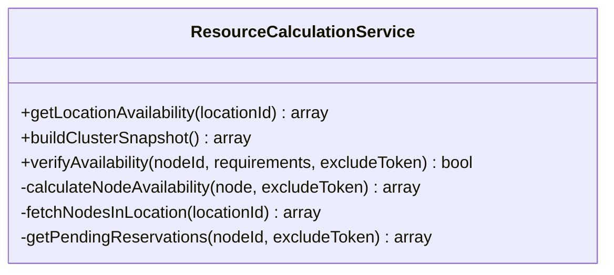
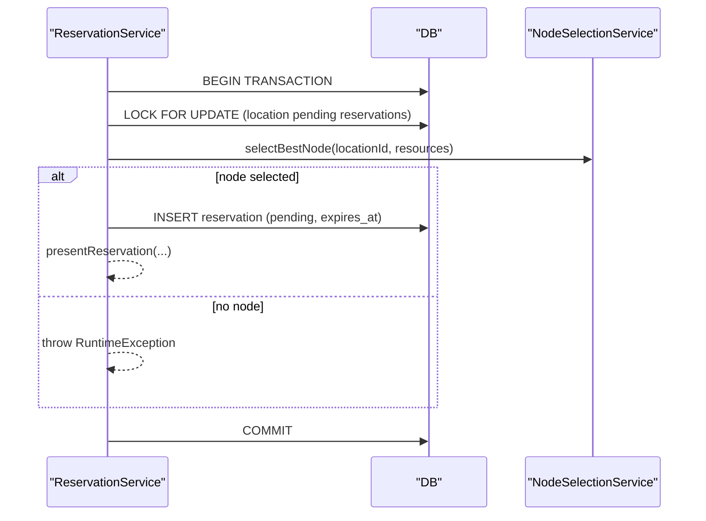
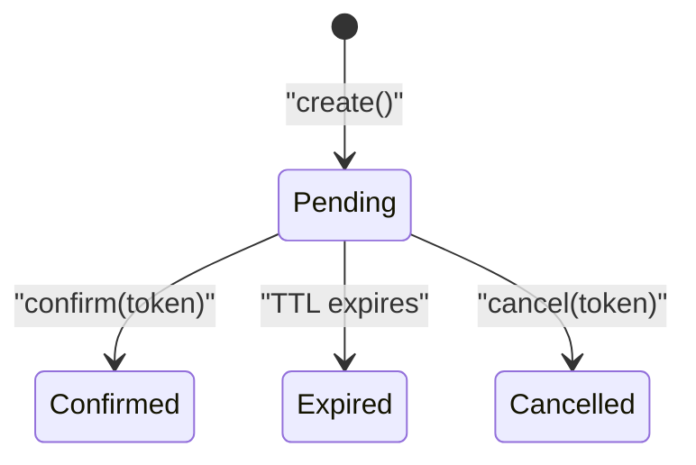
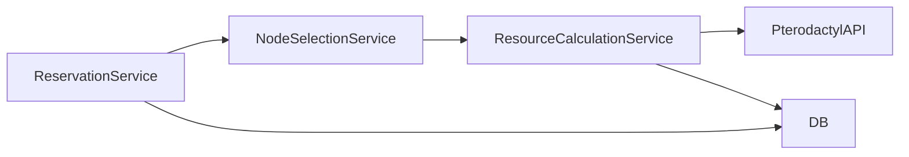

# Node Selection Service

> **Preserved Qoder snapshot.** This deep-dive page is retained so the earlier Wiki work and its source trail are not lost. For the reconciled implementation, [[Architecture Overview|Architecture-Overview]] is canonical; references below to retired controllers, listeners, services, or API shapes are historical.

<cite>
**Referenced Files in This Document**
- [NodeSelectionService.php](https://github.com/ObsidianNetwork/dynamic-pterodactyl/blob/6b7f83bda6f7c3fe014d52428b31af1638daa6cc/Services/NodeSelectionService.php)
- [ResourceCalculationService.php](https://github.com/ObsidianNetwork/dynamic-pterodactyl/blob/6b7f83bda6f7c3fe014d52428b31af1638daa6cc/Services/ResourceCalculationService.php)
- [ReservationService.php](https://github.com/ObsidianNetwork/dynamic-pterodactyl/blob/6b7f83bda6f7c3fe014d52428b31af1638daa6cc/Services/ReservationService.php)
- [ResourceReservation.php](https://github.com/ObsidianNetwork/dynamic-pterodactyl/blob/6b7f83bda6f7c3fe014d52428b31af1638daa6cc/Models/ResourceReservation.php)
- [NodeSelectionServiceTest.php](https://github.com/ObsidianNetwork/dynamic-pterodactyl/blob/6b7f83bda6f7c3fe014d52428b31af1638daa6cc/tests/Unit/NodeSelectionServiceTest.php)
- [ResourceCalculationServiceTest.php](https://github.com/ObsidianNetwork/dynamic-pterodactyl/blob/6b7f83bda6f7c3fe014d52428b31af1638daa6cc/tests/Unit/ResourceCalculationServiceTest.php)
- [2026_04_22_000001_drop_released_from_reservation_status.php](https://github.com/ObsidianNetwork/dynamic-pterodactyl/blob/6b7f83bda6f7c3fe014d52428b31af1638daa6cc/database/migrations/2026_04_22_000001_drop_released_from_reservation_status.php)
</cite>

## Table of Contents
1. [Introduction](#introduction)
2. [Project Structure](#project-structure)
3. [Core Components](#core-components)
4. [Architecture Overview](#architecture-overview)
5. [Detailed Component Analysis](#detailed-component-analysis)
6. [Dependency Analysis](#dependency-analysis)
7. [Performance Considerations](#performance-considerations)
8. [Troubleshooting Guide](#troubleshooting-guide)
9. [Conclusion](#conclusion)

## Introduction
This document explains the NodeSelectionService, which implements a weighted best-fit algorithm to allocate resources across Pterodactyl nodes. It selects the optimal node for each reservation by scoring available headroom with memory at 50%, disk at 35%, and CPU at 15%. The service evaluates real-time availability from ResourceCalculationService, respects maintenance modes and node constraints, and integrates with ReservationService to create reservations under pessimistic locking with deadlock retries.

## Project Structure
The NodeSelectionService is part of a small set of services that coordinate resource allocation:
- NodeSelectionService: Implements the selection algorithm.
- ResourceCalculationService: Provides real-time availability data from Pterodactyl API and aggregates per-location metrics.
- ReservationService: Orchestrates reservation creation, confirmation, cancellation, TTL extension, and cleanup; uses NodeSelectionService during creation.
- ResourceReservation model: Represents pending/confirmed/expired/cancelled reservations used to reserve capacity.

**Diagram sources**
- [ReservationService.php:43-124](https://github.com/ObsidianNetwork/dynamic-pterodactyl/blob/6b7f83bda6f7c3fe014d52428b31af1638daa6cc/Services/ReservationService.php#L43-L124)
- [NodeSelectionService.php:22-76](https://github.com/ObsidianNetwork/dynamic-pterodactyl/blob/6b7f83bda6f7c3fe014d52428b31af1638daa6cc/Services/NodeSelectionService.php#L22-L76)
- [ResourceCalculationService.php:26-67](https://github.com/ObsidianNetwork/dynamic-pterodactyl/blob/6b7f83bda6f7c3fe014d52428b31af1638daa6cc/Services/ResourceCalculationService.php#L26-L67)

**Section sources**
- [NodeSelectionService.php:1-88](https://github.com/ObsidianNetwork/dynamic-pterodactyl/blob/6b7f83bda6f7c3fe014d52428b31af1638daa6cc/Services/NodeSelectionService.php#L1-L88)
- [ResourceCalculationService.php:1-545](https://github.com/ObsidianNetwork/dynamic-pterodactyl/blob/6b7f83bda6f7c3fe014d52428b31af1638daa6cc/Services/ResourceCalculationService.php#L1-L545)
- [ReservationService.php:1-453](https://github.com/ObsidianNetwork/dynamic-pterodactyl/blob/6b7f83bda6f7c3fe014d52428b31af1638daa6cc/Services/ReservationService.php#L1-L453)
- [ResourceReservation.php:1-65](https://github.com/ObsidianNetwork/dynamic-pterodactyl/blob/6b7f83bda6f7c3fe014d52428b31af1638daa6cc/Models/ResourceReservation.php#L1-L65)

## Core Components
- NodeSelectionService: Selects the best node using weighted headroom scoring and filters out unsuitable nodes (maintenance mode or insufficient resources).
- ResourceCalculationService: Fetches live cluster state from Pterodactyl, computes effective totals with overallocation, subtracts allocated and pending reservations, and returns per-node availability and location-level aggregates.
- ReservationService: Creates reservations with pessimistic DB locks and retry on deadlocks; calls NodeSelectionService to pick a node; manages lifecycle states and TTL.

Key responsibilities:
- Real-time availability: ResourceCalculationService queries Pterodactyl endpoints and sums server limits and pending reservations to compute available resources per node.
- Weighted best-fit: NodeSelectionService scores candidates based on remaining headroom after allocation, prioritizing memory headroom.
- Concurrency safety: ReservationService uses lockForUpdate on pending reservations within a transaction and retries on deadlock.

**Section sources**
- [NodeSelectionService.php:22-76](https://github.com/ObsidianNetwork/dynamic-pterodactyl/blob/6b7f83bda6f7c3fe014d52428b31af1638daa6cc/Services/NodeSelectionService.php#L22-L76)
- [ResourceCalculationService.php:26-67](https://github.com/ObsidianNetwork/dynamic-pterodactyl/blob/6b7f83bda6f7c3fe014d52428b31af1638daa6cc/Services/ResourceCalculationService.php#L26-L67)
- [ResourceCalculationService.php:146-289](https://github.com/ObsidianNetwork/dynamic-pterodactyl/blob/6b7f83bda6f7c3fe014d52428b31af1638daa6cc/Services/ResourceCalculationService.php#L146-L289)
- [ReservationService.php:43-124](https://github.com/ObsidianNetwork/dynamic-pterodactyl/blob/6b7f83bda6f7c3fe014d52428b31af1638daa6cc/Services/ReservationService.php#L43-L124)

## Architecture Overview
The selection flow is driven by ReservationService when creating a reservation:
1. ReservationService opens a transaction and locks pending reservations for the target location.
2. It calls NodeSelectionService::selectBestNode(locationId, requirements).
3. NodeSelectionService asks ResourceCalculationService::getLocationAvailability(locationId) for current node state.
4. ResourceCalculationService fetches nodes and servers from Pterodactyl, sums allocated resources, adds pending reservations, and computes available resources per node.
5. NodeSelectionService filters and scores nodes, returning the best candidate.
6. ReservationService persists a pending reservation with token and TTL.

**Diagram sources**
- [ReservationService.php:43-124](https://github.com/ObsidianNetwork/dynamic-pterodactyl/blob/6b7f83bda6f7c3fe014d52428b31af1638daa6cc/Services/ReservationService.php#L43-L124)
- [NodeSelectionService.php:22-76](https://github.com/ObsidianNetwork/dynamic-pterodactyl/blob/6b7f83bda6f7c3fe014d52428b31af1638daa6cc/Services/NodeSelectionService.php#L22-L76)
- [ResourceCalculationService.php:26-67](https://github.com/ObsidianNetwork/dynamic-pterodactyl/blob/6b7f83bda6f7c3fe014d52428b31af1638daa6cc/Services/ResourceCalculationService.php#L26-L67)
- [ResourceCalculationService.php:452-498](https://github.com/ObsidianNetwork/dynamic-pterodactyl/blob/6b7f83bda6f7c3fe014d52428b31af1638daa6cc/Services/ResourceCalculationService.php#L452-L498)

## Detailed Component Analysis

### NodeSelectionService: Weighted Best-Fit Algorithm
- Input: locationId and requirements (memory, cpu, disk).
- Filtering:
  - Skips nodes in maintenance mode.
  - Skips nodes where available < requirements for any resource.
- Scoring:
  - Computes remaining headroom after hypothetical allocation.
  - Normalizes by total capacity to avoid bias toward larger nodes.
  - Applies weights: memory 50%, disk 35%, CPU 15%.
  - Sums weighted components into a single score.
- Selection:
  - Sorts candidates by score descending and returns the top node.
  - Returns null if no candidates qualify.

**Diagram sources**
- [NodeSelectionService.php:22-76](https://github.com/ObsidianNetwork/dynamic-pterodactyl/blob/6b7f83bda6f7c3fe014d52428b31af1638daa6cc/Services/NodeSelectionService.php#L22-L76)

Edge cases handled:
- Insufficient capacity: If no node can fit the request, returns null.
- Multiple qualifying nodes: Scores all and picks the highest-scoring one.
- Maintenance mode: Nodes are excluded automatically.
- Dynamic resource changes: Uses real-time availability; decisions reflect current cluster state.

**Section sources**
- [NodeSelectionService.php:22-76](https://github.com/ObsidianNetwork/dynamic-pterodactyl/blob/6b7f83bda6f7c3fe014d52428b31af1638daa6cc/Services/NodeSelectionService.php#L22-L76)
- [NodeSelectionServiceTest.php:32-70](https://github.com/ObsidianNetwork/dynamic-pterodactyl/blob/6b7f83bda6f7c3fe014d52428b31af1638daa6cc/tests/Unit/NodeSelectionServiceTest.php#L32-L70)
- [NodeSelectionServiceTest.php:75-112](https://github.com/ObsidianNetwork/dynamic-pterodactyl/blob/6b7f83bda6f7c3fe014d52428b31af1638daa6cc/tests/Unit/NodeSelectionServiceTest.php#L75-L112)
- [NodeSelectionServiceTest.php:117-154](https://github.com/ObsidianNetwork/dynamic-pterodactyl/blob/6b7f83bda6f7c3fe014d52428b31af1638daa6cc/tests/Unit/NodeSelectionServiceTest.php#L117-L154)
- [NodeSelectionServiceTest.php:159-195](https://github.com/ObsidianNetwork/dynamic-pterodactyl/blob/6b7f83bda6f7c3fe014d52428b31af1638daa6cc/tests/Unit/NodeSelectionServiceTest.php#L159-L195)
- [NodeSelectionServiceTest.php:200-236](https://github.com/ObsidianNetwork/dynamic-pterodactyl/blob/6b7f83bda6f7c3fe014d52428b31af1638daa6cc/tests/Unit/NodeSelectionServiceTest.php#L200-L236)
- [NodeSelectionServiceTest.php:241-267](https://github.com/ObsidianNetwork/dynamic-pterodactyl/blob/6b7f83bda6f7c3fe014d52428b31af1638daa6cc/tests/Unit/NodeSelectionServiceTest.php#L241-L267)
- [NodeSelectionServiceTest.php:272-311](https://github.com/ObsidianNetwork/dynamic-pterodactyl/blob/6b7f83bda6f7c3fe014d52428b31af1638daa6cc/tests/Unit/NodeSelectionServiceTest.php#L272-L311)

### ResourceCalculationService: Real-Time Availability
- Purpose: Provide accurate, up-to-date availability for nodes and locations.
- Data sources:
  - Pterodactyl API for nodes and servers.
  - Database for pending reservations that affect available capacity.
- Computation:
  - Effective totals incorporate overallocation percentages for memory and disk.
  - Available = effective total − allocated − pending reservations.
  - Aggregates per-location maximum available and totals.
- Integration points:
  - Used by NodeSelectionService for selection.
  - Used by ReservationService indirectly via NodeSelectionService and directly for verification flows.

**Diagram sources**
- [ResourceCalculationService.php:26-67](https://github.com/ObsidianNetwork/dynamic-pterodactyl/blob/6b7f83bda6f7c3fe014d52428b31af1638daa6cc/Services/ResourceCalculationService.php#L26-L67)
- [ResourceCalculationService.php:146-289](https://github.com/ObsidianNetwork/dynamic-pterodactyl/blob/6b7f83bda6f7c3fe014d52428b31af1638daa6cc/Services/ResourceCalculationService.php#L146-L289)
- [ResourceCalculationService.php:500-522](https://github.com/ObsidianNetwork/dynamic-pterodactyl/blob/6b7f83bda6f7c3fe014d52428b31af1638daa6cc/Services/ResourceCalculationService.php#L500-L522)

How it supports NodeSelectionService:
- Supplies per-node available and total capacities, including maintenance flags.
- Ensures pending reservations reduce available resources so selections account for concurrent allocations.

**Section sources**
- [ResourceCalculationService.php:26-67](https://github.com/ObsidianNetwork/dynamic-pterodactyl/blob/6b7f83bda6f7c3fe014d52428b31af1638daa6cc/Services/ResourceCalculationService.php#L26-L67)
- [ResourceCalculationService.php:146-289](https://github.com/ObsidianNetwork/dynamic-pterodactyl/blob/6b7f83bda6f7c3fe014d52428b31af1638daa6cc/Services/ResourceCalculationService.php#L146-L289)
- [ResourceCalculationService.php:500-522](https://github.com/ObsidianNetwork/dynamic-pterodactyl/blob/6b7f83bda6f7c3fe014d52428b31af1638daa6cc/Services/ResourceCalculationService.php#L500-L522)

### ReservationService: Creation Flow and Concurrency
- Transactional creation:
  - Locks pending reservations for the location to prevent races.
  - Calls NodeSelectionService to choose a node.
  - Persists a pending reservation with token and TTL.
- Idempotency:
  - Supports idempotency keys to deduplicate concurrent requests.
- Lifecycle:
  - States: pending → confirmed | expired | cancelled.
  - TTL management and batch cleanup.

**Diagram sources**
- [ReservationService.php:43-124](https://github.com/ObsidianNetwork/dynamic-pterodactyl/blob/6b7f83bda6f7c3fe014d52428b31af1638daa6cc/Services/ReservationService.php#L43-L124)

Integration with ResourceCalculationService:
- NodeSelectionService depends on ResourceCalculationService for live availability, ensuring selection decisions are based on current cluster state rather than historical patterns.

**Section sources**
- [ReservationService.php:43-124](https://github.com/ObsidianNetwork/dynamic-pterodactyl/blob/6b7f83bda6f7c3fe014d52428b31af1638daa6cc/Services/ReservationService.php#L43-L124)
- [ReservationService.php:166-199](https://github.com/ObsidianNetwork/dynamic-pterodactyl/blob/6b7f83bda6f7c3fe014d52428b31af1638daa6cc/Services/ReservationService.php#L166-L199)
- [ReservationService.php:208-241](https://github.com/ObsidianNetwork/dynamic-pterodactyl/blob/6b7f83bda6f7c3fe014d52428b31af1638daa6cc/Services/ReservationService.php#L208-L241)
- [ReservationService.php:250-281](https://github.com/ObsidianNetwork/dynamic-pterodactyl/blob/6b7f83bda6f7c3fe014d52428b31af1638daa6cc/Services/ReservationService.php#L250-L281)
- [ReservationService.php:387-405](https://github.com/ObsidianNetwork/dynamic-pterodactyl/blob/6b7f83bda6f7c3fe014d52428b31af1638daa6cc/Services/ReservationService.php#L387-L405)

### ResourceReservation Model and Status Flow
- Fields include token, idempotency_key, node_id, location_id, resource amounts, pricing, status, and expires_at.
- Scopes for pending and expired reservations support availability calculations and cleanup.
- Migration ensures 'released' status is mapped to 'cancelled', aligning with the strict lifecycle.

**Diagram sources**
- [ResourceReservation.php:10-65](https://github.com/ObsidianNetwork/dynamic-pterodactyl/blob/6b7f83bda6f7c3fe014d52428b31af1638daa6cc/Models/ResourceReservation.php#L10-L65)
- [2026_04_22_000001_drop_released_from_reservation_status.php:8-19](https://github.com/ObsidianNetwork/dynamic-pterodactyl/blob/6b7f83bda6f7c3fe014d52428b31af1638daa6cc/database/migrations/2026_04_22_000001_drop_released_from_reservation_status.php#L8-L19)

**Section sources**
- [ResourceReservation.php:10-65](https://github.com/ObsidianNetwork/dynamic-pterodactyl/blob/6b7f83bda6f7c3fe014d52428b31af1638daa6cc/Models/ResourceReservation.php#L10-L65)
- [2026_04_22_000001_drop_released_from_reservation_status.php:8-19](https://github.com/ObsidianNetwork/dynamic-pterodactyl/blob/6b7f83bda6f7c3fe014d52428b31af1638daa6cc/database/migrations/2026_04_22_000001_drop_released_from_reservation_status.php#L8-L19)

## Dependency Analysis
- NodeSelectionService depends on ResourceCalculationService for real-time availability.
- ReservationService depends on NodeSelectionService to pick a node and on DB for persistence.
- ResourceCalculationService depends on Pterodactyl API and DB for pending reservations.

**Diagram sources**
- [ReservationService.php:20-27](https://github.com/ObsidianNetwork/dynamic-pterodactyl/blob/6b7f83bda6f7c3fe014d52428b31af1638daa6cc/Services/ReservationService.php#L20-L27)
- [NodeSelectionService.php:7-12](https://github.com/ObsidianNetwork/dynamic-pterodactyl/blob/6b7f83bda6f7c3fe014d52428b31af1638daa6cc/Services/NodeSelectionService.php#L7-L12)
- [ResourceCalculationService.php:12-21](https://github.com/ObsidianNetwork/dynamic-pterodactyl/blob/6b7f83bda6f7c3fe014d52428b31af1638daa6cc/Services/ResourceCalculationService.php#L12-L21)

**Section sources**
- [ReservationService.php:20-27](https://github.com/ObsidianNetwork/dynamic-pterodactyl/blob/6b7f83bda6f7c3fe014d52428b31af1638daa6cc/Services/ReservationService.php#L20-L27)
- [NodeSelectionService.php:7-12](https://github.com/ObsidianNetwork/dynamic-pterodactyl/blob/6b7f83bda6f7c3fe014d52428b31af1638daa6cc/Services/NodeSelectionService.php#L7-L12)
- [ResourceCalculationService.php:12-21](https://github.com/ObsidianNetwork/dynamic-pterodactyl/blob/6b7f83bda6f7c3fe014d52428b31af1638daa6cc/Services/ResourceCalculationService.php#L12-L21)

## Performance Considerations
- Real-time API calls: ResourceCalculationService avoids caching Pterodactyl responses; this ensures accuracy but introduces latency proportional to the number of nodes and servers.
- Batching: buildClusterSnapshot batches API calls and aggregates per-location metrics efficiently.
- DB aggregation: Pending reservations are summed in SQL to minimize application-side processing.
- Sorting cost: NodeSelectionService sorts candidates by score; complexity is O(n log n) relative to the number of eligible nodes.
- Overallocation handling: Effective totals incorporate overallocation percentages, preventing overcommitment while allowing realistic utilization.

[No sources needed since this section provides general guidance]

## Troubleshooting Guide
Common issues and how they manifest:
- No node selected:
  - Symptom: Reservation creation throws an exception indicating no suitable node.
  - Causes: All nodes in maintenance mode, insufficient resources, or high contention due to pending reservations.
  - Resolution: Check node maintenance flags, adjust requirements, or wait for pending reservations to expire/confirm.
- Edge-fit scenarios:
  - When verifying availability for a specific node, self-exclusion of the current reservation token allows exact-fit checks.
  - Without exclusion, edge-fit may fail because the pending reservation reduces available capacity.
- API errors:
  - Rate limiting or connection failures surface as runtime exceptions; logs capture upstream details without leaking sensitive payloads.

Relevant behaviors:
- Maintenance mode filtering prevents selecting nodes under maintenance.
- Pending reservations reduce available resources, ensuring concurrency safety.
- Deadlock retries protect reservation creation under load.

**Section sources**
- [ReservationService.php:75-79](https://github.com/ObsidianNetwork/dynamic-pterodactyl/blob/6b7f83bda6f7c3fe014d52428b31af1638daa6cc/Services/ReservationService.php#L75-L79)
- [ResourceCalculationService.php:452-498](https://github.com/ObsidianNetwork/dynamic-pterodactyl/blob/6b7f83bda6f7c3fe014d52428b31af1638daa6cc/Services/ResourceCalculationService.php#L452-L498)
- [ResourceCalculationServiceTest.php:175-193](https://github.com/ObsidianNetwork/dynamic-pterodactyl/blob/6b7f83bda6f7c3fe014d52428b31af1638daa6cc/tests/Unit/ResourceCalculationServiceTest.php#L175-L193)

## Conclusion
NodeSelectionService implements a robust weighted best-fit algorithm that balances load distribution and avoids hotspots by prioritizing memory headroom, then disk, then CPU. It relies on ResourceCalculationService for real-time availability, ensuring decisions reflect the current cluster state. ReservationService orchestrates creation with strong concurrency controls, maintaining a strict reservation lifecycle. Together, these components provide reliable, scalable resource allocation across Pterodactyl nodes.
