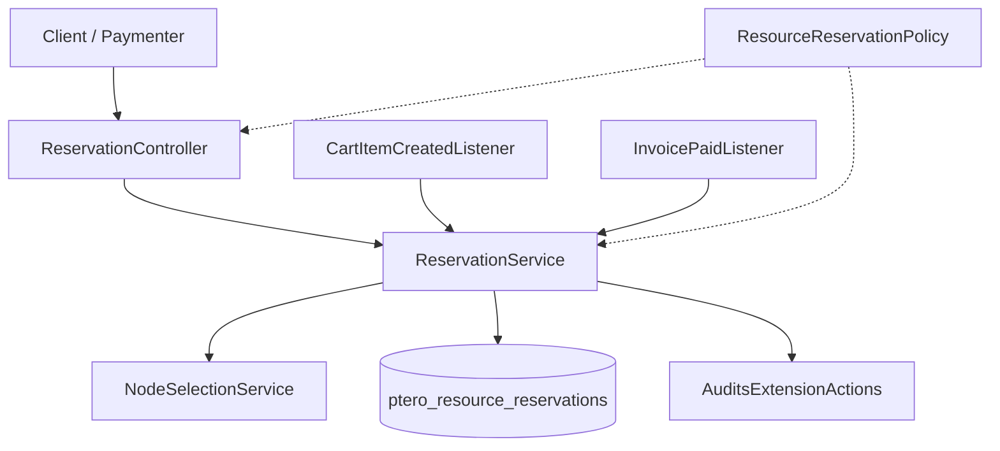
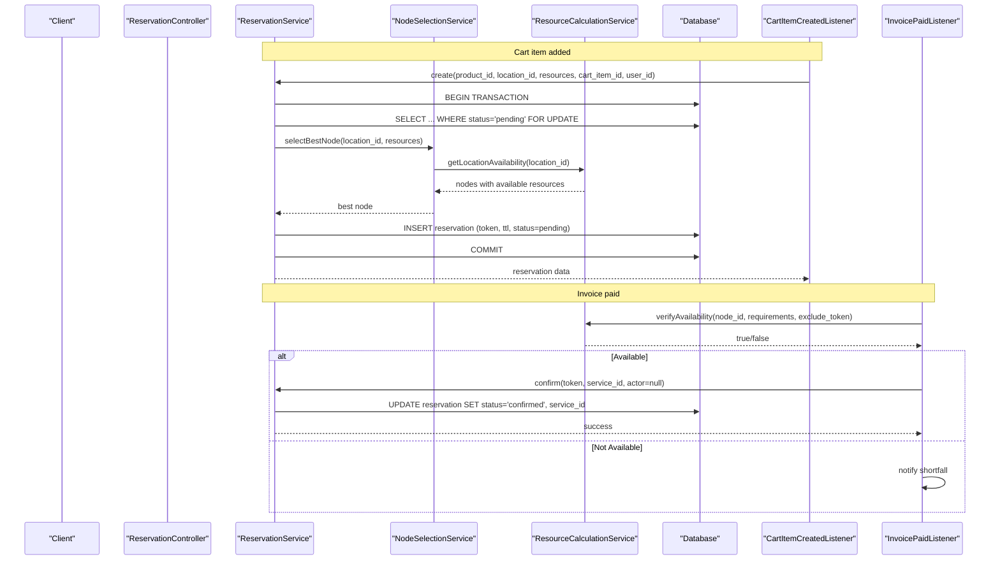
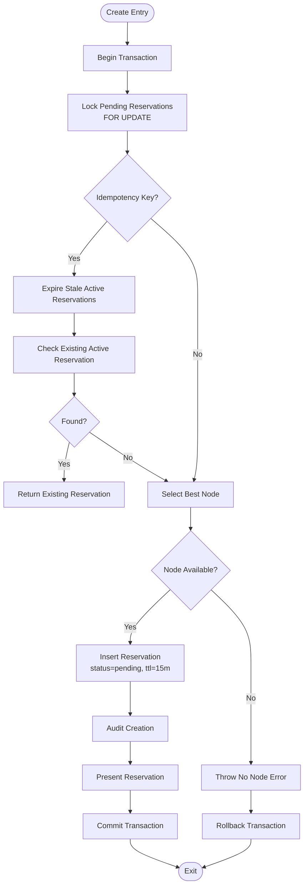
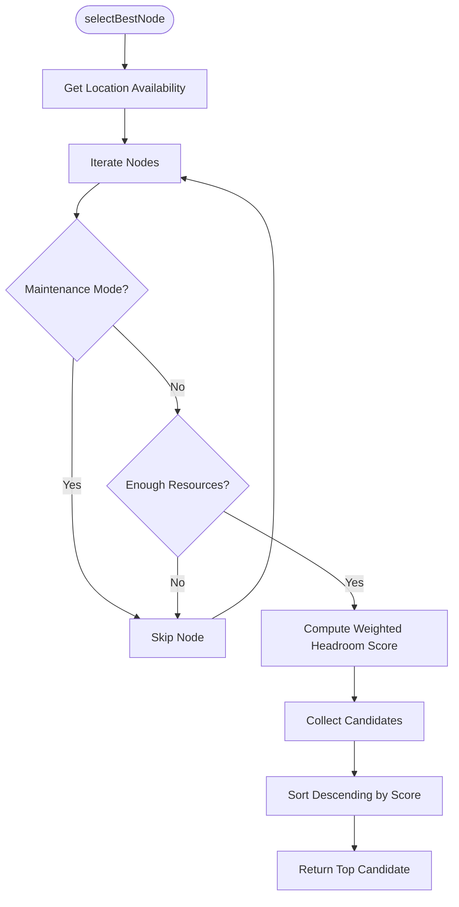
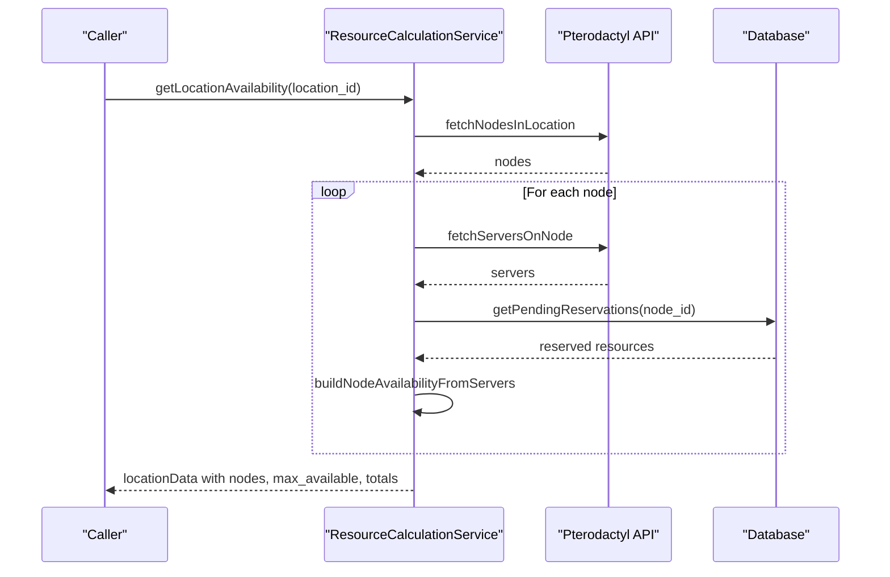
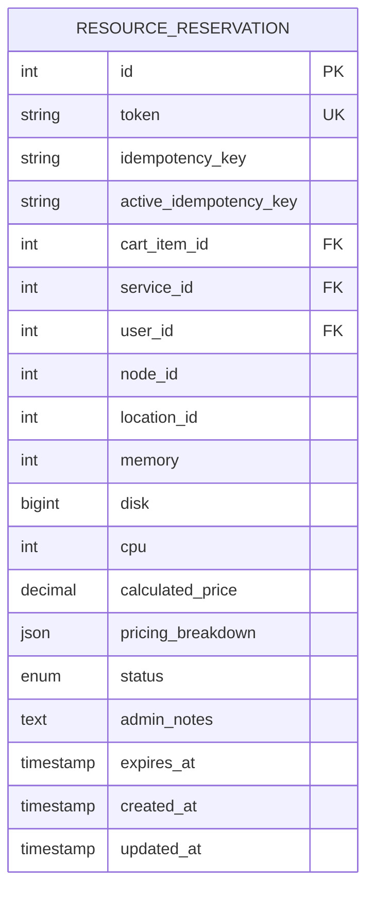
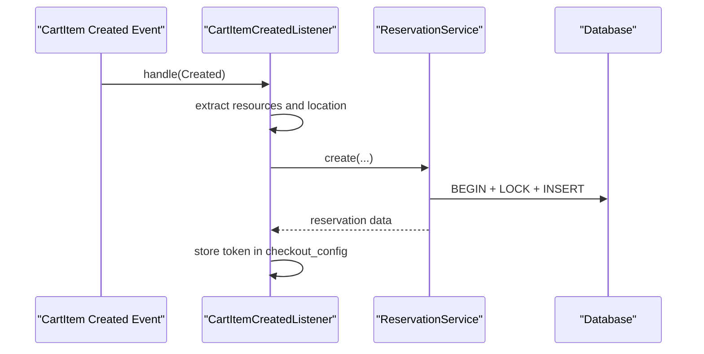
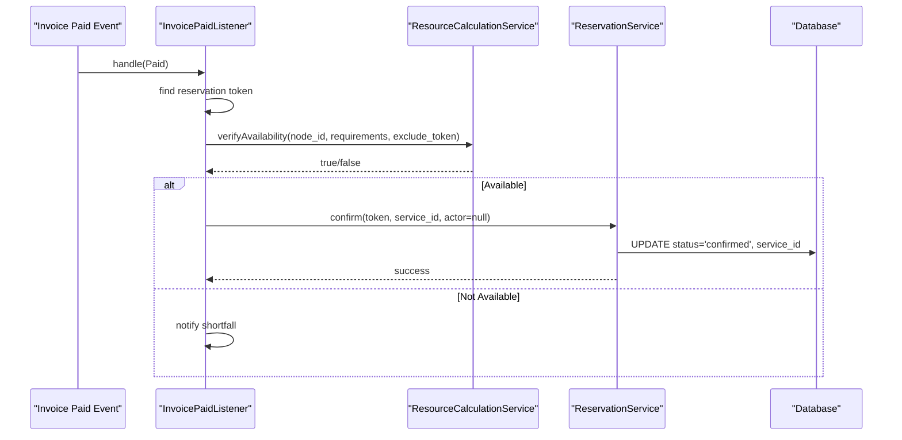
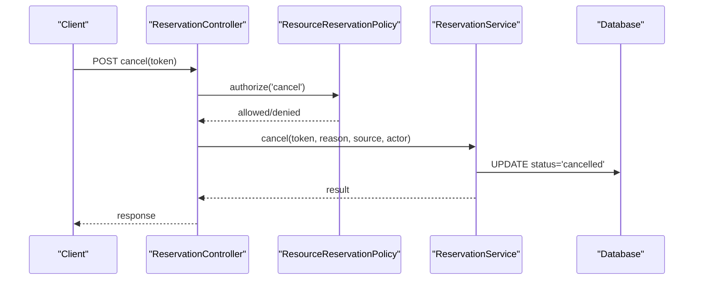
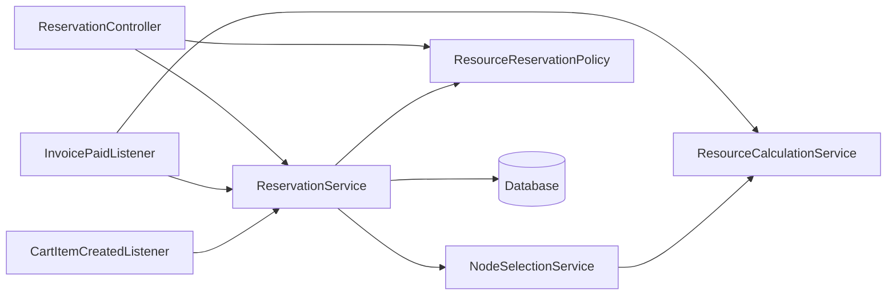

# Reservation Service

<cite>
**Referenced Files in This Document**
- [ReservationService.php](file://Services/ReservationService.php)
- [ResourceReservation.php](file://Models/ResourceReservation.php)
- [NodeSelectionService.php](file://Services/NodeSelectionService.php)
- [ResourceCalculationService.php](file://Services/ResourceCalculationService.php)
- [CartItemCreatedListener.php](file://Listeners/CartItemCreatedListener.php)
- [InvoicePaidListener.php](file://Listeners/InvoicePaidListener.php)
- [ReservationController.php](file://Http/Controllers/Api/ReservationController.php)
- [ResourceReservationPolicy.php](file://Policies/ResourceReservationPolicy.php)
- [2025_01_01_000001_create_ptero_resource_reservations_table.php](file://database/migrations/2025_01_01_000001_create_ptero_resource_reservations_table.php)
- [2026_04_22_000001_drop_released_from_reservation_status.php](file://database/migrations/2026_04_22_000001_drop_released_from_reservation_status.php)
- [2026_04_23_000001_add_idempotency_key_to_ptero_resource_reservations.php](file://database/migrations/2026_04_23_000001_add_idempotency_key_to_ptero_resource_reservations.php)
</cite>

## Table of Contents
1. [Introduction](#introduction)
2. [Project Structure](#project-structure)
3. [Core Components](#core-components)
4. [Architecture Overview](#architecture-overview)
5. [Detailed Component Analysis](#detailed-component-analysis)
6. [Dependency Analysis](#dependency-analysis)
7. [Performance Considerations](#performance-considerations)
8. [Troubleshooting Guide](#troubleshooting-guide)
9. [Conclusion](#conclusion)

## Introduction
This document explains the ReservationService, which manages the complete lifecycle of resource reservations for dynamic Pterodactyl nodes. Reservations are 15-minute TTL-based holds that reserve capacity while a customer completes checkout. The service enforces a strict state machine: pending → confirmed | expired | cancelled. The 'released' state was deliberately removed to simplify lifecycle semantics and avoid ambiguity between cancellation and post-provisioning cleanup.

The service uses pessimistic database locking with lockForUpdate() inside transactions and retries on deadlocks to prevent race conditions during concurrent checkout flows. It supports idempotent creation via unique tokens and optional idempotency keys, automatically cleans up expired reservations, and coordinates with NodeSelectionService for optimal node assignment. Integration points include cart item events (reservation creation), payment processing (reservation confirmation), and cancellation scenarios through admin or user-facing APIs.

## Project Structure
The reservation system spans services, models, listeners, controllers, policies, and migrations:

- Services: ReservationService orchestrates reservation lifecycle; NodeSelectionService selects the best node; ResourceCalculationService computes real-time availability from Pterodactyl.
- Models: ResourceReservation defines the reservation entity and scopes.
- Listeners: CartItemCreatedListener creates reservations when items enter the cart; InvoicePaidListener confirms reservations after payment.
- Controllers: ReservationController exposes API endpoints for create, get, cancel, and extend.
- Policies: ResourceReservationPolicy enforces authorization for view, cancel, extend, and confirm actions.
- Migrations: Define the reservation table, status enum evolution, and idempotency support.

**Diagram sources**
- [ReservationController.php:24-136](file://Http/Controllers/Api/ReservationController.php#L24-L136)
- [ReservationService.php:43-453](file://Services/ReservationService.php#L43-L453)
- [NodeSelectionService.php:22-86](file://Services/NodeSelectionService.php#L22-L86)
- [CartItemCreatedListener.php:13-87](file://Listeners/CartItemCreatedListener.php#L13-L87)
- [InvoicePaidListener.php:14-133](file://Listeners/InvoicePaidListener.php#L14-L133)
- [ResourceReservationPolicy.php:14-68](file://Policies/ResourceReservationPolicy.php#L14-L68)

**Section sources**
- [ReservationService.php:17-453](file://Services/ReservationService.php#L17-L453)
- [ResourceReservation.php:10-65](file://Models/ResourceReservation.php#L10-L65)
- [NodeSelectionService.php:5-86](file://Services/NodeSelectionService.php#L5-L86)
- [ResourceCalculationService.php:26-67](file://Services/ResourceCalculationService.php#L26-L67)
- [CartItemCreatedListener.php:13-87](file://Listeners/CartItemCreatedListener.php#L13-L87)
- [InvoicePaidListener.php:14-133](file://Listeners/InvoicePaidListener.php#L14-L133)
- [ReservationController.php:24-136](file://Http/Controllers/Api/ReservationController.php#L24-L136)
- [ResourceReservationPolicy.php:14-68](file://Policies/ResourceReservationPolicy.php#L14-L68)
- [2025_01_01_000001_create_ptero_resource_reservations_table.php:11-78](file://database/migrations/2025_01_01_000001_create_ptero_resource_reservations_table.php#L11-L78)
- [2026_04_22_000001_drop_released_from_reservation_status.php:8-25](file://database/migrations/2026_04_22_000001_drop_released_from_reservation_status.php#L8-L25)
- [2026_04_23_000001_add_idempotency_key_to_ptero_resource_reservations.php:9-29](file://database/migrations/2026_04_23_000001_add_idempotency_key_to_ptero_resource_reservations.php#L9-L29)

## Core Components
- ReservationService: Creates, confirms, cancels, extends, queries, and cleans up reservations. Uses pessimistic locking, transaction retries, idempotency keys, and TTL expiration.
- NodeSelectionService: Selects the best node based on weighted headroom scoring across memory, disk, and CPU.
- ResourceCalculationService: Computes real-time availability by querying Pterodactyl and accounting for pending reservations.
- ResourceReservation model: Defines fields, casts, relationships, and scopes for pending/expired states.
- Listeners: CartItemCreatedListener triggers reservation creation on cart add; InvoicePaidListener performs final availability verification and confirmation upon payment.
- Controller and Policy: Provide API endpoints and enforce authorization for reservation operations.

Key responsibilities:
- Create: Lock pending rows, select best node, insert reservation with token and TTL, audit, return presentation.
- Confirm: Update pending reservation to confirmed if still valid, link service ID, audit.
- Cancel: Mark pending reservation as cancelled with reason, audit.
- Extend: Push expires_at forward for pending reservations, audit.
- Cleanup: Batch-expire pending reservations past TTL, audit.
- Idempotency: Detect duplicates via unique active idempotency key constraint and handle race safely.

**Section sources**
- [ReservationService.php:43-141](file://Services/ReservationService.php#L43-L141)
- [ReservationService.php:166-281](file://Services/ReservationService.php#L166-L281)
- [ReservationService.php:387-405](file://Services/ReservationService.php#L387-L405)
- [NodeSelectionService.php:22-76](file://Services/NodeSelectionService.php#L22-L76)
- [ResourceCalculationService.php:26-67](file://Services/ResourceCalculationService.php#L26-L67)
- [ResourceReservation.php:10-65](file://Models/ResourceReservation.php#L10-L65)
- [CartItemCreatedListener.php:13-87](file://Listeners/CartItemCreatedListener.php#L13-L87)
- [InvoicePaidListener.php:14-133](file://Listeners/InvoicePaidListener.php#L14-L133)
- [ReservationController.php:24-136](file://Http/Controllers/Api/ReservationController.php#L24-L136)
- [ResourceReservationPolicy.php:14-68](file://Policies/ResourceReservationPolicy.php#L14-L68)

## Architecture Overview
The reservation architecture integrates event-driven creation, real-time availability checks, and strict state transitions:

**Diagram sources**
- [CartItemCreatedListener.php:47-87](file://Listeners/CartItemCreatedListener.php#L47-L87)
- [ReservationService.php:52-124](file://Services/ReservationService.php#L52-L124)
- [NodeSelectionService.php:22-76](file://Services/NodeSelectionService.php#L22-L76)
- [ResourceCalculationService.php:26-67](file://Services/ResourceCalculationService.php#L26-L67)
- [InvoicePaidListener.php:58-96](file://Listeners/InvoicePaidListener.php#L58-L96)

## Detailed Component Analysis

### ReservationService
Responsibilities:
- Create with pessimistic locking and deadlock retry:
  - Wraps logic in DB::transaction with retry count.
  - Locks all pending reservations for the target location using lockForUpdate() to serialize concurrent updates.
  - Supports idempotency via optional idempotency_key; expiring stale ones and returning existing active reservations.
  - Delegates node selection to NodeSelectionService.
  - Inserts reservation with token, TTL, and status=pending; audits creation.
- Confirm:
  - Updates pending reservation to confirmed if still within TTL; links service_id; audits.
  - Optional actor-based authorization via policy.
- Cancel:
  - Marks pending reservation as cancelled with optional reason; audits.
  - Optional actor-based authorization via policy.
- Extend:
  - Extends expires_at for pending reservations; audits.
  - Optional actor-based authorization via policy.
- Query and statistics:
  - getByToken, getByCartItem, queryAll with filters, getStatistics aggregating counts, revenue, conversion rate, average resources.
- Cleanup:
  - Batch updates pending reservations past TTL to expired; audits.
- Presentation:
  - Normalizes stored reservation into response shape including pricing and TTL minutes.

Concurrency and consistency:
- lockForUpdate() serializes pending reservation reads/writes per location.
- Transaction retry handles deadlocks gracefully.
- Unique active idempotency key prevents duplicate active reservations under race conditions.

State machine enforcement:
- Only pending reservations can be confirmed or cancelled.
- TTL expiration is enforced by cleanup job and TTL checks during confirm/cancel/extend.

**Diagram sources**
- [ReservationService.php:52-124](file://Services/ReservationService.php#L52-L124)
- [ReservationService.php:431-442](file://Services/ReservationService.php#L431-L442)
- [ReservationService.php:444-452](file://Services/ReservationService.php#L444-L452)

**Section sources**
- [ReservationService.php:43-141](file://Services/ReservationService.php#L43-L141)
- [ReservationService.php:166-281](file://Services/ReservationService.php#L166-L281)
- [ReservationService.php:286-382](file://Services/ReservationService.php#L286-L382)
- [ReservationService.php:387-405](file://Services/ReservationService.php#L387-L405)
- [ReservationService.php:407-453](file://Services/ReservationService.php#L407-L453)

### NodeSelectionService
Responsibilities:
- Select best node using weighted headroom scoring:
  - Memory weight 50%, Disk weight 35%, CPU weight 15%.
  - Skips maintenance mode nodes.
  - Filters candidates by available resources against requirements.
  - Sorts candidates by score descending and returns top candidate.
- Get maximum allocatable resources across a location.

Integration:
- Called by ReservationService during create to assign an optimal node.
- Uses ResourceCalculationService for real-time availability.

**Diagram sources**
- [NodeSelectionService.php:22-76](file://Services/NodeSelectionService.php#L22-L76)

**Section sources**
- [NodeSelectionService.php:22-86](file://Services/NodeSelectionService.php#L22-L86)

### ResourceCalculationService
Responsibilities:
- Real-time availability computation from Pterodactyl API without caching.
- Build cluster snapshot aggregating locations, nodes, totals, allocated, available, reserved, utilization.
- Verify availability at payment time, excluding current reservation token to avoid self-blocking.
- Aggregate pending reservations per node to subtract from available capacity.

Integration:
- Used by NodeSelectionService to compute node availability.
- Used by InvoicePaidListener for final availability verification before confirmation.

**Diagram sources**
- [ResourceCalculationService.php:26-67](file://Services/ResourceCalculationService.php#L26-L67)
- [ResourceCalculationService.php:247-289](file://Services/ResourceCalculationService.php#L247-L289)
- [ResourceCalculationService.php:426-450](file://Services/ResourceCalculationService.php#L426-L450)

**Section sources**
- [ResourceCalculationService.php:26-67](file://Services/ResourceCalculationService.php#L26-L67)
- [ResourceCalculationService.php:198-214](file://Services/ResourceCalculationService.php#L198-L214)
- [ResourceCalculationService.php:247-289](file://Services/ResourceCalculationService.php#L247-L289)
- [ResourceCalculationService.php:426-450](file://Services/ResourceCalculationService.php#L426-L450)

### Data Model and Migration Evolution
- Initial schema includes token, references to cart/service/user/node/location, resource fields, pricing snapshot, status enum including released, timestamps, indexes, and foreign keys.
- Migration removes 'released' from status enum and migrates existing 'released' rows to 'cancelled'.
- Migration adds idempotency_key and computed active_idempotency_key with unique constraint to prevent duplicate active reservations per user.

**Diagram sources**
- [2025_01_01_000001_create_ptero_resource_reservations_table.php:11-78](file://database/migrations/2025_01_01_000001_create_ptero_resource_reservations_table.php#L11-L78)
- [2026_04_22_000001_drop_released_from_reservation_status.php:8-25](file://database/migrations/2026_04_22_000001_drop_released_from_reservation_status.php#L8-L25)
- [2026_04_23_000001_add_idempotency_key_to_ptero_resource_reservations.php:9-29](file://database/migrations/2026_04_23_000001_add_idempotency_key_to_ptero_resource_reservations.php#L9-L29)

**Section sources**
- [2025_01_01_000001_create_ptero_resource_reservations_table.php:11-78](file://database/migrations/2025_01_01_000001_create_ptero_resource_reservations_table.php#L11-L78)
- [2026_04_22_000001_drop_released_from_reservation_status.php:8-25](file://database/migrations/2026_04_22_000001_drop_released_from_reservation_status.php#L8-L25)
- [2026_04_23_000001_add_idempotency_key_to_ptero_resource_reservations.php:9-29](file://database/migrations/2026_04_23_000001_add_idempotency_key_to_ptero_resource_reservations.php#L9-L29)

### Event Integration Examples

#### Reservation Creation Flow from Cart Item Events
- When a cart item is created, the listener checks if the product has dynamic_slider options and extracts resource values and location.
- Calls ReservationService::create with product_id, location_id, resources, cart_item_id, user_id.
- Stores reservation token and selected node in checkout_config for later reference.

**Diagram sources**
- [CartItemCreatedListener.php:13-87](file://Listeners/CartItemCreatedListener.php#L13-L87)
- [ReservationService.php:52-124](file://Services/ReservationService.php#L52-L124)

**Section sources**
- [CartItemCreatedListener.php:13-87](file://Listeners/CartItemCreatedListener.php#L13-L87)
- [ReservationService.php:52-124](file://Services/ReservationService.php#L52-L124)

#### Confirmation During Payment Processing
- On invoice paid, the listener retrieves the reservation token from service properties.
- Performs final availability verification excluding the current reservation token.
- If available, calls ReservationService::confirm to mark reservation as confirmed and link service_id.
- Logs warnings and alerts on state drift or insufficient resources.

**Diagram sources**
- [InvoicePaidListener.php:14-133](file://Listeners/InvoicePaidListener.php#L14-L133)
- [ReservationService.php:166-199](file://Services/ReservationService.php#L166-L199)
- [ResourceCalculationService.php:198-214](file://Services/ResourceCalculationService.php#L198-L214)

**Section sources**
- [InvoicePaidListener.php:14-133](file://Listeners/InvoicePaidListener.php#L14-L133)
- [ReservationService.php:166-199](file://Services/ReservationService.php#L166-L199)
- [ResourceCalculationService.php:198-214](file://Services/ResourceCalculationService.php#L198-L214)

#### Cancellation Scenarios
- User or admin can cancel a pending reservation via API or internal flow.
- Authorization enforced by policy; service ensures only pending reservations can be cancelled.
- Reason stored in admin_notes; audit recorded.

**Diagram sources**
- [ReservationController.php:81-99](file://Http/Controllers/Api/ReservationController.php#L81-L99)
- [ResourceReservationPolicy.php:37-40](file://Policies/ResourceReservationPolicy.php#L37-L40)
- [ReservationService.php:208-241](file://Services/ReservationService.php#L208-L241)

**Section sources**
- [ReservationController.php:81-99](file://Http/Controllers/Api/ReservationController.php#L81-L99)
- [ResourceReservationPolicy.php:37-40](file://Policies/ResourceReservationPolicy.php#L37-L40)
- [ReservationService.php:208-241](file://Services/ReservationService.php#L208-L241)

## Dependency Analysis
- ReservationService depends on:
  - NodeSelectionService for optimal node assignment.
  - Database for pessimistic locking and CRUD operations.
  - AuditsExtensionActions for consistent audit logging.
  - ResourceReservationPolicy for authorization checks when actor provided.
- NodeSelectionService depends on ResourceCalculationService for real-time availability.
- Listeners depend on ReservationService and ResourceCalculationService to coordinate lifecycle events.
- Controller depends on ReservationService and ResourceReservationPolicy for API exposure and authorization.

**Diagram sources**
- [ReservationService.php:20-35](file://Services/ReservationService.php#L20-L35)
- [NodeSelectionService.php:7-12](file://Services/NodeSelectionService.php#L7-L12)
- [CartItemCreatedListener.php:47-87](file://Listeners/CartItemCreatedListener.php#L47-L87)
- [InvoicePaidListener.php:37-96](file://Listeners/InvoicePaidListener.php#L37-L96)
- [ReservationController.php:17-22](file://Http/Controllers/Api/ReservationController.php#L17-L22)

**Section sources**
- [ReservationService.php:20-35](file://Services/ReservationService.php#L20-L35)
- [NodeSelectionService.php:7-12](file://Services/NodeSelectionService.php#L7-L12)
- [CartItemCreatedListener.php:47-87](file://Listeners/CartItemCreatedListener.php#L47-L87)
- [InvoicePaidListener.php:37-96](file://Listeners/InvoicePaidListener.php#L37-L96)
- [ReservationController.php:17-22](file://Http/Controllers/Api/ReservationController.php#L17-L22)

## Performance Considerations
- Pessimistic locking with lockForUpdate() serializes concurrent modifications to pending reservations per location, preventing race conditions during checkout.
- Transaction retry mechanism (up to 5 attempts) mitigates deadlocks caused by high concurrency.
- Real-time availability avoids stale cache issues but incurs API calls; batching in buildClusterSnapshot reduces overhead.
- Indexes on node_id/status/expires_at, status/expires_at, location_id/status, user_id/status optimize queries for cleanup and filtering.
- TTL-based expiration minimizes long-lived locks; cleanup job runs periodically to reclaim capacity.

[No sources needed since this section provides general guidance]

## Troubleshooting Guide
Common issues and diagnostics:
- Duplicate idempotency key errors:
  - Detected via unique active idempotency key constraint; service catches QueryException and returns existing reservation.
  - Log entries capture reservation_id, user_id, idempotency_key for traceability.
- No node available:
  - RuntimeException thrown when no node meets resource requirements; controller returns 422 with message.
  - Check ResourceCalculationService availability and pending reservations impacting capacity.
- State drift during confirmation:
  - InvoicePaidListener logs warning when confirm fails due to status change between verification and update.
  - Alerts may be sent for insufficient resources or state drift reasons.
- Authorization failures:
  - Policy denies actions if user does not own reservation; ensure correct actor passed to service methods.

Operational tips:
- Monitor audit logs for reservation_created, reservation_confirmed, reservation_cancelled, reservations_expired_batch.
- Use queryAll filters to inspect reservations by status, location_id, node_id, user_id.
- Validate configuration settings for reservation_ttl and Pterodactyl API connectivity.

**Section sources**
- [ReservationService.php:125-141](file://Services/ReservationService.php#L125-L141)
- [ReservationService.php:444-452](file://Services/ReservationService.php#L444-L452)
- [ReservationController.php:49-59](file://Http/Controllers/Api/ReservationController.php#L49-L59)
- [InvoicePaidListener.php:65-125](file://Listeners/InvoicePaidListener.php#L65-L125)
- [ResourceReservationPolicy.php:28-58](file://Policies/ResourceReservationPolicy.php#L28-L58)

## Conclusion
The ReservationService provides a robust, concurrency-safe mechanism for reserving Pterodactyl node resources during checkout. Its strict state machine, pessimistic locking, idempotency support, and integration with event-driven workflows ensure reliable capacity management. By coordinating with NodeSelectionService and ResourceCalculationService, it assigns optimal nodes and verifies availability at critical points. The removal of the 'released' state simplifies lifecycle semantics, focusing on pending, confirmed, expired, and cancelled states. Operational visibility through auditing and alerts helps maintain system health and responsiveness.

[No sources needed since this section summarizes without analyzing specific files]