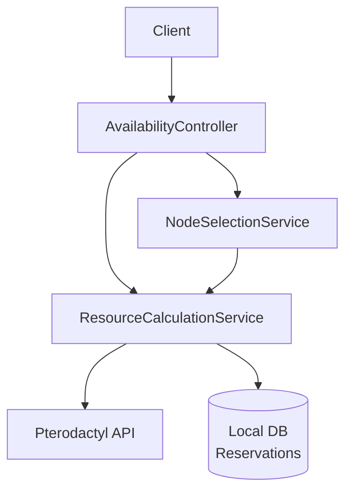
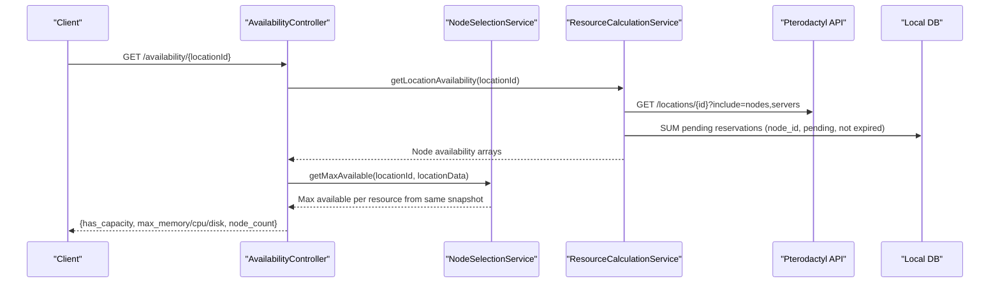
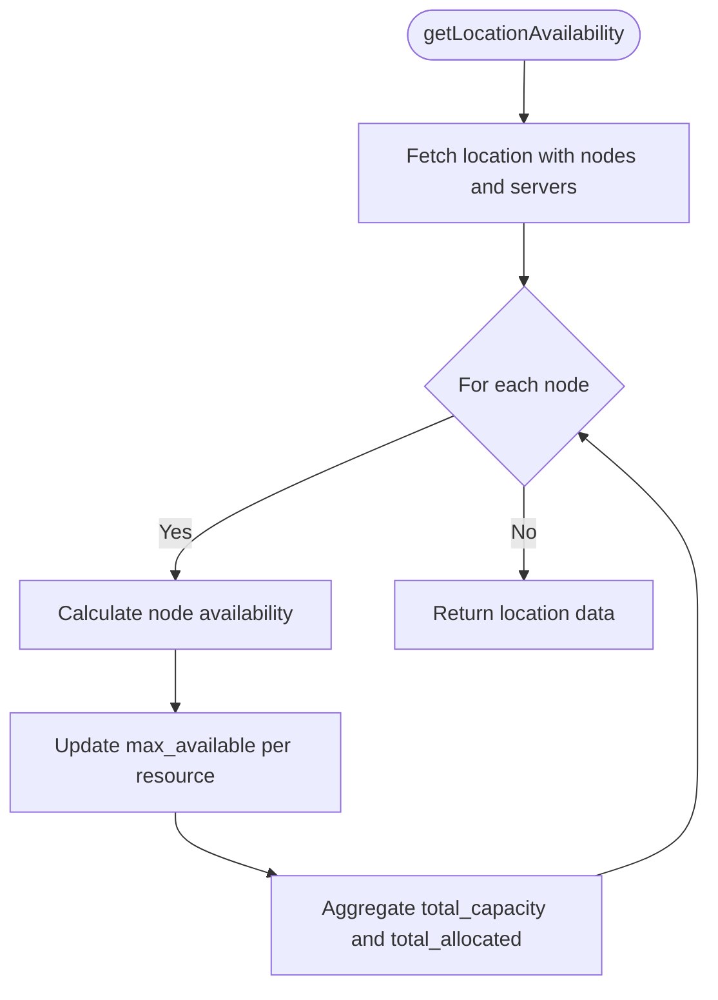
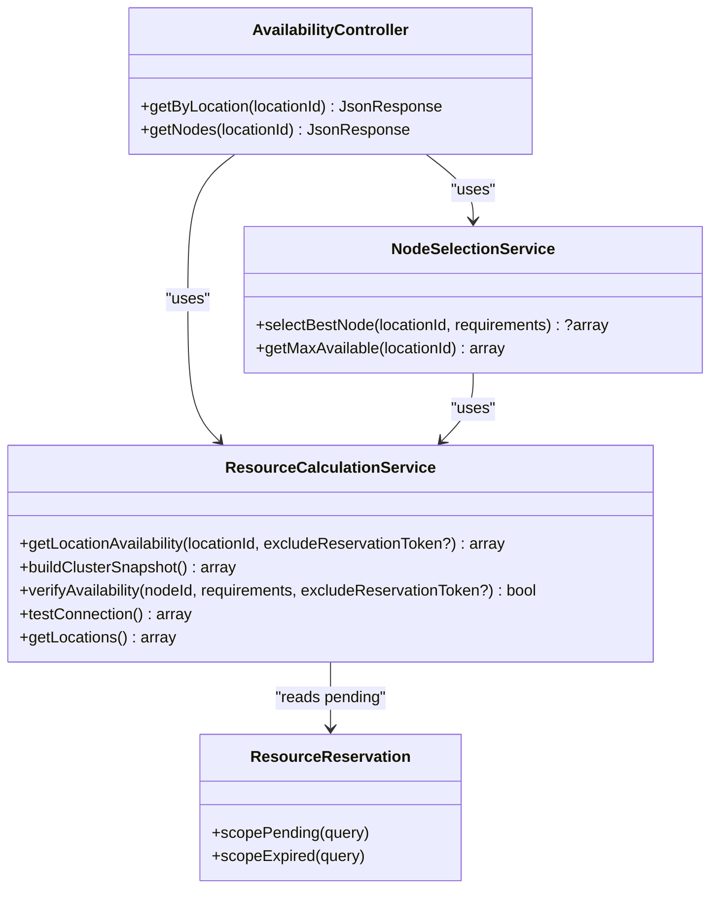

# Resource Calculation Service

<cite>
**Referenced Files in This Document**
- [ResourceCalculationService.php](file://Services/ResourceCalculationService.php)
- [AvailabilityController.php](file://Http/Controllers/Api/AvailabilityController.php)
- [NodeSelectionService.php](file://Services/NodeSelectionService.php)
- [ResourceReservation.php](file://Models/ResourceReservation.php)
- [DECISIONS.md](file://DECISIONS.md)
- [ResourceCalculationServiceTest.php](file://tests/Unit/ResourceCalculationServiceTest.php)
</cite>

## Table of Contents
1. [Introduction](#introduction)
2. [Project Structure](#project-structure)
3. [Core Components](#core-components)
4. [Architecture Overview](#architecture-overview)
5. [Detailed Component Analysis](#detailed-component-analysis)
6. [Dependency Analysis](#dependency-analysis)
7. [Performance Considerations](#performance-considerations)
8. [Troubleshooting Guide](#troubleshooting-guide)
9. [Conclusion](#conclusion)

## Introduction
This document explains the ResourceCalculationService, which provides real-time resource availability for Pterodactyl nodes and locations. It queries the Pterodactyl API directly on every call to ensure customers always see current utilization, including pending reservations held during checkout. The service avoids caching by design to prevent stale data and overselling risks. It exposes methods to compute location-level availability, build a full cluster snapshot with batched API calls, and verify node-level availability at payment time. It also documents error handling, connection timeouts, degraded mode behavior when Pterodactyl is unavailable, and how node-level versus location-level calculations differ and aggregate across multiple nodes.

## Project Structure
The extension integrates with Paymenter through controllers and services:
- AvailabilityController exposes customer-facing endpoints that rely on ResourceCalculationService and NodeSelectionService.
- ResourceCalculationService performs all live Pterodactyl API calls and computes availability.
- NodeSelectionService selects the best node based on available resources using the same real-time data.
- ResourceReservation models pending reservations that reduce available capacity until they expire or are confirmed/cancelled.

**Diagram sources**
- [AvailabilityController.php:22-69](file://Http/Controllers/Api/AvailabilityController.php#L22-L69)
- [ResourceCalculationService.php:26-141](file://Services/ResourceCalculationService.php#L26-L141)
- [NodeSelectionService.php:22-86](file://Services/NodeSelectionService.php#L22-L86)

**Section sources**
- [AvailabilityController.php:22-69](file://Http/Controllers/Api/AvailabilityController.php#L22-L69)
- [ResourceCalculationService.php:26-141](file://Services/ResourceCalculationService.php#L26-L141)
- [NodeSelectionService.php:22-86](file://Services/NodeSelectionService.php#L22-L86)

## Core Components
- ResourceCalculationService: Real-time availability calculations against Pterodactyl, including node and location aggregation, pending reservation accounting, and cluster snapshot building.
- AvailabilityController: Customer-facing API endpoints returning per-location maximum allocatable resources and node counts without exposing raw node details.
- NodeSelectionService: Best-fit node selection algorithm using weighted headroom scoring over memory, disk, and CPU.
- ResourceReservation: Database-backed reservation model representing pending allocations with TTL and status transitions.

Key responsibilities:
- Always query Pterodactyl live; never cache results.
- Include pending reservations in availability to avoid overselling.
- Aggregate per-node metrics into per-location summaries for customer endpoints.
- Provide admin-only detailed node data via separate routes (not covered here).

**Section sources**
- [ResourceCalculationService.php:26-141](file://Services/ResourceCalculationService.php#L26-L141)
- [AvailabilityController.php:22-69](file://Http/Controllers/Api/AvailabilityController.php#L22-L69)
- [NodeSelectionService.php:22-86](file://Services/NodeSelectionService.php#L22-L86)
- [ResourceReservation.php:10-65](file://Models/ResourceReservation.php#L10-L65)

## Architecture Overview
The service follows a real-time architecture:
- Every availability request triggers live HTTP calls to Pterodactyl.
- Pending reservations are read from the local database and subtracted from effective capacity.
- Location-level availability aggregates node-level results, tracking maximum available per resource and totals.
- Cluster snapshot batches API calls to minimize overhead while still avoiding cache.

**Diagram sources**
- [AvailabilityController.php:22-51](file://Http/Controllers/Api/AvailabilityController.php#L22-L51)
- [NodeSelectionService.php:22-86](file://Services/NodeSelectionService.php#L22-L86)
- [ResourceCalculationService.php:26-141](file://Services/ResourceCalculationService.php#L26-L141)

## Detailed Component Analysis

### ResourceCalculationService
This service implements the real-time availability engine. It reads configuration from the extension settings, makes authenticated requests to Pterodactyl, and combines them with pending reservations to compute accurate availability.

Key methods:
- getLocationAvailability(locationId, excludeReservationToken?): Returns per-location availability with node-level detail, maximum available per resource, total capacity, and total allocated. It iterates nodes in the location, calculates each node’s availability, and aggregates metrics.
- buildClusterSnapshot(): Builds a comprehensive snapshot of the entire cluster, including locations, nodes, and per-location aggregations. It batches API calls by fetching locations once and nodes with included servers in a single paginated call when possible. If the primary method fails due to server inclusion issues, it falls back to fetching nodes and then mapping servers from a separate servers index endpoint.
- verifyAvailability(nodeId, requirements, excludeReservationToken?): Confirms whether a specific node can satisfy resource requirements at payment time, excluding the caller’s own pending reservation if provided.

Data flow highlights:
- Effective capacity accounts for Pterodactyl overallocation on memory and disk; CPU uses thread count times 100 without overallocation.
- Pending reservations are summed per node and subtracted from available resources.
- Utilization percentages include both allocated and reserved resources relative to effective totals.

Error handling and resilience:
- pterodactylGet() sets per-attempt timeout and connect timeout, retries only on connection errors, sanitizes exceptions, and throws meaningful runtime exceptions for rate limits and non-JSON responses.
- buildClusterSnapshot() catches failures and returns a degraded snapshot with an error flag when Pterodactyl is down or returns 5xx errors.

Examples of usage patterns:
- Customer endpoints use getLocationAvailability to determine maximum allocatable resources per location without exposing node internals.
- Admin tools may use buildClusterSnapshot for deep visibility into node-level metrics.

**Diagram sources**
- [ResourceCalculationService.php:26-67](file://Services/ResourceCalculationService.php#L26-L67)

**Section sources**
- [ResourceCalculationService.php:26-141](file://Services/ResourceCalculationService.php#L26-L141)
- [ResourceCalculationService.php:146-214](file://Services/ResourceCalculationService.php#L146-L214)
- [ResourceCalculationService.php:227-257](file://Services/ResourceCalculationService.php#L227-L257)
- [ResourceCalculationService.php:452-498](file://Services/ResourceCalculationService.php#L452-L498)

### AvailabilityController
Exposes customer-facing availability endpoints:
- getByLocation(locationId): Fetches location availability once, then passes that snapshot to NodeSelectionService.getMaxAvailable to return has_capacity and per-resource booleans from one consistent panel read.
- getNodes(locationId): Returns location-level availability data for admin purposes.

Error handling:
- Catches exceptions and returns structured JSON with success=false and a message.

Security and privacy:
- Customer endpoints do not expose raw node names, FQDNs, maintenance flags, or per-node capacity; only aggregated maxima are returned.

**Section sources**
- [AvailabilityController.php:22-69](file://Http/Controllers/Api/AvailabilityController.php#L22-L69)

### NodeSelectionService
Implements best-fit node selection with weighted headroom:
- selectBestNode(locationId, requirements): Filters out maintenance-mode nodes and those that cannot meet requirements, then scores candidates by remaining headroom weighted toward memory (50%), disk (35%), and CPU (15%).
- getMaxAvailable(locationId): Delegates to ResourceCalculationService to obtain per-location maximum available resources.

**Section sources**
- [NodeSelectionService.php:22-86](file://Services/NodeSelectionService.php#L22-L86)

### ResourceReservation Model
Represents pending reservations with fields for token, idempotency key, user/service references, node/location IDs, requested resources, pricing metadata, status, notes, and expiration. Scopes provide convenient queries for pending and expired reservations used by availability calculations.

**Section sources**
- [ResourceReservation.php:10-65](file://Models/ResourceReservation.php#L10-L65)

## Dependency Analysis
- AvailabilityController depends on ResourceCalculationService and NodeSelectionService to compose customer-facing responses.
- NodeSelectionService depends on ResourceCalculationService for real-time availability data.
- ResourceCalculationService depends on:
  - Pterodactyl API for node and server data.
  - Local database for pending reservations.
  - Extension settings for API URL and key.

**Diagram sources**
- [AvailabilityController.php:22-69](file://Http/Controllers/Api/AvailabilityController.php#L22-L69)
- [NodeSelectionService.php:22-86](file://Services/NodeSelectionService.php#L22-L86)
- [ResourceCalculationService.php:26-141](file://Services/ResourceCalculationService.php#L26-L141)
- [ResourceReservation.php:10-65](file://Models/ResourceReservation.php#L10-L65)

**Section sources**
- [AvailabilityController.php:22-69](file://Http/Controllers/Api/AvailabilityController.php#L22-L69)
- [NodeSelectionService.php:22-86](file://Services/NodeSelectionService.php#L22-L86)
- [ResourceCalculationService.php:26-141](file://Services/ResourceCalculationService.php#L26-L141)
- [ResourceReservation.php:10-65](file://Models/ResourceReservation.php#L10-L65)

## Performance Considerations
- Real-time API calls: No caching ensures accuracy but introduces latency. Each availability check hits Pterodactyl directly.
- Batched API calls: buildClusterSnapshot() fetches locations once and attempts to include servers in the nodes endpoint to minimize round trips. If server inclusion fails, it falls back to fetching nodes and then mapping servers from a separate servers index, keeping call count bounded.
- Pagination: All list endpoints paginate and aggregate results to handle large clusters efficiently.
- Timeouts and retries: pterodactylGet() uses short per-attempt timeouts and retries only on transient connection errors, limiting worst-case latency.
- Aggregation cost: Per-location availability loops over nodes and sums metrics; this is linear in the number of nodes and acceptable for typical cluster sizes.

[No sources needed since this section provides general guidance]

## Troubleshooting Guide
Common issues and strategies:
- Connection failures: pterodactylGet() catches connection exceptions, reports diagnostics, and throws a sanitized runtime exception. buildClusterSnapshot() detects these and returns a degraded snapshot with an error flag instead of failing the whole request.
- Rate limiting: A 429 response triggers a specific runtime exception instructing callers to retry after a delay. Tests assert that 429 does not trigger retries.
- Server errors: 5xx responses are treated as Pterodactyl being unavailable; buildClusterSnapshot() returns a degraded snapshot so consumers can degrade gracefully.
- Invalid payloads: Non-JSON responses raise a runtime exception indicating invalid payload; tests validate this behavior.
- Missing node location: getNodeLocation() validates presence of location_id and throws if absent; tests assert the expected exception pattern.

Operational tips:
- Use testConnection() for admin diagnostics; it uses a longer timeout and returns structured success/failure with node count and panel version header.
- When debugging availability discrepancies, inspect pending reservations in the local database and confirm their status and expiration.

**Section sources**
- [ResourceCalculationService.php:157-195](file://Services/ResourceCalculationService.php#L157-L195)
- [ResourceCalculationService.php:452-498](file://Services/ResourceCalculationService.php#L452-L498)
- [ResourceCalculationService.php:410-424](file://Services/ResourceCalculationService.php#L410-L424)
- [ResourceCalculationServiceTest.php:53-139](file://tests/Unit/ResourceCalculationServiceTest.php#L53-L139)

## Conclusion
ResourceCalculationService delivers accurate, real-time resource availability by querying Pterodactyl directly and incorporating pending reservations. Its architectural decision to avoid caching prevents staleness and overselling risks. Key methods provide flexible views:
- getLocationAvailability() for per-location summaries with node-level detail.
- buildClusterSnapshot() for comprehensive cluster-wide snapshots with batched API calls and graceful degradation.
- verifyAvailability() for precise node-level checks at payment time, optionally excluding the caller’s own reservation.

The service balances accuracy with performance through pagination, batching, and targeted retries, while ensuring robust error handling and safe degradation when Pterodactyl is unavailable. Customer-facing endpoints remain privacy-preserving by exposing only aggregated maxima, reserving node-level detail for administrative use.

[No sources needed since this section summarizes without analyzing specific files]
