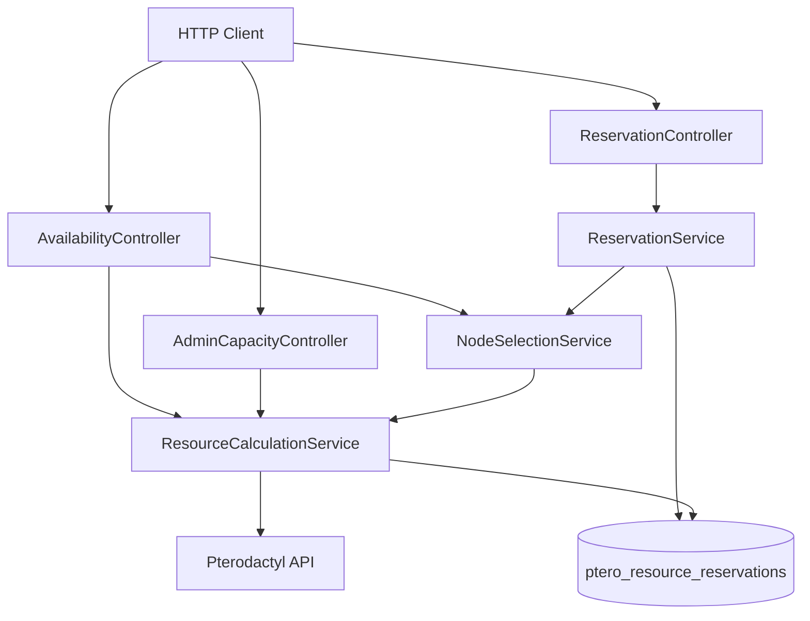
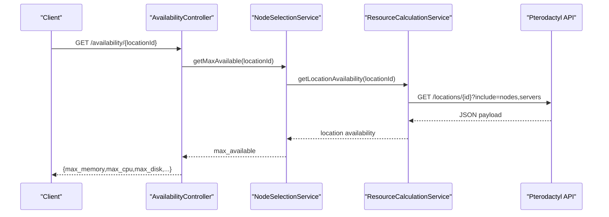
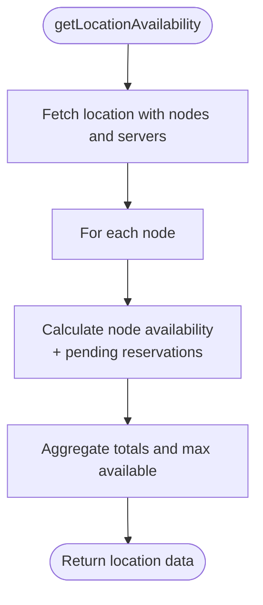
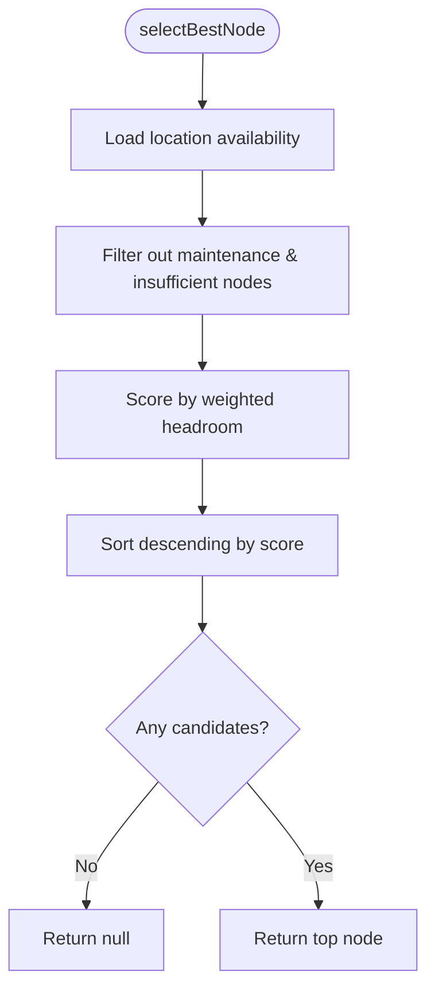
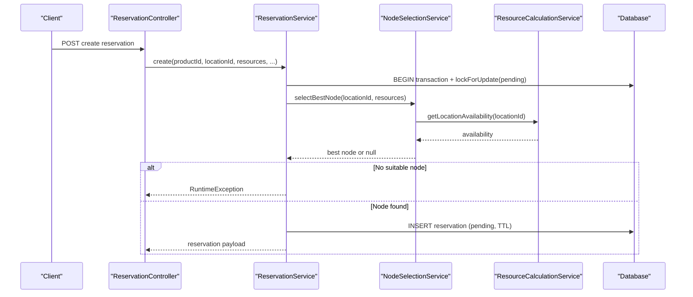
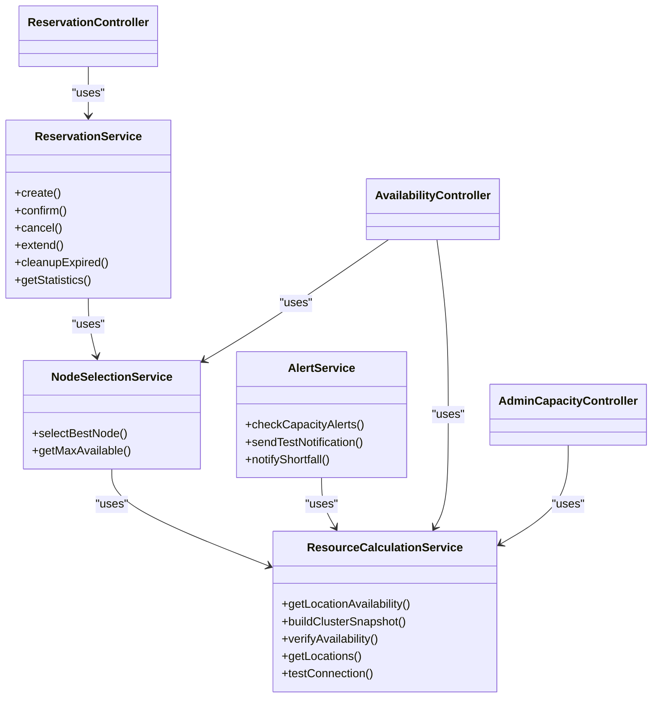

# Service Layer Design

<cite>
**Referenced Files in This Document**
- [DynamicPterodactyl.php](file://DynamicPterodactyl.php)
- [ResourceCalculationService.php](file://Services/ResourceCalculationService.php)
- [ReservationService.php](file://Services/ReservationService.php)
- [NodeSelectionService.php](file://Services/NodeSelectionService.php)
- [AlertService.php](file://Services/AlertService.php)
- [AvailabilityController.php](file://Http/Controllers/Api/AvailabilityController.php)
- [ReservationController.php](file://Http/Controllers/Api/ReservationController.php)
- [AdminCapacityController.php](file://Http/Controllers/Api/Admin/AdminCapacityController.php)
- [ResourceReservation.php](file://Models/ResourceReservation.php)
</cite>

## Table of Contents
1. [Introduction](#introduction)
2. [Project Structure](#project-structure)
3. [Core Components](#core-components)
4. [Architecture Overview](#architecture-overview)
5. [Detailed Component Analysis](#detailed-component-analysis)
6. [Dependency Analysis](#dependency-analysis)
7. [Performance Considerations](#performance-considerations)
8. [Troubleshooting Guide](#troubleshooting-guide)
9. [Conclusion](#conclusion)

## Introduction
This document explains the service-oriented design that encapsulates business logic for dynamic Pterodactyl resource reservations and availability. It focuses on how ResourceCalculationService, ReservationService, and NodeSelectionService provide clear separation between API controllers and data access layers, how they compose together to implement complex workflows, and how errors, transactions, and external API failures are handled gracefully.

The extension integrates with Paymenter’s event system to create, confirm, cancel, and expire reservations while keeping Pterodactyl API calls isolated in a dedicated service layer. Customer-facing endpoints return only aggregate capacity information; node-level details are reserved for admin endpoints.

## Project Structure
At a high level:
- Controllers expose HTTP APIs and delegate business logic to services.
- Services encapsulate domain rules, coordinate external systems (Pterodactyl), and manage persistence through database queries or models.
- The extension bootstraps routes, policies, listeners, and scheduled tasks from DynamicPterodactyl.php.

**Diagram sources**
- [AvailabilityController.php:22-69](file://Http/Controllers/Api/AvailabilityController.php#L22-L69)
- [ReservationController.php:24-136](file://Http/Controllers/Api/ReservationController.php#L24-L136)
- [AdminCapacityController.php:17-61](file://Http/Controllers/Api/Admin/AdminCapacityController.php#L17-L61)
- [NodeSelectionService.php:22-86](file://Services/NodeSelectionService.php#L22-L86)
- [ResourceCalculationService.php:26-141](file://Services/ResourceCalculationService.php#L26-L141)
- [ReservationService.php:43-141](file://Services/ReservationService.php#L43-L141)

**Section sources**
- [DynamicPterodactyl.php:96-127](file://DynamicPterodactyl.php#L96-L127)

## Core Components
- ResourceCalculationService: Encapsulates all Pterodactyl API interactions, builds real-time availability snapshots, and aggregates per-location and per-node metrics. It never caches responses; it batches API calls where possible and degrades gracefully when the upstream is unavailable.
- NodeSelectionService: Implements best-fit node selection using weighted headroom scoring across memory, disk, and CPU. It depends on ResourceCalculationService for live availability.
- ReservationService: Manages reservation lifecycle (create, confirm, cancel, extend, cleanup). It uses database transactions with pessimistic locking and idempotency support. It delegates node selection to NodeSelectionService.
- AlertService: Periodically checks capacity thresholds and sends notifications via email/webhooks. It depends on ResourceCalculationService for current utilization data.
- Controllers: Thin HTTP boundaries that validate input, enforce authorization, and call services. They translate exceptions into user-friendly JSON responses.

**Section sources**
- [ResourceCalculationService.php:10-222](file://Services/ResourceCalculationService.php#L10-L222)
- [NodeSelectionService.php:5-86](file://Services/NodeSelectionService.php#L5-L86)
- [ReservationService.php:16-454](file://Services/ReservationService.php#L16-L454)
- [AlertService.php:19-393](file://Services/AlertService.php#L19-L393)
- [AvailabilityController.php:9-71](file://Http/Controllers/Api/AvailabilityController.php#L9-L71)
- [ReservationController.php:13-138](file://Http/Controllers/Api/ReservationController.php#L13-L138)
- [AdminCapacityController.php:8-63](file://Http/Controllers/Api/Admin/AdminCapacityController.php#L8-L63)

## Architecture Overview
The service layer enforces strict boundaries:
- Controllers do not talk directly to Pterodactyl or perform complex calculations.
- ResourceCalculationService isolates all Pterodactyl API calls, including pagination, retries, error mapping, and degraded snapshot fallbacks.
- NodeSelectionService contains allocation strategy without leaking implementation details to controllers.
- ReservationService owns reservation state transitions, concurrency control, and idempotency guarantees.

**Diagram sources**
- [AvailabilityController.php:22-52](file://Http/Controllers/Api/AvailabilityController.php#L22-L52)
- [NodeSelectionService.php:81-86](file://Services/NodeSelectionService.php#L81-L86)
- [ResourceCalculationService.php:26-67](file://Services/ResourceCalculationService.php#L26-L67)
- [ResourceCalculationService.php:359-384](file://Services/ResourceCalculationService.php#L359-L384)

## Detailed Component Analysis

### ResourceCalculationService
Responsibilities:
- Fetch locations and nodes from Pterodactyl, including server relationships.
- Compute effective node capacity using overallocation settings and thread-based CPU.
- Aggregate per-location totals and maximum available resources.
- Provide cluster snapshot building with fallback behavior when Pterodactyl is partially unavailable.
- Validate availability at payment time against pending reservations.

Key behaviors:
- Real-time API calls with short timeouts and limited retries for connection errors.
- Paginated retrieval for large clusters.
- Degraded snapshot returns minimal structure when upstream fails with server errors or connectivity issues.
- Pending reservations are subtracted from available resources to avoid double-booking.

Error handling:
- Connection exceptions are reported and converted to sanitized runtime exceptions.
- Rate limiting (429) and failed responses are logged and surfaced as runtime exceptions.
- Invalid JSON payloads are rejected with descriptive errors.

**Diagram sources**
- [ResourceCalculationService.php:26-67](file://Services/ResourceCalculationService.php#L26-L67)
- [ResourceCalculationService.php:146-152](file://Services/ResourceCalculationService.php#L146-L152)
- [ResourceCalculationService.php:227-257](file://Services/ResourceCalculationService.php#L227-L257)

**Section sources**
- [ResourceCalculationService.php:26-222](file://Services/ResourceCalculationService.php#L26-L222)
- [ResourceCalculationService.php:291-384](file://Services/ResourceCalculationService.php#L291-L384)
- [ResourceCalculationService.php:410-498](file://Services/ResourceCalculationService.php#L410-L498)

### NodeSelectionService
Responsibilities:
- Select the best node for given resource requirements using a weighted headroom algorithm.
- Skip nodes in maintenance mode.
- Expose maximum allocatable resources per location.

Algorithm highlights:
- Filters candidates by hard constraints (memory, CPU, disk).
- Scores remaining headroom with weights: memory 50%, disk 35%, CPU 15%.
- Returns the highest-scoring node or null if none fit.

**Diagram sources**
- [NodeSelectionService.php:22-76](file://Services/NodeSelectionService.php#L22-L76)

**Section sources**
- [NodeSelectionService.php:22-86](file://Services/NodeSelectionService.php#L22-L86)

### ReservationService
Responsibilities:
- Create reservations with idempotency and TTL.
- Confirm, cancel, and extend reservations with authorization checks.
- Clean up expired reservations via scheduled task.
- Provide statistics and query builders for admin usage.

Concurrency and transactions:
- Uses database transactions with lockForUpdate on pending reservations within the target location to prevent races.
- Retries up to five times on deadlock conditions.
- Idempotency key deduplicates concurrent requests and handles race conditions after unique constraint violations.

Authorization:
- Optional actor parameter triggers policy checks for confirm/cancel/extend operations.

Auditability:
- Audits key actions (create, confirm, cancel, extend, batch expiry) via a shared concern.

**Diagram sources**
- [ReservationController.php:24-60](file://Http/Controllers/Api/ReservationController.php#L24-L60)
- [ReservationService.php:43-141](file://Services/ReservationService.php#L43-L141)
- [NodeSelectionService.php:22-76](file://Services/NodeSelectionService.php#L22-L76)
- [ResourceCalculationService.php:26-67](file://Services/ResourceCalculationService.php#L26-L67)

**Section sources**
- [ReservationService.php:43-141](file://Services/ReservationService.php#L43-L141)
- [ReservationService.php:166-281](file://Services/ReservationService.php#L166-L281)
- [ReservationService.php:387-454](file://Services/ReservationService.php#L387-L454)

### AlertService
Responsibilities:
- Periodically check capacity thresholds per configured scope (all locations or specific location).
- Send notifications via email and webhooks with delivery logging and failure events.
- Notify administrators about reservation shortfalls or state drift after payment.

Error handling:
- Gracefully logs and reports notification failures without breaking alert cycles.
- Emits an event when all channels fail to deliver.

**Section sources**
- [AlertService.php:33-75](file://Services/AlertService.php#L33-L75)
- [AlertService.php:128-248](file://Services/AlertService.php#L128-L248)
- [AlertService.php:328-361](file://Services/AlertService.php#L328-L361)

### Controllers and Boundaries
- AvailabilityController: Returns aggregate capacity and node counts for customer-facing endpoints. It does not expose raw node identifiers or per-node capacities.
- ReservationController: Validates input, authorizes actions, and delegates to ReservationService. Converts service exceptions into consistent JSON responses.
- AdminCapacityController: Builds a full cluster snapshot for administrative use, including node-level details.

**Section sources**
- [AvailabilityController.php:22-69](file://Http/Controllers/Api/AvailabilityController.php#L22-L69)
- [ReservationController.php:24-136](file://Http/Controllers/Api/ReservationController.php#L24-L136)
- [AdminCapacityController.php:17-61](file://Http/Controllers/Api/Admin/AdminCapacityController.php#L17-L61)

## Dependency Analysis
Service composition and coupling:
- NodeSelectionService depends on ResourceCalculationService for live availability.
- ReservationService depends on NodeSelectionService for node choice and on the database for persistence.
- AlertService depends on ResourceCalculationService for utilization metrics.
- Controllers depend on services only; no direct Pterodactyl calls or complex logic.

**Diagram sources**
- [NodeSelectionService.php:5-86](file://Services/NodeSelectionService.php#L5-L86)
- [ReservationService.php:16-454](file://Services/ReservationService.php#L16-L454)
- [AlertService.php:19-393](file://Services/AlertService.php#L19-L393)
- [AvailabilityController.php:9-71](file://Http/Controllers/Api/AvailabilityController.php#L9-L71)
- [ReservationController.php:13-138](file://Http/Controllers/Api/ReservationController.php#L13-L138)
- [AdminCapacityController.php:8-63](file://Http/Controllers/Api/Admin/AdminCapacityController.php#L8-L63)

**Section sources**
- [DynamicPterodactyl.php:96-127](file://DynamicPterodactyl.php#L96-L127)

## Performance Considerations
- Real-time availability: All availability data is fetched live from Pterodactyl; there is no caching. This ensures accuracy but increases dependency on upstream latency.
- Batching and pagination: Cluster snapshot and node fetching use paginated endpoints to handle large deployments efficiently.
- Short timeouts and retries: API calls use small timeouts and retry only on transient connection errors to avoid long request lifetimes.
- Aggregation cost: Per-location aggregation computes totals and maximums across nodes; consider rate limits and upstream performance under load.
- Scheduled tasks: Cleanup and alert checks run periodically to keep state consistent and reduce controller burden.

[No sources needed since this section provides general guidance]

## Troubleshooting Guide
Common issues and where to look:
- Pterodactyl connectivity failures:
  - ResourceCalculationService converts connection exceptions into sanitized runtime exceptions and reports them. Check logs for connection diagnostics and ensure configuration values are correct.
  - Use testConnection to verify panel URL and API key.
- Rate limiting:
  - 429 responses are treated as rate limit errors; back off and retry later.
- Invalid responses:
  - Non-JSON or malformed payloads cause explicit errors; inspect upstream changes or version compatibility.
- Deadlocks during reservation creation:
  - ReservationService retries up to five times on deadlocks. If persistent, review contention on pending reservations and consider tuning workload patterns.
- Authorization failures:
  - ReservationService enforces policies when an actor is provided. Ensure users have appropriate permissions to confirm, cancel, or extend reservations.
- Notification delivery failures:
  - AlertService logs channel-specific failures and emits events when all channels fail. Inspect delivery logs and recipient configurations.

**Section sources**
- [ResourceCalculationService.php:158-195](file://Services/ResourceCalculationService.php#L158-L195)
- [ResourceCalculationService.php:452-498](file://Services/ResourceCalculationService.php#L452-L498)
- [ReservationService.php:43-141](file://Services/ReservationService.php#L43-L141)
- [ReservationService.php:166-281](file://Services/ReservationService.php#L166-L281)
- [AlertService.php:128-248](file://Services/AlertService.php#L128-L248)

## Conclusion
The service layer cleanly separates concerns:
- ResourceCalculationService isolates Pterodactyl integration and provides accurate, real-time availability.
- NodeSelectionService encapsulates allocation strategy and remains independent of persistence and HTTP concerns.
- ReservationService manages reservation state, concurrency, idempotency, and auditability while delegating node selection.
- Controllers remain thin, focusing on validation, authorization, and response formatting.

This design supports robust workflows across checkout, confirmation, cancellation, and monitoring, while maintaining clear boundaries and graceful degradation when external systems are unavailable.

[No sources needed since this section summarizes without analyzing specific files]
