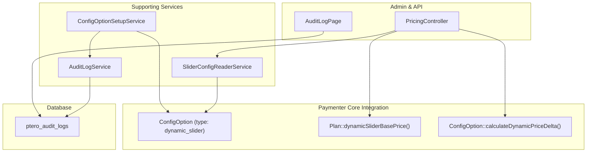
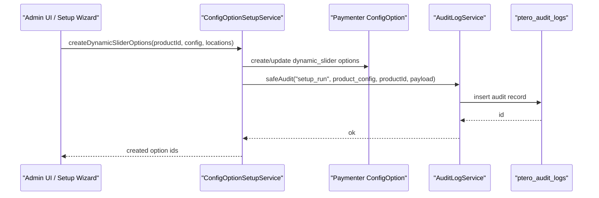
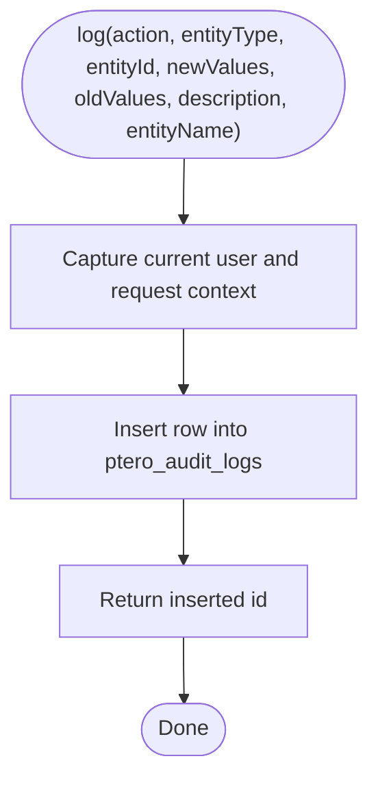
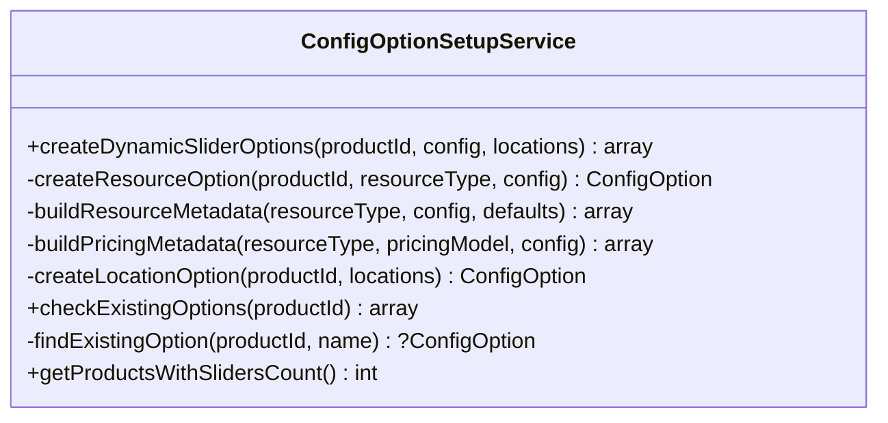
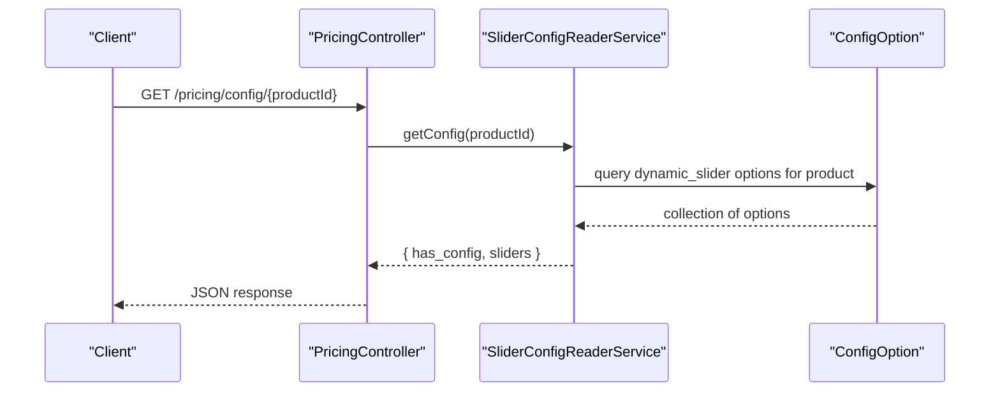
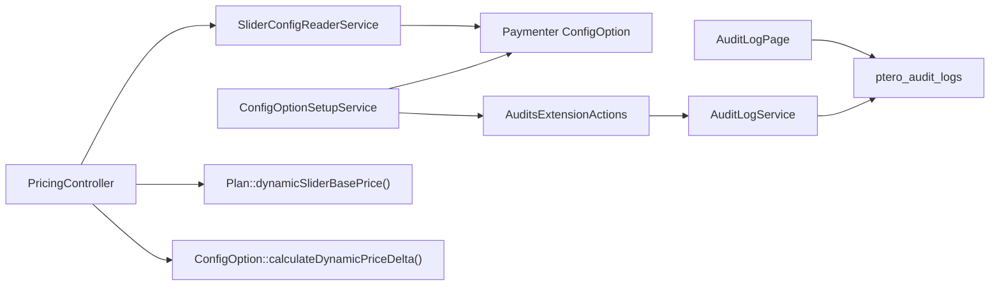

# Supporting Services

> **Preserved Qoder snapshot.** This deep-dive page is retained so the earlier Wiki work and its source trail are not lost. For the reconciled implementation, [[Architecture Overview|Architecture-Overview]] is canonical; references below to retired controllers, listeners, services, or API shapes are historical.

<cite>
**Referenced Files in This Document**
- [AuditLogService.php](https://github.com/ObsidianNetwork/dynamic-pterodactyl/blob/6b7f83bda6f7c3fe014d52428b31af1638daa6cc/Services/AuditLogService.php)
- [ConfigOptionSetupService.php](https://github.com/ObsidianNetwork/dynamic-pterodactyl/blob/6b7f83bda6f7c3fe014d52428b31af1638daa6cc/Services/ConfigOptionSetupService.php)
- [SliderConfigReaderService.php](https://github.com/ObsidianNetwork/dynamic-pterodactyl/blob/6b7f83bda6f7c3fe014d52428b31af1638daa6cc/Services/SliderConfigReaderService.php)
- [AuditsExtensionActions.php](https://github.com/ObsidianNetwork/dynamic-pterodactyl/blob/6b7f83bda6f7c3fe014d52428b31af1638daa6cc/Services/Concerns/AuditsExtensionActions.php)
- [AuditLog.php](https://github.com/ObsidianNetwork/dynamic-pterodactyl/blob/6b7f83bda6f7c3fe014d52428b31af1638daa6cc/Models/AuditLog.php)
- [2025_01_01_000003_create_ptero_audit_logs_table.php](https://github.com/ObsidianNetwork/dynamic-pterodactyl/blob/6b7f83bda6f7c3fe014d52428b31af1638daa6cc/database/migrations/2025_01_01_000003_create_ptero_audit_logs_table.php)
- [PricingController.php](https://github.com/ObsidianNetwork/dynamic-pterodactyl/blob/6b7f83bda6f7c3fe014d52428b31af1638daa6cc/Http/Controllers/Api/PricingController.php)
- [AuditLogPage.php](https://github.com/ObsidianNetwork/dynamic-pterodactyl/blob/6b7f83bda6f7c3fe014d52428b31af1638daa6cc/Admin/Pages/AuditLogPage.php)
</cite>

## Table of Contents
1. [Introduction](#introduction)
2. [Project Structure](#project-structure)
3. [Core Components](#core-components)
4. [Architecture Overview](#architecture-overview)
5. [Detailed Component Analysis](#detailed-component-analysis)
6. [Dependency Analysis](#dependency-analysis)
7. [Performance Considerations](#performance-considerations)
8. [Troubleshooting Guide](#troubleshooting-guide)
9. [Conclusion](#conclusion)

## Introduction
This document explains the supporting services that provide auxiliary functionality to the core reservation system:
- AuditLogService: records administrative actions and system events for compliance and debugging.
- ConfigOptionSetupService: sets up dynamic slider configurations and pricing options within Paymenter’s extension framework.
- SliderConfigReaderService: reads and interprets slider configuration metadata from Paymenter core. It never calculates prices; it only exposes slider settings for UI and API consumption.

These services integrate with Paymenter’s configuration system, support admin workflows, and enable the extension to present and manage dynamic resource sliders while delegating all pricing math to Paymenter core.

## Project Structure
The supporting services are located under Services and are used by Admin pages and API controllers. The audit trail is persisted via a dedicated table created by a migration and consumed by an admin page.

**Diagram sources**
- [AuditLogService.php:15-41](https://github.com/ObsidianNetwork/dynamic-pterodactyl/blob/6b7f83bda6f7c3fe014d52428b31af1638daa6cc/Services/AuditLogService.php#L15-L41)
- [ConfigOptionSetupService.php:44-77](https://github.com/ObsidianNetwork/dynamic-pterodactyl/blob/6b7f83bda6f7c3fe014d52428b31af1638daa6cc/Services/ConfigOptionSetupService.php#L44-L77)
- [SliderConfigReaderService.php:14-53](https://github.com/ObsidianNetwork/dynamic-pterodactyl/blob/6b7f83bda6f7c3fe014d52428b31af1638daa6cc/Services/SliderConfigReaderService.php#L14-L53)
- [PricingController.php:24-145](https://github.com/ObsidianNetwork/dynamic-pterodactyl/blob/6b7f83bda6f7c3fe014d52428b31af1638daa6cc/Http/Controllers/Api/PricingController.php#L24-L145)
- [AuditLogPage.php:31-80](https://github.com/ObsidianNetwork/dynamic-pterodactyl/blob/6b7f83bda6f7c3fe014d52428b31af1638daa6cc/Admin/Pages/AuditLogPage.php#L31-L80)
- [2025_01_01_000003_create_ptero_audit_logs_table.php:11-47](https://github.com/ObsidianNetwork/dynamic-pterodactyl/blob/6b7f83bda6f7c3fe014d52428b31af1638daa6cc/database/migrations/2025_01_01_000003_create_ptero_audit_logs_table.php#L11-L47)

**Section sources**
- [AuditLogService.php:1-82](https://github.com/ObsidianNetwork/dynamic-pterodactyl/blob/6b7f83bda6f7c3fe014d52428b31af1638daa6cc/Services/AuditLogService.php#L1-L82)
- [ConfigOptionSetupService.php:1-259](https://github.com/ObsidianNetwork/dynamic-pterodactyl/blob/6b7f83bda6f7c3fe014d52428b31af1638daa6cc/Services/ConfigOptionSetupService.php#L1-L259)
- [SliderConfigReaderService.php:1-68](https://github.com/ObsidianNetwork/dynamic-pterodactyl/blob/6b7f83bda6f7c3fe014d52428b31af1638daa6cc/Services/SliderConfigReaderService.php#L1-L68)
- [PricingController.php:1-157](https://github.com/ObsidianNetwork/dynamic-pterodactyl/blob/6b7f83bda6f7c3fe014d52428b31af1638daa6cc/Http/Controllers/Api/PricingController.php#L1-L157)
- [AuditLogPage.php:1-104](https://github.com/ObsidianNetwork/dynamic-pterodactyl/blob/6b7f83bda6f7c3fe014d52428b31af1638daa6cc/Admin/Pages/AuditLogPage.php#L1-L104)
- [2025_01_01_000003_create_ptero_audit_logs_table.php:1-54](https://github.com/ObsidianNetwork/dynamic-pterodactyl/blob/6b7f83bda6f7c3fe014d52428b31af1638daa6cc/database/migrations/2025_01_01_000003_create_ptero_audit_logs_table.php#L1-L54)

## Core Components
- AuditLogService: Provides methods to log actions and retrieve filtered logs. Captures user context, request metadata, and before/after values for changes.
- ConfigOptionSetupService: Creates or updates dynamic slider ConfigOptions for memory, CPU, disk, and optional location selection. Validates pricing metadata and persists them as part of Paymenter’s ConfigOption model.
- SliderConfigReaderService: Reads dynamic slider ConfigOptions for a product and returns a normalized payload for frontend/API use. It does not perform any price calculations.

Key responsibilities:
- Maintain an auditable trail of setup runs and administrative actions.
- Configure slider ranges, steps, defaults, units, and pricing models through metadata.
- Expose slider configuration to clients without exposing internal pricing logic.

**Section sources**
- [AuditLogService.php:15-81](https://github.com/ObsidianNetwork/dynamic-pterodactyl/blob/6b7f83bda6f7c3fe014d52428b31af1638daa6cc/Services/AuditLogService.php#L15-L81)
- [ConfigOptionSetupService.php:44-171](https://github.com/ObsidianNetwork/dynamic-pterodactyl/blob/6b7f83bda6f7c3fe014d52428b31af1638daa6cc/Services/ConfigOptionSetupService.php#L44-L171)
- [SliderConfigReaderService.php:14-66](https://github.com/ObsidianNetwork/dynamic-pterodactyl/blob/6b7f83bda6f7c3fe014d52428b31af1638daa6cc/Services/SliderConfigReaderService.php#L14-L66)

## Architecture Overview
The supporting services form a clear separation of concerns:
- Setup writes slider metadata into Paymenter’s ConfigOption store.
- Read-only access exposes slider definitions to clients.
- Pricing calculation remains in Paymenter core; this extension delegates to Plan and ConfigOption methods.
- Audit logging captures setup and administrative actions for compliance and debugging.

**Diagram sources**
- [ConfigOptionSetupService.php:44-77](https://github.com/ObsidianNetwork/dynamic-pterodactyl/blob/6b7f83bda6f7c3fe014d52428b31af1638daa6cc/Services/ConfigOptionSetupService.php#L44-L77)
- [AuditsExtensionActions.php:10-32](https://github.com/ObsidianNetwork/dynamic-pterodactyl/blob/6b7f83bda6f7c3fe014d52428b31af1638daa6cc/Services/Concerns/AuditsExtensionActions.php#L10-L32)
- [AuditLogService.php:15-41](https://github.com/ObsidianNetwork/dynamic-pterodactyl/blob/6b7f83bda6f7c3fe014d52428b31af1638daa6cc/Services/AuditLogService.php#L15-L41)
- [2025_01_01_000003_create_ptero_audit_logs_table.php:11-47](https://github.com/ObsidianNetwork/dynamic-pterodactyl/blob/6b7f83bda6f7c3fe014d52428b31af1638daa6cc/database/migrations/2025_01_01_000003_create_ptero_audit_logs_table.php#L11-L47)

## Detailed Component Analysis

### AuditLogService
Purpose:
- Persist administrative actions and system events with rich context for compliance and debugging.
- Provide filtering and retrieval capabilities for audit data.

Key behaviors:
- Logging: Captures actor identity (user or system), action type, entity identifiers, descriptive text, and request context (IP, user agent). Stores old/new values as JSON when provided.
- Querying: Supports filters by entity type, entity id, user id, action, and date range. Returns results ordered by creation time with a configurable limit.
- Entity history: Convenience method to fetch recent history for a specific entity.

Integration points:
- Used via the AuditsExtensionActions trait to safely write audit entries even if logging fails, ensuring business operations remain resilient.
- Consumed by the Admin Audit Log page to display actionable insights.

Data model:
- Persists to ptero_audit_logs with indexes on entity_type/entity_id, user_id, created_at, and action for efficient querying.

**Diagram sources**
- [AuditLogService.php:15-41](https://github.com/ObsidianNetwork/dynamic-pterodactyl/blob/6b7f83bda6f7c3fe014d52428b31af1638daa6cc/Services/AuditLogService.php#L15-L41)
- [2025_01_01_000003_create_ptero_audit_logs_table.php:11-47](https://github.com/ObsidianNetwork/dynamic-pterodactyl/blob/6b7f83bda6f7c3fe014d52428b31af1638daa6cc/database/migrations/2025_01_01_000003_create_ptero_audit_logs_table.php#L11-L47)

Usage examples:
- Setup wizard triggers a “setup_run” audit entry after successfully creating slider options for a product.
- Administrative actions across the extension can call the service to maintain a consistent audit trail.

**Section sources**
- [AuditLogService.php:15-81](https://github.com/ObsidianNetwork/dynamic-pterodactyl/blob/6b7f83bda6f7c3fe014d52428b31af1638daa6cc/Services/AuditLogService.php#L15-L81)
- [AuditsExtensionActions.php:10-32](https://github.com/ObsidianNetwork/dynamic-pterodactyl/blob/6b7f83bda6f7c3fe014d52428b31af1638daa6cc/Services/Concerns/AuditsExtensionActions.php#L10-L32)
- [AuditLogPage.php:31-80](https://github.com/ObsidianNetwork/dynamic-pterodactyl/blob/6b7f83bda6f7c3fe014d52428b31af1638daa6cc/Admin/Pages/AuditLogPage.php#L31-L80)
- [2025_01_01_000003_create_ptero_audit_logs_table.php:11-47](https://github.com/ObsidianNetwork/dynamic-pterodactyl/blob/6b7f83bda6f7c3fe014d52428b31af1638daa6cc/database/migrations/2025_01_01_000003_create_ptero_audit_logs_table.php#L11-L47)

### ConfigOptionSetupService
Purpose:
- Create or update dynamic slider ConfigOptions for memory, CPU, and disk per product.
- Optionally create a Location select option with child options for each available location.
- Validate and persist pricing metadata using Paymenter’s validation rules.

Key behaviors:
- Batch creation inside a database transaction to ensure consistency.
- Skips resources whose enable flags are disabled.
- Builds metadata including min/max/step/default values, units, display units/divisors, and pricing model details.
- Uses Paymenter’s DynamicSliderPricingRule to validate pricing metadata before persisting.
- Detects existing slider options by name or metadata resource_type and updates rather than duplicates.
- Emits an audit event for successful setup runs.

Pricing metadata models supported:
- Linear: base_price plus rate_per_unit.
- Tiered: base_price plus tiered rates.
- Base + Addon: base_price with included_units and overage_rate.

Integration points:
- Called by Admin Setup Wizard to configure products with dynamic sliders.
- Integrates with Paymenter’s ConfigOption model so that later pricing flows can read these settings.

**Diagram sources**
- [ConfigOptionSetupService.php:44-258](https://github.com/ObsidianNetwork/dynamic-pterodactyl/blob/6b7f83bda6f7c3fe014d52428b31af1638daa6cc/Services/ConfigOptionSetupService.php#L44-L258)

Example workflow:
- Admin submits slider configuration for a product.
- Service creates or updates dynamic_slider options for enabled resources.
- If locations are provided, a parent Location option and its child options are created.
- On success, an audit entry records which sliders were configured and how many.

**Section sources**
- [ConfigOptionSetupService.php:44-171](https://github.com/ObsidianNetwork/dynamic-pterodactyl/blob/6b7f83bda6f7c3fe014d52428b31af1638daa6cc/Services/ConfigOptionSetupService.php#L44-L171)
- [ConfigOptionSetupService.php:173-258](https://github.com/ObsidianNetwork/dynamic-pterodactyl/blob/6b7f83bda6f7c3fe014d52428b31af1638daa6cc/Services/ConfigOptionSetupService.php#L173-L258)
- [AuditsExtensionActions.php:10-32](https://github.com/ObsidianNetwork/dynamic-pterodactyl/blob/6b7f83bda6f7c3fe014d52428b31af1638daa6cc/Services/Concerns/AuditsExtensionActions.php#L10-L32)

### SliderConfigReaderService
Purpose:
- Read dynamic slider configuration for a product and return a normalized payload for API/frontend consumption.
- Explicitly does not calculate prices; it only reads slider settings.

Key behaviors:
- Retrieves dynamic_slider ConfigOptions associated with a product.
- Normalizes metadata into a consistent structure including ranges, steps, units, and pricing model info.
- Returns a flag indicating whether any slider configuration exists for the product.

Integration points:
- Used by PricingController to expose slider configuration via API endpoints.
- Works alongside Paymenter core pricing methods that actually compute costs.

**Diagram sources**
- [SliderConfigReaderService.php:14-66](https://github.com/ObsidianNetwork/dynamic-pterodactyl/blob/6b7f83bda6f7c3fe014d52428b31af1638daa6cc/Services/SliderConfigReaderService.php#L14-L66)
- [PricingController.php:127-145](https://github.com/ObsidianNetwork/dynamic-pterodactyl/blob/6b7f83bda6f7c3fe014d52428b31af1638daa6cc/Http/Controllers/Api/PricingController.php#L127-L145)

Important note:
- Price calculation is delegated to Paymenter core methods (Plan::dynamicSliderBasePrice and ConfigOption::calculateDynamicPriceDelta). This service only provides configuration metadata.

**Section sources**
- [SliderConfigReaderService.php:14-66](https://github.com/ObsidianNetwork/dynamic-pterodactyl/blob/6b7f83bda6f7c3fe014d52428b31af1638daa6cc/Services/SliderConfigReaderService.php#L14-L66)
- [PricingController.php:24-145](https://github.com/ObsidianNetwork/dynamic-pterodactyl/blob/6b7f83bda6f7c3fe014d52428b31af1638daa6cc/Http/Controllers/Api/PricingController.php#L24-L145)

## Dependency Analysis
- ConfigOptionSetupService depends on Paymenter’s ConfigOption model and validation rules to persist slider metadata. It also uses the AuditsExtensionActions trait to emit audit events.
- SliderConfigReaderService depends on Paymenter’s ConfigOption model to read slider metadata.
- PricingController consumes SliderConfigReaderService for configuration and delegates pricing computation to Paymenter core.
- AuditLogService writes to the ptero_audit_logs table and is consumed by the Admin Audit Log page.

**Diagram sources**
- [ConfigOptionSetupService.php:44-171](https://github.com/ObsidianNetwork/dynamic-pterodactyl/blob/6b7f83bda6f7c3fe014d52428b31af1638daa6cc/Services/ConfigOptionSetupService.php#L44-L171)
- [AuditsExtensionActions.php:10-32](https://github.com/ObsidianNetwork/dynamic-pterodactyl/blob/6b7f83bda6f7c3fe014d52428b31af1638daa6cc/Services/Concerns/AuditsExtensionActions.php#L10-L32)
- [AuditLogService.php:15-41](https://github.com/ObsidianNetwork/dynamic-pterodactyl/blob/6b7f83bda6f7c3fe014d52428b31af1638daa6cc/Services/AuditLogService.php#L15-L41)
- [SliderConfigReaderService.php:14-66](https://github.com/ObsidianNetwork/dynamic-pterodactyl/blob/6b7f83bda6f7c3fe014d52428b31af1638daa6cc/Services/SliderConfigReaderService.php#L14-L66)
- [PricingController.php:24-145](https://github.com/ObsidianNetwork/dynamic-pterodactyl/blob/6b7f83bda6f7c3fe014d52428b31af1638daa6cc/Http/Controllers/Api/PricingController.php#L24-L145)
- [AuditLogPage.php:31-80](https://github.com/ObsidianNetwork/dynamic-pterodactyl/blob/6b7f83bda6f7c3fe014d52428b31af1638daa6cc/Admin/Pages/AuditLogPage.php#L31-L80)
- [2025_01_01_000003_create_ptero_audit_logs_table.php:11-47](https://github.com/ObsidianNetwork/dynamic-pterodactyl/blob/6b7f83bda6f7c3fe014d52428b31af1638daa6cc/database/migrations/2025_01_01_000003_create_ptero_audit_logs_table.php#L11-L47)

**Section sources**
- [ConfigOptionSetupService.php:44-258](https://github.com/ObsidianNetwork/dynamic-pterodactyl/blob/6b7f83bda6f7c3fe014d52428b31af1638daa6cc/Services/ConfigOptionSetupService.php#L44-L258)
- [SliderConfigReaderService.php:14-66](https://github.com/ObsidianNetwork/dynamic-pterodactyl/blob/6b7f83bda6f7c3fe014d52428b31af1638daa6cc/Services/SliderConfigReaderService.php#L14-L66)
- [PricingController.php:24-145](https://github.com/ObsidianNetwork/dynamic-pterodactyl/blob/6b7f83bda6f7c3fe014d52428b31af1638daa6cc/Http/Controllers/Api/PricingController.php#L24-L145)
- [AuditLogService.php:15-81](https://github.com/ObsidianNetwork/dynamic-pterodactyl/blob/6b7f83bda6f7c3fe014d52428b31af1638daa6cc/Services/AuditLogService.php#L15-L81)
- [AuditLogPage.php:31-80](https://github.com/ObsidianNetwork/dynamic-pterodactyl/blob/6b7f83bda6f7c3fe014d52428b31af1638daa6cc/Admin/Pages/AuditLogPage.php#L31-L80)

## Performance Considerations
- Audit logging uses direct table inserts with minimal overhead and indexed columns for common queries (entity_type/entity_id, user_id, created_at, action).
- Slider configuration reads are scoped to a single product and filter by type and parent relationships to avoid unnecessary joins.
- Setup operations run within a database transaction to reduce partial writes and ensure consistency during batch creation of options.
- Pricing calculation is intentionally offloaded to Paymenter core, avoiding redundant computations in the extension.

[No sources needed since this section provides general guidance]

## Troubleshooting Guide
Common issues and diagnostics:
- Audit write failures: The AuditsExtensionActions trait wraps audit calls in try/catch and logs warnings if writing fails, then reports exceptions. Check application logs for “extension audit write failed” messages.
- Missing slider configuration: If the pricing config endpoint returns no sliders, verify that dynamic_slider options exist for the product and that they have non-null parent_id where appropriate.
- Validation errors during setup: Pricing metadata is validated against Paymenter’s rule set. Invalid configurations will throw exceptions; review error messages returned by the validator.

Operational checks:
- Confirm the ptero_audit_logs table exists and contains expected rows after setup runs.
- Use the Admin Audit Log page to filter by action, entity type, and date range to investigate changes.

**Section sources**
- [AuditsExtensionActions.php:10-32](https://github.com/ObsidianNetwork/dynamic-pterodactyl/blob/6b7f83bda6f7c3fe014d52428b31af1638daa6cc/Services/Concerns/AuditsExtensionActions.php#L10-L32)
- [AuditLogPage.php:31-80](https://github.com/ObsidianNetwork/dynamic-pterodactyl/blob/6b7f83bda6f7c3fe014d52428b31af1638daa6cc/Admin/Pages/AuditLogPage.php#L31-L80)
- [ConfigOptionSetupService.php:117-171](https://github.com/ObsidianNetwork/dynamic-pterodactyl/blob/6b7f83bda6f7c3fe014d52428b31af1638daa6cc/Services/ConfigOptionSetupService.php#L117-L171)
- [2025_01_01_000003_create_ptero_audit_logs_table.php:11-47](https://github.com/ObsidianNetwork/dynamic-pterodactyl/blob/6b7f83bda6f7c3fe014d52428b31af1638daa6cc/database/migrations/2025_01_01_000003_create_ptero_audit_logs_table.php#L11-L47)

## Conclusion
These supporting services provide essential auxiliary functionality:
- AuditLogService ensures every meaningful administrative action is recorded with rich context for compliance and debugging.
- ConfigOptionSetupService configures dynamic slider options and pricing metadata within Paymenter’s framework, enabling flexible resource-based pricing without custom pricing logic in the extension.
- SliderConfigReaderService offers a stable, read-only interface to slider configuration for clients, keeping pricing calculations centralized in Paymenter core.

Together, they enable robust configuration management, transparent auditing, and clean integration with Paymenter’s core systems while preserving separation of concerns and performance.