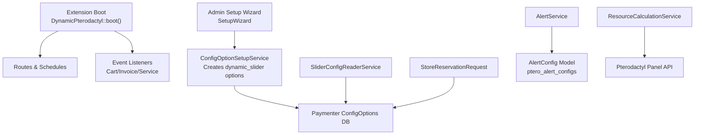
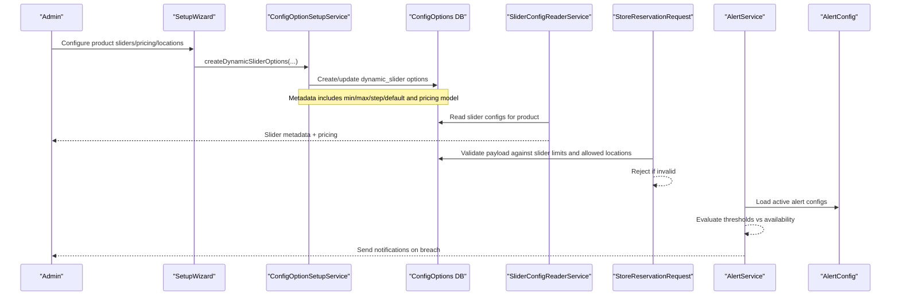
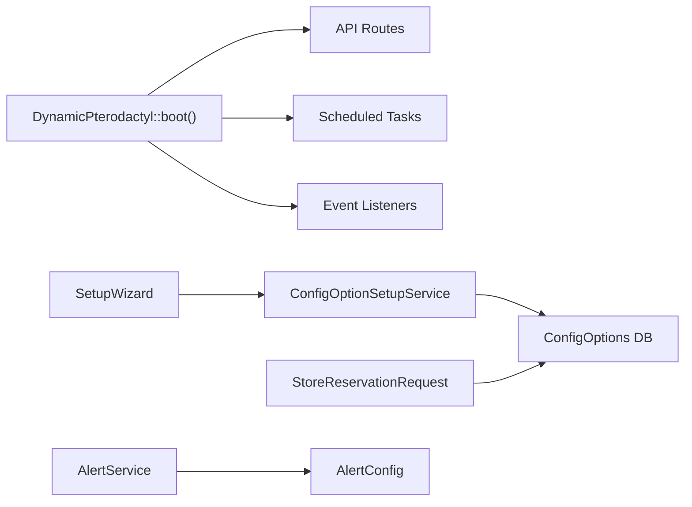

# Configuration

> **Preserved Qoder snapshot.** This deep-dive page is retained so the earlier Wiki work and its source trail are not lost. For the reconciled implementation, [[Architecture Overview|Architecture-Overview]] is canonical; references below to retired controllers, listeners, services, or API shapes are historical.

## Current Configuration Contract

The extension settings contain the canonical Pterodactyl URL, encrypted
application API key, exclusive-provisioning confirmation, quote rate-limit
controls, and alert/scheduler settings. Product resource definitions live in
native Paymenter config options. Physical CPU capacity and overcommit behavior
live in per-node `NodeCapacityPolicy` records rather than in panel payloads or
global slider defaults.

Never place the API key in a URL, log message, rate-limit key, or customer
response.

<cite>
**Referenced Files in This Document**
- [DynamicPterodactyl.php](https://github.com/ObsidianNetwork/dynamic-pterodactyl/blob/6b7f83bda6f7c3fe014d52428b31af1638daa6cc/DynamicPterodactyl.php)
- [SetupWizard.php](https://github.com/ObsidianNetwork/dynamic-pterodactyl/blob/6b7f83bda6f7c3fe014d52428b31af1638daa6cc/Admin/Pages/SetupWizard.php)
- [ConfigOptionSetupService.php](https://github.com/ObsidianNetwork/dynamic-pterodactyl/blob/6b7f83bda6f7c3fe014d52428b31af1638daa6cc/Services/ConfigOptionSetupService.php)
- [SliderConfigReaderService.php](https://github.com/ObsidianNetwork/dynamic-pterodactyl/blob/6b7f83bda6f7c3fe014d52428b31af1638daa6cc/Services/SliderConfigReaderService.php)
- [AlertConfig.php](https://github.com/ObsidianNetwork/dynamic-pterodactyl/blob/6b7f83bda6f7c3fe014d52428b31af1638daa6cc/Models/AlertConfig.php)
- [2025_01_01_000004_create_ptero_alert_configs_table.php](https://github.com/ObsidianNetwork/dynamic-pterodactyl/blob/6b7f83bda6f7c3fe014d52428b31af1638daa6cc/database/migrations/2025_01_01_000004_create_ptero_alert_configs_table.php)
- [StoreReservationRequest.php](https://github.com/ObsidianNetwork/dynamic-pterodactyl/blob/6b7f83bda6f7c3fe014d52428b31af1638daa6cc/Http/Requests/StoreReservationRequest.php)
- [CartItemCreatedListener.php](https://github.com/ObsidianNetwork/dynamic-pterodactyl/blob/6b7f83bda6f7c3fe014d52428b31af1638daa6cc/Listeners/CartItemCreatedListener.php)
- [AlertService.php](https://github.com/ObsidianNetwork/dynamic-pterodactyl/blob/6b7f83bda6f7c3fe014d52428b31af1638daa6cc/Services/AlertService.php)
</cite>

## Table of Contents
1. [Introduction](#introduction)
2. [Project Structure](#project-structure)
3. [Core Components](#core-components)
4. [Architecture Overview](#architecture-overview)
5. [Detailed Component Analysis](#detailed-component-analysis)
6. [Dependency Analysis](#dependency-analysis)
7. [Performance Considerations](#performance-considerations)
8. [Troubleshooting Guide](#troubleshooting-guide)
9. [Conclusion](#conclusion)

## Introduction
This document explains how to configure the Dynamic Pterodactyl extension for Paymenter. It covers:
- Connecting to your Pterodactyl panel (URL and API key)
- Reservation TTL behavior
- Alert thresholds and notifications
- Configuring dynamic slider options per product (memory, CPU, disk)
- Pricing rules via Paymenter’s native pricing engine
- Location-based restrictions
- Environment variables, file-based settings, and runtime configuration changes
- Validation rules, defaults, inheritance/override mechanisms, and troubleshooting

The extension integrates with Paymenter’s dynamic_slider option type and does not calculate prices itself; it reads slider metadata and manages reservations and availability checks.

## Project Structure
Configuration spans several layers:
- Extension-level settings for Pterodactyl connectivity and reservation TTL
- Per-product slider and pricing configuration created through the admin setup wizard
- Alert configurations stored in the database
- Runtime validation of incoming requests against configured sliders and allowed locations
- Event-driven reservation lifecycle tied to cart and invoice events

**Diagram sources**
- [DynamicPterodactyl.php:96-127](https://github.com/ObsidianNetwork/dynamic-pterodactyl/blob/6b7f83bda6f7c3fe014d52428b31af1638daa6cc/DynamicPterodactyl.php#L96-L127)
- [SetupWizard.php:80-409](https://github.com/ObsidianNetwork/dynamic-pterodactyl/blob/6b7f83bda6f7c3fe014d52428b31af1638daa6cc/Admin/Pages/SetupWizard.php#L80-L409)
- [ConfigOptionSetupService.php:44-206](https://github.com/ObsidianNetwork/dynamic-pterodactyl/blob/6b7f83bda6f7c3fe014d52428b31af1638daa6cc/Services/ConfigOptionSetupService.php#L44-L206)
- [SliderConfigReaderService.php:14-66](https://github.com/ObsidianNetwork/dynamic-pterodactyl/blob/6b7f83bda6f7c3fe014d52428b31af1638daa6cc/Services/SliderConfigReaderService.php#L14-L66)
- [StoreReservationRequest.php:51-138](https://github.com/ObsidianNetwork/dynamic-pterodactyl/blob/6b7f83bda6f7c3fe014d52428b31af1638daa6cc/Http/Requests/StoreReservationRequest.php#L51-L138)
- [AlertService.php:77-126](https://github.com/ObsidianNetwork/dynamic-pterodactyl/blob/6b7f83bda6f7c3fe014d52428b31af1638daa6cc/Services/AlertService.php#L77-L126)
- [AlertConfig.php:8-55](https://github.com/ObsidianNetwork/dynamic-pterodactyl/blob/6b7f83bda6f7c3fe014d52428b31af1638daa6cc/Models/AlertConfig.php#L8-L55)

**Section sources**
- [DynamicPterodactyl.php:45-75](https://github.com/ObsidianNetwork/dynamic-pterodactyl/blob/6b7f83bda6f7c3fe014d52428b31af1638daa6cc/DynamicPterodactyl.php#L45-L75)
- [DynamicPterodactyl.php:96-127](https://github.com/ObsidianNetwork/dynamic-pterodactyl/blob/6b7f83bda6f7c3fe014d52428b31af1638daa6cc/DynamicPterodactyl.php#L96-L127)
- [SetupWizard.php:50-78](https://github.com/ObsidianNetwork/dynamic-pterodactyl/blob/6b7f83bda6f7c3fe014d52428b31af1638daa6cc/Admin/Pages/SetupWizard.php#L50-L78)
- [ConfigOptionSetupService.php:14-42](https://github.com/ObsidianNetwork/dynamic-pterodactyl/blob/6b7f83bda6f7c3fe014d52428b31af1638daa6cc/Services/ConfigOptionSetupService.php#L14-L42)
- [AlertConfig.php:12-34](https://github.com/ObsidianNetwork/dynamic-pterodactyl/blob/6b7f83bda6f7c3fe014d52428b31af1638daa6cc/Models/AlertConfig.php#L12-L34)
- [2025_01_01_000004_create_ptero_alert_configs_table.php:11-42](https://github.com/ObsidianNetwork/dynamic-pterodactyl/blob/6b7f83bda6f7c3fe014d52428b31af1638daa6cc/database/migrations/2025_01_01_000004_create_ptero_alert_configs_table.php#L11-L42)

## Core Components
- Extension configuration fields: Pterodactyl URL, API key, reservation TTL
- Admin setup wizard: creates dynamic_slider options and optional location selector per product
- Slider config reader: exposes slider metadata and pricing model info to APIs/frontend
- Request validation: enforces slider ranges, steps, and allowed locations at reservation time
- Alert configuration: per-location or global thresholds with notification cooldowns

Key behaviors:
- Reservations use a configurable TTL during checkout
- Alerts evaluate memory and disk utilization against warning/critical thresholds
- Pricing is defined by Paymenter’s dynamic_slider pricing engine using metadata produced by the setup service

**Section sources**
- [DynamicPterodactyl.php:48-75](https://github.com/ObsidianNetwork/dynamic-pterodactyl/blob/6b7f83bda6f7c3fe014d52428b31af1638daa6cc/DynamicPterodactyl.php#L48-L75)
- [SetupWizard.php:80-409](https://github.com/ObsidianNetwork/dynamic-pterodactyl/blob/6b7f83bda6f7c3fe014d52428b31af1638daa6cc/Admin/Pages/SetupWizard.php#L80-L409)
- [SliderConfigReaderService.php:14-66](https://github.com/ObsidianNetwork/dynamic-pterodactyl/blob/6b7f83bda6f7c3fe014d52428b31af1638daa6cc/Services/SliderConfigReaderService.php#L14-L66)
- [StoreReservationRequest.php:51-138](https://github.com/ObsidianNetwork/dynamic-pterodactyl/blob/6b7f83bda6f7c3fe014d52428b31af1638daa6cc/Http/Requests/StoreReservationRequest.php#L51-L138)
- [AlertConfig.php:12-34](https://github.com/ObsidianNetwork/dynamic-pterodactyl/blob/6b7f83bda6f7c3fe014d52428b31af1638daa6cc/Models/AlertConfig.php#L12-L34)

## Architecture Overview
The extension wires together configuration creation, request-time validation, and alerting:

**Diagram sources**
- [SetupWizard.php:429-488](https://github.com/ObsidianNetwork/dynamic-pterodactyl/blob/6b7f83bda6f7c3fe014d52428b31af1638daa6cc/Admin/Pages/SetupWizard.php#L429-L488)
- [ConfigOptionSetupService.php:44-206](https://github.com/ObsidianNetwork/dynamic-pterodactyl/blob/6b7f83bda6f7c3fe014d52428b31af1638daa6cc/Services/ConfigOptionSetupService.php#L44-L206)
- [SliderConfigReaderService.php:14-66](https://github.com/ObsidianNetwork/dynamic-pterodactyl/blob/6b7f83bda6f7c3fe014d52428b31af1638daa6cc/Services/SliderConfigReaderService.php#L14-L66)
- [StoreReservationRequest.php:51-138](https://github.com/ObsidianNetwork/dynamic-pterodactyl/blob/6b7f83bda6f7c3fe014d52428b31af1638daa6cc/Http/Requests/StoreReservationRequest.php#L51-L138)
- [AlertService.php:77-126](https://github.com/ObsidianNetwork/dynamic-pterodactyl/blob/6b7f83bda6f7c3fe014d52428b31af1638daa6cc/Services/AlertService.php#L77-L126)
- [AlertConfig.php:12-34](https://github.com/ObsidianNetwork/dynamic-pterodactyl/blob/6b7f83bda6f7c3fe014d52428b31af1638daa6cc/Models/AlertConfig.php#L12-L34)

## Detailed Component Analysis

### Extension Settings: Pterodactyl Connection and Reservation TTL
- Pterodactyl Panel URL: required text field validated as a URL
- Pterodactyl API Key: required password field for application API access
- Reservation TTL (minutes): integer between 5 and 60, default 15; controls how long a reservation is held during checkout

These are managed via the extension’s configuration method and used by services that interact with Pterodactyl and manage reservations.

**Section sources**
- [DynamicPterodactyl.php:48-75](https://github.com/ObsidianNetwork/dynamic-pterodactyl/blob/6b7f83bda6f7c3fe014d52428b31af1638daa6cc/DynamicPterodactyl.php#L48-L75)

### Dynamic Slider Options: Creation and Metadata
The setup wizard creates dynamic_slider options per product for memory, CPU, and disk. For each resource:
- Min, max, step, default values are set (display units shown in UI; internal units differ)
- Pricing model selected from linear, tiered, or base_addon
- Optional location selector can be created to restrict which Pterodactyl locations are available for this product

Metadata written into ConfigOptions includes:
- resource_type, min, max, step, default, unit, display_unit, display_divisor
- pricing.model and model-specific parameters (rate_per_unit, tiers, included_units, overage_rate)

Validation of pricing metadata uses Paymenter’s rule before saving.

**Section sources**
- [SetupWizard.php:80-409](https://github.com/ObsidianNetwork/dynamic-pterodactyl/blob/6b7f83bda6f7c3fe014d52428b31af1638daa6cc/Admin/Pages/SetupWizard.php#L80-L409)
- [ConfigOptionSetupService.php:44-171](https://github.com/ObsidianNetwork/dynamic-pterodactyl/blob/6b7f83bda6f7c3fe014d52428b31af1638daa6cc/Services/ConfigOptionSetupService.php#L44-L171)
- [ConfigOptionSetupService.php:173-206](https://github.com/ObsidianNetwork/dynamic-pterodactyl/blob/6b7f83bda6f7c3fe014d52428b31af1638daa6cc/Services/ConfigOptionSetupService.php#L173-L206)

### Slider Configuration Reader
Reads dynamic_slider options for a product and returns slider definitions suitable for frontend/API consumption:
- Includes range, step, default, units, and pricing metadata
- Handles both array and JSON-encoded metadata

**Section sources**
- [SliderConfigReaderService.php:14-66](https://github.com/ObsidianNetwork/dynamic-pterodactyl/blob/6b7f83bda6f7c3fe014d52428b31af1638daa6cc/Services/SliderConfigReaderService.php#L14-L66)

### Request Validation: Slider Ranges and Allowed Locations
When creating a reservation:
- The request validates that the product has dynamic_slider configuration
- Required resources must match configured sliders
- Values must be within configured min/max and follow step increments
- If a location selector exists for the product, only configured locations are allowed

Errors are added to the validator when constraints fail.

**Section sources**
- [StoreReservationRequest.php:51-138](https://github.com/ObsidianNetwork/dynamic-pterodactyl/blob/6b7f83bda6f7c3fe014d52428b31af1638daa6cc/Http/Requests/StoreReservationRequest.php#L51-L138)

### Location-Based Restrictions
- The setup wizard can create a “Location” select option with child options for each chosen Pterodactyl location
- At reservation time, the request ensures the selected location_id belongs to the product’s allowed list
- During cart processing, the listener resolves the actual Pterodactyl location ID from the selected child option

**Section sources**
- [SetupWizard.php:391-404](https://github.com/ObsidianNetwork/dynamic-pterodactyl/blob/6b7f83bda6f7c3fe014d52428b31af1638daa6cc/Admin/Pages/SetupWizard.php#L391-L404)
- [ConfigOptionSetupService.php:173-206](https://github.com/ObsidianNetwork/dynamic-pterodactyl/blob/6b7f83bda6f7c3fe014d52428b31af1638daa6cc/Services/ConfigOptionSetupService.php#L173-L206)
- [StoreReservationRequest.php:60-64](https://github.com/ObsidianNetwork/dynamic-pterodactyl/blob/6b7f83bda6f7c3fe014d52428b31af1638daa6cc/Http/Requests/StoreReservationRequest.php#L60-L64)
- [CartItemCreatedListener.php:137-159](https://github.com/ObsidianNetwork/dynamic-pterodactyl/blob/6b7f83bda6f7c3fe014d52428b31af1638daa6cc/Listeners/CartItemCreatedListener.php#L137-L159)

### Alert Thresholds and Notifications
Alerts are configured per location or globally:
- Warning and critical thresholds for memory and disk utilization (percentages)
- Notification channels: email and webhook
- Cooldown minutes to prevent spam
- Active/inactive status

The alert service evaluates utilization and sends notifications when thresholds are exceeded.

**Section sources**
- [2025_01_01_000004_create_ptero_alert_configs_table.php:11-42](https://github.com/ObsidianNetwork/dynamic-pterodactyl/blob/6b7f83bda6f7c3fe014d52428b31af1638daa6cc/database/migrations/2025_01_01_000004_create_ptero_alert_configs_table.php#L11-L42)
- [AlertConfig.php:12-34](https://github.com/ObsidianNetwork/dynamic-pterodactyl/blob/6b7f83bda6f7c3fe014d52428b31af1638daa6cc/Models/AlertConfig.php#L12-L34)
- [AlertService.php:77-126](https://github.com/ObsidianNetwork/dynamic-pterodactyl/blob/6b7f83bda6f7c3fe014d52428b31af1638daa6cc/Services/AlertService.php#L77-L126)

### Pricing Rules via Paymenter’s Native Engine
- Pricing models supported: linear, tiered, base_addon
- Base price can be set per product
- Linear: rate_per_unit per resource
- Tiered: volume discounts via tiers
- Base + addon: included units plus overage rates

The setup service builds pricing metadata and validates it using Paymenter’s rule. Actual price calculation is performed by Paymenter core using Plan and ConfigOption methods.

**Section sources**
- [ConfigOptionSetupService.php:117-171](https://github.com/ObsidianNetwork/dynamic-pterodactyl/blob/6b7f83bda6f7c3fe014d52428b31af1638daa6cc/Services/ConfigOptionSetupService.php#L117-L171)
- [SetupWizard.php:113-389](https://github.com/ObsidianNetwork/dynamic-pterodactyl/blob/6b7f83bda6f7c3fe014d52428b31af1638daa6cc/Admin/Pages/SetupWizard.php#L113-L389)

### Environment Variables and File-Based Settings
- Each dynamic_slider option defines an environment variable name (e.g., MEMORY, CPU, DISK, LOCATION) used by Paymenter to resolve values at runtime
- These env_variable values are created automatically when slider/location options are generated

Note: The extension does not define its own environment variables beyond those tied to slider options.

**Section sources**
- [ConfigOptionSetupService.php:96-112](https://github.com/ObsidianNetwork/dynamic-pterodactyl/blob/6b7f83bda6f7c3fe014d52428b31af1638daa6cc/Services/ConfigOptionSetupService.php#L96-L112)
- [ConfigOptionSetupService.php:173-206](https://github.com/ObsidianNetwork/dynamic-pterodactyl/blob/6b7f83bda6f7c3fe014d52428b31af1638daa6cc/Services/ConfigOptionSetupService.php#L173-L206)

### Runtime Configuration Changes
- Slider and pricing metadata are read dynamically from ConfigOptions at request time
- Alert configurations are loaded from the database on each scheduled check
- No static file-based configuration is used for slider/alert settings

**Section sources**
- [SliderConfigReaderService.php:14-66](https://github.com/ObsidianNetwork/dynamic-pterodactyl/blob/6b7f83bda6f7c3fe014d52428b31af1638daa6cc/Services/SliderConfigReaderService.php#L14-L66)
- [AlertService.php:77-126](https://github.com/ObsidianNetwork/dynamic-pterodactyl/blob/6b7f83bda6f7c3fe014d52428b31af1638daa6cc/Services/AlertService.php#L77-L126)

## Dependency Analysis
Configuration flows depend on:
- Extension boot wiring routes, schedules, and event listeners
- Setup wizard invoking the configuration service to persist slider metadata
- Request validation reading slider metadata and allowed locations
- Alert service reading alert configs and evaluating thresholds

**Diagram sources**
- [DynamicPterodactyl.php:96-127](https://github.com/ObsidianNetwork/dynamic-pterodactyl/blob/6b7f83bda6f7c3fe014d52428b31af1638daa6cc/DynamicPterodactyl.php#L96-L127)
- [SetupWizard.php:429-488](https://github.com/ObsidianNetwork/dynamic-pterodactyl/blob/6b7f83bda6f7c3fe014d52428b31af1638daa6cc/Admin/Pages/SetupWizard.php#L429-L488)
- [ConfigOptionSetupService.php:44-206](https://github.com/ObsidianNetwork/dynamic-pterodactyl/blob/6b7f83bda6f7c3fe014d52428b31af1638daa6cc/Services/ConfigOptionSetupService.php#L44-L206)
- [StoreReservationRequest.php:51-138](https://github.com/ObsidianNetwork/dynamic-pterodactyl/blob/6b7f83bda6f7c3fe014d52428b31af1638daa6cc/Http/Requests/StoreReservationRequest.php#L51-L138)
- [AlertService.php:77-126](https://github.com/ObsidianNetwork/dynamic-pterodactyl/blob/6b7f83bda6f7c3fe014d52428b31af1638daa6cc/Services/AlertService.php#L77-L126)
- [AlertConfig.php:12-34](https://github.com/ObsidianNetwork/dynamic-pterodactyl/blob/6b7f83bda6f7c3fe014d52428b31af1638daa6cc/Models/AlertConfig.php#L12-L34)

**Section sources**
- [DynamicPterodactyl.php:96-127](https://github.com/ObsidianNetwork/dynamic-pterodactyl/blob/6b7f83bda6f7c3fe014d52428b31af1638daa6cc/DynamicPterodactyl.php#L96-L127)
- [ConfigOptionSetupService.php:44-206](https://github.com/ObsidianNetwork/dynamic-pterodactyl/blob/6b7f83bda6f7c3fe014d52428b31af1638daa6cc/Services/ConfigOptionSetupService.php#L44-L206)
- [StoreReservationRequest.php:51-138](https://github.com/ObsidianNetwork/dynamic-pterodactyl/blob/6b7f83bda6f7c3fe014d52428b31af1638daa6cc/Http/Requests/StoreReservationRequest.php#L51-L138)
- [AlertService.php:77-126](https://github.com/ObsidianNetwork/dynamic-pterodactyl/blob/6b7f83bda6f7c3fe014d52428b31af1638daa6cc/Services/AlertService.php#L77-L126)

## Performance Considerations
- Pterodactyl API responses are not cached; real-time availability is intentional
- Batched API calls are used where possible to reduce overhead
- Scheduled tasks run with overlap protection to avoid duplicate work
- Database indexes support efficient cleanup and lookup operations

[No sources needed since this section provides general guidance]

## Troubleshooting Guide
Common issues and resolutions:
- Invalid slider values: ensure requested values fall within configured min/max and step increments
- Missing required resources: confirm all configured sliders are provided in the request
- Disallowed location: verify the selected location_id is configured for the product
- Pricing validation errors: review pricing model parameters and ensure they meet Paymenter’s rule requirements
- Alert not firing: check alert config is active, thresholds are set correctly, and cooldown has elapsed

Use the admin setup wizard to re-run configuration updates; warnings will appear if existing slider options are overwritten.

**Section sources**
- [StoreReservationRequest.php:51-138](https://github.com/ObsidianNetwork/dynamic-pterodactyl/blob/6b7f83bda6f7c3fe014d52428b31af1638daa6cc/Http/Requests/StoreReservationRequest.php#L51-L138)
- [SetupWizard.php:411-488](https://github.com/ObsidianNetwork/dynamic-pterodactyl/blob/6b7f83bda6f7c3fe014d52428b31af1638daa6cc/Admin/Pages/SetupWizard.php#L411-L488)
- [AlertService.php:77-126](https://github.com/ObsidianNetwork/dynamic-pterodactyl/blob/6b7f83bda6f7c3fe014d52428b31af1638daa6cc/Services/AlertService.php#L77-L126)

## Conclusion
Configure the Dynamic Pterodactyl extension by:
- Setting Pterodactyl URL and API key in the extension configuration
- Using the admin setup wizard to create dynamic_slider options and pricing rules per product
- Optionally enabling location-based restrictions
- Defining alert thresholds and notification preferences
- Relying on Paymenter’s native pricing engine for price calculations
- Validating runtime inputs against configured sliders and locations

This approach ensures consistent, auditable, and maintainable configuration across products while preserving real-time availability and robust reservation handling.
