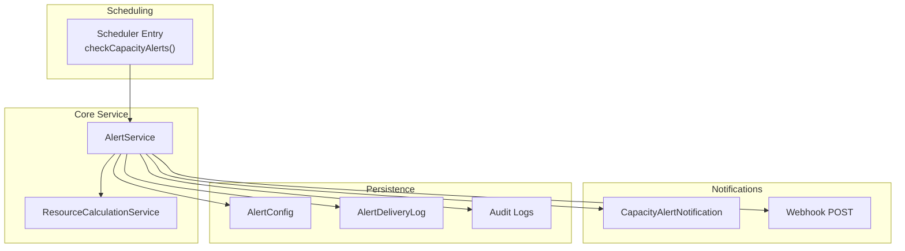
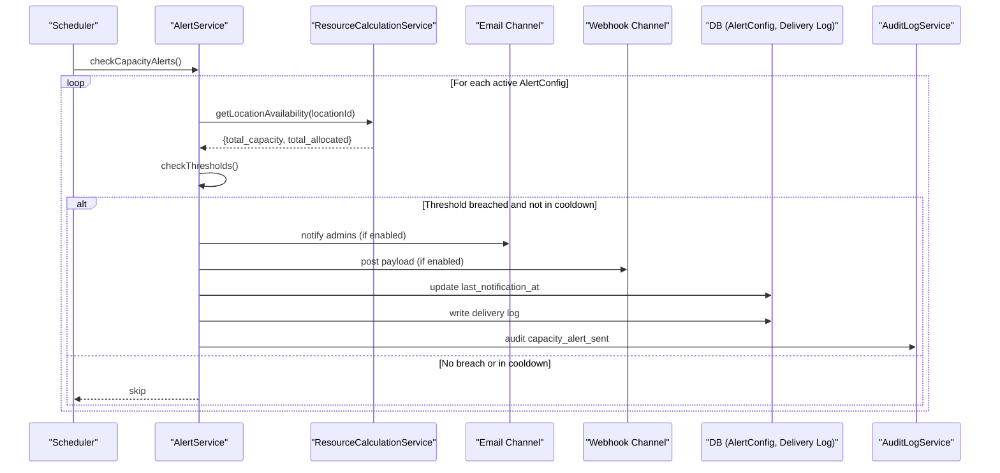
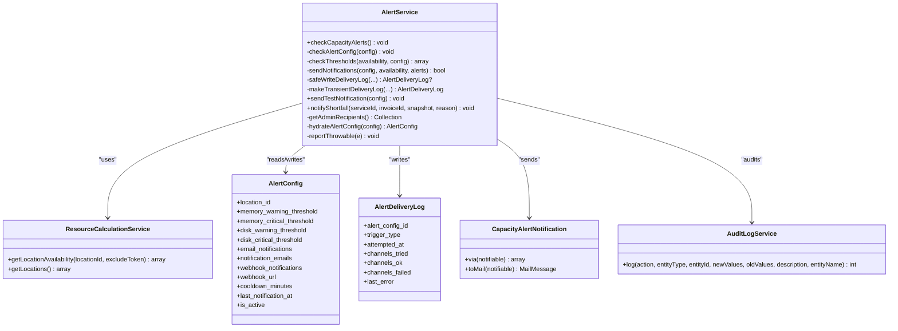
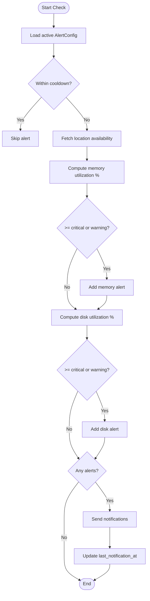
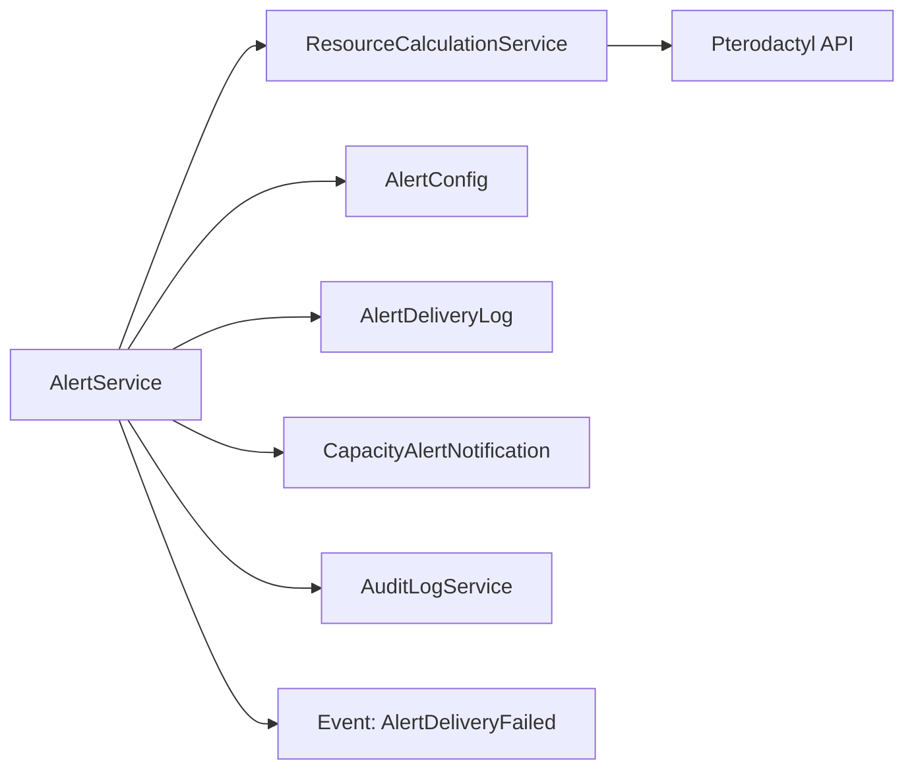

# AlertService

> **Preserved Qoder snapshot.** This deep-dive page is retained so the earlier Wiki work and its source trail are not lost. For the reconciled implementation, [[Architecture Overview|Architecture-Overview]] is canonical; references below to retired controllers, listeners, services, tables, or API shapes are historical.

<cite>
**Referenced Files in This Document**
- [AlertService.php](https://github.com/ObsidianNetwork/dynamic-pterodactyl/blob/6b7f83bda6f7c3fe014d52428b31af1638daa6cc/Services/AlertService.php)
- [AlertConfig.php](https://github.com/ObsidianNetwork/dynamic-pterodactyl/blob/6b7f83bda6f7c3fe014d52428b31af1638daa6cc/Models/AlertConfig.php)
- [AlertDeliveryLog.php](https://github.com/ObsidianNetwork/dynamic-pterodactyl/blob/6b7f83bda6f7c3fe014d52428b31af1638daa6cc/Models/AlertDeliveryLog.php)
- [CapacityAlertNotification.php](https://github.com/ObsidianNetwork/dynamic-pterodactyl/blob/6b7f83bda6f7c3fe014d52428b31af1638daa6cc/Notifications/CapacityAlertNotification.php)
- [ReservationShortfallNotification.php](https://github.com/ObsidianNetwork/dynamic-pterodactyl/blob/6b7f83bda6f7c3fe014d52428b31af1638daa6cc/Notifications/ReservationShortfallNotification.php)
- [AlertDeliveryFailed.php](https://github.com/ObsidianNetwork/dynamic-pterodactyl/blob/6b7f83bda6f7c3fe014d52428b31af1638daa6cc/Events/AlertDeliveryFailed.php)
- [ResourceCalculationService.php](https://github.com/ObsidianNetwork/dynamic-pterodactyl/blob/6b7f83bda6f7c3fe014d52428b31af1638daa6cc/Services/ResourceCalculationService.php)
- [AuditLogService.php](https://github.com/ObsidianNetwork/dynamic-pterodactyl/blob/6b7f83bda6f7c3fe014d52428b31af1638daa6cc/Services/AuditLogService.php)
- [AuditsExtensionActions.php](https://github.com/ObsidianNetwork/dynamic-pterodactyl/blob/6b7f83bda6f7c3fe014d52428b31af1638daa6cc/Services/Concerns/AuditsExtensionActions.php)
- [AlertConfigObserver.php](https://github.com/ObsidianNetwork/dynamic-pterodactyl/blob/6b7f83bda6f7c3fe014d52428b31af1638daa6cc/Models/Observers/AlertConfigObserver.php)
- [AlertConfigResource.php](https://github.com/ObsidianNetwork/dynamic-pterodactyl/blob/6b7f83bda6f7c3fe014d52428b31af1638daa6cc/Admin/Resources/AlertConfigResource.php)
- [2025_01_01_000004_create_ptero_alert_configs_table.php](https://github.com/ObsidianNetwork/dynamic-pterodactyl/blob/6b7f83bda6f7c3fe014d52428b31af1638daa6cc/database/migrations/2025_01_01_000004_create_ptero_alert_configs_table.php)
- [2026_04_26_000001_create_ptero_alert_delivery_log_table.php](https://github.com/ObsidianNetwork/dynamic-pterodactyl/blob/6b7f83bda6f7c3fe014d52428b31af1638daa6cc/database/migrations/2026_04_26_000001_create_ptero_alert_delivery_log_table.php)
</cite>

## Table of Contents
1. [Introduction](#introduction)
2. [Project Structure](#project-structure)
3. [Core Components](#core-components)
4. [Architecture Overview](#architecture-overview)
5. [Detailed Component Analysis](#detailed-component-analysis)
6. [Dependency Analysis](#dependency-analysis)
7. [Performance Considerations](#performance-considerations)
8. [Troubleshooting Guide](#troubleshooting-guide)
9. [Conclusion](#conclusion)
10. [Appendices](#appendices)

## Introduction
This document provides comprehensive documentation for the AlertService, which implements capacity monitoring and notification dispatch for the Dynamic Pterodactyl extension. It covers alert configuration management, threshold monitoring, cooldown-based rate limiting, and integration with email and webhook channels. It also explains delivery status tracking, failure handling, audit logging integration, scheduling entry points, and how to configure custom notification channels and dashboards.

## Project Structure
The AlertService is part of a service-oriented architecture that integrates with:
- Resource availability data from Pterodactyl via ResourceCalculationService
- Notification system via Laravel Notifications (email) and HTTP client (webhooks)
- Audit logging via AuditLogService
- Delivery tracking via AlertDeliveryLog model
- Admin configuration via Filament resources

**Diagram sources**
- [AlertService.php:33-75](https://github.com/ObsidianNetwork/dynamic-pterodactyl/blob/6b7f83bda6f7c3fe014d52428b31af1638daa6cc/Services/AlertService.php#L33-L75)
- [ResourceCalculationService.php:26-67](https://github.com/ObsidianNetwork/dynamic-pterodactyl/blob/6b7f83bda6f7c3fe014d52428b31af1638daa6cc/Services/ResourceCalculationService.php#L26-L67)
- [CapacityAlertNotification.php:19-47](https://github.com/ObsidianNetwork/dynamic-pterodactyl/blob/6b7f83bda6f7c3fe014d52428b31af1638daa6cc/Notifications/CapacityAlertNotification.php#L19-L47)
- [AlertConfig.php:12-34](https://github.com/ObsidianNetwork/dynamic-pterodactyl/blob/6b7f83bda6f7c3fe014d52428b31af1638daa6cc/Models/AlertConfig.php#L12-L34)
- [AlertDeliveryLog.php:12-27](https://github.com/ObsidianNetwork/dynamic-pterodactyl/blob/6b7f83bda6f7c3fe014d52428b31af1638daa6cc/Models/AlertDeliveryLog.php#L12-L27)
- [AuditLogService.php:15-40](https://github.com/ObsidianNetwork/dynamic-pterodactyl/blob/6b7f83bda6f7c3fe014d52428b31af1638daa6cc/Services/AuditLogService.php#L15-L40)

**Section sources**
- [AlertService.php:33-75](https://github.com/ObsidianNetwork/dynamic-pterodactyl/blob/6b7f83bda6f7c3fe014d52428b31af1638daa6cc/Services/AlertService.php#L33-L75)
- [ResourceCalculationService.php:26-67](https://github.com/ObsidianNetwork/dynamic-pterodactyl/blob/6b7f83bda6f7c3fe014d52428b31af1638daa6cc/Services/ResourceCalculationService.php#L26-L67)
- [AlertConfig.php:12-34](https://github.com/ObsidianNetwork/dynamic-pterodactyl/blob/6b7f83bda6f7c3fe014d52428b31af1638daa6cc/Models/AlertConfig.php#L12-L34)
- [AlertDeliveryLog.php:12-27](https://github.com/ObsidianNetwork/dynamic-pterodactyl/blob/6b7f83bda6f7c3fe014d52428b31af1638daa6cc/Models/AlertDeliveryLog.php#L12-L27)
- [AuditLogService.php:15-40](https://github.com/ObsidianNetwork/dynamic-pterodactyl/blob/6b7f83bda6f7c3fe014d52428b31af1638daa6cc/Services/AuditLogService.php#L15-L40)

## Core Components
- AlertService: Orchestrates capacity checks, threshold evaluation, notifications, cooldown enforcement, delivery logging, and audit events.
- AlertConfig: Eloquent model representing alert rules per location or globally, including thresholds, channels, cooldown, and active state.
- AlertDeliveryLog: Records each attempt to deliver alerts, including channels tried/succeeded/failed and last error.
- CapacityAlertNotification: Email notification for capacity breaches.
- ReservationShortfallNotification: Email notification for reservation shortfalls after payment.
- ResourceCalculationService: Provides real-time location availability by querying Pterodactyl API.
- AuditLogService and AuditsExtensionActions: Provide safe audit logging for alert actions.
- AlertConfigObserver: Audits changes to alert configurations while redacting sensitive fields like webhook URLs.
- AlertConfigResource: Filament admin resource to create/edit/list alert configs and run test notifications.

**Section sources**
- [AlertService.php:19-392](https://github.com/ObsidianNetwork/dynamic-pterodactyl/blob/6b7f83bda6f7c3fe014d52428b31af1638daa6cc/Services/AlertService.php#L19-L392)
- [AlertConfig.php:8-56](https://github.com/ObsidianNetwork/dynamic-pterodactyl/blob/6b7f83bda6f7c3fe014d52428b31af1638daa6cc/Models/AlertConfig.php#L8-L56)
- [AlertDeliveryLog.php:8-33](https://github.com/ObsidianNetwork/dynamic-pterodactyl/blob/6b7f83bda6f7c3fe014d52428b31af1638daa6cc/Models/AlertDeliveryLog.php#L8-L33)
- [CapacityAlertNotification.php:10-47](https://github.com/ObsidianNetwork/dynamic-pterodactyl/blob/6b7f83bda6f7c3fe014d52428b31af1638daa6cc/Notifications/CapacityAlertNotification.php#L10-L47)
- [ReservationShortfallNotification.php:10-40](https://github.com/ObsidianNetwork/dynamic-pterodactyl/blob/6b7f83bda6f7c3fe014d52428b31af1638daa6cc/Notifications/ReservationShortfallNotification.php#L10-L40)
- [ResourceCalculationService.php:26-67](https://github.com/ObsidianNetwork/dynamic-pterodactyl/blob/6b7f83bda6f7c3fe014d52428b31af1638daa6cc/Services/ResourceCalculationService.php#L26-L67)
- [AuditLogService.php:15-40](https://github.com/ObsidianNetwork/dynamic-pterodactyl/blob/6b7f83bda6f7c3fe014d52428b31af1638daa6cc/Services/AuditLogService.php#L15-L40)
- [AuditsExtensionActions.php:10-32](https://github.com/ObsidianNetwork/dynamic-pterodactyl/blob/6b7f83bda6f7c3fe014d52428b31af1638daa6cc/Services/Concerns/AuditsExtensionActions.php#L10-L32)
- [AlertConfigObserver.php:12-68](https://github.com/ObsidianNetwork/dynamic-pterodactyl/blob/6b7f83bda6f7c3fe014d52428b31af1638daa6cc/Models/Observers/AlertConfigObserver.php#L12-L68)
- [AlertConfigResource.php:41-167](https://github.com/ObsidianNetwork/dynamic-pterodactyl/blob/6b7f83bda6f7c3fe014d52428b31af1638daa6cc/Admin/Resources/AlertConfigResource.php#L41-L167)

## Architecture Overview
The alerting pipeline runs on a schedule:
1. The scheduler invokes checkCapacityAlerts().
2. For each active AlertConfig, it resolves target locations (single or all).
3. For each location, it fetches availability from ResourceCalculationService.
4. It computes utilization percentages for memory and disk and compares against warning/critical thresholds.
5. If any thresholds are breached and not within cooldown, it sends notifications via configured channels.
6. It updates last_notification_at to enforce cooldown.
7. It writes delivery logs and emits an event if all channels fail.
8. It records an audit log when at least one channel succeeds.

**Diagram sources**
- [AlertService.php:33-75](https://github.com/ObsidianNetwork/dynamic-pterodactyl/blob/6b7f83bda6f7c3fe014d52428b31af1638daa6cc/Services/AlertService.php#L33-L75)
- [AlertService.php:77-126](https://github.com/ObsidianNetwork/dynamic-pterodactyl/blob/6b7f83bda6f7c3fe014d52428b31af1638daa6cc/Services/AlertService.php#L77-L126)
- [AlertService.php:128-247](https://github.com/ObsidianNetwork/dynamic-pterodactyl/blob/6b7f83bda6f7c3fe014d52428b31af1638daa6cc/Services/AlertService.php#L128-L247)
- [ResourceCalculationService.php:26-67](https://github.com/ObsidianNetwork/dynamic-pterodactyl/blob/6b7f83bda6f7c3fe014d52428b31af1638daa6cc/Services/ResourceCalculationService.php#L26-L67)
- [AuditLogService.php:15-40](https://github.com/ObsidianNetwork/dynamic-pterodactyl/blob/6b7f83bda6f7c3fe014d52428b31af1638daa6cc/Services/AuditLogService.php#L15-L40)

## Detailed Component Analysis

### AlertService
Responsibilities:
- Enumerate active alert configurations and iterate locations.
- Compute utilization and compare against thresholds.
- Enforce cooldown using last_notification_at and cooldown_minutes.
- Dispatch notifications via email and webhooks.
- Persist delivery attempts and outcomes.
- Emit AlertDeliveryFailed when all channels fail.
- Record audit entries for successful deliveries.
- Provide sendTestNotification and notifyShortfall helpers.

Key behaviors:
- Cooldown: Skips sending if last_notification_at is within cooldown_minutes.
- Thresholds: Computes memory and disk utilization percentages; supports warning and critical levels.
- Channels: Supports email (to all users with role_id set) and webhook (Discord-compatible embed).
- Delivery tracking: Writes AlertDeliveryLog with channels_tried, channels_ok, channels_failed, last_error.
- Failure event: Emits AlertDeliveryFailed when no channel succeeded.
- Audit: Uses AuditsExtensionActions::safeAudit to record capacity_alert_sent with severity and breached resources.

Error handling:
- Exceptions during checks are caught and logged.
- Email failures are logged per recipient; exceptions are reported via the application exception handler when available.
- Webhook failures are logged with host and error details.
- Delivery log writes are wrapped in try/catch to avoid breaking the flow if persistence fails.

Rate limiting:
- Cooldown_minutes prevents repeated alerts for the same config within a time window.
- No global rate limiter across configs; each config enforces its own cooldown.

Integration points:
- ResourceCalculationService for live availability.
- Laravel Notifications for email.
- Http client for webhooks.
- AuditLogService for audit trail.
- Event system for delivery failures.

**Section sources**
- [AlertService.php:33-75](https://github.com/ObsidianNetwork/dynamic-pterodactyl/blob/6b7f83bda6f7c3fe014d52428b31af1638daa6cc/Services/AlertService.php#L33-L75)
- [AlertService.php:77-126](https://github.com/ObsidianNetwork/dynamic-pterodactyl/blob/6b7f83bda6f7c3fe014d52428b31af1638daa6cc/Services/AlertService.php#L77-L126)
- [AlertService.php:128-247](https://github.com/ObsidianNetwork/dynamic-pterodactyl/blob/6b7f83bda6f7c3fe014d52428b31af1638daa6cc/Services/AlertService.php#L128-L247)
- [AlertService.php:250-299](https://github.com/ObsidianNetwork/dynamic-pterodactyl/blob/6b7f83bda6f7c3fe014d52428b31af1638daa6cc/Services/AlertService.php#L250-L299)
- [AlertService.php:304-392](https://github.com/ObsidianNetwork/dynamic-pterodactyl/blob/6b7f83bda6f7c3fe014d52428b31af1638daa6cc/Services/AlertService.php#L304-L392)

#### Class Diagram

**Diagram sources**
- [AlertService.php:19-392](https://github.com/ObsidianNetwork/dynamic-pterodactyl/blob/6b7f83bda6f7c3fe014d52428b31af1638daa6cc/Services/AlertService.php#L19-L392)
- [ResourceCalculationService.php:26-67](https://github.com/ObsidianNetwork/dynamic-pterodactyl/blob/6b7f83bda6f7c3fe014d52428b31af1638daa6cc/Services/ResourceCalculationService.php#L26-L67)
- [AlertConfig.php:8-56](https://github.com/ObsidianNetwork/dynamic-pterodactyl/blob/6b7f83bda6f7c3fe014d52428b31af1638daa6cc/Models/AlertConfig.php#L8-L56)
- [AlertDeliveryLog.php:8-33](https://github.com/ObsidianNetwork/dynamic-pterodactyl/blob/6b7f83bda6f7c3fe014d52428b31af1638daa6cc/Models/AlertDeliveryLog.php#L8-L33)
- [CapacityAlertNotification.php:10-47](https://github.com/ObsidianNetwork/dynamic-pterodactyl/blob/6b7f83bda6f7c3fe014d52428b31af1638daa6cc/Notifications/CapacityAlertNotification.php#L10-L47)
- [AuditLogService.php:15-40](https://github.com/ObsidianNetwork/dynamic-pterodactyl/blob/6b7f83bda6f7c3fe014d52428b31af1638daa6cc/Services/AuditLogService.php#L15-L40)

### Alert Configuration Management
- Storage: AlertConfig model maps to ptero_alert_configs table with fields for thresholds, channels, cooldown, and active state.
- Scopes: Global (location_id null) and per-location queries supported.
- Admin UI: Filament resource allows creating/editing/listing configs, toggling channels, setting cooldown, and running test notifications.
- Observer: Changes to AlertConfig are audited; webhook URLs are redacted in audit logs.

Configuration options:
- Thresholds: memory_warning_threshold, memory_critical_threshold, disk_warning_threshold, disk_critical_threshold (percentages).
- Channels: email_notifications with notification_emails; webhook_notifications with webhook_url.
- Cooldown: cooldown_minutes controls minimum interval between repeated alerts per config.
- Scope: location_id selects a specific location; null means all locations.

**Section sources**
- [AlertConfig.php:12-56](https://github.com/ObsidianNetwork/dynamic-pterodactyl/blob/6b7f83bda6f7c3fe014d52428b31af1638daa6cc/Models/AlertConfig.php#L12-L56)
- [AlertConfigResource.php:41-167](https://github.com/ObsidianNetwork/dynamic-pterodactyl/blob/6b7f83bda6f7c3fe014d52428b31af1638daa6cc/Admin/Resources/AlertConfigResource.php#L41-L167)
- [AlertConfigObserver.php:12-68](https://github.com/ObsidianNetwork/dynamic-pterodactyl/blob/6b7f83bda6f7c3fe014d52428b31af1638daa6cc/Models/Observers/AlertConfigObserver.php#L12-L68)
- [2025_01_01_000004_create_ptero_alert_configs_table.php:11-42](https://github.com/ObsidianNetwork/dynamic-pterodactyl/blob/6b7f83bda6f7c3fe014d52428b31af1638daa6cc/database/migrations/2025_01_01_000004_create_ptero_alert_configs_table.php#L11-L42)

### Threshold Monitoring and Cooldown
- Utilization calculation: memory and disk utilization computed from total_capacity and total_allocated.
- Threshold comparison: warning and critical levels evaluated independently for memory and disk.
- Cooldown enforcement: last_notification_at compared to now() minus cooldown_minutes; if within cooldown, alerts are skipped.
- Update behavior: last_notification_at updated only when at least one channel succeeds.

**Diagram sources**
- [AlertService.php:44-75](https://github.com/ObsidianNetwork/dynamic-pterodactyl/blob/6b7f83bda6f7c3fe014d52428b31af1638daa6cc/Services/AlertService.php#L44-L75)
- [AlertService.php:77-126](https://github.com/ObsidianNetwork/dynamic-pterodactyl/blob/6b7f83bda6f7c3fe014d52428b31af1638daa6cc/Services/AlertService.php#L77-L126)

**Section sources**
- [AlertService.php:44-75](https://github.com/ObsidianNetwork/dynamic-pterodactyl/blob/6b7f83bda6f7c3fe014d52428b31af1638daa6cc/Services/AlertService.php#L44-L75)
- [AlertService.php:77-126](https://github.com/ObsidianNetwork/dynamic-pterodactyl/blob/6b7f83bda6f7c3fe014d52428b31af1638daa6cc/Services/AlertService.php#L77-L126)

### Notification Channels Integration
- Email: Sends CapacityAlertNotification to all users with role_id set. Subject includes severity and scope. Body lists breached resources with usage percentage and thresholds. Includes action link to edit alert config.
- Webhook: Posts Discord-compatible embed with title, color (red for critical, yellow otherwise), fields for each alert, footer, and timestamp. Uses Http with timeout and throws on failure.

Delivery tracking:
- Channels tried, ok, failed, and last_error recorded in AlertDeliveryLog.
- If all channels fail, AlertDeliveryFailed event is dispatched with a delivery log (persistent or transient if DB write fails).

Custom channels:
- To add a custom channel, extend sendNotifications logic to include additional channel attempts, track success/failure, and persist results in delivery logs. Ensure you handle errors and emit AlertDeliveryFailed when all channels fail.

**Section sources**
- [AlertService.php:128-247](https://github.com/ObsidianNetwork/dynamic-pterodactyl/blob/6b7f83bda6f7c3fe014d52428b31af1638daa6cc/Services/AlertService.php#L128-L247)
- [CapacityAlertNotification.php:19-47](https://github.com/ObsidianNetwork/dynamic-pterodactyl/blob/6b7f83bda6f7c3fe014d52428b31af1638daa6cc/Notifications/CapacityAlertNotification.php#L19-L47)
- [AlertDeliveryLog.php:12-27](https://github.com/ObsidianNetwork/dynamic-pterodactyl/blob/6b7f83bda6f7c3fe014d52428b31af1638daa6cc/Models/AlertDeliveryLog.php#L12-L27)
- [AlertDeliveryFailed.php:9-15](https://github.com/ObsidianNetwork/dynamic-pterodactyl/blob/6b7f83bda6f7c3fe014d52428b31af1638daa6cc/Events/AlertDeliveryFailed.php#L9-L15)

### Delivery Status Tracking and Failure Handling
- Delivery logs capture:
  - trigger_type: capacity_breach, shortfall, state_drift, check_failure
  - attempted_at: timestamp of attempt
  - channels_tried, channels_ok, channels_failed: arrays of channel names
  - last_error: string message from last failure
- On failure:
  - Alerts are logged with context (config id, recipient id, webhook host).
  - AlertDeliveryFailed event is emitted for external listeners to react.
  - Audit logs are not written for failed-only deliveries.

**Section sources**
- [AlertService.php:218-247](https://github.com/ObsidianNetwork/dynamic-pterodactyl/blob/6b7f83bda6f7c3fe014d52428b31af1638daa6cc/Services/AlertService.php#L218-L247)
- [AlertService.php:250-299](https://github.com/ObsidianNetwork/dynamic-pterodactyl/blob/6b7f83bda6f7c3fe014d52428b31af1638daa6cc/Services/AlertService.php#L250-L299)
- [2026_04_26_000001_create_ptero_alert_delivery_log_table.php:11-24](https://github.com/ObsidianNetwork/dynamic-pterodactyl/blob/6b7f83bda6f7c3fe014d52428b31af1638daa6cc/database/migrations/2026_04_26_000001_create_ptero_alert_delivery_log_table.php#L11-L24)

### Alert Scheduling Mechanism
- The AlertService exposes checkCapacityAlerts(), which iterates active alert configs and processes them.
- In this extension, schedules are defined inline in boot() closures rather than Job/Command classes. Integrate your scheduler to call AlertService::checkCapacityAlerts() at desired intervals (e.g., every minute).
- Each config enforces its own cooldown to prevent spam.

Note: The exact scheduling invocation is outside the AlertService file; ensure your application’s scheduler calls checkCapacityAlerts() periodically.

**Section sources**
- [AlertService.php:33-42](https://github.com/ObsidianNetwork/dynamic-pterodactyl/blob/6b7f83bda6f7c3fe014d52428b31af1638daa6cc/Services/AlertService.php#L33-L42)

### Reservation Shortfall Notifications
- notifyShortfall sends emails to all users with role_id set about reservation shortfalls or state drift after payment.
- Uses ReservationShortfallNotification with service ID, invoice ID, reservation snapshot, and reason.
- Errors are logged per recipient without failing the caller.

**Section sources**
- [AlertService.php:328-361](https://github.com/ObsidianNetwork/dynamic-pterodactyl/blob/6b7f83bda6f7c3fe014d52428b31af1638daa6cc/Services/AlertService.php#L328-L361)
- [ReservationShortfallNotification.php:10-40](https://github.com/ObsidianNetwork/dynamic-pterodactyl/blob/6b7f83bda6f7c3fe014d52428b31af1638daa6cc/Notifications/ReservationShortfallNotification.php#L10-L40)

### Audit Logging Integration
- Successful capacity alerts are audited via AuditsExtensionActions::safeAudit with action 'capacity_alert_sent', entity type 'alert_config', and payload including channels, severity, breached resources, and location scope.
- AlertConfig changes are audited by AlertConfigObserver with webhook URLs redacted.
- AuditLogService writes to ptero_audit_logs with user context and request metadata.

**Section sources**
- [AlertService.php:238-245](https://github.com/ObsidianNetwork/dynamic-pterodactyl/blob/6b7f83bda6f7c3fe014d52428b31af1638daa6cc/Services/AlertService.php#L238-L245)
- [AuditsExtensionActions.php:10-32](https://github.com/ObsidianNetwork/dynamic-pterodactyl/blob/6b7f83bda6f7c3fe014d52428b31af1638daa6cc/Services/Concerns/AuditsExtensionActions.php#L10-L32)
- [AlertConfigObserver.php:12-68](https://github.com/ObsidianNetwork/dynamic-pterodactyl/blob/6b7f83bda6f7c3fe014d52428b31af1638daa6cc/Models/Observers/AlertConfigObserver.php#L12-L68)
- [AuditLogService.php:15-40](https://github.com/ObsidianNetwork/dynamic-pterodactyl/blob/6b7f83bda6f7c3fe014d52428b31af1638daa6cc/Services/AuditLogService.php#L15-L40)

## Dependency Analysis
- AlertService depends on:
  - ResourceCalculationService for real-time availability
  - Laravel Notification system for email
  - Http client for webhooks
  - AlertConfig and AlertDeliveryLog models for persistence
  - AuditLogService for auditing
  - Event system for AlertDeliveryFailed
- ResourceCalculationService depends on Pterodactyl API and handles retries/timeouts and degraded snapshots.

**Diagram sources**
- [AlertService.php:19-392](https://github.com/ObsidianNetwork/dynamic-pterodactyl/blob/6b7f83bda6f7c3fe014d52428b31af1638daa6cc/Services/AlertService.php#L19-L392)
- [ResourceCalculationService.php:26-67](https://github.com/ObsidianNetwork/dynamic-pterodactyl/blob/6b7f83bda6f7c3fe014d52428b31af1638daa6cc/Services/ResourceCalculationService.php#L26-L67)
- [CapacityAlertNotification.php:10-47](https://github.com/ObsidianNetwork/dynamic-pterodactyl/blob/6b7f83bda6f7c3fe014d52428b31af1638daa6cc/Notifications/CapacityAlertNotification.php#L10-L47)
- [AlertDeliveryFailed.php:9-15](https://github.com/ObsidianNetwork/dynamic-pterodactyl/blob/6b7f83bda6f7c3fe014d52428b31af1638daa6cc/Events/AlertDeliveryFailed.php#L9-L15)
- [AuditLogService.php:15-40](https://github.com/ObsidianNetwork/dynamic-pterodactyl/blob/6b7f83bda6f7c3fe014d52428b31af1638daa6cc/Services/AuditLogService.php#L15-L40)

**Section sources**
- [AlertService.php:19-392](https://github.com/ObsidianNetwork/dynamic-pterodactyl/blob/6b7f83bda6f7c3fe014d52428b31af1638daa6cc/Services/AlertService.php#L19-L392)
- [ResourceCalculationService.php:26-67](https://github.com/ObsidianNetwork/dynamic-pterodactyl/blob/6b7f83bda6f7c3fe014d52428b31af1638daa6cc/Services/ResourceCalculationService.php#L26-L67)

## Performance Considerations
- Real-time availability: ResourceCalculationService queries Pterodactyl API directly; avoid caching to maintain accuracy.
- Batched API calls: buildClusterSnapshot batches requests but does not cache results.
- Cooldown: Use appropriate cooldown_minutes to reduce load and avoid spam.
- Webhook timeouts: Http timeout is set to 10 seconds; adjust if needed for slow endpoints.
- Database writes: Delivery log writes are wrapped in try/catch to prevent blocking the main flow.

[No sources needed since this section provides general guidance]

## Troubleshooting Guide
Common issues and resolutions:
- No admin recipients:
  - Symptom: Warning log indicating no recipients configured; email channel marked as failed.
  - Resolution: Ensure there are users with role_id set; configure notification_emails if required by your workflow.
- Webhook failures:
  - Symptom: Error log with webhook host and message; webhook channel marked as failed.
  - Resolution: Verify webhook URL accessibility, authentication, and payload compatibility (Discord embed format).
- Delivery log write failures:
  - Symptom: Warning log indicating delivery-log write failed; event still dispatched with transient log.
  - Resolution: Inspect database connectivity and constraints; consider increasing retry/backoff at the scheduler level.
- Cooldown preventing alerts:
  - Symptom: Alerts not sent despite thresholds breached.
  - Resolution: Increase cooldown_minutes or wait until cooldown expires; verify last_notification_at updates only on successful sends.
- Audit logs missing:
  - Symptom: No audit entries for capacity_alert_sent.
  - Resolution: Confirm at least one channel succeeded; audit is only written on success.

**Section sources**
- [AlertService.php:143-179](https://github.com/ObsidianNetwork/dynamic-pterodactyl/blob/6b7f83bda6f7c3fe014d52428b31af1638daa6cc/Services/AlertService.php#L143-L179)
- [AlertService.php:182-216](https://github.com/ObsidianNetwork/dynamic-pterodactyl/blob/6b7f83bda6f7c3fe014d52428b31af1638daa6cc/Services/AlertService.php#L182-L216)
- [AlertService.php:218-247](https://github.com/ObsidianNetwork/dynamic-pterodactyl/blob/6b7f83bda6f7c3fe014d52428b31af1638daa6cc/Services/AlertService.php#L218-L247)
- [AlertService.php:250-299](https://github.com/ObsidianNetwork/dynamic-pterodactyl/blob/6b7f83bda6f7c3fe014d52428b31af1638daa6cc/Services/AlertService.php#L250-L299)

## Conclusion
AlertService provides robust capacity monitoring with configurable thresholds, cooldown-based rate limiting, multi-channel notifications, detailed delivery tracking, and audit logging. It integrates seamlessly with ResourceCalculationService for real-time availability and supports extensibility for custom channels. Proper scheduling and configuration ensure reliable alerting without spamming administrators.

[No sources needed since this section summarizes without analyzing specific files]

## Appendices

### Data Models and Schema
- AlertConfig fields:
  - location_id, location_name
  - memory_warning_threshold, memory_critical_threshold
  - disk_warning_threshold, disk_critical_threshold
  - email_notifications, notification_emails
  - webhook_notifications, webhook_url
  - cooldown_minutes, last_notification_at
  - is_active
- AlertDeliveryLog fields:
  - alert_config_id (FK to AlertConfig)
  - trigger_type (enum)
  - attempted_at
  - channels_tried, channels_ok, channels_failed (JSON arrays)
  - last_error

**Section sources**
- [AlertConfig.php:12-34](https://github.com/ObsidianNetwork/dynamic-pterodactyl/blob/6b7f83bda6f7c3fe014d52428b31af1638daa6cc/Models/AlertConfig.php#L12-L34)
- [AlertDeliveryLog.php:12-27](https://github.com/ObsidianNetwork/dynamic-pterodactyl/blob/6b7f83bda6f7c3fe014d52428b31af1638daa6cc/Models/AlertDeliveryLog.php#L12-L27)
- [2025_01_01_000004_create_ptero_alert_configs_table.php:11-42](https://github.com/ObsidianNetwork/dynamic-pterodactyl/blob/6b7f83bda6f7c3fe014d52428b31af1638daa6cc/database/migrations/2025_01_01_000004_create_ptero_alert_configs_table.php#L11-L42)
- [2026_04_26_000001_create_ptero_alert_delivery_log_table.php:11-24](https://github.com/ObsidianNetwork/dynamic-pterodactyl/blob/6b7f83bda6f7c3fe014d52428b31af1638daa6cc/database/migrations/2026_04_26_000001_create_ptero_alert_delivery_log_table.php#L11-L24)

### Admin Dashboard Integration
- Filament AlertConfigResource provides:
  - Create/Edit/List views for alert configs
  - Toggle switches for channels and active state
  - Numeric inputs for thresholds and cooldown
  - Tags input for notification emails
  - URL input for webhook endpoint
  - Test action to send a sample notification

**Section sources**
- [AlertConfigResource.php:41-167](https://github.com/ObsidianNetwork/dynamic-pterodactyl/blob/6b7f83bda6f7c3fe014d52428b31af1638daa6cc/Admin/Resources/AlertConfigResource.php#L41-L167)