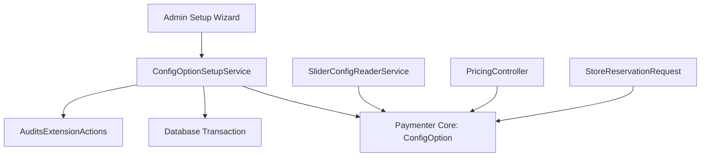
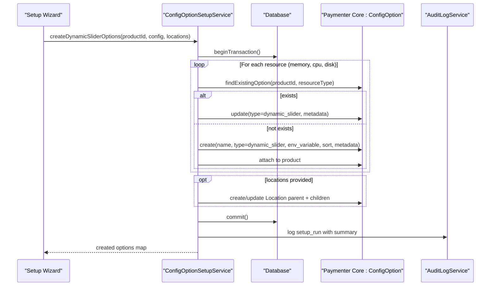
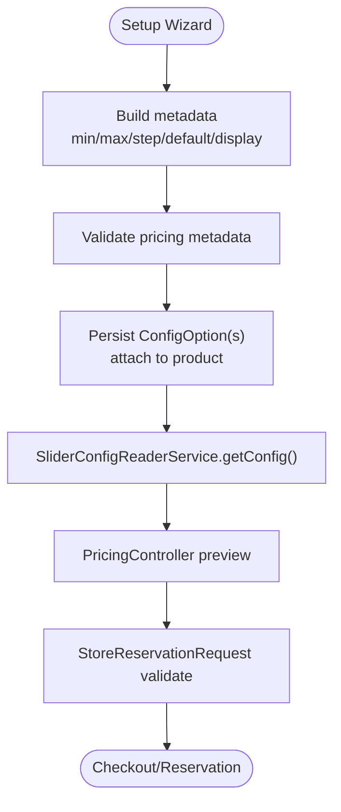
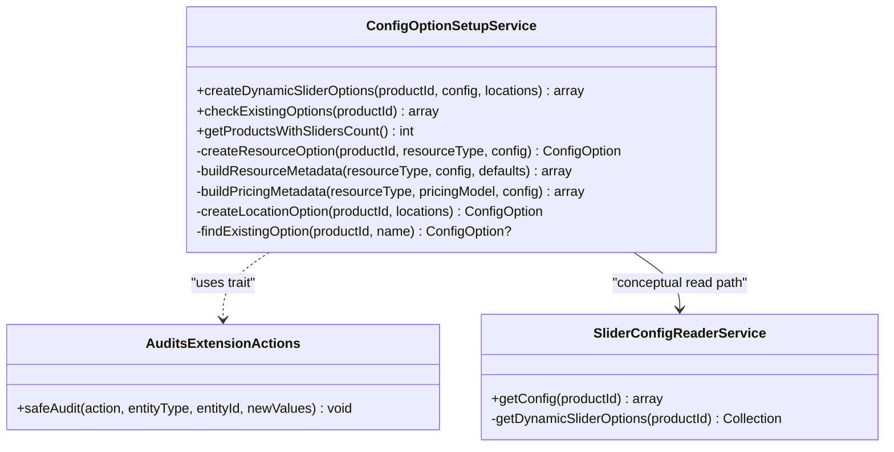
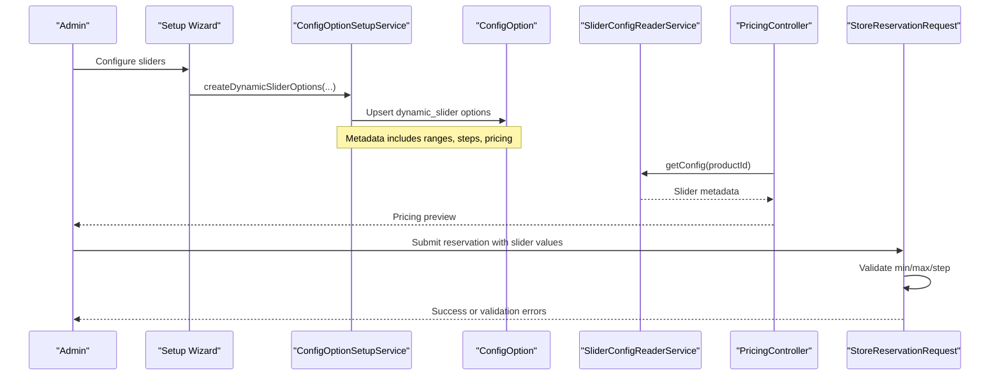

# ConfigOptionSetupService

<cite>
**Referenced Files in This Document**
- [ConfigOptionSetupService.php](file://Services/ConfigOptionSetupService.php)
- [SliderConfigReaderService.php](file://Services/SliderConfigReaderService.php)
- [AuditsExtensionActions.php](file://Services/Concerns/AuditsExtensionActions.php)
- [PricingController.php](file://Http/Controllers/Api/PricingController.php)
- [StoreReservationRequest.php](file://Http/Requests/StoreReservationRequest.php)
- [2025_01_01_000002_create_ptero_pricing_configs_table.php](file://database/migrations/2025_01_01_000002_create_ptero_pricing_configs_table.php)
- [2025_01_01_000005_drop_ptero_pricing_configs_table.php](file://database/migrations/2025_01_01_000005_drop_ptero_pricing_configs_table.php)
- [ConfigOptionSetupServiceTest.php](file://tests/Unit/ConfigOptionSetupServiceTest.php)
- [SetupWizardValidationTest.php](file://tests/Feature/SetupWizardValidationTest.php)
- [LaravelTestCase.php](file://tests/LaravelTestCase.php)
</cite>

## Table of Contents
1. [Introduction](#introduction)
2. [Project Structure](#project-structure)
3. [Core Components](#core-components)
4. [Architecture Overview](#architecture-overview)
5. [Detailed Component Analysis](#detailed-component-analysis)
6. [Dependency Analysis](#dependency-analysis)
7. [Performance Considerations](#performance-considerations)
8. [Troubleshooting Guide](#troubleshooting-guide)
9. [Conclusion](#conclusion)
10. [Appendices](#appendices)

## Introduction
This document explains the ConfigOptionSetupService, which creates and configures dynamic slider options for Paymenter products. It focuses on how the service builds slider metadata (ranges, steps, defaults), validates pricing configuration, integrates with Paymenter’s pricing engine by storing metadata consumed by core pricing methods, and manages optional location options. It also covers migration procedures that moved slider configuration from a dedicated table to native ConfigOption metadata, common configuration patterns, and troubleshooting invalid setups.

## Project Structure
The extension is a nested Paymenter “Other” extension. Slider setup lives under Services, with supporting services for reading slider configurations and auditing actions. The service interacts with Paymenter’s core models (ConfigOption, Product) and uses database transactions to ensure atomicity when creating or updating multiple slider options.

**Diagram sources**
- [ConfigOptionSetupService.php:44-77](file://Services/ConfigOptionSetupService.php#L44-L77)
- [SliderConfigReaderService.php:14-53](file://Services/SliderConfigReaderService.php#L14-L53)
- [PricingController.php:38-76](file://Http/Controllers/Api/PricingController.php#L38-L76)
- [StoreReservationRequest.php:75-140](file://Http/Requests/StoreReservationRequest.php#L75-L140)

**Section sources**
- [ConfigOptionSetupService.php:1-260](file://Services/ConfigOptionSetupService.php#L1-L259)
- [SliderConfigReaderService.php:1-69](file://Services/SliderConfigReaderService.php#L1-L68)

## Core Components
- ConfigOptionSetupService: Creates/updates dynamic_slider ConfigOptions for memory, CPU, disk, and optionally Location; validates pricing metadata; audits setup runs.
- SliderConfigReaderService: Reads configured sliders per product for API/frontend consumption.
- AuditsExtensionActions: Safely logs setup actions even if audit logging fails.

Key responsibilities:
- Build resource metadata with min/max/step/default values and display units.
- Validate pricing model parameters via Paymenter’s rule.
- Upsert existing slider options to avoid duplication.
- Create location dropdown options as child entries under a parent “Location” option.
- Provide helpers to detect existing slider options and count products with sliders.

**Section sources**
- [ConfigOptionSetupService.php:14-42](file://Services/ConfigOptionSetupService.php#L14-L42)
- [ConfigOptionSetupService.php:44-77](file://Services/ConfigOptionSetupService.php#L44-L77)
- [ConfigOptionSetupService.php:79-146](file://Services/ConfigOptionSetupService.php#L79-L146)
- [ConfigOptionSetupService.php:148-171](file://Services/ConfigOptionSetupService.php#L148-L171)
- [ConfigOptionSetupService.php:173-206](file://Services/ConfigOptionSetupService.php#L173-L206)
- [ConfigOptionSetupService.php:208-258](file://Services/ConfigOptionSetupService.php#L208-L258)
- [SliderConfigReaderService.php:14-53](file://Services/SliderConfigReaderService.php#L14-L53)
- [AuditsExtensionActions.php:10-32](file://Services/Concerns/AuditsExtensionActions.php#L10-L32)

## Architecture Overview
The service orchestrates slider creation within a single transaction. For each enabled resource type, it either updates an existing dynamic_slider option or creates a new one, attaching it to the product. Pricing metadata is validated before persisting. If locations are provided, a Location select option and its child options are created. After success, an audit entry is recorded.

**Diagram sources**
- [ConfigOptionSetupService.php:44-77](file://Services/ConfigOptionSetupService.php#L44-L77)
- [ConfigOptionSetupService.php:79-146](file://Services/ConfigOptionSetupService.php#L79-L146)
- [ConfigOptionSetupService.php:173-206](file://Services/ConfigOptionSetupService.php#L173-L206)
- [AuditsExtensionActions.php:10-32](file://Services/Concerns/AuditsExtensionActions.php#L10-L32)

## Detailed Component Analysis

### Creating and configuring dynamic slider options
- Entry point: createDynamicSliderOptions accepts productId, configuration array, and optional locations.
- Iterates over memory, cpu, disk; skips any resource whose enable flag is false.
- Builds metadata using defaults and user-provided values, then validates pricing metadata through Paymenter’s rule.
- Upserts ConfigOption with type dynamic_slider and attaches to the product.
- Optionally creates a Location select option and child options for each location.
- Wraps all writes in a transaction; rolls back on any failure.
- Audits successful runs with a summary of configured sliders.

Common configuration inputs:
- Base price and pricing_model (linear, tiered, base_addon).
- Per-resource min, max, step, default values.
- Per-resource rate or tiers depending on model.
- Optional locations list with id, short, long identifiers.

Output:
- Map of resource types to created/updated ConfigOption instances, plus location if created.

**Section sources**
- [ConfigOptionSetupService.php:44-77](file://Services/ConfigOptionSetupService.php#L44-L77)
- [ConfigOptionSetupService.php:79-146](file://Services/ConfigOptionSetupService.php#L79-L146)
- [ConfigOptionSetupService.php:148-171](file://Services/ConfigOptionSetupService.php#L148-L171)
- [ConfigOptionSetupService.php:173-206](file://Services/ConfigOptionSetupService.php#L173-L206)

### Validating configuration constraints
- Pricing metadata validation is delegated to Paymenter’s DynamicSliderPricingRule during buildResourceMetadata.
- Validation errors are collected and thrown as an InvalidArgumentException with concatenated messages.
- Range and step normalization applies divisor scaling to align internal vs display units.

Validation rules enforced at setup time include:
- Non-negative base_price and rates.
- Tier ordering and final tier handling for tiered models.
- Included amounts non-negative for base_addon model.

These rules mirror those used elsewhere in the system to ensure consistency between setup and runtime.

**Section sources**
- [ConfigOptionSetupService.php:117-146](file://Services/ConfigOptionSetupService.php#L117-L146)
- [07-PRICING-MODELS.md:309-319](file://07-PRICING-MODELS.md#L309-L319)

### Integrating with Paymenter’s pricing engine
- The service does not calculate prices. It stores metadata consumed by Paymenter core pricing methods:
  - Plan::dynamicSliderBasePrice() for shared base charge per plan/product.
  - ConfigOption::calculateDynamicPriceDelta() for marginal charges per slider value.
- SliderConfigReaderService exposes slider metadata for frontend/API consumption.
- PricingController reads configured sliders and validates request values against slider ranges and steps.
- StoreReservationRequest enforces slider range and step constraints at reservation submission.

**Diagram sources**
- [ConfigOptionSetupService.php:117-146](file://Services/ConfigOptionSetupService.php#L117-L146)
- [SliderConfigReaderService.php:14-53](file://Services/SliderConfigReaderService.php#L14-L53)
- [PricingController.php:38-76](file://Http/Controllers/Api/PricingController.php#L38-L76)
- [StoreReservationRequest.php:75-140](file://Http/Requests/StoreReservationRequest.php#L75-L140)

**Section sources**
- [SliderConfigReaderService.php:14-53](file://Services/SliderConfigReaderService.php#L14-L53)
- [PricingController.php:38-76](file://Http/Controllers/Api/PricingController.php#L38-L76)
- [StoreReservationRequest.php:75-140](file://Http/Requests/StoreReservationRequest.php#L75-L140)

### Relationship between slider configurations and product definitions
- Each dynamic_slider ConfigOption is linked to a product via the pivot table.
- Existing options are identified by name or metadata.resource_type to support idempotent re-runs.
- Sorting order ensures consistent UI presentation (memory first, then cpu, then disk).
- Location options are hierarchical: a parent “Location” option with child options representing available locations.

**Section sources**
- [ConfigOptionSetupService.php:79-115](file://Services/ConfigOptionSetupService.php#L79-L115)
- [ConfigOptionSetupService.php:173-206](file://Services/ConfigOptionSetupService.php#L173-L206)
- [ConfigOptionSetupService.php:235-248](file://Services/ConfigOptionSetupService.php#L235-L248)

### Migration procedures for updating existing slider setups
- Historical ptero_pricing_configs table was removed; slider configuration now lives in ConfigOption metadata.
- To migrate or reconfigure:
  - Run the Setup Wizard to create dynamic_slider ConfigOptions for the target product.
  - Re-run is safe due to upsert logic that updates existing options rather than duplicating them.
  - Use checkExistingOptions to inspect current slider presence and IDs.
  - Audit logs record setup runs for traceability.

Migration notes:
- The drop migration removes the legacy table and documents data loss on rollback; reconfiguration should be done via the Setup Wizard after rollback.

**Section sources**
- [2025_01_01_000005_drop_ptero_pricing_configs_table.php:12-27](file://database/migrations/2025_01_01_000005_drop_ptero_pricing_configs_table.php#L12-L27)
- [ConfigOptionSetupService.php:208-233](file://Services/ConfigOptionSetupService.php#L208-L233)
- [ConfigOptionSetupService.php:235-248](file://Services/ConfigOptionSetupService.php#L235-L248)

### Common configuration patterns
- Linear pricing: set base_price and per-resource rates (e.g., memory_rate, cpu_rate, disk_rate).
- Tiered pricing: define tiers per resource with ascending up_to boundaries and a final tier with null upper bound.
- Base + addon: specify included units and overage rate per resource.
- Location selection: provide a list of locations to generate a dropdown under the Location option.

Examples validated by tests:
- Full happy path creating memory, cpu, disk, and location sliders.
- Rollback behavior when tiered pricing contains invalid tiers.
- Audit logging of setup runs with correct payload.

**Section sources**
- [ConfigOptionSetupServiceTest.php:25-51](file://tests/Unit/ConfigOptionSetupServiceTest.php#L25-L51)
- [ConfigOptionSetupServiceTest.php:53-76](file://tests/Unit/ConfigOptionSetupServiceTest.php#L53-L76)
- [ConfigOptionSetupServiceTest.php:78-106](file://tests/Unit/ConfigOptionSetupServiceTest.php#L78-L106)
- [SetupWizardValidationTest.php:75-93](file://tests/Feature/SetupWizardValidationTest.php#L75-L93)

### Troubleshooting invalid setups
Symptoms and causes:
- Invalid tiered pricing (non-ascending or missing final open-ended tier) triggers an InvalidArgumentException during setup.
- Mismatched slider values at checkout/reservation time fail validation if they violate min/max or step constraints.
- Missing required slider fields in requests produce field-specific errors indicating required resources.

Resolution steps:
- Fix pricing model parameters to satisfy validation rules.
- Ensure slider values respect configured min, max, and step.
- Confirm all required slider fields are present in the request for the product.

Recovery:
- Re-run the Setup Wizard with corrected configuration; the service will update existing options atomically.
- Inspect audit logs to confirm successful setup runs.

**Section sources**
- [ConfigOptionSetupService.php:117-146](file://Services/ConfigOptionSetupService.php#L117-L146)
- [StoreReservationRequest.php:75-140](file://Http/Requests/StoreReservationRequest.php#L75-L140)
- [ConfigOptionSetupServiceTest.php:25-51](file://tests/Unit/ConfigOptionSetupServiceTest.php#L25-L51)

## Dependency Analysis
- External dependencies:
  - Paymenter core models: ConfigOption, Product.
  - Paymenter core pricing rules: DynamicSliderPricingRule.
  - Database transactions for atomicity.
  - AuditLogService via AuditsExtensionActions.
- Internal dependencies:
  - SliderConfigReaderService for reading slider metadata.
  - HTTP layer components rely on slider metadata for validation and pricing previews.

**Diagram sources**
- [ConfigOptionSetupService.php:10-258](file://Services/ConfigOptionSetupService.php#L10-L258)
- [SliderConfigReaderService.php:7-66](file://Services/SliderConfigReaderService.php#L7-L66)
- [AuditsExtensionActions.php:8-32](file://Services/Concerns/AuditsExtensionActions.php#L8-L32)

**Section sources**
- [ConfigOptionSetupService.php:10-258](file://Services/ConfigOptionSetupService.php#L10-L258)
- [SliderConfigReaderService.php:7-66](file://Services/SliderConfigReaderService.php#L7-L66)
- [AuditsExtensionActions.php:8-32](file://Services/Concerns/AuditsExtensionActions.php#L8-L32)

## Performance Considerations
- All slider creations/updates occur within a single database transaction to minimize partial writes and simplify rollback.
- Option lookup uses direct joins and JSON extraction to efficiently identify existing sliders by name or resource_type.
- Avoids redundant storage by leveraging native ConfigOption metadata instead of a separate pricing configs table.
- Real-time availability decisions are outside this service; however, the design avoids caching Pterodactyl responses elsewhere in the extension.

[No sources needed since this section provides general guidance]

## Troubleshooting Guide
- Validation failures during setup:
  - Check pricing model parameters (base_price, rates, tiers, included units).
  - Ensure tiered pricing has ascending up_to values and a final tier with null upper bound.
  - Review error messages thrown by the pricing rule validator.
- Checkout/reservation validation failures:
  - Verify slider values fall within configured min/max and adhere to step increments.
  - Ensure all required slider fields are present in the request.
- Re-running setup:
  - Use the Setup Wizard again; the service will update existing sliders without duplication.
  - Confirm audit logs show a successful setup_run action.

**Section sources**
- [ConfigOptionSetupService.php:117-146](file://Services/ConfigOptionSetupService.php#L117-L146)
- [StoreReservationRequest.php:75-140](file://Http/Requests/StoreReservationRequest.php#L75-L140)
- [ConfigOptionSetupServiceTest.php:25-51](file://tests/Unit/ConfigOptionSetupServiceTest.php#L25-L51)

## Conclusion
ConfigOptionSetupService centralizes the creation and validation of dynamic slider options for Paymenter products. It standardizes slider metadata, enforces pricing constraints via core rules, and integrates seamlessly with downstream components that read slider configuration and perform pricing previews and validations. The migration to native ConfigOption metadata simplifies the architecture and improves maintainability. Administrators can safely re-run setup to update configurations while preserving data integrity through transactions and robust validation.

[No sources needed since this section summarizes without analyzing specific files]

## Appendices

### Data flow overview for slider setup and usage

**Diagram sources**
- [ConfigOptionSetupService.php:44-77](file://Services/ConfigOptionSetupService.php#L44-L77)
- [SliderConfigReaderService.php:14-53](file://Services/SliderConfigReaderService.php#L14-L53)
- [PricingController.php:38-76](file://Http/Controllers/Api/PricingController.php#L38-L76)
- [StoreReservationRequest.php:75-140](file://Http/Requests/StoreReservationRequest.php#L75-L140)