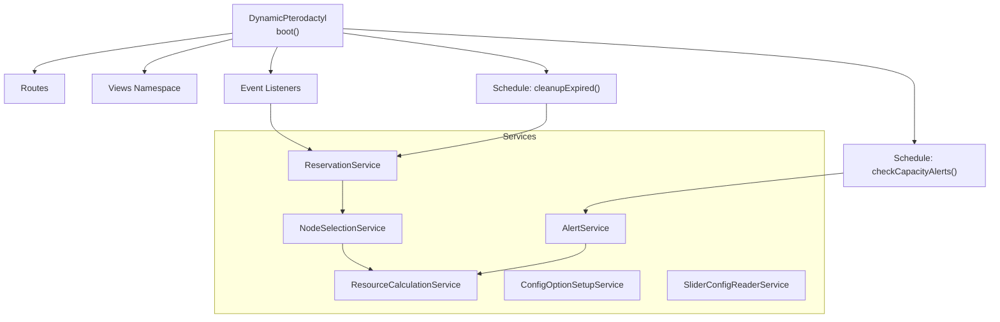
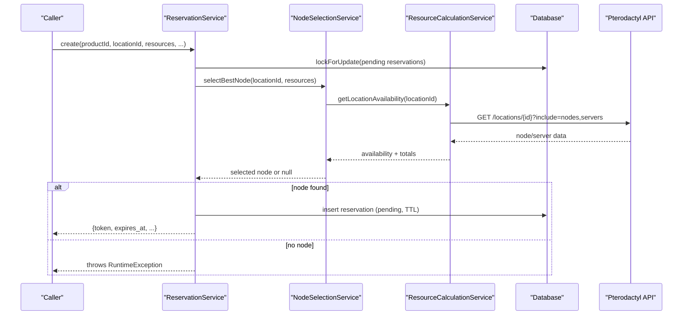
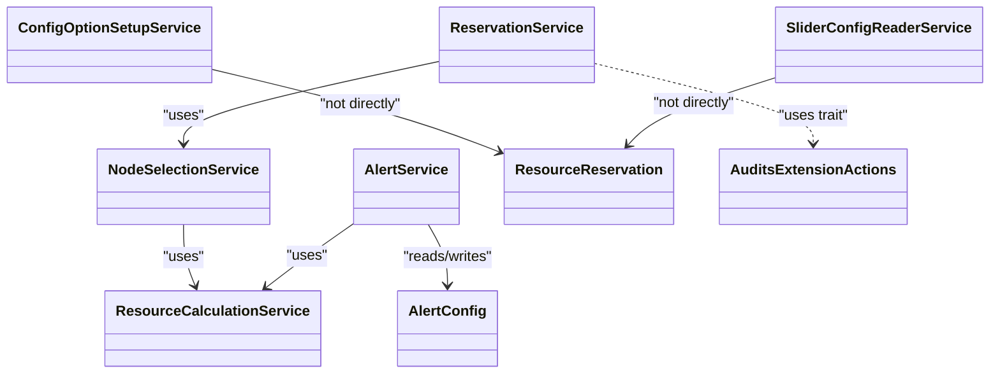
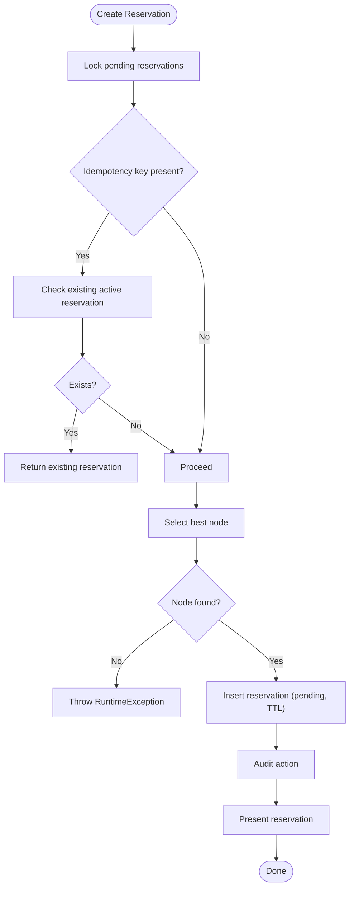
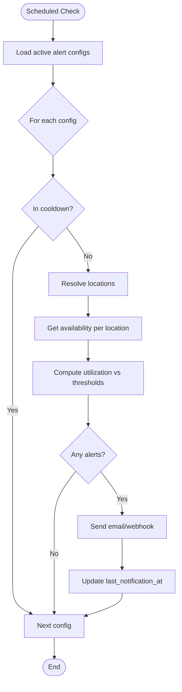

# Core Services

> **Preserved Qoder snapshot.** This deep-dive page is retained so the earlier Wiki work and its source trail are not lost. For the reconciled implementation, [[Architecture Overview|Architecture-Overview]] is canonical; references below to retired controllers, listeners, services, or API shapes are historical.

## Current Service Map

- `PterodactylInventoryService` owns strict, paginated application-API reads.
- `ResourceCalculationService` combines live inventory, local commitments, and
  `NodeCapacityPolicy` records into capacity snapshots.
- `ResourceQuoteService` produces customer-safe, complete-vector quotes.
- `ProductResourceConfigurationService` resolves native Paymenter config
  options; it replaces the retired `SliderConfigReaderService` role.
- `ReservationService` owns cart and paid-service commitments.
- `UpgradeReservationService` owns quote, payment, provisioning, expiry, and
  reconciliation state for service upgrades.
- `AllocationSelectionService`, `NodeSelectionService`, `AlertService`,
  `SchedulerHealthService`, and the audit/configuration services provide the
  supporting policies and operator visibility.

[Current service guide](https://github.com/ObsidianNetwork/dynamic-pterodactyl/blob/cff5a8978d7972ec9513b32b2d7567593fb4f664/02-SERVICES.md)

<cite>
**Referenced Files in This Document**
- [DynamicPterodactyl.php](https://github.com/ObsidianNetwork/dynamic-pterodactyl/blob/6b7f83bda6f7c3fe014d52428b31af1638daa6cc/DynamicPterodactyl.php)
- [ResourceCalculationService.php](https://github.com/ObsidianNetwork/dynamic-pterodactyl/blob/6b7f83bda6f7c3fe014d52428b31af1638daa6cc/Services/ResourceCalculationService.php)
- [NodeSelectionService.php](https://github.com/ObsidianNetwork/dynamic-pterodactyl/blob/6b7f83bda6f7c3fe014d52428b31af1638daa6cc/Services/NodeSelectionService.php)
- [ReservationService.php](https://github.com/ObsidianNetwork/dynamic-pterodactyl/blob/6b7f83bda6f7c3fe014d52428b31af1638daa6cc/Services/ReservationService.php)
- [AlertService.php](https://github.com/ObsidianNetwork/dynamic-pterodactyl/blob/6b7f83bda6f7c3fe014d52428b31af1638daa6cc/Services/AlertService.php)
- [ConfigOptionSetupService.php](https://github.com/ObsidianNetwork/dynamic-pterodactyl/blob/6b7f83bda6f7c3fe014d52428b31af1638daa6cc/Services/ConfigOptionSetupService.php)
- [SliderConfigReaderService.php](https://github.com/ObsidianNetwork/dynamic-pterodactyl/blob/6b7f83bda6f7c3fe014d52428b31af1638daa6cc/Services/SliderConfigReaderService.php)
- [ResourceReservation.php](https://github.com/ObsidianNetwork/dynamic-pterodactyl/blob/6b7f83bda6f7c3fe014d52428b31af1638daa6cc/Models/ResourceReservation.php)
- [AlertConfig.php](https://github.com/ObsidianNetwork/dynamic-pterodactyl/blob/6b7f83bda6f7c3fe014d52428b31af1638daa6cc/Models/AlertConfig.php)
- [AuditsExtensionActions.php](https://github.com/ObsidianNetwork/dynamic-pterodactyl/blob/6b7f83bda6f7c3fe014d52428b31af1638daa6cc/Services/Concerns/AuditsExtensionActions.php)
</cite>

## Table of Contents
1. [Introduction](#introduction)
2. [Project Structure](#project-structure)
3. [Core Components](#core-components)
4. [Architecture Overview](#architecture-overview)
5. [Detailed Component Analysis](#detailed-component-analysis)
6. [Dependency Analysis](#dependency-analysis)
7. [Performance Considerations](#performance-considerations)
8. [Troubleshooting Guide](#troubleshooting-guide)
9. [Conclusion](#conclusion)
10. [Appendices](#appendices)

## Introduction
This document describes the core services that power the Dynamic Pterodactyl extension. It focuses on responsibilities, methods, parameters, return values, error handling patterns, and interdependencies across:
- ResourceCalculationService for real-time Pterodactyl API integration and availability calculations
- NodeSelectionService for intelligent best-fit node selection
- ReservationService for transactional reservation management with TTL handling
- AlertService for capacity monitoring and notifications
- ConfigOptionSetupService for slider configuration management
- SliderConfigReaderService for reading dynamic slider metadata

The extension integrates with Paymenter’s pricing system by reading slider metadata only; it does not calculate prices itself. Reservations follow a strict lifecycle (pending → confirmed | expired | cancelled), use pessimistic locking with deadlock retries, and rely on real-time data from Pterodactyl without caching.

## Project Structure
At runtime, the extension boots via its main class, registers routes, views, event listeners, and schedules cleanup and alert checks. The services live under Services/, models under Models/, and administrative UI under Admin/.

**Diagram sources**
- [DynamicPterodactyl.php:96-127](https://github.com/ObsidianNetwork/dynamic-pterodactyl/blob/6b7f83bda6f7c3fe014d52428b31af1638daa6cc/DynamicPterodactyl.php#L96-L127)

**Section sources**
- [DynamicPterodactyl.php:96-127](https://github.com/ObsidianNetwork/dynamic-pterodactyl/blob/6b7f83bda6f7c3fe014d52428b31af1638daa6cc/DynamicPterodactyl.php#L96-L127)

## Core Components
- ResourceCalculationService: Real-time availability and cluster snapshot builder using Pterodactyl API calls and pending reservations.
- NodeSelectionService: Best-fit algorithm to select the optimal node based on weighted headroom.
- ReservationService: Transactional create/confirm/cancel/extend with TTL, idempotency, pessimistic locking, and audit logging.
- AlertService: Periodic capacity threshold checks with email/webhook delivery and cooldowns.
- ConfigOptionSetupService: Creates/updates dynamic slider options and location options per product.
- SliderConfigReaderService: Reads slider metadata for frontend/API consumption.

**Section sources**
- [ResourceCalculationService.php:23-222](https://github.com/ObsidianNetwork/dynamic-pterodactyl/blob/6b7f83bda6f7c3fe014d52428b31af1638daa6cc/Services/ResourceCalculationService.php#L23-L222)
- [NodeSelectionService.php:14-86](https://github.com/ObsidianNetwork/dynamic-pterodactyl/blob/6b7f83bda6f7c3fe014d52428b31af1638daa6cc/Services/NodeSelectionService.php#L14-L86)
- [ReservationService.php:37-405](https://github.com/ObsidianNetwork/dynamic-pterodactyl/blob/6b7f83bda6f7c3fe014d52428b31af1638daa6cc/Services/ReservationService.php#L37-L405)
- [AlertService.php:30-248](https://github.com/ObsidianNetwork/dynamic-pterodactyl/blob/6b7f83bda6f7c3fe014d52428b31af1638daa6cc/Services/AlertService.php#L30-L248)
- [ConfigOptionSetupService.php:44-258](https://github.com/ObsidianNetwork/dynamic-pterodactyl/blob/6b7f83bda6f7c3fe014d52428b31af1638daa6cc/Services/ConfigOptionSetupService.php#L44-L258)
- [SliderConfigReaderService.php:9-66](https://github.com/ObsidianNetwork/dynamic-pterodactyl/blob/6b7f83bda6f7c3fe014d52428b31af1638daa6cc/Services/SliderConfigReaderService.php#L9-L66)

## Architecture Overview
The services form a layered pipeline:
- Availability layer: ResourceCalculationService fetches live data from Pterodactyl and aggregates per-location/node metrics.
- Selection layer: NodeSelectionService uses availability to pick the best node.
- Reservation layer: ReservationService creates time-bound reservations with idempotency and locks.
- Monitoring layer: AlertService periodically evaluates thresholds and sends alerts.
- Configuration layer: ConfigOptionSetupService provisions slider options; SliderConfigReaderService exposes them.

**Diagram sources**
- [ReservationService.php:43-141](https://github.com/ObsidianNetwork/dynamic-pterodactyl/blob/6b7f83bda6f7c3fe014d52428b31af1638daa6cc/Services/ReservationService.php#L43-L141)
- [NodeSelectionService.php:22-76](https://github.com/ObsidianNetwork/dynamic-pterodactyl/blob/6b7f83bda6f7c3fe014d52428b31af1638daa6cc/Services/NodeSelectionService.php#L22-L76)
- [ResourceCalculationService.php:26-67](https://github.com/ObsidianNetwork/dynamic-pterodactyl/blob/6b7f83bda6f7c3fe014d52428b31af1638daa6cc/Services/ResourceCalculationService.php#L26-L67)

## Detailed Component Analysis

### ResourceCalculationService
Responsibilities:
- Fetch locations and nodes from Pterodactyl API in real time.
- Compute available, allocated, and total resources per node/location.
- Build a full cluster snapshot including utilization and reserved amounts.
- Provide connection diagnostics and availability verification.

Key methods:
- getLocationAvailability(int $locationId, ?string $excludeReservationToken = null): array
  - Parameters: locationId, optional token to exclude current reservation from availability.
  - Returns: aggregated availability including nodes, max_available, total_capacity, total_allocated.
  - Errors: propagates exceptions from API calls; degraded snapshot returned when appropriate.
- buildClusterSnapshot(): array
  - Builds a comprehensive snapshot of all locations/nodes with totals and utilization.
  - Handles fallback if included-servers endpoint fails.
  - Returns empty snapshot with error marker when Pterodactyl is unavailable.
- testConnection(): array
  - Returns success/failure and node count/version headers.
- verifyAvailability(int $nodeId, array $requirements, ?string $excludeReservationToken = null): bool
  - Checks if a specific node can satisfy requirements at payment time.
- getLocations(): array
  - Returns list of locations from Pterodactyl.

Error handling:
- HTTP errors are reported and wrapped into domain-specific RuntimeExceptions.
- Connection failures trigger degraded snapshots where safe.
- Rate limiting returns explicit messages.

Complexity:
- Aggregation is O(N) over servers per node and O(M) over nodes per location.
- Pagination loops scale with number of pages returned by Pterodactyl.

Integration points:
- Used by NodeSelectionService and AlertService.
- Reads extension config for API URL/key.

**Section sources**
- [ResourceCalculationService.php:23-222](https://github.com/ObsidianNetwork/dynamic-pterodactyl/blob/6b7f83bda6f7c3fe014d52428b31af1638daa6cc/Services/ResourceCalculationService.php#L23-L222)
- [ResourceCalculationService.php:227-257](https://github.com/ObsidianNetwork/dynamic-pterodactyl/blob/6b7f83bda6f7c3fe014d52428b31af1638daa6cc/Services/ResourceCalculationService.php#L227-L257)
- [ResourceCalculationService.php:302-384](https://github.com/ObsidianNetwork/dynamic-pterodactyl/blob/6b7f83bda6f7c3fe014d52428b31af1638daa6cc/Services/ResourceCalculationService.php#L302-L384)
- [ResourceCalculationService.php:452-498](https://github.com/ObsidianNetwork/dynamic-pterodactyl/blob/6b7f83bda6f7c3fe014d52428b31af1638daa6cc/Services/ResourceCalculationService.php#L452-L498)

### NodeSelectionService
Responsibilities:
- Select the best node for given resource requirements using a weighted headroom algorithm.
- Expose maximum allocatable resources per location.

Key methods:
- selectBestNode(int $locationId, array $requirements): ?array
  - Parameters: locationId, requirements with memory/cpu/disk.
  - Returns: selected node object or null if none fits.
  - Skips maintenance-mode nodes.
  - Weights: memory 50%, disk 35%, CPU 15%.
- getMaxAvailable(int $locationId): array
  - Returns max available across nodes in location.

Error handling:
- No direct exceptions; returns null when no suitable node exists.

Complexity:
- Single pass over nodes in location; sorting by score is O(K log K).

Integration points:
- Depends on ResourceCalculationService.
- Called by ReservationService during reservation creation.

**Section sources**
- [NodeSelectionService.php:14-86](https://github.com/ObsidianNetwork/dynamic-pterodactyl/blob/6b7f83bda6f7c3fe014d52428b31af1638daa6cc/Services/NodeSelectionService.php#L14-L86)

### ReservationService
Responsibilities:
- Create, confirm, cancel, extend, query, and clean up resource reservations.
- Enforce TTL, idempotency, pessimistic locking, and audit logging.

Key methods:
- create(int $productId, int $locationId, array $resources, ?int $cartItemId = null, ?int $userId = null, ?string $idempotencyKey = null): array
  - Uses DB transaction with lockForUpdate on pending reservations.
  - Supports idempotency key deduplication.
  - Calls NodeSelectionService to find a node.
  - Inserts reservation with TTL and returns presentation object.
  - Throws RuntimeException if no node available.
  - Retries up to 5 times on deadlock.
- confirm(string $token, int $serviceId, ?User $actor = null): bool
  - Authorizes via policy when actor provided.
  - Updates status to confirmed and links service_id.
- cancel(string $token, ?string $reason = null, string $source = 'system', ?User $actor = null): bool
  - Authorizes via policy when actor provided.
  - Marks pending reservation as cancelled.
- extend(string $token, int $additionalMinutes = 15, ?User $actor = null): bool
  - Extends pending reservation TTL.
- getByToken(string $token): ?object
- getByCartItem(int $cartItemId): ?object
- queryAll(array $filters = []): \Illuminate\Database\Eloquent\Builder
- getStatistics(string $period = '30d'): array
  - Aggregates counts, revenue, conversion rate, average resources.
- cleanupExpired(): int
  - Marks expired pending reservations and audits batch.

Error handling:
- Deadlock detection triggers retry within transaction.
- Idempotency duplicate constraints handled gracefully.
- Authorization enforced via Gate when actor is present.

Complexity:
- Locking ensures consistency; queries are targeted by token/location/user.

Integration points:
- Depends on NodeSelectionService.
- Uses AuditLogService via AuditsExtensionActions trait.
- Schedules cleanup via DynamicPterodactyl boot.

**Section sources**
- [ReservationService.php:37-405](https://github.com/ObsidianNetwork/dynamic-pterodactyl/blob/6b7f83bda6f7c3fe014d52428b31af1638daa6cc/Services/ReservationService.php#L37-L405)
- [AuditsExtensionActions.php:8-33](https://github.com/ObsidianNetwork/dynamic-pterodactyl/blob/6b7f83bda6f7c3fe014d52428b31af1638daa6cc/Services/Concerns/AuditsExtensionActions.php#L8-L33)
- [DynamicPterodactyl.php:116-121](https://github.com/ObsidianNetwork/dynamic-pterodactyl/blob/6b7f83bda6f7c3fe014d52428b31af1638daa6cc/DynamicPterodactyl.php#L116-L121)

### AlertService
Responsibilities:
- Periodically check capacity thresholds for configured alert rules.
- Send notifications via email and webhooks with cooldowns.
- Log delivery attempts and failures.

Key methods:
- checkCapacityAlerts(): void
  - Iterates active alert configs and checks thresholds per location.
- sendTestNotification(object $config): void
  - Sends a synthetic alert for testing channels.
- notifyShortfall(int $serviceId, int $invoiceId, array $snapshot, string $reason): void
  - Notifies admins about reservation shortfall or state drift after payment.

Internal logic:
- Computes memory and disk utilization percentages against warning/critical thresholds.
- Applies cooldown_minutes to avoid notification storms.
- Attempts email and webhook channels; records outcomes.

Error handling:
- Exceptions during checks are logged and do not break scheduling.
- Delivery failures are recorded and may trigger events.

Integration points:
- Depends on ResourceCalculationService for availability.
- Uses Notification classes and AlertDeliveryLog model.

**Section sources**
- [AlertService.php:30-248](https://github.com/ObsidianNetwork/dynamic-pterodactyl/blob/6b7f83bda6f7c3fe014d52428b31af1638daa6cc/Services/AlertService.php#L30-L248)
- [AlertService.php:301-361](https://github.com/ObsidianNetwork/dynamic-pterodactyl/blob/6b7f83bda6f7c3fe014d52428b31af1638daa6cc/Services/AlertService.php#L301-L361)

### ConfigOptionSetupService
Responsibilities:
- Create/update dynamic slider options for memory, CPU, and disk per product.
- Manage location dropdown options tied to Pterodactyl locations.
- Validate pricing metadata and enforce defaults.

Key methods:
- createDynamicSliderOptions(int $productId, array $config, array $locations = []): array
  - Creates or updates dynamic_slider options and optional location option.
  - Validates pricing metadata; throws InvalidArgumentException on invalid config.
- checkExistingOptions(int $productId): array
  - Detects existing dynamic sliders for a product.
- getProductsWithSlidersCount(): int
  - Counts products that have dynamic sliders.

Data model:
- Stores metadata describing min/max/step/default, units, display settings, and pricing model.

Integration points:
- Uses Paymenter’s ConfigOption model and DynamicSliderPricingRule.
- Audits setup runs.

**Section sources**
- [ConfigOptionSetupService.php:44-258](https://github.com/ObsidianNetwork/dynamic-pterodactyl/blob/6b7f83bda6f7c3fe014d52428b31af1638daa6cc/Services/ConfigOptionSetupService.php#L44-L258)

### SliderConfigReaderService
Responsibilities:
- Read dynamic slider configurations for a product to expose to API/frontend.

Key method:
- getConfig(int $productId): array
  - Returns has_config flag and normalized slider definitions including pricing.

Error handling:
- Returns empty sliders when none exist; no exceptions.

Integration points:
- Reads ConfigOption entries created by ConfigOptionSetupService.

**Section sources**
- [SliderConfigReaderService.php:9-66](https://github.com/ObsidianNetwork/dynamic-pterodactyl/blob/6b7f83bda6f7c3fe014d52428b31af1638daa6cc/Services/SliderConfigReaderService.php#L9-L66)

## Dependency Analysis
Service dependencies and relationships:

**Diagram sources**
- [NodeSelectionService.php:7-12](https://github.com/ObsidianNetwork/dynamic-pterodactyl/blob/6b7f83bda6f7c3fe014d52428b31af1638daa6cc/Services/NodeSelectionService.php#L7-L12)
- [ReservationService.php:20-35](https://github.com/ObsidianNetwork/dynamic-pterodactyl/blob/6b7f83bda6f7c3fe014d52428b31af1638daa6cc/Services/ReservationService.php#L20-L35)
- [AlertService.php:23-28](https://github.com/ObsidianNetwork/dynamic-pterodactyl/blob/6b7f83bda6f7c3fe014d52428b31af1638daa6cc/Services/AlertService.php#L23-L28)
- [AuditsExtensionActions.php:8-33](https://github.com/ObsidianNetwork/dynamic-pterodactyl/blob/6b7f83bda6f7c3fe014d52428b31af1638daa6cc/Services/Concerns/AuditsExtensionActions.php#L8-L33)

Coupling and cohesion:
- ResourceCalculationService is a foundational dependency with high cohesion around availability computation.
- NodeSelectionService depends solely on ResourceCalculationService and encapsulates selection logic.
- ReservationService orchestrates flow and depends on NodeSelectionService; also relies on database and auditing.
- AlertService depends on ResourceCalculationService and external notification channels.
- ConfigOptionSetupService and SliderConfigReaderService operate on configuration data with minimal coupling.

Potential circular dependencies:
- None detected; dependencies are one-directional.

External integrations:
- Pterodactyl API (HTTP client with retries/timeouts).
- Paymenter core models (ConfigOption, Service, User).
- Laravel scheduling and event system.

**Section sources**
- [ResourceCalculationService.php:452-498](https://github.com/ObsidianNetwork/dynamic-pterodactyl/blob/6b7f83bda6f7c3fe014d52428b31af1638daa6cc/Services/ResourceCalculationService.php#L452-L498)
- [DynamicPterodactyl.php:96-127](https://github.com/ObsidianNetwork/dynamic-pterodactyl/blob/6b7f83bda6f7c3fe014d52428b31af1638daa6cc/DynamicPterodactyl.php#L96-L127)

## Performance Considerations
- Real-time API usage: ResourceCalculationService avoids caching to ensure accuracy; batch requests and pagination minimize round-trips.
- Timeouts and retries: Per-attempt timeouts and limited retries protect against slow/unstable upstream responses.
- Database locking: ReservationService uses pessimistic locking with retries to prevent race conditions during checkout bursts.
- Scheduled tasks: Cleanup and alert checks run at intervals to keep dashboards accurate and reduce load spikes.
- Aggregation complexity: Availability computations are linear in the number of servers/nodes; large clusters should be monitored for API response sizes.

[No sources needed since this section provides general guidance]

## Troubleshooting Guide
Common issues and resolutions:
- Pterodactyl API unreachable:
  - Symptoms: Degraded cluster snapshot or connection failure messages.
  - Action: Verify API URL/key; check network/firewall; review logs for connection exceptions.
- Rate limiting:
  - Symptoms: Explicit rate limit error message.
  - Action: Reduce request frequency; implement backoff at caller level.
- No suitable node:
  - Symptoms: RuntimeException during reservation creation.
  - Action: Check resource requirements vs. actual capacity; consider expanding cluster or lowering requirements.
- Deadlocks:
  - Symptoms: QueryException indicating deadlock.
  - Action: Automatic retries handle transient deadlocks; investigate hotspots if frequent.
- Alerts not delivered:
  - Symptoms: Delivery logs show failed channels.
  - Action: Validate admin recipients and webhook URLs; check cooldowns; inspect logs for channel errors.

**Section sources**
- [ResourceCalculationService.php:157-195](https://github.com/ObsidianNetwork/dynamic-pterodactyl/blob/6b7f83bda6f7c3fe014d52428b31af1638daa6cc/Services/ResourceCalculationService.php#L157-L195)
- [ResourceCalculationService.php:410-424](https://github.com/ObsidianNetwork/dynamic-pterodactyl/blob/6b7f83bda6f7c3fe014d52428b31af1638daa6cc/Services/ResourceCalculationService.php#L410-L424)
- [ReservationService.php:125-141](https://github.com/ObsidianNetwork/dynamic-pterodactyl/blob/6b7f83bda6f7c3fe014d52428b31af1638daa6cc/Services/ReservationService.php#L125-L141)
- [AlertService.php:128-248](https://github.com/ObsidianNetwork/dynamic-pterodactyl/blob/6b7f83bda6f7c3fe014d52428b31af1638daa6cc/Services/AlertService.php#L128-L248)

## Conclusion
The Dynamic Pterodactyl extension’s core services provide a robust foundation for real-time availability, intelligent node selection, transactional reservations with TTL, and proactive capacity alerts. Their design emphasizes correctness (locking, idempotency), resilience (retries, degraded modes), and clarity (separation of concerns across services). Integration with Paymenter remains focused on configuration and events, while pricing logic stays within core.

[No sources needed since this section summarizes without analyzing specific files]

## Appendices

### Method Signatures and Usage Patterns

- ResourceCalculationService
  - getLocationAvailability(locationId, excludeReservationToken?): array
  - buildClusterSnapshot(): array
  - testConnection(): array
  - verifyAvailability(nodeId, requirements, excludeReservationToken?): bool
  - getLocations(): array

- NodeSelectionService
  - selectBestNode(locationId, requirements): ?array
  - getMaxAvailable(locationId): array

- ReservationService
  - create(productId, locationId, resources, cartItemId?, userId?, idempotencyKey?): array
  - confirm(token, serviceId, actor?): bool
  - cancel(token, reason?, source?, actor?): bool
  - extend(token, additionalMinutes?, actor?): bool
  - getByToken(token): ?object
  - getByCartItem(cartItemId): ?object
  - queryAll(filters?): Eloquent Builder
  - getStatistics(period?): array
  - cleanupExpired(): int

- AlertService
  - checkCapacityAlerts(): void
  - sendTestNotification(config): void
  - notifyShortfall(serviceId, invoiceId, snapshot, reason): void

- ConfigOptionSetupService
  - createDynamicSliderOptions(productId, config, locations?): array
  - checkExistingOptions(productId): array
  - getProductsWithSlidersCount(): int

- SliderConfigReaderService
  - getConfig(productId): array

[No sources needed since this section lists signatures without quoting code]

### Data Flow Diagrams

#### Reservation Creation Flow

**Diagram sources**
- [ReservationService.php:43-141](https://github.com/ObsidianNetwork/dynamic-pterodactyl/blob/6b7f83bda6f7c3fe014d52428b31af1638daa6cc/Services/ReservationService.php#L43-L141)

#### Capacity Alert Evaluation Flow

**Diagram sources**
- [AlertService.php:33-75](https://github.com/ObsidianNetwork/dynamic-pterodactyl/blob/6b7f83bda6f7c3fe014d52428b31af1638daa6cc/Services/AlertService.php#L33-L75)
- [AlertService.php:77-126](https://github.com/ObsidianNetwork/dynamic-pterodactyl/blob/6b7f83bda6f7c3fe014d52428b31af1638daa6cc/Services/AlertService.php#L77-L126)
- [AlertService.php:128-248](https://github.com/ObsidianNetwork/dynamic-pterodactyl/blob/6b7f83bda6f7c3fe014d52428b31af1638daa6cc/Services/AlertService.php#L128-L248)
