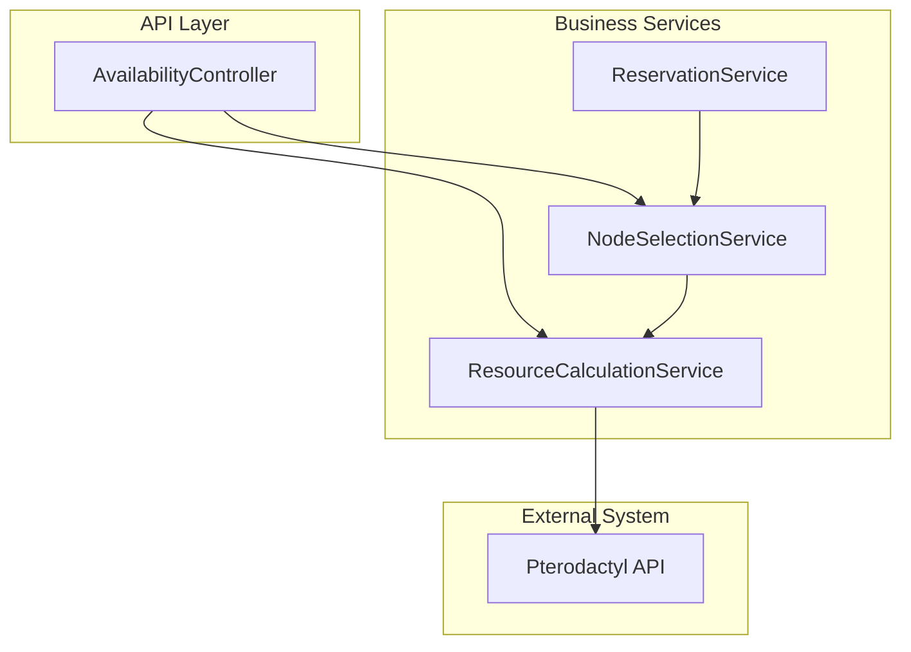
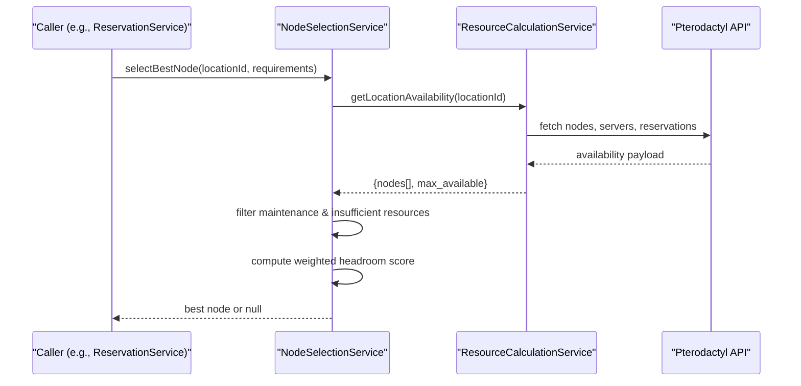
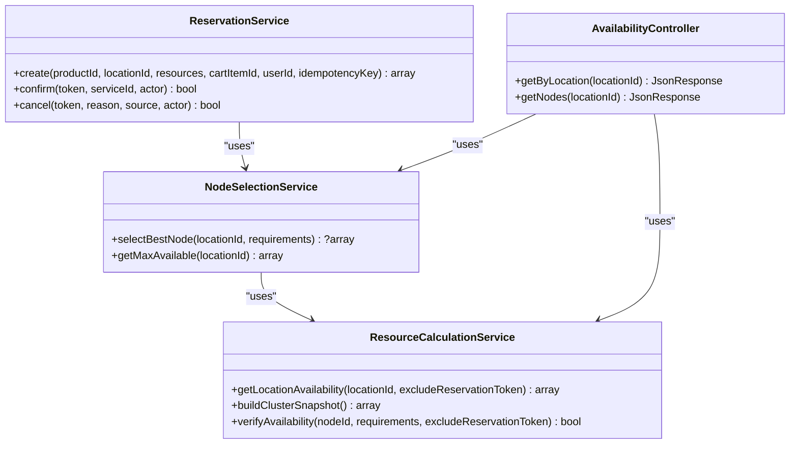

# NodeSelectionService

> **Preserved Qoder snapshot.** This deep-dive page is retained so the earlier Wiki work and its source trail are not lost. For the reconciled implementation, [[Architecture Overview|Architecture-Overview]] is canonical; references below to retired controllers, listeners, services, or API shapes are historical.

<cite>
**Referenced Files in This Document**
- [NodeSelectionService.php](https://github.com/ObsidianNetwork/dynamic-pterodactyl/blob/6b7f83bda6f7c3fe014d52428b31af1638daa6cc/Services/NodeSelectionService.php)
- [ResourceCalculationService.php](https://github.com/ObsidianNetwork/dynamic-pterodactyl/blob/6b7f83bda6f7c3fe014d52428b31af1638daa6cc/Services/ResourceCalculationService.php)
- [ReservationService.php](https://github.com/ObsidianNetwork/dynamic-pterodactyl/blob/6b7f83bda6f7c3fe014d52428b31af1638daa6cc/Services/ReservationService.php)
- [AvailabilityController.php](https://github.com/ObsidianNetwork/dynamic-pterodactyl/blob/6b7f83bda6f7c3fe014d52428b31af1638daa6cc/Http/Controllers/Api/AvailabilityController.php)
- [NodeSelectionServiceTest.php](https://github.com/ObsidianNetwork/dynamic-pterodactyl/blob/6b7f83bda6f7c3fe014d52428b31af1638daa6cc/tests/Unit/NodeSelectionServiceTest.php)
- [ResourceCalculationServiceTest.php](https://github.com/ObsidianNetwork/dynamic-pterodactyl/blob/6b7f83bda6f7c3fe014d52428b31af1638daa6cc/tests/Unit/ResourceCalculationServiceTest.php)
</cite>

## Table of Contents
1. [Introduction](#introduction)
2. [Project Structure](#project-structure)
3. [Core Components](#core-components)
4. [Architecture Overview](#architecture-overview)
5. [Detailed Component Analysis](#detailed-component-analysis)
6. [Dependency Analysis](#dependency-analysis)
7. [Performance Considerations](#performance-considerations)
8. [Troubleshooting Guide](#troubleshooting-guide)
9. [Conclusion](#conclusion)

## Introduction
This document explains the NodeSelectionService, which implements an intelligent best-fit algorithm to select the optimal node for resource allocation within a given location. It uses a weighted scoring system that prioritizes memory headroom (50%), disk headroom (35%), and CPU headroom (15%) after accounting for requested resources. The service integrates with ResourceCalculationService to obtain real-time availability data from Pterodactyl and handles edge cases such as maintenance mode nodes and insufficient resources.

## Project Structure
The NodeSelectionService is part of the DynamicPterodactyl extension and sits between higher-level orchestration (e.g., ReservationService) and low-level availability computation (ResourceCalculationService). AvailabilityController exposes read-only endpoints that use both services to present capacity information without leaking node-level details to customers.

**Diagram sources**
- [AvailabilityController.php:9-20](https://github.com/ObsidianNetwork/dynamic-pterodactyl/blob/6b7f83bda6f7c3fe014d52428b31af1638daa6cc/Http/Controllers/Api/AvailabilityController.php#L9-L20)
- [ReservationService.php:20-35](https://github.com/ObsidianNetwork/dynamic-pterodactyl/blob/6b7f83bda6f7c3fe014d52428b31af1638daa6cc/Services/ReservationService.php#L20-L35)
- [NodeSelectionService.php:5-12](https://github.com/ObsidianNetwork/dynamic-pterodactyl/blob/6b7f83bda6f7c3fe014d52428b31af1638daa6cc/Services/NodeSelectionService.php#L5-L12)
- [ResourceCalculationService.php:10-21](https://github.com/ObsidianNetwork/dynamic-pterodactyl/blob/6b7f83bda6f7c3fe014d52428b31af1638daa6cc/Services/ResourceCalculationService.php#L10-L21)

**Section sources**
- [AvailabilityController.php:22-69](https://github.com/ObsidianNetwork/dynamic-pterodactyl/blob/6b7f83bda6f7c3fe014d52428b31af1638daa6cc/Http/Controllers/Api/AvailabilityController.php#L22-L69)
- [ReservationService.php:43-124](https://github.com/ObsidianNetwork/dynamic-pterodactyl/blob/6b7f83bda6f7c3fe014d52428b31af1638daa6cc/Services/ReservationService.php#L43-L124)
- [NodeSelectionService.php:5-86](https://github.com/ObsidianNetwork/dynamic-pterodactyl/blob/6b7f83bda6f7c3fe014d52428b31af1638daa6cc/Services/NodeSelectionService.php#L5-L86)
- [ResourceCalculationService.php:23-67](https://github.com/ObsidianNetwork/dynamic-pterodactyl/blob/6b7f83bda6f7c3fe014d52428b31af1638daa6cc/Services/ResourceCalculationService.php#L23-L67)

## Core Components
- NodeSelectionService: Implements best-fit selection using weighted headroom scoring and filters out unsuitable nodes.
- ResourceCalculationService: Provides real-time per-location and per-node availability by querying Pterodactyl and aggregating server allocations and pending reservations.
- ReservationService: Orchestrates reservation creation and calls NodeSelectionService to pick a node; enforces pessimistic locking and idempotency.
- AvailabilityController: Exposes aggregate-only customer availability plus a separately authorized admin endpoint for raw node details.

Key responsibilities:
- NodeSelectionService: Evaluate candidates, compute scores, and return the best node or null if none qualify.
- ResourceCalculationService: Build accurate availability snapshots including overallocation factors and pending reservations.
- ReservationService: Manage reservation lifecycle and integrate selection into the booking flow.
- AvailabilityController: Present capacity summaries and ensure no sensitive node details are exposed.

**Section sources**
- [NodeSelectionService.php:14-86](https://github.com/ObsidianNetwork/dynamic-pterodactyl/blob/6b7f83bda6f7c3fe014d52428b31af1638daa6cc/Services/NodeSelectionService.php#L14-L86)
- [ResourceCalculationService.php:23-67](https://github.com/ObsidianNetwork/dynamic-pterodactyl/blob/6b7f83bda6f7c3fe014d52428b31af1638daa6cc/Services/ResourceCalculationService.php#L23-L67)
- [ReservationService.php:43-124](https://github.com/ObsidianNetwork/dynamic-pterodactyl/blob/6b7f83bda6f7c3fe014d52428b31af1638daa6cc/Services/ReservationService.php#L43-L124)
- [AvailabilityController.php:22-69](https://github.com/ObsidianNetwork/dynamic-pterodactyl/blob/6b7f83bda6f7c3fe014d52428b31af1638daa6cc/Http/Controllers/Api/AvailabilityController.php#L22-L69)

## Architecture Overview
The selection process is a two-phase pipeline:
1. Fetch availability for a location via ResourceCalculationService::getLocationAvailability().
2. Filter and score candidate nodes based on remaining headroom after allocating requested resources.
3. Return the highest-scoring node or null if no candidates remain.

**Diagram sources**
- [NodeSelectionService.php:22-76](https://github.com/ObsidianNetwork/dynamic-pterodactyl/blob/6b7f83bda6f7c3fe014d52428b31af1638daa6cc/Services/NodeSelectionService.php#L22-L76)
- [ResourceCalculationService.php:23-67](https://github.com/ObsidianNetwork/dynamic-pterodactyl/blob/6b7f83bda6f7c3fe014d52428b31af1638daa6cc/Services/ResourceCalculationService.php#L23-L67)
- [ResourceCalculationService.php:227-257](https://github.com/ObsidianNetwork/dynamic-pterodactyl/blob/6b7f83bda6f7c3fe014d52428b31af1638daa6cc/Services/ResourceCalculationService.php#L227-L257)

## Detailed Component Analysis

### NodeSelectionService
Responsibilities:
- Obtain location availability from ResourceCalculationService.
- Skip nodes in maintenance mode.
- Enforce hard constraints: available memory, CPU, and disk must meet or exceed requirements.
- Compute a weighted score based on remaining headroom ratios relative to total capacity.
- Sort candidates by descending score and return the top node or null.

Method signatures and behavior:
- selectBestNode(int $locationId, array $requirements): ?array
  - Parameters:
    - locationId: integer identifier of the target location.
    - requirements: associative array with keys memory, cpu, disk representing requested amounts.
  - Returns:
    - Node array with availability and metadata if a suitable node exists; null otherwise.
  - Behavior:
    - Filters out maintenance-mode nodes.
    - Rejects nodes with insufficient available resources.
    - Computes remaining headroom after hypothetical allocation.
    - Applies weights: memory 50%, disk 35%, CPU 15%.
    - Sorts by score and returns the best candidate.

- getMaxAvailable(int $locationId): array
  - Parameters:
    - locationId: integer identifier of the target location.
  - Returns:
    - Aggregate maximum allocatable resources across all nodes in the location (memory, cpu, disk).

Scoring calculation:
- For each eligible node:
  - remainingMemory = available.memory - requirements.memory
  - remainingCpu = available.cpu - requirements.cpu
  - remainingDisk = available.disk - requirements.disk
  - memoryScore = (remainingMemory / max(1, total.memory)) * 0.50
  - diskScore = (remainingDisk / max(1, total.disk)) * 0.35
  - cpuScore = (remainingCpu / max(1, total.cpu)) * 0.15
  - score = memoryScore + diskScore + cpuScore
- Candidates are sorted by score descending; the first is returned.

Edge cases:
- Maintenance mode: skipped entirely.
- Insufficient resources: node excluded from consideration.
- No eligible nodes: returns null.

Examples validated by tests:
- Selects node with most headroom.
- Skips maintenance nodes even if they have the best headroom.
- Skips nodes with insufficient memory, CPU, or disk.
- Returns null when no nodes can satisfy requirements.
- Weighted scoring prefers memory headroom due to its higher weight.

**Section sources**
- [NodeSelectionService.php:14-86](https://github.com/ObsidianNetwork/dynamic-pterodactyl/blob/6b7f83bda6f7c3fe014d52428b31af1638daa6cc/Services/NodeSelectionService.php#L14-L86)
- [NodeSelectionServiceTest.php:32-351](https://github.com/ObsidianNetwork/dynamic-pterodactyl/blob/6b7f83bda6f7c3fe014d52428b31af1638daa6cc/tests/Unit/NodeSelectionServiceTest.php#L32-L351)

### ResourceCalculationService
Responsibilities:
- Provide real-time availability for a location and per-node breakdown.
- Aggregate totals, allocated, reserved, and available resources.
- Handle Pterodactyl API interactions with retries, rate limiting, and error handling.
- Include pending reservations in availability calculations.

Key methods used by NodeSelectionService:
- getLocationAvailability(int $locationId, ?string $excludeReservationToken = null): array
  - Returns structure containing nodes[], max_available, total_capacity, total_allocated.
  - Each node includes total, allocated, reserved, available, utilization, and metadata.

How availability is computed:
- Effective capacities incorporate overallocation multipliers for memory and disk.
- Available resources subtract allocated server limits and pending reservations.
- Pending reservations are aggregated from the database and can be excluded by token for self-check scenarios.

Error handling and resilience:
- Connection exceptions trigger retries and sanitized error messages.
- Rate limit (429) responses throw explicit runtime exceptions.
- Server errors (5xx) degrade gracefully in cluster snapshot paths.

**Section sources**
- [ResourceCalculationService.php:23-67](https://github.com/ObsidianNetwork/dynamic-pterodactyl/blob/6b7f83bda6f7c3fe014d52428b31af1638daa6cc/Services/ResourceCalculationService.php#L23-L67)
- [ResourceCalculationService.php:227-257](https://github.com/ObsidianNetwork/dynamic-pterodactyl/blob/6b7f83bda6f7c3fe014d52428b31af1638daa6cc/Services/ResourceCalculationService.php#L227-L257)
- [ResourceCalculationService.php:452-498](https://github.com/ObsidianNetwork/dynamic-pterodactyl/blob/6b7f83bda6f7c3fe014d52428b31af1638daa6cc/Services/ResourceCalculationService.php#L452-L498)
- [ResourceCalculationServiceTest.php:53-139](https://github.com/ObsidianNetwork/dynamic-pterodactyl/blob/6b7f83bda6f7c3fe014d52428b31af1638daa6cc/tests/Unit/ResourceCalculationServiceTest.php#L53-L139)

### Integration with ReservationService
ReservationService orchestrates the reservation lifecycle and depends on NodeSelectionService during creation:
- Uses pessimistic DB locks and idempotency keys to avoid duplicates.
- Calls NodeSelectionService::selectBestNode() to find a suitable node.
- If no node is found, throws a descriptive runtime exception indicating insufficient resources.
- Persists a pending reservation with TTL and later confirms or cancels it.

Flow highlights:
- Lock pending reservations for the location.
- Resolve or expire stale idempotency reservations.
- Select best node; fail fast if none available.
- Create reservation record with token and expiry.
- Audit actions for traceability.

**Section sources**
- [ReservationService.php:43-124](https://github.com/ObsidianNetwork/dynamic-pterodactyl/blob/6b7f83bda6f7c3fe014d52428b31af1638daa6cc/Services/ReservationService.php#L43-L124)

### Integration with AvailabilityController
AvailabilityController provides separate customer and administrator surfaces:
- getByLocation(locationId): returns max allocatable resources and whether the location has capacity across memory, CPU, and disk. It does not expose node names or FQDNs.
- getNodes(locationId): is admin-only (web + auth + EnsureUserIsAdmin + throttle) and returns raw per-node availability for internal monitoring.

Usage of NodeSelectionService:
- getMaxAvailable(locationId, locationData) reads per-location maximums from the already fetched snapshot, avoiding a second panel request.

**Section sources**
- [AvailabilityController.php:22-69](https://github.com/ObsidianNetwork/dynamic-pterodactyl/blob/6b7f83bda6f7c3fe014d52428b31af1638daa6cc/Http/Controllers/Api/AvailabilityController.php#L22-L69)

## Dependency Analysis
- NodeSelectionService depends on ResourceCalculationService for live availability data.
- ReservationService depends on NodeSelectionService to choose a node during reservation creation.
- AvailabilityController depends on both NodeSelectionService and ResourceCalculationService to present capacity information safely.

**Diagram sources**
- [NodeSelectionService.php:5-86](https://github.com/ObsidianNetwork/dynamic-pterodactyl/blob/6b7f83bda6f7c3fe014d52428b31af1638daa6cc/Services/NodeSelectionService.php#L5-L86)
- [ResourceCalculationService.php:23-67](https://github.com/ObsidianNetwork/dynamic-pterodactyl/blob/6b7f83bda6f7c3fe014d52428b31af1638daa6cc/Services/ResourceCalculationService.php#L23-L67)
- [ReservationService.php:20-35](https://github.com/ObsidianNetwork/dynamic-pterodactyl/blob/6b7f83bda6f7c3fe014d52428b31af1638daa6cc/Services/ReservationService.php#L20-L35)
- [AvailabilityController.php:9-20](https://github.com/ObsidianNetwork/dynamic-pterodactyl/blob/6b7f83bda6f7c3fe014d52428b31af1638daa6cc/Http/Controllers/Api/AvailabilityController.php#L9-L20)

**Section sources**
- [NodeSelectionService.php:5-86](https://github.com/ObsidianNetwork/dynamic-pterodactyl/blob/6b7f83bda6f7c3fe014d52428b31af1638daa6cc/Services/NodeSelectionService.php#L5-L86)
- [ResourceCalculationService.php:23-67](https://github.com/ObsidianNetwork/dynamic-pterodactyl/blob/6b7f83bda6f7c3fe014d52428b31af1638daa6cc/Services/ResourceCalculationService.php#L23-L67)
- [ReservationService.php:20-35](https://github.com/ObsidianNetwork/dynamic-pterodactyl/blob/6b7f83bda6f7c3fe014d52428b31af1638daa6cc/Services/ReservationService.php#L20-L35)
- [AvailabilityController.php:9-20](https://github.com/ObsidianNetwork/dynamic-pterodactyl/blob/6b7f83bda6f7c3fe014d52428b31af1638daa6cc/Http/Controllers/Api/AvailabilityController.php#L9-L20)

## Performance Considerations
- Real-time queries: ResourceCalculationService always queries Pterodactyl for current availability; this avoids stale state but incurs network latency.
- Batching and pagination: Cluster snapshot builds batch API calls and paginate results to minimize overhead.
- Retry and timeouts: HTTP client uses short connect and request timeouts with limited retries for transient connection issues; non-retryable errors (4xx except 429, 5xx) are handled explicitly.
- Scoring complexity: Selection iterates over nodes once and performs constant-time math per node; sorting is O(n log n), acceptable for typical node counts.
- Database contention: ReservationService uses pessimistic locking with retries to handle deadlocks during concurrent reservation creation.

[No sources needed since this section provides general guidance]

## Troubleshooting Guide
Common issues and how they are handled:
- No suitable node found:
  - NodeSelectionService returns null when no node meets requirements or all are in maintenance mode.
  - ReservationService throws a runtime exception indicating insufficient resources.
- Maintenance mode nodes:
  - Automatically skipped during selection; verify node status in Pterodactyl if unexpected exclusions occur.
- Insufficient resources:
  - Nodes lacking required memory, CPU, or disk are filtered out; check available vs. requirements and consider scaling or adjusting quotas.
- API errors:
  - ResourceCalculationService sanitizes error messages and may throw runtime exceptions for rate limits or server errors; inspect logs for upstream diagnostics.
- Edge fit verification:
  - When verifying availability for a specific reservation token, exclude that token to avoid double-counting its own reservation.

Operational tips:
- Use AvailabilityController endpoints to validate location capacity before attempting reservations.
- Monitor Pterodactyl connectivity and rate limits; adjust retry/backoff strategies if necessary.
- Ensure pending reservations are cleaned up to prevent artificial scarcity.

**Section sources**
- [NodeSelectionService.php:22-76](https://github.com/ObsidianNetwork/dynamic-pterodactyl/blob/6b7f83bda6f7c3fe014d52428b31af1638daa6cc/Services/NodeSelectionService.php#L22-L76)
- [ReservationService.php:75-79](https://github.com/ObsidianNetwork/dynamic-pterodactyl/blob/6b7f83bda6f7c3fe014d52428b31af1638daa6cc/Services/ReservationService.php#L75-L79)
- [ResourceCalculationService.php:452-498](https://github.com/ObsidianNetwork/dynamic-pterodactyl/blob/6b7f83bda6f7c3fe014d52428b31af1638daa6cc/Services/ResourceCalculationService.php#L452-L498)
- [ResourceCalculationServiceTest.php:53-139](https://github.com/ObsidianNetwork/dynamic-pterodactyl/blob/6b7f83bda6f7c3fe014d52428b31af1638daa6cc/tests/Unit/ResourceCalculationServiceTest.php#L53-L139)

## Conclusion
NodeSelectionService provides a robust, weighted best-fit algorithm that balances memory, disk, and CPU headroom to select optimal nodes for resource allocation. It integrates tightly with ResourceCalculationService for real-time availability and works within ReservationService’s transactional and idempotent reservation workflow. The design ensures safety through maintenance mode filtering, hard constraint enforcement, and clear error signaling when resources are insufficient. Customer-facing APIs remain safe by exposing only aggregate capacity metrics.

[No sources needed since this section summarizes without analyzing specific files]
