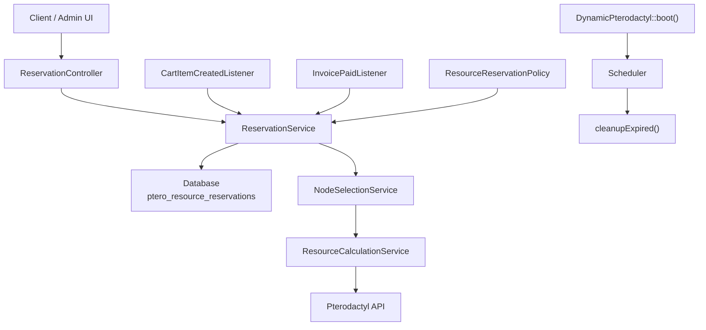
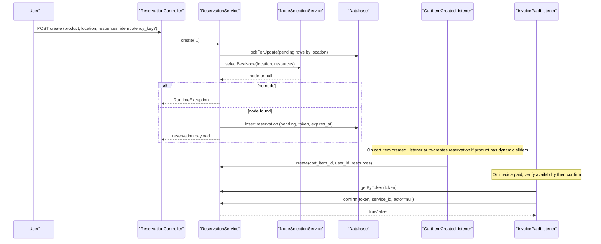
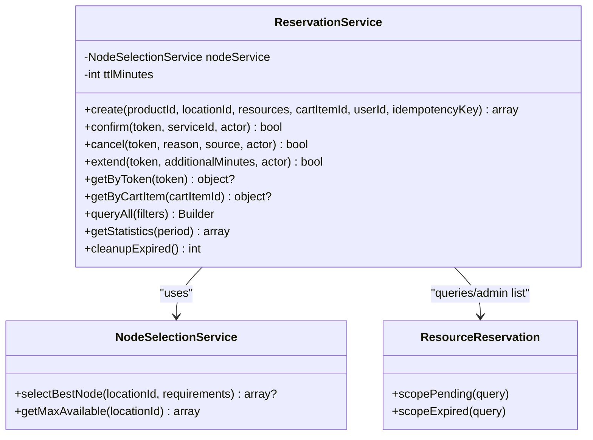
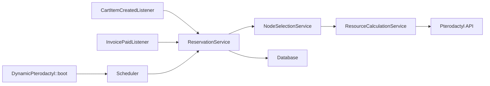
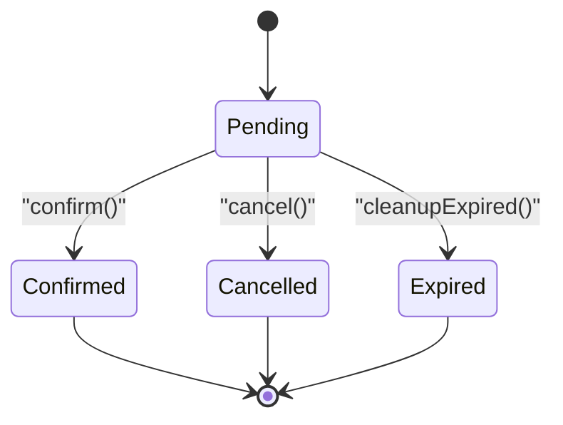
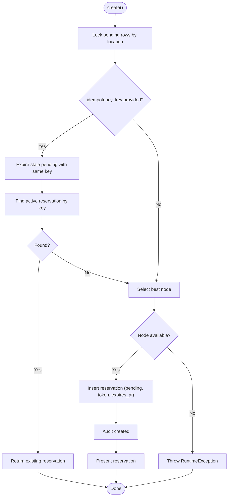

# ReservationService

<cite>
**Referenced Files in This Document**
- [ReservationService.php](file://Services/ReservationService.php)
- [ResourceReservation.php](file://Models/ResourceReservation.php)
- [ReservationController.php](file://Http/Controllers/Api/ReservationController.php)
- [StoreReservationRequest.php](file://Http/Requests/StoreReservationRequest.php)
- [CartItemCreatedListener.php](file://Listeners/CartItemCreatedListener.php)
- [InvoicePaidListener.php](file://Listeners/InvoicePaidListener.php)
- [DynamicPterodactyl.php](file://DynamicPterodactyl.php)
- [2025_01_01_000001_create_ptero_resource_reservations_table.php](file://database/migrations/2025_01_01_000001_create_ptero_resource_reservations_table.php)
- [2026_04_23_000001_add_idempotency_key_to_ptero_resource_reservations.php](file://database/migrations/2026_04_23_000001_add_idempotency_key_to_ptero_resource_reservations.php)
- [NodeSelectionService.php](file://Services/NodeSelectionService.php)
- [ResourceCalculationService.php](file://Services/ResourceCalculationService.php)
- [ResourceReservationPolicy.php](file://Policies/ResourceReservationPolicy.php)
</cite>

## Table of Contents
1. [Introduction](#introduction)
2. [Project Structure](#project-structure)
3. [Core Components](#core-components)
4. [Architecture Overview](#architecture-overview)
5. [Detailed Component Analysis](#detailed-component-analysis)
6. [Dependency Analysis](#dependency-analysis)
7. [Performance Considerations](#performance-considerations)
8. [Troubleshooting Guide](#troubleshooting-guide)
9. [Conclusion](#conclusion)
10. [Appendices](#appendices)

## Introduction
This document explains the ReservationService, which manages the complete lifecycle of resource reservations for dynamic Pterodactyl products within Paymenter. It enforces a strict state machine (pending → confirmed | expired | cancelled), uses TTL-based expiration, and applies pessimistic database locking with deadlock retries to prevent race conditions. The service integrates tightly with Paymenter’s cart and invoice events, coordinates node selection and availability checks, and exposes metrics and cleanup routines for operational visibility.

Key guarantees:
- Strict reservation states: pending, confirmed, expired, cancelled.
- TTL-based expiration enforced by scheduled cleanup.
- Pessimistic locking on pending rows during creation with retry on deadlocks.
- Idempotent creation via unique idempotency keys scoped per user.
- Integration points with cart item creation and invoice payment events.
- Monitoring through statistics and audit logging.

## Project Structure
The reservation system spans controllers, services, models, listeners, policies, migrations, and scheduling logic:

**Diagram sources**
- [ReservationController.php:24-136](file://Http/Controllers/Api/ReservationController.php#L24-L136)
- [ReservationService.php:43-453](file://Services/ReservationService.php#L43-L453)
- [NodeSelectionService.php:22-86](file://Services/NodeSelectionService.php#L22-L86)
- [CartItemCreatedListener.php:13-87](file://Listeners/CartItemCreatedListener.php#L13-L87)
- [InvoicePaidListener.php:14-133](file://Listeners/InvoicePaidListener.php#L14-L133)
- [DynamicPterodactyl.php:96-127](file://DynamicPterodactyl.php#L96-L127)

**Section sources**
- [DynamicPterodactyl.php:96-127](file://DynamicPterodactyl.php#L96-L127)
- [ReservationController.php:24-136](file://Http/Controllers/Api/ReservationController.php#L24-L136)

## Core Components
- ReservationService: Central orchestrator for creating, confirming, cancelling, extending, querying, cleaning up, and reporting on reservations.
- ResourceReservation model: Eloquent representation of the reservation table with scopes for pending/expired and casts for pricing and timestamps.
- NodeSelectionService: Selects the best node based on weighted headroom using real-time availability data.
- ResourceCalculationService: Provides real-time availability from Pterodactyl and verifies capacity at payment time.
- Listeners: CartItemCreatedListener creates reservations when dynamic slider products are added; InvoicePaidListener confirms reservations after payment.
- Policies: Enforce authorization for view/cancel/extend/confirm operations.
- Migrations: Define schema, indexes, and idempotency constraints.

**Section sources**
- [ReservationService.php:16-453](file://Services/ReservationService.php#L16-L453)
- [ResourceReservation.php:10-65](file://Models/ResourceReservation.php#L10-L65)
- [NodeSelectionService.php:22-86](file://Services/NodeSelectionService.php#L22-L86)
- [CartItemCreatedListener.php:13-87](file://Listeners/CartItemCreatedListener.php#L13-L87)
- [InvoicePaidListener.php:14-133](file://Listeners/InvoicePaidListener.php#L14-L133)
- [ResourceReservationPolicy.php:9-68](file://Policies/ResourceReservationPolicy.php#L9-L68)
- [2025_01_01_000001_create_ptero_resource_reservations_table.php:11-78](file://database/migrations/2025_01_01_000001_create_ptero_resource_reservations_table.php#L11-L78)
- [2026_04_23_000001_add_idempotency_key_to_ptero_resource_reservations.php:11-20](file://database/migrations/2026_04_23_000001_add_idempotency_key_to_ptero_resource_reservations.php#L11-L20)

## Architecture Overview
The reservation lifecycle is event-driven and transactional:

**Diagram sources**
- [ReservationController.php:24-60](file://Http/Controllers/Api/ReservationController.php#L24-L60)
- [ReservationService.php:43-141](file://Services/ReservationService.php#L43-L141)
- [NodeSelectionService.php:22-76](file://Services/NodeSelectionService.php#L22-L76)
- [CartItemCreatedListener.php:47-87](file://Listeners/CartItemCreatedListener.php#L47-L87)
- [InvoicePaidListener.php:36-96](file://Listeners/InvoicePaidListener.php#L36-L96)

## Detailed Component Analysis

### ReservationService
Responsibilities:
- Create: Acquires pessimistic locks on pending reservations for the target location, selects a node, inserts a new reservation with a unique token and TTL, and supports idempotent creation via idempotency key. Retries transactions up to 5 times on deadlock.
- Confirm: Atomically transitions pending + not expired to confirmed and attaches the service ID. Supports optional actor-based authorization.
- Cancel: Transitions pending to cancelled with optional reason notes. Supports optional actor-based authorization.
- Extend: Extends the TTL of a pending reservation by additional minutes. Supports optional actor-based authorization.
- Query: Retrieve by token or cart item; admin query builder with filters; statistics aggregation.
- Cleanup: Batch marks pending past TTL as expired and audits the batch run.

State transitions enforced:
- pending → confirmed (confirm)
- pending → cancelled (cancel)
- pending → expired (cleanup)
- No direct transitions to/from confirmed/expired/cancelled except via these methods.

Idempotency:
- Optional idempotency_key is stored alongside an active computed column used by a unique constraint scoped to user_id and active status. Before insertion, stale pending reservations with the same key are expired. Duplicate key attempts return the existing active reservation.

TTL handling:
- TTL configured per extension settings (default 15 minutes). Expiration checked against now() in queries and updates. Scheduled job runs every minute to mark overdue pending reservations as expired.

Pessimistic locking and retries:
- Creation locks all pending reservations for the location to avoid double allocation under concurrency. Transaction wraps the critical section and retries up to 5 times on deadlock exceptions.

Audit and monitoring:
- All mutations log via AuditsExtensionActions helper. Statistics endpoint aggregates counts by status, revenue, conversion rate, and average resources.

Error handling:
- RuntimeException thrown when no suitable node is available.
- Duplicate idempotency key conflicts are handled gracefully by returning the existing reservation.
- Controller catches exceptions and returns appropriate JSON responses.

**Section sources**
- [ReservationService.php:24-35](file://Services/ReservationService.php#L24-L35)
- [ReservationService.php:43-141](file://Services/ReservationService.php#L43-L141)
- [ReservationService.php:166-199](file://Services/ReservationService.php#L166-L199)
- [ReservationService.php:208-241](file://Services/ReservationService.php#L208-L241)
- [ReservationService.php:250-281](file://Services/ReservationService.php#L250-L281)
- [ReservationService.php:335-382](file://Services/ReservationService.php#L335-L382)
- [ReservationService.php:387-405](file://Services/ReservationService.php#L387-L405)
- [ReservationService.php:431-452](file://Services/ReservationService.php#L431-L452)

#### Class diagram

**Diagram sources**
- [ReservationService.php:16-453](file://Services/ReservationService.php#L16-L453)
- [NodeSelectionService.php:5-86](file://Services/NodeSelectionService.php#L5-L86)
- [ResourceReservation.php:10-65](file://Models/ResourceReservation.php#L10-L65)

### Data Model and Constraints
- Table stores token, idempotency_key, active computed column, links to cart/service/user, node/location, reserved resources, pricing snapshot, status, notes, and timestamps.
- Indexes optimize lookups for node+status+expires, cleanup scans, location+status, user+status, and created_at.
- Unique constraint on token; unique constraint on (user_id, active_idempotency_key) ensures one active reservation per idempotency key per user.

**Section sources**
- [2025_01_01_000001_create_ptero_resource_reservations_table.php:11-78](file://database/migrations/2025_01_01_000001_create_ptero_resource_reservations_table.php#L11-L78)
- [2026_04_23_000001_add_idempotency_key_to_ptero_resource_reservations.php:11-20](file://database/migrations/2026_04_23_000001_add_idempotency_key_to_ptero_resource_reservations.php#L11-L20)

### API Surface and Validation
- Create: Accepts product_id, location_id, resource sliders (memory/cpu/disk), optional cart_item_id, and optional idempotency_key header or body field. Validates presence and ranges based on product configuration.
- Get: Returns reservation by token with policy check.
- Cancel: Requires authorization; calls service cancel.
- Extend: Validates minutes range; extends TTL and returns updated expiry.

**Section sources**
- [ReservationController.php:24-136](file://Http/Controllers/Api/ReservationController.php#L24-L136)
- [StoreReservationRequest.php:38-112](file://Http/Requests/StoreReservationRequest.php#L38-L112)

### Event Integrations

#### Cart Item Created Listener
- Detects products with dynamic_slider options, extracts memory/cpu/disk values and location, then creates a reservation via ReservationService. Stores token and selected node in checkout_config for later use. Errors are logged but do not block cart flow.

**Section sources**
- [CartItemCreatedListener.php:13-87](file://Listeners/CartItemCreatedListener.php#L13-L87)

#### Invoice Paid Listener
- For each invoice item referencing a Service, retrieves the reservation token from service properties. Verifies current availability against the reserved snapshot. If available, confirms the reservation; otherwise logs shortfall and notifies via AlertService. Handles state drift where reservation may have been cancelled or expired between verification and confirmation.

**Section sources**
- [InvoicePaidListener.php:14-133](file://Listeners/InvoicePaidListener.php#L14-L133)

### Scheduling and Cleanup
- The extension boot registers a scheduler that runs every minute to call cleanupExpired(), marking overdue pending reservations as expired without overlapping runs. A second schedule checks capacity alerts every five minutes.

**Section sources**
- [DynamicPterodactyl.php:116-127](file://DynamicPterodactyl.php#L116-L127)

### Authorization
- ResourceReservationPolicy allows admin bypass via Filament panel access. For regular users, view/cancel/extend/confirm require ownership (reservation.user_id matches current user). System callers pass null actor to skip policy checks where appropriate.

**Section sources**
- [ResourceReservationPolicy.php:9-68](file://Policies/ResourceReservationPolicy.php#L9-L68)

## Dependency Analysis

**Diagram sources**
- [ReservationService.php:43-141](file://Services/ReservationService.php#L43-L141)
- [NodeSelectionService.php:22-86](file://Services/NodeSelectionService.php#L22-L86)
- [CartItemCreatedListener.php:47-87](file://Listeners/CartItemCreatedListener.php#L47-L87)
- [InvoicePaidListener.php:36-96](file://Listeners/InvoicePaidListener.php#L36-L96)
- [DynamicPterodactyl.php:96-127](file://DynamicPterodactyl.php#L96-L127)

**Section sources**
- [ReservationService.php:43-141](file://Services/ReservationService.php#L43-L141)
- [NodeSelectionService.php:22-86](file://Services/NodeSelectionService.php#L22-L86)
- [CartItemCreatedListener.php:47-87](file://Listeners/CartItemCreatedListener.php#L47-L87)
- [InvoicePaidListener.php:36-96](file://Listeners/InvoicePaidListener.php#L36-L96)
- [DynamicPterodactyl.php:96-127](file://DynamicPterodactyl.php#L96-L127)

## Performance Considerations
- Real-time availability: Node selection and verification call into ResourceCalculationService, which fetches live data from Pterodactyl. This avoids stale cache but introduces external latency; batching is used internally to minimize API calls.
- Lock contention: Creating reservations locks all pending rows for a location. High concurrency can cause deadlocks; the service retries up to 5 times. Ensure reasonable TTL and efficient client retries.
- Index usage: Queries rely on indexes for node+status+expires, cleanup scans, and user+status. Keep workload aligned with these patterns.
- Scheduling: cleanupExpired runs every minute; ensure queue/scheduler is healthy to avoid backlog of expired reservations.

[No sources needed since this section provides general guidance]

## Troubleshooting Guide
Common issues and resolutions:
- No node available: Occurs when requirements exceed any node’s available capacity. Check resource sliders and location configuration; consider adjusting limits or waiting for capacity changes.
- Duplicate idempotency key: If multiple requests send the same idempotency_key, only one reservation is created; subsequent requests return the existing active reservation. Verify client idempotency key generation.
- Reservation expired before payment: If TTL elapses, cleanupExpired marks it as expired. Extend TTL via extend endpoint or adjust TTL setting.
- State drift at payment: Between availability verification and confirmation, a reservation could be cancelled or expired. The listener handles this by logging and alerting; re-check availability or allow retry.
- Authorization failures: Ensure the authenticated user owns the reservation or is an admin. Non-admin users cannot act on other users’ reservations.

Operational checks:
- Monitor statistics via getStatistics for total, by_status, conversion_rate, and average resources.
- Review audit logs for created/confirmed/cancelled/extended/expired actions.
- Inspect scheduler logs for cleanup runs and capacity alert checks.

**Section sources**
- [ReservationService.php:43-141](file://Services/ReservationService.php#L43-L141)
- [ReservationService.php:335-382](file://Services/ReservationService.php#L335-L382)
- [InvoicePaidListener.php:58-125](file://Listeners/InvoicePaidListener.php#L58-L125)
- [DynamicPterodactyl.php:116-127](file://DynamicPterodactyl.php#L116-L127)

## Conclusion
ReservationService provides a robust, auditable, and concurrent-safe mechanism to reserve compute resources during checkout. It combines strict state transitions, TTL enforcement, pessimistic locking with retries, and idempotent creation to protect against race conditions and duplicate allocations. Integration with Paymenter’s cart and invoice events ensures reservations are created automatically and confirmed reliably upon payment, while scheduled cleanup maintains data integrity and accurate availability.

[No sources needed since this section summarizes without analyzing specific files]

## Appendices

### State Machine

**Diagram sources**
- [ReservationService.php:166-199](file://Services/ReservationService.php#L166-L199)
- [ReservationService.php:208-241](file://Services/ReservationService.php#L208-L241)
- [ReservationService.php:387-405](file://Services/ReservationService.php#L387-L405)

### Idempotent Create Flow

**Diagram sources**
- [ReservationService.php:43-141](file://Services/ReservationService.php#L43-L141)
- [ReservationService.php:431-452](file://Services/ReservationService.php#L431-L452)