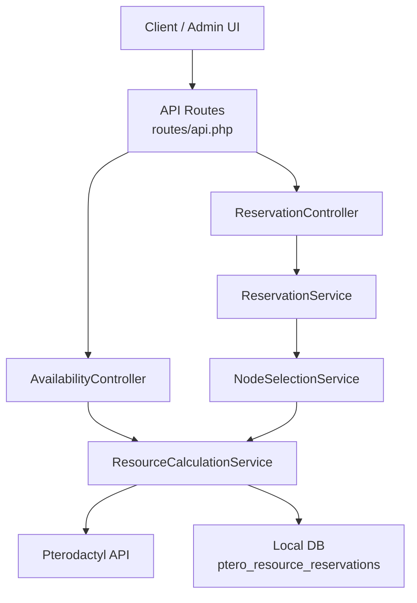
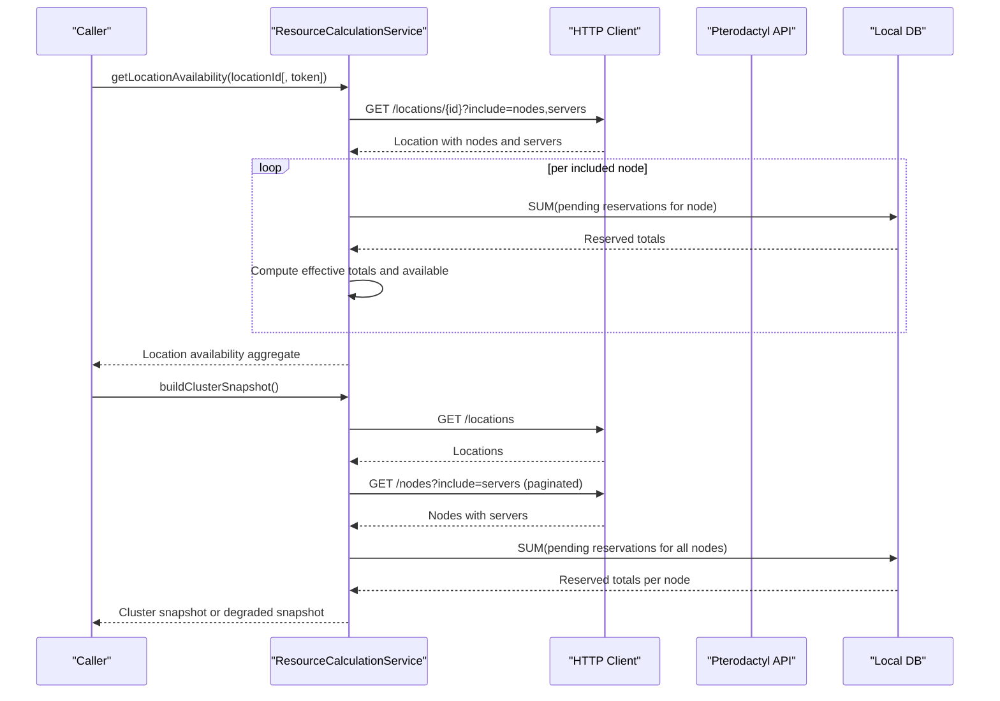
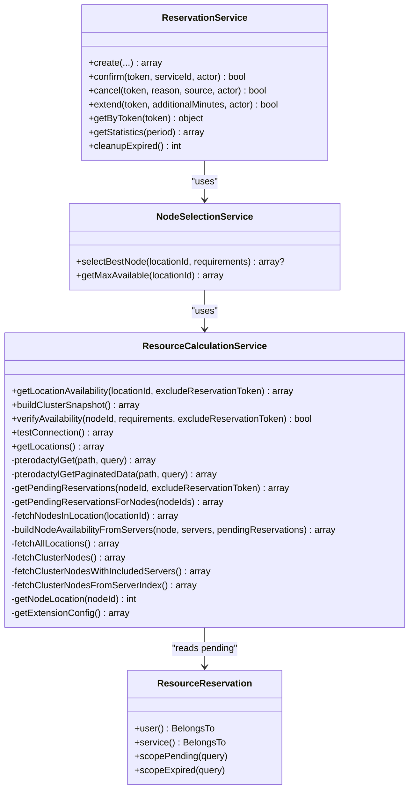

# ResourceCalculationService

<cite>
**Referenced Files in This Document**
- [ResourceCalculationService.php](file://Services/ResourceCalculationService.php)
- [ReservationService.php](file://Services/ReservationService.php)
- [ResourceReservation.php](file://Models/ResourceReservation.php)
- [NodeSelectionService.php](file://Services/NodeSelectionService.php)
- [api.php](file://routes/api.php)
- [ResourceCalculationServiceTest.php](file://tests/Unit/ResourceCalculationServiceTest.php)
</cite>

## Table of Contents
1. [Introduction](#introduction)
2. [Project Structure](#project-structure)
3. [Core Components](#core-components)
4. [Architecture Overview](#architecture-overview)
5. [Detailed Component Analysis](#detailed-component-analysis)
6. [Dependency Analysis](#dependency-analysis)
7. [Performance Considerations](#performance-considerations)
8. [Troubleshooting Guide](#troubleshooting-guide)
9. [Conclusion](#conclusion)

## Introduction
ResourceCalculationService is the real-time availability engine for this extension. It queries Pterodactyl to compute current node and location capacity, integrates pending reservations from the local database to prevent overselling, and exposes methods used by controllers and other services to answer “can we allocate here?” at every step of the checkout flow.

Key architectural decisions:
- No caching of Pterodactyl API responses. Real-time data is required to avoid overselling and stale capacity views.
- Batched API calls in buildClusterSnapshot() minimize requests while still reflecting live state.
- Pending reservations are subtracted from available resources so concurrent checkouts cannot double-book nodes.
- Degraded mode returns a minimal snapshot when Pterodactyl is unavailable, keeping admin UIs responsive.

## Project Structure
This service lives under Services and is consumed by:
- Availability endpoints (throttled routes)
- Node selection during reservation creation
- Admin dashboards that render cluster snapshots

**Diagram sources**
- [api.php:17-25](file://routes/api.php#L17-L25)
- [ResourceCalculationService.php:26-222](file://Services/ResourceCalculationService.php#L26-L222)
- [ReservationService.php:43-141](file://Services/ReservationService.php#L43-L141)
- [NodeSelectionService.php:22-86](file://Services/NodeSelectionService.php#L22-L86)

**Section sources**
- [api.php:17-25](file://routes/api.php#L17-L25)

## Core Components
- ResourceCalculationService: Real-time availability calculations, cluster snapshot building, connection diagnostics, and verification against requirements.
- ReservationService: Creates, confirms, cancels, extends, and cleans up resource reservations with pessimistic locking and idempotency.
- NodeSelectionService: Selects the best node based on weighted headroom using ResourceCalculationService outputs.
- ResourceReservation model: Eloquent model for the reservation table with scopes for pending/expired states.

Responsibilities summary:
- Fetch locations and nodes from Pterodactyl
- Sum allocated resources per node from server limits
- Subtract pending reservations to compute available resources
- Aggregate per-location and per-node metrics
- Provide degraded snapshots when Pterodactyl is down
- Expose verifyAvailability() to gate payment-time allocations

**Section sources**
- [ResourceCalculationService.php:26-222](file://Services/ResourceCalculationService.php#L26-L222)
- [ReservationService.php:43-141](file://Services/ReservationService.php#L43-L141)
- [NodeSelectionService.php:22-86](file://Services/NodeSelectionService.php#L22-L86)
- [ResourceReservation.php:10-66](file://Models/ResourceReservation.php#L10-L66)

## Architecture Overview
The service uses a thin HTTP client wrapper around Pterodactyl’s Application API with retries on transient connection errors, strict timeouts, and sanitized error propagation. For cluster-wide snapshots, it batches node and server data retrieval to reduce API calls while preserving accuracy.

**Diagram sources**
- [ResourceCalculationService.php:26-141](file://Services/ResourceCalculationService.php#L26-L141)
- [ResourceCalculationService.php:291-384](file://Services/ResourceCalculationService.php#L291-L384)
- [ResourceCalculationService.php:426-450](file://Services/ResourceCalculationService.php#L426-L450)
- [ResourceCalculationService.php:452-498](file://Services/ResourceCalculationService.php#L452-L498)

## Detailed Component Analysis

### Method: getLocationAvailability(locationId, excludeReservationToken = null)
Purpose:
- Return real-time availability for a location, including per-node breakdowns and aggregated max/total/allocated metrics.

Parameters:
- locationId: integer
- excludeReservationToken: optional string to exclude a specific pending reservation from the calculation (used when verifying a candidate allocation that already reserved resources)

Return value:
- Array with:
  - location_id
  - nodes: array of node availability objects
  - max_available: maximum single-node available across the location
  - total_capacity: sum of effective capacities across nodes
  - total_allocated: sum of allocated resources across nodes

Processing logic:
- Fetches the location with included nodes and servers in one Pterodactyl request
- Groups included servers by node and fetches pending reservations for each node
- Computes effective totals using overallocation settings
- Subtracts allocated and reserved resources to derive available
- Aggregates max and totals across nodes

Error handling:
- Propagates exceptions from underlying HTTP calls; callers should handle failures gracefully.

Usage pattern example:
- Called by NodeSelectionService to evaluate candidates and by AvailabilityController to expose location-level capacity.

**Section sources**
- [ResourceCalculationService.php:26-67](file://Services/ResourceCalculationService.php#L26-L67)
- [ResourceCalculationService.php:146-152](file://Services/ResourceCalculationService.php#L146-L152)
- [ResourceCalculationService.php:226-245](file://Services/ResourceCalculationService.php#L226-L245)
- [ResourceCalculationService.php:227-257](file://Services/ResourceCalculationService.php#L227-L257)
- [ResourceCalculationService.php:500-522](file://Services/ResourceCalculationService.php#L500-L522)

### Method: buildClusterSnapshot()
Purpose:
- Build a full cluster view with locations, nodes, per-node metrics, and per-location aggregates. Used by admin dashboards and monitoring.

Return value:
- Snapshot object containing:
  - locations
  - nodes keyed by node id
  - by_location aggregations
  - generated_at timestamp
  - error field when degraded

Processing logic:
- Fetches locations and nodes with servers included
- Batches pending reservation sums across all nodes
- Builds per-node availability and per-location aggregates
- On Pterodactyl 5xx or connection failure, returns a degraded snapshot instead of failing

Optimization:
- Uses paginated endpoints and includes relationships to minimize round-trips
- Ensures call count stays bounded even with many nodes

Degraded mode:
- When Pterodactyl is unavailable, returns an empty snapshot plus an error marker so UIs remain usable.

**Section sources**
- [ResourceCalculationService.php:69-141](file://Services/ResourceCalculationService.php#L69-L141)
- [ResourceCalculationService.php:291-357](file://Services/ResourceCalculationService.php#L291-L357)
- [ResourceCalculationService.php:393-417](file://Services/ResourceCalculationService.php#L393-L417)

### Method: verifyAvailability(nodeId, requirements, excludeReservationToken = null)
Purpose:
- Confirm that a specific node can satisfy new requirements at payment time, optionally excluding the caller’s own pending reservation.

Parameters:
- nodeId: integer
- requirements: associative array with memory, cpu, disk
- excludeReservationToken: optional string to ignore the caller’s own pending reservation

Return value:
- Boolean indicating whether the node has sufficient available resources

Processing logic:
- Determines the node’s location
- Fetches the node and its current availability
- Compares available vs requirements

Use case:
- Gate final confirmation to prevent race conditions between availability checks and payment completion.

**Section sources**
- [ResourceCalculationService.php:197-214](file://Services/ResourceCalculationService.php#L197-L214)
- [ResourceCalculationService.php:524-534](file://Services/ResourceCalculationService.php#L524-L534)

### Method: testConnection()
Purpose:
- Diagnose connectivity to Pterodactyl with a longer timeout suitable for admin-initiated checks.

Return value:
- Success indicator, message, node count, and panel version header if successful
- Failure details when not successful

Behavior:
- Direct HTTP call with explicit headers and a 10-second timeout
- Validates response shape and extracts useful metadata

**Section sources**
- [ResourceCalculationService.php:154-195](file://Services/ResourceCalculationService.php#L154-L195)

### Internal helpers and integration points
- pterodactylGet(): Centralized HTTP call with retry on connection errors, rate limit detection, and sanitized error messages.
- pterodactylGetPaginatedData(): Paginates through Pterodactyl lists.
- getPendingReservations()/getPendingReservationsForNodes(): Sums pending reservations by node to subtract from available resources.
- extractRelationshipData(): Normalizes relationship payloads from Pterodactyl.

Integration with reservation system:
- Pending reservations are read from the local DB and subtracted from available resources to prevent overselling.
- ReservationService uses pessimistic locking and idempotency keys to ensure safe creation and confirmation flows.

**Section sources**
- [ResourceCalculationService.php:359-391](file://Services/ResourceCalculationService.php#L359-L391)
- [ResourceCalculationService.php:426-450](file://Services/ResourceCalculationService.php#L426-L450)
- [ResourceCalculationService.php:452-498](file://Services/ResourceCalculationService.php#L452-L498)
- [ReservationService.php:43-141](file://Services/ReservationService.php#L43-L141)

### Class diagram

**Diagram sources**
- [ResourceCalculationService.php:10-545](file://Services/ResourceCalculationService.php#L10-L545)
- [ReservationService.php:16-454](file://Services/ReservationService.php#L16-L454)
- [NodeSelectionService.php:5-88](file://Services/NodeSelectionService.php#L5-L88)
- [ResourceReservation.php:10-66](file://Models/ResourceReservation.php#L10-L66)

## Dependency Analysis
- External dependency: Pterodactyl Application API via HTTP client
- Internal dependencies:
  - Local DB for pending reservations
  - Extension configuration for Pterodactyl URL and API key
  - NodeSelectionService for best-fit node selection
  - Controllers/routing for exposing availability endpoints

Coupling and cohesion:
- ResourceCalculationService encapsulates all Pterodactyl interactions and availability math, keeping controllers thin.
- ReservationService owns reservation lifecycle and coordinates with NodeSelectionService, which depends on ResourceCalculationService for live availability.

Potential circular dependencies:
- None observed; ResourceCalculationService does not depend on ReservationService or NodeSelectionService.

External integrations:
- Pterodactyl API rate limit awareness and retry behavior are implemented centrally in pterodactylGet().

**Section sources**
- [ResourceCalculationService.php:452-498](file://Services/ResourceCalculationService.php#L452-L498)
- [NodeSelectionService.php:22-86](file://Services/NodeSelectionService.php#L22-L86)
- [ReservationService.php:43-141](file://Services/ReservationService.php#L43-L141)

## Performance Considerations
- No caching: Real-time queries avoid staleness and overselling risks.
- Batched API calls: getLocationAvailability() reads a location with include=nodes,servers in one request; buildClusterSnapshot() uses include=servers and paginated endpoints.
- Timeouts and retries:
  - Default per-call timeout and connectTimeout protect against slow or hanging connections.
  - Retry only on transient connection errors; 429 and 5xx do not retry to respect upstream signals.
- Rate limiting:
  - Route-level throttling protects the application layer.
  - Service respects Pterodactyl 429 responses and surfaces a clear error.
- Degraded mode:
  - On Pterodactyl 5xx or connection failure, buildClusterSnapshot() returns a minimal snapshot so admin UIs remain functional.

[No sources needed since this section provides general guidance]

## Troubleshooting Guide
Common issues and how they surface:
- Connection failures:
  - pterodactylGet() logs the original exception and throws a sanitized RuntimeException.
  - buildClusterSnapshot() catches these and returns a degraded snapshot rather than failing the request.
- Rate limiting (429):
  - Throws a RuntimeException with a rate limit message; callers should back off and retry later.
- Invalid JSON payload:
  - Throws a RuntimeException indicating invalid JSON; indicates upstream misconfiguration or proxy issue.
- Missing location_id:
  - getNodeLocation() throws when the node response lacks location_id; indicates malformed upstream data.

Diagnostics:
- Use testConnection() to validate connectivity and inspect panel version header.
- Check route throttling settings to ensure endpoints stay within Pterodactyl limits.
- Review logs for reported exceptions from failed HTTP calls.

Operational tips:
- Keep Pterodactyl API keys valid and scoped correctly.
- Monitor route throttle counts to avoid hitting Pterodactyl limits.
- If frequent 5xx occur, consider increasing retry budgets or reducing snapshot frequency.

**Section sources**
- [ResourceCalculationService.php:154-195](file://Services/ResourceCalculationService.php#L154-L195)
- [ResourceCalculationService.php:410-424](file://Services/ResourceCalculationService.php#L410-L424)
- [ResourceCalculationService.php:452-498](file://Services/ResourceCalculationService.php#L452-L498)
- [ResourceCalculationService.php:524-534](file://Services/ResourceCalculationService.php#L524-L534)
- [api.php:17-25](file://routes/api.php#L17-L25)

## Conclusion
ResourceCalculationService provides accurate, real-time availability by querying Pterodactyl and accounting for pending reservations. Its design prioritizes correctness over speed: no caching, batched API calls, and robust error handling. Together with ReservationService and NodeSelectionService, it ensures that customers are offered realistic options and that the system prevents overselling throughout the checkout flow.
