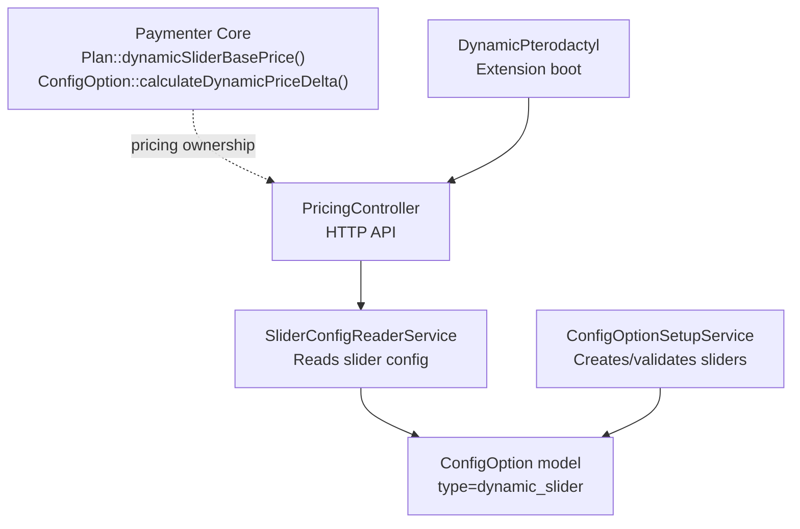
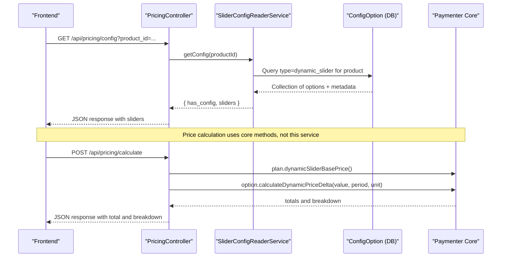
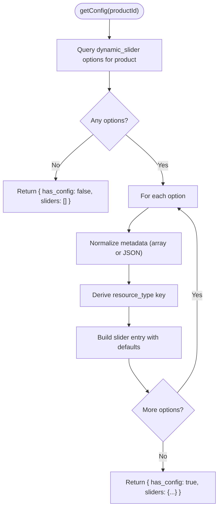
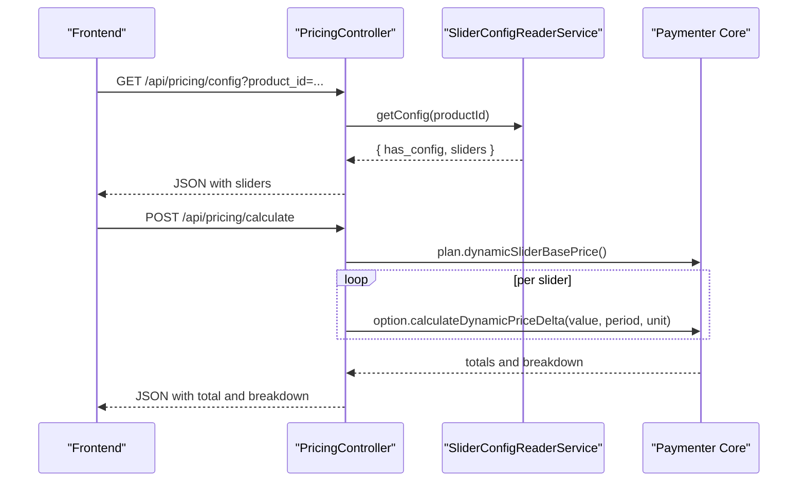
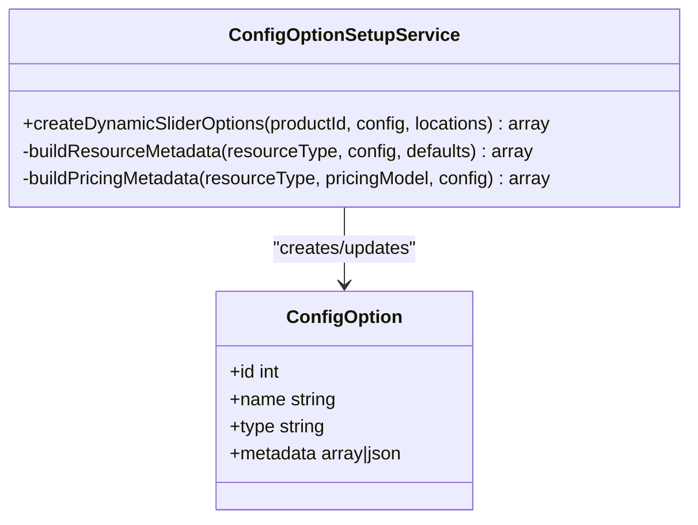
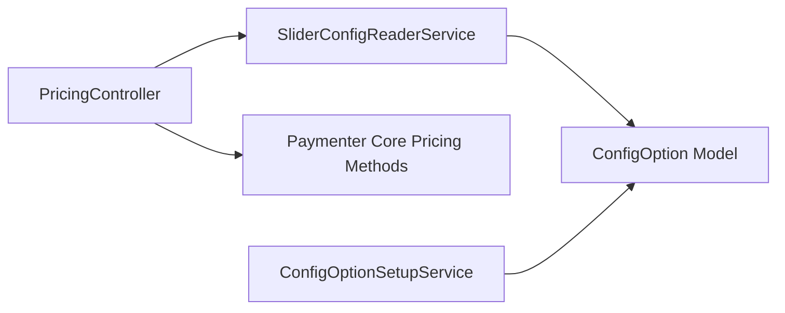

# SliderConfigReaderService

<cite>
**Referenced Files in This Document**
- [SliderConfigReaderService.php](file://Services/SliderConfigReaderService.php)
- [PricingController.php](file://Http/Controllers/Api/PricingController.php)
- [SliderConfigReaderServiceTest.php](file://tests/Unit/SliderConfigReaderServiceTest.php)
- [ConfigOptionSetupService.php](file://Services/ConfigOptionSetupService.php)
- [DynamicPterodactyl.php](file://DynamicPterodactyl.php)
- [07-PRICING-MODELS.md](file://07-PRICING-MODELS.md)
</cite>

## Table of Contents
1. [Introduction](#introduction)
2. [Project Structure](#project-structure)
3. [Core Components](#core-components)
4. [Architecture Overview](#architecture-overview)
5. [Detailed Component Analysis](#detailed-component-analysis)
6. [Dependency Analysis](#dependency-analysis)
7. [Performance Considerations](#performance-considerations)
8. [Troubleshooting Guide](#troubleshooting-guide)
9. [Conclusion](#conclusion)
10. [Appendices](#appendices)

## Introduction
This document explains the SliderConfigReaderService, a read-only service that extracts dynamic slider configuration metadata for Paymenter products and exposes it to frontend components. It focuses on how the service reads slider definitions from Product::dynamicSliderBasePrice() and ConfigOption::calculateDynamicPriceDelta() contexts without performing any price calculations itself. It also covers validation constraints embedded in slider metadata, error handling when configurations are missing or malformed, and integration patterns with other services and controllers.

The extension adheres to a strict separation of concerns: pricing math is owned by Paymenter core; this service only reads and normalizes slider configuration for UI consumption and downstream orchestration.

## Project Structure
The service lives under Services and is consumed by the API layer (PricingController). Configuration creation and validation occur in ConfigOptionSetupService. The extension boot process wires routes and schedules but does not alter pricing logic.

**Diagram sources**
- [PricingController.php:12-145](file://Http/Controllers/Api/PricingController.php#L12-L145)
- [SliderConfigReaderService.php:7-66](file://Services/SliderConfigReaderService.php#L7-L66)
- [ConfigOptionSetupService.php:117-171](file://Services/ConfigOptionSetupService.php#L117-L171)
- [DynamicPterodactyl.php:96-127](file://DynamicPterodactyl.php#L96-L127)
- [07-PRICING-MODELS.md:19-27](file://07-PRICING-MODELS.md#L19-L27)

**Section sources**
- [DynamicPterodactyl.php:96-127](file://DynamicPterodactyl.php#L96-L127)
- [PricingController.php:12-145](file://Http/Controllers/Api/PricingController.php#L12-L145)

## Core Components
- SliderConfigReaderService: Reads and normalizes slider metadata for a product into a stable structure suitable for frontend rendering.
- PricingController: Exposes endpoints to fetch slider configuration and calculate prices using core methods.
- ConfigOptionSetupService: Creates and validates slider metadata during setup/wizard flows.
- Paymenter Core: Owns pricing calculation via Plan::dynamicSliderBasePrice() and ConfigOption::calculateDynamicPriceDelta().

Key responsibilities:
- Extract ranges (min, max, step), defaults, units, display units/divisors, and pricing model hints from slider metadata.
- Return a consistent payload indicating whether dynamic slider configuration exists and what sliders are available.
- Never compute prices; delegate pricing to core methods invoked elsewhere.

**Section sources**
- [SliderConfigReaderService.php:14-53](file://Services/SliderConfigReaderService.php#L14-L53)
- [PricingController.php:24-145](file://Http/Controllers/Api/PricingController.php#L24-L145)
- [ConfigOptionSetupService.php:117-171](file://Services/ConfigOptionSetupService.php#L117-L171)
- [07-PRICING-MODELS.md:19-27](file://07-PRICING-MODELS.md#L19-L27)

## Architecture Overview
The service is part of a read path that powers the frontend’s dynamic sliders. Controllers request slider configuration, which the service resolves from database-backed ConfigOptions marked as dynamic_slider. Pricing calculations are performed separately by core methods and aggregated by the controller.

**Diagram sources**
- [PricingController.php:24-145](file://Http/Controllers/Api/PricingController.php#L24-L145)
- [SliderConfigReaderService.php:14-66](file://Services/SliderConfigReaderService.php#L14-L66)
- [07-PRICING-MODELS.md:19-27](file://07-PRICING-MODELS.md#L19-L27)

## Detailed Component Analysis

### SliderConfigReaderService
Purpose:
- Provide a normalized view of all dynamic slider configurations for a given product.
- Support both array and JSON-encoded metadata.
- Ensure a stable contract for frontend consumption.

Public API:
- getConfig(int $productId): array
  - Returns an object with has_config boolean and a sliders map keyed by resource_type.
  - Each slider includes:
    - config_option_id, name
    - min, max, step, default
    - unit, display_unit, display_divisor
    - pricing (model and parameters stored in metadata)

Internal behavior:
- getDynamicSliderOptions(int $productId): Collection
  - Finds ConfigOptions linked to the product where type equals dynamic_slider and parent_id is null.
  - Filters out nested options to avoid duplication.

Metadata normalization:
- If metadata is not an array, decode it from JSON safely.
- Derive resource_type from metadata or fallback to lowercase option name.
- Apply sensible defaults for optional fields to ensure robustness.

Error handling:
- When no dynamic sliders exist for a product, returns has_config=false and empty sliders array.
- Gracefully handles missing or malformed metadata by applying defaults.

Complexity:
- Database query is filtered by product and type; iteration over options is O(n) where n is number of slider options per product.
- No heavy computation; safe for frequent calls.

Integration points:
- Consumed by PricingController to expose slider configuration via API.
- Works alongside ConfigOptionSetupService, which writes compatible metadata.

**Diagram sources**
- [SliderConfigReaderService.php:14-66](file://Services/SliderConfigReaderService.php#L14-L66)

**Section sources**
- [SliderConfigReaderService.php:14-66](file://Services/SliderConfigReaderService.php#L14-L66)
- [SliderConfigReaderServiceTest.php:25-68](file://tests/Unit/SliderConfigReaderServiceTest.php#L25-L68)
- [SliderConfigReaderServiceTest.php:92-132](file://tests/Unit/SliderConfigReaderServiceTest.php#L92-L132)

### PricingController Integration
Responsibilities:
- Expose two endpoints:
  - getConfig(productId): delegates to SliderConfigReaderService to return slider definitions.
  - calculate(request): orchestrates pricing using core methods and returns a breakdown.

Separation of concerns:
- The controller never computes pricing itself; it calls Plan::dynamicSliderBasePrice() and ConfigOption::calculateDynamicPriceDelta().
- SliderConfigReaderService is used strictly for reading configuration, not calculating prices.

Validation and errors:
- Validates product_id and dynamically builds rules based on configured sliders.
- Returns structured error responses when no dynamic sliders are configured or when calculation fails.

**Diagram sources**
- [PricingController.php:24-145](file://Http/Controllers/Api/PricingController.php#L24-L145)
- [07-PRICING-MODELS.md:19-27](file://07-PRICING-MODELS.md#L19-L27)

**Section sources**
- [PricingController.php:24-145](file://Http/Controllers/Api/PricingController.php#L24-L145)
- [07-PRICING-MODELS.md:19-27](file://07-PRICING-MODELS.md#L19-L27)

### ConfigOptionSetupService and Metadata Schema
Role:
- Creates and validates slider metadata during setup/wizard flows.
- Ensures pricing metadata conforms to expected models (linear, tiered, base_addon).

Metadata schema (stored in ConfigOption.metadata):
- resource_type: string identifier for the slider (e.g., memory, cpu, disk).
- min, max, step, default: numeric bounds and increments for the slider.
- unit: internal unit (e.g., MB, %).
- display_unit: user-facing unit (e.g., GB, cores).
- display_divisor: conversion factor between internal and display units.
- pricing: object containing:
  - model: linear | tiered | base_addon
  - model-specific fields such as rate_per_unit, tiers, included_units, overage_rate, base_price.

Validation:
- Uses DynamicSliderPricingRule to validate pricing metadata at write time.
- Throws exceptions on invalid configurations to prevent bad data from entering the system.

**Diagram sources**
- [ConfigOptionSetupService.php:44-171](file://Services/ConfigOptionSetupService.php#L44-L171)

**Section sources**
- [ConfigOptionSetupService.php:117-171](file://Services/ConfigOptionSetupService.php#L117-L171)
- [07-PRICING-MODELS.md:31-53](file://07-PRICING-MODELS.md#L31-L53)
- [07-PRICING-MODELS.md:290-330](file://07-PRICING-MODELS.md#L290-L330)

### Example Slider Configuration Structures
Typical structures produced by the service for frontend consumption:
- Top-level envelope:
  - has_config: boolean
  - sliders: object keyed by resource_type
- Per-slider fields:
  - config_option_id: integer
  - name: string
  - min, max, step, default: numbers
  - unit, display_unit: strings
  - display_divisor: number
  - pricing: object with model and model-specific parameters

These structures are derived from ConfigOption metadata and normalized to ensure consistent keys and defaults even if some fields are missing.

**Section sources**
- [SliderConfigReaderService.php:27-52](file://Services/SliderConfigReaderService.php#L27-L52)
- [SliderConfigReaderServiceTest.php:25-68](file://tests/Unit/SliderConfigReaderServiceTest.php#L25-L68)

### Error Handling for Missing or Invalid Configurations
- No sliders found: getConfig returns has_config=false and empty sliders; controller responds with a 404-style message.
- Malformed metadata: Service decodes JSON safely and applies defaults for missing fields to avoid runtime errors.
- Calculation failures: Controller catches exceptions during pricing calculation and returns a structured error response, optionally including debug details when enabled.

**Section sources**
- [SliderConfigReaderService.php:18-23](file://Services/SliderConfigReaderService.php#L18-L23)
- [SliderConfigReaderService.php:27-31](file://Services/SliderConfigReaderService.php#L27-L31)
- [PricingController.php:36-41](file://Http/Controllers/Api/PricingController.php#L36-L41)
- [PricingController.php:104-121](file://Http/Controllers/Api/PricingController.php#L104-L121)

### Integration Patterns with Other Services
- PricingController depends on SliderConfigReaderService via constructor injection to fetch slider definitions.
- PricingController delegates pricing to Paymenter core methods, ensuring separation of concerns.
- ConfigOptionSetupService writes compatible metadata that SliderConfigReaderService can reliably read.
- Extension boot process registers routes and schedules but does not interfere with pricing logic.

**Section sources**
- [PricingController.php:12-19](file://Http/Controllers/Api/PricingController.php#L12-L19)
- [PricingController.php:69-94](file://Http/Controllers/Api/PricingController.php#L69-L94)
- [ConfigOptionSetupService.php:44-171](file://Services/ConfigOptionSetupService.php#L44-L171)
- [DynamicPterodactyl.php:96-127](file://DynamicPterodactyl.php#L96-L127)

## Dependency Analysis
Coupling and cohesion:
- SliderConfigReaderService has low coupling: it depends only on ConfigOption model and returns plain arrays.
- Cohesion is high: single responsibility to read and normalize slider configuration.

Direct dependencies:
- App\Models\ConfigOption for querying slider options.

Indirect relationships:
- PricingController orchestrates usage of SliderConfigReaderService and core pricing methods.
- ConfigOptionSetupService ensures metadata consistency for readers.

Potential circular dependencies:
- None observed; the service is read-only and does not call back into setup or pricing logic.

External integrations:
- Paymenter core pricing methods are called by the controller, not the service, preserving clear boundaries.

**Diagram sources**
- [SliderConfigReaderService.php:5-66](file://Services/SliderConfigReaderService.php#L5-L66)
- [PricingController.php:12-145](file://Http/Controllers/Api/PricingController.php#L12-L145)
- [ConfigOptionSetupService.php:44-171](file://Services/ConfigOptionSetupService.php#L44-L171)

**Section sources**
- [SliderConfigReaderService.php:5-66](file://Services/SliderConfigReaderService.php#L5-L66)
- [PricingController.php:12-145](file://Http/Controllers/Api/PricingController.php#L12-L145)
- [ConfigOptionSetupService.php:44-171](file://Services/ConfigOptionSetupService.php#L44-L171)

## Performance Considerations
- Query efficiency: The service filters by product and type, minimizing result sets.
- Lightweight normalization: Iterating over options and building arrays is O(n) with minimal overhead.
- No caching: Consistent with project policy that real-time availability is not cached; similarly, configuration reads are direct and fast.
- Frontend-friendly payloads: Normalized structures reduce client-side processing.

[No sources needed since this section provides general guidance]

## Troubleshooting Guide
Common issues and resolutions:
- No dynamic sliders configured:
  - Symptom: API returns success=false with a message indicating no dynamic slider config options found.
  - Resolution: Use ConfigOptionSetupService to create slider options for the product.
- Malformed or missing metadata:
  - Symptom: Unexpected defaults or missing fields in slider configuration.
  - Resolution: Validate and repair metadata via setup wizard or direct DB correction; ensure resource_type is set.
- Price calculation failures:
  - Symptom: API returns a generic failure message; debug may include error details.
  - Resolution: Check plan selection and slider values; verify core pricing methods are functioning; review logs.

Operational tips:
- Verify product has dynamic_slider options with parent_id=null before calling getConfig.
- Ensure pricing metadata matches supported models (linear, tiered, base_addon).

**Section sources**
- [PricingController.php:36-41](file://Http/Controllers/Api/PricingController.php#L36-L41)
- [PricingController.php:104-121](file://Http/Controllers/Api/PricingController.php#L104-L121)
- [ConfigOptionSetupService.php:124-131](file://Services/ConfigOptionSetupService.php#L124-L131)

## Conclusion
SliderConfigReaderService provides a clean, read-only interface to dynamic slider configuration for Paymenter products. It abstracts away metadata variations and delivers a stable structure to the frontend while delegating pricing calculations to Paymenter core. Its tight integration with PricingController and compatibility with ConfigOptionSetupService ensures consistent configuration lifecycle management. By adhering to separation of concerns, the service remains simple, testable, and resilient to configuration edge cases.

[No sources needed since this section summarizes without analyzing specific files]

## Appendices

### API Contract Summary
- Endpoint: GET /api/pricing/config?product_id={id}
  - Response when configured:
    - success: true
    - data:
      - product_id: integer
      - sliders: object keyed by resource_type with fields described above
  - Response when not configured:
    - success: false
    - message: descriptive text

- Endpoint: POST /api/pricing/calculate
  - Request: product_id, plan_id (optional), and one or more slider values
  - Response:
    - success: boolean
    - data:
      - total: number
      - breakdown: array of per-slider items
      - model: pricing model used

**Section sources**
- [PricingController.php:24-145](file://Http/Controllers/Api/PricingController.php#L24-L145)
- [07-PRICING-MODELS.md:290-330](file://07-PRICING-MODELS.md#L290-L330)