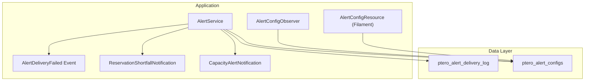
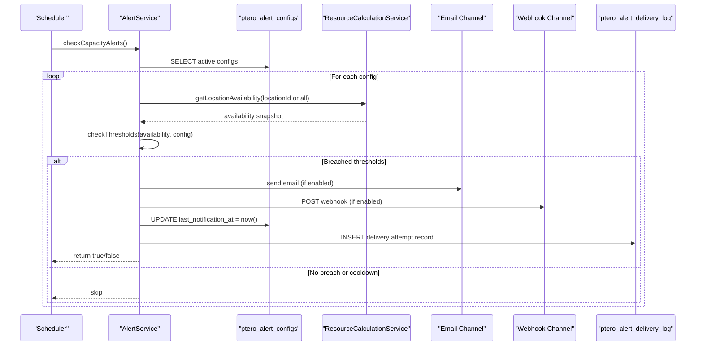
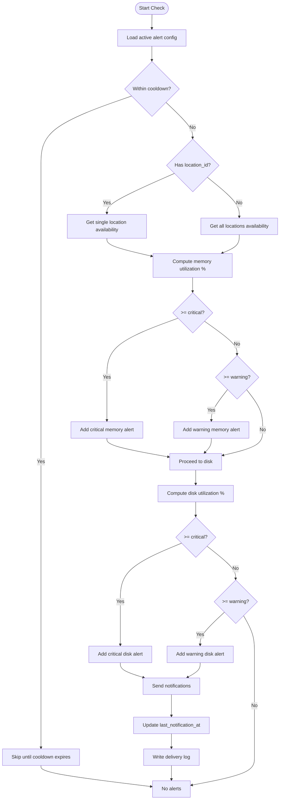
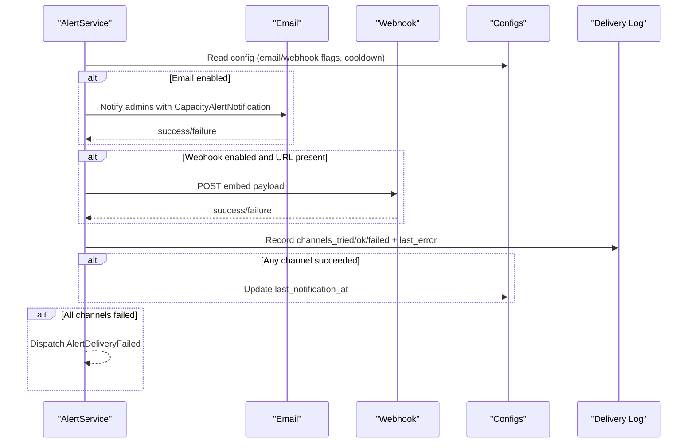
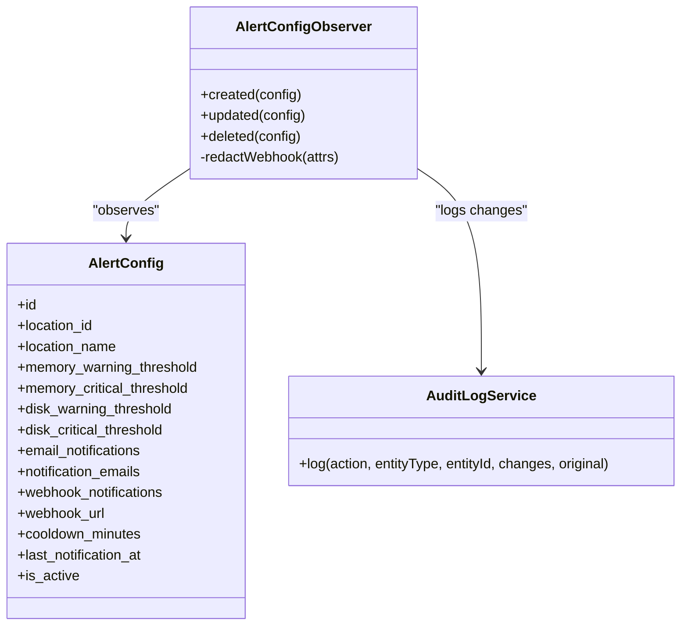
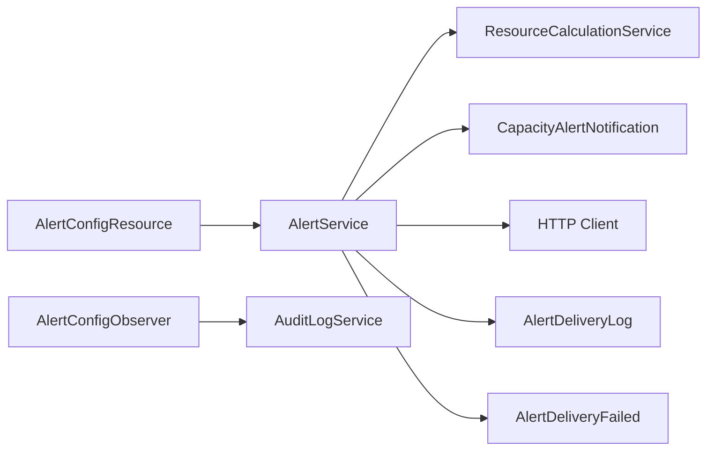

# Alert Configurations Table

<cite>
**Referenced Files in This Document**
- [AlertConfig.php](file://Models/AlertConfig.php)
- [2025_01_01_000004_create_ptero_alert_configs_table.php](file://database/migrations/2025_01_01_000004_create_ptero_alert_configs_table.php)
- [AlertDeliveryLog.php](file://Models/AlertDeliveryLog.php)
- [2026_04_26_000001_create_ptero_alert_delivery_log_table.php](file://database/migrations/2026_04_26_000001_create_ptero_alert_delivery_log_table.php)
- [AlertService.php](file://Services/AlertService.php)
- [CapacityAlertNotification.php](file://Notifications/CapacityAlertNotification.php)
- [ReservationShortfallNotification.php](file://Notifications/ReservationShortfallNotification.php)
- [AlertConfigObserver.php](file://Models/Observers/AlertConfigObserver.php)
- [AlertConfigResource.php](file://Admin/Resources/AlertConfigResource.php)
- [AlertDeliveryFailed.php](file://Events/AlertDeliveryFailed.php)
- [AlertScheduleTest.php](file://tests/Feature/AlertScheduleTest.php)
</cite>

## Table of Contents
1. [Introduction](#introduction)
2. [Project Structure](#project-structure)
3. [Core Components](#core-components)
4. [Architecture Overview](#architecture-overview)
5. [Detailed Component Analysis](#detailed-component-analysis)
6. [Dependency Analysis](#dependency-analysis)
7. [Performance Considerations](#performance-considerations)
8. [Troubleshooting Guide](#troubleshooting-guide)
9. [Conclusion](#conclusion)
10. [Appendices](#appendices)

## Introduction
This document provides comprehensive data model documentation for the alert configurations table used by the capacity monitoring and alerting system. It details schema definitions for capacity thresholds, notification preferences, and alert channel settings; explains trigger conditions, cooldown behavior, configuration scopes (global vs per-location), and integration with email and webhook channels. It also documents the observer pattern implementation that audits changes to alert configurations and ensures sensitive fields are redacted from audit logs.

## Project Structure
The alerting subsystem is implemented across models, migrations, services, notifications, admin resources, and events:
- Data model and migration define the alert configuration and delivery log tables.
- The service orchestrates threshold checks, notification delivery, cooldown enforcement, and logging.
- Notifications format and deliver alerts via email; webhooks are sent directly.
- An observer audits lifecycle changes to alert configurations and redacts secrets.
- Admin resource exposes a UI for creating/editing alert configs and testing notifications.
- Events capture delivery failures for downstream handling.

**Diagram sources**
- [AlertService.php:33-75](file://Services/AlertService.php#L33-L75)
- [AlertConfig.php:8-56](file://Models/AlertConfig.php#L8-L56)
- [AlertConfigObserver.php:12-68](file://Models/Observers/AlertConfigObserver.php#L12-L68)
- [AlertConfigResource.php:41-167](file://Admin/Resources/AlertConfigResource.php#L41-L167)
- [CapacityAlertNotification.php:14-47](file://Notifications/CapacityAlertNotification.php#L14-L47)
- [ReservationShortfallNotification.php:10-40](file://Notifications/ReservationShortfallNotification.php#L10-L40)
- [AlertDeliveryFailed.php:9-16](file://Events/AlertDeliveryFailed.php#L9-L16)

**Section sources**
- [AlertConfig.php:8-56](file://Models/AlertConfig.php#L8-L56)
- [AlertService.php:33-75](file://Services/AlertService.php#L33-L75)
- [AlertConfigResource.php:41-167](file://Admin/Resources/AlertConfigResource.php#L41-L167)

## Core Components
- Alert configuration model defines fields for scope, thresholds, notification toggles, recipients, webhook URL, cooldown, last notification timestamp, and active status.
- Delivery log model records each attempt to send an alert, including channels tried/succeeded/failed and error context.
- Alert service performs periodic checks against configured thresholds, enforces cooldowns, sends notifications via email or webhook, updates last notification timestamps, and writes delivery logs.
- Observer audits create/update/delete operations on alert configurations and redacts webhook URLs from audit entries.
- Admin resource provides form validation and UI for managing alert configurations.

**Section sources**
- [AlertConfig.php:12-34](file://Models/AlertConfig.php#L12-L34)
- [AlertDeliveryLog.php:12-31](file://Models/AlertDeliveryLog.php#L12-L31)
- [AlertService.php:33-248](file://Services/AlertService.php#L33-L248)
- [AlertConfigObserver.php:12-68](file://Models/Observers/AlertConfigObserver.php#L12-L68)
- [AlertConfigResource.php:41-167](file://Admin/Resources/AlertConfigResource.php#L41-L167)

## Architecture Overview
The alerting system runs on a schedule that invokes the alert service to check all active alert configurations. For each configuration, it determines whether to evaluate global or location-specific metrics, computes utilization percentages, compares them against warning/critical thresholds, and if breached, attempts notification delivery through enabled channels. On success, it updates the last notification timestamp and persists delivery logs. Failures emit an event for further handling.

**Diagram sources**
- [AlertService.php:33-75](file://Services/AlertService.php#L33-L75)
- [AlertService.php:77-126](file://Services/AlertService.php#L77-L126)
- [AlertService.php:128-248](file://Services/AlertService.php#L128-L248)
- [2025_01_01_000004_create_ptero_alert_configs_table.php:11-42](file://database/migrations/2025_01_01_000004_create_ptero_alert_configs_table.php#L11-L42)
- [2026_04_26_000001_create_ptero_alert_delivery_log_table.php:11-24](file://database/migrations/2026_04_26_000001_create_ptero_alert_delivery_log_table.php#L11-L24)

## Detailed Component Analysis

### Schema: ptero_alert_configs
- Purpose: Stores alerting rules scoped either globally or per location, along with notification preferences and cooldown behavior.
- Key fields:
  - Scope:
    - location_id: nullable integer; null indicates global scope.
    - location_name: optional display name for the scope.
  - Thresholds (percentage):
    - memory_warning_threshold, memory_critical_threshold
    - disk_warning_threshold, disk_critical_threshold
  - Notification preferences:
    - email_notifications: boolean toggle
    - notification_emails: JSON array of recipient emails
    - webhook_notifications: boolean toggle
    - webhook_url: string endpoint for external webhooks
  - Cooldown and state:
    - cooldown_minutes: minimum minutes between repeated alerts
    - last_notification_at: timestamp of last successful alert
    - is_active: enables/disables evaluation
- Indexes:
  - location_id and is_active for efficient querying.

Typical usage patterns:
- Global rule: set location_id to null to apply to all locations.
- Per-location rule: set location_id to target a specific location.
- Cooldown: configure cooldown_minutes to avoid alert storms.
- Channels: enable email and/or webhook; provide webhook_url when using webhooks.

**Section sources**
- [2025_01_01_000004_create_ptero_alert_configs_table.php:11-42](file://database/migrations/2025_01_01_000004_create_ptero_alert_configs_table.php#L11-L42)
- [AlertConfig.php:12-34](file://Models/AlertConfig.php#L12-L34)

### Schema: ptero_alert_delivery_log
- Purpose: Records each alert delivery attempt with outcome and error context.
- Key fields:
  - alert_config_id: foreign key to alert configuration
  - trigger_type: enum indicating reason (capacity_breach, shortfall, state_drift, check_failure)
  - attempted_at: timestamp of attempt
  - channels_tried, channels_ok, channels_failed: JSON arrays of channels involved
  - last_error: text describing the most recent failure
- Relationship: belongs to AlertConfig.

**Section sources**
- [2026_04_26_000001_create_ptero_alert_delivery_log_table.php:11-24](file://database/migrations/2026_04_26_000001_create_ptero_alert_delivery_log_table.php#L11-L24)
- [AlertDeliveryLog.php:12-31](file://Models/AlertDeliveryLog.php#L12-L31)

### Trigger Conditions and Threshold Evaluation
- Utilization calculation:
  - Memory utilization = total_allocated.memory / total_capacity.memory * 100
  - Disk utilization = total_allocated.disk / total_capacity.disk * 100
- Threshold comparison:
  - If utilization >= critical threshold, generate critical alert
  - Else if utilization >= warning threshold, generate warning alert
- Location scope:
  - If config has location_id, evaluate only that location
  - Otherwise, evaluate all locations discovered via resource service

**Diagram sources**
- [AlertService.php:44-75](file://Services/AlertService.php#L44-L75)
- [AlertService.php:77-126](file://Services/AlertService.php#L77-L126)

**Section sources**
- [AlertService.php:44-126](file://Services/AlertService.php#L44-L126)

### Notification Delivery and Channels
- Email:
  - Enabled via email_notifications flag
  - Recipients determined from application users with admin roles
  - Uses CapacityAlertNotification to compose subject, body, and action link
- Webhook:
  - Enabled via webhook_notifications and webhook_url
  - Sends HTTP POST with Discord-compatible embed payload
  - Color encodes severity (critical vs warning)
- Cooldown enforcement:
  - last_notification_at compared against cooldown_minutes before sending
- Delivery logging:
  - Writes channels tried, succeeded, failed, and last error
  - Emits AlertDeliveryFailed event when all channels fail

**Diagram sources**
- [AlertService.php:128-248](file://Services/AlertService.php#L128-L248)
- [CapacityAlertNotification.php:14-47](file://Notifications/CapacityAlertNotification.php#L14-L47)
- [AlertDeliveryFailed.php:9-16](file://Events/AlertDeliveryFailed.php#L9-L16)

**Section sources**
- [AlertService.php:128-248](file://Services/AlertService.php#L128-L248)
- [CapacityAlertNotification.php:14-47](file://Notifications/CapacityAlertNotification.php#L14-L47)

### Observer Pattern and Automatic Validation
- Observer hooks into model lifecycle events (created, updated, deleted).
- Audits changes via AuditLogService with operation type, entity type, entity id, and attributes.
- Redacts webhook_url in audit payloads to prevent secret leakage.
- Ensures robustness by reporting exceptions without failing model operations.

**Diagram sources**
- [AlertConfig.php:8-56](file://Models/AlertConfig.php#L8-L56)
- [AlertConfigObserver.php:12-68](file://Models/Observers/AlertConfigObserver.php#L12-L68)

**Section sources**
- [AlertConfigObserver.php:12-68](file://Models/Observers/AlertConfigObserver.php#L12-L68)
- [AlertConfig.php:8-56](file://Models/AlertConfig.php#L8-L56)

### Admin Interface and Configuration Validation
- Form fields enforce ranges and types:
  - Thresholds: numeric, 1–100 percent
  - Cooldown: numeric minutes
  - Toggles: email and webhook notifications
  - Conditional visibility: email addresses shown when email enabled; webhook URL shown when webhook enabled
- Table displays:
  - Scope (Global or location name)
  - Threshold summary
  - Channel indicators and active status
  - Last notification timestamp
- Actions:
  - Edit configuration
  - Test notification using current config

**Section sources**
- [AlertConfigResource.php:41-167](file://Admin/Resources/AlertConfigResource.php#L41-L167)

### Integration Points and Examples
- Typical alert setups:
  - Global warning at 80% and critical at 95% for both memory and disk
  - Per-location override with stricter thresholds
  - Cooldown of 60 minutes to reduce noise
- Notification methods:
  - Email to administrators with actionable links
  - Webhook to external systems (e.g., Discord) with colored embeds
- External channel examples:
  - Webhook URL pointing to a Discord incoming webhook endpoint
  - Email delivered via application mailer to admin users

[No sources needed since this section summarizes usage patterns without analyzing specific files]

## Dependency Analysis
- AlertService depends on:
  - ResourceCalculationService for availability snapshots
  - Notification classes for email delivery
  - HTTP client for webhook delivery
  - AlertDeliveryLog model for persistence
  - AlertDeliveryFailed event for failure signaling
- AlertConfigObserver depends on:
  - AuditLogService for change auditing
- Admin resource depends on:
  - Filament components for forms and tables
  - AlertService for test notifications

**Diagram sources**
- [AlertService.php:23-28](file://Services/AlertService.php#L23-L28)
- [AlertService.php:128-248](file://Services/AlertService.php#L128-L248)
- [AlertConfigObserver.php:12-68](file://Models/Observers/AlertConfigObserver.php#L12-L68)
- [AlertConfigResource.php:27-31](file://Admin/Resources/AlertConfigResource.php#L27-L31)

**Section sources**
- [AlertService.php:23-28](file://Services/AlertService.php#L23-L28)
- [AlertConfigObserver.php:12-68](file://Models/Observers/AlertConfigObserver.php#L12-L68)
- [AlertConfigResource.php:27-31](file://Admin/Resources/AlertConfigResource.php#L27-L31)

## Performance Considerations
- Cooldown mechanism prevents excessive notifications and reduces load on email/webhook channels.
- Batched availability retrieval via resource service minimizes external API calls per location.
- Delivery log writes are wrapped in safe handlers to avoid blocking alert cycles on persistence errors.
- Scheduling uses without overlapping to ensure only one evaluation runs at a time.

[No sources needed since this section provides general guidance]

## Troubleshooting Guide
Common issues and diagnostics:
- No admin recipients:
  - Symptom: email channel fails with no recipients
  - Action: ensure there are users with admin roles configured
- Webhook failures:
  - Symptom: webhook channel marked failed with error logged
  - Action: verify webhook URL accessibility and payload compatibility
- Cooldown preventing alerts:
  - Symptom: alerts not sent despite breaches
  - Action: check last_notification_at and cooldown_minutes; wait or adjust cooldown
- Delivery log inspection:
  - Use delivery log to see channels tried, successes, failures, and last error
- Schedule verification:
  - Confirm capacity alert schedule is registered and running without overlap

**Section sources**
- [AlertService.php:143-180](file://Services/AlertService.php#L143-L180)
- [AlertService.php:182-216](file://Services/AlertService.php#L182-L216)
- [AlertService.php:250-276](file://Services/AlertService.php#L250-L276)
- [AlertScheduleTest.php:23-33](file://tests/Feature/AlertScheduleTest.php#L23-L33)

## Conclusion
The alert configurations table centralizes capacity monitoring rules, notification preferences, and channel settings with clear scoping and cooldown controls. The alert service evaluates thresholds, delivers notifications via email and webhooks, enforces cooldowns, and maintains detailed delivery logs. The observer pattern ensures secure and auditable changes to alert configurations. Together, these components provide a robust, extensible alerting framework suitable for production environments.

[No sources needed since this section summarizes without analyzing specific files]

## Appendices

### Field Definitions Summary
- Scope:
  - location_id: integer, nullable; null means global
  - location_name: string, nullable; display label
- Thresholds:
  - memory_warning_threshold: tinyint percentage
  - memory_critical_threshold: tinyint percentage
  - disk_warning_threshold: tinyint percentage
  - disk_critical_threshold: tinyint percentage
- Notifications:
  - email_notifications: boolean
  - notification_emails: JSON array of strings
  - webhook_notifications: boolean
  - webhook_url: string
- Cooldown and State:
  - cooldown_minutes: integer minutes
  - last_notification_at: timestamp
  - is_active: boolean

**Section sources**
- [2025_01_01_000004_create_ptero_alert_configs_table.php:11-42](file://database/migrations/2025_01_01_000004_create_ptero_alert_configs_table.php#L11-L42)
- [AlertConfig.php:12-34](file://Models/AlertConfig.php#L12-L34)

### Example Configurations
- Global alerting:
  - Set location_id to null
  - Configure warning and critical thresholds for memory and disk
  - Enable email and/or webhook; set cooldown
- Per-location override:
  - Set location_id to target location
  - Adjust thresholds to be stricter or more lenient
  - Keep or override notification preferences

[No sources needed since this section provides conceptual examples]