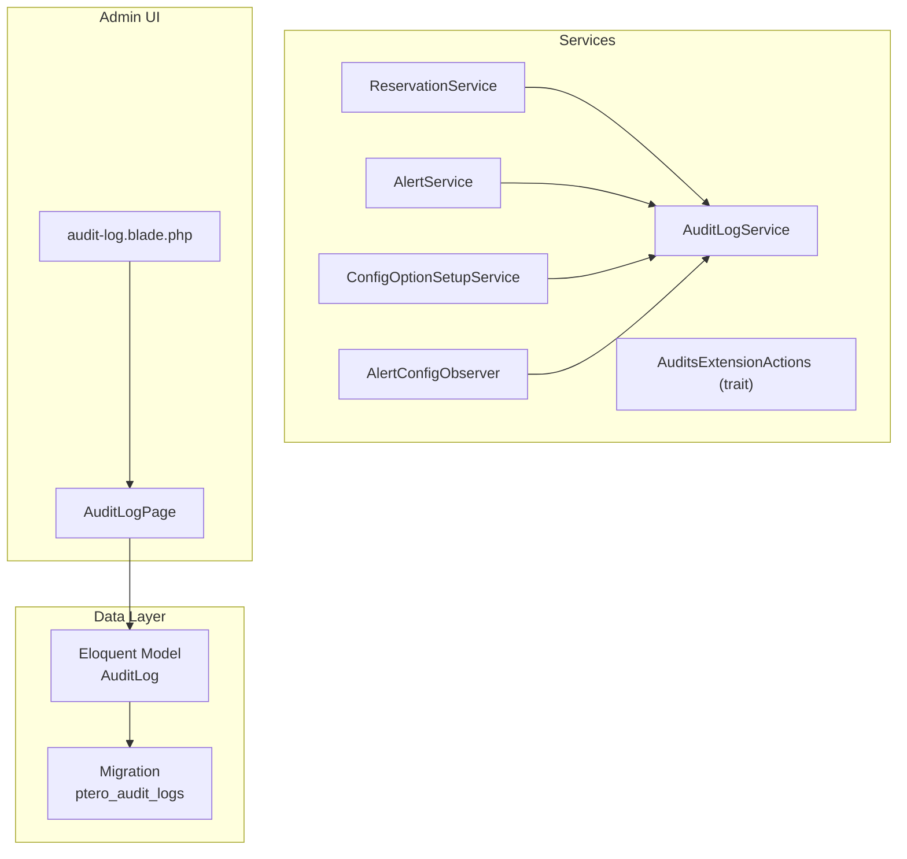
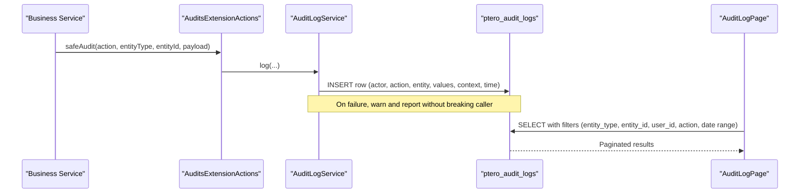
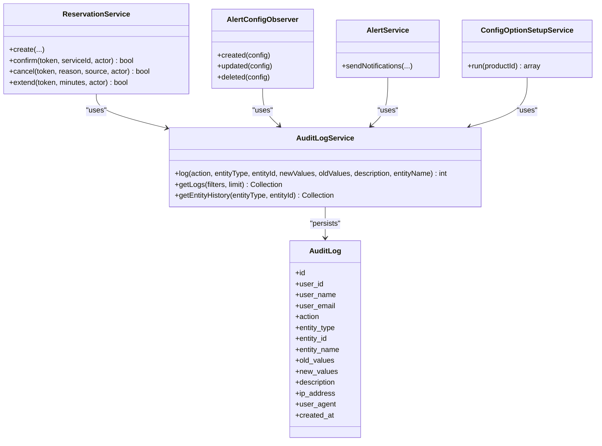

# Audit Logs Table

<cite>
**Referenced Files in This Document**
- [AuditLog.php](file://Models/AuditLog.php)
- [2025_01_01_000003_create_ptero_audit_logs_table.php](file://database/migrations/2025_01_01_000003_create_ptero_audit_logs_table.php)
- [AuditLogService.php](file://Services/AuditLogService.php)
- [AuditsExtensionActions.php](file://Services/Concerns/AuditsExtensionActions.php)
- [AlertConfigObserver.php](file://Models/Observers/AlertConfigObserver.php)
- [ReservationService.php](file://Services/ReservationService.php)
- [AlertService.php](file://Services/AlertService.php)
- [ConfigOptionSetupService.php](file://Services/ConfigOptionSetupService.php)
- [AuditLogPage.php](file://Admin/Pages/AuditLogPage.php)
- [audit-log.blade.php](file://resources/views/admin/audit-log.blade.php)
</cite>

## Table of Contents
1. [Introduction](#introduction)
2. [Project Structure](#project-structure)
3. [Core Components](#core-components)
4. [Architecture Overview](#architecture-overview)
5. [Detailed Component Analysis](#detailed-component-analysis)
6. [Dependency Analysis](#dependency-analysis)
7. [Performance Considerations](#performance-considerations)
8. [Troubleshooting Guide](#troubleshooting-guide)
9. [Conclusion](#conclusion)
10. [Appendices](#appendices)

## Introduction
This document provides detailed data model documentation for the audit logs table used to capture administrative actions and system events across the Dynamic Pterodactyl extension. It explains the schema, logging patterns, retention considerations, query optimization strategies, and integration points with reservations, alert configurations, and setup operations. It also includes examples of typical audit entries and filtering capabilities available through the admin interface.

## Project Structure
The audit log feature is implemented as a dedicated Eloquent model, a migration defining the database schema, a service for writing and querying logs, an admin page for viewing logs, and multiple services that emit audit events during key business operations.

**Diagram sources**
- [2025_01_01_000003_create_ptero_audit_logs_table.php:11-47](file://database/migrations/2025_01_01_000003_create_ptero_audit_logs_table.php#L11-L47)
- [AuditLog.php:7-37](file://Models/AuditLog.php#L7-L37)
- [AuditLogService.php:10-82](file://Services/AuditLogService.php#L10-L82)
- [AuditsExtensionActions.php:8-33](file://Services/Concerns/AuditsExtensionActions.php#L8-L33)
- [ReservationService.php:102-112](file://Services/ReservationService.php#L102-L112)
- [AlertService.php:238-245](file://Services/AlertService.php#L238-L245)
- [ConfigOptionSetupService.php:69-74](file://Services/ConfigOptionSetupService.php#L69-L74)
- [AlertConfigObserver.php:12-59](file://Models/Observers/AlertConfigObserver.php#L12-L59)
- [AuditLogPage.php:31-80](file://Admin/Pages/AuditLogPage.php#L31-L80)

**Section sources**
- [2025_01_01_000003_create_ptero_audit_logs_table.php:11-47](file://database/migrations/2025_01_01_000003_create_ptero_audit_logs_table.php#L11-L47)
- [AuditLog.php:7-37](file://Models/AuditLog.php#L7-L37)
- [AuditLogService.php:10-82](file://Services/AuditLogService.php#L10-L82)
- [AuditLogPage.php:31-80](file://Admin/Pages/AuditLogPage.php#L31-L80)

## Core Components
- Schema and model: The ptero_audit_logs table stores who performed an action, what was changed, change details, request context, and timestamp. The Eloquent model disables automatic timestamps and casts JSON fields to arrays.
- Logging service: AuditLogService provides a centralized method to write audit entries and supports filtered retrieval and entity history queries.
- Admin interface: AuditLogPage renders a Filament table with sortable columns, filters by action and entity type, and integrates with the Blade view.
- Integration points: ReservationService, AlertService, ConfigOptionSetupService, and AlertConfigObserver use a safe auditing trait to record lifecycle events and configuration changes.

Key responsibilities:
- Capture actor identity (user_id, user_name, user_email).
- Record action type and target resource (action, entity_type, entity_id, entity_name).
- Store change deltas (old_values, new_values) and human-readable description.
- Persist request context (ip_address, user_agent) and created_at.

**Section sources**
- [2025_01_01_000003_create_ptero_audit_logs_table.php:11-47](file://database/migrations/2025_01_01_000003_create_ptero_audit_logs_table.php#L11-L47)
- [AuditLog.php:7-37](file://Models/AuditLog.php#L7-L37)
- [AuditLogService.php:15-82](file://Services/AuditLogService.php#L15-L82)
- [AuditLogPage.php:31-80](file://Admin/Pages/AuditLogPage.php#L31-L80)

## Architecture Overview
The audit logging architecture follows a service-oriented pattern with a shared trait to ensure consistent, resilient logging across components.

**Diagram sources**
- [AuditsExtensionActions.php:10-33](file://Services/Concerns/AuditsExtensionActions.php#L10-L33)
- [AuditLogService.php:15-82](file://Services/AuditLogService.php#L15-L82)
- [AuditLogPage.php:31-80](file://Admin/Pages/AuditLogPage.php#L31-L80)

## Detailed Component Analysis

### Data Model: ptero_audit_logs
- Primary key: id
- Actor identification:
  - user_id: unsigned integer, foreign key to users.id, cascade delete
  - user_name: string
  - user_email: string
- Action and target:
  - action: string (e.g., created, updated, deleted, cancelled; plus domain-specific actions like reservation_confirmed)
  - entity_type: string (e.g., pricing_config, reservation, alert_config, resource_reservation, product_config)
  - entity_id: unsigned integer
  - entity_name: string (nullable; optional display name such as product or resource label)
- Change details:
  - old_values: JSON (nullable)
  - new_values: JSON (nullable)
  - description: text (nullable)
- Request context:
  - ip_address: string(45) (nullable; IPv6-safe length)
  - user_agent: string (nullable)
- Timestamp:
  - created_at: timestamp
- Indexes:
  - composite index on (entity_type, entity_id)
  - single indexes on user_id, created_at, action
- Foreign key:
  - user_id references users(id) on cascade delete

Complexity notes:
- JSON fields are cast to arrays in the Eloquent model for convenient read/write.
- The table is append-only; rows are never updated after creation.

**Section sources**
- [2025_01_01_000003_create_ptero_audit_logs_table.php:11-47](file://database/migrations/2025_01_01_000003_create_ptero_audit_logs_table.php#L11-L47)
- [AuditLog.php:7-37](file://Models/AuditLog.php#L7-L37)

### Logging Patterns
- Centralized writes via AuditLogService::log():
  - Captures current authenticated user or defaults to System when unauthenticated.
  - Serializes old/new values to JSON.
  - Records IP and user agent from the current request.
  - Persists created_at using application time.
- Safe auditing via AuditsExtensionActions::safeAudit():
  - Wraps audit writes in try/catch to avoid disrupting core flows.
  - Emits warnings and reports exceptions if audit persistence fails.
- Entity observers:
  - AlertConfigObserver records created/updated/deleted events for alert configurations, redacting sensitive webhook URLs before logging.

Typical audit entries:
- Reservation creation: action=created, entity_type=reservation, payload includes token prefix, product/location/node, resources, price, cart item.
- Reservation confirmation: action=reservation_confirmed, entity_type=resource_reservation, payload includes token prefix, service_id, node_id.
- Reservation cancellation: action=reservation_cancelled, entity_type=resource_reservation, payload includes token prefix, node_id.
- Reservation extension: action=reservation_extended, entity_type=resource_reservation, payload includes token prefix, additional_minutes, node_id.
- Batch expiration: action=reservations_expired_batch, entity_type=resource_reservation, payload includes batch metadata.
- Capacity alert sent: action=capacity_alert_sent, entity_type=alert_config, payload includes channels, severity, breached resources, location scope.
- Setup run: action=setup_run, entity_type=product_config, payload includes sliders configured and count.

**Section sources**
- [AuditLogService.php:15-41](file://Services/AuditLogService.php#L15-L41)
- [AuditsExtensionActions.php:10-33](file://Services/Concerns/AuditsExtensionActions.php#L10-L33)
- [AlertConfigObserver.php:12-59](file://Models/Observers/AlertConfigObserver.php#L12-L59)
- [ReservationService.php:102-112](file://Services/ReservationService.php#L102-L112)
- [ReservationService.php:191-196](file://Services/ReservationService.php#L191-L196)
- [ReservationService.php:234-238](file://Services/ReservationService.php#L234-L238)
- [ReservationService.php:273-278](file://Services/ReservationService.php#L273-L278)
- [AlertService.php:238-245](file://Services/AlertService.php#L238-L245)
- [ConfigOptionSetupService.php:69-74](file://Services/ConfigOptionSetupService.php#L69-L74)

### Querying and Filtering
- Filtered retrieval:
  - Supports filtering by entity_type, entity_id, user_id, action, and date range (date_from, date_to).
  - Results are ordered by created_at descending with a configurable limit.
- Entity history:
  - Convenience method to fetch recent history for a specific entity type and ID.
- Admin UI:
  - Filament table displays date, user, action badge, type, entity, and description.
  - Filters allow narrowing by action and entity type.

Example filter usage:
- Get all reservation-related actions in a date range.
- Retrieve changes made by a specific user.
- Show only updates to alert configurations.

**Section sources**
- [AuditLogService.php:46-82](file://Services/AuditLogService.php#L46-L82)
- [AuditLogPage.php:31-80](file://Admin/Pages/AuditLogPage.php#L31-L80)

### Relationship to Other Components
- Reservations:
  - ReservationService emits audit events for creation, confirmation, cancellation, extension, and batch expiration. These provide an end-to-end trail for reservation lifecycle management.
- Alert configurations:
  - AlertConfigObserver captures create/update/delete events for alert configs, with sensitive fields redacted.
  - AlertService emits capacity_alert_sent events when alerts are delivered, including severity and breached resources.
- Product configuration setup:
  - ConfigOptionSetupService emits setup_run events when dynamic slider options are created or updated for products.

**Diagram sources**
- [AuditLog.php:7-37](file://Models/AuditLog.php#L7-L37)
- [AuditLogService.php:15-82](file://Services/AuditLogService.php#L15-L82)
- [ReservationService.php:102-112](file://Services/ReservationService.php#L102-L112)
- [AlertConfigObserver.php:12-59](file://Models/Observers/AlertConfigObserver.php#L12-L59)
- [AlertService.php:238-245](file://Services/AlertService.php#L238-L245)
- [ConfigOptionSetupService.php:69-74](file://Services/ConfigOptionSetupService.php#L69-L74)

## Dependency Analysis
- Direct dependencies:
  - AuditLogService depends on Auth, Request, and DB facades to capture actor and request context and to insert rows.
  - Observers and services depend on AuditLogService via dependency injection or app() resolution.
- Indirect dependencies:
  - Admin UI depends on Filament tables and the AuditLog model for rendering.
- Coupling and cohesion:
  - Cohesion is high within AuditLogService for logging and querying.
  - Coupling to business services is minimal and one-directional (services call AuditLogService).
- External integrations:
  - Foreign key to users table ensures referential integrity for actor identity.
  - No external caching or message queues are used for audit writes; writes are synchronous.

Potential circular dependencies: None observed.

**Section sources**
- [AuditLogService.php:1-41](file://Services/AuditLogService.php#L1-L41)
- [AuditLogPage.php:31-80](file://Admin/Pages/AuditLogPage.php#L31-L80)
- [2025_01_01_000003_create_ptero_audit_logs_table.php:42-47](file://database/migrations/2025_01_01_000003_create_ptero_audit_logs_table.php#L42-L47)

## Performance Considerations
- Indexing strategy:
  - Composite index on (entity_type, entity_id) accelerates entity history queries.
  - Single indexes on user_id, created_at, and action support common filters and sorting.
- Write path:
  - Direct DB insert avoids ORM overhead; JSON serialization handled by service.
  - Failures are caught at the trait level to prevent impact on primary operations.
- Read path:
  - getLogs applies selective WHERE clauses based on provided filters and orders by created_at desc with a limit to bound result sets.
- Retention policy:
  - No built-in purging mechanism exists in this codebase. Administrators should implement periodic cleanup (e.g., scheduled job) to archive or delete older logs based on operational needs.
- Query optimization tips:
  - Always filter by entity_type and/or entity_id when retrieving histories.
  - Use date ranges to constrain scans on created_at.
  - Avoid selecting large JSON payloads unless necessary; consider projection in custom queries if needed.

[No sources needed since this section provides general guidance]

## Troubleshooting Guide
Common issues and mitigations:
- Audit write failures:
  - If the audit write fails, safeAudit logs a warning and reports the exception without failing the calling operation. Check application logs for “extension audit write failed” messages.
- Missing actor context:
  - When no authenticated user is present, logs will show System as the actor. Verify authentication middleware and request context for admin operations.
- Large JSON payloads:
  - Excessively large old_values/new_values can increase storage and query times. Keep payloads concise and relevant.
- High-volume alert scenarios:
  - Frequent capacity alerts may generate many rows. Combine filters by entity_type and date ranges to keep queries efficient.

Operational checks:
- Confirm indexes exist on ptero_audit_logs for optimal performance.
- Validate foreign key integrity with users table.
- Review admin UI filters to ensure they match expected entity types and actions.

**Section sources**
- [AuditsExtensionActions.php:10-33](file://Services/Concerns/AuditsExtensionActions.php#L10-L33)
- [AuditLogService.php:15-41](file://Services/AuditLogService.php#L15-L41)
- [2025_01_01_000003_create_ptero_audit_logs_table.php:36-47](file://database/migrations/2025_01_01_000003_create_ptero_audit_logs_table.php#L36-L47)

## Conclusion
The audit logs table provides a robust, indexed foundation for tracking administrative and system events across reservations, alert configurations, and product setup processes. The service layer centralizes logging, while the admin UI offers practical filtering and visualization. With careful retention policies and targeted queries, the audit trail remains performant and actionable for administrators.

[No sources needed since this section summarizes without analyzing specific files]

## Appendices

### Typical Audit Entries (by component)
- Reservation creation:
  - action: created
  - entity_type: reservation
  - payload: token prefix, product_id, location_id, node_id, memory/cpu/disk, price, cart_item_id
- Reservation confirmation:
  - action: reservation_confirmed
  - entity_type: resource_reservation
  - payload: token prefix, service_id, node_id
- Reservation cancellation:
  - action: reservation_cancelled
  - entity_type: resource_reservation
  - payload: token prefix, node_id
- Reservation extension:
  - action: reservation_extended
  - entity_type: resource_reservation
  - payload: token prefix, additional_minutes, node_id
- Batch expiration:
  - action: reservations_expired_batch
  - entity_type: resource_reservation
  - payload: batch metadata
- Capacity alert sent:
  - action: capacity_alert_sent
  - entity_type: alert_config
  - payload: channels, severity, breached resources, location scope
- Setup run:
  - action: setup_run
  - entity_type: product_config
  - payload: sliders configured, count

**Section sources**
- [ReservationService.php:102-112](file://Services/ReservationService.php#L102-L112)
- [ReservationService.php:191-196](file://Services/ReservationService.php#L191-L196)
- [ReservationService.php:234-238](file://Services/ReservationService.php#L234-L238)
- [ReservationService.php:273-278](file://Services/ReservationService.php#L273-L278)
- [AlertService.php:238-245](file://Services/AlertService.php#L238-L245)
- [ConfigOptionSetupService.php:69-74](file://Services/ConfigOptionSetupService.php#L69-L74)

### Admin Filtering Capabilities
- Filters supported in the admin table:
  - Action: created, updated, deleted, cancelled
  - Entity type: pricing_config, alert_config, reservation
- Additional programmatic filters:
  - entity_id, user_id, date_from, date_to

**Section sources**
- [AuditLogPage.php:64-78](file://Admin/Pages/AuditLogPage.php#L64-L78)
- [AuditLogService.php:46-69](file://Services/AuditLogService.php#L46-L69)