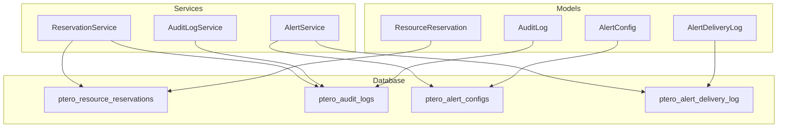
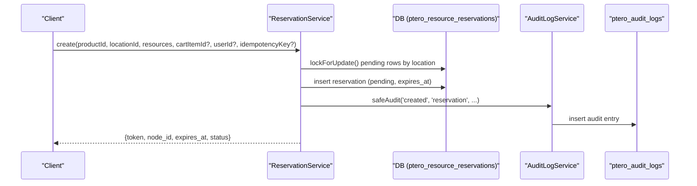
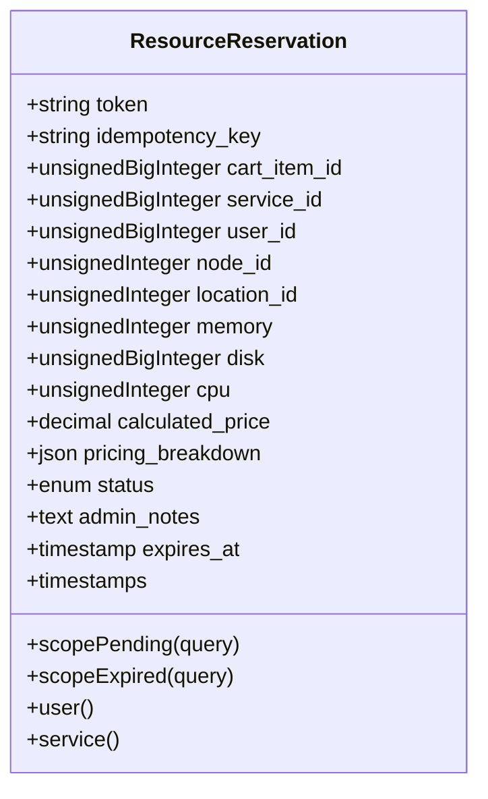
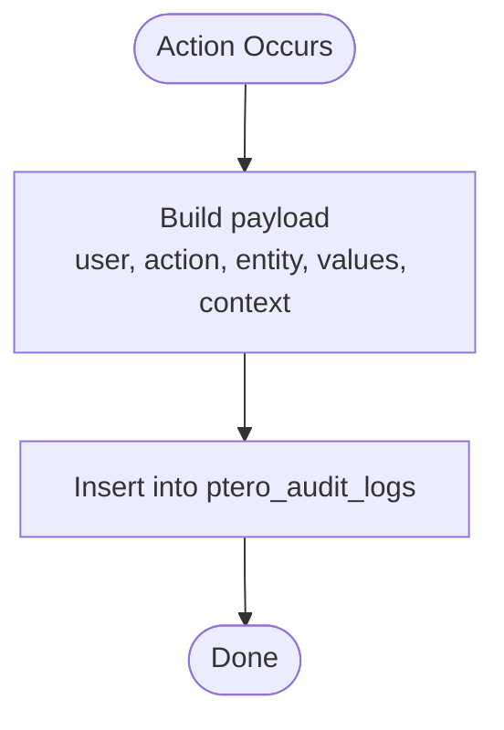
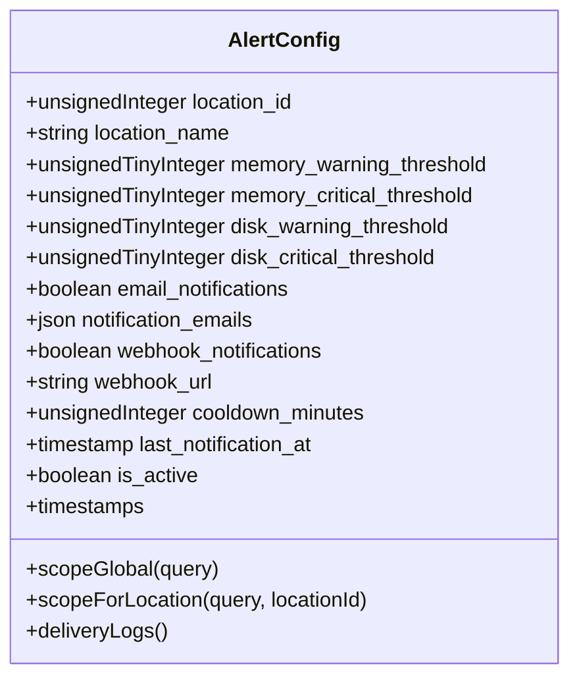
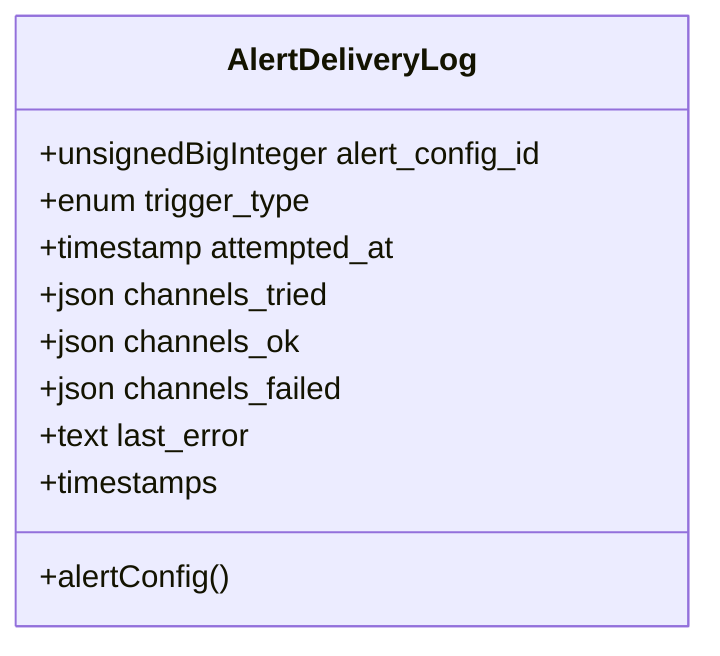
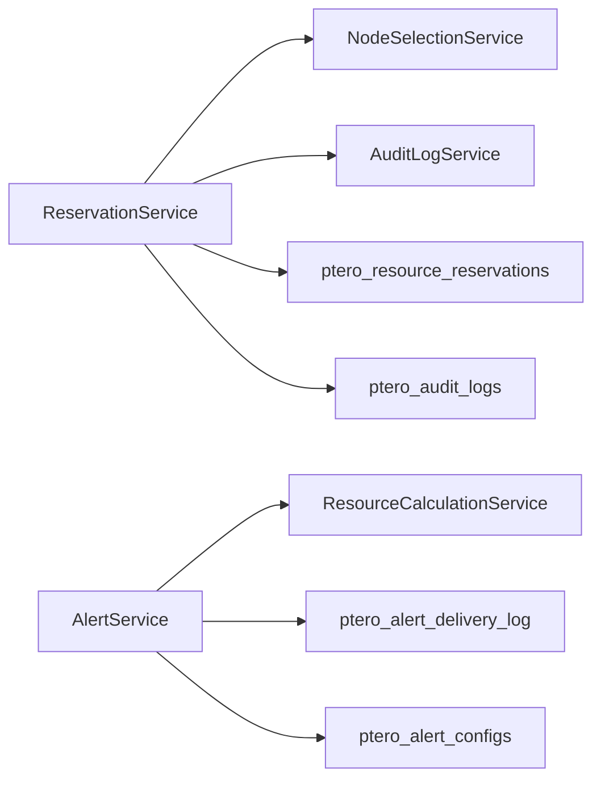
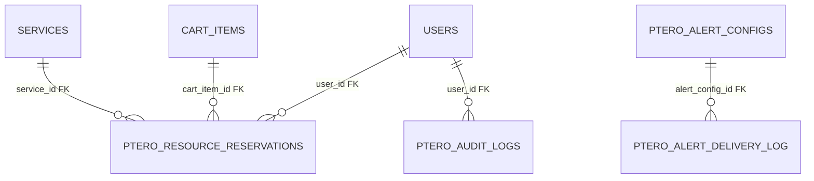

# Database Schema

> **Preserved Qoder snapshot.** This deep-dive page is retained so the earlier Wiki work and its source trail are not lost. For the reconciled implementation, [[Architecture Overview|Architecture-Overview]] is canonical; references below to retired controllers, listeners, services, tables, or API shapes are historical.

<cite>
**Referenced Files in This Document**
- [2025_01_01_000001_create_ptero_resource_reservations_table.php](https://github.com/ObsidianNetwork/dynamic-pterodactyl/blob/6b7f83bda6f7c3fe014d52428b31af1638daa6cc/database/migrations/2025_01_01_000001_create_ptero_resource_reservations_table.php)
- [2026_04_23_000001_add_idempotency_key_to_ptero_resource_reservations.php](https://github.com/ObsidianNetwork/dynamic-pterodactyl/blob/6b7f83bda6f7c3fe014d52428b31af1638daa6cc/database/migrations/2026_04_23_000001_add_idempotency_key_to_ptero_resource_reservations.php)
- [2026_04_22_000001_drop_released_from_reservation_status.php](https://github.com/ObsidianNetwork/dynamic-pterodactyl/blob/6b7f83bda6f7c3fe014d52428b31af1638daa6cc/database/migrations/2026_04_22_000001_drop_released_from_reservation_status.php)
- [2025_01_01_000003_create_ptero_audit_logs_table.php](https://github.com/ObsidianNetwork/dynamic-pterodactyl/blob/6b7f83bda6f7c3fe014d52428b31af1638daa6cc/database/migrations/2025_01_01_000003_create_ptero_audit_logs_table.php)
- [2025_01_01_000004_create_ptero_alert_configs_table.php](https://github.com/ObsidianNetwork/dynamic-pterodactyl/blob/6b7f83bda6f7c3fe014d52428b31af1638daa6cc/database/migrations/2025_01_01_000004_create_ptero_alert_configs_table.php)
- [2026_04_26_000001_create_ptero_alert_delivery_log_table.php](https://github.com/ObsidianNetwork/dynamic-pterodactyl/blob/6b7f83bda6f7c3fe014d52428b31af1638daa6cc/database/migrations/2026_04_26_000001_create_ptero_alert_delivery_log_table.php)
- [ResourceReservation.php](https://github.com/ObsidianNetwork/dynamic-pterodactyl/blob/6b7f83bda6f7c3fe014d52428b31af1638daa6cc/Models/ResourceReservation.php)
- [AuditLog.php](https://github.com/ObsidianNetwork/dynamic-pterodactyl/blob/6b7f83bda6f7c3fe014d52428b31af1638daa6cc/Models/AuditLog.php)
- [AlertConfig.php](https://github.com/ObsidianNetwork/dynamic-pterodactyl/blob/6b7f83bda6f7c3fe014d52428b31af1638daa6cc/Models/AlertConfig.php)
- [AlertDeliveryLog.php](https://github.com/ObsidianNetwork/dynamic-pterodactyl/blob/6b7f83bda6f7c3fe014d52428b31af1638daa6cc/Models/AlertDeliveryLog.php)
- [ReservationService.php](https://github.com/ObsidianNetwork/dynamic-pterodactyl/blob/6b7f83bda6f7c3fe014d52428b31af1638daa6cc/Services/ReservationService.php)
- [AuditLogService.php](https://github.com/ObsidianNetwork/dynamic-pterodactyl/blob/6b7f83bda6f7c3fe014d52428b31af1638daa6cc/Services/AuditLogService.php)
- [AlertService.php](https://github.com/ObsidianNetwork/dynamic-pterodactyl/blob/6b7f83bda6f7c3fe014d52428b31af1638daa6cc/Services/AlertService.php)
</cite>

## Table of Contents
1. [Introduction](#introduction)
2. [Project Structure](#project-structure)
3. [Core Components](#core-components)
4. [Architecture Overview](#architecture-overview)
5. [Detailed Component Analysis](#detailed-component-analysis)
6. [Dependency Analysis](#dependency-analysis)
7. [Performance Considerations](#performance-considerations)
8. [Troubleshooting Guide](#troubleshooting-guide)
9. [Conclusion](#conclusion)
10. [Appendices](#appendices)

## Introduction
This document provides comprehensive data model documentation for the database tables and Eloquent models used by the Dynamic Pterodactyl extension. It focuses on:
- Resource reservations table for temporary resource holds, TTL expiration, and status transitions
- Audit logs table for capturing administrative actions and system events
- Alert configurations schema for capacity monitoring thresholds and notification preferences
- Entity relationships, field definitions, constraints, indexes, validation rules, business logic, lifecycle management, common queries, and performance considerations for large datasets

## Project Structure
The data model spans migrations that define schema, Eloquent models that encapsulate behavior, and services that enforce business rules and orchestrate operations. The key artifacts are:
- Migrations: define tables, columns, types, constraints, and indexes
- Models: map to tables, define casts, scopes, and relationships
- Services: implement reservation lifecycle, audit logging, alerting, and delivery tracking

**Diagram sources**
- [2025_01_01_000001_create_ptero_resource_reservations_table.php:11-61](https://github.com/ObsidianNetwork/dynamic-pterodactyl/blob/6b7f83bda6f7c3fe014d52428b31af1638daa6cc/database/migrations/2025_01_01_000001_create_ptero_resource_reservations_table.php#L11-L61)
- [2025_01_01_000003_create_ptero_audit_logs_table.php:11-40](https://github.com/ObsidianNetwork/dynamic-pterodactyl/blob/6b7f83bda6f7c3fe014d52428b31af1638daa6cc/database/migrations/2025_01_01_000003_create_ptero_audit_logs_table.php#L11-L40)
- [2025_01_01_000004_create_ptero_alert_configs_table.php:11-41](https://github.com/ObsidianNetwork/dynamic-pterodactyl/blob/6b7f83bda6f7c3fe014d52428b31af1638daa6cc/database/migrations/2025_01_01_000004_create_ptero_alert_configs_table.php#L11-L41)
- [2026_04_26_000001_create_ptero_alert_delivery_log_table.php:11-23](https://github.com/ObsidianNetwork/dynamic-pterodactyl/blob/6b7f83bda6f7c3fe014d52428b31af1638daa6cc/database/migrations/2026_04_26_000001_create_ptero_alert_delivery_log_table.php#L11-L23)
- [ResourceReservation.php:10-65](https://github.com/ObsidianNetwork/dynamic-pterodactyl/blob/6b7f83bda6f7c3fe014d52428b31af1638daa6cc/Models/ResourceReservation.php#L10-L65)
- [AuditLog.php:7-37](https://github.com/ObsidianNetwork/dynamic-pterodactyl/blob/6b7f83bda6f7c3fe014d52428b31af1638daa6cc/Models/AuditLog.php#L7-L37)
- [AlertConfig.php:8-56](https://github.com/ObsidianNetwork/dynamic-pterodactyl/blob/6b7f83bda6f7c3fe014d52428b31af1638daa6cc/Models/AlertConfig.php#L8-L56)
- [AlertDeliveryLog.php:8-33](https://github.com/ObsidianNetwork/dynamic-pterodactyl/blob/6b7f83bda6f7c3fe014d52428b31af1638daa6cc/Models/AlertDeliveryLog.php#L8-L33)
- [ReservationService.php:43-141](https://github.com/ObsidianNetwork/dynamic-pterodactyl/blob/6b7f83bda6f7c3fe014d52428b31af1638daa6cc/Services/ReservationService.php#L43-L141)
- [AlertService.php:77-101](https://github.com/ObsidianNetwork/dynamic-pterodactyl/blob/6b7f83bda6f7c3fe014d52428b31af1638daa6cc/Services/AlertService.php#L77-L101)
- [AuditLogService.php:15-41](https://github.com/ObsidianNetwork/dynamic-pterodactyl/blob/6b7f83bda6f7c3fe014d52428b31af1638daa6cc/Services/AuditLogService.php#L15-L41)

**Section sources**
- [2025_01_01_000001_create_ptero_resource_reservations_table.php:11-61](https://github.com/ObsidianNetwork/dynamic-pterodactyl/blob/6b7f83bda6f7c3fe014d52428b31af1638daa6cc/database/migrations/2025_01_01_000001_create_ptero_resource_reservations_table.php#L11-L61)
- [2025_01_01_000003_create_ptero_audit_logs_table.php:11-40](https://github.com/ObsidianNetwork/dynamic-pterodactyl/blob/6b7f83bda6f7c3fe014d52428b31af1638daa6cc/database/migrations/2025_01_01_000003_create_ptero_audit_logs_table.php#L11-L40)
- [2025_01_01_000004_create_ptero_alert_configs_table.php:11-41](https://github.com/ObsidianNetwork/dynamic-pterodactyl/blob/6b7f83bda6f7c3fe014d52428b31af1638daa6cc/database/migrations/2025_01_01_000004_create_ptero_alert_configs_table.php#L11-L41)
- [2026_04_26_000001_create_ptero_alert_delivery_log_table.php:11-23](https://github.com/ObsidianNetwork/dynamic-pterodactyl/blob/6b7f83bda6f7c3fe014d52428b31af1638daa6cc/database/migrations/2026_04_26_000001_create_ptero_alert_delivery_log_table.php#L11-L23)

## Core Components
- Resource reservations: track temporary holds with token, TTL, and status transitions; include idempotency support and foreign keys to cart, service, and user
- Audit logs: immutable records of actions with actor context, entity references, change snapshots, and request metadata
- Alert configurations: per-location or global thresholds for memory/disk utilization with email/webhook notifications and cooldowns
- Alert delivery log: records of attempted alert deliveries, channels tried/succeeded/failed, and last error

**Section sources**
- [ResourceReservation.php:10-65](https://github.com/ObsidianNetwork/dynamic-pterodactyl/blob/6b7f83bda6f7c3fe014d52428b31af1638daa6cc/Models/ResourceReservation.php#L10-L65)
- [AuditLog.php:7-37](https://github.com/ObsidianNetwork/dynamic-pterodactyl/blob/6b7f83bda6f7c3fe014d52428b31af1638daa6cc/Models/AuditLog.php#L7-L37)
- [AlertConfig.php:8-56](https://github.com/ObsidianNetwork/dynamic-pterodactyl/blob/6b7f83bda6f7c3fe014d52428b31af1638daa6cc/Models/AlertConfig.php#L8-L56)
- [AlertDeliveryLog.php:8-33](https://github.com/ObsidianNetwork/dynamic-pterodactyl/blob/6b7f83bda6f7c3fe014d52428b31af1638daa6cc/Models/AlertDeliveryLog.php#L8-L33)

## Architecture Overview
The data layer is driven by migrations and enforced by Eloquent models and services. ReservationService orchestrates reservation creation, confirmation, cancellation, extension, cleanup, and statistics using pessimistic locking and idempotency. AlertService evaluates thresholds against availability and writes delivery logs. AuditLogService persists audit entries with request context.

**Diagram sources**
- [ReservationService.php:43-141](https://github.com/ObsidianNetwork/dynamic-pterodactyl/blob/6b7f83bda6f7c3fe014d52428b31af1638daa6cc/Services/ReservationService.php#L43-L141)
- [AuditLogService.php:15-41](https://github.com/ObsidianNetwork/dynamic-pterodactyl/blob/6b7f83bda6f7c3fe014d52428b31af1638daa6cc/Services/AuditLogService.php#L15-L41)
- [2025_01_01_000001_create_ptero_resource_reservations_table.php:11-61](https://github.com/ObsidianNetwork/dynamic-pterodactyl/blob/6b7f83bda6f7c3fe014d52428b31af1638daa6cc/database/migrations/2025_01_01_000001_create_ptero_resource_reservations_table.php#L11-L61)
- [2025_01_01_000003_create_ptero_audit_logs_table.php:11-40](https://github.com/ObsidianNetwork/dynamic-pterodactyl/blob/6b7f83bda6f7c3fe014d52428b31af1638daa6cc/database/migrations/2025_01_01_000003_create_ptero_audit_logs_table.php#L11-L40)

## Detailed Component Analysis

### Resource Reservations
- Purpose: Track temporary resource holds with TTL expiration and strict status transitions
- Status lifecycle: pending → confirmed | expired | cancelled (released removed)
- Idempotency: supports idempotent creation via unique active key constraint
- Foreign keys: optional links to cart_items, services, users

Fields and types
- id: auto-increment primary key
- token: string(64), unique identifier for the reservation
- idempotency_key: string(64), nullable; paired with active_idempotency_key for idempotency
- active_idempotency_key: generated column derived from idempotency_key when status is pending or confirmed
- cart_item_id: unsigned big integer, nullable, FK to cart_items
- service_id: unsigned big integer, nullable, FK to services
- user_id: unsigned big integer, nullable, FK to users
- node_id: unsigned integer
- location_id: unsigned integer
- memory: unsigned integer (MB)
- disk: unsigned big integer (MB)
- cpu: unsigned integer (percentage; 100 = 1 core)
- calculated_price: decimal(10,2)
- pricing_breakdown: json
- status: enum(pending, confirmed, expired, cancelled); default pending
- admin_notes: text, nullable
- expires_at: timestamp
- created_at, updated_at: timestamps

Indexes and constraints
- Unique index on token
- Composite index on (node_id, status, expires_at)
- Index on cart_item_id
- Composite index on (status, expires_at)
- Index on location_id, status
- Index on user_id, status
- Index on created_at
- FKs to cart_items, services, users with set null on delete
- Unique constraint on (user_id, active_idempotency_key)
- Index on (user_id, idempotency_key)

Business rules and validation
- Creation uses pessimistic locking on pending reservations per location to avoid overbooking
- TTL computed from configuration; default TTL minutes read from extension settings
- Confirmation requires pending status and not expired
- Cancellation requires pending status
- Extension updates expires_at only for pending reservations
- Cleanup marks pending past expires_at as expired
- Idempotency prevents duplicate active reservations for same user and key

Common queries
- Get by token: select where token
- Get by cart item: select where cart_item_id and status=pending
- Query all with filters: status, location_id, node_id, user_id
- Statistics: group by status, sum revenue, average resources for a period
- Cleanup: update pending where expires_at < now() to expired

Relationships
- BelongsTo User
- BelongsTo Service

Model scopes
- Pending: status=pending and expires_at > now
- Expired: status=pending and expires_at <= now

**Diagram sources**
- [ResourceReservation.php:10-65](https://github.com/ObsidianNetwork/dynamic-pterodactyl/blob/6b7f83bda6f7c3fe014d52428b31af1638daa6cc/Models/ResourceReservation.php#L10-L65)
- [2025_01_01_000001_create_ptero_resource_reservations_table.php:11-61](https://github.com/ObsidianNetwork/dynamic-pterodactyl/blob/6b7f83bda6f7c3fe014d52428b31af1638daa6cc/database/migrations/2025_01_01_000001_create_ptero_resource_reservations_table.php#L11-L61)
- [2026_04_23_000001_add_idempotency_key_to_ptero_resource_reservations.php:11-19](https://github.com/ObsidianNetwork/dynamic-pterodactyl/blob/6b7f83bda6f7c3fe014d52428b31af1638daa6cc/database/migrations/2026_04_23_000001_add_idempotency_key_to_ptero_resource_reservations.php#L11-L19)
- [2026_04_22_000001_drop_released_from_reservation_status.php:10-18](https://github.com/ObsidianNetwork/dynamic-pterodactyl/blob/6b7f83bda6f7c3fe014d52428b31af1638daa6cc/database/migrations/2026_04_22_000001_drop_released_from_reservation_status.php#L10-L18)

**Section sources**
- [2025_01_01_000001_create_ptero_resource_reservations_table.php:11-61](https://github.com/ObsidianNetwork/dynamic-pterodactyl/blob/6b7f83bda6f7c3fe014d52428b31af1638daa6cc/database/migrations/2025_01_01_000001_create_ptero_resource_reservations_table.php#L11-L61)
- [2026_04_23_000001_add_idempotency_key_to_ptero_resource_reservations.php:11-19](https://github.com/ObsidianNetwork/dynamic-pterodactyl/blob/6b7f83bda6f7c3fe014d52428b31af1638daa6cc/database/migrations/2026_04_23_000001_add_idempotency_key_to_ptero_resource_reservations.php#L11-L19)
- [2026_04_22_000001_drop_released_from_reservation_status.php:10-18](https://github.com/ObsidianNetwork/dynamic-pterodactyl/blob/6b7f83bda6f7c3fe014d52428b31af1638daa6cc/database/migrations/2026_04_22_000001_drop_released_from_reservation_status.php#L10-L18)
- [ResourceReservation.php:10-65](https://github.com/ObsidianNetwork/dynamic-pterodactyl/blob/6b7f83bda6f7c3fe014d52428b31af1638daa6cc/Models/ResourceReservation.php#L10-L65)
- [ReservationService.php:43-141](https://github.com/ObsidianNetwork/dynamic-pterodactyl/blob/6b7f83bda6f7c3fe014d52428b31af1638daa6cc/Services/ReservationService.php#L43-L141)
- [ReservationService.php:166-281](https://github.com/ObsidianNetwork/dynamic-pterodactyl/blob/6b7f83bda6f7c3fe014d52428b31af1638daa6cc/Services/ReservationService.php#L166-L281)
- [ReservationService.php:335-405](https://github.com/ObsidianNetwork/dynamic-pterodactyl/blob/6b7f83bda6f7c3fe014d52428b31af1638daa6cc/Services/ReservationService.php#L335-L405)

### Audit Logs
- Purpose: Capture administrative actions and system events with actor context and change details
- Fields and types
  - id: auto-increment primary key
  - user_id: unsigned big integer, FK to users cascade delete
  - user_name: string
  - user_email: string
  - action: string (e.g., created, updated, deleted, cancelled)
  - entity_type: string (e.g., pricing_config, reservation, alert_config)
  - entity_id: unsigned big integer
  - entity_name: string, nullable
  - old_values: json, nullable
  - new_values: json, nullable
  - description: text, nullable
  - ip_address: string(45), nullable
  - user_agent: string, nullable
  - created_at: timestamp
- Indexes
  - Composite on (entity_type, entity_id)
  - Index on user_id
  - Index on created_at
  - Index on action

Business rules and usage
- Written via AuditLogService with current user context and request metadata
- Used to record reservation lifecycle events (create, confirm, cancel, extend, batch expire)
- Supports filtering by entity type/id, user, action, and date range

Common queries
- getLogs(filters, limit): paginated list with filters
- getEntityHistory(entityType, entityId): history for a specific entity

**Diagram sources**
- [AuditLogService.php:15-41](https://github.com/ObsidianNetwork/dynamic-pterodactyl/blob/6b7f83bda6f7c3fe014d52428b31af1638daa6cc/Services/AuditLogService.php#L15-L41)
- [2025_01_01_000003_create_ptero_audit_logs_table.php:11-40](https://github.com/ObsidianNetwork/dynamic-pterodactyl/blob/6b7f83bda6f7c3fe014d52428b31af1638daa6cc/database/migrations/2025_01_01_000003_create_ptero_audit_logs_table.php#L11-L40)

**Section sources**
- [2025_01_01_000003_create_ptero_audit_logs_table.php:11-40](https://github.com/ObsidianNetwork/dynamic-pterodactyl/blob/6b7f83bda6f7c3fe014d52428b31af1638daa6cc/database/migrations/2025_01_01_000003_create_ptero_audit_logs_table.php#L11-L40)
- [AuditLog.php:7-37](https://github.com/ObsidianNetwork/dynamic-pterodactyl/blob/6b7f83bda6f7c3fe014d52428b31af1638daa6cc/Models/AuditLog.php#L7-L37)
- [AuditLogService.php:15-82](https://github.com/ObsidianNetwork/dynamic-pterodactyl/blob/6b7f83bda6f7c3fe014d52428b31af1638daa6cc/Services/AuditLogService.php#L15-L82)

### Alert Configurations
- Purpose: Define capacity monitoring thresholds and notification preferences per location or globally
- Fields and types
  - id: auto-increment primary key
  - location_id: unsigned integer, nullable (null means global)
  - location_name: string, nullable
  - memory_warning_threshold: unsigned tiny integer, default 80
  - memory_critical_threshold: unsigned tiny integer, default 95
  - disk_warning_threshold: unsigned tiny integer, default 80
  - disk_critical_threshold: unsigned tiny integer, default 95
  - email_notifications: boolean, default true
  - notification_emails: json, nullable (array of emails)
  - webhook_notifications: boolean, default false
  - webhook_url: string, nullable
  - cooldown_minutes: unsigned integer, default 60
  - last_notification_at: timestamp, nullable
  - is_active: boolean, default true
  - created_at, updated_at: timestamps
- Indexes
  - Index on location_id
  - Index on is_active

Business rules and usage
- AlertService checks thresholds based on availability and sends notifications if breached
- Cooldown prevents spamming by limiting frequency via last_notification_at
- Delivery attempts recorded in ptero_alert_delivery_log

Common queries
- Global configs: scopeGlobal()
- Per-location configs: scopeForLocation(locationId)

**Diagram sources**
- [AlertConfig.php:8-56](https://github.com/ObsidianNetwork/dynamic-pterodactyl/blob/6b7f83bda6f7c3fe014d52428b31af1638daa6cc/Models/AlertConfig.php#L8-L56)
- [2025_01_01_000004_create_ptero_alert_configs_table.php:11-41](https://github.com/ObsidianNetwork/dynamic-pterodactyl/blob/6b7f83bda6f7c3fe014d52428b31af1638daa6cc/database/migrations/2025_01_01_000004_create_ptero_alert_configs_table.php#L11-L41)

**Section sources**
- [2025_01_01_000004_create_ptero_alert_configs_table.php:11-41](https://github.com/ObsidianNetwork/dynamic-pterodactyl/blob/6b7f83bda6f7c3fe014d52428b31af1638daa6cc/database/migrations/2025_01_01_000004_create_ptero_alert_configs_table.php#L11-L41)
- [AlertConfig.php:8-56](https://github.com/ObsidianNetwork/dynamic-pterodactyl/blob/6b7f83bda6f7c3fe014d52428b31af1638daa6cc/Models/AlertConfig.php#L8-L56)
- [AlertService.php:77-101](https://github.com/ObsidianNetwork/dynamic-pterodactyl/blob/6b7f83bda6f7c3fe014d52428b31af1638daa6cc/Services/AlertService.php#L77-L101)

### Alert Delivery Log
- Purpose: Record each attempt to deliver alerts, including channels tried, success/failure, and errors
- Fields and types
  - id: auto-increment primary key
  - alert_config_id: unsigned big integer, FK to ptero_alert_configs cascade delete
  - trigger_type: enum(capacity_breach, shortfall, state_drift, check_failure)
  - attempted_at: timestamp
  - channels_tried: json array, default []
  - channels_ok: json array, default []
  - channels_failed: json array, default []
  - last_error: text, nullable
  - created_at, updated_at: timestamps

Relationships
- BelongsTo AlertConfig

Usage
- AlertService writes delivery logs after attempting email and webhook notifications
- Events may be dispatched when delivery fails

**Diagram sources**
- [AlertDeliveryLog.php:8-33](https://github.com/ObsidianNetwork/dynamic-pterodactyl/blob/6b7f83bda6f7c3fe014d52428b31af1638daa6cc/Models/AlertDeliveryLog.php#L8-L33)
- [2026_04_26_000001_create_ptero_alert_delivery_log_table.php:11-23](https://github.com/ObsidianNetwork/dynamic-pterodactyl/blob/6b7f83bda6f7c3fe014d52428b31af1638daa6cc/database/migrations/2026_04_26_000001_create_ptero_alert_delivery_log_table.php#L11-L23)

**Section sources**
- [2026_04_26_000001_create_ptero_alert_delivery_log_table.php:11-23](https://github.com/ObsidianNetwork/dynamic-pterodactyl/blob/6b7f83bda6f7c3fe014d52428b31af1638daa6cc/database/migrations/2026_04_26_000001_create_ptero_alert_delivery_log_table.php#L11-L23)
- [AlertDeliveryLog.php:8-33](https://github.com/ObsidianNetwork/dynamic-pterodactyl/blob/6b7f83bda6f7c3fe014d52428b31af1638daa6cc/Models/AlertDeliveryLog.php#L8-L33)
- [AlertService.php:191-293](https://github.com/ObsidianNetwork/dynamic-pterodactyl/blob/6b7f83bda6f7c3fe014d52428b31af1638daa6cc/Services/AlertService.php#L191-L293)

## Dependency Analysis
- ReservationService depends on NodeSelectionService to pick nodes and on AuditLogService to record actions
- AlertService depends on ResourceCalculationService for availability metrics and writes to AlertDeliveryLog
- AuditLogService writes directly to ptero_audit_logs with request context
- Models provide scopes and relationships to simplify queries and navigation

**Diagram sources**
- [ReservationService.php:20-35](https://github.com/ObsidianNetwork/dynamic-pterodactyl/blob/6b7f83bda6f7c3fe014d52428b31af1638daa6cc/Services/ReservationService.php#L20-L35)
- [ReservationService.php:43-141](https://github.com/ObsidianNetwork/dynamic-pterodactyl/blob/6b7f83bda6f7c3fe014d52428b31af1638daa6cc/Services/ReservationService.php#L43-L141)
- [AlertService.php:77-101](https://github.com/ObsidianNetwork/dynamic-pterodactyl/blob/6b7f83bda6f7c3fe014d52428b31af1638daa6cc/Services/AlertService.php#L77-L101)
- [AlertService.php:191-293](https://github.com/ObsidianNetwork/dynamic-pterodactyl/blob/6b7f83bda6f7c3fe014d52428b31af1638daa6cc/Services/AlertService.php#L191-L293)
- [AuditLogService.php:15-41](https://github.com/ObsidianNetwork/dynamic-pterodactyl/blob/6b7f83bda6f7c3fe014d52428b31af1638daa6cc/Services/AuditLogService.php#L15-L41)

**Section sources**
- [ReservationService.php:20-35](https://github.com/ObsidianNetwork/dynamic-pterodactyl/blob/6b7f83bda6f7c3fe014d52428b31af1638daa6cc/Services/ReservationService.php#L20-L35)
- [ReservationService.php:43-141](https://github.com/ObsidianNetwork/dynamic-pterodactyl/blob/6b7f83bda6f7c3fe014d52428b31af1638daa6cc/Services/ReservationService.php#L43-L141)
- [AlertService.php:77-101](https://github.com/ObsidianNetwork/dynamic-pterodactyl/blob/6b7f83bda6f7c3fe014d52428b31af1638daa6cc/Services/AlertService.php#L77-L101)
- [AlertService.php:191-293](https://github.com/ObsidianNetwork/dynamic-pterodactyl/blob/6b7f83bda6f7c3fe014d52428b31af1638daa6cc/Services/AlertService.php#L191-L293)
- [AuditLogService.php:15-41](https://github.com/ObsidianNetwork/dynamic-pterodactyl/blob/6b7f83bda6f7c3fe014d52428b31af1638daa6cc/Services/AuditLogService.php#L15-L41)

## Performance Considerations
- Use existing indexes for efficient filtering:
  - (node_id, status, expires_at) for node-level pending lookups
  - (status, expires_at) for cleanup and expiry scans
  - (location_id, status) for location-scoped queries
  - (user_id, status) for user-scoped queries
  - (entity_type, entity_id) for audit log retrieval by entity
  - (user_id, idempotency_key) and unique (user_id, active_idempotency_key) for idempotent creates
- Avoid full table scans by always filtering on indexed columns in admin queries
- Batch updates for cleanup to minimize round trips
- For large datasets:
  - Partition or archive audit logs periodically by created_at
  - Consider archiving expired/cancelled reservations
  - Use pagination for admin listings
- Pessimistic locking with retries mitigates deadlocks during concurrent reservation creation

[No sources needed since this section provides general guidance]

## Troubleshooting Guide
- Duplicate idempotency key errors:
  - Handled by detecting unique constraint violations and returning existing reservation
- Deadlocks on reservation creation:
  - Retried up to 5 times; ensure application handles transient failures gracefully
- Alerts not delivered:
  - Check last_notification_at vs cooldown_minutes
  - Inspect ptero_alert_delivery_log for channels_failed and last_error
  - Verify email recipients and webhook URL configuration
- Audit logs missing:
  - Ensure AuditLogService is invoked for critical actions
  - Validate user context and request metadata availability

**Section sources**
- [ReservationService.php:125-141](https://github.com/ObsidianNetwork/dynamic-pterodactyl/blob/6b7f83bda6f7c3fe014d52428b31af1638daa6cc/Services/ReservationService.php#L125-L141)
- [ReservationService.php:43-141](https://github.com/ObsidianNetwork/dynamic-pterodactyl/blob/6b7f83bda6f7c3fe014d52428b31af1638daa6cc/Services/ReservationService.php#L43-L141)
- [AlertService.php:191-293](https://github.com/ObsidianNetwork/dynamic-pterodactyl/blob/6b7f83bda6f7c3fe014d52428b31af1638daa6cc/Services/AlertService.php#L191-L293)
- [AuditLogService.php:15-41](https://github.com/ObsidianNetwork/dynamic-pterodactyl/blob/6b7f83bda6f7c3fe014d52428b31af1638daa6cc/Services/AuditLogService.php#L15-L41)

## Conclusion
The data model provides robust support for temporary resource reservations with strong concurrency controls, comprehensive auditability, and configurable capacity alerting. Proper use of indexes, scopes, and service-layer logic ensures scalability and reliability under load.

[No sources needed since this section summarizes without analyzing specific files]

## Appendices

### Entity Relationship Diagram

**Diagram sources**
- [2025_01_01_000001_create_ptero_resource_reservations_table.php:64-77](https://github.com/ObsidianNetwork/dynamic-pterodactyl/blob/6b7f83bda6f7c3fe014d52428b31af1638daa6cc/database/migrations/2025_01_01_000001_create_ptero_resource_reservations_table.php#L64-L77)
- [2025_01_01_000003_create_ptero_audit_logs_table.php:42-46](https://github.com/ObsidianNetwork/dynamic-pterodactyl/blob/6b7f83bda6f7c3fe014d52428b31af1638daa6cc/database/migrations/2025_01_01_000003_create_ptero_audit_logs_table.php#L42-L46)
- [2026_04_26_000001_create_ptero_alert_delivery_log_table.php:13-16](https://github.com/ObsidianNetwork/dynamic-pterodactyl/blob/6b7f83bda6f7c3fe014d52428b31af1638daa6cc/database/migrations/2026_04_26_000001_create_ptero_alert_delivery_log_table.php#L13-L16)

### Common Queries Reference
- Create reservation: see ReservationService::create
- Confirm reservation: see ReservationService::confirm
- Cancel reservation: see ReservationService::cancel
- Extend reservation TTL: see ReservationService::extend
- Cleanup expired: see ReservationService::cleanupExpired
- Query all with filters: see ReservationService::queryAll
- Get statistics: see ReservationService::getStatistics
- Write audit log: see AuditLogService::log
- Filter audit logs: see AuditLogService::getLogs
- Evaluate alerts: see AlertService threshold checks

**Section sources**
- [ReservationService.php:43-141](https://github.com/ObsidianNetwork/dynamic-pterodactyl/blob/6b7f83bda6f7c3fe014d52428b31af1638daa6cc/Services/ReservationService.php#L43-L141)
- [ReservationService.php:166-281](https://github.com/ObsidianNetwork/dynamic-pterodactyl/blob/6b7f83bda6f7c3fe014d52428b31af1638daa6cc/Services/ReservationService.php#L166-L281)
- [ReservationService.php:335-405](https://github.com/ObsidianNetwork/dynamic-pterodactyl/blob/6b7f83bda6f7c3fe014d52428b31af1638daa6cc/Services/ReservationService.php#L335-L405)
- [AuditLogService.php:15-82](https://github.com/ObsidianNetwork/dynamic-pterodactyl/blob/6b7f83bda6f7c3fe014d52428b31af1638daa6cc/Services/AuditLogService.php#L15-L82)
- [AlertService.php:77-101](https://github.com/ObsidianNetwork/dynamic-pterodactyl/blob/6b7f83bda6f7c3fe014d52428b31af1638daa6cc/Services/AlertService.php#L77-L101)