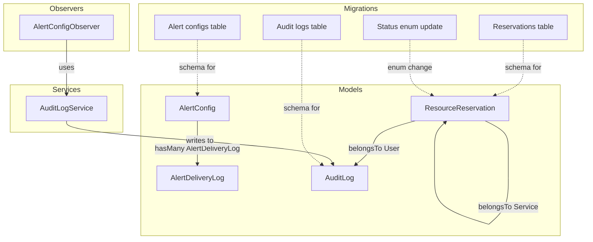
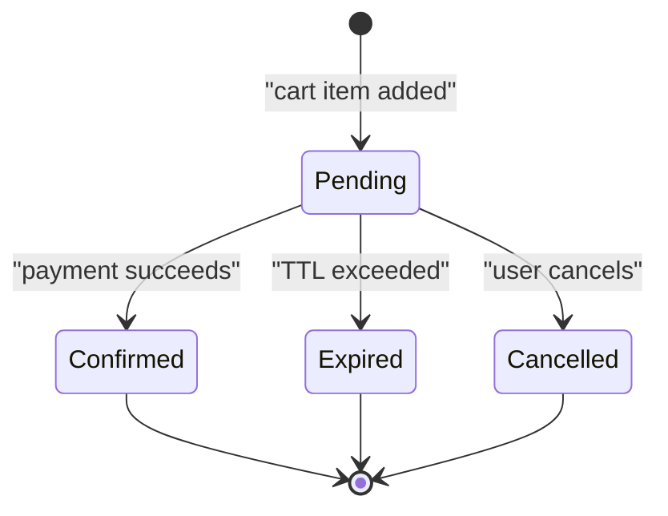
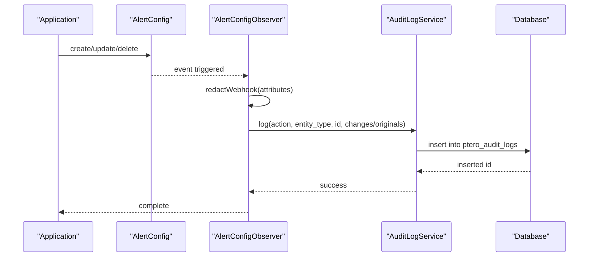
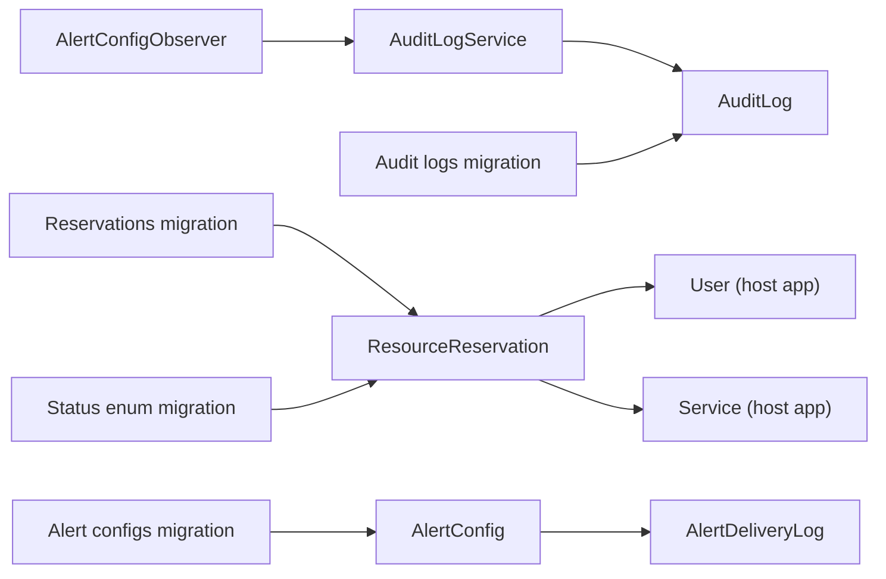

# Model Relationships and Eloquent Models

<cite>
**Referenced Files in This Document**
- [ResourceReservation.php](file://Models/ResourceReservation.php)
- [AlertConfig.php](file://Models/AlertConfig.php)
- [AuditLog.php](file://Models/AuditLog.php)
- [AlertDeliveryLog.php](file://Models/AlertDeliveryLog.php)
- [AlertConfigObserver.php](file://Models/Observers/AlertConfigObserver.php)
- [AuditLogService.php](file://Services/AuditLogService.php)
- [2025_01_01_000001_create_ptero_resource_reservations_table.php](file://database/migrations/2025_01_01_000001_create_ptero_resource_reservations_table.php)
- [2025_01_01_000003_create_ptero_audit_logs_table.php](file://database/migrations/2025_01_01_000003_create_ptero_audit_logs_table.php)
- [2025_01_01_000004_create_ptero_alert_configs_table.php](file://database/migrations/2025_01_01_000004_create_ptero_alert_configs_table.php)
- [2026_04_22_000001_drop_released_from_reservation_status.php](file://database/migrations/2026_04_22_000001_drop_released_from_reservation_status.php)
- [ReservationService.php](file://Services/ReservationService.php)
</cite>

## Table of Contents
1. [Introduction](#introduction)
2. [Project Structure](#project-structure)
3. [Core Components](#core-components)
4. [Architecture Overview](#architecture-overview)
5. [Detailed Component Analysis](#detailed-component-analysis)
6. [Dependency Analysis](#dependency-analysis)
7. [Performance Considerations](#performance-considerations)
8. [Troubleshooting Guide](#troubleshooting-guide)
9. [Conclusion](#conclusion)
10. [Appendices](#appendices)

## Introduction
This document explains the Eloquent models that power resource reservations, alert configuration, and audit logging in the extension. It focuses on:
- ResourceReservation model relationships to users and services, its scopes, and how it integrates with reservation workflows.
- AlertConfig model and its observer-driven audit trail for automatic validation and configuration management.
- AuditLog model usage patterns via a dedicated service for consistent, secure, and queryable audit records.
- Practical examples of common interactions, relationship queries, and best practices when working with these models.

## Project Structure
The models and their supporting components are organized under Models, Services, and database migrations. The key files involved in this documentation are:
- Models: ResourceReservation, AlertConfig, AuditLog, AlertDeliveryLog
- Observer: AlertConfigObserver
- Service: AuditLogService
- Migrations: Reservation table, Audit logs table, Alert configs table, and status enum migration



**Diagram sources**
- [ResourceReservation.php:10-66](file://Models/ResourceReservation.php#L10-L65)
- [AlertConfig.php:8-57](file://Models/AlertConfig.php#L8-L56)
- [AlertDeliveryLog.php:8-34](file://Models/AlertDeliveryLog.php#L8-L33)
- [AuditLog.php:7-38](file://Models/AuditLog.php#L7-L37)
- [AlertConfigObserver.php:8-70](file://Models/Observers/AlertConfigObserver.php#L8-L69)
- [AuditLogService.php:10-83](file://Services/AuditLogService.php#L10-L82)
- [2025_01_01_000001_create_ptero_resource_reservations_table.php:11-78](file://database/migrations/2025_01_01_000001_create_ptero_resource_reservations_table.php#L11-L78)
- [2025_01_01_000004_create_ptero_alert_configs_table.php:11-42](file://database/migrations/2025_01_01_000004_create_ptero_alert_configs_table.php#L11-L42)
- [2025_01_01_000003_create_ptero_audit_logs_table.php:11-47](file://database/migrations/2025_01_01_000003_create_ptero_audit_logs_table.php#L11-L47)
- [2026_04_22_000001_drop_released_from_reservation_status.php:8-27](file://database/migrations/2026_04_22_000001_drop_released_from_reservation_status.php#L8-L27)

**Section sources**
- [ResourceReservation.php:10-66](file://Models/ResourceReservation.php#L10-L65)
- [AlertConfig.php:8-57](file://Models/AlertConfig.php#L8-L56)
- [AuditLog.php:7-38](file://Models/AuditLog.php#L7-L37)
- [AlertDeliveryLog.php:8-34](file://Models/AlertDeliveryLog.php#L8-L33)
- [AlertConfigObserver.php:8-70](file://Models/Observers/AlertConfigObserver.php#L8-L69)
- [AuditLogService.php:10-83](file://Services/AuditLogService.php#L10-L82)
- [2025_01_01_000001_create_ptero_resource_reservations_table.php:11-78](file://database/migrations/2025_01_01_000001_create_ptero_resource_reservations_table.php#L11-L78)
- [2025_01_01_000004_create_ptero_alert_configs_table.php:11-42](file://database/migrations/2025_01_01_000004_create_ptero_alert_configs_table.php#L11-L42)
- [2025_01_01_000003_create_ptero_audit_logs_table.php:11-47](file://database/migrations/2025_01_01_000003_create_ptero_audit_logs_table.php#L11-L47)
- [2026_04_22_000001_drop_released_from_reservation_status.php:8-27](file://database/migrations/2026_04_22_000001_drop_released_from_reservation_status.php#L8-L27)

## Core Components
- ResourceReservation: Represents a reserved compute slot with user/service linkage, pricing snapshot, and lifecycle status. Provides scopes for pending and expired states.
- AlertConfig: Stores per-location or global alert thresholds and notification settings; includes scopes for global and location-scoped configurations and a relationship to delivery logs.
- AuditLog: Immutable log of actions across the system, written via AuditLogService with request context and JSON-diffed values.
- AlertDeliveryLog: Records attempts and outcomes of alert deliveries tied to an AlertConfig.

Key behaviors:
- ResourceReservation uses casts for arrays and decimals, datetime casting for expiration, and belongsTo relationships to User and Service.
- AlertConfig uses boolean and array casts for notifications and thresholds, and hasMany relationship to AlertDeliveryLog.
- AuditLog disables timestamps and stores only created_at manually; values are cast as arrays for old/new snapshots.
- AlertConfigObserver writes audit entries on create/update/delete, redacting sensitive webhook URLs before logging.

**Section sources**
- [ResourceReservation.php:10-66](file://Models/ResourceReservation.php#L10-L65)
- [AlertConfig.php:8-57](file://Models/AlertConfig.php#L8-L56)
- [AuditLog.php:7-38](file://Models/AuditLog.php#L7-L37)
- [AlertDeliveryLog.php:8-34](file://Models/AlertDeliveryLog.php#L8-L33)
- [AlertConfigObserver.php:8-70](file://Models/Observers/AlertConfigObserver.php#L8-L69)

## Architecture Overview
The models interact through relationships and observers to enforce business rules and maintain auditability.

```mermaid
classDiagram
class ResourceReservation {
+string token
+int cart_item_id
+int service_id
+int user_id
+int node_id
+int location_id
+int memory
+int cpu
+int disk
+decimal calculated_price
+array pricing_breakdown
+string status
+datetime expires_at
+scopePending(query)
+scopeExpired(query)
+user() BelongsTo
+service() BelongsTo
}
class AlertConfig {
+int location_id
+string location_name
+int memory_warning_threshold
+int memory_critical_threshold
+int disk_warning_threshold
+int disk_critical_threshold
+boolean email_notifications
+array notification_emails
+boolean webhook_notifications
+string webhook_url
+int cooldown_minutes
+datetime last_notification_at
+boolean is_active
+scopeGlobal(query)
+scopeForLocation(query, locationId)
+deliveryLogs() HasMany
}
class AlertDeliveryLog {
+int alert_config_id
+string trigger_type
+datetime attempted_at
+array channels_tried
+array channels_ok
+array channels_failed
+string last_error
+alertConfig() BelongsTo
}
class AuditLog {
+int user_id
+string user_name
+string user_email
+string action
+string entity_type
+int entity_id
+string entity_name
+json old_values
+json new_values
+text description
+string ip_address
+string user_agent
+datetime created_at
}
ResourceReservation --> "User" : belongsTo
ResourceReservation --> "Service" : belongsTo
AlertConfig --> "AlertDeliveryLog" : hasMany
AlertConfigObserver --> "AuditLogService" : uses
AuditLogService --> "AuditLog" : writes
```

**Diagram sources**
- [ResourceReservation.php:10-66](file://Models/ResourceReservation.php#L10-L65)
- [AlertConfig.php:8-57](file://Models/AlertConfig.php#L8-L56)
- [AlertDeliveryLog.php:8-34](file://Models/AlertDeliveryLog.php#L8-L33)
- [AuditLog.php:7-38](file://Models/AuditLog.php#L7-L37)
- [AlertConfigObserver.php:8-70](file://Models/Observers/AlertConfigObserver.php#L8-L69)
- [AuditLogService.php:10-83](file://Services/AuditLogService.php#L10-L82)

## Detailed Component Analysis

### ResourceReservation Model
- Purpose: Captures a temporary reservation of resources (memory, CPU, disk) for a user’s cart item or service, including pricing at reservation time and expiration.
- Relationships:
  - belongsTo User for tracking who initiated the reservation.
  - belongsTo Service after provisioning completes.
- Scopes:
  - scopePending: filters by status pending and not yet expired.
  - scopeExpired: filters by status pending but past TTL.
- Casts:
  - pricing_breakdown as array, expires_at as datetime, calculated_price as decimal with two places.
- Schema highlights:
  - Unique token, nullable cart_item_id and service_id, required node_id and location_id, resource amounts, pricing snapshot, status enum, admin notes, expires_at timestamp, indexes for performance, and foreign keys to cart_items, services, and users.

Common interactions and queries:
- Get active pending reservations for a node/location:
  - Use ResourceReservation::where('node_id', $nodeId)->where('location_id', $locationId)->pending()->get();
- Find expired reservations to clean up:
  - Use ResourceReservation::expired()->get();
- Query by user or service:
  - ResourceReservation::where('user_id', $userId)->orWhere('service_id', $serviceId);
- Access related entities:
  - $reservation->user; $reservation->service;

Best practices:
- Always use the provided scopes for pending/expired filtering to ensure correct TTL handling.
- Prefer querying by location_id and node_id for availability checks to leverage indexes.
- When updating status, ensure idempotency and avoid race conditions using pessimistic locking where appropriate.

**Section sources**
- [ResourceReservation.php:10-66](file://Models/ResourceReservation.php#L10-L65)
- [2025_01_01_000001_create_ptero_resource_reservations_table.php:11-78](file://database/migrations/2025_01_01_000001_create_ptero_resource_reservations_table.php#L11-L78)
- [2026_04_22_000001_drop_released_from_reservation_status.php:8-27](file://database/migrations/2026_04_22_000001_drop_released_from_reservation_status.php#L8-L27)
- [ReservationService.php:296-330](file://Services/ReservationService.php#L296-L330)

#### ResourceReservation State Flow


[No sources needed since this diagram shows conceptual workflow, not actual code structure]

### AlertConfig Model and Observer Pattern
- Purpose: Stores alert thresholds and notification preferences per location or globally, with delivery tracking.
- Relationships:
  - hasMany AlertDeliveryLog to record each delivery attempt and outcome.
- Scopes:
  - scopeGlobal: returns configurations without a specific location.
  - scopeForLocation(locationId): returns configurations scoped to a given location.
- Casts:
  - notification_emails as array, email_notifications and webhook_notifications as booleans, is_active as boolean, last_notification_at as datetime.
- Observer behavior (AlertConfigObserver):
  - On create/update/delete, writes audit entries via AuditLogService.
  - Redacts webhook_url in logged attributes to prevent secrets leakage.
  - Wrrites changes and original values for updates; strips internal fields for creates/deletes.

Usage patterns:
- Retrieve global config: AlertConfig::global()->first();
- Retrieve location-specific config: AlertConfig::forLocation($locationId)->first();
- Access delivery logs: $config->deliveryLogs()->latest()->get();

Best practices:
- Always check is_active before sending alerts.
- Respect cooldown_minutes to avoid spamming notifications.
- Ensure webhook_url is never exposed in logs or responses; rely on observer redaction.

**Section sources**
- [AlertConfig.php:8-57](file://Models/AlertConfig.php#L8-L56)
- [AlertDeliveryLog.php:8-34](file://Models/AlertDeliveryLog.php#L8-L33)
- [AlertConfigObserver.php:8-70](file://Models/Observers/AlertConfigObserver.php#L8-L69)
- [2025_01_01_000004_create_ptero_alert_configs_table.php:11-42](file://database/migrations/2025_01_01_000004_create_ptero_alert_configs_table.php#L11-L42)

#### AlertConfig Observer Sequence


**Diagram sources**
- [AlertConfigObserver.php:12-68](file://Models/Observers/AlertConfigObserver.php#L12-L68)
- [AuditLogService.php:15-41](file://Services/AuditLogService.php#L15-L41)
- [2025_01_01_000003_create_ptero_audit_logs_table.php:11-47](file://database/migrations/2025_01_01_000003_create_ptero_audit_logs_table.php#L11-L47)

### AuditLog Model and Usage Patterns
- Purpose: Centralized, immutable audit trail for critical actions across the system.
- Characteristics:
  - Disables automatic timestamps; only created_at is used.
  - Stores user context, action type, entity details, and JSON diffs of old/new values.
  - Indexed by entity_type/entity_id, user_id, created_at, and action for efficient queries.
- Writing logs:
  - Use AuditLogService::log(action, entityType, entityId, newValues?, oldValues?, description?, entityName?) to write consistently with request context.
- Reading logs:
  - Use AuditLogService::getLogs(filters, limit) for filtered retrieval.
  - Use AuditLogService::getEntityHistory(entityType, entityId) to fetch history for a specific entity.

Examples:
- Log a reservation cancellation:
  - AuditLogService::log('reservation_cancelled', 'resource_reservation', $reservationId, ['token_prefix' => substr($token, 0, 8), 'node_id' => $nodeId]);
- Fetch recent logs for a user:
  - AuditLogService::getLogs(['user_id' => $userId], 50);

Best practices:
- Always include descriptive entity_type and entity_id to enable traceability.
- Avoid storing sensitive data in new_values/old_values; sanitize inputs before logging.
- Use getEntityHistory for UIs showing change timelines.

**Section sources**
- [AuditLog.php:7-38](file://Models/AuditLog.php#L7-L37)
- [AuditLogService.php:10-83](file://Services/AuditLogService.php#L10-L82)
- [2025_01_01_000003_create_ptero_audit_logs_table.php:11-47](file://database/migrations/2025_01_01_000003_create_ptero_audit_logs_table.php#L11-L47)

### Common Model Interactions and Best Practices
- Relationship queries:
  - Load user and service with reservations: ResourceReservation::with(['user', 'service'])->where('status', 'confirmed')->get();
  - Get delivery logs for an alert config: AlertConfig::find($id)->deliveryLogs()->latest()->get();
- Filtering and scoping:
  - Use ResourceReservation::pending() and ::expired() to respect TTL logic.
  - Use AlertConfig::global() and ::forLocation($id) to resolve effective configuration.
- Data integrity:
  - Rely on foreign keys to keep references consistent; onDelete set null for optional links.
  - Use casts to ensure types like arrays and decimals are handled correctly.
- Performance:
  - Leverage indexes on node_id, location_id, status, and created_at for frequent queries.
  - Paginate large result sets in admin APIs.

[No sources needed since this section provides general guidance]

## Dependency Analysis
The models depend on core framework classes and external models from the host application, plus internal services and migrations.



**Diagram sources**
- [ResourceReservation.php:38-46](file://Models/ResourceReservation.php#L38-L46)
- [AlertConfig.php:52-55](file://Models/AlertConfig.php#L52-L55)
- [AlertConfigObserver.php:5-10](file://Models/Observers/AlertConfigObserver.php#L5-L10)
- [AuditLogService.php:10-41](file://Services/AuditLogService.php#L10-L41)
- [2025_01_01_000001_create_ptero_resource_reservations_table.php:11-78](file://database/migrations/2025_01_01_000001_create_ptero_resource_reservations_table.php#L11-L78)
- [2025_01_01_000004_create_ptero_alert_configs_table.php:11-42](file://database/migrations/2025_01_01_000004_create_ptero_alert_configs_table.php#L11-L42)
- [2025_01_01_000003_create_ptero_audit_logs_table.php:11-47](file://database/migrations/2025_01_01_000003_create_ptero_audit_logs_table.php#L11-L47)
- [2026_04_22_000001_drop_released_from_reservation_status.php:8-27](file://database/migrations/2026_04_22_000001_drop_released_from_reservation_status.php#L8-L27)

**Section sources**
- [ResourceReservation.php:38-46](file://Models/ResourceReservation.php#L38-L46)
- [AlertConfig.php:52-55](file://Models/AlertConfig.php#L52-L55)
- [AlertConfigObserver.php:5-10](file://Models/Observers/AlertConfigObserver.php#L5-L10)
- [AuditLogService.php:10-41](file://Services/AuditLogService.php#L10-L41)
- [2025_01_01_000001_create_ptero_resource_reservations_table.php:11-78](file://database/migrations/2025_01_01_000001_create_ptero_resource_reservations_table.php#L11-L78)
- [2025_01_01_000004_create_ptero_alert_configs_table.php:11-42](file://database/migrations/2025_01_01_000004_create_ptero_alert_configs_table.php#L11-L42)
- [2025_01_01_000003_create_ptero_audit_logs_table.php:11-47](file://database/migrations/2025_01_01_000003_create_ptero_audit_logs_table.php#L11-L47)
- [2026_04_22_000001_drop_released_from_reservation_status.php:8-27](file://database/migrations/2026_04_22_000001_drop_released_from_reservation_status.php#L8-L27)

## Performance Considerations
- Indexes:
  - Reservations table indexes support fast lookups by node_id/status/expires_at, cleanup jobs, and user/location filters.
  - Audit logs indexed by entity_type/entity_id, user_id, created_at, and action for efficient reporting.
- Casting:
  - Using casts reduces runtime conversion overhead and ensures consistent types.
- Query patterns:
  - Prefer scopes and targeted where clauses to minimize full-table scans.
  - Paginate admin listings and limit result sets in services.

[No sources needed since this section provides general guidance]

## Troubleshooting Guide
- Alerts not firing:
  - Verify AlertConfig::is_active and cooldown_minutes; check last_notification_at.
  - Inspect AlertDeliveryLog for channels_tried/channels_failed/last_error.
- Audit logs missing:
  - Ensure AuditLogService::log is called and not failing silently; check for exceptions in observer try/catch blocks.
  - Validate that webhook_url is redacted and not causing serialization issues.
- Reservation state anomalies:
  - Confirm status enum reflects current schema (released removed).
  - Check TTL handling via expires_at and scopes; verify cleanup processes update expired statuses.

**Section sources**
- [AlertConfig.php:28-34](file://Models/AlertConfig.php#L28-L34)
- [AlertDeliveryLog.php:12-27](file://Models/AlertDeliveryLog.php#L12-L27)
- [AlertConfigObserver.php:12-68](file://Models/Observers/AlertConfigObserver.php#L12-L68)
- [AuditLogService.php:15-41](file://Services/AuditLogService.php#L15-L41)
- [2026_04_22_000001_drop_released_from_reservation_status.php:8-27](file://database/migrations/2026_04_22_000001_drop_released_from_reservation_status.php#L8-L27)

## Conclusion
The models form a cohesive system for managing resource reservations, alerting, and auditing:
- ResourceReservation encapsulates reservation state and relationships with clear scopes for lifecycle management.
- AlertConfig centralizes alerting configuration with robust observer-driven audit trails and delivery tracking.
- AuditLog, via AuditLogService, provides a reliable, queryable history of changes across the system.
Adhering to the recommended patterns—using scopes, respecting casts and indexes, and leveraging observers—ensures correctness, performance, and security.

[No sources needed since this section summarizes without analyzing specific files]

## Appendices

### Example Queries and Workflows
- Create and persist a reservation:
  - Use ResourceReservation::create([...]) with necessary fields; ensure expires_at is set and status is pending.
- Resolve effective alert config:
  - AlertConfig::forLocation($locationId)->first() ?? AlertConfig::global()->first();
- Retrieve audit history:
  - AuditLogService::getEntityHistory('alert_config', $configId);

[No sources needed since this section provides general guidance]