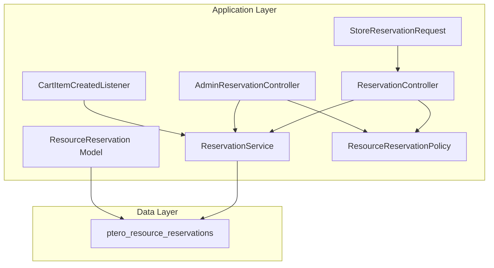
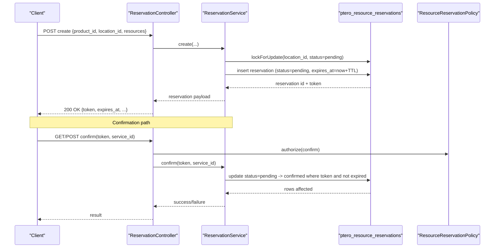
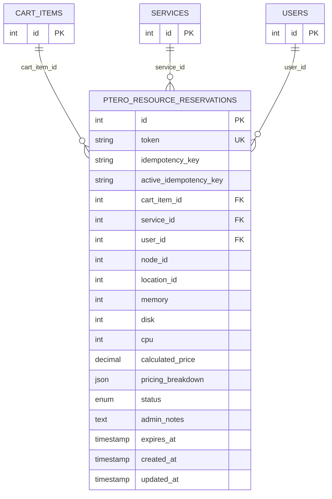
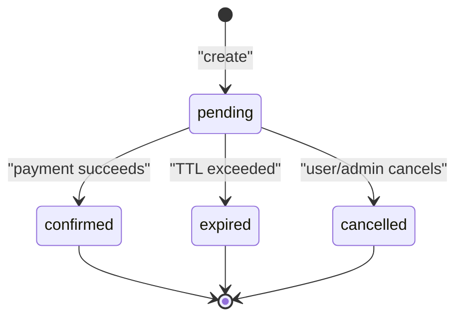

# Resource Reservations Table

<cite>
**Referenced Files in This Document**
- [2025_01_01_000001_create_ptero_resource_reservations_table.php](file://database/migrations/2025_01_01_000001_create_ptero_resource_reservations_table.php)
- [2026_04_22_000001_drop_released_from_reservation_status.php](file://database/migrations/2026_04_22_000001_drop_released_from_reservation_status.php)
- [2026_04_23_000001_add_idempotency_key_to_ptero_resource_reservations.php](file://database/migrations/2026_04_23_000001_add_idempotency_key_to_ptero_resource_reservations.php)
- [ResourceReservation.php](file://Models/ResourceReservation.php)
- [ReservationService.php](file://Services/ReservationService.php)
- [ReservationController.php](file://Http/Controllers/Api/ReservationController.php)
- [AdminReservationController.php](file://Http/Controllers/Api/Admin/AdminReservationController.php)
- [CartItemCreatedListener.php](file://Listeners/CartItemCreatedListener.php)
- [StoreReservationRequest.php](file://Http/Requests/StoreReservationRequest.php)
- [ResourceReservationPolicy.php](file://Policies/ResourceReservationPolicy.php)
</cite>

## Table of Contents
1. [Introduction](#introduction)
2. [Project Structure](#project-structure)
3. [Core Components](#core-components)
4. [Architecture Overview](#architecture-overview)
5. [Detailed Component Analysis](#detailed-component-analysis)
6. [Dependency Analysis](#dependency-analysis)
7. [Performance Considerations](#performance-considerations)
8. [Troubleshooting Guide](#troubleshooting-guide)
9. [Conclusion](#conclusion)
10. [Appendices](#appendices)

## Introduction
This document provides comprehensive data model documentation for the resource reservations table used to temporarily hold Pterodactyl node resources during a customer checkout flow. It covers schema, token-based tracking, cart and service relationships, user associations, Pterodactyl node/location references, pricing snapshots, status transitions, TTL expiration handling, admin notes, indexes, foreign keys, common queries, and performance considerations for large datasets.

## Project Structure
The reservation system spans migrations (schema), an Eloquent model, a service layer, API controllers, request validation, listeners that integrate with the cart, and policies for authorization. The table is central to reserving memory, CPU, and disk on a specific node within a location while a payment is pending.

**Diagram sources**
- [ResourceReservation.php:10-65](file://Models/ResourceReservation.php#L10-L65)
- [ReservationService.php:16-454](file://Services/ReservationService.php#L16-L454)
- [ReservationController.php:13-138](file://Http/Controllers/Api/ReservationController.php#L13-L138)
- [AdminReservationController.php:9-76](file://Http/Controllers/Api/Admin/AdminReservationController.php#L9-L76)
- [CartItemCreatedListener.php:11-174](file://Listeners/CartItemCreatedListener.php#L11-L174)
- [StoreReservationRequest.php:10-163](file://Http/Requests/StoreReservationRequest.php#L10-L163)
- [ResourceReservationPolicy.php:9-70](file://Policies/ResourceReservationPolicy.php#L9-L70)

**Section sources**
- [2025_01_01_000001_create_ptero_resource_reservations_table.php:11-78](file://database/migrations/2025_01_01_000001_create_ptero_resource_reservations_table.php#L11-L78)
- [ResourceReservation.php:10-65](file://Models/ResourceReservation.php#L10-L65)
- [ReservationService.php:16-454](file://Services/ReservationService.php#L16-L454)
- [ReservationController.php:13-138](file://Http/Controllers/Api/ReservationController.php#L13-L138)
- [AdminReservationController.php:9-76](file://Http/Controllers/Api/Admin/AdminReservationController.php#L9-L76)
- [CartItemCreatedListener.php:11-174](file://Listeners/CartItemCreatedListener.php#L11-L174)
- [StoreReservationRequest.php:10-163](file://Http/Requests/StoreReservationRequest.php#L10-L163)
- [ResourceReservationPolicy.php:9-70](file://Policies/ResourceReservationPolicy.php#L9-L70)

## Core Components
- Schema and constraints are defined in the initial migration and subsequent migrations that adjust status values and add idempotency support.
- The Eloquent model defines fillable fields, casts, and scopes for pending/expired queries.
- ReservationService implements creation, confirmation, cancellation, extension, statistics, and cleanup of expired reservations with pessimistic locking and idempotency safeguards.
- Controllers expose API endpoints for customers and admins to create, view, cancel, and extend reservations.
- CartItemCreatedListener integrates reservation creation into the cart workflow by extracting dynamic slider resources and storing the reservation token in checkout configuration.
- StoreReservationRequest validates inputs against product configuration and dynamic slider metadata.
- ResourceReservationPolicy enforces authorization rules for viewing, confirming, cancelling, and extending reservations.

**Section sources**
- [2025_01_01_000001_create_ptero_resource_reservations_table.php:11-78](file://database/migrations/2025_01_01_000001_create_ptero_resource_reservations_table.php#L11-L78)
- [2026_04_22_000001_drop_released_from_reservation_status.php:8-27](file://database/migrations/2026_04_22_000001_drop_released_from_reservation_status.php#L8-L27)
- [2026_04_23_000001_add_idempotency_key_to_ptero_resource_reservations.php:9-31](file://database/migrations/2026_04_23_000001_add_idempotency_key_to_ptero_resource_reservations.php#L9-L31)
- [ResourceReservation.php:10-65](file://Models/ResourceReservation.php#L10-L65)
- [ReservationService.php:16-454](file://Services/ReservationService.php#L16-L454)
- [ReservationController.php:13-138](file://Http/Controllers/Api/ReservationController.php#L13-L138)
- [AdminReservationController.php:9-76](file://Http/Controllers/Api/Admin/AdminReservationController.php#L9-L76)
- [CartItemCreatedListener.php:11-174](file://Listeners/CartItemCreatedListener.php#L11-L174)
- [StoreReservationRequest.php:10-163](file://Http/Requests/StoreReservationRequest.php#L10-L163)
- [ResourceReservationPolicy.php:9-70](file://Policies/ResourceReservationPolicy.php#L9-L70)

## Architecture Overview
The reservation lifecycle ensures temporary resource holds until payment completes or TTL expires. Creation uses pessimistic locking to avoid overselling, and idempotency prevents duplicate reservations under concurrent requests. Status transitions are enforced at the service layer with authorization checks via policies.

**Diagram sources**
- [ReservationController.php:24-79](file://Http/Controllers/Api/ReservationController.php#L24-L79)
- [ReservationService.php:43-199](file://Services/ReservationService.php#L43-L199)
- [ResourceReservationPolicy.php:55-58](file://Policies/ResourceReservationPolicy.php#L55-L58)

**Section sources**
- [ReservationController.php:24-79](file://Http/Controllers/Api/ReservationController.php#L24-L79)
- [ReservationService.php:43-199](file://Services/ReservationService.php#L43-L199)
- [ResourceReservationPolicy.php:55-58](file://Policies/ResourceReservationPolicy.php#L55-L58)

## Detailed Component Analysis

### Data Model: ptero_resource_reservations
- Primary key: auto-incrementing id
- Token: unique string used for tracking reservations across the checkout flow
- Idempotency: optional idempotency_key and computed active_idempotency_key to prevent duplicates for active states
- Relationships:
  - cart_item_id: nullable link to cart items; cleared after checkout
  - service_id: set after provisioning; nullable
  - user_id: owner of the reservation; nullable for guest flows
- Pterodactyl references:
  - node_id: target node for reserved resources
  - location_id: logical grouping of nodes
- Reserved resources:
  - memory: integer MB
  - disk: integer MB
  - cpu: integer percentage (100 equals one core)
- Pricing snapshot:
  - calculated_price: decimal with two decimals
  - pricing_breakdown: JSON array/object capturing price components at reservation time
- Status:
  - Enum values: pending, confirmed, expired, cancelled
  - Default: pending
  - Note: released was removed from the enum and migrated to cancelled
- Admin notes:
  - text field for administrative comments or reasons
- Timestamps:
  - expires_at: TTL boundary for pending reservations
  - created_at, updated_at: standard audit timestamps

Indexes:
- Composite index on (node_id, status, expires_at) for efficient availability and cleanup queries
- Index on cart_item_id for cart-linked lookups
- Index on (status, expires_at) for cleanup and expired scans
- Index on location_id, status for location-scoped queries
- Index on user_id, status for user-scoped queries
- Index on created_at for chronological ordering

Foreign Keys:
- cart_item_id -> cart_items(id) on delete set null
- service_id -> services(id) on delete set null
- user_id -> users(id) on delete set null

**Section sources**
- [2025_01_01_000001_create_ptero_resource_reservations_table.php:11-78](file://database/migrations/2025_01_01_000001_create_ptero_resource_reservations_table.php#L11-L78)
- [2026_04_22_000001_drop_released_from_reservation_status.php:8-27](file://database/migrations/2026_04_22_000001_drop_released_from_reservation_status.php#L8-L27)
- [2026_04_23_000001_add_idempotency_key_to_ptero_resource_reservations.php:9-31](file://database/migrations/2026_04_23_000001_add_idempotency_key_to_ptero_resource_reservations.php#L9-L31)

### Eloquent Model: ResourceReservation
- Fillable fields include token, idempotency_key, cart_item_id, service_id, user_id, node_id, location_id, memory, cpu, disk, calculated_price, pricing_breakdown, status, admin_notes, expires_at
- Casts:
  - pricing_breakdown to array
  - expires_at to datetime
  - calculated_price to decimal with two places
- Scopes:
  - pending: filters status=pending and expires_at > now
  - expired: filters status=pending and expires_at <= now
- Relationships:
  - belongsTo User
  - belongsTo Service

**Section sources**
- [ResourceReservation.php:10-65](file://Models/ResourceReservation.php#L10-L65)

### Service Layer: ReservationService
Key responsibilities:
- Create:
  - Uses pessimistic locking on pending reservations per location to prevent overselling
  - Supports idempotency via idempotency_key and active_idempotency_key computed column
  - Generates a random token and sets expires_at based on configured TTL
  - Inserts reservation with status=pending and zeroed pricing snapshot
  - Audits creation events
- Confirm:
  - Transitions pending to confirmed if still valid and not expired
  - Sets service_id and updates timestamp
  - Enforces authorization when actor provided
- Cancel:
  - Transitions pending to cancelled and records reason in admin_notes
  - Enforces authorization when actor provided
- Extend:
  - Extends expires_at for pending reservations by additional minutes
  - Enforces authorization when actor provided
- Query helpers:
  - getByToken, getByCartItem
  - queryAll for admin filtering and pagination
- Statistics:
  - Aggregates counts by status, revenue from confirmed reservations, average resources
- Cleanup:
  - Marks pending reservations past expires_at as expired in batch
  - Audits batch expirations

Concurrency and safety:
- Transaction with retry on deadlock
- LockForUpdate on pending reservations per location
- Idempotency duplicate detection and handling

**Section sources**
- [ReservationService.php:43-199](file://Services/ReservationService.php#L43-L199)
- [ReservationService.php:208-281](file://Services/ReservationService.php#L208-L281)
- [ReservationService.php:312-382](file://Services/ReservationService.php#L312-L382)
- [ReservationService.php:387-405](file://Services/ReservationService.php#L387-L405)
- [ReservationService.php:431-452](file://Services/ReservationService.php#L431-L452)

### API Controllers
- Customer-facing ReservationController:
  - create: accepts validated input, calls service to create reservation, returns token and expiry
  - get: retrieves reservation by token with policy authorization
  - cancel: cancels pending reservation with policy authorization
  - extend: extends TTL with validated minutes and policy authorization
- AdminReservationController:
  - index: paginated list with filters for status, location_id, node_id, user_id
  - cancel: admin-only cancellation with reason stored in admin_notes

Authorization:
- Policies enforce ownership for view/cancel/extend and allow admin panel access for broader operations

**Section sources**
- [ReservationController.php:24-136](file://Http/Controllers/Api/ReservationController.php#L24-L136)
- [AdminReservationController.php:18-74](file://Http/Controllers/Api/Admin/AdminReservationController.php#L18-L74)
- [ResourceReservationPolicy.php:14-68](file://Policies/ResourceReservationPolicy.php#L14-L68)

### Request Validation: StoreReservationRequest
- Validates product_id, location_id, resource sliders (memory, cpu, disk)
- Enforces allowed locations per product settings
- Ensures product has dynamic_slider options configured
- Validates slider ranges and step increments
- Supports idempotency_key via header or body

**Section sources**
- [StoreReservationRequest.php:12-163](file://Http/Requests/StoreReservationRequest.php#L12-L163)

### Listener: CartItemCreatedListener
- Detects products with dynamic_slider config options
- Extracts resource values from config_options
- Determines location from checkout_config or config_options
- Creates reservation via service and stores token, selected node, and calculated price in checkout_config
- Logs errors without blocking cart operations

**Section sources**
- [CartItemCreatedListener.php:13-87](file://Listeners/CartItemCreatedListener.php#L13-L87)
- [CartItemCreatedListener.php:93-172](file://Listeners/CartItemCreatedListener.php#L93-L172)

### Authorization: ResourceReservationPolicy
- Admin bypass for panel access
- Ownership checks for view, cancel, extend, confirm
- Admin-only viewAny for listing all reservations

**Section sources**
- [ResourceReservationPolicy.php:14-68](file://Policies/ResourceReservationPolicy.php#L14-L68)

## Dependency Analysis
The reservation table depends on external entities through foreign keys and is consumed by multiple application layers.

**Diagram sources**
- [2025_01_01_000001_create_ptero_resource_reservations_table.php:11-78](file://database/migrations/2025_01_01_000001_create_ptero_resource_reservations_table.php#L11-L78)
- [2026_04_23_000001_add_idempotency_key_to_ptero_resource_reservations.php:9-31](file://database/migrations/2026_04_23_000001_add_idempotency_key_to_ptero_resource_reservations.php#L9-L31)

Coupling and cohesion:
- High cohesion within ReservationService for state transitions and TTL management
- Clear separation between API controllers (request/response) and service (business logic)
- Policy encapsulates authorization, reducing coupling in controllers
- Listener decouples cart integration from reservation creation

Potential circular dependencies:
- None observed; service depends on database and external node selection, but not on controllers or listeners directly

External integrations:
- Node selection and availability rely on Pterodactyl API (not cached)
- Audit logging via extension actions

**Section sources**
- [ReservationService.php:43-199](file://Services/ReservationService.php#L43-L199)
- [ReservationService.php:387-405](file://Services/ReservationService.php#L387-L405)
- [CartItemCreatedListener.php:13-87](file://Listeners/CartItemCreatedListener.php#L13-L87)

## Performance Considerations
Index strategies:
- Composite index (node_id, status, expires_at) optimizes availability checks and cleanup scans
- Index (status, expires_at) accelerates TTL expiration processing
- Indexes on cart_item_id, location_id/status, user_id/status support frequent lookup patterns
- Unique token index ensures fast retrieval and uniqueness enforcement

Query patterns:
- Pending availability: select by node_id, status=pending, expires_at > now
- Cleanup: update status=expired where status=pending and expires_at < now
- Admin lists: filter by status, location_id, node_id, user_id with pagination ordered by created_at desc

Concurrency:
- Pessimistic locking on pending reservations per location prevents overselling
- Deadlock retries improve resilience under high contention
- Idempotency key prevents duplicate reservations under concurrent requests

Large dataset considerations:
- Batch updates for expiration reduce per-row overhead
- Pagination for admin queries avoids full table scans
- Avoid selecting unnecessary columns in high-frequency queries
- Monitor index usage and consider partitioning by created_at or expires_at if growth is substantial

[No sources needed since this section provides general guidance]

## Troubleshooting Guide
Common issues and resolutions:
- No node available: ensure sufficient resources in the selected location and verify node capacity and maintenance mode
- Duplicate reservation: check idempotency_key usage and active_idempotency_key uniqueness constraint
- Expiration before payment: increase TTL or extend via API; verify scheduled cleanup runs regularly
- Authorization failures: confirm user ownership or admin panel access; validate policy rules
- Invalid slider values: ensure product has dynamic_slider options configured and values respect min/max/step

Operational checks:
- Verify indexes exist and are utilized by EXPLAIN plans for critical queries
- Inspect audit logs for reservation lifecycle events
- Validate foreign key integrity for cart_item_id, service_id, user_id

**Section sources**
- [ReservationService.php:43-199](file://Services/ReservationService.php#L43-L199)
- [ReservationService.php:387-405](file://Services/ReservationService.php#L387-L405)
- [AdminReservationController.php:36-74](file://Http/Controllers/Api/Admin/AdminReservationController.php#L36-L74)
- [StoreReservationRequest.php:51-112](file://Http/Requests/StoreReservationRequest.php#L51-L112)

## Conclusion
The resource reservations table provides a robust mechanism to temporarily reserve Pterodactyl node resources during checkout, ensuring consistency through pessimistic locking, idempotency, and strict status transitions. Its schema supports token-based tracking, cart and service relationships, user associations, and precise resource accounting. With targeted indexes and service-layer logic, it scales to handle large datasets while maintaining performance and reliability.

[No sources needed since this section summarizes without analyzing specific files]

## Appendices

### Status Transition Logic

**Diagram sources**
- [ReservationService.php:166-199](file://Services/ReservationService.php#L166-L199)
- [ReservationService.php:208-241](file://Services/ReservationService.php#L208-L241)
- [ReservationService.php:387-405](file://Services/ReservationService.php#L387-L405)

### Common Query Patterns
- Find pending non-expired reservations for a location:
  - Filter by location_id, status=pending, expires_at > now
- Cleanup expired reservations:
  - Update status=expired where status=pending and expires_at < now
- Admin list with filters:
  - Filter by status, location_id, node_id, user_id; order by created_at desc; paginate

**Section sources**
- [ReservationService.php:312-382](file://Services/ReservationService.php#L312-L382)
- [ReservationService.php:387-405](file://Services/ReservationService.php#L387-L405)