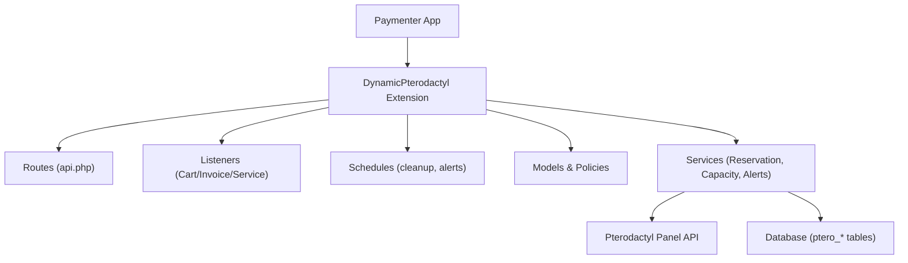
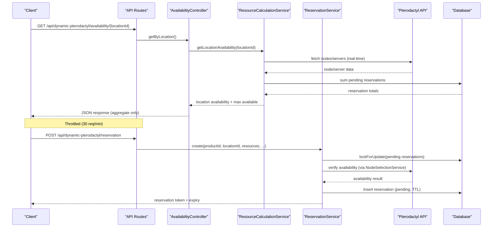
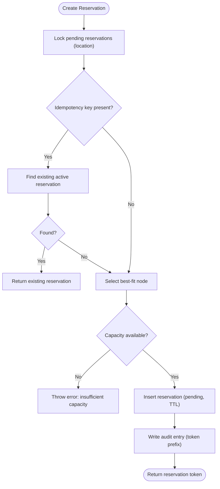
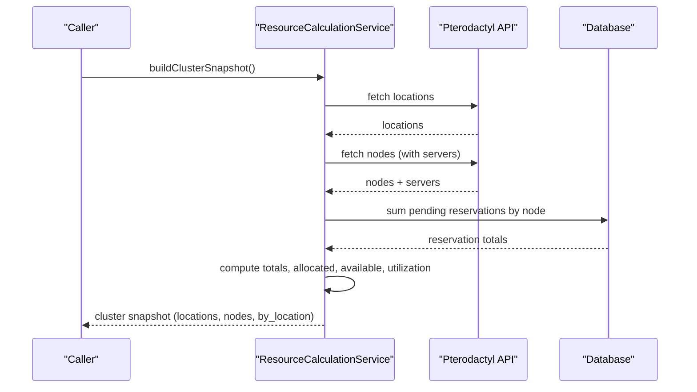
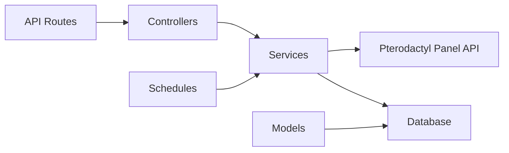

# Deployment

<cite>
**Referenced Files in This Document**
- [DynamicPterodactyl.php](file://DynamicPterodactyl.php)
- [api.php](file://routes/api.php)
- [ResourceCalculationService.php](file://Services/ResourceCalculationService.php)
- [ReservationService.php](file://Services/ReservationService.php)
- [AvailabilityController.php](file://Http/Controllers/Api/AvailabilityController.php)
- [2025_01_01_000001_create_ptero_resource_reservations_table.php](file://database/migrations/2025_01_01_000001_create_ptero_resource_reservations_table.php)
- [2025_01_01_000003_create_ptero_audit_logs_table.php](file://database/migrations/2025_01_01_000003_create_ptero_audit_logs_table.php)
- [2025_01_01_000004_create_ptero_alert_configs_table.php](file://database/migrations/2025_01_01_000004_create_ptero_alert_configs_table.php)
- [2026_04_26_000001_create_ptero_alert_delivery_log_table.php](file://database/migrations/2026_04_26_000001_create_ptero_alert_delivery_log_table.php)
- [phpunit.xml](file://phpunit.xml)
- [AGENTS.md](file://AGENTS.md)
- [DECISIONS.md](file://DECISIONS.md)
</cite>

## Table of Contents
1. Introduction
2. Project Structure
3. Core Components
4. Architecture Overview
5. Detailed Component Analysis
6. Dependency Analysis
7. Performance Considerations
8. Troubleshooting Guide
9. Conclusion
10. Appendices

## Introduction
This document provides production deployment guidance for the Dynamic Pterodactyl extension, a nested Paymenter “Other” extension that adds dynamic resource sliders, real-time availability checks, and short-lived reservations to Pterodactyl products. It covers installation within the Paymenter extensions directory, database migrations, environment configuration, scaling considerations, monitoring setup, backup strategies, troubleshooting, performance optimization, maintenance procedures, upgrade paths, version compatibility, rollback procedures, and production readiness checklists.

## Project Structure
The extension is installed under the Paymenter application’s extensions directory at:
- Path: extensions/Others/DynamicPterodactyl

Key runtime components:
- Extension bootstrapping, routes, schedules, policies, and listeners are registered in the extension class.
- API routes are loaded from a dedicated routes file during boot.
- Services implement reservation lifecycle, capacity calculations, node selection, alerts, and audit logging.
- Database schema is managed via Laravel migrations executed by the extension installer.

**Diagram sources**
- [DynamicPterodactyl.php:96-127](file://DynamicPterodactyl.php#L96-L127)
- [api.php:17-40](file://routes/api.php#L17-L40)

**Section sources**
- [DynamicPterodactyl.php:25-32](file://DynamicPterodactyl.php#L25-L32)
- [DynamicPterodactyl.php:77-91](file://DynamicPterodactyl.php#L77-L91)
- [DynamicPterodactyl.php:96-127](file://DynamicPterodactyl.php#L96-L127)
- [api.php:17-40](file://routes/api.php#L17-L40)

## Core Components
- Extension lifecycle: installs/uninstalls migrations, boots routes, policies, observers, event listeners, and scheduled jobs.
- Reservation service: creates, confirms, cancels, extends, cleans up expired reservations with pessimistic locking and idempotency.
- Capacity service: reads live Pterodactyl data, computes per-location and per-node availability, and supports degraded snapshots when the panel is unavailable.
- Admin/customer APIs: throttled endpoints for availability, pricing config/calculation, reservations, and admin-only capacity/nodes details.
- Audit and alerts: records state transitions and sends capacity alerts based on configured thresholds and cooldowns.

**Section sources**
- [DynamicPterodactyl.php:77-127](file://DynamicPterodactyl.php#L77-L127)
- [ReservationService.php:43-141](file://Services/ReservationService.php#L43-L141)
- [ResourceCalculationService.php:26-67](file://Services/ResourceCalculationService.php#L26-L67)
- [api.php:17-40](file://routes/api.php#L17-L40)

## Architecture Overview
The extension integrates with Paymenter events and the Pterodactyl Panel API to provide real-time availability and short-term reservations. Schedules run cleanup and alert checks. All customer-facing responses expose only aggregate capacity; node-level detail is admin-only.

**Diagram sources**
- [api.php:17-30](file://routes/api.php#L17-L30)
- [AvailabilityController.php:22-52](file://Http/Controllers/Api/AvailabilityController.php#L22-L52)
- [ResourceCalculationService.php:26-67](file://Services/ResourceCalculationService.php#L26-L67)
- [ReservationService.php:43-141](file://Services/ReservationService.php#L43-L141)

## Detailed Component Analysis

### Installation and Migration Execution
- Install the extension under Paymenter’s extensions directory at extensions/Others/DynamicPterodactyl.
- On install, migrations are automatically executed for all ptero_* tables required by the extension.
- On uninstall, migrations are rolled back.

Recommended steps:
1. Place the extension directory inside Paymenter/extensions/Others/DynamicPterodactyl.
2. Enable the extension in Paymenter admin or via the extension manager.
3. Ensure the scheduler is running so cleanup and alert checks execute.

Important notes:
- The extension has no local composer.json; dependencies come from the outer Paymenter app.
- The scheduler must be active; schedules are defined inline in the extension boot method.

**Section sources**
- [DynamicPterodactyl.php:77-91](file://DynamicPterodactyl.php#L77-L91)
- [DynamicPterodactyl.php:116-127](file://DynamicPterodactyl.php#L116-L127)
- [AGENTS.md:90-100](file://AGENTS.md#L90-L100)

### Environment Configuration Requirements
Configure the following settings in the extension configuration:
- pterodactyl_url: Full URL to your Pterodactyl panel.
- pterodactyl_api_key: Application API key from Pterodactyl admin panel with read access to Locations, Nodes, and Servers.
- reservation_ttl: Minutes to hold reservations during checkout (default 15).

Operational requirements:
- Scheduler must be running to execute cleanup and alert checks.
- Database must support transactions and pessimistic locking.
- Network access to the Pterodactyl Panel API must be allowed from the Paymenter host.
- Node payloads must provide a numeric `cpu_threads` capacity value; missing or malformed node/server capacity fields fail closed instead of advertising unverified capacity.

**Section sources**
- [DynamicPterodactyl.php:48-75](file://DynamicPterodactyl.php#L48-L75)
- [ResourceCalculationService.php:16-21](file://Services/ResourceCalculationService.php#L16-L21)
- [ReservationService.php:24-35](file://Services/ReservationService.php#L24-L35)

### Database Schema and Migrations
The extension creates and manages the following tables:
- ptero_resource_reservations: Stores reservation tokens, resources, status, TTL, and links to cart/service/user. Includes indexes for cleanup and queries.
- ptero_audit_logs: Records user actions and entity changes with timestamps and context.
- ptero_alert_configs: Defines alert thresholds, notification channels, cooldowns, and scope (global or per-location).
- ptero_alert_delivery_log: Tracks delivery attempts and outcomes for alerts.

Migration execution:
- Automatically handled by the extension installer and uninstaller.
- Ensure the database user has permissions to create/alter these tables.

Indexes and constraints:
- Reservations table includes composite indexes for node/status/expires_at and cleanup scans.
- Audit logs include indexes for entity_type/entity_id, user_id, created_at, action.
- Alert configs include indexes for location_id and is_active.

**Section sources**
- [2025_01_01_000001_create_ptero_resource_reservations_table.php:11-78](file://database/migrations/2025_01_01_000001_create_ptero_resource_reservations_table.php#L11-L78)
- [2025_01_01_000003_create_ptero_audit_logs_table.php:11-47](file://database/migrations/2025_01_01_000003_create_ptero_audit_logs_table.php#L11-L47)
- [2025_01_01_000004_create_ptero_alert_configs_table.php:11-42](file://database/migrations/2025_01_01_000004_create_ptero_alert_configs_table.php#L11-L42)
- [2026_04_26_000001_create_ptero_alert_delivery_log_table.php:11-24](file://database/migrations/2026_04_26_000001_create_ptero_alert_delivery_log_table.php#L11-L24)

### API Endpoints and Rate Limits
Customer-facing endpoints (throttled at 30 requests per minute):
- GET /api/dynamic-pterodactyl/availability/{locationId}: Returns aggregate per-location maximums and capacity flags.
- POST /api/dynamic-pterodactyl/pricing/calculate: Calculates price using core pricing methods.
- GET /api/dynamic-pterodactyl/pricing/config/{productId}: Retrieves slider configuration metadata.

Checkout reservation endpoints (throttled at 10 requests per minute):
- POST /api/dynamic-pterodactyl/reservation: Create a reservation with idempotency support.
- GET /api/dynamic-pterodactyl/reservation/{token}: Retrieve reservation details.
- DELETE /api/dynamic-pterodactyl/reservation/{token}: Cancel a reservation.
- POST /api/dynamic-pterodactyl/reservation/{token}/extend: Extend reservation TTL.

Admin-only endpoints (session-based, non-null role, throttled at 30 requests per minute):
- GET /api/dynamic-pterodactyl/admin/reservations: List reservations with filters.
- POST /api/dynamic-pterodactyl/admin/reservations/{token}/cancel: Cancel a reservation.
- GET /api/dynamic-pterodactyl/admin/capacity: Summary capacity view.
- GET /api/dynamic-pterodactyl/admin/availability/{locationId}/nodes: Node-level details (admin-only).

Security and authorization:
- Customer endpoints never expose raw node-level data.
- Admin endpoints require authentication and admin role.

**Section sources**
- [api.php:17-40](file://routes/api.php#L17-L40)
- [AvailabilityController.php:22-71](file://Http/Controllers/Api/AvailabilityController.php#L22-L71)

### Reservation Lifecycle and Concurrency
Lifecycle states:
- pending → confirmed | expired | cancelled
- released state was removed; do not rely on it.

Concurrency controls:
- Uses pessimistic locking (lockForUpdate) on pending reservations during creation.
- Deadlock retry with up to 5 attempts.
- Idempotency key support prevents duplicate reservations for the same request.

Cleanup:
- Scheduled job runs every minute to mark expired pending reservations as expired.

Audit:
- State transitions write audit entries with token prefixes (never full tokens).

**Diagram sources**
- [ReservationService.php:43-141](file://Services/ReservationService.php#L43-L141)
- [ReservationService.php:384-405](file://Services/ReservationService.php#L384-L405)

**Section sources**
- [ReservationService.php:43-141](file://Services/ReservationService.php#L43-L141)
- [ReservationService.php:384-405](file://Services/ReservationService.php#L384-L405)
- [DECISIONS.md:233-235](file://DECISIONS.md#L233-L235)

### Capacity Calculation and Real-Time API Usage
- Availability is always read from the Pterodactyl Panel API; results are not cached.
- buildClusterSnapshot batches API calls and aggregates per-location and per-node metrics.
- Degraded snapshot is returned if the Panel is unavailable due to server errors or connection failures.
- Per-location maxima are exposed to customers; node-level details are admin-only.

**Diagram sources**
- [ResourceCalculationService.php:69-141](file://Services/ResourceCalculationService.php#L69-L141)
- [ResourceCalculationService.php:426-450](file://Services/ResourceCalculationService.php#L426-L450)

**Section sources**
- [ResourceCalculationService.php:69-141](file://Services/ResourceCalculationService.php#L69-L141)
- [ResourceCalculationService.php:452-498](file://Services/ResourceCalculationService.php#L452-L498)

### Monitoring Setup for API Rate Limits and Database Performance
Monitoring priorities:
- Pterodactyl API rate limits: Monitor 429 responses and retries; ensure client-side backoff and throttle compliance.
- Database performance: Monitor slow queries on reservation cleanup and capacity aggregation; ensure proper indexing on ptero_resource_reservations and ptero_audit_logs.
- Alert delivery: Track success/failure via ptero_alert_delivery_log; set alerts on repeated delivery failures.

Recommended metrics:
- API latency and error rates (connection timeouts, 4xx/5xx).
- Reservation creation latency and deadlock retries.
- Cleanup job duration and rows processed per run.
- Alert delivery success rate and last successful delivery timestamp.

**Section sources**
- [ResourceCalculationService.php:452-498](file://Services/ResourceCalculationService.php#L452-L498)
- [ReservationService.php:384-405](file://Services/ReservationService.php#L384-L405)
- [2026_04_26_000001_create_ptero_alert_delivery_log_table.php:11-24](file://database/migrations/2026_04_26_000001_create_ptero_alert_delivery_log_table.php#L11-L24)

### Backup Strategies for Reservation and Audit Data
Backup targets:
- ptero_resource_reservations: Critical for ongoing checkout flows and post-payment reconciliation.
- ptero_audit_logs: Important for operational forensics and compliance.
- ptero_alert_configs and ptero_alert_delivery_log: Important for alerting reliability.

Recommendations:
- Include these tables in routine backups alongside Paymenter core tables.
- For point-in-time recovery, ensure transactional consistency across reservation writes.
- Retain audit logs according to retention policy; consider archiving older entries to reduce query load.

**Section sources**
- [2025_01_01_000001_create_ptero_resource_reservations_table.php:11-78](file://database/migrations/2025_01_01_000001_create_ptero_resource_reservations_table.php#L11-L78)
- [2025_01_01_000003_create_ptero_audit_logs_table.php:11-47](file://database/migrations/2025_01_01_000003_create_ptero_audit_logs_table.php#L11-L47)
- [2025_01_01_000004_create_ptero_alert_configs_table.php:11-42](file://database/migrations/2025_01_01_000004_create_ptero_alert_configs_table.php#L11-L42)
- [2026_04_26_000001_create_ptero_alert_delivery_log_table.php:11-24](file://database/migrations/2026_04_26_000001_create_ptero_alert_delivery_log_table.php#L11-L24)

### Scaling Considerations for High-Volume Deployments
- Throttle compliance: Respect route-level throttles (30/min for availability/pricing, 10/min for reservations).
- Pterodactyl API budget: Avoid excessive polling; batch requests where possible and honor rate limits.
- Database locking contention: Minimize long-running transactions; ensure indexes support cleanup and queries.
- Scheduler cadence: Cleanup runs every minute; alert checks run every five minutes with withoutOverlapping to prevent overlap.
- Degraded mode: When Panel is down, availability endpoints may return degraded snapshots; design UI to handle this gracefully.

**Section sources**
- [api.php:17-40](file://routes/api.php#L17-L40)
- [DynamicPterodactyl.php:116-127](file://DynamicPterodactyl.php#L116-L127)
- [ResourceCalculationService.php:403-417](file://Services/ResourceCalculationService.php#L403-L417)

### Maintenance Procedures
- Run the scheduler continuously to execute cleanup and alert checks.
- Monitor ptero_alert_delivery_log for failed deliveries and adjust alert configurations.
- Periodically review audit logs for anomalies and capacity trends.
- Validate Pterodactyl API connectivity using the test connection capability.

**Section sources**
- [DynamicPterodactyl.php:116-127](file://DynamicPterodactyl.php#L116-L127)
- [ResourceCalculationService.php:158-195](file://Services/ResourceCalculationService.php#L158-L195)

### Upgrade Paths, Version Compatibility, and Rollback Procedures
- Version: The extension declares version 3.1.0 in its metadata.
- Compatibility: Relies on Paymenter core for pricing and scheduling; Filament v4 for admin UI.
- Upgrade path:
  - Update the extension directory to the new version.
  - Run migrations (automatically handled by installer/uninstaller).
  - Verify scheduler is running and routes are loaded.
- Rollback procedure:
  - Revert the extension directory to the previous version.
  - Run migrations rollback if necessary (handled by uninstaller).
  - Restart workers/scheduler to reload routes and schedules.

Note: Pricing logic is owned by Paymenter core; avoid adding pricing storage or logic to the extension.

**Section sources**
- [DynamicPterodactyl.php:25-32](file://DynamicPterodactyl.php#L25-L32)
- [DynamicPterodactyl.php:77-91](file://DynamicPterodactyl.php#L77-L91)
- [DECISIONS.md:213-228](file://DECISIONS.md#L213-L228)

### Production Readiness Checklist
Security hardening:
- Restrict admin endpoints to authenticated users with non-null roles.
- Ensure Pterodactyl API key is stored securely and not logged.
- Do not expose node-level data on customer endpoints.

Logging configuration:
- Enable structured logging for API errors, connection issues, and audit entries.
- Capture token prefixes in audits; never log full tokens.

Alert setup:
- Configure alert thresholds (memory/disk warning/critical) and notification channels (email/webhook).
- Set cooldown_minutes to prevent spam.
- Monitor delivery logs for failures.

Scheduler:
- Ensure scheduler is running and tasks are named and non-overlapping.

Database:
- Verify indexes exist for reservations and audit logs.
- Confirm foreign keys and constraints are intact.

Testing isolation:
- Tests enforce isolated cache/session/queue/mail settings; production should use appropriate stores.

**Section sources**
- [api.php:32-40](file://routes/api.php#L32-L40)
- [2025_01_01_000004_create_ptero_alert_configs_table.php:11-42](file://database/migrations/2025_01_01_000004_create_ptero_alert_configs_table.php#L11-L42)
- [DynamicPterodactyl.php:116-127](file://DynamicPterodactyl.php#L116-L127)
- [phpunit.xml:28-41](file://phpunit.xml#L28-L41)

## Dependency Analysis
Runtime dependencies:
- Paymenter core: Events, scheduling, pricing authority, Filament integration.
- Pterodactyl Panel API: Real-time node/server data and availability.
- Database: Transactions, pessimistic locking, indexes for performance.

Coupling and cohesion:
- Controllers delegate to services; services encapsulate business logic and external calls.
- Routes group endpoints by throttle and authorization.
- Schedules are inline closures bound to named tasks.

Potential risks:
- Tight coupling to Pterodactyl API structure; changes in panel API may require updates.
- Database contention under high concurrency; mitigate with proper indexing and transaction design.

**Diagram sources**
- [api.php:17-40](file://routes/api.php#L17-L40)
- [ResourceCalculationService.php:452-498](file://Services/ResourceCalculationService.php#L452-L498)
- [ReservationService.php:43-141](file://Services/ReservationService.php#L43-L141)

**Section sources**
- [api.php:17-40](file://routes/api.php#L17-L40)
- [ResourceCalculationService.php:452-498](file://Services/ResourceCalculationService.php#L452-L498)
- [ReservationService.php:43-141](file://Services/ReservationService.php#L43-L141)

## Performance Considerations
- Use throttling to protect both Paymenter and Pterodactyl APIs.
- Prefer batched API calls when building cluster snapshots.
- Ensure database indexes support cleanup and frequent queries.
- Avoid caching Pterodactyl responses; real-time availability is required.
- Monitor slow queries and adjust indexes as needed.

[No sources needed since this section provides general guidance]

## Troubleshooting Guide
Common issues:
- Pterodactyl API connection failures: Check network access, API key validity, and timeout settings.
- Rate limit exceeded: Reduce request frequency and implement backoff; monitor 429 responses.
- Reservation conflicts: Inspect deadlock retries and idempotency key usage; verify unique constraints.
- Alert delivery failures: Review ptero_alert_delivery_log for channel errors and adjust configurations.

Diagnostic steps:
- Test Pterodactyl API connectivity via the provided test connection method.
- Review audit logs for state transitions and anomalies.
- Validate scheduler tasks are running and not overlapping.

**Section sources**
- [ResourceCalculationService.php:158-195](file://Services/ResourceCalculationService.php#L158-L195)
- [ReservationService.php:43-141](file://Services/ReservationService.php#L43-L141)
- [2026_04_26_000001_create_ptero_alert_delivery_log_table.php:11-24](file://database/migrations/2026_04_26_000001_create_ptero_alert_delivery_log_table.php#L11-L24)

## Conclusion
Deploying the Dynamic Pterodactyl extension requires careful configuration of Pterodactyl API credentials, scheduler operation, and database readiness. Adhering to throttling, real-time availability, and robust reservation handling ensures reliable operations. Monitoring, backups, and maintenance procedures safeguard production stability. Follow the upgrade and rollback guidance to maintain compatibility with Paymenter core and Filament v4.

[No sources needed since this section summarizes without analyzing specific files]

## Appendices

### Appendix A: Key Schedules
- Cleanup expired reservations: Runs every minute, marks pending past TTL as expired.
- Check capacity alerts: Runs every five minutes, enforces cooldown and delivers notifications.

**Section sources**
- [DynamicPterodactyl.php:116-127](file://DynamicPterodactyl.php#L116-L127)

### Appendix B: Test Harness Isolation
- phpunit.xml enforces isolated cache/session/queue/mail settings and a test database name guard.
- Ensure tests are run against a dedicated test database to avoid polluting shared stores.

**Section sources**
- [phpunit.xml:28-41](file://phpunit.xml#L28-L41)
