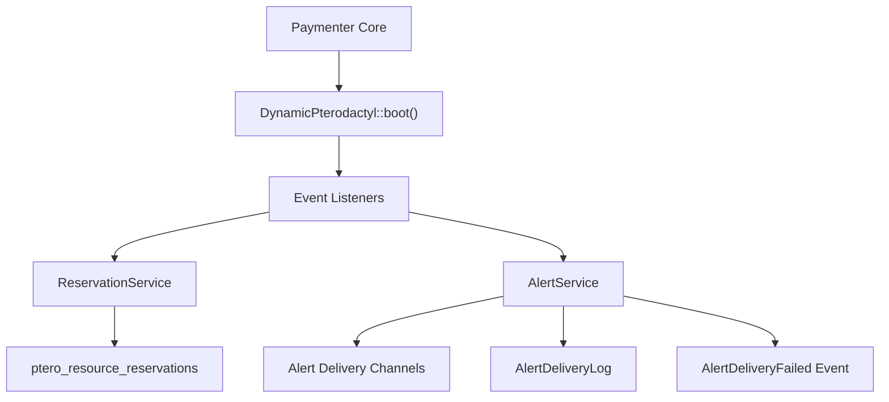
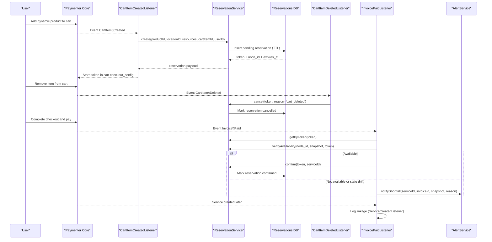
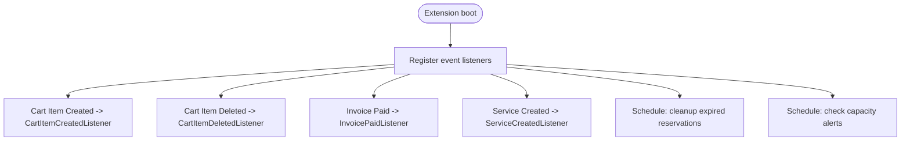
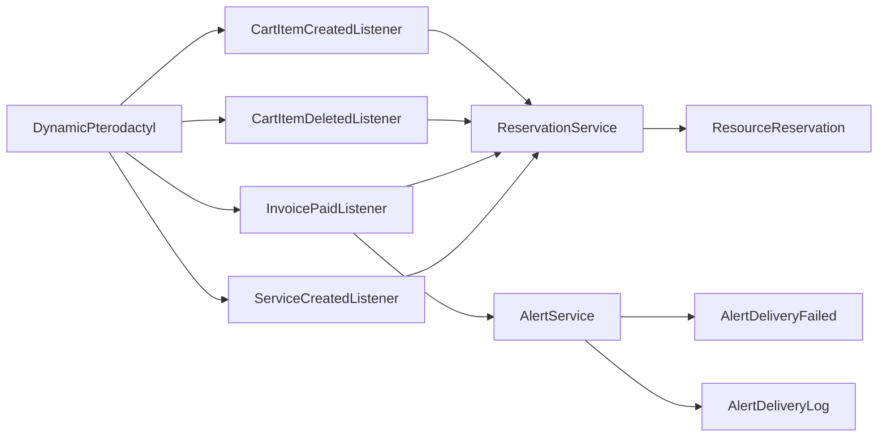

# Event System

> **Preserved Qoder snapshot.** This deep-dive page is retained so the earlier Wiki work and its source trail are not lost. For the reconciled implementation, [[Architecture Overview|Architecture-Overview]] is canonical; references below to retired controllers, listeners, services, or API shapes are historical.

## Current Event Contract

The extension registers `CartItemCreatedListener` for cart create/update events
and `CartItemDeletedListener` for removal. They adapt Paymenter's transactional
cart operations to `ReservationService`; capacity failure is allowed to bubble
so the cart mutation rolls back.

Paid service and service-upgrade transitions are owned by the matching Paymenter
companion lifecycle. The reconciled extension does not register
`InvoicePaidListener` or `ServiceCreatedListener`. Scheduled reservation
cleanup, reconciliation, capacity alerts, and scheduler-lag checks are
registered from `DynamicPterodactyl::boot()`.

[Current event guide](https://github.com/ObsidianNetwork/dynamic-pterodactyl/blob/cff5a8978d7972ec9513b32b2d7567593fb4f664/04-EVENTS.md)

<cite>
**Referenced Files in This Document**
- [DynamicPterodactyl.php](https://github.com/ObsidianNetwork/dynamic-pterodactyl/blob/6b7f83bda6f7c3fe014d52428b31af1638daa6cc/DynamicPterodactyl.php)
- [CartItemCreatedListener.php](https://github.com/ObsidianNetwork/dynamic-pterodactyl/blob/6b7f83bda6f7c3fe014d52428b31af1638daa6cc/Listeners/CartItemCreatedListener.php)
- [CartItemDeletedListener.php](https://github.com/ObsidianNetwork/dynamic-pterodactyl/blob/6b7f83bda6f7c3fe014d52428b31af1638daa6cc/Listeners/CartItemDeletedListener.php)
- [InvoicePaidListener.php](https://github.com/ObsidianNetwork/dynamic-pterodactyl/blob/6b7f83bda6f7c3fe014d52428b31af1638daa6cc/Listeners/InvoicePaidListener.php)
- [ServiceCreatedListener.php](https://github.com/ObsidianNetwork/dynamic-pterodactyl/blob/6b7f83bda6f7c3fe014d52428b31af1638daa6cc/Listeners/ServiceCreatedListener.php)
- [AlertDeliveryFailed.php](https://github.com/ObsidianNetwork/dynamic-pterodactyl/blob/6b7f83bda6f7c3fe014d52428b31af1638daa6cc/Events/AlertDeliveryFailed.php)
- [ReservationService.php](https://github.com/ObsidianNetwork/dynamic-pterodactyl/blob/6b7f83bda6f7c3fe014d52428b31af1638daa6cc/Services/ReservationService.php)
- [AlertService.php](https://github.com/ObsidianNetwork/dynamic-pterodactyl/blob/6b7f83bda6f7c3fe014d52428b31af1638daa6cc/Services/AlertService.php)
- [ResourceReservation.php](https://github.com/ObsidianNetwork/dynamic-pterodactyl/blob/6b7f83bda6f7c3fe014d52428b31af1638daa6cc/Models/ResourceReservation.php)
- [AlertDeliveryLog.php](https://github.com/ObsidianNetwork/dynamic-pterodactyl/blob/6b7f83bda6f7c3fe014d52428b31af1638daa6cc/Models/AlertDeliveryLog.php)
- [CartItemDeletedListenerTest.php](https://github.com/ObsidianNetwork/dynamic-pterodactyl/blob/6b7f83bda6f7c3fe014d52428b31af1638daa6cc/tests/Unit/CartItemDeletedListenerTest.php)
- [InvoicePaidListenerTest.php](https://github.com/ObsidianNetwork/dynamic-pterodactyl/blob/6b7f83bda6f7c3fe014d52428b31af1638daa6cc/tests/Unit/InvoicePaidListenerTest.php)
</cite>

## Table of Contents
1. [Introduction](#introduction)
2. [Project Structure](#project-structure)
3. [Core Components](#core-components)
4. [Architecture Overview](#architecture-overview)
5. [Detailed Component Analysis](#detailed-component-analysis)
6. [Dependency Analysis](#dependency-analysis)
7. [Performance Considerations](#performance-considerations)
8. [Troubleshooting Guide](#troubleshooting-guide)
9. [Conclusion](#conclusion)
10. [Appendices](#appendices)

## Introduction
This document explains the event-driven architecture that integrates with Paymenter’s lifecycle events to manage resource reservations and alerting for Pterodactyl products. It covers:
- How cart item creation triggers reservation creation
- How cart item deletion cancels reservations (with checkout-path safety)
- How invoice payment confirms reservations after a final availability check
- How service creation is logged for auditability
- The custom AlertDeliveryFailed event used when notification delivery fails
- Event listener registration, error handling patterns, debugging techniques, and how to extend the system with custom listeners

The extension lives as a nested Paymenter “Other” extension and relies on Paymenter core events to orchestrate the checkout flow. Reservations use pessimistic locking and idempotency keys to ensure consistency under concurrency.

## Project Structure
At a high level, the extension registers event listeners during boot and reacts to Paymenter events to coordinate reservations and alerts:
- DynamicPterodactyl::boot() wires up listeners and schedules
- Listeners react to CartItem\Created, CartItem\Deleted, Invoice\Paid, and Service\Created
- Services implement business logic for reservations and alerts
- Events model domain signals such as AlertDeliveryFailed
- Models persist reservations and delivery logs

**Diagram sources**
- [DynamicPterodactyl.php:96-145](https://github.com/ObsidianNetwork/dynamic-pterodactyl/blob/6b7f83bda6f7c3fe014d52428b31af1638daa6cc/DynamicPterodactyl.php#L96-L145)
- [AlertService.php:128-247](https://github.com/ObsidianNetwork/dynamic-pterodactyl/blob/6b7f83bda6f7c3fe014d52428b31af1638daa6cc/Services/AlertService.php#L128-L247)
- [ReservationService.php:43-141](https://github.com/ObsidianNetwork/dynamic-pterodactyl/blob/6b7f83bda6f7c3fe014d52428b31af1638daa6cc/Services/ReservationService.php#L43-L141)

**Section sources**
- [DynamicPterodactyl.php:96-145](https://github.com/ObsidianNetwork/dynamic-pterodactyl/blob/6b7f83bda6f7c3fe014d52428b31af1638daa6cc/DynamicPterodactyl.php#L96-L145)

## Core Components
- Event listeners:
  - CartItemCreatedListener: creates a reservation when a dynamic product is added to the cart
  - CartItemDeletedListener: cancels a reservation if the cart item is removed outside of checkout
  - InvoicePaidListener: confirms a reservation after payment with a final availability verification
  - ServiceCreatedListener: logs linkage between service and reservation
- Services:
  - ReservationService: manages reservation lifecycle (create, confirm, cancel, extend, cleanup)
  - AlertService: checks capacity thresholds, sends notifications, records delivery attempts, and dispatches AlertDeliveryFailed
- Events:
  - AlertDeliveryFailed: carries an AlertDeliveryLog instance to notify subscribers about delivery failures
- Models:
  - ResourceReservation: represents a reservation record
  - AlertDeliveryLog: records attempted delivery outcomes

**Section sources**
- [CartItemCreatedListener.php:13-87](https://github.com/ObsidianNetwork/dynamic-pterodactyl/blob/6b7f83bda6f7c3fe014d52428b31af1638daa6cc/Listeners/CartItemCreatedListener.php#L13-L87)
- [CartItemDeletedListener.php:12-57](https://github.com/ObsidianNetwork/dynamic-pterodactyl/blob/6b7f83bda6f7c3fe014d52428b31af1638daa6cc/Listeners/CartItemDeletedListener.php#L12-L57)
- [InvoicePaidListener.php:14-133](https://github.com/ObsidianNetwork/dynamic-pterodactyl/blob/6b7f83bda6f7c3fe014d52428b31af1638daa6cc/Listeners/InvoicePaidListener.php#L14-L133)
- [ServiceCreatedListener.php:10-31](https://github.com/ObsidianNetwork/dynamic-pterodactyl/blob/6b7f83bda6f7c3fe014d52428b31af1638daa6cc/Listeners/ServiceCreatedListener.php#L10-L31)
- [ReservationService.php:43-405](https://github.com/ObsidianNetwork/dynamic-pterodactyl/blob/6b7f83bda6f7c3fe014d52428b31af1638daa6cc/Services/ReservationService.php#L43-L405)
- [AlertService.php:33-247](https://github.com/ObsidianNetwork/dynamic-pterodactyl/blob/6b7f83bda6f7c3fe014d52428b31af1638daa6cc/Services/AlertService.php#L33-L247)
- [AlertDeliveryFailed.php:9-16](https://github.com/ObsidianNetwork/dynamic-pterodactyl/blob/6b7f83bda6f7c3fe014d52428b31af1638daa6cc/Events/AlertDeliveryFailed.php#L9-L16)
- [ResourceReservation.php:10-65](https://github.com/ObsidianNetwork/dynamic-pterodactyl/blob/6b7f83bda6f7c3fe014d52428b31af1638daa6cc/Models/ResourceReservation.php#L10-L65)
- [AlertDeliveryLog.php:8-33](https://github.com/ObsidianNetwork/dynamic-pterodactyl/blob/6b7f83bda6f7c3fe014d52428b31af1638daa6cc/Models/AlertDeliveryLog.php#L8-L33)

## Architecture Overview
The checkout process spans multiple Paymenter events and extension services:

**Diagram sources**
- [CartItemCreatedListener.php:13-87](https://github.com/ObsidianNetwork/dynamic-pterodactyl/blob/6b7f83bda6f7c3fe014d52428b31af1638daa6cc/Listeners/CartItemCreatedListener.php#L13-L87)
- [CartItemDeletedListener.php:12-57](https://github.com/ObsidianNetwork/dynamic-pterodactyl/blob/6b7f83bda6f7c3fe014d52428b31af1638daa6cc/Listeners/CartItemDeletedListener.php#L12-L57)
- [InvoicePaidListener.php:14-133](https://github.com/ObsidianNetwork/dynamic-pterodactyl/blob/6b7f83bda6f7c3fe014d52428b31af1638daa6cc/Listeners/InvoicePaidListener.php#L14-L133)
- [ReservationService.php:43-199](https://github.com/ObsidianNetwork/dynamic-pterodactyl/blob/6b7f83bda6f7c3fe014d52428b31af1638daa6cc/Services/ReservationService.php#L43-L199)
- [AlertService.php:328-361](https://github.com/ObsidianNetwork/dynamic-pterodactyl/blob/6b7f83bda6f7c3fe014d52428b31af1638daa6cc/Services/AlertService.php#L328-L361)

## Detailed Component Analysis

### Event Listener Registration
- All listeners are registered in the extension’s boot method via a dedicated helper that maps Paymenter events to extension listeners.
- Schedules are also registered here for periodic cleanup and alert checks.

**Diagram sources**
- [DynamicPterodactyl.php:96-145](https://github.com/ObsidianNetwork/dynamic-pterodactyl/blob/6b7f83bda6f7c3fe014d52428b31af1638daa6cc/DynamicPterodactyl.php#L96-L145)

**Section sources**
- [DynamicPterodactyl.php:96-145](https://github.com/ObsidianNetwork/dynamic-pterodactyl/blob/6b7f83bda6f7c3fe014d52428b31af1638daa6cc/DynamicPterodactyl.php#L96-L145)

### CartItemCreatedListener
Responsibilities:
- Detects whether the cart item belongs to a dynamic product by inspecting config options
- Extracts resource values (memory, cpu, disk) from dynamic slider options
- Determines location ID from checkout configuration or fallback fields
- Creates a reservation via ReservationService and stores the token and pricing metadata in the cart item’s checkout configuration
- Logs errors without blocking the cart operation

Error handling:
- Non-fatal exceptions are caught and logged; checkout continues even if reservation creation fails

**Section sources**
- [CartItemCreatedListener.php:13-87](https://github.com/ObsidianNetwork/dynamic-pterodactyl/blob/6b7f83bda6f7c3fe014d52428b31af1638daa6cc/Listeners/CartItemCreatedListener.php#L13-L87)
- [CartItemCreatedListener.php:93-172](https://github.com/ObsidianNetwork/dynamic-pterodactyl/blob/6b7f83bda6f7c3fe014d52428b31af1638daa6cc/Listeners/CartItemCreatedListener.php#L93-L172)

### CartItemDeletedListener
Responsibilities:
- Retrieves the reservation token stored in the cart item’s checkout configuration
- Avoids cancelling if the cart item was already consumed by checkout (service exists with the token), preventing race conditions with InvoicePaidListener
- Cancels the reservation when appropriate and logs the action
- Handles exceptions gracefully without rethrowing

Edge cases covered by tests:
- No token path
- Checkout path skip with debug logging
- Abandonment path cancellation
- Exception path logging without rethrow

**Section sources**
- [CartItemDeletedListener.php:12-57](https://github.com/ObsidianNetwork/dynamic-pterodactyl/blob/6b7f83bda6f7c3fe014d52428b31af1638daa6cc/Listeners/CartItemDeletedListener.php#L12-L57)
- [CartItemDeletedListenerTest.php:21-125](https://github.com/ObsidianNetwork/dynamic-pterodactyl/blob/6b7f83bda6f7c3fe014d52428b31af1638daa6cc/tests/Unit/CartItemDeletedListenerTest.php#L21-L125)

### InvoicePaidListener
Responsibilities:
- Iterates invoice items referencing services
- Retrieves the reservation token associated with the service
- Verifies current availability using ResourceCalculationService before confirming
- Confirms the reservation if available; otherwise notifies admins of shortfall
- Handles state drift where the reservation status changed between verification and confirmation
- Logs errors and shortfall notifications

Error handling:
- Shortfall notifications are wrapped in try/catch to avoid breaking invoice processing
- State drift scenarios trigger targeted notifications with reasons

**Section sources**
- [InvoicePaidListener.php:14-133](https://github.com/ObsidianNetwork/dynamic-pterodactyl/blob/6b7f83bda6f7c3fe014d52428b31af1638daa6cc/Listeners/InvoicePaidListener.php#L14-L133)
- [InvoicePaidListenerTest.php:25-101](https://github.com/ObsidianNetwork/dynamic-pterodactyl/blob/6b7f83bda6f7c3fe014d52428b31af1638daa6cc/tests/Unit/InvoicePaidListenerTest.php#L25-L101)

### ServiceCreatedListener
Responsibilities:
- Reads the reservation token from the service properties
- Logs linkage for tracking purposes
- Assumes confirmation has already occurred via InvoicePaidListener

**Section sources**
- [ServiceCreatedListener.php:10-31](https://github.com/ObsidianNetwork/dynamic-pterodactyl/blob/6b7f83bda6f7c3fe014d52428b31af1638daa6cc/Listeners/ServiceCreatedListener.php#L10-L31)

### AlertDeliveryFailed Event
Purpose:
- Signals that notification delivery failed across configured channels
- Carries an AlertDeliveryLog instance (persisted or transient) so subscribers can inspect details

Dispatch points:
- Dispatched when all attempted channels fail during capacity alert delivery

Usage:
- Subscribers can listen to this event to implement custom failure handling, retries, or escalation

**Section sources**
- [AlertDeliveryFailed.php:9-16](https://github.com/ObsidianNetwork/dynamic-pterodactyl/blob/6b7f83bda6f7c3fe014d52428b31af1638daa6cc/Events/AlertDeliveryFailed.php#L9-L16)
- [AlertService.php:218-236](https://github.com/ObsidianNetwork/dynamic-pterodactyl/blob/6b7f83bda6f7c3fe014d52428b31af1638daa6cc/Services/AlertService.php#L218-L236)

### ReservationService
Key behaviors:
- create(): Uses database transactions with pessimistic locking and idempotency keys to prevent duplicates; selects best node and inserts a pending reservation with TTL
- confirm(): Updates status to confirmed and links service_id; enforces authorization when actor is provided
- cancel(): Marks pending reservations as cancelled with reason notes
- extend(): Extends TTL for active reservations
- cleanupExpired(): Periodically marks overdue pending reservations as expired
- Statistics and query helpers for admin reporting

Concurrency and reliability:
- Retries on deadlocks
- Idempotency key support prevents duplicate reservations under concurrent requests
- Safe auditing for all mutations

**Section sources**
- [ReservationService.php:43-141](https://github.com/ObsidianNetwork/dynamic-pterodactyl/blob/6b7f83bda6f7c3fe014d52428b31af1638daa6cc/Services/ReservationService.php#L43-L141)
- [ReservationService.php:166-281](https://github.com/ObsidianNetwork/dynamic-pterodactyl/blob/6b7f83bda6f7c3fe014d52428b31af1638daa6cc/Services/ReservationService.php#L166-L281)
- [ReservationService.php:387-405](https://github.com/ObsidianNetwork/dynamic-pterodactyl/blob/6b7f83bda6f7c3fe014d52428b31af1638daa6cc/Services/ReservationService.php#L387-L405)
- [ResourceReservation.php:10-65](https://github.com/ObsidianNetwork/dynamic-pterodactyl/blob/6b7f83bda6f7c3fe014d52428b31af1638daa6cc/Models/ResourceReservation.php#L10-L65)

### AlertService
Key behaviors:
- checkCapacityAlerts(): Scans active alert configurations and evaluates thresholds per location
- sendNotifications(): Attempts email and webhook channels, records delivery results, and updates cooldown timestamps
- notifyShortfall(): Sends shortage notifications to administrators for reservation shortfalls or state drift
- safeWriteDeliveryLog(): Persists delivery logs, falling back to transient logs if persistence fails
- makeTransientDeliveryLog(): Builds an in-memory AlertDeliveryLog for event dispatch when persistence fails

Failure handling:
- Reports throwables through Laravel’s exception handler when possible
- Logs detailed context for each channel attempt and failure

**Section sources**
- [AlertService.php:33-75](https://github.com/ObsidianNetwork/dynamic-pterodactyl/blob/6b7f83bda6f7c3fe014d52428b31af1638daa6cc/Services/AlertService.php#L33-L75)
- [AlertService.php:128-247](https://github.com/ObsidianNetwork/dynamic-pterodactyl/blob/6b7f83bda6f7c3fe014d52428b31af1638daa6cc/Services/AlertService.php#L128-L247)
- [AlertService.php:250-299](https://github.com/ObsidianNetwork/dynamic-pterodactyl/blob/6b7f83bda6f7c3fe014d52428b31af1638daa6cc/Services/AlertService.php#L250-L299)
- [AlertService.php:328-361](https://github.com/ObsidianNetwork/dynamic-pterodactyl/blob/6b7f83bda6f7c3fe014d52428b31af1638daa6cc/Services/AlertService.php#L328-L361)
- [AlertDeliveryLog.php:8-33](https://github.com/ObsidianNetwork/dynamic-pterodactyl/blob/6b7f83bda6f7c3fe014d52428b31af1638daa6cc/Models/AlertDeliveryLog.php#L8-L33)

## Dependency Analysis
High-level dependencies among components:

**Diagram sources**
- [DynamicPterodactyl.php:96-145](https://github.com/ObsidianNetwork/dynamic-pterodactyl/blob/6b7f83bda6f7c3fe014d52428b31af1638daa6cc/DynamicPterodactyl.php#L96-L145)
- [AlertService.php:128-247](https://github.com/ObsidianNetwork/dynamic-pterodactyl/blob/6b7f83bda6f7c3fe014d52428b31af1638daa6cc/Services/AlertService.php#L128-L247)
- [ReservationService.php:43-141](https://github.com/ObsidianNetwork/dynamic-pterodactyl/blob/6b7f83bda6f7c3fe014d52428b31af1638daa6cc/Services/ReservationService.php#L43-L141)

**Section sources**
- [DynamicPterodactyl.php:96-145](https://github.com/ObsidianNetwork/dynamic-pterodactyl/blob/6b7f83bda6f7c3fe014d52428b31af1638daa6cc/DynamicPterodactyl.php#L96-L145)
- [AlertService.php:128-247](https://github.com/ObsidianNetwork/dynamic-pterodactyl/blob/6b7f83bda6f7c3fe014d52428b31af1638daa6cc/Services/AlertService.php#L128-L247)
- [ReservationService.php:43-141](https://github.com/ObsidianNetwork/dynamic-pterodactyl/blob/6b7f83bda6f7c3fe014d52428b31af1638daa6cc/Services/ReservationService.php#L43-L141)

## Performance Considerations
- Database locking: Reservation creation uses pessimistic locks to avoid races and deadlocks; retry logic improves resilience under contention.
- Real-time availability: Availability checks are performed at critical points (confirmation) rather than cached, ensuring accuracy at the cost of API calls.
- Batched API calls: Node selection batches Pterodactyl API calls to reduce overhead.
- Scheduled tasks: Cleanup and alert checks run periodically with overlap protection to minimize load.

[No sources needed since this section provides general guidance]

## Troubleshooting Guide
Common issues and diagnostics:
- Reservation not created on cart add:
  - Verify product has dynamic_slider config options and a valid location
  - Check logs for “Failed to create resource reservation”
  - Ensure cart item contains required resource selections
- Reservation not cancelled on cart delete:
  - If the item was part of a successful checkout, cancellation is intentionally skipped to avoid race conditions
  - Look for debug logs indicating checkout consumption
- Reservation not confirmed after payment:
  - Final availability verification may fail due to external changes; shortfall notifications will be sent
  - State drift (e.g., expired reservation) triggers targeted notifications
- Notification delivery failures:
  - Inspect AlertDeliveryLog entries for channels tried, success, and last error
  - Use the AlertDeliveryFailed event to subscribe to custom failure handling

Debugging tips:
- Enable detailed logging around event handlers to trace flows
- Review scheduled task logs for cleanup and alert checks
- For unit testing, mock services and assert log messages and service interactions

**Section sources**
- [CartItemCreatedListener.php:79-86](https://github.com/ObsidianNetwork/dynamic-pterodactyl/blob/6b7f83bda6f7c3fe014d52428b31af1638daa6cc/Listeners/CartItemCreatedListener.php#L79-L86)
- [CartItemDeletedListener.php:24-40](https://github.com/ObsidianNetwork/dynamic-pterodactyl/blob/6b7f83bda6f7c3fe014d52428b31af1638daa6cc/Listeners/CartItemDeletedListener.php#L24-L40)
- [InvoicePaidListener.php:58-125](https://github.com/ObsidianNetwork/dynamic-pterodactyl/blob/6b7f83bda6f7c3fe014d52428b31af1638daa6cc/Listeners/InvoicePaidListener.php#L58-L125)
- [AlertService.php:218-247](https://github.com/ObsidianNetwork/dynamic-pterodactyl/blob/6b7f83bda6f7c3fe014d52428b31af1638daa6cc/Services/AlertService.php#L218-L247)
- [CartItemDeletedListenerTest.php:21-125](https://github.com/ObsidianNetwork/dynamic-pterodactyl/blob/6b7f83bda6f7c3fe014d52428b31af1638daa6cc/tests/Unit/CartItemDeletedListenerTest.php#L21-L125)
- [InvoicePaidListenerTest.php:25-101](https://github.com/ObsidianNetwork/dynamic-pterodactyl/blob/6b7f83bda6f7c3fe014d52428b31af1638daa6cc/tests/Unit/InvoicePaidListenerTest.php#L25-L101)

## Conclusion
The extension leverages Paymenter’s event system to provide a robust reservation workflow tied to cart and checkout lifecycle events. It ensures resource availability through real-time checks, safeguards against race conditions with pessimistic locking and idempotency, and provides comprehensive alerting and observability. The AlertDeliveryFailed event enables extensibility for custom failure handling. Together, these mechanisms deliver a reliable and auditable reservation system integrated seamlessly into Paymenter.

[No sources needed since this section summarizes without analyzing specific files]

## Appendices

### Extending the Event System
To add custom behavior:
- Create a new listener class implementing handle(Event $event): void
- Register it in DynamicPterodactyl::registerEventListeners() using Event::listen(...)
- For custom failure handling, listen to AlertDeliveryFailed and implement your own retry or escalation logic

Example steps:
- Define a listener for a new event or existing event
- Wire it up in the extension’s boot method
- Add tests to validate behavior and error paths

**Section sources**
- [DynamicPterodactyl.php:132-145](https://github.com/ObsidianNetwork/dynamic-pterodactyl/blob/6b7f83bda6f7c3fe014d52428b31af1638daa6cc/DynamicPterodactyl.php#L132-L145)
- [AlertDeliveryFailed.php:9-16](https://github.com/ObsidianNetwork/dynamic-pterodactyl/blob/6b7f83bda6f7c3fe014d52428b31af1638daa6cc/Events/AlertDeliveryFailed.php#L9-L16)
