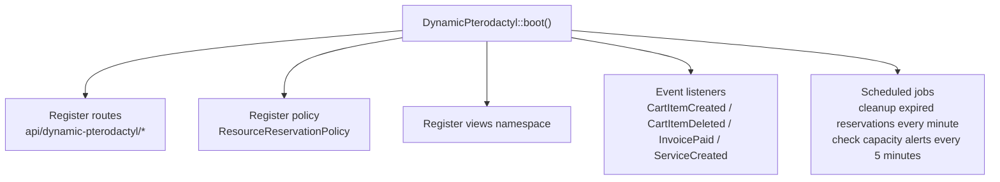
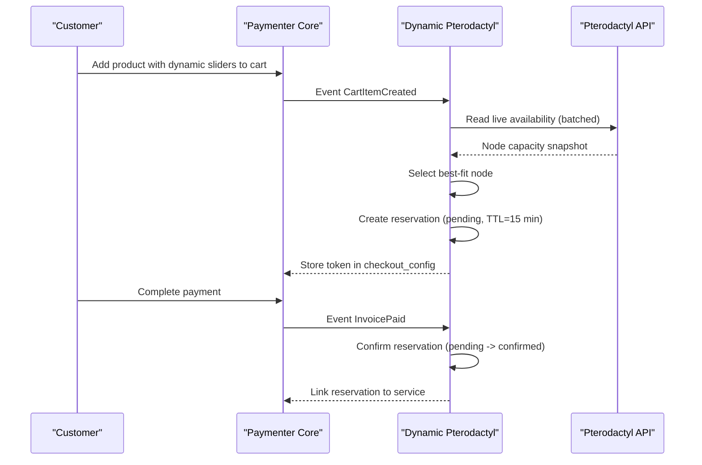
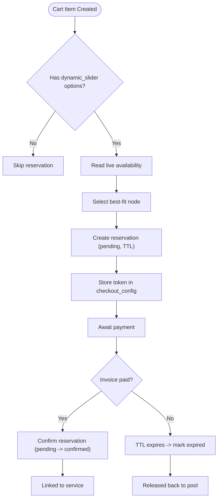
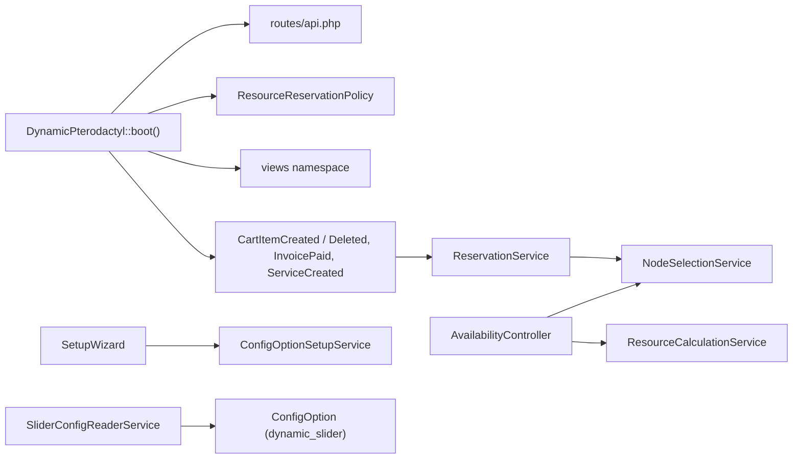

# Getting Started

<cite>
**Referenced Files in This Document**
- [DynamicPterodactyl.php](file://DynamicPterodactyl.php)
- [routes/api.php](file://routes/api.php)
- [Admin/Pages/SetupWizard.php](file://Admin/Pages/SetupWizard.php)
- [Services/ConfigOptionSetupService.php](file://Services/ConfigOptionSetupService.php)
- [Services/SliderConfigReaderService.php](file://Services/SliderConfigReaderService.php)
- [Listeners/CartItemCreatedListener.php](file://Listeners/CartItemCreatedListener.php)
- [Http/Controllers/Api/AvailabilityController.php](file://Http/Controllers/Api/AvailabilityController.php)
- [Services/ReservationService.php](file://Services/ReservationService.php)
- [Models/ResourceReservation.php](file://Models/ResourceReservation.php)
- [AGENTS.md](file://AGENTS.md)
- [DECISIONS.md](file://DECISIONS.md)
</cite>

## Table of Contents
1. [Introduction](#introduction)
2. [Project Structure](#project-structure)
3. [Core Components](#core-components)
4. [Architecture Overview](#architecture-overview)
5. [Detailed Component Analysis](#detailed-component-analysis)
6. [Dependency Analysis](#dependency-analysis)
7. [Performance Considerations](#performance-considerations)
8. [Troubleshooting Guide](#troubleshooting-guide)
9. [Conclusion](#conclusion)
10. [Appendices](#appendices)

## Introduction
This extension is a companion to Paymenter’s built-in Pterodactyl server extension. It adds dynamic resource sliders (RAM, CPU, Disk) to your Pterodactyl products and provides real-time availability checks with short-lived reservations during checkout. The reservation TTL is configurable but defaults to 15 minutes. Pricing for the sliders is handled by Paymenter core; this extension focuses on reading slider configuration metadata, checking live availability against Pterodactyl, and managing reservations.

Key behaviors:
- Real-time availability queries to Pterodactyl (no caching).
- Short-lived reservations to prevent overselling during checkout.
- Admin setup wizard to create dynamic slider options per product.
- Customer-facing endpoints return only aggregate capacity per location; node-level details are admin-only.

**Section sources**
- [DynamicPterodactyl.php:25-75](file://DynamicPterodactyl.php#L25-L75)
- [AGENTS.md:7-11](file://AGENTS.md#L7-L11)
- [DECISIONS.md:28-45](file://DECISIONS.md#L28-L45)

## Project Structure
The extension lives under Paymenter as an “Other” extension and integrates via its boot process. It registers routes, policies, listeners, and scheduled tasks that tie into Paymenter’s cart and invoice lifecycle.

**Diagram sources**
- [DynamicPterodactyl.php:96-127](file://DynamicPterodactyl.php#L96-L127)
- [routes/api.php:17-40](file://routes/api.php#L17-L40)

**Section sources**
- [DynamicPterodactyl.php:96-127](file://DynamicPterodactyl.php#L96-L127)
- [routes/api.php:17-40](file://routes/api.php#L17-L40)

## Core Components
- Extension entrypoint: loads routes, policies, observers, event listeners, and schedules.
- Setup Wizard: creates dynamic_slider ConfigOptions for memory, CPU, disk, plus optional location selector.
- Slider config reader: exposes slider limits and pricing metadata to frontend/API.
- Availability API: returns per-location maximum allocatable resources based on live Pterodactyl data.
- Reservation service: manages creation, confirmation, cancellation, extension, and cleanup of reservations with pessimistic locking and idempotency.
- Listeners: bridge Paymenter events (cart/invoice/service) into reservation actions.

**Section sources**
- [DynamicPterodactyl.php:45-127](file://DynamicPterodactyl.php#L45-L127)
- [Admin/Pages/SetupWizard.php:26-75](file://Admin/Pages/SetupWizard.php#L26-L75)
- [Services/ConfigOptionSetupService.php:44-77](file://Services/ConfigOptionSetupService.php#L44-L77)
- [Services/SliderConfigReaderService.php:14-53](file://Services/SliderConfigReaderService.php#L14-L53)
- [Http/Controllers/Api/AvailabilityController.php:22-52](file://Http/Controllers/Api/AvailabilityController.php#L22-L52)
- [Services/ReservationService.php:43-141](file://Services/ReservationService.php#L43-L141)
- [Listeners/CartItemCreatedListener.php:13-87](file://Listeners/CartItemCreatedListener.php#L13-L87)

## Architecture Overview
This extension complements the built-in Pterodactyl server extension. It does not provision servers itself; it ensures resources are available and reserved while customers complete checkout.

**Diagram sources**
- [Listeners/CartItemCreatedListener.php:13-87](file://Listeners/CartItemCreatedListener.php#L13-L87)
- [Services/ReservationService.php:43-141](file://Services/ReservationService.php#L43-L141)
- [DynamicPterodactyl.php:106-145](file://DynamicPterodactyl.php#L106-L145)

## Detailed Component Analysis

### Installation and Configuration
- Install the extension within Paymenter as an “Other” extension. On install, migrations run automatically to create reservation and related tables.
- Configure extension settings:
  - Pterodactyl Panel URL
  - Pterodactyl Application API Key
  - Reservation TTL (minutes), default 15

These settings are exposed through the extension’s configuration UI and used by services to connect to Pterodactyl and manage reservation lifetimes.

**Section sources**
- [DynamicPterodactyl.php:48-75](file://DynamicPterodactyl.php#L48-L75)
- [DynamicPterodactyl.php:78-91](file://DynamicPterodactyl.php#L78-L91)

### Initial Setup: Creating Dynamic Sliders
Use the Filament-based Setup Wizard to add RAM, CPU, and Disk sliders to a product:
- Choose pricing model (linear, tiered, base_addon) and rates.
- Enable/disable each slider and set min/max/step/default values.
- Optionally add a Location selector to choose where the server will be provisioned.

The wizard writes native dynamic_slider ConfigOptions to Paymenter core. These options drive both the frontend sliders and pricing calculations.

**Section sources**
- [Admin/Pages/SetupWizard.php:26-75](file://Admin/Pages/SetupWizard.php#L26-L75)
- [Services/ConfigOptionSetupService.php:44-77](file://Services/ConfigOptionSetupService.php#L44-L77)
- [Services/ConfigOptionSetupService.php:117-171](file://Services/ConfigOptionSetupService.php#L117-L171)

### Quick Start: Verify the Extension Is Working
- Ensure Pterodactyl credentials are configured in the extension settings.
- Run the Setup Wizard for a product to enable sliders.
- Visit the product page and confirm sliders appear with correct ranges.
- Check availability endpoint for a location to see max allocatable resources.
- Add the product to cart; a pending reservation should be created and stored in checkout_config.
- Complete payment; the reservation should transition to confirmed and link to the new service.

Relevant endpoints:
- GET /api/dynamic-pterodactyl/availability/{locationId}
- POST /api/dynamic-pterodactyl/reservation
- GET /api/dynamic-pterodactyl/pricing/config/{productId}

**Section sources**
- [routes/api.php:17-40](file://routes/api.php#L17-L40)
- [Http/Controllers/Api/AvailabilityController.php:22-52](file://Http/Controllers/Api/AvailabilityController.php#L22-L52)
- [Listeners/CartItemCreatedListener.php:47-87](file://Listeners/CartItemCreatedListener.php#L47-L87)

### How Reservations Work
- Creation: When a cart item with dynamic sliders is added, the extension reads slider values, selects a best-fit node from live availability, and creates a pending reservation with a TTL.
- Confirmation: After successful payment, the reservation is confirmed and linked to the service.
- Expiration: Pending reservations past their TTL are marked expired by a scheduled job running every minute.
- Cancellation: Reservations can be cancelled (e.g., cart removal or admin action).

**Diagram sources**
- [Listeners/CartItemCreatedListener.php:13-87](file://Listeners/CartItemCreatedListener.php#L13-L87)
- [Services/ReservationService.php:43-141](file://Services/ReservationService.php#L43-L141)
- [Services/ReservationService.php:384-405](file://Services/ReservationService.php#L384-L405)

**Section sources**
- [Services/ReservationService.php:43-141](file://Services/ReservationService.php#L43-L141)
- [Services/ReservationService.php:384-405](file://Services/ReservationService.php#L384-L405)
- [Models/ResourceReservation.php:10-66](file://Models/ResourceReservation.php#L10-L66)

### Relationship to Paymenter’s Built-in Pterodactyl Server Extension
- This extension is a companion enhancement. It handles dynamic sliders, availability, and reservations.
- The built-in Pterodactyl server extension remains responsible for actual server provisioning.
- If this extension fails, the product still works without sliders (graceful degradation).

**Section sources**
- [DynamicPterodactyl.php:33-40](file://DynamicPterodactyl.php#L33-L40)
- [DECISIONS.md:9-25](file://DECISIONS.md#L9-L25)

## Dependency Analysis

**Diagram sources**
- [DynamicPterodactyl.php:96-145](file://DynamicPterodactyl.php#L96-L145)
- [routes/api.php:17-40](file://routes/api.php#L17-L40)
- [Http/Controllers/Api/AvailabilityController.php:11-20](file://Http/Controllers/Api/AvailabilityController.php#L11-L20)
- [Admin/Pages/SetupWizard.php:26-75](file://Admin/Pages/SetupWizard.php#L26-L75)
- [Services/ConfigOptionSetupService.php:44-77](file://Services/ConfigOptionSetupService.php#L44-L77)
- [Services/SliderConfigReaderService.php:14-53](file://Services/SliderConfigReaderService.php#L14-L53)

**Section sources**
- [DynamicPterodactyl.php:96-145](file://DynamicPterodactyl.php#L96-L145)
- [routes/api.php:17-40](file://routes/api.php#L17-L40)

## Performance Considerations
- Real-time availability: Pterodactyl API responses are never cached; availability is always fresh. Batch calls are used to reduce overhead.
- Rate limiting: Customer endpoints are throttled to protect the Pterodactyl API budget.
- Reservation locking: Uses pessimistic DB locks with deadlock retries to ensure correctness under concurrency.
- Scheduled cleanup: Runs every minute to expire old reservations promptly.

[No sources needed since this section provides general guidance]

## Troubleshooting Guide
Common setup issues and resolutions:
- Missing Pterodactyl credentials: Ensure panel URL and API key are set in extension settings. Without them, availability checks and reservations cannot succeed.
- No sliders appearing: Use the Setup Wizard to create dynamic_slider options for the product. Verify the product has at least one slider enabled.
- Availability shows zero capacity: Confirm Pterodactyl nodes have headroom for the requested resources. Check the availability endpoint for the selected location.
- Reservation not created on cart add: Ensure the product has dynamic_slider options and a location is selected. Errors are logged but do not block cart operations.
- Reservation expired before payment: Increase the reservation TTL if checkout takes longer than the default 15 minutes.
- Admin cannot see node details: Node-level capacity is admin-only; customer endpoints return only aggregate maxima.

Where to look:
- Extension settings: Pterodactyl URL, API key, reservation TTL.
- Setup Wizard: Create/update slider options per product.
- Availability endpoint: Validate per-location capacity.
- Reservation service: Inspect state transitions and TTL behavior.
- Logs: Listener errors when creating reservations.

**Section sources**
- [DynamicPterodactyl.php:48-75](file://DynamicPterodactyl.php#L48-L75)
- [Admin/Pages/SetupWizard.php:26-75](file://Admin/Pages/SetupWizard.php#L26-L75)
- [Http/Controllers/Api/AvailabilityController.php:22-52](file://Http/Controllers/Api/AvailabilityController.php#L22-L52)
- [Listeners/CartItemCreatedListener.php:79-87](file://Listeners/CartItemCreatedListener.php#L79-L87)
- [Services/ReservationService.php:384-405](file://Services/ReservationService.php#L384-L405)

## Conclusion
The Dynamic Pterodactyl extension enhances your Pterodactyl products with dynamic RAM/CPU/Disk sliders, real-time availability checks, and short-lived reservations to prevent overselling during checkout. It integrates seamlessly with Paymenter’s built-in Pterodactyl server extension, leaving provisioning to the core while focusing on availability and reservation management. Use the Setup Wizard to configure sliders, verify availability via the API, and rely on automatic reservation lifecycle handling during the cart-to-payment flow.

[No sources needed since this section summarizes without analyzing specific files]

## Appendices

### API Surface Summary
- Availability and pricing (throttled):
  - GET /api/dynamic-pterodactyl/availability/{locationId}
  - POST /api/dynamic-pterodactyl/pricing/calculate
  - GET /api/dynamic-pterodactyl/pricing/config/{productId}
- Reservations (checkout flow, throttled):
  - POST /api/dynamic-pterodactyl/reservation
  - GET /api/dynamic-pterodactyl/reservation/{token}
  - DELETE /api/dynamic-pterodactyl/reservation/{token}
  - POST /api/dynamic-pterodactyl/reservation/{token}/extend
- Admin (session-authenticated, throttled):
  - GET /api/dynamic-pterodactyl/admin/reservations
  - POST /api/dynamic-pterodactyl/admin/reservations/{token}/cancel
  - GET /api/dynamic-pterodactyl/admin/capacity
  - GET /api/dynamic-pterodactyl/admin/availability/{locationId}/nodes

**Section sources**
- [routes/api.php:17-40](file://routes/api.php#L17-L40)