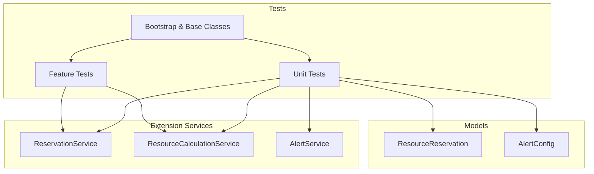
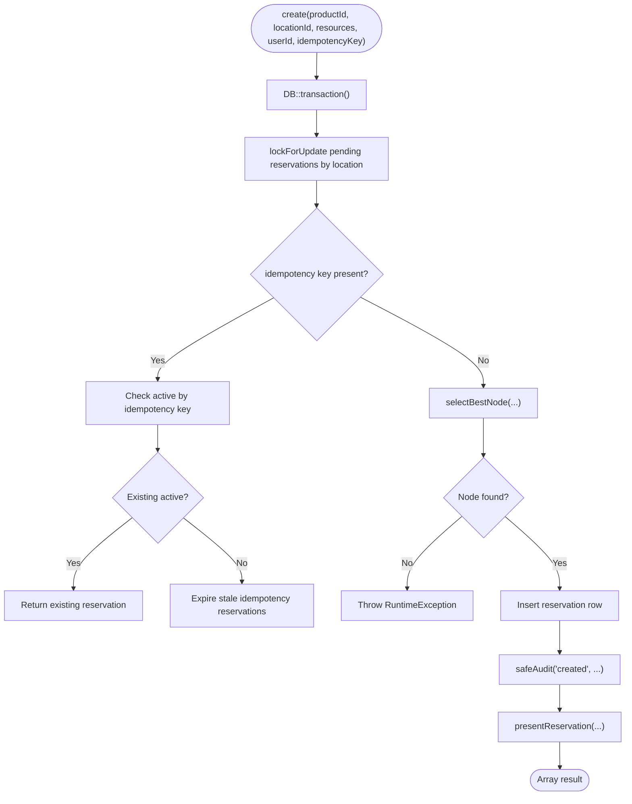
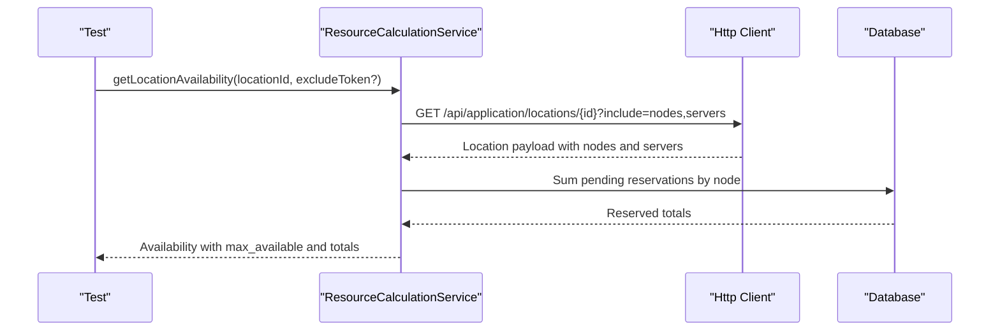
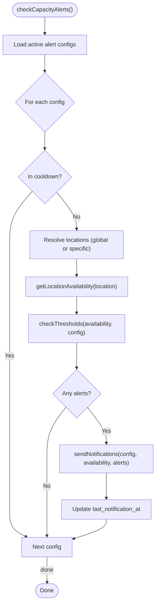
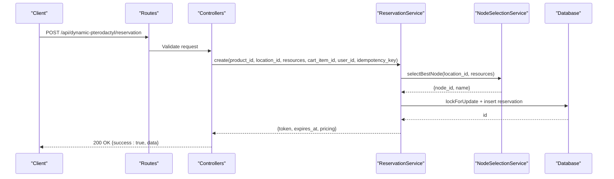
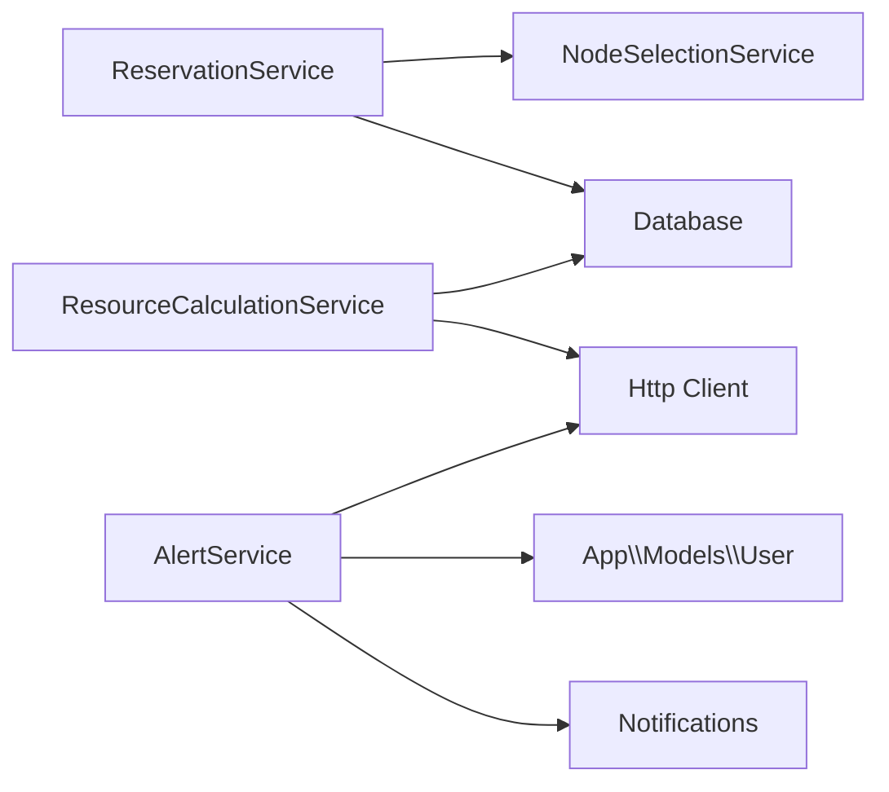

# Testing

> **Preserved Qoder snapshot.** This deep-dive page is retained so the earlier Wiki work and its source trail are not lost. For the reconciled implementation, [[Architecture Overview|Architecture-Overview]] is canonical; references below to retired controllers, listeners, services, or API shapes are historical.

## Current Test Contract

The cross-repository workflow checks PHP 8.3 and 8.4 against SQLite and MariaDB
11/12, lints every changed PHP file, runs the full extension suite, exercises the
Paymenter provisioning seam, checks formatting, and audits the pinned companion
lock file for security advisories.

Standalone SQLite tests must use `DB_DATABASE=:temporary:`. The guard claims a
process-private named-memory database and rejects inherited generated URIs in
child processes. MySQL/MariaDB tests may use only the explicitly named
`paymenter_test` database while `APP_ENV=testing`.

[Test bootstrap](https://github.com/ObsidianNetwork/dynamic-pterodactyl/blob/f7f0a8c0816ff28c386277798cce9f4aa92e1b36/tests/bootstrap.php) and
[database guard](https://github.com/ObsidianNetwork/dynamic-pterodactyl/blob/f7f0a8c0816ff28c386277798cce9f4aa92e1b36/tests/TestDatabaseGuard.php)


<cite>
**Referenced Files in This Document**
- [phpunit.xml](https://github.com/ObsidianNetwork/dynamic-pterodactyl/blob/6b7f83bda6f7c3fe014d52428b31af1638daa6cc/phpunit.xml)
- [tests/bootstrap.php](https://github.com/ObsidianNetwork/dynamic-pterodactyl/blob/f7f0a8c0816ff28c386277798cce9f4aa92e1b36/tests/bootstrap.php)
- [tests/TestCase.php](https://github.com/ObsidianNetwork/dynamic-pterodactyl/blob/6b7f83bda6f7c3fe014d52428b31af1638daa6cc/tests/TestCase.php)
- [tests/LaravelTestCase.php](https://github.com/ObsidianNetwork/dynamic-pterodactyl/blob/6b7f83bda6f7c3fe014d52428b31af1638daa6cc/tests/LaravelTestCase.php)
- [Services/ReservationService.php](https://github.com/ObsidianNetwork/dynamic-pterodactyl/blob/6b7f83bda6f7c3fe014d52428b31af1638daa6cc/Services/ReservationService.php)
- [Services/ResourceCalculationService.php](https://github.com/ObsidianNetwork/dynamic-pterodactyl/blob/6b7f83bda6f7c3fe014d52428b31af1638daa6cc/Services/ResourceCalculationService.php)
- [Services/AlertService.php](https://github.com/ObsidianNetwork/dynamic-pterodactyl/blob/6b7f83bda6f7c3fe014d52428b31af1638daa6cc/Services/AlertService.php)
- [Models/ResourceReservation.php](https://github.com/ObsidianNetwork/dynamic-pterodactyl/blob/6b7f83bda6f7c3fe014d52428b31af1638daa6cc/Models/ResourceReservation.php)
- [Models/AlertConfig.php](https://github.com/ObsidianNetwork/dynamic-pterodactyl/blob/6b7f83bda6f7c3fe014d52428b31af1638daa6cc/Models/AlertConfig.php)
- [tests/Unit/ReservationServiceTest.php](https://github.com/ObsidianNetwork/dynamic-pterodactyl/blob/6b7f83bda6f7c3fe014d52428b31af1638daa6cc/tests/Unit/ReservationServiceTest.php)
- [tests/Unit/ResourceCalculationServiceTest.php](https://github.com/ObsidianNetwork/dynamic-pterodactyl/blob/6b7f83bda6f7c3fe014d52428b31af1638daa6cc/tests/Unit/ResourceCalculationServiceTest.php)
- [tests/Unit/AlertServiceTest.php](https://github.com/ObsidianNetwork/dynamic-pterodactyl/blob/6b7f83bda6f7c3fe014d52428b31af1638daa6cc/tests/Unit/AlertServiceTest.php)
- [tests/Feature/ReservationApiTest.php](https://github.com/ObsidianNetwork/dynamic-pterodactyl/blob/6b7f83bda6f7c3fe014d52428b31af1638daa6cc/tests/Feature/ReservationApiTest.php)
- [tests/Feature/AvailabilityApiTest.php](https://github.com/ObsidianNetwork/dynamic-pterodactyl/blob/6b7f83bda6f7c3fe014d52428b31af1638daa6cc/tests/Feature/AvailabilityApiTest.php)
</cite>

## Table of Contents
1. Introduction
2. Project Structure
3. Core Components
4. Architecture Overview
5. Detailed Component Analysis
6. Dependency Analysis
7. Performance Considerations
8. Troubleshooting Guide
9. Conclusion
10. Appendices

## Introduction
This document explains how to test the Dynamic Pterodactyl extension end-to-end. It covers isolation strategies, unit and feature tests, mocking external dependencies (notably the Pterodactyl API), database setup, fixtures, assertion patterns, and examples for reservation workflows, availability calculations, and alert systems. It also includes debugging techniques and performance profiling guidance tailored to this codebase.

## Project Structure
The test suite is organized into:
- Unit tests under tests/Unit for service-layer logic and model behavior.
- Feature tests under tests/Feature for API endpoints and integration scenarios.
- Shared base classes and bootstrap configuration for isolation and environment control.



**Diagram sources**
- [phpunit.xml:1-43](https://github.com/ObsidianNetwork/dynamic-pterodactyl/blob/6b7f83bda6f7c3fe014d52428b31af1638daa6cc/phpunit.xml#L1-L43)
- [tests/bootstrap.php:1-21](https://github.com/ObsidianNetwork/dynamic-pterodactyl/blob/f7f0a8c0816ff28c386277798cce9f4aa92e1b36/tests/bootstrap.php#L1-L21)
- [tests/TestCase.php:1-63](https://github.com/ObsidianNetwork/dynamic-pterodactyl/blob/6b7f83bda6f7c3fe014d52428b31af1638daa6cc/tests/TestCase.php#L1-L63)
- [tests/LaravelTestCase.php:1-183](https://github.com/ObsidianNetwork/dynamic-pterodactyl/blob/6b7f83bda6f7c3fe014d52428b31af1638daa6cc/tests/LaravelTestCase.php#L1-L183)
- [Services/ReservationService.php:1-453](https://github.com/ObsidianNetwork/dynamic-pterodactyl/blob/6b7f83bda6f7c3fe014d52428b31af1638daa6cc/Services/ReservationService.php#L1-L453)
- [Services/ResourceCalculationService.php:1-545](https://github.com/ObsidianNetwork/dynamic-pterodactyl/blob/6b7f83bda6f7c3fe014d52428b31af1638daa6cc/Services/ResourceCalculationService.php#L1-L545)
- [Services/AlertService.php:1-392](https://github.com/ObsidianNetwork/dynamic-pterodactyl/blob/6b7f83bda6f7c3fe014d52428b31af1638daa6cc/Services/AlertService.php#L1-L392)
- [Models/ResourceReservation.php:1-65](https://github.com/ObsidianNetwork/dynamic-pterodactyl/blob/6b7f83bda6f7c3fe014d52428b31af1638daa6cc/Models/ResourceReservation.php#L1-L65)
- [Models/AlertConfig.php:1-56](https://github.com/ObsidianNetwork/dynamic-pterodactyl/blob/6b7f83bda6f7c3fe014d52428b31af1638daa6cc/Models/AlertConfig.php#L1-L56)

**Section sources**
- [phpunit.xml:1-43](https://github.com/ObsidianNetwork/dynamic-pterodactyl/blob/6b7f83bda6f7c3fe014d52428b31af1638daa6cc/phpunit.xml#L1-L43)
- [tests/bootstrap.php:1-21](https://github.com/ObsidianNetwork/dynamic-pterodactyl/blob/f7f0a8c0816ff28c386277798cce9f4aa92e1b36/tests/bootstrap.php#L1-L21)
- [tests/TestCase.php:1-63](https://github.com/ObsidianNetwork/dynamic-pterodactyl/blob/6b7f83bda6f7c3fe014d52428b31af1638daa6cc/tests/TestCase.php#L1-L63)
- [tests/LaravelTestCase.php:1-183](https://github.com/ObsidianNetwork/dynamic-pterodactyl/blob/6b7f83bda6f7c3fe014d52428b31af1638daa6cc/tests/LaravelTestCase.php#L1-L183)

## Core Components
Key components under test:
- ReservationService: manages reservation lifecycle with DB transactions, pessimistic locking, idempotency, and audit logging.
- ResourceCalculationService: fetches real-time availability from Pterodactyl, builds cluster snapshots, and verifies node-level capacity.
- AlertService: evaluates thresholds, sends email/webhook notifications, records delivery logs, and emits failure events.
- Models: ResourceReservation and AlertConfig define data contracts and scopes used by services.

**Section sources**
- [Services/ReservationService.php:1-453](https://github.com/ObsidianNetwork/dynamic-pterodactyl/blob/6b7f83bda6f7c3fe014d52428b31af1638daa6cc/Services/ReservationService.php#L1-L453)
- [Services/ResourceCalculationService.php:1-545](https://github.com/ObsidianNetwork/dynamic-pterodactyl/blob/6b7f83bda6f7c3fe014d52428b31af1638daa6cc/Services/ResourceCalculationService.php#L1-L545)
- [Services/AlertService.php:1-392](https://github.com/ObsidianNetwork/dynamic-pterodactyl/blob/6b7f83bda6f7c3fe014d52428b31af1638daa6cc/Services/AlertService.php#L1-L392)
- [Models/ResourceReservation.php:1-65](https://github.com/ObsidianNetwork/dynamic-pterodactyl/blob/6b7f83bda6f7c3fe014d52428b31af1638daa6cc/Models/ResourceReservation.php#L1-L65)
- [Models/AlertConfig.php:1-56](https://github.com/ObsidianNetwork/dynamic-pterodactyl/blob/6b7f83bda6f7c3fe014d52428b31af1638daa6cc/Models/AlertConfig.php#L1-L56)

## Architecture Overview
The testing architecture isolates external dependencies and enforces deterministic environments:
- phpunit.xml forces array cache/session/queue and sync queue.
- tests/bootstrap.php requires `APP_ENV=testing` and accepts only `paymenter_test`, `:memory:`, or the `:temporary:` sentinel. The sentinel generates an unpredictable process-private named in-memory SQLite database and retains an anchor connection before Paymenter boots; caller-supplied SQLite paths and URI names are rejected.
- Feature tests load routes and use DatabaseTransactions to keep state isolated per test.
- Unit tests mock or fake HTTP and DB interactions to avoid real calls.

```mermaid
sequenceDiagram
    participant T as "PHPUnit"
    participant B as "bootstrap.php"
    participant L as "LaravelTestCase"
    participant S as "Service Under Test"
    participant E as "External System"

    T->>B: "Load bootstrap"
    B-->>T: "Guard DB name; require base classes"
    T->>L: "createApplication()"
    L-->>T: "Boot app kernel"
    T->>S: "Execute test method"
    S->>E: "Call Pterodactyl / DB / Mail"
    Note over S,E: "Use Http::fake(), Mockery, DB facades"
    S-->>T: "Assertions on results/state"
```

**Diagram sources**
- [phpunit.xml:28-41](https://github.com/ObsidianNetwork/dynamic-pterodactyl/blob/6b7f83bda6f7c3fe014d52428b31af1638daa6cc/phpunit.xml#L28-L41)
- [tests/bootstrap.php:23-48](https://github.com/ObsidianNetwork/dynamic-pterodactyl/blob/f7f0a8c0816ff28c386277798cce9f4aa92e1b36/tests/bootstrap.php#L23-L48)
- [tests/LaravelTestCase.php:13-25](https://github.com/ObsidianNetwork/dynamic-pterodactyl/blob/6b7f83bda6f7c3fe014d52428b31af1638daa6cc/tests/LaravelTestCase.php#L13-L25)

## Detailed Component Analysis

### Reservation Service Tests
Focus areas:
- Transactional creation with pessimistic locking and deadlock retries.
- Idempotent reservation creation via idempotency keys.
- Confirm/cancel/extend flows with authorization checks and audit logging.
- Cleanup of expired reservations.



**Diagram sources**
- [Services/ReservationService.php:43-141](https://github.com/ObsidianNetwork/dynamic-pterodactyl/blob/6b7f83bda6f7c3fe014d52428b31af1638daa6cc/Services/ReservationService.php#L43-L141)
- [Services/ReservationService.php:407-452](https://github.com/ObsidianNetwork/dynamic-pterodactyl/blob/6b7f83bda6f7c3fe014d52428b31af1638daa6cc/Services/ReservationService.php#L407-L452)

Key test patterns:
- Mock DB facade chains for confirm/cancel/extend to assert status transitions and audit calls.
- Use reflection to inject mocked NodeSelectionService and ttlMinutes without invoking constructor.
- Integration-style tests that insert ResourceReservation rows and assert audit log entries.
- Authorization tests ensuring actor-aware policy enforcement for cancel/extend.

Example references:
- Idempotent create returning same reservation on retry.
- Cancel/extend with actor ownership checks.
- CleanupExpired marking pending rows as expired and auditing batch count.

**Section sources**
- [tests/Unit/ReservationServiceTest.php:1-800](https://github.com/ObsidianNetwork/dynamic-pterodactyl/blob/6b7f83bda6f7c3fe014d52428b31af1638daa6cc/tests/Unit/ReservationServiceTest.php#L1-L800)
- [Services/ReservationService.php:43-141](https://github.com/ObsidianNetwork/dynamic-pterodactyl/blob/6b7f83bda6f7c3fe014d52428b31af1638daa6cc/Services/ReservationService.php#L43-L141)
- [Services/ReservationService.php:166-281](https://github.com/ObsidianNetwork/dynamic-pterodactyl/blob/6b7f83bda6f7c3fe014d52428b31af1638daa6cc/Services/ReservationService.php#L166-L281)
- [Services/ReservationService.php:387-405](https://github.com/ObsidianNetwork/dynamic-pterodactyl/blob/6b7f83bda6f7c3fe014d52428b31af1638daa6cc/Services/ReservationService.php#L387-L405)

### Resource Calculation Service Tests
Focus areas:
- Real-time availability fetching from Pterodactyl with pagination and relationship extraction.
- Error handling for rate limits (429), server errors (5xx), malformed JSON, and connection exceptions with retries.
- Cluster snapshot aggregation across locations and nodes, including utilization metrics.
- Fail-closed rejection of duplicate node/server identities and inconsistent upstream relationships.
- Page-count/total reconciliation, malformed fallback boundaries, and rejection of fractional capacity values.
- Self-exclusion of current reservation token when verifying availability.



**Diagram sources**
- [Services/ResourceCalculationService.php:26-67](https://github.com/ObsidianNetwork/dynamic-pterodactyl/blob/6b7f83bda6f7c3fe014d52428b31af1638daa6cc/Services/ResourceCalculationService.php#L26-L67)
- [Services/ResourceCalculationService.php:226-245](https://github.com/ObsidianNetwork/dynamic-pterodactyl/blob/6b7f83bda6f7c3fe014d52428b31af1638daa6cc/Services/ResourceCalculationService.php#L226-L245)
- [Services/ResourceCalculationService.php:500-522](https://github.com/ObsidianNetwork/dynamic-pterodactyl/blob/6b7f83bda6f7c3fe014d52428b31af1638daa6cc/Services/ResourceCalculationService.php#L500-L522)

Key test patterns:
- Http::preventStrayRequests() to ensure no stray network calls.
- Http::fake() closures to simulate paginated responses and relationships.
- Assert retry behavior for ConnectionException and non-retryable 429/500 responses.
- Validate sanitized error messages that do not leak internal hostnames.

**Section sources**
- [tests/Unit/ResourceCalculationServiceTest.php:1-469](https://github.com/ObsidianNetwork/dynamic-pterodactyl/blob/6b7f83bda6f7c3fe014d52428b31af1638daa6cc/tests/Unit/ResourceCalculationServiceTest.php#L1-L469)
- [Services/ResourceCalculationService.php:158-195](https://github.com/ObsidianNetwork/dynamic-pterodactyl/blob/6b7f83bda6f7c3fe014d52428b31af1638daa6cc/Services/ResourceCalculationService.php#L158-L195)
- [Services/ResourceCalculationService.php:291-384](https://github.com/ObsidianNetwork/dynamic-pterodactyl/blob/6b7f83bda6f7c3fe014d52428b31af1638daa6cc/Services/ResourceCalculationService.php#L291-L384)
- [Services/ResourceCalculationService.php:452-498](https://github.com/ObsidianNetwork/dynamic-pterodactyl/blob/6b7f83bda6f7c3fe014d52428b31af1638daa6cc/Services/ResourceCalculationService.php#L452-L498)

### Alert Service Tests
Focus areas:
- Threshold evaluation based on total_capacity vs total_allocated.
- Email and webhook notification channels with fan-out to all admins.
- Delivery logging and AlertDeliveryFailed event emission when all channels fail.
- Best-effort audit writes that do not break core flow.



**Diagram sources**
- [Services/AlertService.php:33-75](https://github.com/ObsidianNetwork/dynamic-pterodactyl/blob/6b7f83bda6f7c3fe014d52428b31af1638daa6cc/Services/AlertService.php#L33-L75)
- [Services/AlertService.php:77-126](https://github.com/ObsidianNetwork/dynamic-pterodactyl/blob/6b7f83bda6f7c3fe014d52428b31af1638daa6cc/Services/AlertService.php#L77-L126)
- [Services/AlertService.php:128-248](https://github.com/ObsidianNetwork/dynamic-pterodactyl/blob/6b7f83bda6f7c3fe014d52428b31af1638daa6cc/Services/AlertService.php#L128-L248)

Key test patterns:
- Isolate Facade application using a minimal container to avoid side effects.
- Mock App\Models\User query to return admin recipients.
- Use Notification::fake() and Http::fake() to verify deliveries and failures.
- Assert AlertDeliveryFailed event dispatch when all channels fail.

**Section sources**
- [tests/Unit/AlertServiceTest.php:1-770](https://github.com/ObsidianNetwork/dynamic-pterodactyl/blob/6b7f83bda6f7c3fe014d52428b31af1638daa6cc/tests/Unit/AlertServiceTest.php#L1-L770)
- [Services/AlertService.php:33-248](https://github.com/ObsidianNetwork/dynamic-pterodactyl/blob/6b7f83bda6f7c3fe014d52428b31af1638daa6cc/Services/AlertService.php#L33-L248)
- [Models/AlertConfig.php:1-56](https://github.com/ObsidianNetwork/dynamic-pterodactyl/blob/6b7f83bda6f7c3fe014d52428b31af1638daa6cc/Models/AlertConfig.php#L1-L56)

### Feature Tests for API Endpoints
Focus areas:
- Reservation creation with idempotency headers and throttling.
- Authorization boundaries: owner-only access, admin overrides.
- Availability endpoint returns aggregate capacity flags.



**Diagram sources**
- [tests/Feature/ReservationApiTest.php:37-78](https://github.com/ObsidianNetwork/dynamic-pterodactyl/blob/6b7f83bda6f7c3fe014d52428b31af1638daa6cc/tests/Feature/ReservationApiTest.php#L37-L78)
- [Services/ReservationService.php:43-141](https://github.com/ObsidianNetwork/dynamic-pterodactyl/blob/6b7f83bda6f7c3fe014d52428b31af1638daa6cc/Services/ReservationService.php#L43-L141)

Key test patterns:
- Require routes/api.php before making requests.
- Disable CSRF verification for API tests.
- Use actingAs() for authenticated scenarios and makeAdminUser() helpers.
- Assert throttling behavior at both guest IP and user levels.

**Section sources**
- [tests/Feature/ReservationApiTest.php:1-490](https://github.com/ObsidianNetwork/dynamic-pterodactyl/blob/6b7f83bda6f7c3fe014d52428b31af1638daa6cc/tests/Feature/ReservationApiTest.php#L1-L490)
- [tests/Feature/AvailabilityApiTest.php:1-95](https://github.com/ObsidianNetwork/dynamic-pterodactyl/blob/6b7f83bda6f7c3fe014d52428b31af1638daa6cc/tests/Feature/AvailabilityApiTest.php#L1-L95)

## Dependency Analysis
Coupling and isolation:
- ReservationService depends on NodeSelectionService and DB; tests mock NodeSelectionService and facade DB calls.
- ResourceCalculationService depends on Http client and DB; tests use Http::fake() and DB inserts for pending reservations.
- AlertService depends on User queries, Http, and Notifications; tests mock User queries and fake notifications and HTTP.



**Diagram sources**
- [Services/ReservationService.php:20-35](https://github.com/ObsidianNetwork/dynamic-pterodactyl/blob/6b7f83bda6f7c3fe014d52428b31af1638daa6cc/Services/ReservationService.php#L20-L35)
- [Services/ResourceCalculationService.php:12-21](https://github.com/ObsidianNetwork/dynamic-pterodactyl/blob/6b7f83bda6f7c3fe014d52428b31af1638daa6cc/Services/ResourceCalculationService.php#L12-L21)
- [Services/AlertService.php:23-28](https://github.com/ObsidianNetwork/dynamic-pterodactyl/blob/6b7f83bda6f7c3fe014d52428b31af1638daa6cc/Services/AlertService.php#L23-L28)

**Section sources**
- [Services/ReservationService.php:20-35](https://github.com/ObsidianNetwork/dynamic-pterodactyl/blob/6b7f83bda6f7c3fe014d52428b31af1638daa6cc/Services/ReservationService.php#L20-L35)
- [Services/ResourceCalculationService.php:12-21](https://github.com/ObsidianNetwork/dynamic-pterodactyl/blob/6b7f83bda6f7c3fe014d52428b31af1638daa6cc/Services/ResourceCalculationService.php#L12-L21)
- [Services/AlertService.php:23-28](https://github.com/ObsidianNetwork/dynamic-pterodactyl/blob/6b7f83bda6f7c3fe014d52428b31af1638daa6cc/Services/AlertService.php#L23-L28)

## Performance Considerations
- Keep tests fast by avoiding real network calls; always use Http::fake() for Pterodactyl endpoints.
- Prefer DB facade mocks for simple reads/writes in unit tests; use full DB transactions only when necessary.
- Limit snapshot tests to small node sets; large clusters should be validated with capped call counts to ensure efficient batching.
- Use DatabaseTransactions in feature tests to roll back state quickly after each test.

[No sources needed since this section provides general guidance]

## Troubleshooting Guide
Common issues and fixes:
- Running against wrong database: tests/bootstrap.php aborts unless `DB_DATABASE` is `paymenter_test`, `:memory:`, or `:temporary:`. Use `:temporary:` for standalone SQLite; do not provide a filesystem path.
- Stray HTTP requests: enable Http::preventStrayRequests() in setUp to catch unexpected network calls during unit tests.
- Stale global state in alert tests: use #[RunTestsInSeparateProcesses] and #[PreserveGlobalState(false)] to isolate Facade containers.
- Authorization failures: ensure Gate policies are registered and actors are set up correctly in tests.
- Throttling interference: reset rate limiters between tests or run them in isolation to avoid false positives.

Debugging tips:
- Inspect queued jobs and events by asserting dispatched events and checking queues when using sync queue.
- Log context around failed audits or delivery failures to pinpoint misconfigurations.
- Use assertDatabaseHas/assertDatabaseMissing to validate exact state changes in reservations and audit logs.

**Section sources**
- [tests/bootstrap.php:23-48](https://github.com/ObsidianNetwork/dynamic-pterodactyl/blob/f7f0a8c0816ff28c386277798cce9f4aa92e1b36/tests/bootstrap.php#L23-L48)
- [tests/Unit/ResourceCalculationServiceTest.php:18-33](https://github.com/ObsidianNetwork/dynamic-pterodactyl/blob/6b7f83bda6f7c3fe014d52428b31af1638daa6cc/tests/Unit/ResourceCalculationServiceTest.php#L18-L33)
- [tests/Unit/AlertServiceTest.php:26-62](https://github.com/ObsidianNetwork/dynamic-pterodactyl/blob/6b7f83bda6f7c3fe014d52428b31af1638daa6cc/tests/Unit/AlertServiceTest.php#L26-L62)
- [tests/Unit/ReservationServiceTest.php:29-46](https://github.com/ObsidianNetwork/dynamic-pterodactyl/blob/6b7f83bda6f7c3fe014d52428b31af1638daa6cc/tests/Unit/ReservationServiceTest.php#L29-L46)

## Conclusion
The test suite provides robust coverage across service logic, API endpoints, and alerting workflows. By enforcing strict isolation through array cache/session/queue, sync queue, and guarded database settings, tests remain deterministic and fast. Mocking and faking external dependencies ensures reliability while validating critical behaviors like idempotency, authorization, and error handling.

[No sources needed since this section summarizes without analyzing specific files]

## Appendices

### How to Run the Test Suite
- Set `DB_DATABASE` to `paymenter_test`, `:memory:`, or `:temporary:`. The standalone `:temporary:` database is generated in memory, shared with Laravel through its private URI, migrated on first application boot, and discarded at process shutdown.
- Use the outer Paymenter vendor PHPUnit binary as configured by the project.
- Run unit tests: vendor/bin/phpunit --testsuite=Unit
- Run feature tests: vendor/bin/phpunit --testsuite=Feature
- Run all tests: vendor/bin/phpunit

**Section sources**
- [phpunit.xml:13-20](https://github.com/ObsidianNetwork/dynamic-pterodactyl/blob/6b7f83bda6f7c3fe014d52428b31af1638daa6cc/phpunit.xml#L13-L20)
- [phpunit.xml:28-41](https://github.com/ObsidianNetwork/dynamic-pterodactyl/blob/6b7f83bda6f7c3fe014d52428b31af1638daa6cc/phpunit.xml#L28-L41)
- [tests/bootstrap.php:23-48](https://github.com/ObsidianNetwork/dynamic-pterodactyl/blob/f7f0a8c0816ff28c386277798cce9f4aa92e1b36/tests/bootstrap.php#L23-L48)

### Writing New Tests
- Unit tests:
  - Extend LaravelTestCase for DB-backed unit tests or TestCase for pure unit tests.
  - Mock external dependencies (NodeSelectionService, Http, User queries).
  - Use reflection to inject private properties where necessary.
- Feature tests:
  - Require routes/api.php in setUp.
  - Use actingAs() and helper methods to create users/products/cart items.
  - Assert response codes, JSON structure, and database state.

**Section sources**
- [tests/LaravelTestCase.php:13-25](https://github.com/ObsidianNetwork/dynamic-pterodactyl/blob/6b7f83bda6f7c3fe014d52428b31af1638daa6cc/tests/LaravelTestCase.php#L13-L25)
- [tests/Feature/ReservationApiTest.php:22-35](https://github.com/ObsidianNetwork/dynamic-pterodactyl/blob/6b7f83bda6f7c3fe014d52428b31af1638daa6cc/tests/Feature/ReservationApiTest.php#L22-L35)
- [tests/Unit/ReservationServiceTest.php:52-67](https://github.com/ObsidianNetwork/dynamic-pterodactyl/blob/6b7f83bda6f7c3fe014d52428b31af1638daa6cc/tests/Unit/ReservationServiceTest.php#L52-L67)

### Mocking External Dependencies
- Pterodactyl API:
  - Use Http::fake() with closures to simulate paginated responses and relationships.
  - Verify retry behavior for connection exceptions and non-retryable status codes.
- Database:
  - Mock DB facade chains for precise assertions on query building and updates.
  - Insert fixtures directly into tables for complex scenarios.
- Notifications and Events:
  - Use Notification::fake() and Event::fake() to assert deliveries and event dispatches.

**Section sources**
- [tests/Unit/ResourceCalculationServiceTest.php:35-51](https://github.com/ObsidianNetwork/dynamic-pterodactyl/blob/6b7f83bda6f7c3fe014d52428b31af1638daa6cc/tests/Unit/ResourceCalculationServiceTest.php#L35-L51)
- [tests/Unit/ResourceCalculationServiceTest.php:86-123](https://github.com/ObsidianNetwork/dynamic-pterodactyl/blob/6b7f83bda6f7c3fe014d52428b31af1638daa6cc/tests/Unit/ResourceCalculationServiceTest.php#L86-L123)
- [tests/Unit/AlertServiceTest.php:87-126](https://github.com/ObsidianNetwork/dynamic-pterodactyl/blob/6b7f83bda6f7c3fe014d52428b31af1638daa6cc/tests/Unit/AlertServiceTest.php#L87-L126)

### Test Database Setup and Fixtures
- Database isolation:
  - phpunit.xml sets DB_CONNECTION and DB_DATABASE for tests.
  - tests/bootstrap.php enforces the test database guard and retains the anchor connection for the process-private standalone SQLite database.
- Fixtures:
  - Create minimal required records (products, config options, carts, cart items) within tests.
  - Use factories where available; otherwise insert raw rows via DB facade.

**Section sources**
- [phpunit.xml:34-36](https://github.com/ObsidianNetwork/dynamic-pterodactyl/blob/6b7f83bda6f7c3fe014d52428b31af1638daa6cc/phpunit.xml#L34-L36)
- [tests/bootstrap.php:23-48](https://github.com/ObsidianNetwork/dynamic-pterodactyl/blob/f7f0a8c0816ff28c386277798cce9f4aa92e1b36/tests/bootstrap.php#L23-L48)
- [tests/Feature/ReservationApiTest.php:402-446](https://github.com/ObsidianNetwork/dynamic-pterodactyl/blob/6b7f83bda6f7c3fe014d52428b31af1638daa6cc/tests/Feature/ReservationApiTest.php#L402-L446)

### Assertion Patterns
- Response assertions:
  - assertOk(), assertStatus(), assertJsonStructure().
- Database assertions:
  - assertDatabaseHas(), assertDatabaseMissing().
- Event and notification assertions:
  - Event::assertDispatched(), Notification::assertSentTo().
- HTTP assertions:
  - Http::assertSentCount(), Http::assertNotSent().

**Section sources**
- [tests/Feature/ReservationApiTest.php:37-78](https://github.com/ObsidianNetwork/dynamic-pterodactyl/blob/6b7f83bda6f7c3fe014d52428b31af1638daa6cc/tests/Feature/ReservationApiTest.php#L37-L78)
- [tests/Unit/AlertServiceTest.php:484-527](https://github.com/ObsidianNetwork/dynamic-pterodactyl/blob/6b7f83bda6f7c3fe014d52428b31af1638daa6cc/tests/Unit/AlertServiceTest.php#L484-L527)
- [tests/Unit/ResourceCalculationServiceTest.php:35-51](https://github.com/ObsidianNetwork/dynamic-pterodactyl/blob/6b7f83bda6f7c3fe014d52428b31af1638daa6cc/tests/Unit/ResourceCalculationServiceTest.php#L35-L51)

### Examples: Reservation Workflows, Availability Calculations, Alert Systems
- Reservation workflow:
  - Create with idempotency key; expect same token on retry.
  - Confirm/cancel/extend with authorization and audit logging.
  - Cleanup expired reservations and verify batch audit entry.
- Availability calculation:
  - Fetch nodes and servers; compute effective capacity with overallocation.
  - Exclude current reservation token when verifying availability.
  - Build cluster snapshot aggregating totals and utilization.
- Alert system:
  - Evaluate thresholds against total capacity and allocated usage.
  - Send emails/webhooks; record delivery logs; emit failure events when all channels fail.

**Section sources**
- [tests/Feature/ReservationApiTest.php:37-78](https://github.com/ObsidianNetwork/dynamic-pterodactyl/blob/6b7f83bda6f7c3fe014d52428b31af1638daa6cc/tests/Feature/ReservationApiTest.php#L37-L78)
- [tests/Unit/ReservationServiceTest.php:509-550](https://github.com/ObsidianNetwork/dynamic-pterodactyl/blob/6b7f83bda6f7c3fe014d52428b31af1638daa6cc/tests/Unit/ReservationServiceTest.php#L509-L550)
- [tests/Unit/ResourceCalculationServiceTest.php:162-193](https://github.com/ObsidianNetwork/dynamic-pterodactyl/blob/6b7f83bda6f7c3fe014d52428b31af1638daa6cc/tests/Unit/ResourceCalculationServiceTest.php#L162-L193)
- [tests/Unit/ResourceCalculationServiceTest.php:195-252](https://github.com/ObsidianNetwork/dynamic-pterodactyl/blob/6b7f83bda6f7c3fe014d52428b31af1638daa6cc/tests/Unit/ResourceCalculationServiceTest.php#L195-L252)
- [tests/Unit/AlertServiceTest.php:484-527](https://github.com/ObsidianNetwork/dynamic-pterodactyl/blob/6b7f83bda6f7c3fe014d52428b31af1638daa6cc/tests/Unit/AlertServiceTest.php#L484-L527)

### Debugging Techniques
- Enable verbose output: vendor/bin/phpunit --verbose
- Inspect logs for failed audits or delivery failures.
- Use assertThrows for expected exceptions in unit tests.
- Isolate failing tests with --filter to reduce noise.

**Section sources**
- [phpunit.xml:5-12](https://github.com/ObsidianNetwork/dynamic-pterodactyl/blob/6b7f83bda6f7c3fe014d52428b31af1638daa6cc/phpunit.xml#L5-L12)
- [tests/Unit/AlertServiceTest.php:26-62](https://github.com/ObsidianNetwork/dynamic-pterodactyl/blob/6b7f83bda6f7c3fe014d52428b31af1638daa6cc/tests/Unit/AlertServiceTest.php#L26-L62)

### Performance Profiling Approaches
- Measure test execution time with --testdox or CI timing reports.
- Identify slow tests by running subsets and comparing durations.
- Reduce DB operations by minimizing fixture size and using in-memory databases where possible.

[No sources needed since this section provides general guidance]
