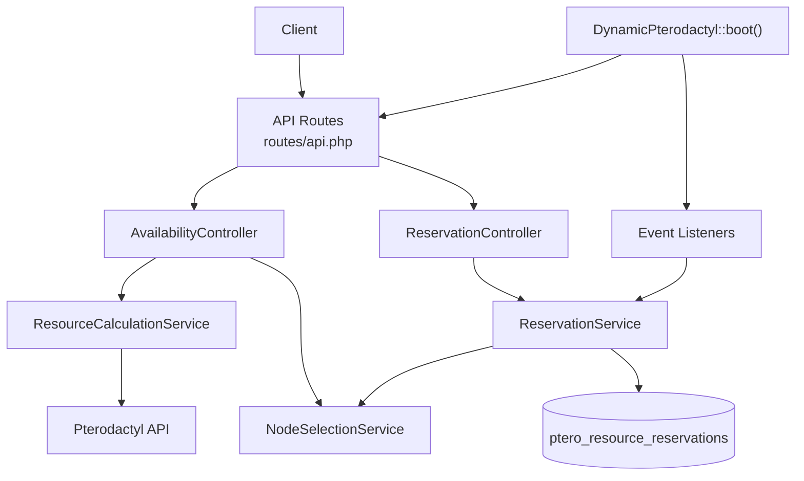
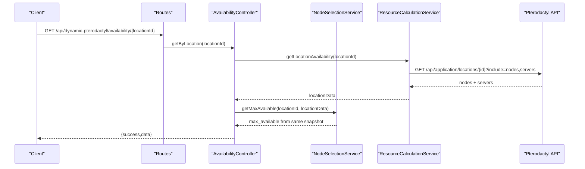
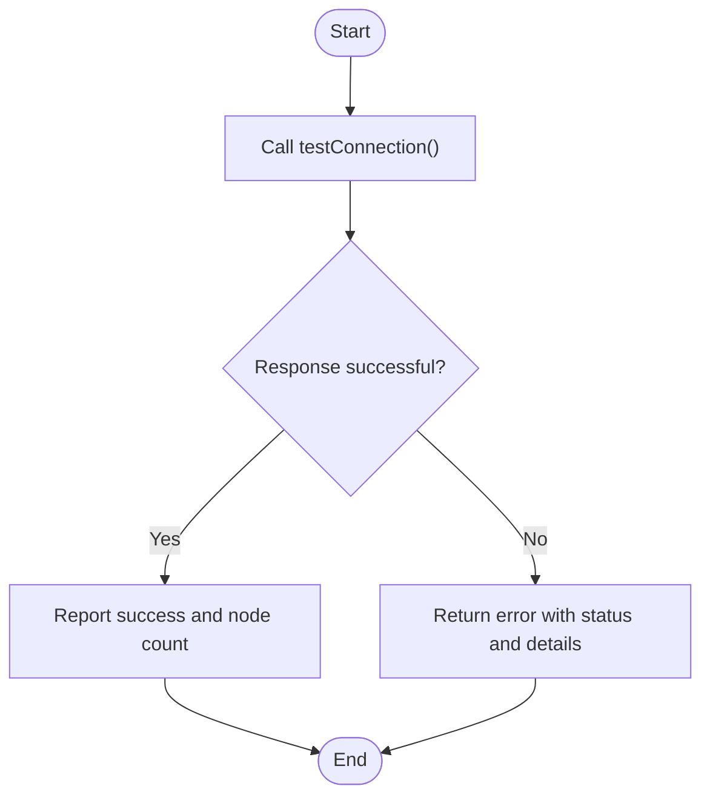
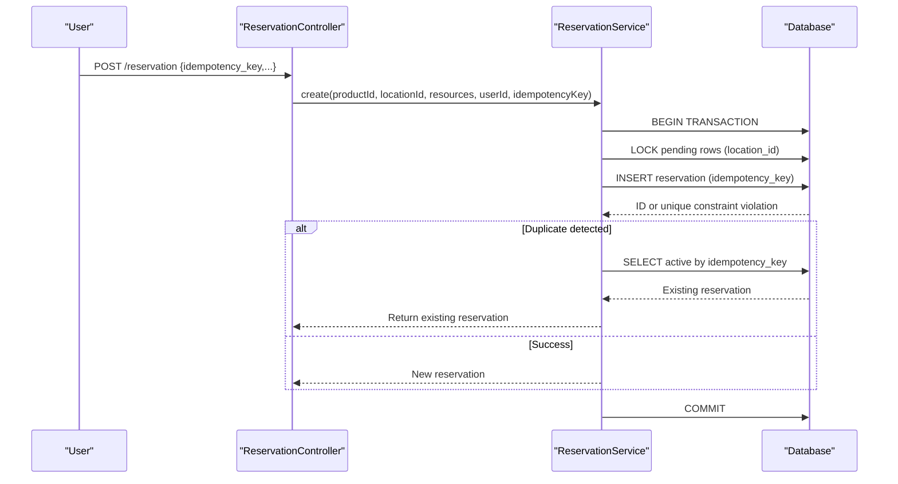
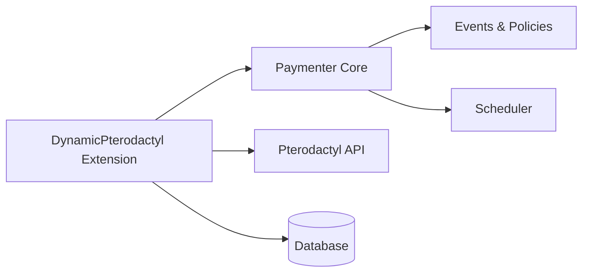

# Troubleshooting

> **Preserved Qoder snapshot.** This deep-dive page is retained so the earlier Wiki work and its source trail are not lost. For the reconciled implementation, [[Architecture Overview|Architecture-Overview]] is canonical; references below to retired controllers, listeners, services, or API shapes are historical.

<cite>
**Referenced Files in This Document**
- [DynamicPterodactyl.php](https://github.com/ObsidianNetwork/dynamic-pterodactyl/blob/6b7f83bda6f7c3fe014d52428b31af1638daa6cc/DynamicPterodactyl.php)
- [api.php](https://github.com/ObsidianNetwork/dynamic-pterodactyl/blob/6b7f83bda6f7c3fe014d52428b31af1638daa6cc/routes/api.php)
- [AvailabilityController.php](https://github.com/ObsidianNetwork/dynamic-pterodactyl/blob/6b7f83bda6f7c3fe014d52428b31af1638daa6cc/Http/Controllers/Api/AvailabilityController.php)
- [ReservationController.php](https://github.com/ObsidianNetwork/dynamic-pterodactyl/blob/6b7f83bda6f7c3fe014d52428b31af1638daa6cc/Http/Controllers/Api/ReservationController.php)
- [ResourceCalculationService.php](https://github.com/ObsidianNetwork/dynamic-pterodactyl/blob/6b7f83bda6f7c3fe014d52428b31af1638daa6cc/Services/ResourceCalculationService.php)
- [NodeSelectionService.php](https://github.com/ObsidianNetwork/dynamic-pterodactyl/blob/6b7f83bda6f7c3fe014d52428b31af1638daa6cc/Services/NodeSelectionService.php)
- [ReservationService.php](https://github.com/ObsidianNetwork/dynamic-pterodactyl/blob/6b7f83bda6f7c3fe014d52428b31af1638daa6cc/Services/ReservationService.php)
- [CartItemCreatedListener.php](https://github.com/ObsidianNetwork/dynamic-pterodactyl/blob/6b7f83bda6f7c3fe014d52428b31af1638daa6cc/Listeners/CartItemCreatedListener.php)
- [InvoicePaidListener.php](https://github.com/ObsidianNetwork/dynamic-pterodactyl/blob/6b7f83bda6f7c3fe014d52428b31af1638daa6cc/Listeners/InvoicePaidListener.php)
- [AlertService.php](https://github.com/ObsidianNetwork/dynamic-pterodactyl/blob/6b7f83bda6f7c3fe014d52428b31af1638daa6cc/Services/AlertService.php)
- [AuditsExtensionActions.php](https://github.com/ObsidianNetwork/dynamic-pterodactyl/blob/6b7f83bda6f7c3fe014d52428b31af1638daa6cc/Services/Concerns/AuditsExtensionActions.php)
- [2025_01_01_000001_create_ptero_resource_reservations_table.php](https://github.com/ObsidianNetwork/dynamic-pterodactyl/blob/6b7f83bda6f7c3fe014d52428b31af1638daa6cc/database/migrations/2025_01_01_000001_create_ptero_resource_reservations_table.php)
</cite>

## Table of Contents
1. [Introduction](#introduction)
2. [Project Structure](#project-structure)
3. [Core Components](#core-components)
4. [Architecture Overview](#architecture-overview)
5. [Detailed Component Analysis](#detailed-component-analysis)
6. [Dependency Analysis](#dependency-analysis)
7. [Performance Considerations](#performance-considerations)
8. [Troubleshooting Guide](#troubleshooting-guide)
9. [Conclusion](#conclusion)
10. [Appendices](#appendices)

## Introduction
This document provides comprehensive troubleshooting guidance for the Dynamic Pterodactyl extension. It focuses on common operational issues such as Pterodactyl API connectivity problems, authentication failures, rate limiting responses, reservation conflicts, database locking deadlocks, and timeout scenarios. It also includes diagnostic commands, log analysis techniques, performance profiling approaches, known limitations, workarounds for edge cases, escalation procedures, and an FAQ section covering availability discrepancies, reservation expiration behavior, and alert configuration problems.

## Project Structure
The extension integrates with Paymenter via a boot process that registers routes, views, event listeners, and scheduled tasks. The primary runtime components are:
- API controllers for availability and reservations
- Services for resource calculation, node selection, reservation management, and alerts
- Event listeners bridging cart and invoice lifecycle events to reservation actions
- Database schema for reservations and related indexes

**Diagram sources**
- [DynamicPterodactyl.php:96-127](https://github.com/ObsidianNetwork/dynamic-pterodactyl/blob/6b7f83bda6f7c3fe014d52428b31af1638daa6cc/DynamicPterodactyl.php#L96-L127)
- [api.php:17-40](https://github.com/ObsidianNetwork/dynamic-pterodactyl/blob/6b7f83bda6f7c3fe014d52428b31af1638daa6cc/routes/api.php#L17-L40)
- [AvailabilityController.php:22-69](https://github.com/ObsidianNetwork/dynamic-pterodactyl/blob/6b7f83bda6f7c3fe014d52428b31af1638daa6cc/Http/Controllers/Api/AvailabilityController.php#L22-L69)
- [ReservationController.php:24-136](https://github.com/ObsidianNetwork/dynamic-pterodactyl/blob/6b7f83bda6f7c3fe014d52428b31af1638daa6cc/Http/Controllers/Api/ReservationController.php#L24-L136)
- [ResourceCalculationService.php:26-222](https://github.com/ObsidianNetwork/dynamic-pterodactyl/blob/6b7f83bda6f7c3fe014d52428b31af1638daa6cc/Services/ResourceCalculationService.php#L26-L222)
- [NodeSelectionService.php:22-86](https://github.com/ObsidianNetwork/dynamic-pterodactyl/blob/6b7f83bda6f7c3fe014d52428b31af1638daa6cc/Services/NodeSelectionService.php#L22-L86)
- [ReservationService.php:43-141](https://github.com/ObsidianNetwork/dynamic-pterodactyl/blob/6b7f83bda6f7c3fe014d52428b31af1638daa6cc/Services/ReservationService.php#L43-L141)

**Section sources**
- [DynamicPterodactyl.php:96-127](https://github.com/ObsidianNetwork/dynamic-pterodactyl/blob/6b7f83bda6f7c3fe014d52428b31af1638daa6cc/DynamicPterodactyl.php#L96-L127)
- [api.php:17-40](https://github.com/ObsidianNetwork/dynamic-pterodactyl/blob/6b7f83bda6f7c3fe014d52428b31af1638daa6cc/routes/api.php#L17-L40)

## Core Components
- AvailabilityController exposes per-location availability and node details, returning only aggregate capacity to customers.
- ReservationController manages reservation creation, retrieval, cancellation, and extension with authorization checks.
- ResourceCalculationService fetches real-time data from Pterodactyl, computes available resources, and handles connection errors and rate limits.
- NodeSelectionService selects the best-fit node based on weighted headroom scoring.
- ReservationService creates, confirms, cancels, extends, and cleans up reservations using pessimistic locking and idempotency support.
- AlertService periodically evaluates capacity thresholds and sends notifications via email or webhooks, logging delivery outcomes.

**Section sources**
- [AvailabilityController.php:22-69](https://github.com/ObsidianNetwork/dynamic-pterodactyl/blob/6b7f83bda6f7c3fe014d52428b31af1638daa6cc/Http/Controllers/Api/AvailabilityController.php#L22-L69)
- [ReservationController.php:24-136](https://github.com/ObsidianNetwork/dynamic-pterodactyl/blob/6b7f83bda6f7c3fe014d52428b31af1638daa6cc/Http/Controllers/Api/ReservationController.php#L24-L136)
- [ResourceCalculationService.php:26-222](https://github.com/ObsidianNetwork/dynamic-pterodactyl/blob/6b7f83bda6f7c3fe014d52428b31af1638daa6cc/Services/ResourceCalculationService.php#L26-L222)
- [NodeSelectionService.php:22-86](https://github.com/ObsidianNetwork/dynamic-pterodactyl/blob/6b7f83bda6f7c3fe014d52428b31af1638daa6cc/Services/NodeSelectionService.php#L22-L86)
- [ReservationService.php:43-141](https://github.com/ObsidianNetwork/dynamic-pterodactyl/blob/6b7f83bda6f7c3fe014d52428b31af1638daa6cc/Services/ReservationService.php#L43-L141)
- [AlertService.php:33-75](https://github.com/ObsidianNetwork/dynamic-pterodactyl/blob/6b7f83bda6f7c3fe014d52428b31af1638daa6cc/Services/AlertService.php#L33-L75)

## Architecture Overview
The system enforces real-time availability by querying Pterodactyl on each request without caching. Reservations protect capacity during checkout using database transactions with pessimistic locks and retries on deadlock. Alerts run on schedules to monitor utilization and notify administrators.

**Diagram sources**
- [api.php:17-22](https://github.com/ObsidianNetwork/dynamic-pterodactyl/blob/6b7f83bda6f7c3fe014d52428b31af1638daa6cc/routes/api.php#L17-L22)
- [AvailabilityController.php:22-52](https://github.com/ObsidianNetwork/dynamic-pterodactyl/blob/6b7f83bda6f7c3fe014d52428b31af1638daa6cc/Http/Controllers/Api/AvailabilityController.php#L22-L52)
- [NodeSelectionService.php:81-86](https://github.com/ObsidianNetwork/dynamic-pterodactyl/blob/6b7f83bda6f7c3fe014d52428b31af1638daa6cc/Services/NodeSelectionService.php#L81-L86)
- [ResourceCalculationService.php:26-67](https://github.com/ObsidianNetwork/dynamic-pterodactyl/blob/6b7f83bda6f7c3fe014d52428b31af1638daa6cc/Services/ResourceCalculationService.php#L26-L67)

## Detailed Component Analysis

### Pterodactyl API Connectivity and Authentication Failures
Symptoms:
- Availability endpoints return failure messages.
- Admin capacity checks fail.
- Error logs show connection exceptions or HTTP error codes.

Root causes:
- Invalid or missing Pterodactyl URL or application API key, or missing read access to Locations, Nodes, or Servers.
- Network connectivity issues or firewall restrictions.
- Rate limiting (HTTP 429) from Pterodactyl.
- Non-JSON or malformed responses.

Diagnostics:
- Use the built-in connection test endpoint to validate connectivity and credentials.
- Inspect logs for sanitized error messages and full upstream bodies recorded for diagnostics.
- Check throttling middleware on routes to ensure requests are not being rejected due to excessive frequency.

Resolution steps:
- Verify extension settings contain a valid panel URL and an application API key with Locations, Nodes, and Servers read access.
- Confirm network access to the Pterodactyl panel host and port.
- If encountering 429, reduce request frequency or adjust client retry/backoff behavior.
- Review server logs for detailed error context when non-JSON payloads occur.

**Diagram sources**
- [ResourceCalculationService.php:158-195](https://github.com/ObsidianNetwork/dynamic-pterodactyl/blob/6b7f83bda6f7c3fe014d52428b31af1638daa6cc/Services/ResourceCalculationService.php#L158-L195)

**Section sources**
- [ResourceCalculationService.php:158-195](https://github.com/ObsidianNetwork/dynamic-pterodactyl/blob/6b7f83bda6f7c3fe014d52428b31af1638daa6cc/Services/ResourceCalculationService.php#L158-L195)
- [ResourceCalculationService.php:452-498](https://github.com/ObsidianNetwork/dynamic-pterodactyl/blob/6b7f83bda6f7c3fe014d52428b31af1638daa6cc/Services/ResourceCalculationService.php#L452-L498)
- [api.php:17-40](https://github.com/ObsidianNetwork/dynamic-pterodactyl/blob/6b7f83bda6f7c3fe014d52428b31af1638daa6cc/routes/api.php#L17-L40)

### Rate Limiting Responses (HTTP 429)
Symptoms:
- Requests to Pterodactyl return 429.
- Availability queries fail with rate limit messages.

Behavior:
- The service throws a specific runtime exception indicating rate limiting; it does not retry on 429.
- Route-level throttling protects against bursts at the application layer.

Resolution steps:
- Reduce request frequency or implement exponential backoff in clients.
- Ensure UI or automation respects throttle limits defined on routes.
- Monitor logs for repeated 429 occurrences and investigate upstream load.

**Section sources**
- [ResourceCalculationService.php:473-475](https://github.com/ObsidianNetwork/dynamic-pterodactyl/blob/6b7f83bda6f7c3fe014d52428b31af1638daa6cc/Services/ResourceCalculationService.php#L473-L475)
- [api.php:17-40](https://github.com/ObsidianNetwork/dynamic-pterodactyl/blob/6b7f83bda6f7c3fe014d52428b31af1638daa6cc/routes/api.php#L17-L40)

### Reservation Conflicts and Idempotency
Symptoms:
- Duplicate reservation attempts return existing reservation instead of creating a new one.
- Race conditions between concurrent requests are handled gracefully.

Mechanisms:
- Pessimistic locking on pending reservations within a transaction.
- Idempotency key support to deduplicate identical create requests.
- Deadlock retry policy to recover from transient lock contention.

Resolution steps:
- Provide an idempotency key when creating reservations to avoid duplicates.
- If conflicts occur, inspect logs for duplicate handling and confirm returned reservation token.
- For persistent deadlocks, review workload patterns and consider reducing concurrency or optimizing query paths.

**Diagram sources**
- [ReservationController.php:24-60](https://github.com/ObsidianNetwork/dynamic-pterodactyl/blob/6b7f83bda6f7c3fe014d52428b31af1638daa6cc/Http/Controllers/Api/ReservationController.php#L24-L60)
- [ReservationService.php:43-141](https://github.com/ObsidianNetwork/dynamic-pterodactyl/blob/6b7f83bda6f7c3fe014d52428b31af1638daa6cc/Services/ReservationService.php#L43-L141)

**Section sources**
- [ReservationService.php:43-141](https://github.com/ObsidianNetwork/dynamic-pterodactyl/blob/6b7f83bda6f7c3fe014d52428b31af1638daa6cc/Services/ReservationService.php#L43-L141)
- [ReservationService.php:431-452](https://github.com/ObsidianNetwork/dynamic-pterodactyl/blob/6b7f83bda6f7c3fe014d52428b31af1638daa6cc/Services/ReservationService.php#L431-L452)

### Database Locking and Deadlocks
Symptoms:
- Intermittent failures during reservation creation under high concurrency.
- Logs indicate deadlock or unique constraint violations.

Behavior:
- Transactions use pessimistic locking and retry up to five times on deadlock.
- Unique constraints on active idempotency keys prevent duplicate allocations.

Resolution steps:
- Ensure application logic supplies idempotency keys for create operations.
- Investigate long-running transactions or external processes holding locks.
- Monitor database metrics for lock waits and adjust workload accordingly.

**Section sources**
- [ReservationService.php:43-141](https://github.com/ObsidianNetwork/dynamic-pterodactyl/blob/6b7f83bda6f7c3fe014d52428b31af1638daa6cc/Services/ReservationService.php#L43-L141)
- [ReservationService.php:444-452](https://github.com/ObsidianNetwork/dynamic-pterodactyl/blob/6b7f83bda6f7c3fe014d52428b31af1638daa6cc/Services/ReservationService.php#L444-L452)
- [2025_01_01_000001_create_ptero_resource_reservations_table.php:55-61](https://github.com/ObsidianNetwork/dynamic-pterodactyl/blob/6b7f83bda6f7c3fe014d52428b31af1638daa6cc/database/migrations/2025_01_01_000001_create_ptero_resource_reservations_table.php#L55-L61)

### Timeout Issues
Symptoms:
- Requests time out when fetching availability or cluster snapshots.
- Errors mention connection timeouts or slow responses.

Behavior:
- Per-attempt HTTP timeouts and connect timeouts are set for Pterodactyl calls.
- Connection exceptions trigger retries; non-connection errors do not retry.

Resolution steps:
- Increase client-side timeouts if necessary while respecting upstream limits.
- Optimize network paths to Pterodactyl panel.
- Review logs for repeated connection exceptions and address infrastructure issues.

**Section sources**
- [ResourceCalculationService.php:452-498](https://github.com/ObsidianNetwork/dynamic-pterodactyl/blob/6b7f83bda6f7c3fe014d52428b31af1638daa6cc/Services/ResourceCalculationService.php#L452-L498)

### Availability Discrepancies
Symptoms:
- Customer-facing availability differs from admin node details.
- Max available values appear lower than expected.

Explanation:
- Customer endpoints expose only aggregate maxima per location, not node-level detail.
- Real-time availability is fetched directly from Pterodactyl; no caching is used.

Resolution steps:
- Use admin endpoints to inspect node-level details for deeper diagnostics.
- Validate that nodes are not in maintenance mode and that pending reservations are accounted for.

**Section sources**
- [AvailabilityController.php:22-69](https://github.com/ObsidianNetwork/dynamic-pterodactyl/blob/6b7f83bda6f7c3fe014d52428b31af1638daa6cc/Http/Controllers/Api/AvailabilityController.php#L22-L69)
- [ResourceCalculationService.php:26-67](https://github.com/ObsidianNetwork/dynamic-pterodactyl/blob/6b7f83bda6f7c3fe014d52428b31af1638daa6cc/Services/ResourceCalculationService.php#L26-L67)

### Reservation Expiration Behavior
Symptoms:
- Reservations expire before payment completes.
- Expired reservations cannot be confirmed.

Behavior:
- Pending reservations have a TTL configured in extension settings.
- Scheduled cleanup marks expired reservations as expired.

Resolution steps:
- Adjust reservation TTL in extension settings to match checkout duration.
- Extend reservations via the extend endpoint if needed during prolonged checkout flows.
- Monitor scheduled jobs to ensure they run every minute.

**Section sources**
- [DynamicPterodactyl.php:116-121](https://github.com/ObsidianNetwork/dynamic-pterodactyl/blob/6b7f83bda6f7c3fe014d52428b31af1638daa6cc/DynamicPterodactyl.php#L116-L121)
- [ReservationService.php:385-405](https://github.com/ObsidianNetwork/dynamic-pterodactyl/blob/6b7f83bda6f7c3fe014d52428b31af1638daa6cc/Services/ReservationService.php#L385-L405)
- [ReservationController.php:102-136](https://github.com/ObsidianNetwork/dynamic-pterodactyl/blob/6b7f83bda6f7c3fe014d52428b31af1638daa6cc/Http/Controllers/Api/ReservationController.php#L102-L136)

### Alert Configuration Problems
Symptoms:
- No alerts received despite capacity breaches.
- Webhook or email notifications failing.

Behavior:
- AlertService runs every five minutes, checks thresholds, and sends notifications via configured channels.
- Delivery outcomes are logged; failures trigger events and warnings.

Resolution steps:
- Verify alert configurations are active and thresholds are set appropriately.
- Confirm admin recipients exist and email/webhook settings are correct.
- Inspect alert delivery logs for channel-specific errors.

**Section sources**
- [DynamicPterodactyl.php:123-126](https://github.com/ObsidianNetwork/dynamic-pterodactyl/blob/6b7f83bda6f7c3fe014d52428b31af1638daa6cc/DynamicPterodactyl.php#L123-L126)
- [AlertService.php:33-75](https://github.com/ObsidianNetwork/dynamic-pterodactyl/blob/6b7f83bda6f7c3fe014d52428b31af1638daa6cc/Services/AlertService.php#L33-L75)
- [AlertService.php:128-248](https://github.com/ObsidianNetwork/dynamic-pterodactyl/blob/6b7f83bda6f7c3fe014d52428b31af1638daa6cc/Services/AlertService.php#L128-L248)

## Dependency Analysis
The extension’s runtime depends on:
- Paymenter core for routing, scheduling, events, and policies.
- Pterodactyl API for real-time node and server data.
- Database for reservation state and audit logs.

**Diagram sources**
- [DynamicPterodactyl.php:96-127](https://github.com/ObsidianNetwork/dynamic-pterodactyl/blob/6b7f83bda6f7c3fe014d52428b31af1638daa6cc/DynamicPterodactyl.php#L96-L127)
- [api.php:17-40](https://github.com/ObsidianNetwork/dynamic-pterodactyl/blob/6b7f83bda6f7c3fe014d52428b31af1638daa6cc/routes/api.php#L17-L40)

**Section sources**
- [DynamicPterodactyl.php:96-127](https://github.com/ObsidianNetwork/dynamic-pterodactyl/blob/6b7f83bda6f7c3fe014d52428b31af1638daa6cc/DynamicPterodactyl.php#L96-L127)
- [api.php:17-40](https://github.com/ObsidianNetwork/dynamic-pterodactyl/blob/6b7f83bda6f7c3fe014d52428b31af1638daa6cc/routes/api.php#L17-L40)

## Performance Considerations
- Avoid caching Pterodactyl responses; rely on real-time queries for accuracy.
- Use route throttling to protect upstream API budget and reduce overload.
- Prefer batched cluster snapshot operations where applicable.
- Monitor database lock contention and optimize transaction scope.
- Profile HTTP calls to identify slow upstream responses and adjust timeouts accordingly.

## Troubleshooting Guide

### Pterodactyl API Connectivity
Steps:
- Validate extension settings for panel URL and API key.
- Call the connection test endpoint to verify reachability and response format.
- Check logs for connection exceptions and HTTP status codes.
- Ensure network/firewall allows traffic to the panel host.

Diagnostics:
- Inspect sanitized error messages and full upstream bodies recorded for diagnostics.
- Confirm route throttling is not rejecting requests prematurely.

**Section sources**
- [ResourceCalculationService.php:158-195](https://github.com/ObsidianNetwork/dynamic-pterodactyl/blob/6b7f83bda6f7c3fe014d52428b31af1638daa6cc/Services/ResourceCalculationService.php#L158-L195)
- [ResourceCalculationService.php:452-498](https://github.com/ObsidianNetwork/dynamic-pterodactyl/blob/6b7f83bda6f7c3fe014d52428b31af1638daa6cc/Services/ResourceCalculationService.php#L452-L498)
- [api.php:17-40](https://github.com/ObsidianNetwork/dynamic-pterodactyl/blob/6b7f83bda6f7c3fe014d52428b31af1638daa6cc/routes/api.php#L17-L40)

### Authentication Failures
Steps:
- Confirm the application API key has read access to Locations, Nodes, and Servers in Pterodactyl.
- Verify Authorization header usage in internal calls.
- Review logs for 4xx errors indicating invalid credentials.

Diagnostics:
- Use the connection test endpoint to surface authentication issues early.
- Check for malformed headers or incorrect base URL formatting.

**Section sources**
- [ResourceCalculationService.php:158-195](https://github.com/ObsidianNetwork/dynamic-pterodactyl/blob/6b7f83bda6f7c3fe014d52428b31af1638daa6cc/Services/ResourceCalculationService.php#L158-L195)
- [ResourceCalculationService.php:452-498](https://github.com/ObsidianNetwork/dynamic-pterodactyl/blob/6b7f83bda6f7c3fe014d52428b31af1638daa6cc/Services/ResourceCalculationService.php#L452-L498)

### Rate Limiting Responses
Steps:
- Reduce request frequency or implement backoff strategies.
- Respect route-level throttling limits.
- Monitor logs for repeated 429 responses and adjust client behavior.

Diagnostics:
- Identify hotspots causing excessive calls to Pterodactyl.
- Evaluate whether batched operations can reduce total requests.

**Section sources**
- [ResourceCalculationService.php:473-475](https://github.com/ObsidianNetwork/dynamic-pterodactyl/blob/6b7f83bda6f7c3fe014d52428b31af1638daa6cc/Services/ResourceCalculationService.php#L473-L475)
- [api.php:17-40](https://github.com/ObsidianNetwork/dynamic-pterodactyl/blob/6b7f83bda6f7c3fe014d52428b31af1638daa6cc/routes/api.php#L17-L40)

### Reservation Conflicts
Steps:
- Provide idempotency keys when creating reservations.
- Handle existing reservation returns gracefully in clients.
- Investigate duplicate submission patterns in UI or automation.

Diagnostics:
- Review logs for duplicate handling and unique constraint violations.
- Confirm pending reservation locks are functioning under load.

**Section sources**
- [ReservationService.php:43-141](https://github.com/ObsidianNetwork/dynamic-pterodactyl/blob/6b7f83bda6f7c3fe014d52428b31af1638daa6cc/Services/ReservationService.php#L43-L141)
- [ReservationService.php:431-452](https://github.com/ObsidianNetwork/dynamic-pterodactyl/blob/6b7f83bda6f7c3fe014d52428b31af1638daa6cc/Services/ReservationService.php#L431-L452)

### Database Locking Deadlocks
Steps:
- Ensure transactions are short-lived and focused on critical sections.
- Reduce concurrency or stagger heavy reservation creation bursts.
- Monitor database metrics for lock waits and adjust workload.

Diagnostics:
- Look for deadlock-related exceptions and unique constraint errors.
- Audit long-running queries and external processes holding locks.

**Section sources**
- [ReservationService.php:43-141](https://github.com/ObsidianNetwork/dynamic-pterodactyl/blob/6b7f83bda6f7c3fe014d52428b31af1638daa6cc/Services/ReservationService.php#L43-L141)
- [ReservationService.php:444-452](https://github.com/ObsidianNetwork/dynamic-pterodactyl/blob/6b7f83bda6f7c3fe014d52428b31af1638daa6cc/Services/ReservationService.php#L444-L452)

### Timeout Issues
Steps:
- Tune client timeouts to balance responsiveness and reliability.
- Address network latency to Pterodactyl panel.
- Investigate slow upstream responses and optimize queries.

Diagnostics:
- Check logs for connection exceptions and retry counts.
- Measure end-to-end request durations to pinpoint bottlenecks.

**Section sources**
- [ResourceCalculationService.php:452-498](https://github.com/ObsidianNetwork/dynamic-pterodactyl/blob/6b7f83bda6f7c3fe014d52428b31af1638daa6cc/Services/ResourceCalculationService.php#L452-L498)

### Availability Discrepancies
Steps:
- Use admin endpoints to inspect node-level details.
- Confirm nodes are not in maintenance mode.
- Validate pending reservations are included in availability calculations.

Diagnostics:
- Compare customer-facing aggregates with admin node lists.
- Review logs for node selection decisions and scoring.

**Section sources**
- [AvailabilityController.php:22-69](https://github.com/ObsidianNetwork/dynamic-pterodactyl/blob/6b7f83bda6f7c3fe014d52428b31af1638daa6cc/Http/Controllers/Api/AvailabilityController.php#L22-L69)
- [NodeSelectionService.php:22-86](https://github.com/ObsidianNetwork/dynamic-pterodactyl/blob/6b7f83bda6f7c3fe014d52428b31af1638daa6cc/Services/NodeSelectionService.php#L22-L86)

### Reservation Expiration Behavior
Steps:
- Adjust reservation TTL to align with checkout duration.
- Extend reservations during prolonged checkout flows.
- Ensure scheduled cleanup runs every minute.

Diagnostics:
- Inspect reservation states and expiration timestamps.
- Review logs for cleanup runs and expired batch updates.

**Section sources**
- [DynamicPterodactyl.php:116-121](https://github.com/ObsidianNetwork/dynamic-pterodactyl/blob/6b7f83bda6f7c3fe014d52428b31af1638daa6cc/DynamicPterodactyl.php#L116-L121)
- [ReservationService.php:385-405](https://github.com/ObsidianNetwork/dynamic-pterodactyl/blob/6b7f83bda6f7c3fe014d52428b31af1638daa6cc/Services/ReservationService.php#L385-L405)
- [ReservationController.php:102-136](https://github.com/ObsidianNetwork/dynamic-pterodactyl/blob/6b7f83bda6f7c3fe014d52428b31af1638daa6cc/Http/Controllers/Api/ReservationController.php#L102-L136)

### Alert Configuration Problems
Steps:
- Verify alert configurations are active and thresholds are set.
- Confirm admin recipients and notification channels are configured correctly.
- Inspect alert delivery logs for failures.

Diagnostics:
- Use test notification functionality to validate channels.
- Review logs for webhook and email delivery errors.

**Section sources**
- [DynamicPterodactyl.php:123-126](https://github.com/ObsidianNetwork/dynamic-pterodactyl/blob/6b7f83bda6f7c3fe014d52428b31af1638daa6cc/DynamicPterodactyl.php#L123-L126)
- [AlertService.php:33-75](https://github.com/ObsidianNetwork/dynamic-pterodactyl/blob/6b7f83bda6f7c3fe014d52428b31af1638daa6cc/Services/AlertService.php#L33-L75)
- [AlertService.php:128-248](https://github.com/ObsidianNetwork/dynamic-pterodactyl/blob/6b7f83bda6f7c3fe014d52428b31af1638daa6cc/Services/AlertService.php#L128-L248)

### Log Analysis Techniques
- Focus on logs from controllers, services, and listeners for error contexts.
- Use sanitized messages for safe reporting and full bodies for diagnostics.
- Correlate timestamps across routes, services, and database operations.

**Section sources**
- [AvailabilityController.php:45-52](https://github.com/ObsidianNetwork/dynamic-pterodactyl/blob/6b7f83bda6f7c3fe014d52428b31af1638daa6cc/Http/Controllers/Api/AvailabilityController.php#L45-L52)
- [ReservationController.php:49-59](https://github.com/ObsidianNetwork/dynamic-pterodactyl/blob/6b7f83bda6f7c3fe014d52428b31af1638daa6cc/Http/Controllers/Api/ReservationController.php#L49-L59)
- [ResourceCalculationService.php:473-498](https://github.com/ObsidianNetwork/dynamic-pterodactyl/blob/6b7f83bda6f7c3fe014d52428b31af1638daa6cc/Services/ResourceCalculationService.php#L473-L498)
- [AuditsExtensionActions.php:10-32](https://github.com/ObsidianNetwork/dynamic-pterodactyl/blob/6b7f83bda6f7c3fe014d52428b31af1638daa6cc/Services/Concerns/AuditsExtensionActions.php#L10-L32)

### Performance Profiling Approaches
- Profile HTTP calls to Pterodactyl to identify slow endpoints.
- Monitor database lock waits and transaction durations.
- Analyze route throttling effectiveness and request patterns.

[No sources needed since this section provides general guidance]

### Known Limitations
- Real-time availability is always fetched from Pterodactyl; no caching is used.
- Customer-facing endpoints do not expose node-level details; only aggregate maxima are returned.
- Pricing logic belongs to Paymenter core; this extension reads slider metadata and manages reservations.

[No sources needed since this section summarizes known constraints]

### Escalation Procedures
- For critical API outages, escalate to Pterodactyl administration and network teams.
- For persistent database deadlocks, involve database administrators to analyze lock contention.
- For recurring alert delivery failures, escalate to platform integrations team to fix email/webhook configurations.

[No sources needed since this section provides procedural guidance]

## Conclusion
This guide consolidates diagnosis and resolution steps for common issues in the Dynamic Pterodactyl extension. By leveraging built-in diagnostics, logs, and scheduled tasks, most operational problems can be identified and resolved efficiently. Adhering to throttling, idempotency, and proper configuration ensures reliable operation under load.

## Appendices

### Diagnostic Commands
- Test Pterodactyl connectivity via the connection test method exposed by the service.
- Query reservation states and statistics through admin endpoints.
- Inspect alert delivery logs to diagnose notification failures.

**Section sources**
- [ResourceCalculationService.php:158-195](https://github.com/ObsidianNetwork/dynamic-pterodactyl/blob/6b7f83bda6f7c3fe014d52428b31af1638daa6cc/Services/ResourceCalculationService.php#L158-L195)
- [ReservationService.php:335-382](https://github.com/ObsidianNetwork/dynamic-pterodactyl/blob/6b7f83bda6f7c3fe014d52428b31af1638daa6cc/Services/ReservationService.php#L335-L382)
- [AlertService.php:304-323](https://github.com/ObsidianNetwork/dynamic-pterodactyl/blob/6b7f83bda6f7c3fe014d52428b31af1638daa6cc/Services/AlertService.php#L304-L323)

### FAQ
- Why does availability differ between customer and admin views?
  - Customer endpoints return only aggregate maxima per location; admin endpoints provide node-level details.
- What happens when a reservation expires?
  - Scheduled cleanup marks pending reservations past TTL as expired, freeing capacity.
- Why are alerts not being sent?
  - Check alert configuration activity, thresholds, admin recipients, and delivery logs for channel-specific errors.

**Section sources**
- [AvailabilityController.php:22-69](https://github.com/ObsidianNetwork/dynamic-pterodactyl/blob/6b7f83bda6f7c3fe014d52428b31af1638daa6cc/Http/Controllers/Api/AvailabilityController.php#L22-L69)
- [DynamicPterodactyl.php:116-126](https://github.com/ObsidianNetwork/dynamic-pterodactyl/blob/6b7f83bda6f7c3fe014d52428b31af1638daa6cc/DynamicPterodactyl.php#L116-L126)
- [AlertService.php:33-75](https://github.com/ObsidianNetwork/dynamic-pterodactyl/blob/6b7f83bda6f7c3fe014d52428b31af1638daa6cc/Services/AlertService.php#L33-L75)
- [AlertService.php:128-248](https://github.com/ObsidianNetwork/dynamic-pterodactyl/blob/6b7f83bda6f7c3fe014d52428b31af1638daa6cc/Services/AlertService.php#L128-L248)
