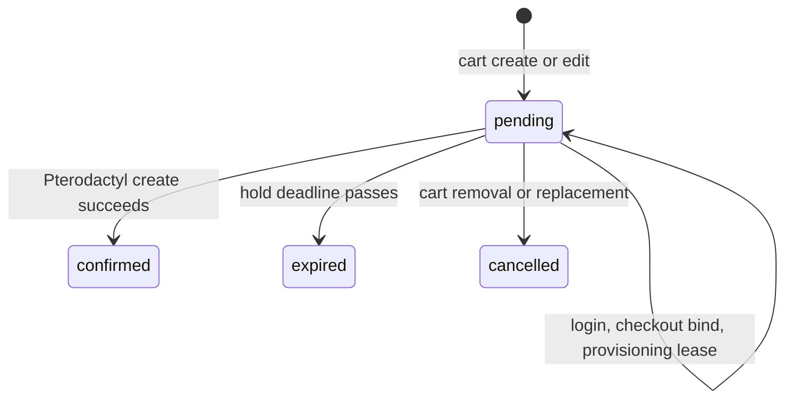

# Database Schema

The extension owns four live tables:

| Table | Purpose |
|---|---|
| `ptero_resource_reservations` | Authoritative cart-to-provisioning capacity holds |
| `ptero_audit_logs` | Extension action history |
| `ptero_alert_configs` | Per-location alert thresholds |
| `ptero_alert_delivery_logs` | Alert delivery outcomes |

`ptero_pricing_configs` is retired. Paymenter `config_options.metadata` is the pricing source of truth.

## Resource reservations

The base table is created by `2025_01_01_000001_create_ptero_resource_reservations_table.php`. The server-owned checkout identity is added by `2026_07_25_000001_add_checkout_identity_to_ptero_resource_reservations.php`.

### Identity

| Column | Meaning |
|---|---|
| `cart_item_id`, `cart_id` | Original cart identity; the item FK becomes null when checkout clears the cart |
| `server_extension_id`, `panel_identity` | Paymenter provisioner identity and SHA-256 of its normalized panel URL |
| `service_id`, `user_id` | Assigned atomically at checkout/login |
| `product_id`, `plan_id`, `quantity`, `currency_code` | Purchase identity |
| `configuration_payload` | Canonical immutable checkout snapshot, including customer, cart, server extension, hashed panel identity, node, and selected options |
| `configuration_fingerprint` | SHA-256 of the canonical payload |
| `pricing_version`, `formula_version`, `calculated_price` | Pricing provenance |
| `node_id`, `location_id`, `memory`, `cpu`, `disk` | Reserved placement and limits |

The opaque `token` remains for internal/admin lookup of legacy rows. It is not a customer bearer credential and is never placed in browser, URL, cart, or service state.

### Lifecycle

`provisioning_started_at` and the unguessable `provisioning_lease_id` prevent concurrent or stale create workers from consuming the same hold. `consumed_at` records successful Pterodactyl creation. A failed attempt clears only its matching lease and records `last_provisioning_error`; the capacity remains pending until retry or expiry.

`active_cart_item_id` is a generated column that is non-null only for pending rows and has a unique index. This enforces one active hold per cart item.

During migration, legacy pending rows without a configuration fingerprint are cancelled. They came from the retired browser/listener token flows and cannot be proved safe. Active carts acquire a fresh server-owned hold on edit or checkout.

## Units

- Memory and disk: MiB-compatible integer values used by Pterodactyl.
- CPU: percentage limit (`100` = one core of limit), stored for identity and provisioning but not treated as node capacity.
- Money: decimal snapshot in the cart currency.

## Rollback

The key-normalization migration is intentionally irreversible: restoring uppercase `MEMORY`, `CPU`, `DISK`, or `LOCATION` keys would make the built-in provisioner ignore slider selections.
