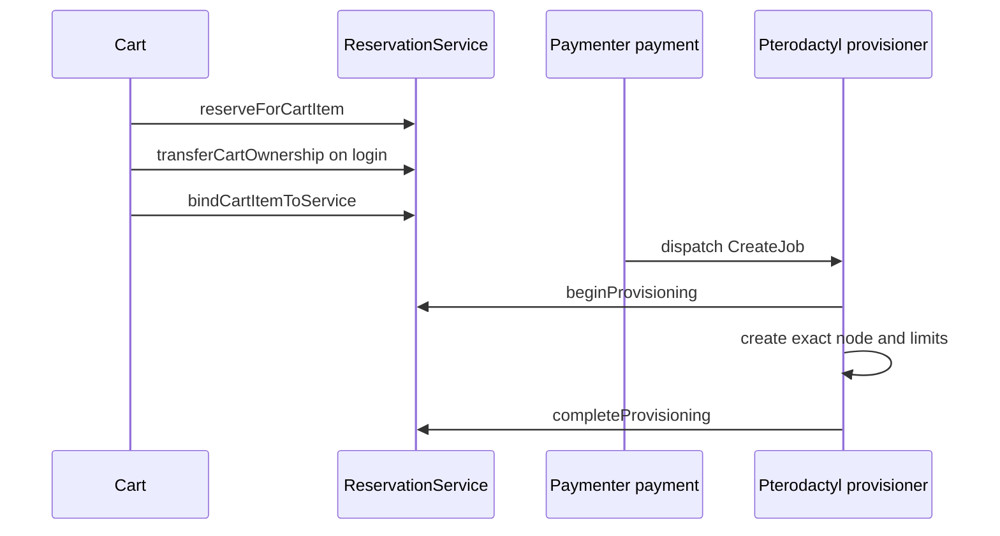

# Checkout and Provisioning Lifecycle

The reservation is server-owned from cart mutation through Pterodactyl creation.

## Cart create and update

`CartItem\Created` and `CartItem\Updated` use `CartItemCreatedListener`. The listener delegates to `reserveForCartItem()` and intentionally lets errors bubble. Paymenter wraps `Cart::add()` and quantity edits in a database transaction, so insufficient capacity or an unavailable extension rolls back the cart mutation.

Changing plan, resources, quantity, location, currency, or price changes the canonical fingerprint. The old pending row is cancelled and replaced under a location lock. An exact retry refreshes the existing hold.

## Guest login

`UserAuthListener` updates the cart owner and calls `transferCartOwnership()` in one database transaction. Existing non-null ownership must match; it is never silently overwritten.

## Checkout

Paymenter refreshes each dynamic hold before creating orders. After the service and its config/property rows exist, `bindCartItemToService()`:

- proves the current cart snapshot matches the stored fingerprint;
- proves product, plan, quantity, and currency match the service;
- transfers a guest owner if needed;
- assigns `service_id`;
- extends expiry through the invoice due time.

Missing extension, missing hold, expired hold, or identity drift aborts and rolls back checkout.

## Cart removal

`CartItem\Deleting` calls `cancelForCartItem()` while the relationship still exists. Bound checkout rows are not cancelled. Clearing the cart after checkout nulls the cart-item FK but preserves `cart_id` and `service_id`.

## Payment and provisioning

There is no invoice-paid reservation listener. Paymenter dispatches provisioning before `Invoice\Paid`, so confirmation there would be too late.

The built-in Pterodactyl `createServer()` calls `beginProvisioning()` directly. The returned context overrides the actual lowercase `node`, `location`, `memory`, `cpu`, and `disk` settings. The row remains pending while the external request runs.

After a successful server create, `completeProvisioning()` marks it confirmed and records `consumed_at`. Failure clears only the provisioning lease. If the server exists on retry, the provisioner reconciles the row and returns the existing server instead of duplicating it.
