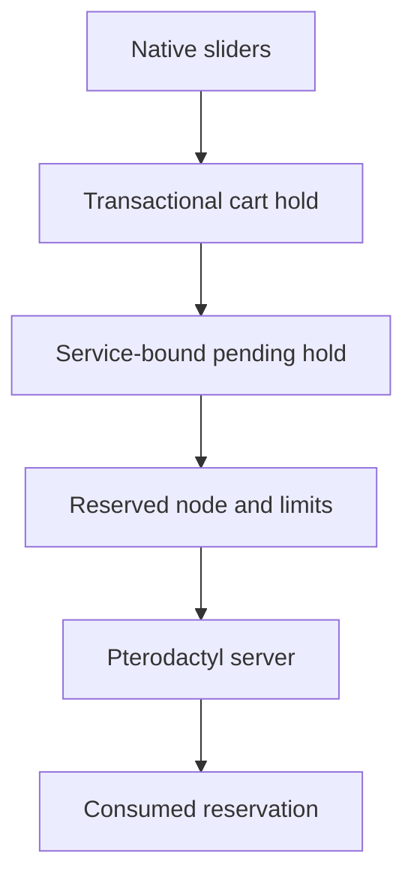

# Dynamic Pterodactyl

Companion extension for Paymenter 1.5.6 that adds native RAM/CPU/disk sliders, live memory/disk capacity holds, deterministic node selection, and Filament 5 administration to the built-in Pterodactyl server extension.

## Ownership

| Concern | Authority |
|---|---|
| Slider UI and price calculation | Paymenter core |
| Checkout capacity identity and node selection | Dynamic Pterodactyl |
| Server creation and actual allocation | Built-in Pterodactyl extension |

The browser never owns a reservation. A synchronous cart listener creates one server-owned hold, checkout binds it to the service, and the provisioner consumes it only after Pterodactyl accepts the server.

## Safety properties

- Paymenter baseline is 1.5.6.
- Cart create/edit and checkout fail closed for dynamic products.
- Guest ownership transfers with the cart in one transaction.
- The immutable fingerprint covers customer, cart, Paymenter server extension, hashed panel identity, product, plan, location, node, resources, quantity, currency, pricing version, and formula version.
- Holds remain pending through payment and external provisioning.
- The actual Pterodactyl request uses the reserved `node`, `memory`, `cpu`, and `disk`.
- Config keys are lowercase and dynamic `ServiceConfig.slider_value` is serialized correctly.
- CPU is a provisioned limit, not fabricated hard node inventory.
- Customer reservation tokens and reservation endpoints do not exist.

## Documentation

| Document | Topic |
|---|---|
| [01-DATABASE.md](01-DATABASE.md) | Reservation schema and lifecycle |
| [02-SERVICES.md](02-SERVICES.md) | Service responsibilities |
| [03-API.md](03-API.md) | Live customer/admin routes |
| [04-EVENTS.md](04-EVENTS.md) | Cart, login, checkout, and provisioning flow |
| [05-ADMIN-UI.md](05-ADMIN-UI.md) | Filament admin surfaces |
| [06-FRONTEND.md](06-FRONTEND.md) | Native slider frontend |
| [07-PRICING-MODELS.md](07-PRICING-MODELS.md) | Core-owned pricing models |
| [08-ALGORITHMS.md](08-ALGORITHMS.md) | Capacity and concurrency |
| [09-IMPLEMENTATION.md](09-IMPLEMENTATION.md) | Deployment and verification |

## Installation boundary

This extension must be deployed with the companion Paymenter remediation branch. Run the Paymenter and extension migrations together, then execute both test suites against a dedicated test database.

The extension stores no cached Pterodactyl capacity. Customer responses expose aggregate location signals only; raw node data remains admin-only.
