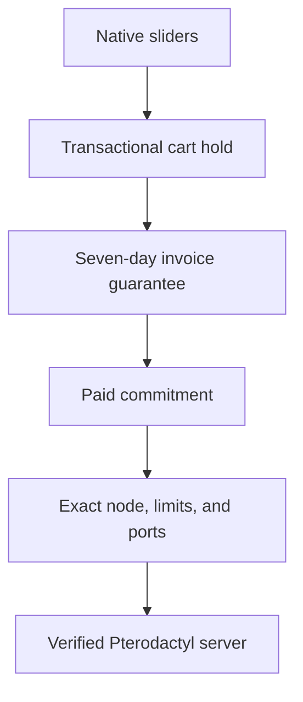

# Dynamic Pterodactyl

Companion extension for Paymenter 1.5.7 that adds native RAM/CPU/disk
sliders, live complete-vector stock, exact port reservations, deterministic
node selection, capacity-aware upgrades, and Filament 5 administration to the
built-in Pterodactyl server extension.

Production deployments require Pterodactyl Panel and Wings 1.12.3 or newer.
The stock and provisioning API contracts are verified against Panel 1.12.3,
but a real-panel staging canary remains a release gate.

## Ownership

| Concern | Authority |
|---|---|
| Slider UI and price calculation | Paymenter core |
| Checkout capacity identity and node selection | Dynamic Pterodactyl |
| Server creation and actual allocation | Built-in Pterodactyl extension |

The browser never owns a reservation. A synchronous cart listener creates one server-owned hold, checkout binds it to the service, and the provisioner consumes it only after Pterodactyl accepts the server.

## Safety properties

- Paymenter baseline is 1.5.7.
- Cart create/edit and checkout fail closed for dynamic products.
- Guest ownership transfers with the cart in one transaction.
- The immutable fingerprint covers customer, cart, Paymenter server extension, hashed panel identity, product, plan, location, node, resources, quantity, currency, pricing version, and formula version.
- A 15-minute cart hold becomes an exact seven-day invoice guarantee at
  checkout. Payment converts it to a non-expiring `paid_committed` commitment.
- The actual Pterodactyl request uses the reserved `node`, `memory`, `cpu`,
  `disk`, primary allocation, and additional allocations.
- The Paymenter service stays `provisioning` until the external server and its
  complete allocation set match the immutable commitment.
- Config keys are lowercase and dynamic `ServiceConfig.slider_value` is serialized correctly.
- CPU is authoritative stock backed by an explicit per-node physical capacity
  and configurable basis-point overcommit policy. Nodes without an enabled
  policy are ineligible.
- Enabled capacity-policy nodes are dedicated to the reservation-backed flow;
  external administrators and automation must not mutate their stock.
- Dynamic resource upgrades reserve a positive capacity delta on the server's
  existing node and reconcile the exact build before local billing state moves.
- Dynamic products force quantity to one.
- Customer reservation tokens and reservation endpoints do not exist.

## Documentation

| Document | Topic |
|---|---|
| [01-DATABASE.md](01-DATABASE.md) | Reservation schema and lifecycle |
| [02-SERVICES.md](02-SERVICES.md) | Service responsibilities |
| [03-API.md](03-API.md) | Live customer/admin routes |
| [04-EVENTS.md](04-EVENTS.md) | Cart, login, checkout, and provisioning flow |
| [05-ADMIN-UI.md](05-ADMIN-UI.md) | Filament admin surfaces |
| [06-FRONTEND.md](06-FRONTEND.md) | Native slider frontend |
| [07-PRICING-MODELS.md](07-PRICING-MODELS.md) | Core-owned pricing models |
| [08-ALGORITHMS.md](08-ALGORITHMS.md) | Capacity and concurrency |
| [09-IMPLEMENTATION.md](09-IMPLEMENTATION.md) | Deployment and verification |

## Installation boundary

This extension must be deployed with the companion Paymenter remediation
branch. Enter maintenance mode, deploy and migrate Paymenter core first, run
the extension migration/readiness gate, restart queue workers, and then leave
maintenance mode. Migrations are forward-only: a failure after schema
activation must remain in maintenance for operator recovery.

The extension stores no cached Pterodactyl capacity. Customer responses expose aggregate location signals only; raw node data remains admin-only.
